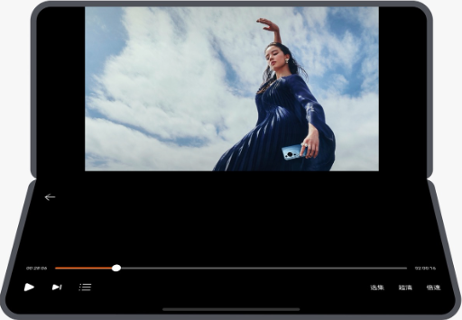
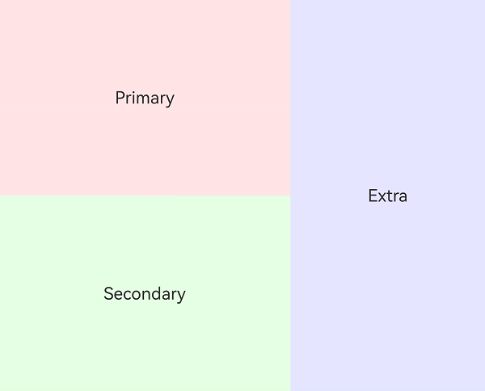
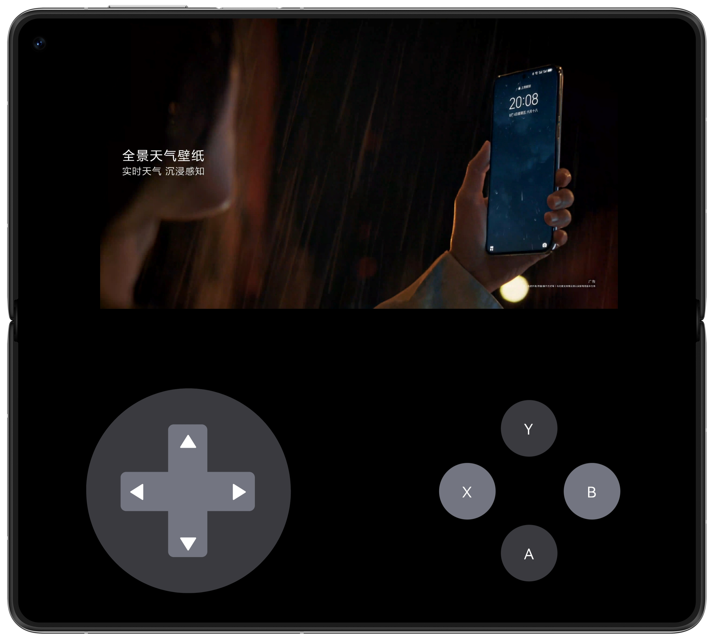
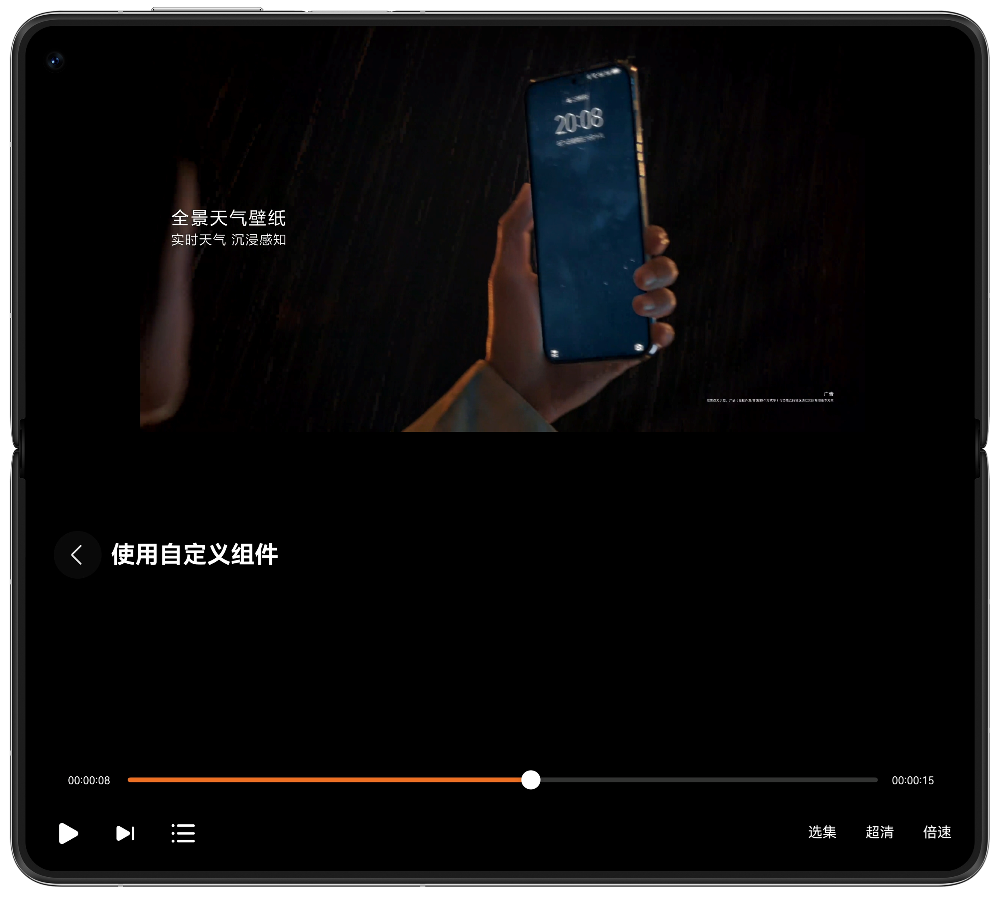

# 折叠屏悬停态

更新时间：2026-05-18 00:55:31

来源：https://developer.huawei.com/consumer/cn/doc/best-practices/bpta-folded-hover

##### 概述

折叠屏提供独特的手持操作体验“悬停态”，用户可以将设备半折后立在桌面上，实现免手持体验。悬停态适用于不需要频繁交互的任务，如视频通话、视频播放、拍照和听歌。进入悬停态时，中间弯折区域难以操作且显示内容会变形，建议页面内容进行折痕区避让适配。
 


 
本文提供折叠屏悬停态的三种实现方式，并根据其特点给出各自的适用场景。
 
- [使用FolderStack组件实现悬停态](#section9671184110015)，适用于视频全屏播放等交互少的场景。
- [使用FoldSplitContainer组件实现悬停态](#section122423387410)，适用于分栏显示内容的场景，例如游戏画面和操作区域。
- [自定义实现悬停态](#section4691264319)，适用于页面布局复杂和悬停态触发动作自定义的场景。

 
实现悬停态的三种方式中，FolderStack组件使用简便，无需关注设备状态，支持自定义页面布局。FoldSplitContainer组件同样易于使用，但其固定的二分栏和三分栏布局限制了使用场景。自定义实现悬停态需要开发者自行监听设备状态并调整组件布局，支持自定义布局，且由于自实现悬停态监听，可以限制设备进入悬停态的场景（例如仅允许在横屏下半折叠时进入悬停态）以及自定义窗口旋转策略，使用更加灵活。
  
|    | FolderStack | FoldSplitContainer | 自定义实现悬停态 |
| --- | --- | --- | --- |
| 展开态/折叠态是否支持自定义布局 | 支持 | 不支持，固定二分栏/三分栏 | 支持 |
| 是否支持由其他页面进入悬停态页面 | 支持 | 支持 | 支持 |
| 是否支持自定义设备状态进入悬停态页面 | 不支持 | 不支持 | 支持 |
| 是否支持自定义悬停态窗口旋转策略 | 不支持 | 不支持 | 支持 |
| 开发难度 | 简单 | 简单 | 困难 |
 
 
本文以视频播放类应用的全屏播放页面为例，介绍FolderStack的自定义悬停态实现。同时，以游戏界面为例，介绍FoldSplitContainer的悬停态实现。
 



 
 

##### 使用FolderStack组件实现悬停态

 

##### 实现原理

[FolderStack](https://developer.huawei.com/consumer/cn/doc/harmonyos-references/ts-container-folderstack)是系统提供的ArkTS组件，继承自[层叠布局Stack](https://developer.huawei.com/consumer/cn/doc/harmonyos-guides/arkts-layout-development-stack-layout)。在Stack组件的基础上，FolderStack提供监控设备是否进入悬停态并进行重新布局的能力。
 
FolderStack通过upperItems字段来实现悬停态布局，当设备进入悬停态时，被upperItems字段修饰的组件会堆叠在上半屏，其他未被修饰的组件会堆叠在下半屏并且自动避让折叠屏折痕区。
 
> [!NOTE]
> FolderStack需要撑满页面全屏，如果不撑满页面全屏，则只作为普通Stack使用。

 
 

##### 开发步骤

使用FolderStack组件实现悬停态的代码时，将页面的父容器设置为FolderStack，并将视频播放组件的ID注册到upperItems数组中。这样，悬停态时视频播放组件会自动调整到上半屏显示，视频控制组件和顶部返回组件则显示在下半屏。
 
```ArkTS
FolderStack({ upperItems: ['upper'] }) {
  VideoPlayView({ avPlayerUtil: this.avPlayerUtil })
    .id('upper')

  VideoControlView({ avPlayerUtil: this.avPlayerUtil })

  BackTitleView({
    title: Const.PAGE_TITLES[0]
  })
}
```
 



 
 

##### 使用FoldSplitContainer组件实现悬停态

 

##### 实现原理

[FoldSplitContainer](https://developer.huawei.com/consumer/cn/doc/harmonyos-references/ohos-arkui-advanced-foldsplitcontainer)是系统提供的分栏类型的ArkTS组件，可以实现折叠屏二分栏、三分栏在展开态、悬停态以及折叠态的区域控制。其中二分栏是上下分栏，三分栏是在二分栏基础上加上侧边栏。
 
FoldSplitContainer的primary和secondary参数分别设置二分栏的上下区域的布局，extra参数设置三分栏中侧栏区域的布局；通过LayoutOptions参数设置各区域分栏的比例。当设备进入悬停态时，FoldSplitContainer会自动避让折叠屏折痕区。
 



 
 

##### 开发步骤

使用FoldSplitContainer组件实现悬停态的代码结构是将上下屏的组件分别注册到primary和secondary参数的回调中。这样页面呈现为上下分栏布局，并且会在悬停态自动避让折痕区域。二分栏结构已实现页面布局，因此未实现extra参数对应的侧栏。
 
```ArkTS
FoldSplitContainer({
  primary: () => {
    this.primaryArea();
  },
  secondary: () => {
    this.secondaryArea();
  }
})
```
 



 
 

##### 自定义实现悬停态

 

##### 实现原理

自定义悬停态布局需要在折叠屏进入半折叠态时通过设置窗口横向显示、规避折痕避让区，调整页面内组件的尺寸和位置来实现，可分为监听悬停态和调整布局两部分。
 1. 监听悬停态：通过[display.on('foldStatusChange')](https://developer.huawei.com/consumer/cn/doc/harmonyos-references/js-apis-display#displayonfoldstatuschange10)接口监听设备是否进入半折叠态，同时通过display的[orientation属性](https://developer.huawei.com/consumer/cn/doc/harmonyos-references/js-apis-display#属性)判断设备是否横屏，当两种状态都满足时即判断设备进入悬停态。
2. 调整布局：当设备进入悬停态后，通过[display.getCurrentFoldCreaseRegion()](https://developer.huawei.com/consumer/cn/doc/harmonyos-references/js-apis-display#displaygetcurrentfoldcreaseregion10)接口获取折叠屏折痕区域的位置和大小，计算并设置上下半屏组件的尺寸和位置完成悬停态布局。
 
> [!NOTE]
> 在退出应用或者退出需要监听折叠态变化的页面时，需要调用 display.off('foldStatusChange') 接口取消监听，避免出现意想不到的问题。

 
 

##### 开发步骤

自定义悬停态的视频播放页UI结构与FolderStack组件结构相同，只是将FolderStack替换为普通Stack组件，主要实现悬停态监听和组件重新布局。
 1. 悬停态通过状态变量isHover进行监听。当折叠屏的折叠状态变化时，判断当前是否为悬停态并更新isHover的值。定义监听折叠状态变化回调方法。

  
```ArkTS
private onFoldStatusChange: Callback<display.FoldStatus> = (data: display.FoldStatus) => {
  try {
    // ...
    let orientation: display.Orientation = display.getDefaultDisplaySync().orientation;

    if (this.pageID === 0 || this.pageID === 3) {
      if (data === display.FoldStatus.FOLD_STATUS_HALF_FOLDED && this.currentWidthBreakpoint === Const.BREAKPOINT_MD &&
        (orientation === display.Orientation.LANDSCAPE ||
          orientation === display.Orientation.LANDSCAPE_INVERTED)) {
        this.isHover = true;
        // ...
      } else {
        this.isHover = false;
      }
    }
    // ...
  } catch (error) {
    hilog.error(0x0000, TAG, `onFoldStatusChange catch error, code: ${error.code}, message: ${error.message}`);
  }
};
```
 在display中注册方法，监听设备折叠状态变化。

  
```ArkTS
try {
  display.on('foldStatusChange', this.onFoldStatusChange);
} catch (exception) {
  hilog.error(0x0000, TAG, 'Failed to register onFoldStatusChange callback. Code: ' + JSON.stringify(exception));
}
```

2. 当设备处于悬停状态（isHover为true）时，页面内组件需要获取折痕区的大小和位置，方法如下。
```ArkTS
static getFoldCreaseRegion(): void {
  try {
    if (display.isFoldable()) {
      let foldRegion: display.FoldCreaseRegion = display.getCurrentFoldCreaseRegion();
      let rect: display.Rect = foldRegion.creaseRects[0];
      // Height of the avoidance area in the upper half screen and height of the avoidance area.
      let creaseRegion: number[] = [uiContext!.px2vp(rect.top), uiContext!.px2vp(rect.height)];
      AppStorage.setOrCreate('creaseRegion', creaseRegion);
    }
  } catch (error) {
    hilog.error(0x0000, TAG, `getFoldCreaseRegion catch error, code: ${error.code}, message: ${error.message}`);
  }
}
```

3. 根据折痕区的大小和位置调整布局。视频播放组件将上移至屏幕上方。

  
```ArkTS
Column() {
  XComponent({
    id: Const.X_COMPONENT_ID,
    type: XComponentType.SURFACE,
    controller: this.xComponentController
  })
    // ...
}
.height(this.isHover ? this.creaseRegion[0] : '100%')
```
 视频控制组件位于下半屏，无需调整。

  顶部返回组件应移动到屏幕下半部分的顶部。

  
```ArkTS
Row() {
  // ...
}
.width('80%')
.height('24vp')
.justifyContent(FlexAlign.Start)
.position({
  x: '24vp',
  y: this.isHover ? this.creaseRegion[0] + this.creaseRegion[1] + 36 : '36vp'
})
```

 


 
 

##### 示例代码

- [实现折叠屏悬停态](https://gitcode.com/harmonyos_samples/FoldedHover)
