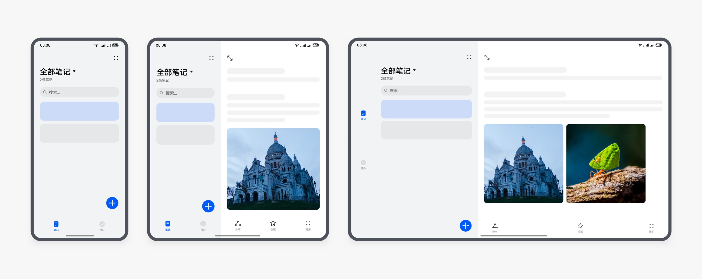
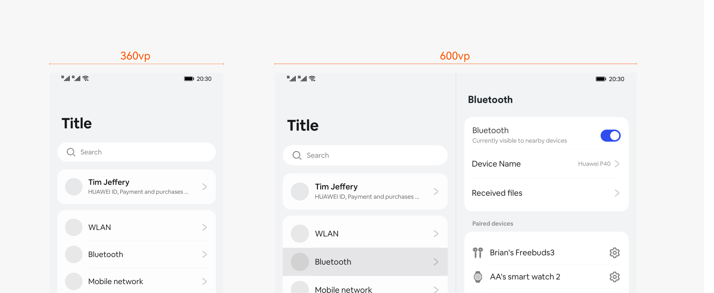
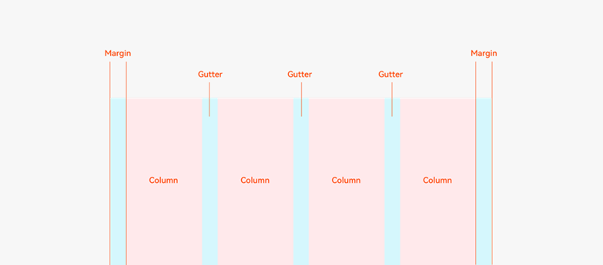
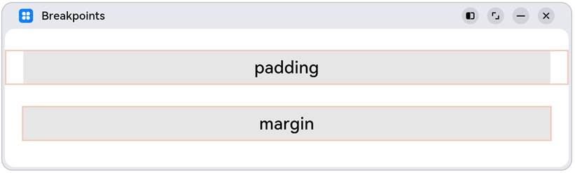
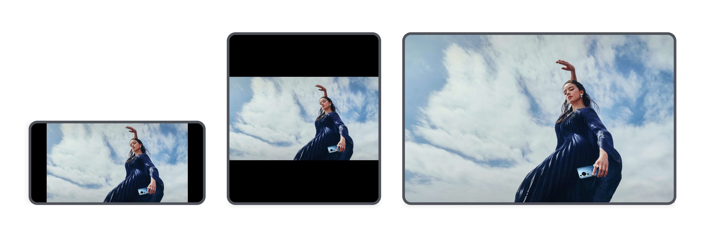
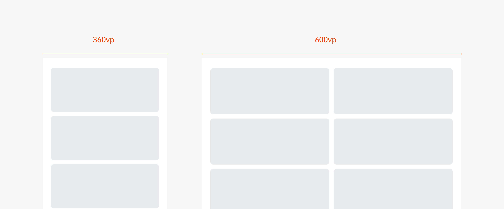

# 响应式布局

更新时间：2026-05-18 00:55:31

来源：https://developer.huawei.com/consumer/cn/doc/best-practices/bpta-multi-device-responsive-layout

**   


#### 概述

响应式设计（Responsive Web Design，简称RWD）在Web网站设计领域是一种网页设计方法论，旨在让网站在不同设备和屏幕尺寸上都能提供良好的阅读和交互体验，而无需为每一个新设备或屏幕尺寸创建单独的版本。这种设计方法的核心在于页面布局和内容可以根据用户所使用的设备特性（如屏幕尺寸、分辨率、方向等）进行灵活调整。
 
响应式设计在HarmonyOS中的应用主要体现在UI开发上，目的是确保应用能够在搭载HarmonyOS的多种设备上，包括不同屏幕尺寸和分辨率的设备，提供一致且优秀的用户体验。HarmonyOS为此提供了一系列的响应式布局能力和工具，用来实现多端布局。
 
响应式布局是基于响应式设计方法论进行布局的方法，核心思想是页面根据不同屏幕尺寸自动调整布局，提供更舒适的界面和更好的用户体验。响应式布局页面的效果图如下：
 
图1 **响应式布局示意图1**


 
图2 **响应式布局示意图2**


 
本文将详细介绍实现响应式布局的四种响应式布局能力，帮助开发者实现响应式布局效果。
  
| 响应式布局能力 | 简介 |
| --- | --- |
| 断点 | 将窗口宽度划分为不同的范围（即断点），监听窗口尺寸变化，当断点改变时同步调整页面布局。 |
| 媒体查询 | 媒体查询支持监听窗口宽度、横竖屏、深浅色、设备类型等多种媒体特征，当媒体特征发生改变时同步调整页面布局。 |
| 栅格 | 栅格组件将其所在的区域划分为有规律的多列，通过调整不同断点下的栅格组件的参数以及其子组件占据的列数等，实现不同的布局效果。 |
| 响应式组件 | HarmonyOS提供的一些组件支持响应式布局，例如： Tabs、Swiper、Grid、List、GridRow，通过断点设置可以实现不同的展示效果。 |
 
 
 

#### 断点

响应式布局是指页面内的元素可以根据特定的特征（如窗口宽度、屏幕方向等）自动变化以适应外部容器变化的布局能力。响应式布局中最常使用的特征是窗口宽度及窗口高宽比，可以将窗口宽度及窗口高宽比划分为不同的范围，称之为“断点”。当窗口宽度及窗口高宽比从一个断点变化到另一个断点时，改变页面布局（如将页面内容从单列排布调整为双列排布甚至三列排布等）以获得更好的显示效果。
 
本章节将通过详细介绍断点的设计原理、定义以及使用，帮助开发者掌握通过断点实现响应式布局。
 
 

#### 断点的设计原理

提升全场景体验，需考虑多设备连续性。应用页面布局设计时推荐遵循以下原则：
 
- 原则一：两个宽度相近的窗口，页面布局相同，断点归一。
- 原则二：高度相对宽度较小的窗口，呈现横向窗口或类方形窗口时，页面布局进行差异化设计，增加断点。

 
因此，系统设计了横向和纵向断点分别代表窗口的不同特征，作为判断页面布局和交互体验的条件：
 
- 横向断点以窗口宽度值区分，代表窗口宽度。
- 纵向断点以窗口高宽比区分，代表窗口相对高度，表示横向、方形或纵向窗口。

 
下文[横向断点的使用案例](#section565041813314)章节将介绍如何使用横向断点实现原则一，[纵向断点的使用案例](#section8955133118444)章节将介绍如何结合横向和纵向断点实现原则二。
 
 

#### 断点的定义

横向断点以应用窗口宽度为判断条件，建议划分为如下几个区间：
  
| 断点名称 | 窗口宽度（vp） |
| --- | --- |
| xs | (0, 320） |
| sm | [320, 600) |
| md | [600, 840) |
| lg | [840, 1440) |
| xl | [1440, +∞) |
 
 
纵向断点根据应用窗口的高宽比进行判断，建议划分为如下几个区间：
  
| 断点名称 | 高宽比 |
| --- | --- |
| sm | (0, 0.8) |
| md | [0.8, 1.2) |
| lg | [1.2, +∞) |
 
 

 
图3 **HarmonyOS常用设备断点区间表**


 
> [!TIP]
> 由于官网无法涵盖所有产品的断点区间，说明中提供补充方法：开发者可通过 display 模块接口获取屏幕宽高属性，自行判断当前设备所属的横纵断点区间。 断点面向窗口而非设备类型，相同断点区间的窗口展示相同的页面布局。同一设备上的不同窗口形态（例如全屏显示、分屏显示、自由窗口等）可能落入不同的断点区间，展示不同布局。 部分手机、小折叠屏机型横屏/反向横屏时横向断点会落入lg，包括Pura70 Pro和Pocket2。 开发者可以根据实际使用场景决定适配哪些断点。如xs断点对应的一般是智能穿戴类设备，如果确定某页面不会在智能穿戴设备上显示，则可以不适配xs断点。 可以根据实际业务场景需要在lg断点后面新增xl、xxl等断点。

 
当前HarmonyOS主流设备窗口全屏时尺寸和横纵断点区间如下表所示。
  
| 产品类型 | 常见产品型号 | 窗口全屏时尺寸（以产品型号第一款举例，单位为vp） | 横向断点 | 纵向断点 |
| --- | --- | --- | --- | --- |
| 手机（竖屏/反向竖屏） | Mate60、Mate60 Pro、Mate70、Mate70 Pro、Pura60、Pura60 Pro、Pura70、Pura70 Pro | 827 * 374 | sm | lg |
| 阔折叠 | Pura X | 内屏（竖屏/反向竖屏）：707 * 440 | 内屏：sm | 内屏：lg |
| 阔折叠 | 外屏（反向横屏）：326 * 326 | Pura X | 外屏：sm | 外屏：md |
| 阔折叠 | Pura X Max | 内屏（横屏/反向横屏）：939 * 664 | 内屏：lg | 内屏：sm |
| Pura X Max | 外屏（竖屏）：459 * 672 | 外屏：sm | 外屏：lg |
| 小折叠 | Pocket 2 | 内屏（竖屏/反向竖屏）：860 * 364 | 内屏：sm | 内屏：lg |
| 小折叠 | 外屏：/ | Pocket 2 | 外屏：/ | 外屏：/ |
| 双折叠 | Mate X5、Mate X6 | 内屏（竖屏/反向竖屏）：798 * 711 | 内屏：md | 内屏：md |
| 双折叠 | 外屏（竖屏/反向竖屏）：801 * 345 | Mate X5、Mate X6 | 外屏：sm | 外屏：lg |
| 三折叠 | Mate XT | F态（单屏显示，竖屏/反向竖屏）：776 * 350 | F态（单屏显示）：sm | F态（单屏显示）：lg |
| 三折叠 | M态（双屏显示，竖屏/反向竖屏）：776 * 712 | Mate XT | M态（双屏显示）：md | M态（双屏显示）：md |
| 三折叠 | G态（三屏显示，横屏/反向横屏）：1107 * 776 | Mate XT | G态（三屏显示）：lg | G态（三屏显示）：sm |
| 平板（横屏/反向横屏） | MatePad、MatePad Pro | 1137 * 711 | lg | sm |
| 电脑 | MateBook Pro（横屏） | 1642 * 1094 | xl | sm |
| 电脑 | MateBook Fold（展开态横屏） | 1831 * 1307 | xl | sm |
| 智慧屏 | Mate TV | 1280 * 720 | lg | sm |
 
 
 

#### 通过断点刷新UI

**通过断点环境变量****刷新UI**
 
从API version 22起，开发者可利用响应式系统环境变量装饰器@Env读取断点信息。当组件所在窗口尺寸发生变化时，@Env装饰的断点环境变量将更新，并触发与该断点环境变量关联的组件刷新，从而实现界面内容的同步更新。装饰变量声明如下，更多场景请参考[@Env：环境变量](https://developer.huawei.com/consumer/cn/doc/harmonyos-guides/arkts-env-system-property)。
 
获取@Component/@ComponentV2所在窗口的环境变量信息后，当窗口尺寸变化时，断点环境变量将根据新的窗口尺寸更新，并触发相关UI组件的刷新。常见场景包括：
 
- 通过BuilderNode切换窗口后，触发断点环境变量重新获取断点信息。
- 横竖屏或折叠状态切换时，窗口的横纵向断点刷新，断点环境变量将同步更新。

 
断点环境变量具体使用方式请参考@Env：环境变量[使用场景](https://developer.huawei.com/consumer/cn/doc/harmonyos-guides/arkts-env-system-property#使用场景)。环境变量初始化流程请参考[@Env初始化流程](https://developer.huawei.com/consumer/cn/doc/harmonyos-guides/arkts-env-system-property#env初始化流程)。
 
**通过主动监听断点变化刷新UI**
 1. 使用自定义窗口信息类WindowInfo保存窗口断点信息。

  
```ArkTS
@Observed
export class WindowInfo {
  // ...
  // Width/height breakpoint.
  public widthBp: WidthBreakpoint = WidthBreakpoint.WIDTH_XS;
  public heightBp: HeightBreakpoint = HeightBreakpoint.HEIGHT_SM;
  // ...
}
```

2. WindowUtil类中创建窗口信息类对象，使用[getWindowWidthBreakpoint()](https://developer.huawei.com/consumer/cn/doc/harmonyos-references/arkts-apis-uicontext-uicontext#getwindowwidthbreakpoint13)与[getWindowHeightBreakpoint()](https://developer.huawei.com/consumer/cn/doc/harmonyos-references/arkts-apis-uicontext-uicontext#getwindowheightbreakpoint13)获取当前窗口横向断点与纵向断点。通过[on('windowSizeChange')](https://developer.huawei.com/consumer/cn/doc/harmonyos-references/arkts-apis-window-window#onwindowsizechange7)开启窗口尺寸变化的监听，并在监听回调中重新获取断点。

  
```ArkTS
export class WindowUtil {
  // ...
  public mainWindowInfo: WindowInfo = new WindowInfo();
  // ...
  public onWindowSizeChange: (windowSize: window.Size) => void = (windowSize: window.Size) => {
    this.mainWindowInfo.windowSize = windowSize;
    this.mainWindowInfo.widthBp = this.uiContext!.getWindowWidthBreakpoint();
    this.mainWindowInfo.heightBp = this.uiContext!.getWindowHeightBreakpoint();
  };
  // ...
  updateWindowInfo(): void {
    try {
      // ...
      // First time get width/height breakpoint.
      this.mainWindowInfo.widthBp = this.uiContext!.getWindowWidthBreakpoint();
      this.mainWindowInfo.heightBp = this.uiContext!.getWindowHeightBreakpoint();
      // Register for window size change monitoring, update window size and width/height breakpoint.
      this.mainWindow.on('windowSizeChange', this.onWindowSizeChange);
      // ...
    } catch (error) {
      let err = error as BusinessError;
      hilog.error(0x0000, `TestLog`, `Failed to update window info. Code: ${err.code}, message: ${err.message}`);
    }
  }
  // ...
}
```

3. 在EntryAbility的onWindowStageCreate()生命周期中，获取应用窗口实例，对WindowUtil进行初始化操作，并保存至AppStorage中。在loadContent加载完页面后，完成断点监听注册、断点更新等操作。完成上述步骤后，当窗口尺寸发生变化时，更新横纵断点。

  
```ArkTS
onWindowStageCreate(windowStage: window.WindowStage): void {
  // ...
  try {
    this.windowUtil = new WindowUtil(windowStage.getMainWindowSync());
  } catch (error) {
    let err = error as BusinessError;
    hilog.error(0x0000, 'TestLog', `Failed to get main window. Code: ${err.code}, message: ${err.message}`);
  }
  AppStorage.setOrCreate('windowUtil', this.windowUtil);

  windowStage.loadContent('pages/Index', (err) => {
    // ...
    this.windowUtil!.setUIContext();
    this.windowUtil!.setImmersiveType(ImmersiveType.IMMERSIVE);
    this.windowUtil!.updateWindowInfo();
  });
}
```

4. 使用@StorageLink装饰器获取窗口管理类WindowUtil对象，子组件初始化时传递窗口信息类对象，使子组件可以获取当前窗口的断点信息。

  
```ArkTS
@Component
export struct GridLayout {
  @StorageLink('windowUtil') windowUtil: WindowUtil | undefined = undefined;
  pageInfos: NavPathStack = new NavPathStack();

  build() {
    NavDestination() {
      GridView({
        mainWindowInfo: this.windowUtil?.mainWindowInfo,
        pageInfos: this.pageInfos
      })
    }
    // ...
  }
}
```

5. 使用@ObjectLink装饰器接收窗口信息类对象，根据获取的窗口信息，对不同断点区间进行针对性布局。如下示例代码完成了在不同断点下，Grid组件显示不同数量列的功能。

  
```ArkTS
@Component
export struct GridView {
  @ObjectLink mainWindowInfo: WindowInfo;
  // ...

  build() {
    Scroll() {
      Column() {
        // ...
        Grid() {
          // ...
        }
        .width('100%')
        .columnsTemplate(`repeat(${new WidthBreakpointType(2, 3, 4, 4).getValue(this.mainWindowInfo.widthBp)}, 1fr)`)
        .columnsGap(12)
        .rowsGap(12)
      }
      // ...
    }
    // ...
  }
}
```

 
 

#### 横向断点的使用案例

针对布局拉通（两个宽度相近的窗口，页面布局应保持一致），本章节介绍实际开发中横向断点的使用。
 
实现多设备应用时，首先根据不同设备类型对应的横向断点集合，规划多种设计方案。例如，应用需要支持手机、双折叠（Mate X系列）和平板，需要考虑的三个横向断点分别是sm、md和lg，并设计相应页面布局。设计效果图如下：
  
| sm | md | lg |
| --- | --- | --- |
|  |  |  |
 
 
在实际应用开发中，可能不会涉及到全部的横向断点。开发者可以根据应用的实际需求，灵活选用并整理工具类，为响应式布局的属性赋值。例如，如果应用仅需适配手机、双折叠和平板设备，可以设计工具类 “WidthBreakpointType”，覆盖三个横向断点下的成员变量，从而实现具体的响应式布局。
 
```ArkTS
export class WidthBreakpointType<T> {
  sm: T;
  md: T;
  lg: T;
  xl: T;

  constructor(sm: T, md: T, lg: T, xl: T) {
    this.sm = sm;
    this.md = md;
    this.lg = lg;
    this.xl = xl
  }

  getValue(widthBp: WidthBreakpoint): T {
    if (widthBp === WidthBreakpoint.WIDTH_XS || widthBp === WidthBreakpoint.WIDTH_SM) {
      return this.sm;
    }
    if (widthBp === WidthBreakpoint.WIDTH_MD) {
      return this.md;
    }
    if (widthBp === WidthBreakpoint.WIDTH_LG) {
      return this.lg;
    } else {
      return this.xl;
    }
  }
}
```
 
在实际开发中，设置不同断点下的字体大小。例如，在sm、md、lg横向断点下，字体大小分别为14fp、16fp、18fp，通过工具类BreakpointType为属性赋值。
 
```ArkTS
Text('Test')
  .fontSize(new BreakpointType('14fp', '16fp', '18fp').getValue(this.currentWidthBreakpoint))
```
 
在sm和md横向断点下，字体大小为14fp；在lg断点下，字体大小为16fp。使用三元表达式结合横向断点为属性赋值。
 
```ArkTS
Text('Test')
  .fontSize(this.currentWidthBreakpoint === WidthBreakpoint.WIDTH_LG ? '16fp' : '14fp')
```
 
 

#### 纵向断点的使用案例

针对高度相对宽度较小的窗口（如横向窗口或类方形窗口），本章节将介绍如何在实际开发中结合使用横向断点和纵向断点进行特殊布局设计。
 
系统推荐以下方式判断横向窗口或类方形窗口，并展示特殊页面布局。
  
| 窗口类型 | 横向窗口 | 类方形窗口 |
| --- | --- | --- |
| 效果图 |  |  |
| 判断条件 | 纵向断点为sm或窗口高宽比小于0.8 | 纵向断点为md或窗口高宽比在[0.8, 1.2)之间 |
 
 
```ArkTS
// Judgment of the horizontal window. (The actual application may need to be combined with other conditions, for example, determine the horizontal breakpoint)
if (this.currentHeightBreakpoint === HeightBreakpoint.HEIGHT_SM &&
  this.currentWidthBreakpoint === WidthBreakpoint.WIDTH_MD) {
  // Horizontal window page layout.
}
// Judgment of the square window. (The actual use may need to be combined with other conditions, such as determining horizontal breakpoints)
if (this.currentHeightBreakpoint === HeightBreakpoint.HEIGHT_MD &&
  this.currentWidthBreakpoint === WidthBreakpoint.WIDTH_SM) {
  // Square-like window page layout.
}
```
 
**独特的小窗口布局**
 
为了提供独特的用户体验，类方形小窗口设计为独特布局。常见场景为手机上下1:1分屏或小方形屏（如Pura X系列产品的外屏），可使用横向断点为sm，纵向断点为md进行区分，示意图如下。更多详情和示例代码请参考[阔折叠应用开发](https://developer.huawei.com/consumer/cn/doc/best-practices/bpta-purax-guide)。
 


 
**类方屏旋转方案**
 
在Mate X5内屏等类方屏窗口场景中，设计应用窗口支持旋转，以满足不同用户的体验需求。
 
判断纵向断点为md时，通过[window.setPreferredOrientation()](https://developer.huawei.com/consumer/cn/doc/harmonyos-references/arkts-apis-window-window#setpreferredorientation9-1)设置窗口支持旋转。
 
```ArkTS
let currentHeightBreakpoint: HeightBreakpoint | undefined = AppStorage.get('currentHeightBreakpoint');
if (currentHeightBreakpoint === HeightBreakpoint.HEIGHT_MD) {
  this.mainWindowClass?.setPreferredOrientation(window.Orientation.AUTO_ROTATION_RESTRICTED).catch((error: BusinessError) => {
    hilog.error(0x0000, 'VideoExample',
      `setPreferredOrientation failed. code=${error.code}, message = ${error.message}`);
  });
}
```
 
> [!NOTE]
> 应用设置窗口旋转方案需要结合多种条件一起判断，详情可参考 为多设备配置旋转策略 。 Pura X外屏默认不支持窗口旋转。

 
**其他特殊场景**
 
除了独特的小窗口布局和类方屏旋转方案外，在开发过程中存在特殊场景，仅使用横向断点无法区分，需要结合横向断点和纵向断点进行判断。
 
本章节以视频类应用的全屏播放页为例。在手机横屏时，不支持旋转；在双折叠展开态和平板竖屏时，支持旋转。由于这三种场景的横向断点都在md范围内，无法区分，因此需要结合横向断点和纵向断点进行区分，以兼容多种设备的全屏播放窗口旋转方案。
 



 1. 确保已完成[通过断点刷新UI](#section175001836203617)中步骤5和步骤6的初始化操作。
2. 使用@Watch装饰器监听状态变量isFullScreen的变化，以判断视频是否全屏播放，并在显示或隐藏时同步修改窗口方向。全屏播放时，未使用断点的窗口设置逻辑如下：需要将窗口设置为AUTO_ROTATION_LANDSCAPE属性的情况包括手机、双折叠屏（X 系列）的折叠态与半折态。

  图4 ****手机效果图****


  图5 ****双折叠屏（X系列）半折态****



  **反例：**

  
```ArkTS
if (this.isFullScreen) {
  if (deviceInfo.deviceType !== '2in1') {
    this.windowUtil!.disableWindowSystemBar();
  }
  try {
    if ((!display.isFoldable() && deviceInfo.deviceType === 'phone') ||
      display.getFoldStatus() === display.FoldStatus.FOLD_STATUS_FOLDED) {
      this.windowUtil!.setMainWindowOrientation(window.Orientation.AUTO_ROTATION_LANDSCAPE);
    }
    if (display.isFoldable()) {
      if (this.isHalfFolded) {
        this.windowUtil!.setMainWindowOrientation(window.Orientation.AUTO_ROTATION_LANDSCAPE);
      }
    }
  } catch (error) {
    let err = error as BusinessError
    hilog.error(0x0000, 'VideoExample',
      `setMainWindowOrientation failed. code=${err.code}, message = ${err.message}`);
  }
}
```
 在进入全屏页时，通过isFoldable、deviceType和getFoldStatus三个值共同判断，这种方式可读性和维护性较差。随着鸿蒙生态的拓展，不同设备上可能会出现各种异常情况。

  **正例：**

  
- 双折叠屏（X系列）展开态与平板，支持旋转。双折叠屏（X系列）的横向断点为md，纵向断点为md；平板横向持握时横向断点为lg，竖向持握时横向断点为md，纵向断点为lg。将窗口显示方向设置为AUTO_ROTATION_RESTRICTED。

3. 手机与双折叠屏（X系列）折叠态竖屏时的横向断点为sm，纵向断点为lg，全屏播放时支持横向旋转。将窗口显示方向设置为AUTO_ROTATION_LANDSCAPE_RESTRICTED。

4. 手机与双折叠屏（X系列）折叠态横屏时的横向断点为md，纵向断点为sm，此时如果退出全屏播放，则竖屏展示布局。将窗口显示方向设置为PORTRAIT。
> [!NOTE]
> 本案例未覆盖部分手机（如Pocket 2、Pura 70Pro）横屏时横向断点落入lg的情况。


  
```ArkTS
// entry/src/main/ets/page/VideoExample.ets
  private onFullScreenChange(): void {
    // Large folding screen (X series) in unfolded state and tablet state, supporting rotation && large folding screen (X series) in hover state requires landscape display and does not support rotation.
    if (((this.currentWidthBreakpoint === WidthBreakpoint.WIDTH_MD && this.currentHeightBreakpoint !==
    HeightBreakpoint.HEIGHT_SM) || this.currentWidthBreakpoint === WidthBreakpoint.WIDTH_LG) &&
      !this.isHalfFolded) {
      this.windowUtil?.setMainWindowOrientation(window.Orientation.AUTO_ROTATION_RESTRICTED);
    }
    // Phone and large folding screen (X series) in portrait mode.
    else if (this.currentWidthBreakpoint === WidthBreakpoint.WIDTH_SM && this.currentHeightBreakpoint ===
    HeightBreakpoint.HEIGHT_LG) {
      // In full-screen mode, the layout is displayed in landscape mode. Otherwise, the layout is displayed in portrait mode.
      if (this.isFullScreen) {
        this.windowUtil?.setMainWindowOrientation(window.Orientation.AUTO_ROTATION_LANDSCAPE_RESTRICTED);
      } else {
        this.windowUtil?.setMainWindowOrientation(window.Orientation.PORTRAIT);
      }
    }
    // When the mobile phone and large folding screen (X series) are folded in landscape mode and the playback is not in full screen mode, the vertical display layout is displayed.
    else if (this.currentWidthBreakpoint === WidthBreakpoint.WIDTH_MD && this.currentHeightBreakpoint ===
    HeightBreakpoint.HEIGHT_SM && !this.isFullScreen) {
      this.windowUtil?.setMainWindowOrientation(window.Orientation.PORTRAIT);
    }
    // The navigation bar is not hidden on a 2in1 device.
    if (deviceInfo.deviceType !== '2in1') {
      // The navigation bar is hidden in full-screen playback. Otherwise, the navigation bar is displayed.
      if (this.isFullScreen) {
        this.windowUtil!.disableWindowSystemBar();
      } else {
        this.windowUtil!.enableWindowSystemBar();
      }
    }
  }
}
```


  通过纵向和横向断点替换之前的逻辑，开发者只需维护一套方案。这实现了“全屏播放”页在多设备上的兼容。在实际开发中，多设备兼容均可采用此方案进行适配。

  

  #### 媒体查询

  在实际应用开发过程中，开发者常常需要针对不同类型设备或同一类型设备的不同状态来修改应用的样式。媒体查询提供了丰富的媒体特征监听能力，可以监听应用显示区域变化、横竖屏、深浅色、设备类型等，因此在应用开发过程中使用的非常广泛。

  本小节主要介绍媒体查询跟断点的结合，即如何借助媒体查询能力，监听断点的变化，关于媒体查询的相关介绍请参见[媒体查询](https://developer.huawei.com/consumer/cn/doc/harmonyos-guides/arkts-layout-development-media-query)。

  **示例：**

  通过媒体查询，监听应用窗口宽度变化，获取当前应用所处的断点值。

| sm | md | lg |

| --- | --- | --- |

|  |  |  |

1. 对通过媒体查询监听[断点](#section1532120147301)的功能做简单的封装，方便后续使用。
```ArkTS
import { mediaquery } from '@kit.ArkUI';

export type BreakpointType = 'xs' | 'sm' | 'md' | 'lg' | 'xl' | 'xxl';

export interface Breakpoint {
  name: BreakpointType
  size: number
  mediaQueryListener?: mediaquery.MediaQueryListener
}

export class BreakpointSystem {
  private static instance: BreakpointSystem;
  private readonly breakpoints: Breakpoint[] = [
    { name: 'xs', size: 0 },
    { name: 'sm', size: 320 },
    { name: 'md', size: 600 },
    { name: 'lg', size: 840 }
  ]
  private states: Set<BreakpointState<Object>>;

  private constructor() {
    this.states = new Set();
  }

  public static getInstance(): BreakpointSystem {
    if (!BreakpointSystem.instance) {
      BreakpointSystem.instance = new BreakpointSystem();
    }
    return BreakpointSystem.instance;
  }

  public attach(state: BreakpointState<Object>): void {
    this.states.add(state);
  }

  public detach(state: BreakpointState<Object>): void {
    this.states.delete(state);
  }

  public start() {
    this.breakpoints.forEach((breakpoint: Breakpoint, index) => {
      let condition: string;
      if (index === this.breakpoints.length - 1) {
        condition = `(${breakpoint.size}vp<=width)`;
      } else {
        condition = `(${breakpoint.size}vp<=width<${this.breakpoints[index + 1].size}vp)`;
      }
      let uiContext = AppStorage.get('uiContext') as UIContext;
      breakpoint.mediaQueryListener = uiContext.getMediaQuery().matchMediaSync(condition);
      if (breakpoint.mediaQueryListener.matches) {
        this.updateAllState(breakpoint.name);
      }
      breakpoint.mediaQueryListener.on('change', (mediaQueryResult) => {
        if (mediaQueryResult.matches) {
          this.updateAllState(breakpoint.name);
        }
      });
    })
  }

  private updateAllState(type: BreakpointType): void {
    this.states.forEach(state => state.update(type));
  }

  public stop() {
    this.breakpoints.forEach((breakpoint: Breakpoint) => {
      if (breakpoint.mediaQueryListener) {
        breakpoint.mediaQueryListener.off('change');
      }
    })
    this.states.clear();
  }
}

export interface BreakpointOptions<T> {
  xs?: T;
  sm?: T;
  md?: T;
  lg?: T;
  xl?: T;
  xxl?: T;
}

export class BreakpointState<T extends Object> {
  public value: T | undefined = undefined;
  private options: BreakpointOptions<T>;

  constructor(options: BreakpointOptions<T>) {
    this.options = options;
  }

  static of<T extends Object>(options: BreakpointOptions<T>): BreakpointState<T> {
    return new BreakpointState(options);
  }

  public update(type: BreakpointType): void {
    if (type === 'xs') {
      this.value = this.options.xs;
    } else if (type === 'sm') {
      this.value = this.options.sm;
    } else if (type === 'md') {
      this.value = this.options.md;
    } else if (type === 'lg') {
      this.value = this.options.lg;
    } else if (type === 'xl') {
      this.value = this.options.xl;
    } else if (type === 'xxl') {
      this.value = this.options.xxl;
    } else {
      this.value = undefined;
    }
  }
}
```


2. 在页面中，通过媒体查询，监听应用窗口宽度变化，获取当前应用所处的断点值。
```ArkTS
import { BreakpointSystem, BreakpointState } from './Breakpoint';

@Entry
@Component
struct BreakpointSample {
  @State compStr: BreakpointState<string> = BreakpointState.of({ sm: 'sm', md: 'md', lg: 'lg' })
  @State compImg: BreakpointState<Resource> = BreakpointState.of({
    sm: $r('app.media.sm_new'),
    md: $r('app.media.md_new'),
    lg: $r('app.media.lg_new')
  });

  aboutToAppear() {
    BreakpointSystem.getInstance().attach(this.compStr);
    BreakpointSystem.getInstance().attach(this.compImg);
    BreakpointSystem.getInstance().start();
  }

  aboutToDisappear() {
    BreakpointSystem.getInstance().detach(this.compStr);
    BreakpointSystem.getInstance().detach(this.compImg);
    BreakpointSystem.getInstance().stop();
  }

  build() {
    Flex({ direction: FlexDirection.Column, alignItems: ItemAlign.Center, justifyContent: FlexAlign.Center }) {
      Column()
        .height(100)
        .width(100)
        .backgroundImage(this.compImg.value)
        .backgroundImagePosition(Alignment.Center)
        .backgroundImageSize(ImageSize.Contain)

      Text(this.compStr.value)
        .fontSize(24)
        .margin(10)
    }
    .width('100%')
    .height('100%')
  }
}
```


  

  #### 栅格

  栅格系统是一种用于页面布局的二维网格结构，多设备场景下通用的辅助定位工具。它将页面水平方向划分为等宽的列，通过设置内容占据的列数来实现灵活的布局。

  栅格可以显著降低适配不同屏幕尺寸的设计及开发成本，使得整体设计和开发流程更有秩序和节奏感，同时也保证多设备上应用显示的协调性和一致性，提升用户体验。

  HarmonyOS的栅格系统采用了12列设计，因为12可以被2、3、4、6整除，提供了更灵活的布局可能性。栅格布局主要优势包括：

1. 提供可循的规律：栅格布局可以为布局提供规律性的结构，解决多尺寸多设备的动态布局问题。通过将页面划分为等宽的列数和行数，可以方便地对页面元素进行定位和排版。

2. 统一的定位标注：栅格布局可以为系统提供一种统一的定位标注，保证不同设备上各个模块的布局一致性。这可以减少设计和开发的复杂度，提高工作效率。

3. 灵活的间距调整方法：栅格布局可以提供一种灵活的间距调整方法，满足特殊场景布局调整的需求。通过调整列与列之间和行与行之间的间距，可以控制整个页面的排版效果。

4. 自动换行和自适应：栅格布局可以完成一对多布局的自动换行和自适应。当页面元素的数量超出了一行或一列的容量时，他们会自动换到下一行或下一列，并且在不同的设备上自适应排版，使得页面布局更加灵活和适应性强。

  图6 **栅格示意图




  栅格的样式由Margin、Gutter、Columns三个属性决定。

  
Margin是相对应用窗口、父容器的左右边缘的距离，决定了内容可展示的整体宽度。
- Gutter是相邻的两个Column之间的距离，决定内容间的紧密程度。
- Columns是栅格中的列数，其数值决定了内容的布局复杂度。

 
单个Column的宽度是系统结合Margin、Gutter和Columns自动计算的，不需要也不允许开发者手动配置。
 
以竖屏手机的栅格宽度计算为例：
 
屏幕宽度：360vp
 
Margin： 24vp
 
Gutter： 24vp
 
栅格数： 4个（含3个Gutter）
 
计算公式如下：
 
1个栅格的宽度 = (屏幕宽度 - Margin x 2 - Gutter x 3)/4 = (360 - 24 x 2 - 24 x 3)/4 = 60(vp)
 
2个栅格的宽度 = 1个栅格的宽度 + Gutter + 1个栅格的宽度 = 60 + 24 + 60 = 144(vp)
 
3个栅格的宽度 = 2个栅格的宽度 + Gutter + 1个栅格的宽度 = 144 + 24 + 60 = 228(vp)
 
4个栅格的宽度 = 3个栅格的宽度 + Gutter + 1个栅格的宽度 = 228 + 24 + 60 = 312(vp)
 

 
综合权衡各类设备的屏幕特征，基于8vp为网格的基本单位可以对界面上元素的大小、位置、对齐方式进行更好的规划，构建更有层次感、秩序感，以及多设备上一致的布局效果。一些更小的控件（例如图标）大小也可以对齐4vp的网格大小。栅格化布局中的Margin和Gutter的值参考8vp/4vp网格系统设置。如，手机设备上的栅格化设计，基础栅格Margin为24vp，等于3个8vp的宽度；卡片栅格Margin为12vp，等于一个8vp加上一个4vp的宽度。
 
各类设备的栅格数、Margin、Gutter的参数，如下表所示：
  
| 参数项 | 手机 | 折叠屏 | 平板 | 车机 | 智慧屏 |
| --- | --- | --- | --- | --- | --- |
| 竖屏栅格数（个） | 4 | 8 | 8 | - | - |
| 横屏栅格数（个） | 8 | 8 | 12 | 12 | 12 |
| 基础栅格Margin（vp） | 24 | 24 | 24 | 24 | 48 |
| 基础栅格Gutter（vp） | 24 | 24 | 24 | 24 | 24 |
| 卡片栅格Margin（vp） | 12 | 12 | 12 | 12 | 48 |
| 卡片栅格Gutter（vp） | 12 | 12 | 12 | 12 | 24 |
 
 
栅格布局就是栅格结合了断点，实现栅格布局能力的组件叫栅格组件。在实际使用场景中，可以根据需要配置不同断点下栅格组件中元素占据的列数，同时也可以调整Margin、Gutter、Columns的取值，从而实现不同的布局效果。
  
| sm断点 | md断点 |
| --- | --- |
|  |  |
 
 
> [!TIP]
> ArkUI在API version 9对栅格组件做了重构，推出了新的栅格组件 GridRow 和 GridCol ，同时原有的 GridContainer组件 及 栅格设置 已经废弃。 本文中提到的栅格组件，如无特别说明，都是指GridRow和GridCol组件。

 

#### 栅格组件的断点

栅格组件提供了丰富的断点定制能力。
 
**（一）开发者可以修改断点的取值范围，支持启用最多6个断点。**
 
- 基于本文断点小节介绍的推荐值，栅格组件默认提供xs、sm、md、lg四个断点。
- 栅格组件支持开发者修改断点的取值范围，除了默认的四个断点，还支持开发者启用xl和xxl两个额外的断点。
> [!NOTE]
> 断点并非越多越好，通常每个断点都需要开发者“精心适配”以达到最佳显示效果。


 
**示例1：**
 
修改默认的断点范围，同时启用xl和xxl断点。
 
图片左下角显示了当前设备屏幕的尺寸（即应用窗口尺寸），可以看到随着窗口尺寸发生变化，栅格的断点也相应发生了改变（为了便于理解，下图中将设备的DPI设置为160，此时1vp=1px）。
 



 
```ArkTS
@Entry
@Preview
@Component
struct GridRowSample1 {
  @State currentBreakpoint: string = 'md';

  build() {
    GridRow({ breakpoints: { value: ['320vp', '600vp', '840vp', '1440vp'] } }) {
      GridCol({
        span: {
          xs: 12,
          sm: 12,
          md: 12,
          lg: 12,
          xl: 12
        }
      }) {
        Row() {
          Text(this.currentBreakpoint)
            .fontSize(100)
            .fontWeight(FontWeight.Bolder)
        }
        .width('100%')
        .height('100%')
        .alignItems(VerticalAlign.Center)
        .justifyContent(FlexAlign.Center)
      }
    }
    .onBreakpointChange((breakPoint: string) => {
      this.currentBreakpoint = breakPoint;
    })
  }
}
```
 
**（二）栅格断点默认以窗口宽度为参照物，同时还允许开发者配置为以栅格组件本身的宽度为参照物。**
 
栅格既可以用于页面整体布局的场景，也可以用于页面局部布局的场景。考虑到在实际场景中，存在应用窗口尺寸不变但是局部区域尺寸发生了变化的情况，栅格组件支持以自身宽度为参照物响应断点变化具有更大的灵活性。
 
**示例2：**
 
以栅格组件宽度为参考物响应断点变化。满足窗口尺寸不变，而部分内容区需要做响应式变化的场景。
 
为了便于理解，可将自定义预览器的设备屏幕宽度设置为650vp。示例代码中将侧边栏的变化范围控制在[100vp, 600vp]，那么右侧的栅格组件宽度相对应在[550vp, 50vp]之间变化。根据代码中对栅格断点的配置，栅格组件宽度发生变化时，其断点相应的发生改变。
 
```ArkTS
@Entry
@Component
struct GridRowSample2 {
  @State currentBreakpoint: string = 'md';

  build() {
    // Users can adjust the width of the sidebar and content area by dragging the divider in the sidebar component.
    SideBarContainer(SideBarContainerType.Embed) {
      // Sidebar, with a resizable range of [100vp, 600vp].
      Column() {
      }
      .width('100%')
      .backgroundColor($r('sys.color.comp_background_secondary'))

       // Content area.
      GridRow({
        breakpoints: {
          value: ['320vp', '600vp', '840vp', '1440vp'],
          reference: BreakpointsReference.ComponentSize
        }
      }) {
        GridCol({
          span: {
            xs: 12,
            sm: 12,
            md: 12,
            lg: 12,
            xl: 12
          }
        }) {
          Row() {
            Text(this.currentBreakpoint)
              .fontSize(50)
              .fontWeight(FontWeight.Bolder)
          }
          .width('100%')
          .height('100%')
          .justifyContent(FlexAlign.Center)
          .alignItems(VerticalAlign.Center)
        }
      }
      .onBreakpointChange((currentBreakpoint: string) => {
        this.currentBreakpoint = currentBreakpoint;
      })
      .width('100%')
    }
    // The sidebar does not auto-hide when dragged to its minimum width.
    .autoHide(false)
    .sideBarWidth(100)
    // Minimum width of the sidebar.
    .minSideBarWidth(100)
    // Maximum width of the sidebar.
    .maxSideBarWidth(600)
  }
}
```
 
**（三）栅格组件的断点发生变化时，会通过onBreakPointChange事件通知开发者。**
 
在之前的两个例子中，已经演示了onBreakpointChange事件的用法，此处不再赘述。
 
 

#### 栅格组件的columns、gutter和margin

栅格组件columns默认为12列，gutter默认为0，同时支持开发者根据实际需要定义不同断点下的columns数量以及gutter长度。特别的，在栅格组件实际使用过程中，常常会发生多个元素占据的列数相加超过总列数而折行的场景。栅格组件还允许开发者分别定义水平方向的gutter（相邻两列之间的间距）和垂直方向的gutter（折行时相邻两行之间的间距）。
 
考虑到[组件通用属性](https://developer.huawei.com/consumer/cn/doc/harmonyos-references/ts-component-general-attributes)中已经有margin和padding，栅格组件不再单独提供额外的margin属性，直接使用通用属性即可。借助margin或者padding属性，均可以控制栅格组件与父容器左右边缘的距离，但是二者也存在一些差异：
 
- margin区域在栅格组件的边界外，padding区域在栅格组件的边界内。
- 栅格组件的backgroundColor会影响padding区域，但不会影响margin区域。

 
总的来讲，margin在组件外而padding在组件内，开发者可以根据实际需要进行选择及实现目标效果。
 
**示例3：**
 
不同断点下，定义不同的columns和gutter。
  
| sm | md | lg |
| --- | --- | --- |
|  |  |  |
 
 
```ArkTS
@Entry
@Component
struct GridRowSample3 {
  private bgColors: ResourceColor[] = [
    $r('sys.color.ohos_id_color_palette_aux1'),
    $r('sys.color.ohos_id_color_palette_aux2'),
    $r('sys.color.ohos_id_color_palette_aux3'),
    $r('sys.color.ohos_id_color_palette_aux4'),
    $r('sys.color.ohos_id_color_palette_aux5'),
    $r('sys.color.ohos_id_color_palette_aux6')
  ];

  build() {
    // Config the values of columns and gutter at different breakpoints.
    GridRow({
      columns: { sm: 4, md: 8, lg: 12 },
      gutter: {
        x: { sm: 8, md: 16, lg: 24 },
        y: { sm: 8, md: 16, lg: 24 }
      }
    }) {
      ForEach(this.bgColors, (bgColor: ResourceColor) => {
        GridCol({ span: { sm: 2, md: 2, lg: 2 } }) {
          Row()
            .width('100%')
            .backgroundColor(bgColor)
            .height(30)
        }
      }, (bgColor: ResourceColor) => bgColor.toString())
    }
  }
}
```
 
**示例4：**
 
通过通用属性margin或者padding，均可以控制栅格组件与其父容器左右两侧的距离，但padding区域计算在栅格组件内而margin区域计算在栅格组件外。此外，借助onBreakpointChange事件，还可以改变不同断点下margin或padding值。
 


 
```ArkTS
@Entry
@Component
struct GridRowSample4 {
  @State gridMargin: number = 0;

  build() {
    Column() {
      Row()
        .width('100%')
        .height(30)

      // Control the left and right spacing of the grid using padding.
      GridRow() {
        GridCol({ span: { sm: 12, md: 12, lg: 12 } }) {
          Row() {
            Text('padding')
              .fontSize(24)
              .fontWeight(FontWeight.Medium)
          }
          .width('100%')
          .height('100%')
          .alignItems(VerticalAlign.Center)
          .justifyContent(FlexAlign.Center)
          .backgroundColor($r('sys.color.comp_background_secondary'))
        }
      }
      .height(50)
      .borderWidth(2)
      .borderColor('#F1CCB8')
      .padding({
        left: this.gridMargin,
        right: this.gridMargin
      })
      // Configure the left and right spacing values of grid components at different breakpoints using breakpoint change events.
      .onBreakpointChange((currentBreakpoint: string) => {
        if (currentBreakpoint === 'xs' || currentBreakpoint === 'sm') {
          this.gridMargin = 12;
        } else {
          this.gridMargin = 24;
        }
      })

      Row()
        .width('100%')
        .height(30)

      // Control the left and right spacing of the grid using margin.
      GridRow() {
        GridCol({ span: { sm: 12, md: 12, lg: 12 } }) {
          Row() {
            Text('margin')
              .fontSize(24)
              .fontWeight(FontWeight.Medium)
          }
          .width('100%')
          .height('100%')
          .alignItems(VerticalAlign.Center)
          .justifyContent(FlexAlign.Center)
          .backgroundColor($r('sys.color.comp_background_secondary'))
        }
      }
      .height(50)
      .borderWidth(2)
      .borderColor('#F1CCB8')
      .margin({
        left: this.gridMargin,
        right: this.gridMargin
      })
    }
  }
}
```
 
 

#### 栅格组件的span、offset和order

栅格组件（GridRow）的直接孩子节点只可以是栅格子组件（GridCol），GridCol组件支持配置span、offset和order三个参数。这三个参数的取值按照"xs -> sm -> md -> lg -> xl -> xxl"的向后方向具有继承性（不支持向前方向的继承性），例如将sm断点下span的值配置为3，不配置md断点下span的值，则md断点下span的取值也是3。
  
| 参数名 | 类型 | 必填 | 默认值 | 说明 |
| --- | --- | --- | --- | --- |
| span | {xs?: number, sm?: number, md?: number, lg?: number, xl?: number, xxl?:number} | 是 | - | 在栅格中占据的列数。span为0，意味着该元素既不参与布局计算，也不会被渲染。 |
| offset | {xs?: number, sm?: number, md?: number, lg?: number, xl?: number, xxl?:number} | 否 | 0 | 相对于前一个栅格子组件偏移的列数。 |
| order | {xs?: number, sm?: number, md?: number, lg?: number, xl?: number, xxl?:number} | 否 | 0 | 元素的序号，根据栅格子组件的序号，从小到大对栅格子组件做排序。 |
 
 
**示例5：**
 
通过span参数配置GridCol在不同断点下占据不同的列数。特别的，将md断点下3和6的span配置为0，这样在md断点下3和6不会渲染和显示。
  
| sm | md | lg |
| --- | --- | --- |
|  |  |  |
 
 
```ArkTS
@Entry
@Component
struct GridRowSample5 {
  private elements: ColorArr[] = [
    { index: 1, color: $r('sys.color.ohos_id_color_palette_aux1') },
    { index: 2, color: $r('sys.color.ohos_id_color_palette_aux2') },
    { index: 3, color: $r('sys.color.ohos_id_color_palette_aux3') },
    { index: 4, color: $r('sys.color.ohos_id_color_palette_aux4') },
    { index: 5, color: $r('sys.color.ohos_id_color_palette_aux5') },
    { index: 6, color: $r('sys.color.ohos_id_color_palette_aux6') }
  ];

  build() {
    GridRow({ columns: { sm: 12, md: 12, lg: 12 } }) {
      ForEach(this.elements, (item: ColorArr) => {
        GridCol({ span: { sm: 6, md: item.index % 3 === 0 ? 0 : 4, lg: 3 } }) {
          Row() {
            Text(`${item.index}`)
              .fontSize(24)
          }
          .justifyContent(FlexAlign.Center)
          .backgroundColor(item.color)
          .height(30)
          .width('100%')
        }
      }, (item: ColorArr, index: number) => (item.index + index).toString())
    }
  }
}
```
 
**示例6：**
 
通过offset参数，配置GridCol相对其前一个兄弟间隔的列数。
  
| sm | md | lg |
| --- | --- | --- |
|  |  |  |
 
 
```ArkTS
@Entry
@Component
struct GridRowSample6 {
  private elements: ColorArr[] = [
    { index: 1, color: $r('sys.color.ohos_id_color_palette_aux1') },
    { index: 2, color: $r('sys.color.ohos_id_color_palette_aux2') },
    { index: 3, color: $r('sys.color.ohos_id_color_palette_aux3') },
    { index: 4, color: $r('sys.color.ohos_id_color_palette_aux4') },
    { index: 5, color: $r('sys.color.ohos_id_color_palette_aux5') },
    { index: 6, color: $r('sys.color.ohos_id_color_palette_aux6') }
  ];

  build() {
    GridRow({ columns: { sm: 12, md: 12, lg: 12 } }) {
      ForEach(this.elements, (item: ColorArr) => {
        GridCol({
          span: { sm: 6, md: 4, lg: 3 },
          offset: { sm: 0, md: 2, lg: 1 }
        }) {
          Row() {
            Text(`${item.index}`)
              .fontSize(24)
          }
          .justifyContent(FlexAlign.Center)
          .backgroundColor(item.color)
          .height(30)
          .width('100%')
        }
      }, (item: ColorArr, index: number) => (item.index + index).toString())
    }
  }
}
```
 
**示例7：**
 
通过order属性，控制GridCol的顺序。在sm和md断点下，按照1至6的顺序排列显示；在lg断点下，按照6至1的顺序排列显示。
  
| sm | md | lg |
| --- | --- | --- |
|  |  |  |
 
 
```ArkTS
@Entry
@Component
struct GridRowSample7 {
  private elements: ColorArr[] = [
    { index: 1, color: $r('sys.color.ohos_id_color_palette_aux1') },
    { index: 2, color: $r('sys.color.ohos_id_color_palette_aux2') },
    { index: 3, color: $r('sys.color.ohos_id_color_palette_aux3') },
    { index: 4, color: $r('sys.color.ohos_id_color_palette_aux4') },
    { index: 5, color: $r('sys.color.ohos_id_color_palette_aux5') },
    { index: 6, color: $r('sys.color.ohos_id_color_palette_aux6') }
  ];

  build() {
    GridRow({ columns: { sm: 12, md: 12, lg: 12 } }) {
      ForEach(this.elements, (item: ColorArr) => {
        GridCol({
          span: { sm: 6, md: 4, lg: 3 },
          order: { lg: (6 - item.index) }
        }) {
          Row() {
            Text(`${item.index}`)
              .fontSize(24)
          }
          .justifyContent(FlexAlign.Center)
          .backgroundColor(item.color)
          .height(30)
          .width('100%')
        }
      }, (item: ColorArr, index: number) => (item.index + index).toString())
    }
  }
}
```
 
**示例8：**
 
仅配置sm和lg断点下span、offset和order参数的值，则md断点下这三个参数的取值与sm断点相同（按照“sm->md->lg”的向后方向继承）。
  
| sm | md | lg |
| --- | --- | --- |
|  |  |  |
 
 
```ArkTS
@Entry
@Component
struct GridRowSample8 {
  private elements: ColorArr[] = [
    { index: 1, color: $r('sys.color.ohos_id_color_palette_aux1') },
    { index: 2, color: $r('sys.color.ohos_id_color_palette_aux2') },
    { index: 3, color: $r('sys.color.ohos_id_color_palette_aux3') },
    { index: 4, color: $r('sys.color.ohos_id_color_palette_aux4') },
    { index: 5, color: $r('sys.color.ohos_id_color_palette_aux5') },
    { index: 6, color: $r('sys.color.ohos_id_color_palette_aux6') }
  ];

  build() {
    GridRow({ columns: { sm: 12, md: 12, lg: 12 } }) {
      ForEach(this.elements, (item: ColorArr) => {
        // If the values of the three parameters are not configured at the md breakpoint, they will inherit the values from the sm breakpoint.
        GridCol({
          span: { sm: 4, lg: 3 },
          offset: { sm: 2, lg: 1 },
          order: { sm: (6 - item.index), lg: item.index }
        }) {
          Row() {
            Text(`${item.index}`)
              .fontSize(24)
          }
          .justifyContent(FlexAlign.Center)
          .backgroundColor(item.color)
          .height(30)
          .width('100%')
        }
      }, (item: ColorArr, index: number) => (item.index + index).toString())
    }
  }
}
```
 
 

#### 栅格组件的嵌套使用

栅格组件可以嵌套使用以满足复杂场景的需要。
 
**示例9：**
  
| sm | md | lg |
| --- | --- | --- |
|  |  |  |
 
 
```ArkTS
@Entry
@Component
struct GridRowSample9 {
  private elements: ColorArr[] = [
    { index: 1, color: $r('sys.color.ohos_id_color_palette_aux1') },
    { index: 2, color: $r('sys.color.ohos_id_color_palette_aux2') },
    { index: 3, color: $r('sys.color.ohos_id_color_palette_aux3') },
    { index: 4, color: $r('sys.color.ohos_id_color_palette_aux4') },
    { index: 5, color: $r('sys.color.ohos_id_color_palette_aux5') },
    { index: 6, color: $r('sys.color.ohos_id_color_palette_aux6') }
  ];

  build() {
    GridRow({ columns: { sm: 12, md: 12, lg: 12 } }) {
      GridCol({
        span: { sm: 12, md: 10, lg: 8 },
        offset: { sm: 0, md: 1, lg: 2 }
      }) {
        GridRow({ columns: { sm: 12, md: 12, lg: 12 } }) {
          ForEach(this.elements, (item: ColorArr) => {
            GridCol({ span: { sm: 6, md: 4, lg: 3 } }) {
              Row() {
                Text(`${item.index}`)
                  .fontSize(24)
              }
              .justifyContent(FlexAlign.Center)
              .backgroundColor(item.color)
              .height(30)
              .width('100%')
            }
          }, (item: ColorArr, index: number) => JSON.stringify(item) + index)
        }
        .backgroundColor($r('sys.color.comp_background_secondary'))
        .height('100%')
      }
    }
  }
}
```
 
 

#### 响应式组件

HarmonyOS提供的一些组件支持响应式布局，例如： Tabs、Swiper、Grid、List、GridRow，通过断点设置可以实现不同的展示效果。
 
> [!NOTE]
> 响应式组件的实现原理与开发步骤，可参考 组件布局场景 。

 
 

#### 响应式布局样式

当基本的自适应布局无法满足多终端上屏幕的体验要求时，我们需要针对不同终端的屏幕特点进行响应式的布局。常见的响应式布局样式有：分栏布局、重复布局、挪移布局和缩进布局。
 
 

#### 分栏布局

利用屏幕的宽度优势，将导航栏与内容区同屏左右显示，如设置首页及设置详情页。
 
当横向vp大于等于600vp时，显示分栏布局。
 


 
 

#### 重复布局

利用屏幕的宽度优势，将相同属性的组件横向并列排布。
 
重复布局适用于对宽高比敏感的图片和组合内容，当内容放大以后导致原图放大超过150%的场景。
 


 
 

#### 挪移布局

利用屏幕的宽度优势，将原先的上下布局切换成左右布局。
 
挪移布局适用于横竖屏切换，以及类似的宽高比明显变化 (大于 200%) ，同时希望保证内容完整的场景。
 
例如上下布局的插画和文字，横屏后左右布局。
 


 
 

#### 缩进布局

为了在宽屏上内容显示有更好的效果，在不同宽度的设备上进行不同缩进效果。
 
缩进布局适用于纯段落文本/上图下段落文本/卡片的布局结构的场景，在其对应的栅格规格下，缩进的规则占用栅格数量进行布局。
 


 
当栅格为8 columns或12 columns时可以使用6 columns和8 columns的缩进布局。
 
> [!NOTE]
> 关于响应式布局样式的UX设计，可参考 响应式布局方法 。 关于响应式布局样式的开发实现，可参考 页面布局场景 。

 
 

#### 常见问题

 

#### 常见的触发断点变化的场景有哪些？

**问题现象**
 
什么场景会触发断点变化？
 
**解决方案**
 
常见的触发断点变化的场景包括以下几点：
 
- 设备旋转
- 折叠屏开合
- 窗口模式改变
- 自由窗口模式调节窗口大小

 
 

#### 显示缩放对断点的影响

**问题现象**
 
系统修改显示缩放会影响页面布局
 
**可能原因**
 
vp具体计算公式为：vp= px/（DPI/160）
 
在用户变更缩放比例后dpi会随之变化，从而导致vp会发生变化，需要考虑vp变化后对断点区间的影响。
 
以Mate60手机为例，设置显示缩放后，dpi变化以及vp变化如下表所示：
  
| 显示缩放模式 | dpi | vp（宽度） |
| --- | --- | --- |
| 小 | 2.7625 | 440 |
| 默认 | 3.25 | 374 |
| 大 | 3.8 | 319 |
 
 
因此，可能会出现显示缩放改变导致断点前后不一致的情况。
 
**解决方案**
 
若开发者需要应用随dpi改变刷新布局，可使用[on('densityUpdate')](https://developer.huawei.com/consumer/cn/doc/harmonyos-references/arkts-apis-uicontext-uiobserver#ondensityupdate12)监听屏幕像素密度变化，并在监听回调中重新获取断点并刷新UI。
 
若开发者不希望应用受显示缩放影响布局，可以使用[setDefaultDensityEnabled()](https://developer.huawei.com/consumer/cn/doc/harmonyos-references/arkts-apis-window-windowstage#setdefaultdensityenabled12)设置应用是否使用系统默认Density，true表示使用系统默认Density，窗口不跟随系统显示大小变化重新布局；false表示不使用系统默认Density，窗口跟随系统显示大小变化重新布局。
 
 

#### 像素转换

**问题现象**
 
应用开发中，像素之间的转换是非常常见的场景，需要常见像素的转换方案。
 
**解决方案**
 
应用开发中，像素之间的转换是非常常见的场景，常见的像素单位如下：
 
[PX](https://developer.huawei.com/consumer/cn/doc/harmonyos-references/ts-types#px10)（屏幕像素单位）：px，屏幕上的实际像素：1px代表手机屏幕上的一个像素点。
 
[VP](https://developer.huawei.com/consumer/cn/doc/harmonyos-references/ts-types#vp10)（虚拟像素单位）：vp，屏幕密度相关像素，根据屏幕像素密度转换为屏幕物理像素，当数值不带单位时，默认单位vp。vp与px的比例与屏幕像素密度有关。
 
[FP](https://developer.huawei.com/consumer/cn/doc/harmonyos-references/ts-types#fp10)（字体像素单位）：fp，字体像素大小默认情况下与vp相同，即默认情况下1fp = 1vp。如果用户在设置中选择了更大的字体，字体的实际显示大小就会在vp的基础上乘以scale系数，即 1fp = 1vp * scale。
 
常见像素单位之间的转化请参考[vp2px](https://developer.huawei.com/consumer/cn/doc/harmonyos-references/arkts-apis-uicontext-uicontext#vp2px12)/[px2vp](https://developer.huawei.com/consumer/cn/doc/harmonyos-references/arkts-apis-uicontext-uicontext#px2vp12)/[fp2px](https://developer.huawei.com/consumer/cn/doc/harmonyos-references/arkts-apis-uicontext-uicontext#fp2px12)/[px2fp](https://developer.huawei.com/consumer/cn/doc/harmonyos-references/arkts-apis-uicontext-uicontext#px2fp12)/[lpx2px](https://developer.huawei.com/consumer/cn/doc/harmonyos-references/arkts-apis-uicontext-uicontext#lpx2px12)/[px2lpx](https://developer.huawei.com/consumer/cn/doc/harmonyos-references/arkts-apis-uicontext-uicontext#px2lpx12)等接口。
 
 

#### 如何区分手机/折叠屏/平板/电脑/智慧屏/智能穿戴

**解决方案**
 
- 手机/折叠屏/平板/电脑设备，可参考[断点的定义](#section186821126131515)中HarmonyOS常用设备断点区间表进行区分。

 
- 智慧屏设备，可参考[如何判断当前设备是智慧屏](https://developer.huawei.com/consumer/cn/doc/best-practices/bpta-matetv-guide#section6168122172416)进行区分。

 
- 智能穿戴设备，可参考[一多应用中如何区分智能穿戴设备](https://developer.huawei.com/consumer/cn/doc/best-practices/bpta-smartwatch#section1748314426272)进行区分。
