# 屏幕类型布局场景

更新时间：2026-05-18 00:55:31

来源：https://developer.huawei.com/consumer/cn/doc/best-practices/bpta-multi-device-screen-layout

#### 概述
本文旨在从不同屏幕类型维度详细介绍开发多设备界面时常用的响应式布局方法，以帮助开发者更好地理解和应对跨设备界面设计的挑战。随着智能设备种类的日益丰富，市场上出现了各种尺寸和形状的屏幕，常见的设备如下：
- 手机：屏幕比例多样，存在横向和纵向两种使用场景，通常采用纵向模式。
- 平板（Pad）：提供更大的显示面积，存在横向和纵向两种使用场景。横向使用时，特别适合阅读和轻办公任务，能够支持更加复杂的用户界面。
- 折叠屏：如华为Mate X系列等，展开态可视为大方形屏，具有1:1的屏幕比例，且横向分辨率大于600vp。这类设备提供了极大的灵活性，既可以用作普通手机屏幕，也能扩展为小型平板使用。
- 三折叠：通过多个屏幕拼接实现超宽显示区域，尤其适用于需要展示大量信息的应用场景，如专业软件开发、视频编辑等。
- PC/2in1：提供更大的显示面积，一般为横向使用，为用户提供优质的视觉体验。
- 智能手表：屏幕呈现出经典的圆形外观，由于屏幕较小且形状特殊，内容布局需特别考虑信息的优先级和展示方式，以防止信息丢失，尤其是在边缘区域。
了解这些设备的特点及其屏幕尺寸差异后，可以根据不同的屏幕形态来设计适应性强、用户体验优良的响应式布局。需要考虑如何优化内容排版、图片缩放以及交互元素的放置，确保无论在哪种设备上，用户都能获得最佳的使用体验。
通过分析不同设备之间的差异，每一种屏幕形态都有其独特的应用场景和设计考量。本文从屏幕形态的角度深入探讨并围绕以下几种类别进行详细介绍：
- [超大屏横屏](#section191032013355)
- [大屏横屏](#section6493354468)
- [大屏竖屏](#section86231545125515)
- [大方形屏](#section12921201325714)
- [直板机竖屏](#section1919517165814)
- [直板机横屏](#section8373105265815)
- [小方形屏](#section1395830175918)
- [圆形屏](#section1298815351411)

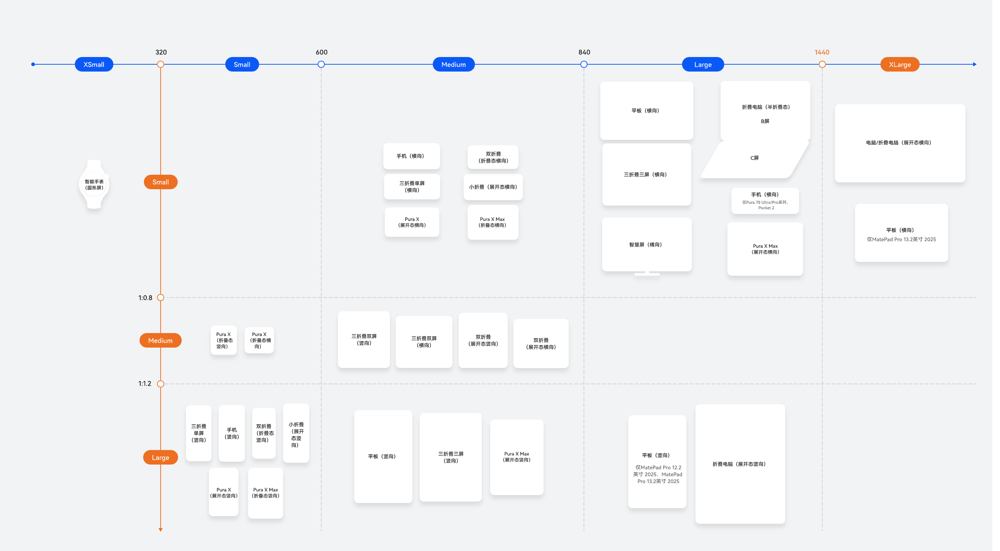
上图清晰地展示了各个设备在不同屏幕形态下的断点，这为本文后续的深入探讨提供了坚实的基础。通过此图，可以直观看到超大屏横屏、大屏横屏、大屏竖屏、大方形屏、直板机竖屏、直板机横屏、小方形屏、圆形屏等多种屏幕形态下的设备断点。

> [!NOTE] 说明
> 根据屏幕形态区分不同场景下的布局，均基于断点结合响应式布局与自适应布局实现，详情可参考断点。 同一设备由于横竖屏旋转的场景，会产生横向和纵向两种屏幕形态，旋转适配案例可参考窗口方向。

#### 超大屏横屏
超大屏横屏设备横向分辨率通常超过1440vp，具备更强的多任务处理能力，可同时展示多个应用或复杂布局，提升工作效率。典型设备有[PC/2in1](https://developer.huawei.com/consumer/cn/doc/best-practices/bpta-pc-guide)设备等。适用于文档处理、数据分析、编程开发、内容创作等生产力场景。

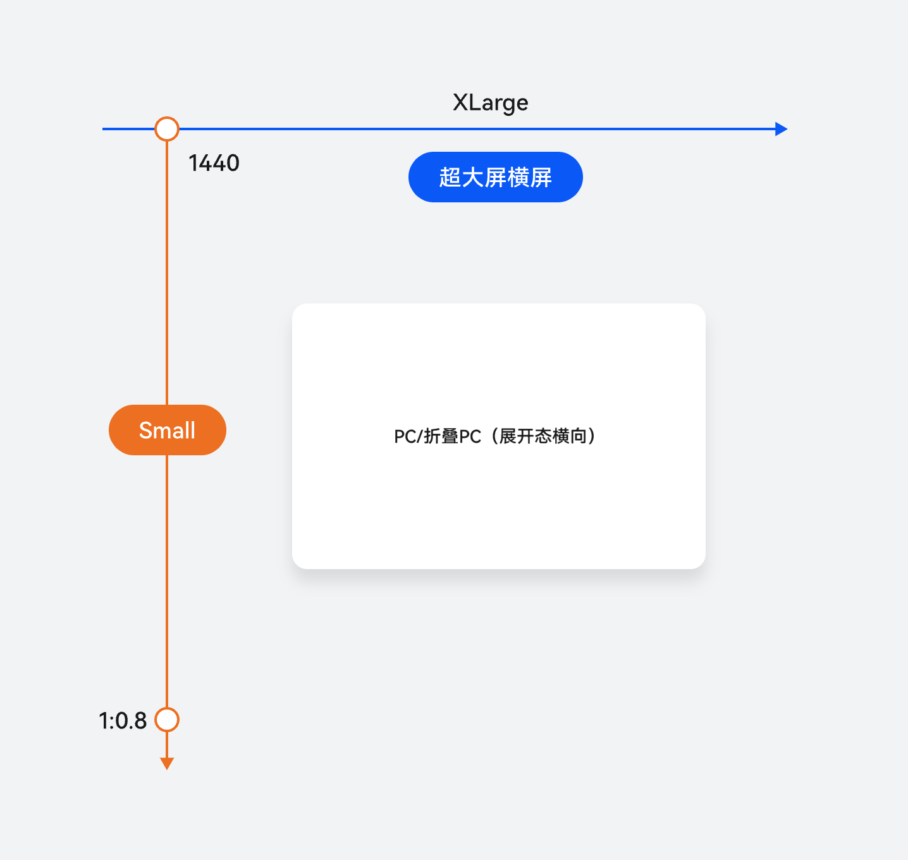

#### 断点判断

| 横纵断点 | 设备 |
| --- | --- |
| 横向断点xl，纵向断点sm | PC/2in1 |

#### 布局设计与实现
超大屏横屏设备独具大尺寸屏幕的优势，开发应用时建议采用响应式布局，以实时适应窗口尺寸变化，确保内容展示的最佳布局。在布局设计中，建议设置导航栏以提升可用性，并结合重复布局和多栏布局，充分利用屏幕空间，提升信息密度与用户的操作效率。
本章节提供针对超大屏横屏设备典型布局场景的开发指导。更多UX设计标准与规范，请参考[电脑应用UX体验标准](https://developer.huawei.com/consumer/cn/doc/design-guides/ux-guidelines-2in1-0000001777895636)、[电脑](https://developer.huawei.com/consumer/cn/doc/design-guides/2in1-0000001777531700)。
- 导航栏 布局建议：当应用窗口宽度达到或超过1440vp，即横向断点为xl时，建议采用挪移布局，将底部导航栏变更为侧边分级导航栏。 实现原理：使用SideBarContainer组件实现侧边栏效果，该组件需要传入两个子组件，分别表示侧边栏区域和内容区域。 参考设计图如下：
- 网格 布局建议：当页面中需要展示较多元素内容时，建议采用重复布局，结合网格实现结构化与多样化的排布方式。 实现原理：网格布局通过Grid组件实现。在不同断点下，设置不同的列数（columnsTemplate）和行数（rowsTemplate），即可呈现网格的多端效果。 参考设计图如下：
- 列表 布局建议：为了提高屏幕利用率，在大屏上展示更多的内容信息，可以根据断点展示更多列数实现重复布局。 实现原理：List组件提供lanes属性，支持设置布局列数或行数。在xl断点下，需要通过该属性设置更多列数。 参考设计图如下：
- 三分栏 布局建议：在超大屏横屏设备上，面对具有多级属性的内容，建议采用分栏布局，以清晰展现层级结构，同时提升信息展示密度和用户操作效率。 实现原理：组合使用Navigation组件和SideBarContainer组件即可实现。在xl断点下，设置SideBarContainer组件的showSideBar为true，显示侧边栏；设置Navigation的mode为Auto。 参考设计图如下：

#### 大屏横屏
大屏横屏的特点主要表现为横向分辨率超过840vp，提供更宽广的显示视野和更强的信息承载能力，支持同时展示多个应用界面或复杂内容布局，显著提升多任务处理效率。典型设备有[Pad](https://developer.huawei.com/consumer/cn/doc/best-practices/bpta-pad-guide)、[三折叠](https://developer.huawei.com/consumer/cn/doc/best-practices/bpta-matext-guide)三屏态等。
这类屏幕拥有高分辨率，还具备出色的显示细腻度和广阔的可视区域，适合展示更加丰富和多层次的内容。在学习、娱乐或办公等多种应用场景中，这些屏幕能为用户提供更清晰的文字、更完整的界面布局以及更流畅的视觉体验，从而有效提升信息获取效率和使用舒适度，增强工作与学习的专注力及完成效率。

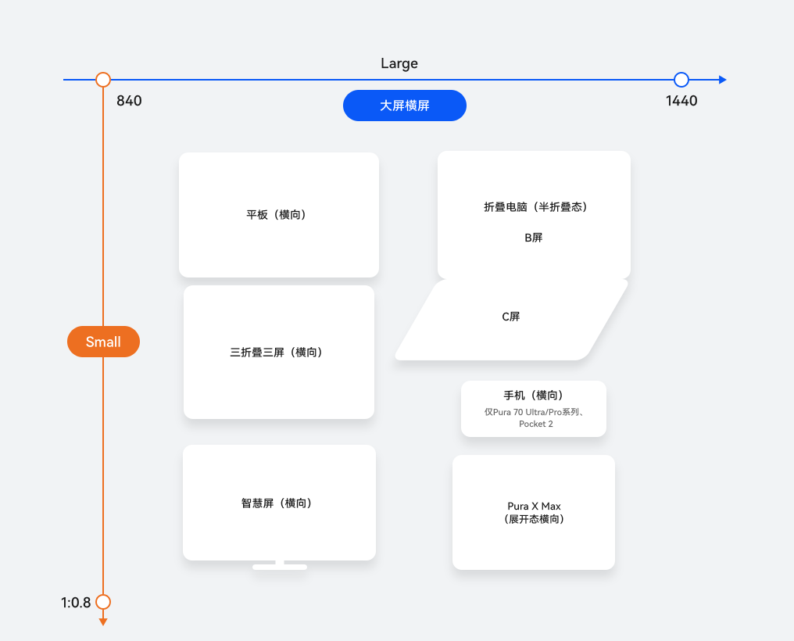

#### 断点判断

| 横纵断点 | 设备 |
| --- | --- |
| 横向断点lg，纵向断点sm | Pad（横向） |
| 三折叠三屏态（横向） |  |
| 折叠PC（半折叠态） |  |
| Pura 70 Ultra/Pro 系列、Pocket 2手机（横向） |  |
| 智慧屏（横向） |  |
| Pura X Max（展开态横向） |  |

#### 布局设计与实现
大屏横屏设备独具大尺寸屏幕的优势，开发应用时建议采用响应式布局，以实时适应窗口尺寸变化，确保内容展示的最佳布局。
在大屏横屏布局设计中，为了简化操作流程并支持多层次信息架构，通常会设置导航栏以提高应用的可用性。充分利用大屏优势展示更多信息时，常采用重复元素布局来增加内容展示量。对于插图和文字结合的场景，小屏上采用上下排列的内容，在大屏上则多使用左右布局，使页面更加美观。此外，利用大屏的优势，可以通过侧边栏显示更多资讯。鉴于大屏横向空间充裕，在进行页面分栏布局时，为了提升视觉效果和丰富内容，应考虑使用多栏布局方案。
本章节提供针对大屏横屏设备典型布局场景的开发指导。更多UX设计标准与规范，请参考
、
。
- 导航栏 布局建议：当应用窗口宽度达到或超过840vp，横向断点为lg时，建议采用挪移布局，将底部导航栏变更为侧边导航栏。 实现原理：导航页签使用Tabs组件实现，窗口为lg断点时，页签位于页面左侧，此时vertical=true，barPosition=Start。 参考设计图如下：
- 瀑布流 布局建议：在宽屏设备上，为提升信息展示效率，建议采用响应式布局策略。将小尺寸屏幕上的全屏内容，在宽屏设备上自动切换为瀑布流布局，通过重复布局，实现更多内容的可视化呈现，从而提升用户浏览效率与信息获取体验。 实现原理：WaterFlow组件提供columnsTemplate属性，支持设置当前瀑布流组件布局的列数。 参考设计图如下：
- 轮播图 布局建议：多张图片展示的场景下，建议使用轮播图展示图片，采用重复布局的方式，展示重复的元素。 实现原理：Swiper组件提供子组件滑动轮播显示的能力，可以用来实现轮播图片。通过Swiper组件的displayCount属性，可以设置视窗内图片显示的个数。 参考设计图如下：
- 网格 布局建议：页面中重复内容（如卡片、商品项、文章列表等）的展示方式应根据可用空间进行动态调整。建议采用重复布局，根据不同设备的显示特性自动调整列数、间距与排列方向。 实现原理：网格布局通过Grid组件实现。在不同断点下，设置不同的列数（columnsTemplate）和行数（rowsTemplate），即可呈现网格的多端效果。 参考设计图如下：
- 列表 布局建议：当面临大量重复内容（如商品列表、文章卡片、用户评论等）需要有序展示时，建议采用重复布局，通过统一的样式模板对内容进行结构化排列。 实现原理：List组件提供lanes属性，支持设置布局列数或行数。 参考设计图如下：
- 侧边栏 布局建议：为充分发挥大屏设备在空间展示上的优势，提升信息密度与用户操作效率，建议采用分栏布局，合理划分主内容区与侧边栏区域。 实现原理：使用SideBarContainer组件展示侧边栏，在lg断点下设置showSideBar为true，显示侧边栏。 参考设计图如下：
- 三分栏 布局建议：当应用页面包含层级关系，如一级目录、二级目录和内容区，为了利用大屏优势达到内容清晰直观展示的目的，建议使用分栏布局，实现三分栏的效果。 实现原理：组合使用SideBarContainer与Navigation组件，在lg断点下设置SideBarContainer组件的showSideBar为true，显示侧边栏；设置Navigation组件的mode为Auto。 参考设计图如下：
- 插图和文字组合布局 布局建议：在需要图文并茂展示的场景下，推荐采用挪移布局，将图片与文字设置为左右分布的形式，使信息传递更加高效直观。 实现原理：借助栅格组件GridRow和GridCol，可以设置在不同断点下栅格子元素所占据的列数。当一行中的列数超过了该断点下栅格组件的总列数时，栅格子元素会自动换行，从而实现灵活的布局效果。 参考设计图如下：

#### 大屏竖屏
大屏竖屏是指原本设计为横屏使用的大屏幕设备在垂直方向上的展示形态，即这些设备从默认的横向模式旋转90度后的状态。大屏竖屏为大屏设备的竖向态，典型设备有Pad（竖屏）、三折叠三屏态（竖屏）。
竖屏模式便于用户聚焦内容流并进行滚动、点击等基础操作。

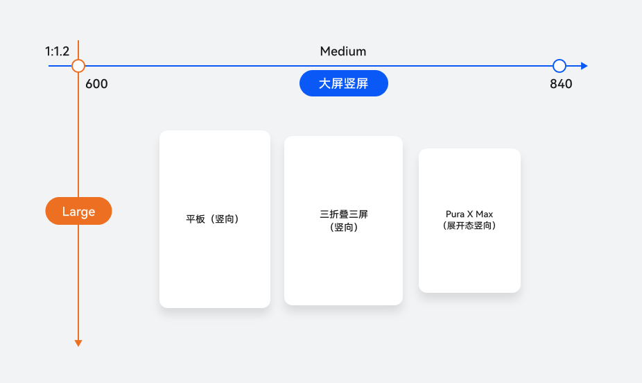

#### 断点判断

| 横纵断点 | 设备 |
| --- | --- |
| 横向断点md，纵向断点lg | Pad（竖屏） |
| 三折叠三屏态（竖屏） |  |
| Pura X Max（展开态竖向） |  |

#### 布局设计与实现
在大屏竖屏布局设计中，由于屏幕高度显著增加，用户在浏览内容时，对操作效率和视觉节奏的要求也相应提高。因此，在导航栏与重复布局设计上，需结合竖屏的展示特性进行有针对性的优化。在大屏竖屏设备中，导航栏通常位于顶部或底部，便于用户快速识别和操作。大屏竖屏提供了充足的高度空间，可以利用重复布局来展示结构相似但内容不同的信息模块。大屏竖屏的布局设计可参考[大屏应用 UX 体验标准](https://developer.huawei.com/consumer/cn/doc/design-guides/ux-guidelines-large-screen-0000001807707561)。
- 导航栏 布局建议：大屏竖屏设备推荐将页签栏布局在底部，提升核心功能的可访问性与操作效率。 实现原理：结合响应式布局能力，设置Tabs组件的barPosition为End、vertical为false属性实现目标效果。 参考设计图如下：
- 轮播图 布局建议：在大屏竖屏场景下，由于屏幕宽度较大，推荐采用重复布局，多张图片轮播，提升内容密度与用户的浏览效率。 实现原理：Swiper组件支持图片的滑动轮播展示能力，可通过设置displayCount属性，实现多个轮播项的同时展示。 参考设计图如下：
- 列表 布局建议：大屏竖屏相较于直板机竖屏具有更大的展示内容区，建议采用重复布局，设置为一行多列或一列多行展示。 实现原理：List组件提供lanes属性，支持设置布局列数或行数。 参考设计图如下：
- 网格 布局建议：大屏竖屏相较于直板机竖屏具有更大的展示内容区，支持设置布局为多行多列展示。 实现原理：通过Grid组件实现。在不同断点下，设置不同的列数（columnsTemplate）和行数（rowsTemplate），即可呈现网格的多端效果。 参考设计图如下：

#### 大方形屏
大方形屏幕的特点包括：屏幕比例为 1:1，呈现出对称且均衡的视觉效果，横向分辨率超过 600vp，具备较高的信息承载能力和良好的阅读舒适度。典型设备如华为 Mate X 系列在展开状态下的屏幕形态，可为用户提供更宽广的操作空间和更丰富的界面布局可能性。
此类屏幕非常适合多任务处理、内容分屏展示以及创作类应用，能够显著提升用户的操作效率与交互体验。

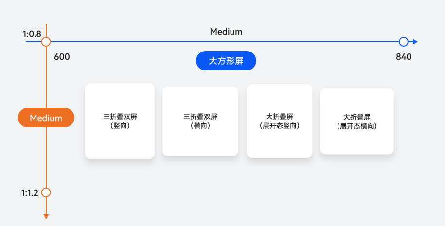

#### 断点判断

| 横纵断点 | 设备 |
| --- | --- |
| 横向断点md，纵向断点md | 双折叠：Mate X系列（展开态） |
| 三折叠：Mate XT系列（双屏M态） |  |

#### 布局设计与实现
大方形屏幕提供了广阔的显示区域，使得导航栏能够包含更多功能入口而不会显得拥挤。大方形屏幕也适合采用重复布局，展示结构相似但内容不同的信息单元。对于小屏幕上下排列的内容，大方形屏幕多采用左右布局，以使页面更加美观。鉴于大方形屏幕宽广的横向和纵向空间，分栏布局是一种非常有效的信息组织方法。
- 导航栏 布局建议：对于md断点的大方形屏幕，推荐页签栏位于底部，图标与文字水平排列，页签宽度平均分配，页签高度固定为56vp。 实现原理：结合响应式布局能力，设置Tabs组件的barPosition为End、vertical为false，实现目标效果。 参考设计图如下：
- 瀑布流 布局建议：小尺寸屏幕上的单列瀑布流，在大方形屏上采用重复布局，变为多列瀑布流布局，可以提升宽屏设备上的阅读体验。 实现原理：WaterFlow组件提供columnsTemplate属性，支持设置当前瀑布流组件布局的列的数量。 参考设计图如下：
- 网格 布局建议：大方形屏推荐使用重复布局，以多行多列的形式展示重复性信息元素，充分发挥大屏空间优势，提升信息密度与展示效率。 实现原理：使用Grid组件实现多行多列布局效果，定义行列结构和单元格分布，灵活展示信息内容。 参考设计图如下：
- 列表 布局建议：在大方形屏上，建议使用重复布局，通过“一行多列”或“一列多行”的排布方式展示更多内容，提升信息密度和界面利用率。 实现原理：List组件提供lanes属性，支持设置布局列数或行数。 参考设计图如下：
- 双栏 布局建议：大方形屏建议采用分栏布局，利用横向空间优势，清晰展示具有层级关系的内容，提升界面组织性和用户操作效率。 实现原理：将Navigation的mode属性设置为Auto，可以自动实现单/双栏的切换。 参考设计图如下：
- 侧边栏 布局建议：由于大方形屏横向空间充裕，在需要展示更多信息时，建议采用分栏布局，添加侧边栏，以提升界面组织性与信息展示效率。 实现原理：在需要展示侧边栏的事件触发时，使用SideBarContainer组件，动态设置showSideBar为true，显示侧边栏。 参考设计图如下：
- 插图和文字组合布局 布局建议：在部分小屏上下显示的场景，大方形屏时推荐采用挪移布局，左右分布。 实现原理：通过响应式布局能力结合Grid组件实现，栅格子元素占据的列数会随着开发者的配置发生改变。当一行中的列数超过栅格组件在该断点的总列数时，可以自动换行。 参考设计图如下：

#### 直板机竖屏
直板机竖屏是手机的主流屏幕类型，展示区域适中，适合单手操作和日常信息浏览。典型设备有华为全系列的直板机（如Mate 60）、小折叠（展开态）、阔折叠（如Pura X系列展开态和Pura X Max系列折叠态）、双折叠（折叠态）。
这种屏幕形态特别适合社交应用、新闻阅读、即时通讯、短视频播放等高频交互场景。由于高度适应移动设备的使用习惯，开发者在设计界面时能够更容易地实现内容的垂直排列和层次展示。此外，直板机竖屏在响应式布局中表现出良好的兼容性，能够灵活适应不同分辨率和设备尺寸，在多设备协同开发中发挥着承上启下的重要作用。

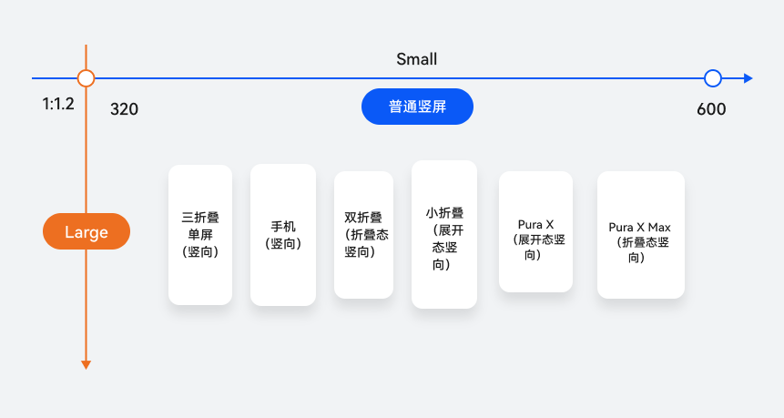

#### 断点判断

| 横纵断点 | 设备 |
| --- | --- |
| 横向断点sm，纵向断点lg | 直板机 |
| 小折叠（展开态） |  |
| Pura X（展开态） |  |
| 双折叠（折叠态） |  |
| 三折叠（折叠态） |  |
| Pura X Max（折叠态） |  |

#### 布局设计与实现
直板机竖屏由于屏幕宽度有限而高度相对充裕，设计布局时应以简洁直观、操作高效为核心目标。在竖屏界面中，导航栏通常置于屏幕顶部或底部，作为用户进行功能切换和页面跳转的主要入口。竖屏设计时，建议合理运用挪移布局，以减轻空间受限导致的视觉拥挤。鉴于直板机竖屏横向宽度较短，推荐采用单栏布局。
- 导航栏 布局建议：在直板机竖屏设备上，建议使用底部页签栏布局，方便用户快速切换功能模块，提升操作便捷性与界面友好度。 实现原理：结合响应式布局能力，设置Tabs组件的barPosition为End、vertical为false属性实现目标效果。 参考设计图如下：
- 瀑布流 布局建议：直板机竖屏设备推荐使用重复布局，提升内容展示密度与滚动浏览体验，适用于图集、商品列表、动态卡片等内容密集型场景。 实现原理：WaterFlow组件提供columnsTemplate属性，支持设置当前瀑布流组件布局的列的数量。 参考设计图如下：
- 插图和文字组合布局 布局建议：插图和文字组合场景在直板机竖屏设备上推荐使用上下布局，按内容优先级从上至下排列，适配小屏显示需求，提升可读性与操作便利性。 实现原理：主要是借助栅格组件GridRow和GridCol，配置在不同断点下栅格子元素占据的列数实现。 参考设计图如下：
- 单栏 布局建议：直板机竖屏设备推荐使用单栏布局，按内容顺序垂直排列，提升界面简洁性与用户操作效率。 实现原理：通过设置Navigation组件的mode属性为Stack实现。 参考设计图如下：

#### 直板机横屏
直板机横屏的主要使用场景通常是竖屏设备旋转至横屏后的情况。当需要更宽广的横向显示区域来增强视觉体验或提升特定任务的操作效率时，这种屏幕展示方式特别适合观看视频、浏览网页、编辑文档及游戏等需要较大横向空间的应用。典型设备有华为全系列的直板机（如Mate 60）、小折叠（展开态）、阔折叠（如Pura X系列展开态和Pura X Max系列折叠态）、双折叠（折叠态）。
在这些设备上，当用户从竖屏切换到横屏模式时，界面布局会自动调整以适应新的屏幕方向，提供更加沉浸的观看体验或更适合阅读和编辑的工作环境。例如，观看电影或电视剧时，横屏模式可以最大化屏幕宽度的使用，减少黑边，增加画面比例；而在编辑文档或电子表格时，横向布局允许同时查看更多的列数据或文本内容，从而提高工作效率。通过这种方式，直板机横屏不仅增加了设备的实用性，也为用户提供了更加灵活多样的使用体验。

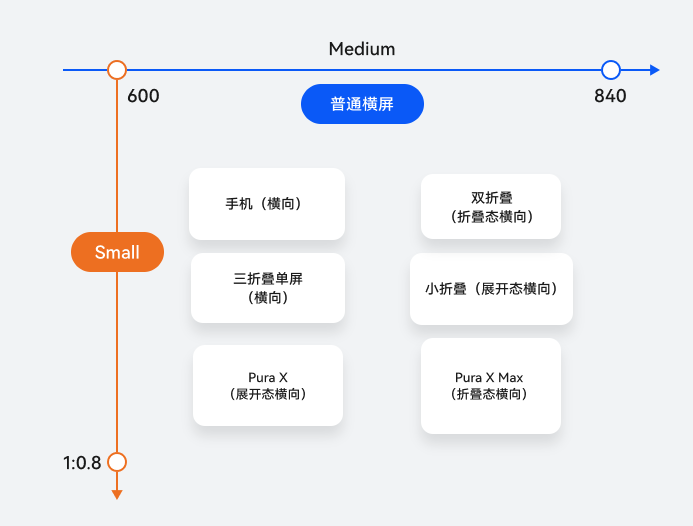

#### 断点判断

| 横纵断点 | 设备 |
| --- | --- |
| 横向断点md，纵向断点sm | 直板机（横屏） |
| 小折叠（展开态横屏） |  |
| Pura X（展开态横屏） |  |
| 双折叠（折叠态横屏） |  |
| 三折叠（折叠态横屏） |  |
| Pura X Max（折叠态横屏） |  |

#### 布局设计与实现
直板机横屏由于屏幕宽度的增加，使用户拥有更广阔的视野和更大的操作空间，因此界面布局可以充分利用横向空间，采用重复布局，提升信息密度和交互效率。对于横向内容的展示，可以采用左右结构来呈现信息。考虑到直板机横屏的横向长度较长，建议使用分栏布局，提升用户操作效率。
- 网格 布局建议：直板机横屏设备推荐使用重复布局，利用较宽的显示区域横向展示更多内容，提升信息密度与用户浏览效率。 实现原理：使用Grid组件实现多行多列布局效果，定义行列结构和单元格分布，灵活展示信息内容，特别适合卡片式内容、商品列表等场景。 参考设计图如下：
- 插图与文字组合布局 布局建议：直板机横屏推荐采用挪移布局，将图片与文字左右排列，合理利用横向空间，提升信息展示效率与界面美观性。 实现原理：使用GridRow/GridCol实现，栅格子元素占据的列数会随着开发者的配置发生改变。当一行中的列数超过栅格组件在该断点的总列数时，可以自动换行。 参考设计图如下：
- 双栏 布局建议：直板机横屏设备推荐使用分栏布局，将界面划分为左右两部分，充分利用横向空间展示更多信息，提升用户操作效率。 实现原理：使用Navigation组件，设置mode为Auto；或者使用SideBarContainer组件，设置showSideBar为true，显示侧边栏。两种方式均能实现目标效果。 参考设计图如下：

> [!NOTE] 说明
> 直板机横屏的页面设计实现可参考多设备长视频界面。

#### 小方形屏
小方形屏的特点包括：屏幕比例为1:1，横向分辨率低于600vp，典型设备如华为推出的Pura X系列产品的外屏。
此类屏幕主要应用于即时信息处理、便捷出行导航、快速移动支付、沉浸影音播放、轻量游戏畅玩等场景，能够充分发挥小方屏高效便捷的优势，无需使用内屏操作。
由于1:1的屏幕比例和小尺寸屏幕，带来了一定的基础功能适配工作。在实际适配时，主要考虑如何充分利用屏幕空间，提供最佳的用户体验。

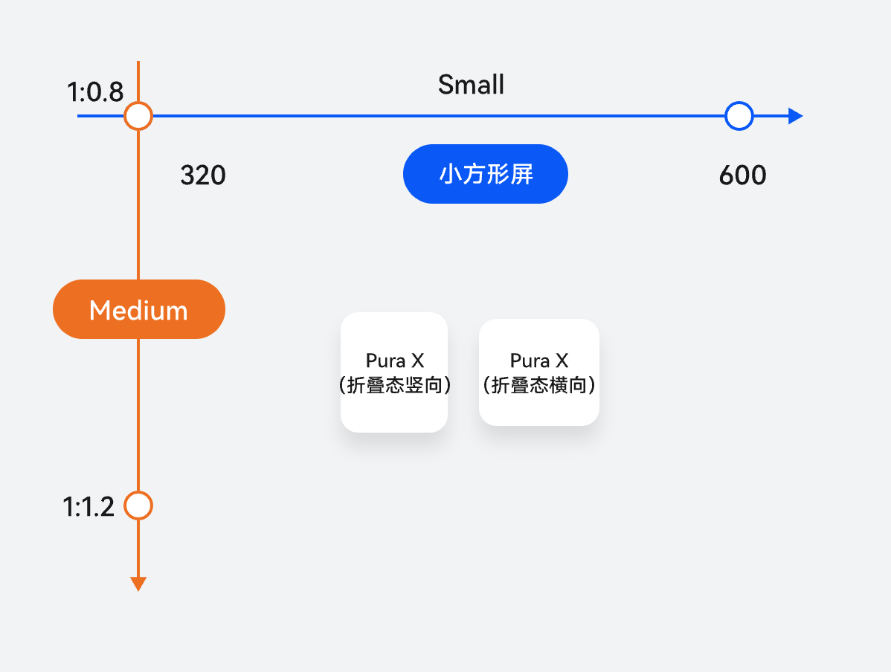

#### 断点判断

| 横纵断点 | 设备 |
| --- | --- |
| 横向断点sm，纵向断点md | Pura X（折叠态） |

#### 布局设计与实现
本章节以Pura X系列产品外屏为例，提供小方形屏上的设计方案，确保布局完整显示，避免内容截断、挤压或堆叠，充分利用屏幕空间，以提供最佳用户体验。
- 页面支持滑动、完整显示 布局建议：小方形屏展示内容建议要考虑完整性展示，推荐使用Scroll组件实现页面支持滑动。 效果图如下：
- **短视频播放页面完整显示，侧边控件支持滑动显示，侧边控件支持滑动** 布局建议：小方形屏展示短视频播放页面，背景图片（视频）需等比例缩放并上下沉浸，上方沉浸至顶部标题栏，下方沉浸至底部页签栏。侧边控件支持滑动，确保页面内容完整显示。 效果图如下：  实现原理：使用Stack组件控制页面内容显示层级，背景图片上下沉浸，且互相不影响交互事件。Z序控制从下到上分别是背景图片（视频）区、底部页签区、短视频描述区、侧边控件区、顶部页签区。顶部和底部页签设置内边距padding为topAvoidHeight或bottomAvoidHeight，避让系统规避区。侧边控件区使用Scroll组件自动控制滑动，使用Blank组件和displayPriority属性控制侧边控件区上下两侧的留白，容器高度足够时上下留白，容器高度不足时自动隐藏。 Stack({ alignContent: Alignment.BottomEnd }) {
  // Background image.
  Row() {
 Image(\$r('app.media.background_image'))
 .height('100%')
 .objectFit(ImageFit.Cover)
 .aspectRatio(0.6)
  }
  .height('100%')
  .width('100%')
  .justifyContent(FlexAlign.Center)

  // Bottom tabs.
  List() {
 // ...
  }
  .backgroundColor(\$r('sys.color.mask_secondary'))
  .listDirection(Axis.Horizontal)
  .height(this.bottomBarHeight)
  .padding({ bottom: this.bottomAvoidHeight })
  // ...

  // Video description.
  Column() {
 // ...
  }
  .alignItems(HorizontalAlign.Start)
  .padding({
 left: \$r('app.float.margin_md'),
 right: \$r('app.float.margin_md')
  })
  // ...

  // Sidebar buttons.
  Scroll() {
 Column() {
 Blank()
 .layoutWeight(3)
 .displayPriority(1)
 // ...
 Blank()
 .layoutWeight(1)
 .displayPriority(1)
 }
 // ...
  }
  .scrollBar(BarState.Off)
  .layoutWeight(1)
  .width('56vp')
  .edgeEffect(EdgeEffect.None)
  .align(Alignment.Bottom)
  .margin({
 top: this.topAvoidHeight + 24,
 bottom: this.bottomBarHeight,
 right: '8vp'
  })

  // Top tabs.
  Row() {
 // ...
}
.height('100%')
.width('100%')
.backgroundColor(Color.Black)
- **自定义弹窗适配小方形屏** 布局建议：在小方形屏上，当窗口高度无法完整显示自定义弹窗时，可能出现弹窗内容截断，需要进行自定义弹窗适配小方形屏。 效果图如下：  实现原理：弹框内容区使用scroll组件包裹，且使用constraintSize约束其高度最大不超过父组件的90%，避免弹框内容截断。 Scroll() {
  Column() {
 // ...
  }
}
.scrollBar(BarState.Off)
.constraintSize({
  minHeight: 0,
  maxHeight: '90%'
})
- 沉浸式浏览 布局建议：在小方形屏通用场景中，考虑到屏幕空间有限，为了提供更佳的内容体验，建议使用上滑隐藏、下滑恢复显示的功能。上滑可以临时隐藏标题栏、页签栏等界面元素，实现全屏内容浏览。下滑时，标题栏和页签栏将通过动画逐渐恢复显示。 效果图如下：  实现原理：监听滚动行为，滚动时动态调整页面组件的高度和透明度，达到视觉上逐渐显示和隐藏的效果。具体为以下步骤：  使用状态变量控制顶部标题栏和底部页签栏的高度及透明度。标题栏高度为topBarHeight，页签栏高度为bottomBarHeight，标题栏和页签栏的透明度为barOpacity。 @StorageLink('topBarHeight') topBarHeight: number = CommonConstants.UTIL_HEIGHTS[1] + this.topAvoidHeight;
@State bottomBarHeight: number = CommonConstants.UTIL_HEIGHTS[0] + this.bottomAvoidHeight;
@State barOpacity: number = 1; 在沉浸式布局下，标题栏高度为78vp加顶部系统规避区高度topAvoidHeight；页签栏高度为56vp加底部系统规避区高度bottomAvoidHeight，页签栏底部内边距为bottomAvoidHeight，以避让底部系统导航条。 @StorageLink('topAvoidHeight') @Watch('topBarHeightChange') topAvoidHeight: number = 0;
@StorageLink('bottomAvoidHeight') @Watch('bottomBarHeightChange') bottomAvoidHeight: number = 0;
// ...
topBarHeightChange(): void {
  if (this.currentWidthBreakpoint === WidthBreakpoint.WIDTH_SM &&
 (this.currentHeightBreakpoint === HeightBreakpoint.HEIGHT_MD ||
 this.currentHeightBreakpoint === HeightBreakpoint.HEIGHT_SM)) {
 this.topBarHeight = 78 + this.topAvoidHeight;
  }
  // ...
};

bottomBarHeightChange(): void {
  this.bottomBarHeight = 56 + this.bottomAvoidHeight;
}; 顶部和底部系统避让区高度会随应用窗口变化而变化。窗口生命周期创建时，调用window.getWindowAvoidArea()获取初始的系统避让区高度，并使用window.on('avoidAreaChange')监听系统避让区的变化。常见触发系统避让区回调的场景可参考on('avoidAreaChange')。 export default class EntryAbility extends UIAbility {
  private uiContext ?: UIContext;
  private windowUtil?: WindowUtil = WindowUtil.getInstance();
  private windowObj?: window.Window;
  private onAvoidAreaChange: (avoidArea: window.AvoidAreaOptions) => void = (avoidArea: window.AvoidAreaOptions) => {
 if (avoidArea.type === window.AvoidAreaType.TYPE_SYSTEM) {
 AppStorage.setOrCreate('topAvoidHeight', this.windowObj!.getUIContext().px2vp(avoidArea.area.topRect.height));
 } else if (avoidArea.type === window.AvoidAreaType.TYPE_NAVIGATION_INDICATOR) {
 AppStorage.setOrCreate('bottomAvoidHeight', this.windowObj!.getUIContext().px2vp(avoidArea.area.bottomRect.height));
 }
  };
  // ...
  onWindowStageCreate(windowStage: window.WindowStage): void {
 // Main window is created, set main page for this ability
 hilog.info(0x0000, 'testTag', '%{public}s', 'Ability onWindowStageCreate');
 this.windowUtil?.setWindowStage(windowStage);

 windowStage.loadContent('pages/Index', (err) => {
 if (err.code) {
 hilog.error(0x0000, 'testTag', 'Failed to load the content. Cause: %{public}s', JSON.stringify(err) ?? '');
 return;
 }
 windowStage.getMainWindow((err: BusinessError, data: window.Window) => {
 if (err.code) {
 hilog.error(0x0000, 'testTag', 'Failed to get the main window. Cause: %{public}s', JSON.stringify(err) ?? '');
 return;
 }
 this.windowObj = data;
 this.uiContext = data.getUIContext();
 this.windowUtil!.setFullScreen();
 // ...
 let topAvoidHeight: window.AvoidArea = data.getWindowAvoidArea(window.AvoidAreaType.TYPE_SYSTEM);
 AppStorage.setOrCreate('topAvoidHeight', this.uiContext.px2vp(topAvoidHeight.topRect.height));
 let bottomAvoidHeight: window.AvoidArea =
 data.getWindowAvoidArea(window.AvoidAreaType.TYPE_NAVIGATION_INDICATOR);
 AppStorage.setOrCreate('bottomAvoidHeight', this.uiContext.px2vp(bottomAvoidHeight.bottomRect.height));
 data.on('avoidAreaChange', this.onAvoidAreaChange);
 if (AppStorage.get('currentWidthBreakpoint') === WidthBreakpoint.WIDTH_SM &&
 (AppStorage.get('currentHeightBreakpoint') === HeightBreakpoint.HEIGHT_MD ||
 AppStorage.get('currentHeightBreakpoint') === HeightBreakpoint.HEIGHT_SM)) {
 // Set top bar height when the application is in small screen.
 AppStorage.setOrCreate('topBarHeight',
 CommonConstants.UTIL_HEIGHTS[1] + this.uiContext!.px2vp(topAvoidHeight.topRect.height));
 } else {
 // Set top bar height when the application is in full screen.
 AppStorage.setOrCreate('topBarHeight',
 CommonConstants.UTIL_HEIGHTS[2] + this.uiContext!.px2vp(topAvoidHeight.topRect.height));
 }
 })
 // ...
  }
  // ...
} 设置顶部标题栏的高度为topBarHeight，透明度为barOpacity；底部页签栏的高度为bottomBarHeight，透明度为barOpacity，确保滑动时标题栏和页签栏能够逐渐显隐。在Stack组件内，将列表内容的顶部外边距设置为topBarHeight，确保滑动时列表占满剩余高度。 Tabs() {
  TabContent() {
 Stack({ alignContent: Alignment.Top }) {
 Row() {
 Text(\$r('app.string.app_title'))
 .fontSize(\$r('app.float.font_size_xl'))
 .fontWeight(CommonConstants.FONT_WEIGHTS[1])
 .height(this.topBarHeight)
 .align(Alignment.Bottom)
 .padding({ bottom: 12 })
 }
 .height(this.topBarHeight)
 .opacity(this.barOpacity)
 // ...
 List({
 space: CommonConstants.LIST_SPACE[0],
 scroller: this.listScroller,
 }) {
 // ...
 }
 .onScrollIndex((start: number) => {
 this.currentIndex = start;
 })
 .margin({ top: this.topBarHeight })
 // ...
 }
 .height('100%')
 .width('100%')
  }
  .tabBar(this.bottomTabBuilder(0))

  // ...
}
// ...
.barHeight(this.bottomBarHeight)
// ... 当横向断点为sm，纵向断点为sm或md，应用窗口属于小方形屏（例如Pura X外屏和手机上下分屏）时，在滑动过程中，如果当前Y轴滑动的偏移量>0（上滑时）且固定区（顶部标题栏和底部页签栏）未完全隐藏，逐渐减少固定区的高度和透明度，实现滑动过程隐藏的效果；当 Y 轴滑动偏移量＜ 0（下滑时），且未处于恢复动画状态、固定区域已隐藏的情况下，通过动画逐步恢复固定区域的高度与透明度。 .onScrollFrameBegin((offset: number) => {
  if (this.currentWidthBreakpoint !== WidthBreakpoint.WIDTH_SM ||
 (this.currentHeightBreakpoint !== HeightBreakpoint.HEIGHT_MD &&
 this.currentHeightBreakpoint !== HeightBreakpoint.HEIGHT_SM)) {
 return { offsetRemain: offset };
  }
  if (offset > 0) {
 this.currentYOffset += offset;
  }
  if (offset < 0) {
 this.currentYOffset -= offset;
  }
  this.getUIContext().animateTo({
 duration: 300
  }, () => {
 this.topBarHeight = 0;
 this.bottomBarHeight = 0;
 this.barOpacity = 0;
  });
  return { offsetRemain: offset };
})
.onScrollStop(() => {
  setTimeout(() => {
 this.getUIContext().animateTo({
 duration: 300
 }, () => {
 this.bottomBarHeight = 56 + this.bottomAvoidHeight;
 this.topBarHeight = 78 + this.topAvoidHeight;
 this.barOpacity = 1;
 this.currentYOffset = 0;
 this.isHiding = false;
 });
  }, 500);
});

#### 圆形屏
典型配备圆形屏幕的设备包括手表等可穿戴装置，其主要特点为即时通知和轻量级交互。
即时通知：几乎不受时间和空间限制，便于及时提醒用户相关消息。同时，需注意在特定场景中减少重复或无关通知对用户的干扰，依据用户实际使用情况调整通知策略。
轻量级交互：在同一应用程序中，智能穿戴设备应利用其便携性，作为大型屏幕设备的补充和扩展，而不是替代。具体设计时，应考虑智能手表的屏幕尺寸和使用环境，进行简洁界面的定制，确保使用过程顺畅和操作便捷。

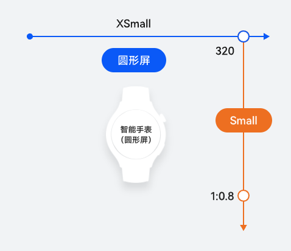

#### 断点判断

| 横纵断点 | 设备 |
| --- | --- |
| 横向断点xs，纵向断点sm | 智能手表（圆形屏） |


> [!NOTE] 说明
> 由于手表等圆形屏幕设备在屏幕形态和使用场景上的独特性，其交互方式和界面设计与普通设备有显著区别。为了确保用户体验的连贯性和功能的全面适配，建议在开发过程中专门为圆形屏幕设备进行界面和逻辑设计，并独立创建一个 HAP（HarmonyOS Ability Package）包进行发布和安装。 在开发穿戴应用时，需要将工程中module.json5的deviceTypes改为wearable，以确保应用能够在穿戴设备上正确部署和运行。可参考穿戴服务了解能力介绍。

#### 布局设计与实现
本节以手表的布局设计为例，提供了一份圆形屏的设计方案，确保内容布局完整、可实现简单交互，拓展并补充其他大型设备的功能。针对手表常见的开发场景，我们提出了推荐的设计方案和开发指导。
当显示的内容量超过单屏范围时，为确保用户能够方便、完整地查看所有信息，建议采用横向切屏和垂直切屏的布局策略。通过横向切屏，内容可沿水平方向分布，用户可通过左右滑动浏览额外信息，特别适用于内容宽度较大的情况。此外，垂直切屏允许信息在垂直方向扩展，用户可通过上下滚动访问更多信息，非常适合展示长列表或详细说明。综合应用这两种切屏方法，不仅可有效避免因内容拥挤而引起的视觉混乱，还可提升界面的美观度和用户交互体验，确保每部分内容都能清晰、有序地展示。

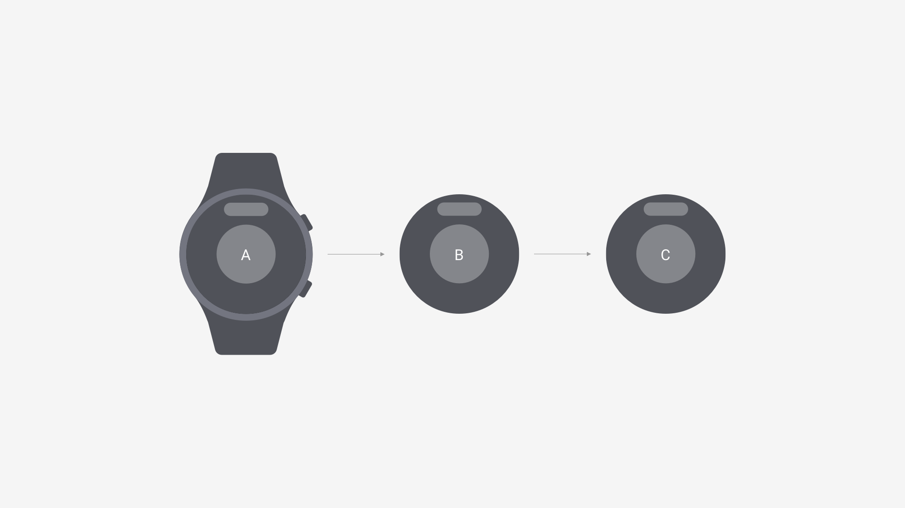
横向切屏，把更多内容切换至下一屏进行独立布置，以防止内容平铺导致的圆形屏幕边缘的信息丢失。

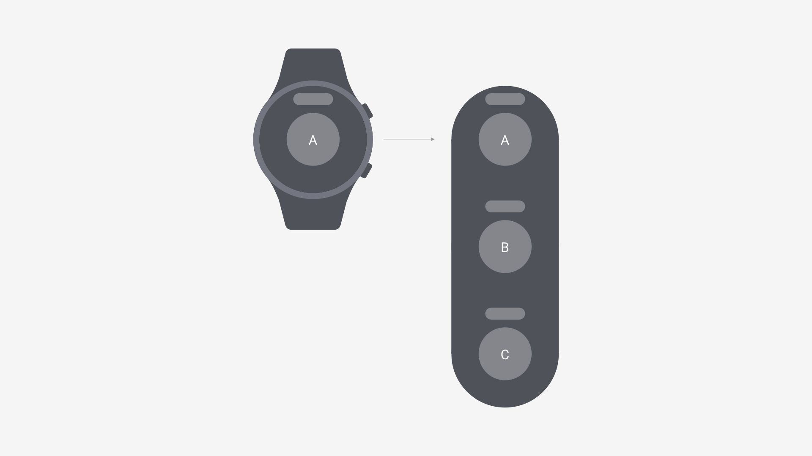
垂直切屏，拓展了手表上下信息承载的空间，增强了信息展示的连贯性。
ArkUI为圆形屏幕提供了部分弧形组件，建议开发者优先使用这些适配组件进行智能手表界面的开发。关于智能手表设备的开发指南，可以参考[智能穿戴](https://developer.huawei.com/consumer/cn/doc/best-practices/bpta-smartwatch)。

| 组件名 | 备注 |
| --- | --- |
| ArcList | 弧形列表组件包含一系列列表项。适合连续、多行呈现同类数据，例如图片和文本。 |
| ArcButton | 弧形按钮组件用于圆形屏幕使用。为手表用户提供强调、普通、警告等样式按钮。 |
| ArcSlider | 弧形滑动组件，通常用于在圆形屏幕中快速调节设置值，如音量调节、亮度调节等应用场景。 |
| ArcScrollBar | 弧形滚动条组件，用于配合可滚动组件使用，如ArcList、List、Grid、Scroll、WaterFlow。 |
| ArcAlphabetIndexer | 弧形索引条是一种弧形的、可按字母顺序排序进行快速定位的组件，可以与容器组件联动，按逻辑结构快速定位至容器显示区域。 |
| ArcSwiper | 弧形滑块视图容器，提供子组件滑动轮播显示的能力。 |
| ArcListItem | 用来展示列表具体子组件，必须配合ArcList来使用。 |


> [!NOTE] 说明
> 弧形组件从API version 18开始支持。后续版本如有新增内容，则采用上角标单独标记该内容的起始版本。

智能手表特殊的圆形表盘，需要在设计手表页面时进行考虑。圆形表盘的设计决定了需要给表页面最外层容器添加borderRadius属性，并为其设置一个50%大小的圆角。

```ArkTS
build() {
  Navigation(this.pathStack) {
    // ...
  }
  .backgroundColor(Color.Black)
  .hideTitleBar(true)
  .hideToolBar(true)
  .height('100%')
  .width('100%')
  .borderRadius('50%')
}
```

内容通常需要居中，保证在圆表屏幕下能够正常显示，示意图如下：

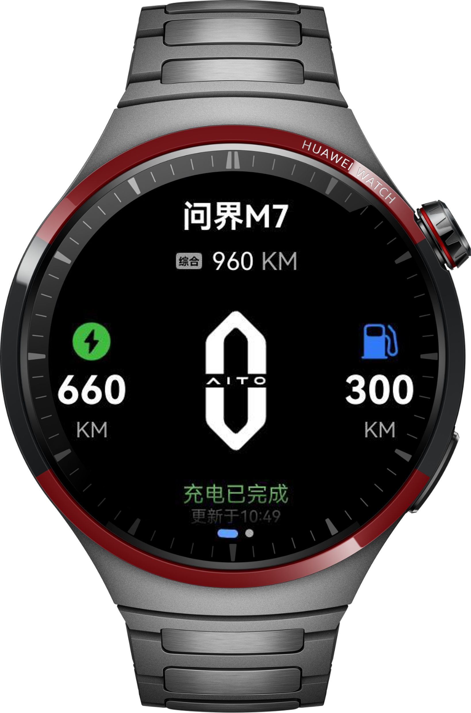
智能手表页面设计通常包含上下滑动或左右滑动实现页面切换的场景，建议使用手表特有组件ArcSwiper组件，实现手表上页面滑动切换的效果，效果示意图如下：


```ArkTS
ArcSwiper() {
  CarInformationView()
  CarControlView({ pathStack: this.pathStack })
}
```
