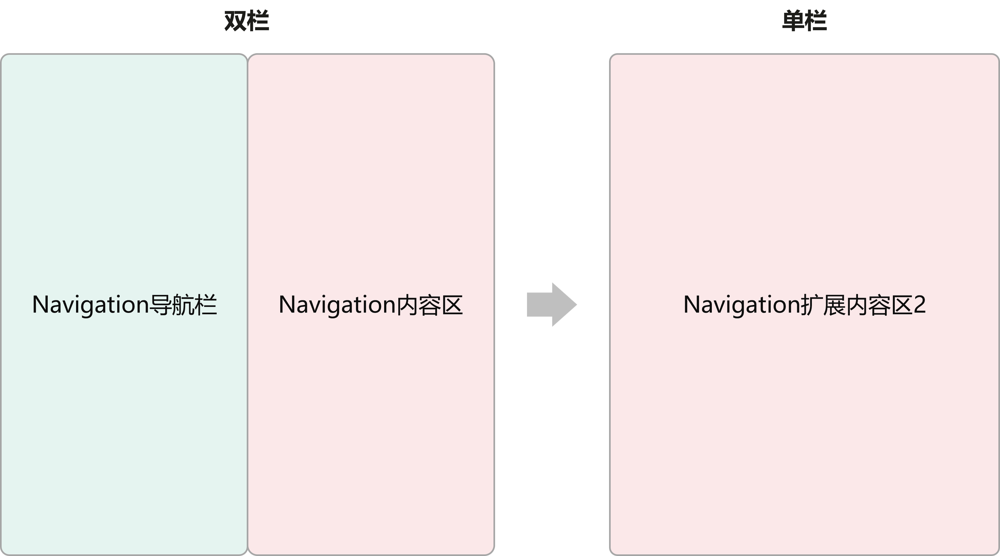
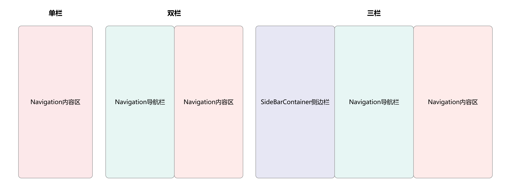
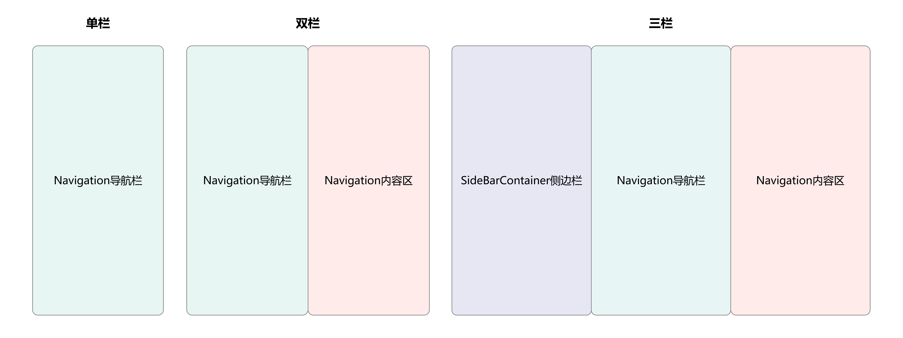

# 页面布局场景

更新时间：2026-03-19 08:43:01

来源：https://developer.huawei.com/consumer/cn/doc/best-practices/bpta-multi-device-page-layout

HarmonyOS基于“一次开发，多端部署”的理念设计了响应式布局，旨在帮助开发者高效构建适应不同设备的应用界面。系统通过统一的UI框架、响应式布局能力——断点和栅格，让应用页面能够根据代码的差异化实现自动适应从手机、折叠屏、平板到PC/2in1等各种终端形态。

响应式布局方式包含四种：重复布局、分栏布局、挪移布局和缩进布局。

本文将从页面布局场景的角度，通过典型布局场景的示例，展示不同横向断点下界面的展示效果，并详细说明在多设备上的实现方案。本文主要覆盖手机、折叠屏、平板和电脑设备，旨在帮助开发者高效实现跨端布局开发。


| 响应式布局方式 | 布局示例 | 典型布局场景 | 实现方案 |
| --- | --- | --- | --- |
| [重复布局](https://developer.huawei.com/consumer/cn/doc/design-guides/design-responsive-layout-method-0000001795698449#section198611812185) |  | 列表布局 | List组件+断点 |
| 瀑布流布局 | WaterFlow组件+断点 |  |  |
| 轮播布局 | Swiper组件+断点 |  |  |
| 网格布局 | Grid组件+断点 |  |  |
| [分栏布局](https://developer.huawei.com/consumer/cn/doc/design-guides/design-responsive-layout-method-0000001795698449#section20649152191817) |  | 侧边栏 | SideBarContainer组件+断点 |
| 单/双栏 | Navigation组件+断点 |  |  |
| 三分栏 | SideBarContainer组件+Navigation组件+断点 |  |  |
| [挪移布局](https://developer.huawei.com/consumer/cn/doc/design-guides/design-responsive-layout-method-0000001795698449#section114691379188) |  | 插图和文字组合布局 | GridRow/GridCol组件+断点+栅格 |
| 底部/侧边导航 | Tabs组件+断点 |  |  |
| [缩进布局](https://developer.huawei.com/consumer/cn/doc/design-guides/design-responsive-layout-method-0000001795698449#section19655124713115) |  | 单列列表布局 | GridRow/GridCol组件+断点+栅格 |


> [!NOTE]
> 设计指南请参考[响应式布局方法](https://developer.huawei.com/consumer/cn/doc/design-guides/design-responsive-layout-method-0000001795698449)。


## 重复布局


重复布局是指在空间充足时，重复使用相同或相似的结构、组件或排列方式，用以展示更多内容、保持视觉一致性并提高用户体验。常用的重复布局包括列表布局、瀑布流布局、轮播布局和网格布局。


### 列表布局


列表布局基于横向断点，动态调整列数以实现重复布局。


布局效果


| 横向断点 | sm | md | lg |
| --- | --- | --- | --- |
| 属性 | 单列列表 行间距8vp | 双列列表 列间距12vp 行间距 12vp | 三列列表 列间距12vp 行间距16vp |
| 布局效果 |  |  |  |


实现方案

设置不同横向断点下，List组件的lanes、space属性实现目标效果。

参考代码

```ts
List({
  space: new WidthBreakpointType(8, 12, 16, 16).getValue(this.mainWindowInfo.widthBp),
  scroller: this.listScroller
}) {
  // ...
}
.scrollBar(BarState.Off)
.lanes(new WidthBreakpointType(1, 2, 3, 3).getValue(this.mainWindowInfo.widthBp), 12)
```


### 瀑布流布局


瀑布流布局基于横向断点，动态控制列数以实现重复布局。


布局效果


| 横向断点 | sm | md | lg |
| --- | --- | --- | --- |
| 属性 | 双列布局 | 三列布局 | 四列布局 |
| 展示布局 |  |  |  |


实现方案

设置不同横向断点下，WaterFlow组件的columnsTemplate属性实现目标效果。

示例代码

```ts
WaterFlow() {
  LazyForEach(this.dataSource, (item: number, index: number) => {
    FlowItem() {
      Row() {}
      .width('100%')
      .height('100%')
      .borderRadius(16)
      .backgroundColor('#F1F3F5')
    }
    .width('100%')
    .height(this.itemHeightArray[index])
  }, (item: number, index: number) => JSON.stringify(item) + index)
}
.columnsTemplate(`repeat(${new WidthBreakpointType(2, 3, 4, 4).getValue(this.mainWindowInfo.widthBp)}, 1fr)`)
.columnsGap(12)
.rowsGap(12)
.width('100%')
```


### 轮播布局


轮播布局基于横向断点，动态控制视窗内显示元素的个数以实现重复布局。


布局效果


| 横向断点 | sm | md | lg |
| --- | --- | --- | --- |
| 属性 | 展示一个元素 无前后边距 显示圆点指示器 | 展示两个元素 前后边距12vp 不显示圆点指示器 | 展示三个元素 前后边距64vp 不显示圆点指示器 |
| 展示布局 |  |  |  |


实现方案

设置不同横向断点下，Swiper组件的displayCount、prevMargin、nextMargin和indicator属性实现目标效果。

示例代码

```ts
Swiper() {
  // ...
}
.displayCount(new WidthBreakpointType(1, 2, 3, 3).getValue(this.mainWindowInfo.widthBp))
// Setting the navigation point Style of the swiper.
.indicator(this.mainWindowInfo.widthBp === WidthBreakpoint.WIDTH_SM ? Indicator.dot()
.itemWidth(6)
.itemHeight(6)
.selectedItemWidth(12)
.selectedItemHeight(6)
.color('#4DFFFFFF')
.selectedColor(Color.White) : false
)
// The sizes of the front and rear banners on the MD and LG devices are different.
.prevMargin(new WidthBreakpointType(0, 12, 64, 64).getValue(this.mainWindowInfo.widthBp))
.nextMargin(new WidthBreakpointType(0, 12, 64, 64).getValue(this.mainWindowInfo.widthBp))
```


### 网格布局


网格布局基于横向断点，动态控制列数/行数以实现重复布局。


布局效果


| 横向断点 | sm | md | lg |
| --- | --- | --- | --- |
| 属性 | 网格2行2列 | 网格2行3列 | 网格2行4列 |
| 展示布局 |  |  |  |


> [!NOTE]
> 网格布局将容器按行和列划分为规则的网格，每个子组件严格对齐，实现均分和占比能力，详情请参考[创建网格](https://developer.huawei.com/consumer/cn/doc/harmonyos-guides/arkts-layout-development-create-grid)；瀑布流布局子组件高度支持自定义，无需对齐，适合展示高度不一的内容，详情请参考[创建瀑布流](https://developer.huawei.com/consumer/cn/doc/harmonyos-guides/arkts-layout-development-create-waterflow)。


实现方案

设置不同横向断点下，Grid组件的columnsTemplate属性实现目标效果。在不设置Grid组件行数的情况下，行数 = 展示元素数量 / 列数。Grid组件其他布局模式，请参考rowsTemplate。

示例代码

```ts
Grid() {
  ForEach(this.infoArray.slice(new WidthBreakpointType(4, 2, 0, 0).getValue(this.mainWindowInfo.widthBp)),
  (item: number) => {
    // ...
  }, (item: number, index: number) => JSON.stringify(item) + index)
}
.width('100%')
.columnsTemplate(`repeat(${new WidthBreakpointType(2, 3, 4, 4).getValue(this.mainWindowInfo.widthBp)}, 1fr)`)
.columnsGap(12)
.rowsGap(12)
```


## 分栏布局


分栏布局是指在空间充足时，将窗口划分为两栏或三栏，用于展示多类内容。常见的分栏布局包括侧边栏、单/双栏和三分栏。


### 侧边栏


侧边栏基于横向断点，动态控制侧边栏是否显示，实现二分栏布局。

布局效果


| 横向断点 | sm | md | lg |
| --- | --- | --- | --- |
| 属性 | 默认不显示侧边栏 侧边栏浮在内容区上 侧边栏宽度80% | 默认显示侧边栏 侧边栏和内容区并列展示 侧边栏宽度50% | 默认显示侧边栏 侧边栏和内容区并列展示 侧边栏宽度40% |
| 展示布局 |  |  |  |


实现方案

在不同横向断点下，动态控制SideBarContainer组件的showSideBar和sideBarWidth属性实现目标效果。

示例代码

```ts
SideBarContainer(this.mainWindowInfo.widthBp === WidthBreakpoint.WIDTH_SM ? SideBarContainerType.Overlay :
SideBarContainerType.Embed) {
  Column() {
    // ...
  }
  .backgroundColor('#F1F3F5')

  Column() {
    // ...
  }
  .backgroundColor('#FDBFFC')
  .padding({
    top: this.getUIContext().px2vp(this.mainWindowInfo.AvoidSystem?.topRect.height) + 12,
    bottom: this.getUIContext().px2vp(this.mainWindowInfo.AvoidNavigationIndicator?.bottomRect.height),
    left: 16,
    right: 16
  })
}
.showSideBar(this.isShowingSidebar)
.sideBarWidth(new WidthBreakpointType('80%', '50%', '40%', '40%').getValue(this.mainWindowInfo.widthBp))
.controlButton({ top: this.getUIContext().px2vp(this.mainWindowInfo.AvoidSystem?.topRect.height) + 12 })
```


### 单/双栏


单/双栏基于横向断点，动态控制导航栏的显示模式，实现二分栏布局。

布局效果


| 横向断点 | sm | md | lg |
| --- | --- | --- | --- |
| 属性 | 导航栏和内容区单栏显示 | 导航栏和内容区分栏显示 导航栏宽度50% | 导航栏和内容区分栏显示 导航栏宽度50% |
| 展示布局 |  |  |  |


实现方案

设置不同横向断点下，Navigation组件的mode属性实现目标效果。

示例代码

```ts
Navigation(this.pathStack) {
  // ...
}
.mode(this.mainWindowInfo.widthBp === WidthBreakpoint.WIDTH_SM ? NavigationMode.Stack : NavigationMode.Split)
```


> [!NOTE]
> 单/双栏与侧边栏的主要区别是单/双栏的导航栏能够控制内容区的路由跳转，例如商品列表与商品详情；侧边栏通常不控制内容区展示的内容，例如图文详情与评论区。


### 二分栏典型场景——聊天


某些应用在双栏布局下支持通过右侧内容区链接跳转至其扩展页面并单栏展示。以社交应用为例，在横向断点为md、lg和xl时，左侧导航栏为聊天列表，右侧内容区显示聊天框，包括文字信息和商品链接；当用户在右侧点击商品链接时，可进入单栏模式，全屏展示对应的商品扩展区页面，同时隐藏原聊天页，实现沉浸式浏览体验。

布局效果


| 横向断点 | sm | md | lg/xl |
| --- | --- | --- | --- |
| 属性 | 导航栏和内容区单栏显示 | 导航栏和内容区分栏显示，内容扩展区单独展示 导航栏宽度50% | 导航栏和内容区分栏显示，内容扩展区单独展示 导航栏宽度50% |
| 展示布局 |  |  |  |


实现方案

使用Navigation组件，动态控制其NavigationMode，在路由时切换单双栏显示。聊天列表作为Navigation导航栏，通过点击不同列表条目实现右侧Navigation内容区的路由控制，这种分栏路由模式为NavigationMode.Split。点击商品链接时，设置全屏变量isNavFullScreen为true，切换Navigation为单栏展示，此时路由模式为NavigationMode.Stack。路由返回时，isNavFullScreen变量改为false，路由重新切换为NavigationMode.Split。

对于聊天页面的双栏路由模式切换，开发者可以抽象为：





示例代码

```ts
@Builder
PageMap(name: string) {
  if (name === 'conversationDetail') {
    ConversationDetail({
      // ...
    })
  } else if (name === 'conversationDetailNone') {
    ConversationDetailNone();
  } else if (name === 'productPage') {
    ProductPage({
      // ...
    })
  }
}

build() {
  Navigation(this.pathStack) {
    ConversationNavBarView({
      mainWindowInfo: this.mainWindowInfo,
      pageInfos: this.pageInfos,
      pathStack: this.pathStack,
    })
  }
  .mode(this.getNavMode())
  // ...
  .navDestination(this.PageMap)
}

getNavMode(): NavigationMode {
  if (!this.isNavFullScreen && this.mainWindowInfo.widthBp !== WidthBreakpoint.WIDTH_SM) {
    return NavigationMode.Split;
  }
  return NavigationMode.Stack
}
```


### 三分栏


三分栏基于横向断点，动态控制导航栏的显示模式和侧边栏是否显示，实现三分栏布局。

布局效果


| 横向断点 | sm | md | lg |
| --- | --- | --- | --- |
| 属性 | 默认不显示侧边栏 侧边栏覆盖导航栏 侧边栏宽度80% 导航栏和内容区单栏显示 | 默认不显示侧边栏 侧边栏覆盖导航栏 侧边栏宽度50% 导航栏和内容区分栏显示 导航栏宽度50% | 默认显示侧边栏 侧边栏嵌入导航栏 侧边栏宽度20% 导航栏和内容区分栏显示 导航栏宽度30% |
| 展示布局 |  |  |  |


实现方案

在不同横向断点下，动态控制SideBarContainer组件的showSideBar、sideBarWidth属性，和Navigation组件的mode、navBarWidth属性实现目标效果。

示例代码

```ts
SideBarContainer(new WidthBreakpointType(SideBarContainerType.Overlay, SideBarContainerType.Overlay,
SideBarContainerType.Embed, SideBarContainerType.Embed).getValue(this.mainWindowInfo.widthBp)) {
  Column() {
    // ...
  }
  // ...

  Column() {
    Navigation(this.pathStack) {
      NavigationBarView({
        mainWindowInfo: this.mainWindowInfo,
        pageInfos: this.pageInfos,
        pathStack: this.pathStack,
        isShowingSidebar: this.isShowingSidebar,
        isTriView: true
      })
    }
    .width('100%')
    .height('100%')
    .mode(this.mainWindowInfo.widthBp === WidthBreakpoint.WIDTH_SM ? NavigationMode.Stack : NavigationMode.Split)
    .navBarWidth(this.mainWindowInfo.widthBp === WidthBreakpoint.WIDTH_MD ? '50%' : '40%')
    .navDestination(this.PageMap)
    .backgroundColor('#B8EEB2')
  }
  // ...
}
.showSideBar(this.isShowingSidebar)
.sideBarWidth(new WidthBreakpointType('80%', '50%', '20%', '20%').getValue(this.mainWindowInfo.widthBp))
```


### 三分栏典型场景——邮箱


在邮箱场景中，单栏状态下，默认展示收件箱页，当选择邮件对象后，展示邮件详情页。双栏和三栏状态下，右侧默认不展示邮件详情页，当选择邮件对象后，右侧展示邮件详情页。

布局效果


| 横向断点 | sm | md | lg/xl |
| --- | --- | --- | --- |
| 效果图（默认） |  |  |  |
| 效果图（内容） |  |  |  |


邮箱分为三个层级目录：第一层为账户信息，第二层为收件箱（一个账户信息对应多条邮件信息），第三层为邮件详情。根据内容的重要性，开发者在单栏模式下显示邮件详情，在双栏模式下显示收件箱和邮件详情，在三栏模式下显示账户信息、收件箱和邮件详情。

对于邮箱页面的一多分栏变化，开发者可以抽象为：





示例代码

- 对SideBarContainer组件的showSideBar属性进行赋值，如果横向断点为lg或xl，则默认显示侧边栏，反之，则默认不显示。
```ts
build() {
  GridRow() {
    GridCol({ span: { sm: 12, md: 12, lg: 12, xl: 12 } }) {
      SideBarContainer(new WidthBreakpointType(SideBarContainerType.Overlay, SideBarContainerType.Overlay,
      SideBarContainerType.Embed, SideBarContainerType.Embed).getValue(this.mainWindowInfo.widthBp)) {
        // Area A
        Column() {
          MailSideBar()
        }
        .width('100%')
        .height('100%')
        .backgroundColor($r('sys.color.gray_01'))

        // Area B+C
        Column() {
          Stack() {
            MailNavigation({
              mainWindowInfo: this.mainWindowInfo,
              pageInfos: this.pageInfos,
              pathStack: this.pathStack,
            })
            .margin({ top: 18 })
            .padding({ left: this.getUIContext().px2vp(this.mainWindowInfo.AvoidSystem?.topRect.left) })
            // ...
          }
        }
        .width('100%')
        .height('100%')
      }
      .showSideBar(this.isShowingSidebar)
      // ...
    }
  }
  .width('100%')
  .height('100%')
}
```


- 在SideBarContainer组件内容区中使用Navigation组件，对Navigation组件的mode属性进行赋值，如果断点为sm或xs，则为单栏，反之则为双栏。
```ts
build() {
  Navigation(this.pathStack) {
    // ...
  }
  .mode(this.mainWindowInfo.widthBp === WidthBreakpoint.WIDTH_SM ? NavigationMode.Stack : this.notesNavMode)
  .navDestination(this.myRouter)
  // ...
}
```


### 三分栏典型场景——日历


在三分栏的单栏布局中，通常展示的重点是Navigation的内容区。但在某些场景下，内容区的优先级低于导航区，例如日历日程功能。在这种情况下，单栏布局会优先展示日历（即Navigation的导航区）。效果如下：





日历日程分为三个层级，账户信息->日历->日程，开发者通常在单栏显示日历，双栏显示日历、日程，三栏显示账户信息、日历、日程。日历日程页面与邮箱页面的主要区别在于，日历日程页面的单栏页面重点显示Navigation导航栏，邮箱页面的单栏重点显示Navigation内容区。

布局效果


| 横向断点 | sm | md | lg/xl |
| --- | --- | --- | --- |
| 效果图 |  |  |  |


示例代码

在Navigation的onNavigationModeChange属性中进行判断，当Navigation首次显示或单双栏状态发生变化时。

- 如果是单栏，则清空PathInfo路由，Navigation的内容区不显示，即可实现单栏显示Navigation导航栏的目的。
- 如果为双栏，则重新向PathInfo路由中push内容区参数，即可实现Navigation内容区显示具体日程的目的。
```ts
Row() {
  // ...

  if (this.mainWindowInfo.widthBp !== WidthBreakpoint.WIDTH_SM) {
    Column() {
      // ...
    }
    // ...
    .onClick(() => {
      if (this.navMode === NavigationMode.Split) {
        this.navMode = NavigationMode.Stack;
      } else if (this.navMode === NavigationMode.Stack && this.selectedItem.isTrip) {
        this.navMode = NavigationMode.Split;
      }
    })
  }
  // ...
  Navigation(this.pathStack) {
    CalendarView({
      mainWindowInfo: this.mainWindowInfo,
      pathStack: this.pathStack,
    })
  }
  .navDestination(this.pageMap)
  .mode(this.mainWindowInfo.widthBp === WidthBreakpoint.WIDTH_SM ? NavigationMode.Stack : this.navMode)
  // ...
  .onNavigationModeChange((mode: NavigationMode) => {
    if (this.mainWindowInfo.widthBp === WidthBreakpoint.WIDTH_SM || mode === NavigationMode.Stack) {
      this.pathStack.clear();
    } else if (mode === NavigationMode.Split) {
      this.pathStack.pushPath({ name: this.selectedItem.date, param: this.selectedItem }, false);
    }
  })
```


## 挪移布局


挪移布局是指在空间充足时，通过调整组件的位置与展示方式，在左右布局与上下布局之间切换，用以展示更多内容或提高用户体验。常用的挪移布局包括插图和文字组合布局、底部/侧边导航。


### 插图和文字组合布局


插图和文字组合布局基于横向断点，设置组件所占不同的栅格数，实现左右布局与上下布局的切换。

布局效果


| 横向断点 | sm | md | lg |
| --- | --- | --- | --- |
| 属性 | 整个窗口划分为4栅格，歌单封面区（蓝）占4栅格，歌曲列表区（粉）占4栅格 | 整个窗口划分为8栅格，歌单封面区（蓝）占4栅格，歌曲列表区（粉）占4栅格 | 整个窗口划分为12栅格，歌单封面区（蓝）占4栅格，歌曲列表区（粉）占8栅格 |
| 展示布局 |  |  |  |


实现方案

设置不同横向断点下，GridRow组件的columns、breakpoints属性，和GridCol组件的span属性实现目标效果。

示例代码

```ts
GridRow({
  columns: { xs: 4, sm: 4, md: 8, lg: 12, xl: 12 },
  gutter: 0,
  breakpoints: { value: ['320vp', '600vp', '840vp', '1440vp']},
  direction: GridRowDirection.Row
}) {
  GridCol({
    span: { xs: 4, sm: 4, md: 4, lg: 4, xl: 4 },
    offset: 0
  }) {
    // ...
  }
  .height(this.mainWindowInfo.widthBp === WidthBreakpoint.WIDTH_SM ? this.getGridColHeight() : '100%')
  .padding({ top: this.getUIContext().px2vp(this.mainWindowInfo.AvoidSystem?.topRect.height) + 12})
  .backgroundColor('#AAD3F1')

  GridCol({
    span: { xs: 4, sm: 4, md: 4, lg: 8, xl: 8 },
    offset: 0
  }) {
    // ...
  }
  .backgroundColor(Color.Pink)
  .layoutWeight(1)
  .padding({ top: this.mainWindowInfo.widthBp === WidthBreakpoint.WIDTH_SM ? 0 :
    this.getUIContext().px2vp(this.mainWindowInfo.AvoidSystem?.topRect.height) })
}
```


> [!NOTE]
> 此布局场景也常用于页面顶部页签与搜索框，具体可参考如下布局效果。


| 横向断点 | sm | md | lg |
| --- | --- | --- | --- |
| 展示布局 |  |  |  |


### 底部/侧边导航


底部/侧边导航基于横向断点，设置导航栏的位置与方向，实现上下布局与左右布局的切换。

电脑设备上的商务办公、实用工具垂类应用开发中，常使用侧边分级导航展示多级目录。而在一多开发时，侧边分级导航并不一定适用于手机、平板等设备，若需要实现导航栏内的分级效果，比较复杂。

当前系统支持手机、折叠屏、平板和电脑四种产品形态，分别对应sm、md、lg和xl四个断点，下文将实现不同断点下的分级导航栏。

布局效果


| 横向断点 | sm | md | lg | xl |
| --- | --- | --- | --- | --- |
| 属性 | 分级导航由底部一级导航栏和顶部二级页签组成 | 分级导航由底部一级导航栏和顶部二级页签组成 | 分级导航由侧边一级导航栏和顶部二级页签组成 | 通过侧边栏显示一级和二级导航 |
| 展示布局 |  |  |  |  |


当断点为sm或md时，显示底部导航和顶部页签；当断点为lg时，显示左侧导航；当断点为xl或设备为PC/2in1时，侧边显示一级和二级导航。

实现方案

开发一多分级导航栏时，需要实现4种断点下的一多效果：

- 订阅窗口尺寸变化，更新断点，触发页面布局更新。
- 在sm和md断点下，分级导航由底部一级导航栏和顶部二级页签组成。
- 在lg断点下，分级导航由侧边一级导航栏和顶部二级页签组成。
- 使用电脑设备或xl断点下，通过侧边栏显示一级和二级导航。


设置不同横向断点下，Tabs组件的barPosition、vertical、barHeight、barWidth和barMode属性实现目标效果。

示例代码

在sm、md和lg断点下，在首页调用Tabs组件，渲染一级导航目录信息到页签，并在内容区域调用已实现的页面视图，实现页面效果

```ts
// entry/src/main/ets/view/TabsView/TabsView.ets
Tabs({
  barPosition: this.mainWindowInfo.widthBp === WidthBreakpoint.WIDTH_LG ? BarPosition.Start : BarPosition.End
}) {
  TabContent() {
    TopTabView({
      pageInfos: this.pageInfos,
      mainWindowInfo: this.mainWindowInfo,
      firstLevelIndex: this.firstLevelIndex,
      tabData: this.tabData
    })
  }
  .tabBar(this.tabBuilder(this.firstTabList[0], 0))

  TabContent()
  .tabBar(this.tabBuilder(this.firstTabList[1], 1))

  TabContent()
  .tabBar(this.tabBuilder(this.firstTabList[2], 2))

  TabContent()
  .tabBar(this.tabBuilder(this.firstTabList[3], 3))
}
.barBackgroundColor('#CCF1F3F5')
.barWidth(this.mainWindowInfo.widthBp === WidthBreakpoint.WIDTH_LG ? 96 : '100%')
.barHeight(this.mainWindowInfo.widthBp === WidthBreakpoint.WIDTH_LG ? '100%' : 56 + this.getUIContext().px2vp(this.mainWindowInfo.AvoidNavigationIndicator?.bottomRect.height))
.barMode(this.mainWindowInfo.widthBp === WidthBreakpoint.WIDTH_LG ? BarMode.Scrollable : BarMode.Fixed,
{ nonScrollableLayoutStyle: LayoutStyle.ALWAYS_CENTER })
.barBackgroundBlurStyle(BlurStyle.COMPONENT_THICK)
.vertical(this.mainWindowInfo.widthBp === WidthBreakpoint.WIDTH_LG)
.onChange((index: number) => {
  this.firstLevelIndex = index;
})
```


在xl断点下或使用PC/2in1设备，首页调用SideBarContainer组件，传入侧边栏区域组件和内容区域组件。此时可以结合@State和@Link装饰器，同步所需要的参数信息，如当前选中的一级目录索引和二级目录索引，可以用于呈现与页签强相关的页面内容。

```ts
// entry/src/main/ets/view/TabsView/TabsView.ets
if ((this.mainWindowInfo.widthBp === WidthBreakpoint.WIDTH_LG || this.mainWindowInfo.widthBp
=== WidthBreakpoint.WIDTH_XL)&& deviceInfo.deviceType == "2in1") {
  // Use SideBarContainer at XL breakpoint.
  SideBarContainer(SideBarContainerType.Embed) {
    TabSideBarView({
      firstLevelIndex: this.firstLevelIndex,
      secondLevelIndex: this.secondLevelIndex,
      tabData: this.tabData,
      firstTabList: this.firstTabList
    })
    Column() {
      Row() {
        // ...
        Text(this.tabViewModel.getTabNameOfSecondLevel(this.tabViewModel.getTabNameOfFirstLevel(this.firstLevelIndex),
        this.secondLevelIndex))
        .fontSize('20fp')
        .fontWeight(700)
        .margin({
          left: 16,
        })
      }
      .padding({
        top: 60,
        bottom: 14,
      })

      VideoInfoView({
        mainWindowInfo: this.mainWindowInfo,
        firstLevelIndex: this.firstLevelIndex,
        secondLevelIndex: this.secondLevelIndex
      })
    }
    .alignItems(HorizontalAlign.Start)
  }
  .autoHide(false)
  .divider({ strokeWidth: 0.3 })
  .showControlButton(false)
  .sideBarWidth(240)
  .minSideBarWidth(240)
  .maxSideBarWidth(240)
} else {
  // ...
}
```


## 缩进布局


缩进布局是指在空间充足时，组件居中展示并在两侧留白，通过调整内容的缩进来建立视觉层次结构，提高可读性和美观性。常用的缩进布局包括单列列表布局。


### 单列列表布局


单列列表布局基于横向断点，设置栅格子组件所占的栅格列数和偏移列数，实现缩进布局。

布局效果


| 横向断点 | sm | md | lg |
| --- | --- | --- | --- |
| 属性 | 整个窗口划分为4栅格，单列列表占4列，偏移0列 | 整个窗口划分为8栅格，单列列表占6列， 两侧各偏移1列 | 整个窗口划分为12栅格，单列列表占8列，两侧各偏移2列 |
| 展示布局 |  |  |  |


实现方案

设置不同横向断点下，GridRow组件的columns、breakpoints属性和GridCol组件的span、offset属性实现目标效果。

示例代码

```ts
GridRow({
  columns: { xs: 4, sm: 4, md: 8, lg: 12, xl: 12 },
  gutter: 0,
  breakpoints: { value: ['320vp', '600vp', '840vp', '1440vp']},
  direction: GridRowDirection.Row
}) {
  GridCol({
    span: { xs: 4, sm: 4, md: 6, lg: 8, xl: 8 },
    offset: { xs: 0, sm: 0, md: 1, lg: 2, xl: 2 }
  }) {
    // ...
  }
  .width('100%')
  .height('100%')
}
```


## 示例代码


- [基于一多能力实现响应式布局](https://gitcode.com/harmonyos_samples/ResponsiveLayout)
