# 平板应用开发

更新时间：2026-04-07 05:56:00

来源：https://developer.huawei.com/consumer/cn/doc/best-practices/bpta-pad-guide

## 概述


平板作为常用的移动端设备，在日常生活中发挥着重要作用，是HarmonyOS 1+8设备全场景一体化体验中不可或缺的部分。


### 平板设备特点


相对于直板机，平板设备有以下明显特点：

- 平板设备拥有较高分辨率的大屏幕，可以用来展示更多内容并高效的学习、娱乐或办公。
- 平板支持横向和竖向手持。
- 平板支持全屏、分屏、自由多窗、悬浮窗显示应用。
- 平板可以通过无线方式（如蓝牙）外接键鼠。


### 平板主要型号


平板目前主要包括MatePad Edge 系列、MatePad Pro系列、MatePad Mini 系列、MatePad Air系列、MatePad系列、MatePad SE 系列。


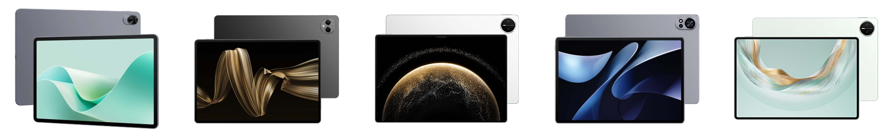


## 硬件说明


本章将介绍平板的屏幕方向、屏幕尺寸等信息。


### 屏幕规格信息


下面以MatePad Pro 13.2英寸设备为例，介绍其效果图、分辨率以及横纵断点，请参见下表所示的对应关系。


| [屏幕旋转角度（rotation）](https://developer.huawei.com/consumer/cn/doc/harmonyos-references/js-apis-display#属性) | 0(0度) | 1(90度) | 2(180度) | 3(270度) |
| --- | --- | --- | --- | --- |
| 效果图 |  |  |  |  |
| [屏幕方向Orientation](https://developer.huawei.com/consumer/cn/doc/harmonyos-references/js-apis-display#orientation10) | 横屏LANDSCAPE | 竖屏PORTRAIT | 反向横屏LANDSCAPE_INVERTED | 反向竖屏PORTRAIT_INVERTED |
| 屏幕ID | 0 | 0 | 0 | 0 |


> [!NOTE]
> MatePad Pro 13.2英寸 2025、MatePad Pro 12.2英寸 2025、MatePad Air 12英寸 2025、MatePad 11.5 S 2025，这四款平板设备符合上表的屏幕旋转角度和屏幕方向。MatePad Mini与这四款平板设备不一致，可参考下表。


下面以MatePad Mini设备为例，介绍其效果图、分辨率以及横纵断点，请参见下表所示的对应关系。


| [屏幕旋转角度（rotation）](https://developer.huawei.com/consumer/cn/doc/harmonyos-references/js-apis-display#属性) | 0(0度) | 1(90度) | 2(180度) | 3(270度) |
| --- | --- | --- | --- | --- |
| 效果图 |  |  |  |  |
| [屏幕方向Orientation](https://developer.huawei.com/consumer/cn/doc/harmonyos-references/js-apis-display#orientation10) | 竖屏PORTRAIT | 反向横屏LANDSCAPE_INVERTED | 反向竖屏PORTRAIT_INVERTED | 横屏LANDSCAPE |
| 屏幕ID | 0 | 0 | 0 | 0 |


常见平板设备的分辨率（px）、分辨率（vp）及断点，具体可参考下表。


| 常见平板产品型号 | 分辨率px | 分辨率vp(向下取整) | 横向断点+纵向断点 |
| --- | --- | --- | --- |
| MatePad Pro 13.2英寸 2025 | 2880*1920 | 1440*960 | 横屏/反向横屏：xl/sm，竖屏/反向竖屏：lg/lg |
| MatePad Pro 12.2英寸 2025 | 2800*1840 | 1317*865 | 横屏/反向横屏：lg/sm，竖屏/反向竖屏lg/lg |
| MatePad Air 12英寸 2025 | 2800*1840 | 1244*817 | 横屏/反向横屏：lg/sm，竖屏/反向竖屏md/lg |
| MatePad 11.5 S 2025 | 2800*1840 | 1120*736 | 横屏/反向横屏：lg/sm，竖屏/反向竖屏md/lg |
| MatePad Mini | 2560 *1600 | 1077*673 | 横屏/反向横屏：lg/sm，竖屏/反向竖屏md/lg |


### 其他硬件信息


平板相机有默认的相机镜头安装角度，在使用时需要考虑镜头角度和设备的旋转角度，具体定义可参考预览旋转角度。平板相机前置和后置镜头角度和需要设置的预览流旋转角度如下。


| [屏幕旋转角度（rotation）](https://developer.huawei.com/consumer/cn/doc/harmonyos-references/js-apis-display#属性) | 0(0度) | 1(90度) | 2(180度) | 3(270度) |
| --- | --- | --- | --- | --- |
| 示意图 |  |  |  |  |
| 后置相机镜头角度 | 90度 | 90度 | 90度 | 90度 |
| 后置相机拍摄预览流旋转角度 | 90度 | 180度 | 270度 | 0度 |
| 前置相机镜头角度 | 270度 | 270度 | 270度 | 270度 |
| 前置相机拍摄预览流旋转角度 | 270度 | 0度 | 90度 | 180度 |


> [!NOTE]
> 更多相机硬件差异和开发详情可参考[相机硬件差异](https://developer.huawei.com/consumer/cn/doc/best-practices/bpta-multi-device-camera)。


### 设备特有能力


支持自由悬浮窗口

平板设备同时支持自由多窗和悬浮窗，当开启自由多窗模式后，FLOATING代表自由多窗模式，反之，FLOATING代表悬浮窗模式。


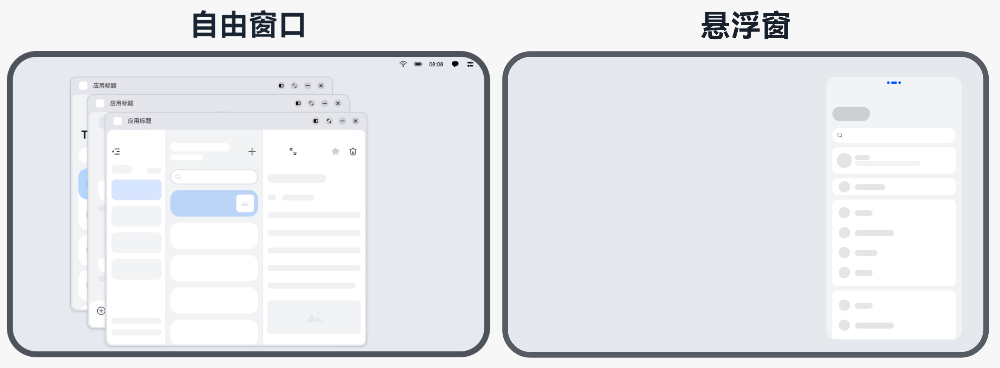


支持外接鼠标键盘

平板可以连接一些配件来提升交互的效率，带来更好的体验。鼠标和键盘的适配请参考大屏应用交互体验标准（鼠标、触控板和键盘交互），具体如下：

- 键盘：应用需要支持响应常用快捷键，便于用户快速操作。开发方案请参考[基础输入事件](https://developer.huawei.com/consumer/cn/doc/best-practices/bpta-multi-interaction#section151791829184110)的按键事件适配。
- 鼠标：平板设备上的应用支持交互的UI组件建议适配鼠标悬浮效果，开发方案请参考[交互归一](https://developer.huawei.com/consumer/cn/doc/best-practices/bpta-multi-interaction#section088812013815)事件适配。


## 体验标准


应用体验建议分为功能与兼容性、稳定性、性能、功耗、安全和UX六个部分，详细信息如下所示。


| 名称 | 简介 |
| --- | --- |
| [应用基础功能和兼容性体验建议](https://developer.huawei.com/consumer/cn/doc/harmonyos-guides/experience-suggestions-compatibility) | 应用与OS兼容、应用与设备兼容、应用升级兼容、功能体验相关等 |
| [应用稳定性体验建议](https://developer.huawei.com/consumer/cn/doc/harmonyos-guides/experience-suggestions-stability) | 长时间运行故障率（崩溃、冻屏等）、长时间运行内存资源异常 |
| [应用性能体验建议](https://developer.huawei.com/consumer/cn/doc/harmonyos-guides/performance-experience-suggestions) | 时延、帧率流畅体验和内存占用、CPU占用、线程数等资源占用约束 |
| [应用功耗体验建议](https://developer.huawei.com/consumer/cn/doc/harmonyos-guides/app-power-experience-standards) | 后台任务使用、后台硬件器件资源/软件系统资源占用管控，分布式资源占用等 |
| [应用安全隐私体验建议](https://developer.huawei.com/consumer/cn/doc/harmonyos-guides/security-privacy-experience-standards) | 基础安全、恶意软件、应用安全、隐私合规等 |
| [应用UX体验建议](https://developer.huawei.com/consumer/cn/doc/harmonyos-guides/experience-suggestions-ux) | 设计规范、设计约束的符合性，UX精致体验要求等 |


平板设备主要在UX上有着特殊的适配体验和建议，下文主要介绍平板的UX体验建议。


### UX体验标准


体验设计标准

平板设备配有中等分辨率的大屏幕，适用于影音娱乐、阅读学习及办公创作。详细的UX设计标准可参考平板、大屏应用UX体验标准。

平板的主要体验标准如下：

- **使用系统控件：**使用系统提供的底部页签、标题栏、弹出框等标准控件，在保证良好基础体验的同时，减少设计和开发的工作量。
- **使用合适的应用架构：**根据业务特点采用适宜的架构。例如，内容类应用通常采用侧边页签架构，以便快速切换不同类别的内容；效率类应用通常采用二分栏或三分栏架构，以实现快速高效的浏览。
- **考虑更多内容合理布局：**充分利用平板屏幕大尺寸的优势，使用响应式布局方法优化界面结构，以展示更多内容。有关响应式布局方法，请参阅[布局](https://developer.huawei.com/consumer/cn/doc/design-guides/design-layout-0000001748539680)。
- **考虑横竖屏和挖孔显示：**用户可能横屏或竖屏使用平板，除特殊类型外，应用/服务应该同时支持横屏和竖屏显示，以保证页面正常显示，不影响用户的使用。同时，也需针对挖孔位置合理显示界面内容。
- **考虑多任务交互：**利用大屏幕的优势来同时完成多种任务，并且结合上下文来聚焦当前任务，提高生产力效率。
- **支持更多交互方式：**在适宜的场景下，平板可连接配件以提升交互效率，优化用户体验。例如，手写笔、键盘、鼠标。
- **触控板等设备：**需要在设计中增加对这些配件的交互设计支持。关于平板支持的交互方式，请参阅[人机交互](https://developer.huawei.com/consumer/cn/doc/design-guides/pad-0000001823654157#section10191109163614)。


> [!NOTE]
> 不同尺寸屏幕下的页面布局应通过[断点](https://developer.huawei.com/consumer/cn/doc/best-practices/bpta-multi-device-responsive-layout#section1532120147301)进行划分和设计实现。


体验设计差异点

平板设备拥有中等分辨率的大屏幕，在开发应用时，建议采用响应式布局，页面根据屏幕尺寸自动调整布局，实时响应窗口尺寸变化，可以使内容以最优布局展示。响应式布局中最常用的特征是窗口宽度和窗口高宽比，可以将这些参数划分为不同的范围。应用需通过横纵断点来决定不同状态下的页面布局，关于断点的原理和使用示例，可参考断点。

应用设计最佳实践

根据上述UX体验标准和设计差异点，各垂域应用可根据功能和场景特点进行平板的UX设计；更多垂域设计信息和方案可参考应用设计最佳实践、多设备界面开发案例。


## 工程管理


在平板设备上运行的应用，需要在module.json5配置文件的module字段中增加支持的deviceTypes字段，即需增设"tablet"。更多详情可参考deviceTypes标签。


## 窗口适配


本章节主要介绍平板设备在窗口适配上需要适配的内容。


### 适配设备窗口模式


当前平板设备支持全屏、分屏、自由悬浮窗口三种应用窗口模式，其中自由悬浮窗口分为自由窗口和悬浮窗，各模式的详细信息见窗口模式。


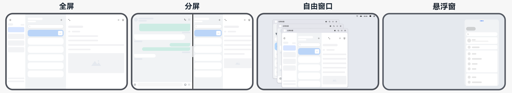
全屏

平板设备上的应用启动时默认全屏模式。

分屏

平板支持分屏窗口模式，一般用于两个应用长时间并行使用的场景，例如边看购物攻略边购物的场景；应用也可以主动实现应用内分屏。平板默认支持上下分屏和左右分屏，分屏窗口参数如下（以MatePad Pro 11为例），具体适配信息请参考分屏窗口模式适配。


| 分屏方式 | 分屏比例 | 旋转状态 | 分屏窗口尺寸(px) | 分屏窗口尺寸(vp)向下取整 | 分屏窗口断点 |
| --- | --- | --- | --- | --- | --- |
| 左右分屏 | 1:1(默认) | 横屏 | 1271*1600 | 564*711 | 横向断点md，纵向断点sm |
| 1:2 | 847*1600 | 376*711 | 横向断点sm，纵向断点sm |  |  |
| 2:1 | 1695*1600 | 753*711 | 横向断点md，纵向断点md |  |  |
| 上下分屏 | 1:1(默认) | 竖屏 | 1600*1271 | 711*564 | 横向断点md，纵向断点lg |
| 1:2 | 1600*847 | 711*376 | 横向断点md，纵向断点lg |  |  |
| 2:1 | 1600*1695 | 711*753 | 横向断点md，纵向断点md |  |  |


自由悬浮窗口

自由悬浮窗口分为自由窗口和悬浮窗。


> [!NOTE]
> 平板设备同时支持自由窗口和悬浮窗，开启自由多窗模式，FLOATING代表自由窗口；关闭自由多窗模式，FLOATING代表悬浮窗。平板设备上，用户下拉控制中心，点击自由多窗按钮，切换至自由多窗模式，窗口默认以自由窗口层叠显示。平板设备默认支持自由多窗模式，但需注意，MatePad Mini平板设备不支持该模式。


- 自由窗口：自由窗口的大小和位置可自由调整。同一个屏幕上可同时显示多个自由窗口，这些自由窗口按照打开或者获取焦点的顺序在Z轴排布。当自由窗口被点击或触摸时，其Z轴高度提升，并获取焦点。平板设备进入自由多窗模式后设备强制横屏，不支持切换竖屏。为优化窗口显示内容，DPI默认调整为最小档，并记忆调整前的DPI，用户可在设置-显示和亮度-字体大小和界面缩放中按需调整。退出自由多窗时恢复到记忆的DPI，如果用户在自由多窗模式下主动调整过DPI，则保持当前值不恢复记忆。具体适配信息请参考[自由窗口模式适配](https://developer.huawei.com/consumer/cn/doc/best-practices/bpta-multi-device-window-mode#section151195853214)。
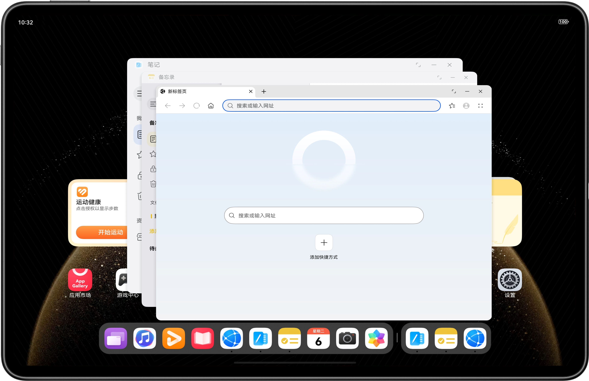
- **悬浮窗**：悬浮窗是一种在设备屏幕上悬浮的非全屏应用窗口。一般用于在已有全屏任务运行的基础上，临时处理另一个任务，或短时间多任务并行使用。如浏览网页的同时回复消息。具体适配信息请参考[悬浮窗口模式适配](https://developer.huawei.com/consumer/cn/doc/best-practices/bpta-multi-device-window-mode#section8433735123611)。
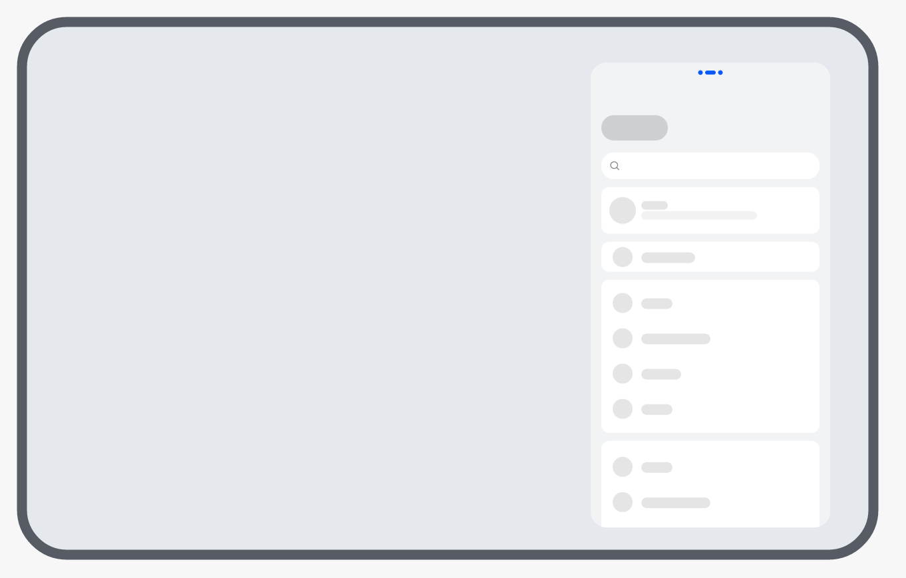
 在使用多窗口功能时，窗口尺寸会发生变化，可能影响布局。例如：应用进入竖向悬浮窗模式，窗口内容会根据窗口大小等比缩放。然而，窗口的高宽比变为3:4.575，与全屏模式（16:9或4:3）的比例不同。纵向比例相对较小，可能导致内容截断。开发者可参考[窗口模式变化常见问题](https://developer.huawei.com/consumer/cn/doc/best-practices/bpta-multi-device-window-mode#section2763122110135)。


### 适配窗口显示方向


平板设备支持横竖屏切换功能。当不同页面需要采用不同显示方向时，需在应用逻辑中动态调整窗口方向以实现该效果。平板可以通过设置窗口旋转策略（orientation）的方式控制应用的显示方向。窗口旋转策略（orientation）与屏幕旋转角度的关系请参考窗口的Orientation和屏幕rotation的关系。平板开发的横竖屏旋转策略以及适配方案可参考窗口方向。


| [屏幕旋转角度（rotation）](https://developer.huawei.com/consumer/cn/doc/harmonyos-references/js-apis-display#属性) | 0(0度) | 1(90度) | 2(180度) | 3(270度) |
| --- | --- | --- | --- | --- |
| 旋转状态 |  |  |  |  |
| 默认窗口旋转策略(Orientation) | UNSPECIFIED 未定义方向模式，由系统判定 |  |  |  |
| 表现形式 | AUTO_ROTATION_RESTRICTED 跟随传感器自动旋转，可以旋转到竖屏、横屏、反向竖屏、反向横屏四个方向，且受控制中心的旋转开关控制。 |  |  |  |


> [!NOTE]
> 表格中的参数表示屏幕属性中顺时针旋转角度（rotation）对应的窗口旋转策略。


平板应用推荐适配横竖屏切换功能，具体适配逻辑可参考为多设备配置旋转策略。

平板推荐的旋转逻辑如下。


| 产品类型 | 窗口全屏时尺寸（vp） | 是否支持横竖屏旋转（以348vp为阈值） | 系统是否默认支持横竖屏旋转 |
| --- | --- | --- | --- |
| 平板（MatePad Pro为例） | 711 * 1137 | 支持 | 支持 |


### 适配窗口沉浸式


建议适配不同窗口模式的沉浸式

平板设备支持的三种窗口模式：全屏、分屏、自由悬浮窗口（其中自由悬浮窗口分为自由窗口和悬浮窗）。应用可根据支持的窗口模式进行沉浸式适配，详情可参考窗口沉浸式。


建议适配不同窗口方向的沉浸式

平板设备在横屏状态和竖屏状态时，避让区（例如挖孔区）不一样，在不同旋转状态下避让区也会变化。窗口方向的变化引起避让区的变化的适配方案可参考窗口沉浸式。


## 界面开发


因为平板拥有独特的大尺寸屏幕优势，开发其应用时推荐使用响应式布局实时响应窗口尺寸变化，确保内容以最优布局展示。


### 大屏适配建议


大屏横屏

大屏横屏的特点主要表现为横向分辨率超过840vp，提供更宽广的显示视野和更强的信息承载能力，支持同时展示多个应用界面或复杂内容布局，显著提升多任务处理效率。典型设备有平板、三折叠三屏等。详情请参考大屏横屏。


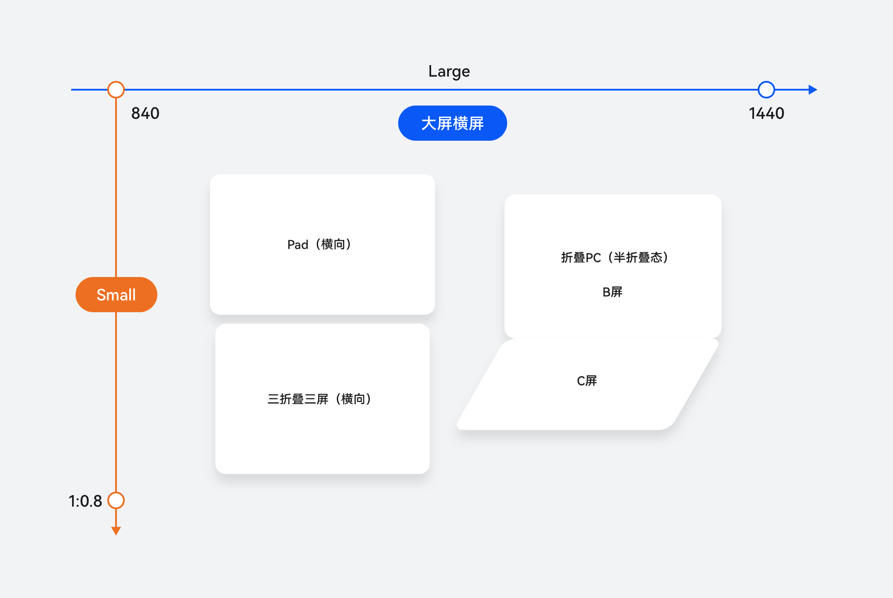


大屏竖屏

大屏竖屏是指原本设计为横屏使用的大屏幕设备在垂直方向上的展示形态，即这些设备从默认的横向模式旋转90度后的状态。大屏竖屏为大屏设备的竖向态，典型设备有平板（竖屏）、三折叠G态（竖屏）。详情请参考大屏竖屏。


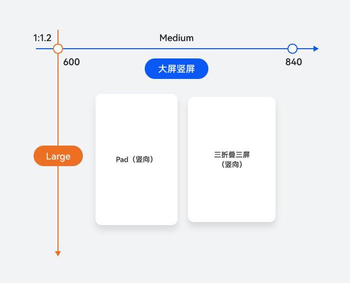


### 典型布局场景


平板设备上常见的响应式布局方式包括分栏布局、重复布局、挪移布局和缩进布局。应用可以利用不同的UI组件和断点来实现多样的布局，从而打造丰富的布局场景。


| 响应式布局方式 | 典型布局场景 | 实现方案 | 效果图 |
| --- | --- | --- | --- |
| 重复布局 | [列表布局](https://developer.huawei.com/consumer/cn/doc/best-practices/bpta-multi-device-page-layout#section122004555383) | List组件+断点 |  |
| [瀑布流布局](https://developer.huawei.com/consumer/cn/doc/best-practices/bpta-multi-device-page-layout#section4502451713) | WaterFlow组件+断点 |  |  |
| [轮播布局](https://developer.huawei.com/consumer/cn/doc/best-practices/bpta-multi-device-page-layout#section17659141914012) | Swiper组件+断点 |  |  |
| [网格布局](https://developer.huawei.com/consumer/cn/doc/best-practices/bpta-multi-device-page-layout#section1373617413916) | Grid组件+断点 |  |  |
| 分栏布局 | [侧边栏](https://developer.huawei.com/consumer/cn/doc/best-practices/bpta-multi-device-page-layout#section10393142415418) | SideBarContainer组件+断点 |  |
| [单/双栏](https://developer.huawei.com/consumer/cn/doc/best-practices/bpta-multi-device-page-layout#section631723412132) | Navigation组件+断点 |  |  |
| [三分栏](https://developer.huawei.com/consumer/cn/doc/best-practices/bpta-multi-device-page-layout#section5436540101314) | SideBarContainer组件+Navigation组件+断点 |  |  |
| 挪移布局 | [插图和文字组合布局](https://developer.huawei.com/consumer/cn/doc/best-practices/bpta-multi-device-page-layout#section12847170175118) | GridRow/GridCol组件+断点+栅格 |  |
| [底部/侧边导航](https://developer.huawei.com/consumer/cn/doc/best-practices/bpta-multi-device-page-layout#section498443175014) | Tabs组件+断点 |  |  |
| 缩进布局 | [单列列表布局](https://developer.huawei.com/consumer/cn/doc/best-practices/bpta-multi-device-page-layout#section1182411101519) | GridRow/GridCol组件+断点+栅格 |  |


上述典型布局场景的实现方式可参考页面布局场景。复杂的分栏布局，例如：在单栏和三栏布局之间切换时的路由跳转，可参考分栏布局。


### 兼容模式


- **兼容运行**兼容运行是HarmonyOS为开发者提供的在PAD设备上直接运行手机应用的方式。 **兼容运行在PAD设备的体验** 当应用在横屏模式下运行时，会进入兼容模式显示（可通过从竖屏旋转至横屏或在横屏状态下冷启动来进入）。窗口高度有两种设置方式： 屏幕高度，窗口宽度与高度的比例为9:18。
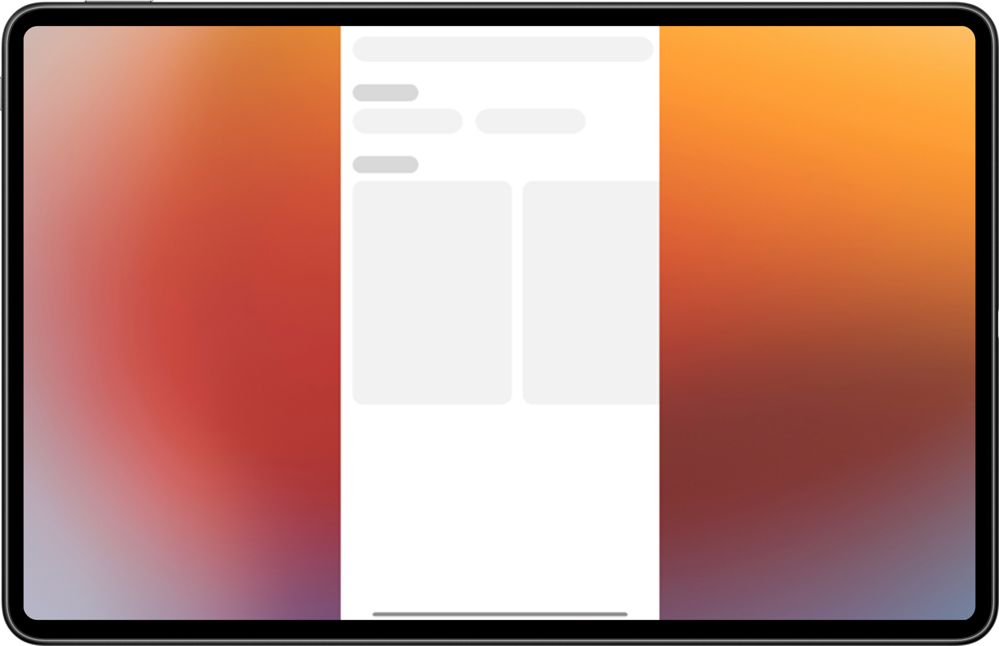
- 屏幕高度，窗口宽度与高度的比例为1:1。
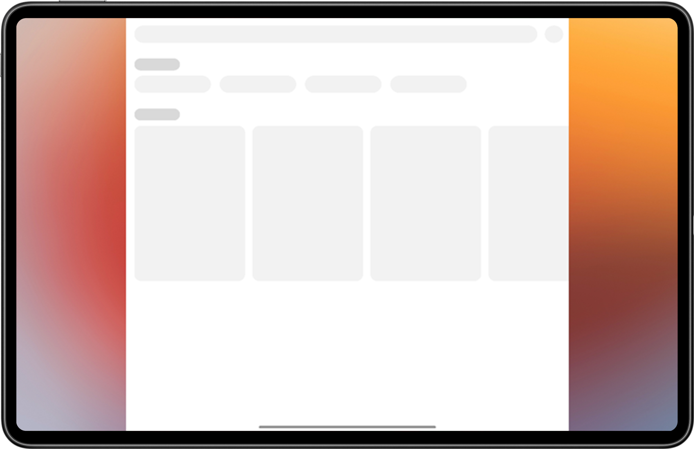
- **兼容运行工程配置****项目工程配置** 已支持手机的应用（非游戏类应用）现可在PAD上兼容运行。需在应用Entry Module的module.json5中移除对tablet设备的支持。
```text
"deviceTypes": [
"phone",
"tablet" // (需在应用Entry Module的module.json5中移除对tablet设备的支持)
]
```
 **兼容模式下窗口展示逻辑** 在PAD设备上，应用进入小窗的规则如下： 方向策略：module.json5中Ability的"orientation"配置（仅支持竖屏）应选择以下选项之一：{"portrait", "portrait_inverted", "auto_rotation_portrait", "auto_rotation_portrait_restricted"}。
- module.json5中Ability的"orientation"配置（仅支持竖屏）应设置为"unspecified"或"locked"之一，且deviceTypes仅限于"phone"。

 应用兼容性调试
目的：为了方便开发者在PAD设备上进行横屏适配，系统提供了一个设置选项，用于清除系统兼容策略。

PAD设备上清除窗口锁定策略的方法

应用安装后，检查设置中的相应选项（设置->显示和亮度->强制横屏），将比例调整为原始比例，以退出兼容模式，供开发者调试。


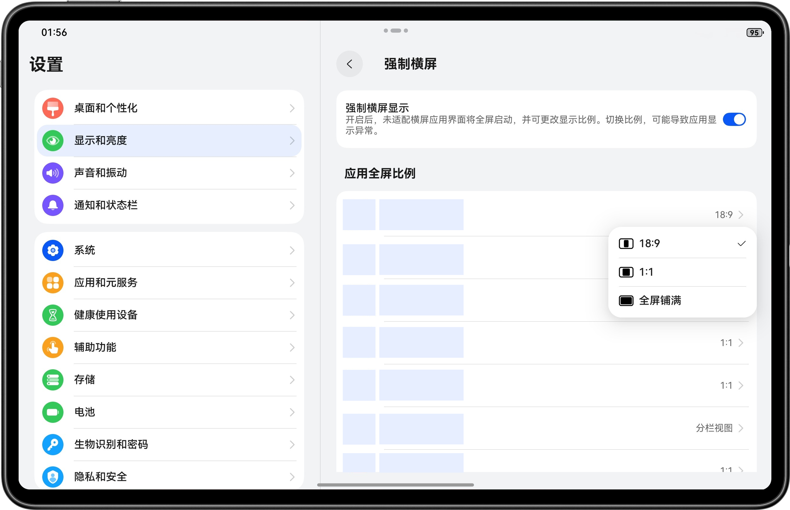

 兼容运行上架配置
PAD兼容运行方式如何上架

应用上架过程中，默认将以兼容模式上架PAD设备。上架说明如下图：


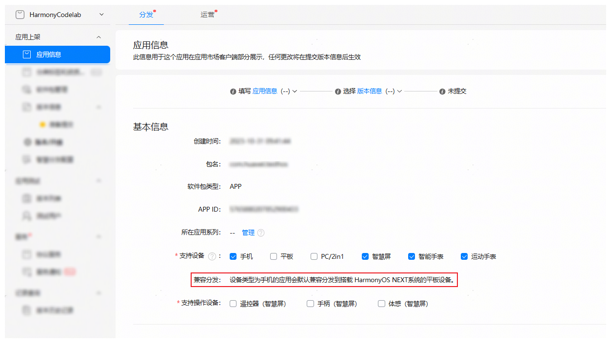


 需要排查或简单适配内容
兼容模式下应用运行和适配的原则

原则上，兼容应用只需对差异化部分进行少量适配或不进行适配。具体是否需要适配，请参考下方文档进行排查和处理。


相机显示问题

建议严格遵循规范进行适配，确保相机图像的方向和角度正常，并避免内容出现挤压。详情请参考：Camera Kit（相机服务）。


接口行为差异


| 差异点 | 差异影响 | 相关场景 |
| --- | --- | --- |
| Display尺寸 | 兼容模式下，通过以下接口： display.getAllDisplays()display.getDisplayByIdSync()display.getDefaultDisplaySync() 获取到的Display.width和Display.height，以及DPI，并非设备的实际分辨率和DPI | PAD横屏竖显场景 PAD自由多窗模式：自由窗口和最大化场景 |
| 方向请求 | 兼容模式下，应用通过window.setPreferredOrientation()申请横屏/竖屏方向时，会触发应用窗口在横屏全屏与竖屏居中之间切换，但不会改变屏幕的实际方向 | PAD横屏竖显场景 PAD自由多窗模式：自由窗口和最大化场景 |


PhotoPicker的体验差异

PAD支持使用PhotoPicker组件访问图片/视频。

不同Picker访问范围：


| Picker | 可访问范围 |
| --- | --- |
| PhotoPicker(PhotoViewPicker) | 支持访问媒体库内的图片/视频 支持保存图片/视频到媒体库 |
| FilePicker(DocumentViewPicker) | 支持访问公共目录下的文件 支持保存图片/视频/文件到公共目录 |


建议方案一：

当应用对媒体库进行访问或保存操作时，可继续使用PhotoPicker。

建议方案二：

当应用需要访问或保存媒体库以外的文件时，建议使用FilePicker。

1. 查看文件：FilePicker可访问公共目录下的文件，同时支持访问媒体库（图库）中的图片和视频。
2. 保存文件：当应用保存文件时使用FilePicker的save模式，文件由用户选择公共目录。


| 场景 | 建议方法 | 实现机制 |
| --- | --- | --- |
| 应用内新建文本/文档，用户点击应用提供的保存按钮/选项 | 使用FilePicker由用户选择保存路径以及文件名 | 创建文件选择器DocumentViewPicker实例。调用save()接口拉起FilePicker界面进行文件保存 应用如果后续需要对该文件继续访问需调用文件持久化接口对授权文件进行持久化操作 |
| 应用内打开文件进行查看/编辑操作，用户点击应用提供的打开文件按钮 | 使用FilePicker由用户选择需要打开的文件 | 创建文件选择器DocumentViewPicker实例。调用select()接口拉起FilePicker应用界面进行文件选择 系统在用户选择文件后，将该文件读写权限授予应用 |
| 应用内打开预制3D目录下的文件（仅限PAD&PC） | 使用3D目录预授权，用户同意后，应用可访问对应文件夹下的文件 | 调用系统接口 下载目录："ohos.permission.READ_WRITE_DOWNLOAD_DIRECTORY" 文档目录："ohos.permission.READ_WRITE_DOCUMENTS_DIRECTORY" |
| 应用获取到文件/文件夹的URI，但是没有访问权限时，申请单文件/文件夹授权（文件夹授权仅限PAD&PC） | 使用FilePicker授权模式，同时传递URI | 创建文件选择器DocumentViewPicker实例。调用select()接口拉起FilePicker应用界面进行文件选择。携带参数authMode 与defaultFilePathUri此授权仍然为临时授权，需要应用申请文件/文件夹持久化 |
| 应用选择指定目录保存文件 | 使用FilePicker由用户选择需要打开的文件 | 创建文件选择器DocumentViewPicker实例。调用select()接口DocumentSelectMode传递参数为"FOLDER"拉起FilePicker应用界面进行文件夹选择 此授权仍然为临时授权，需要应用申请文件夹持久化 |


 兼容模式的分栏显示体验
如何进入分栏显示模式

在设置->显示和亮度->强制横屏菜单中，支持分栏视图的应用，在弹出菜单中会显示分栏视图选项，用户勾选分栏视图的应用，在横屏全屏下会进入分栏视图显示。

开启分栏视图的应用，在横屏下会以Page为单位左右分栏显示，当页面栈中只有主页(第一个Page)时，系统会自动在右侧补充显示一个PlaceHolder页。

PlaceHolder显示效果


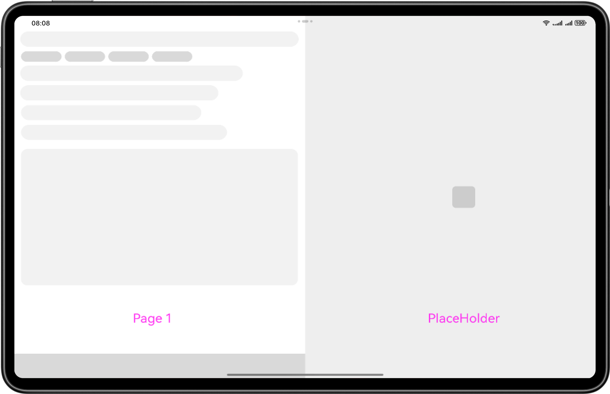


Page分栏显示效果


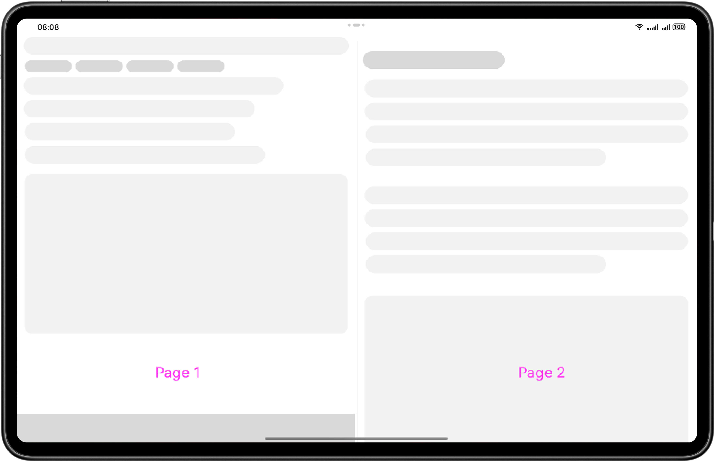


强制分栏下的页面跳转规则


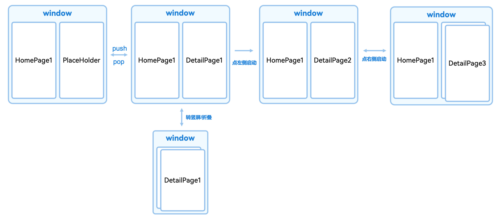


分栏显示模式下的应用可进行的优化

- 建议应用根据Page页面的父容器大小进行自适应布局，不要固定窗口或屏幕尺寸。
- 进入应用分栏视图之间的流转流程明确，主视图和分栏视图有主次关系或者平行关系。
- 使用Navigation时，注意可存在多个页面的场景，生命周期需要考虑这种情况，业务场景上不再是单一页面显示。


## 交互适配


平板设备上的应用，需要考虑更多交互场景，触控屏和键鼠的适配请参考大屏应用交互体验标准（鼠标、触控板和键盘交互）。

常见交互事件包含以下4个方面：

- 交互归一：在平板设备上，应用应保证用户体验与其他设备上保持一致。开发方案请参考[交互归一](https://developer.huawei.com/consumer/cn/doc/best-practices/bpta-multi-interaction#section088812013815)事件适配。
- 鼠标悬浮效果：平板设备上的应用支持交互的UI组件建议适配鼠标悬浮效果。开发方案请参考[交互归一](https://developer.huawei.com/consumer/cn/doc/best-practices/bpta-multi-interaction#section088812013815)事件适配。
- 焦点导航：设备接入键盘后，应用应支持通过键盘实现焦点导航，指示用户当前焦点位置。开发方案请参考[焦点事件](https://developer.huawei.com/consumer/cn/doc/best-practices/bpta-multi-interaction#section168661941154220)。
- 键盘快捷键：应用需要支持响应常用快捷键，便于用户快速操作。开发方案请参考[交互归一](https://developer.huawei.com/consumer/cn/doc/best-practices/bpta-multi-interaction#section088812013815)事件适配。外接键盘时，系统提供了ESC默认按键事件，此时应用未响应ESC，返回上一页。onKeyEvent事件默认是冒泡的，在onKeyEvent事件的回调函数中，若事件已被处理，建议开发者返回true，表示已消费该事件。这可以阻止事件继续冒泡，避免上层节点重复响应，从而防止按键事件被触发多次。
- 手写笔：平板配备手写笔，可提供压感、高精度、低延迟等专业交互，大幅提升笔记、批注、创作等场景的效率与体验。手写笔相关功能开发可参考[Pen Kit简介](https://developer.huawei.com/consumer/cn/doc/harmonyos-guides/pen-introduction)。

> [!NOTE]
> 平板通常情况下仅使用触控屏进行交互，使用交互归一进行适配；当外接键盘或鼠标时，可以考虑鼠标悬浮效果、焦点导航和键盘快捷键的适配。


## 功能开发


### 相机开发


对于需要实现相机页面和功能的应用，在平板上需要对不同的屏幕尺寸，相机镜头进行适配。平板相机开发详情请参考相机硬件差异，主要考虑的有以下几点。

- 相机页面布局：通过横向断点区分和实现不同形态屏幕的页面布局，可参考[通过断点实现多套页面布局](https://developer.huawei.com/consumer/cn/doc/best-practices/bpta-multi-device-camera#section181143569262)。
- 相机设备选择：根据相机的状态和位置，选择当前形态下可用的相机，可参考[选择相机设备](https://developer.huawei.com/consumer/cn/doc/best-practices/bpta-multi-device-camera#section13854163154917)。
- 相机预览流配置：配置预览流分辨率，避免出现压缩、拉伸、异常旋转的问题，可参考[设置多设备上相机预览画面比例](https://developer.huawei.com/consumer/cn/doc/best-practices/bpta-multi-device-camera#section882216138497)。
- 拍照旋转适配：在横竖屏拍照场景下，正确获取并设置旋转角度，需确保图片始终正向显示，可参考[设置拍照旋转角度](https://developer.huawei.com/consumer/cn/doc/best-practices/bpta-multi-device-camera#section0752024124911)。


### 功能差异


下表介绍常见平板产品之间的功能差异。


| 功能/常见平板产品型号 | MatePad Pro 13.2英寸 2025 | MatePad Pro 12.2英寸 2025 | MatePad Air 12英寸 2025 | MatePad 11.5 S 2025 | MatePad Mini |
| --- | --- | --- | --- | --- | --- |
| 网络定位 | ✓ | ✓ | ✓ | ✓ | ✓ |
| GPS | ✓ | ✓ | / | / | ✓ |
| 霍尔传感器 | ✓ | ✓ | ✓ | ✓ | ✓ |
| 陀螺仪 | ✓ | ✓ | ✓ | ✓ | ✓ |
| 气压计 | / | / | / | / | / |
| NFC | / | / | / | / | / |
| 指南针 | ✓ | ✓ | / | / | ✓ |
| 状态指示灯 | / | / | / | / | / |
| 环境光传感器 | ✓ | ✓ | ✓ | ✓ | ✓ |
| 接近光传感器 | / | / | / | / | ✓ |
| 重力传感器 | ✓ | ✓ | ✓ | ✓ | ✓ |
| 红外传感器 | / | / | / | / | / |
| 温度传感器 | / | / | / | / | / |
| 距离传感器 | / | / | / | / | / |
| 指纹传感器 | ✓ | ✓ | / | / | ✓ |


## 典型业务案例


### 长视频


在全屏播放视频时，长视频类应用通过横向大屏能有效提升用户的观看体验。详细开发方案可参考多设备长视频界面。


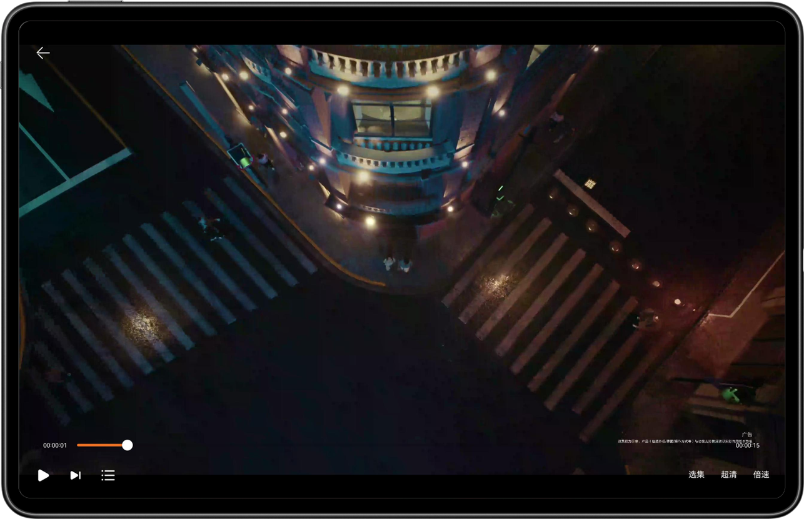


### 即时通讯


在即时通讯应用中，平板可采用三分栏布局，带来流畅的聊天体验。左侧为目录，中间显示联系人列表，右侧为聊天区域。自适应布局，配合手写笔支持，使社交沟通更加便捷。详细开发方案可参考多设备即时通讯界面。


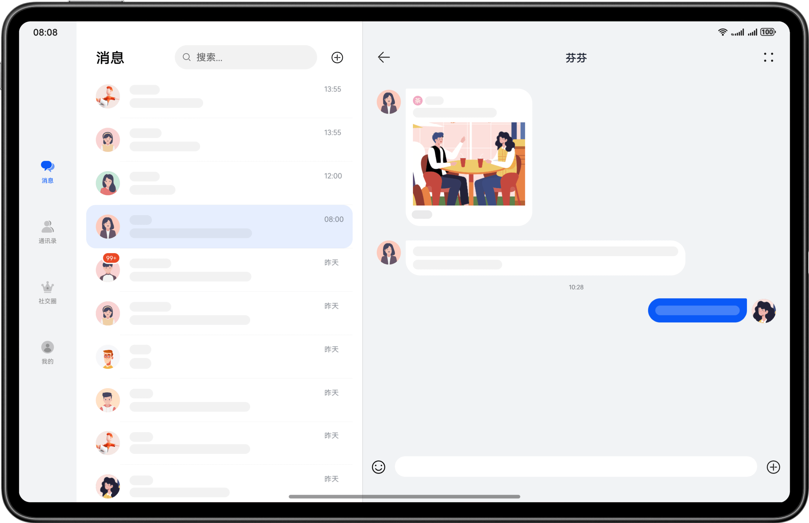


更多垂域案例可参考多设备界面开发案例。
