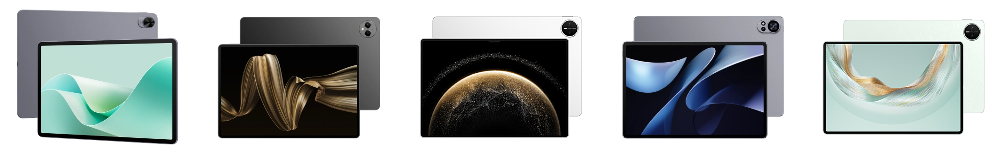
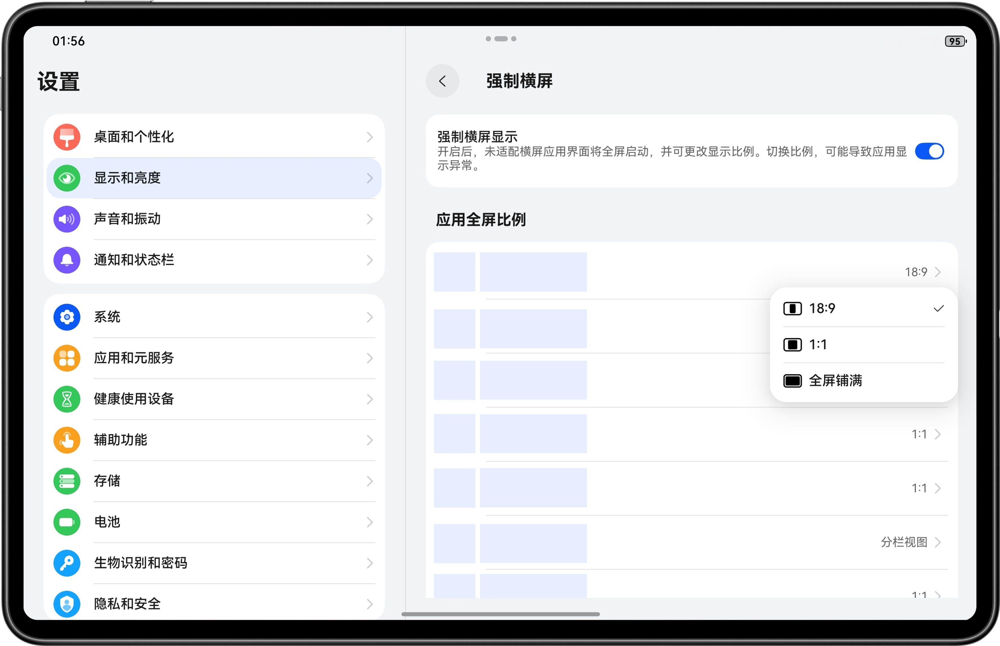
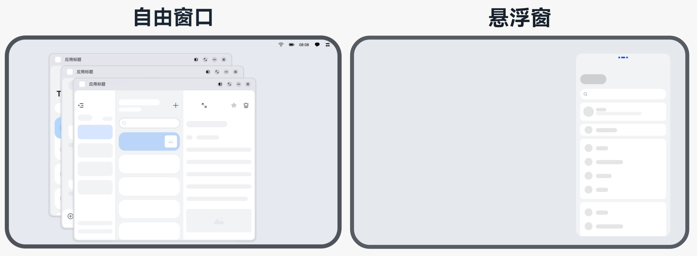
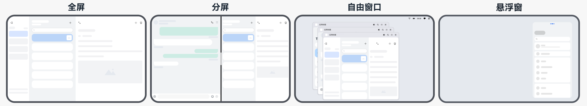
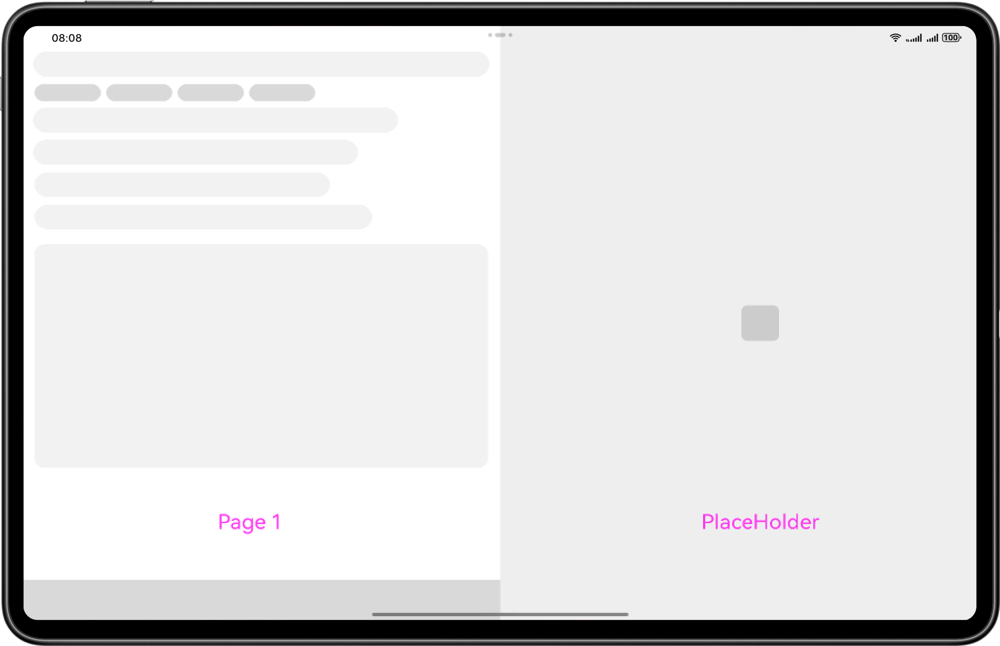
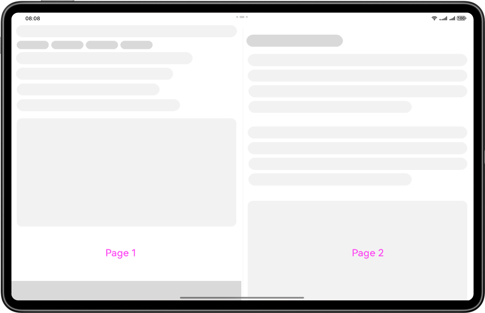
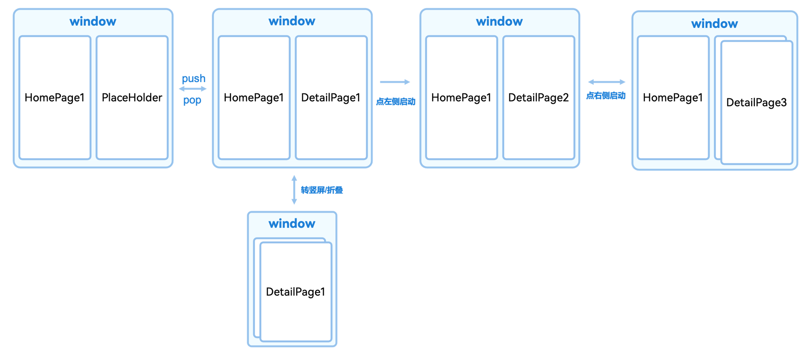
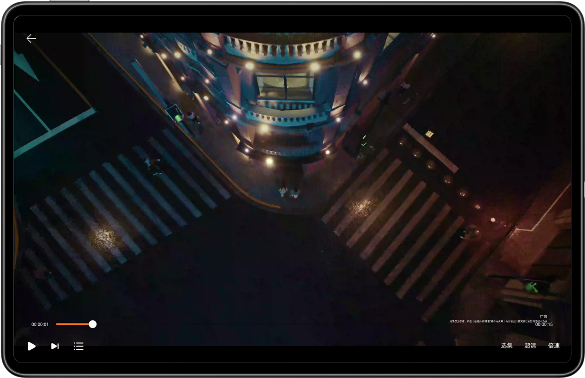
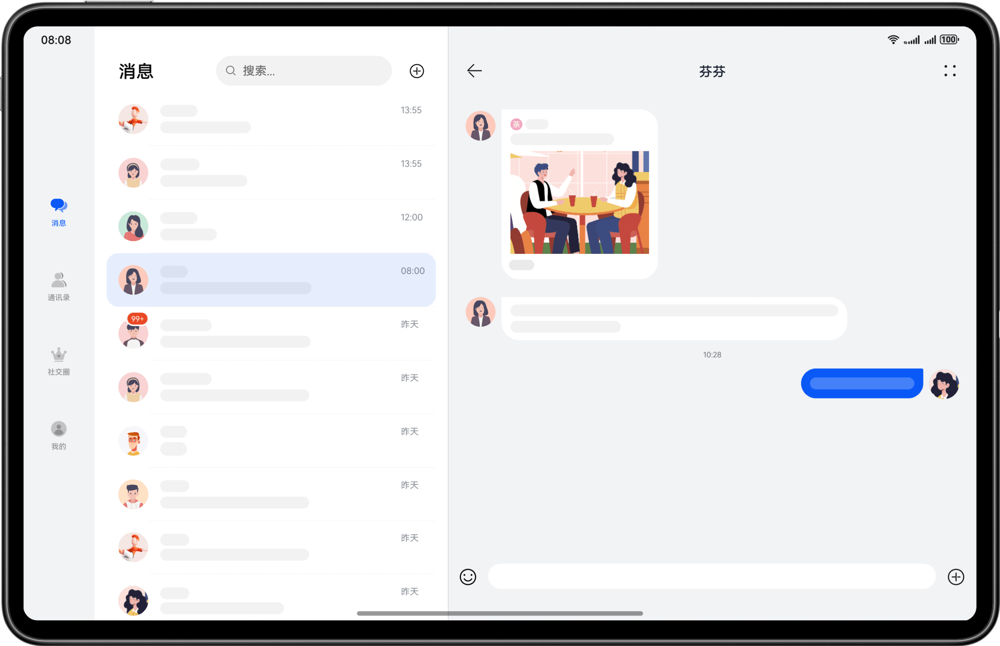

# 平板应用开发

更新时间：2026-05-30 09:52:30

来源：https://developer.huawei.com/consumer/cn/doc/best-practices/bpta-pad-guide

#### 概述

平板作为常用的移动端设备，在日常生活中发挥着重要作用，是HarmonyOS 1+8设备全场景一体化体验中不可或缺的部分。
 
 
相对于直板机，平板设备有以下明显特点：
 
- 平板设备拥有较高分辨率的大屏幕，可以用来展示更多内容，实现高效学习、娱乐或办公。
- 平板支持横向和竖向手持。
- 平板支持全屏、分屏、自由多窗、悬浮窗四种窗口模式显示应用。
- 平板可以通过无线方式（如蓝牙）外接键鼠。

 
当前平板产品主要包括：MatePad Edge 系列、MatePad Pro系列、MatePad Mini 系列、MatePad Air系列、MatePad系列和MatePad SE 系列。
 



 
> [!NOTE]
> 本文聚焦于平板应用的体验提升开发指导。如需多设备开发的基础通用能力指导，请参考“ 一次开发，多端部署概览 ”系列文章。

 

#### 产品硬件说明

本章将介绍平板的屏幕方向、屏幕尺寸以及相机硬件参数等信息。
 
 

#### 屏幕规格信息

下面以MatePad Pro 13.2英寸设备为例，介绍其效果图、分辨率以及横纵断点，请参见下表所示的对应关系。
  
| 屏幕旋转角(rotation) | 0(0度) | 1(90度) | 2(180度) | 3(270度) |
| --- | --- | --- | --- | --- |
| 效果图 |  |  |  |  |
| --- | --- | --- | --- | --- |
| 屏幕方向(Orientation) | 横屏LANDSCAPE | 竖屏PORTRAIT | 反向横屏LANDSCAPE_INVERTED | 反向竖屏PORTRAIT_INVERTED |
| --- | --- | --- | --- | --- |
| 屏幕ID | 0 | 0 | 0 | 0 |
| --- | --- | --- | --- | --- |
 
 
> [!NOTE]
> MatePad Pro 13.2英寸 2025、MatePad Pro 12.2英寸 2025、MatePad Air 12英寸 2025、MatePad 11.5 S 2025，这四款平板设备符合上表的屏幕旋转角度和屏幕方向。MatePad Mini与这四款平板设备不一致，可参考下表。

 
下面以MatePad Mini设备为例，介绍其效果图、分辨率以及横纵断点，请参见下表所示的对应关系。
  
| 屏幕旋转角(rotation) | 0(0度) | 1(90度) | 2(180度) | 3(270度) |
| --- | --- | --- | --- | --- |
| 效果图 |  |  |  |  |
| 屏幕方向(Orientation) | 竖屏PORTRAIT | 反向横屏LANDSCAPE_INVERTED | 反向竖屏PORTRAIT_INVERTED | 横屏LANDSCAPE |
| 屏幕ID | 0 | 0 | 0 | 0 |
 
 
常见平板设备的分辨率(px)、分辨率(vp)及断点，具体可参考下表。
  
| 常见平板产品型号 | 分辨率px | 分辨率vp(向下取整) | 横向断点+纵向断点 |
| --- | --- | --- | --- |
| MatePad Pro 13.2英寸 2025 | 2880*1920 | 1440*960 | 横屏/反向横屏：xl/sm，竖屏/反向竖屏：lg/lg |
| MatePad Pro 12.2英寸 2025 | 2800*1840 | 1317*865 | 横屏/反向横屏：lg/sm，竖屏/反向竖屏lg/lg |
| MatePad Air 12英寸 2025 | 2800*1840 | 1244*817 | 横屏/反向横屏：lg/sm，竖屏/反向竖屏md/lg |
| MatePad 11.5 S 2025 | 2800*1840 | 1120*736 | 横屏/反向横屏：lg/sm，竖屏/反向竖屏md/lg |
| MatePad Mini | 2560 *1600 | 1077*673 | 横屏/反向横屏：lg/sm，竖屏/反向竖屏md/lg |
 
 
 

#### 相机硬件信息

平板相机有默认的[相机镜头安装角度](https://developer.huawei.com/consumer/cn/doc/harmonyos-guides/camera-rotation-term#相机镜头安装角度)，在使用时需要考虑镜头角度和设备的旋转角度，具体定义可参考[预览旋转角度](https://developer.huawei.com/consumer/cn/doc/harmonyos-guides/camera-rotation-term#预览旋转角度)。平板相机前置和后置镜头角度和需要设置的预览流旋转角度如下。
  
| 屏幕旋转角度(rotation) | 0(0度) | 1(90度) | 2(180度) | 3(270度) |
| --- | --- | --- | --- | --- |
| 示意图 |  |  |  |  |
| --- | --- | --- | --- | --- |
| 后置相机镜头角度 | 90度 | 90度 | 90度 | 90度 |
| --- | --- | --- | --- | --- |
| 后置相机拍摄预览流旋转角度 | 90度 | 180度 | 270度 | 0度 |
| --- | --- | --- | --- | --- |
| 前置相机镜头角度 | 270度 | 270度 | 270度 | 270度 |
| --- | --- | --- | --- | --- |
| 前置相机拍摄预览流旋转角度 | 270度 | 0度 | 90度 | 180度 |
| --- | --- | --- | --- | --- |
 
 
 

#### 创新与体验提升

 

#### 交互跟手

相较于直板机，平板拥有更宽广的显示视野，信息承载量更大，用户可操作范围也更广。为进一步提升平板大屏的使用体验，建议适配系统全新交互能力，通过接入智感握姿、跟手弹窗和跟手半模态等新特性，让用户操作更快捷、高效。
 1. **跟手弹框**：为了减少用户操作路径过长的情况，在平板上可通过跟手弹窗进行展示，弹出框的弹出位置离手更近，以便用户能够快速操作。



  通过订阅握持手状态变化感知事件[motion.on('holdingHandChanged')](https://developer.huawei.com/consumer/cn/doc/harmonyos-references/js-apis-awareness-motion#motiononholdinghandchanged-20)，获取到握持手信息后，更改组件的显示位置。
2. **跟手半模态**：在平板上，可以考虑跟手半模态窗口或者居中半模态窗口显示，具体根据业务需要选择。


  使用[bindSheet](https://developer.huawei.com/consumer/cn/doc/harmonyos-references/ts-universal-attributes-sheet-transition#bindsheet)绑定半模态转场时，设置半模态属性preferType为[SheetType](https://developer.huawei.com/consumer/cn/doc/harmonyos-references/ts-universal-attributes-sheet-transition#sheettype11枚举说明).POPUP。设置该属性后，窗口宽度小于600vp的设备将默认显示底部弹窗，其他设备则自动适配为跟手弹窗。
 
 

#### 悬浮组件

在平板设备上，可借助[HdsTab](https://developer.huawei.com/consumer/cn/doc/harmonyos-references/ui-design-hdstabs)组件的[barFloatingStyle](https://developer.huawei.com/consumer/cn/doc/harmonyos-references/ui-design-hdstabs#barfloatingstyle)属性实现悬浮导航栏，进一步释放屏幕可视区域；通过悬浮材质参数[SystemMaterialParams](https://developer.huawei.com/consumer/cn/doc/harmonyos-references/ui-design-hdstabs#systemmaterialparams)配置透明磨砂材质效果，提升界面通透感，适配沉浸式浏览体验。搭配[HdsTabsMiniBar](https://developer.huawei.com/consumer/cn/doc/harmonyos-references/ui-design-hdstabs#hdstabsminibar)可扩展迷你标签栏，拓展多维度快捷入口，可适配大屏的分区操作，有效提升操作效率与使用体验。
 



 
 

#### 视频自适应沉浸

平板设备可依托大屏带来的开阔视野提升视频观看体验，同时为避免画面出现拉伸、裁剪、比例异常等问题，建议采用自适应沉浸全屏播放方案，精简界面元素、减少视觉干扰，引导用户聚焦视频内容，提升整体观看体验。具体实现方案，可参考[视频适配不同尺寸屏幕](https://developer.huawei.com/consumer/cn/doc/best-practices/bpta-multi-device-screen-diff#section1452572513130)章节。
 



 
 

#### 手写笔适配

平板的交互方式主要为触控屏，常见的操作有点击、双击、长按、拖拽等，应用可根据这些操作进行功能适配，详情可参考[多设备交互](https://developer.huawei.com/consumer/cn/doc/best-practices/bpta-multi-interaction)。
 
手写笔作为平板的最佳搭档，支持无感连接与低延迟传输，开盒即用，适用于全局批注、提笔速记及按键遥控等功能场景，实现流畅自然的书写与交互体验。系统提供的[Pen Kit](https://developer.huawei.com/consumer/cn/doc/harmonyos-guides/pen-introduction)能力，可助力开发者灵活接入手写套件、全局取色、一笔成形等接口，提升书写交互的扩展性与创作效率。
 
 

#### 键鼠适配

除触控屏交互外，平板还支持外接键鼠进行交互，键鼠交互事件的适配应包含：
 
- 鼠标悬浮效果：平板设备中，应用内可交互UI组件建议适配鼠标悬浮效果。开发方案请参考[交互归一](https://developer.huawei.com/consumer/cn/doc/best-practices/bpta-multi-interaction#section088812013815)进行适配。
- 键盘快捷键：应用需支持常用快捷键响应，提升用户操作效率。开发方案请参考[交互归一](https://developer.huawei.com/consumer/cn/doc/best-practices/bpta-multi-interaction#section088812013815)进行适配。

 
> [!NOTE]
> 外接键盘时，系统默认提供ESC按键事件，若应用未监听ESC事件，则返回上一页。onKeyEvent事件是默认冒泡的，在其回调方法中，若按键事件已完成处理，建议返回true完成事件消费，避免事件继续向上冒泡，造成上层节点重复响应，导致按键事件被触发多次。

 
 

#### 焦点导航

平板设备接入键盘与应用程序进行间接交互时，建议将页面中可操作元素设置为可获焦状态，并配置获焦视觉效果，清晰指示当前焦点位置，以保证交互体验。开发方案请参考[焦点事件](https://developer.huawei.com/consumer/cn/doc/best-practices/bpta-multi-interaction#section168661941154220)。
 
> [!NOTE]
> 通常情况下，平板设备以触控交互为主，可通过 交互归一 完成基础适配；当外接键鼠时，可额外适配鼠标悬浮效果、键盘快捷键及焦点导航，完善多输入方式的操作体验。

 
 

#### 全景多窗

[全景多窗](https://developer.huawei.com/consumer/cn/doc/harmonyos-guides/multi-window-intro#全景多窗)旨在帮助用户高效处理多个任务。通过全景多窗，用户可以突破物理屏幕局限，在同一屏幕内并行运行多款应用，实现应用间快捷切换，提升操作效率。相较于直板机，平板拥有更大的显示视野，具备更强的信息展示与内容承载能力。横屏状态下可依托全景多窗能力，充分利用大屏空间优势，最高支持三个窗口同屏并行运行，助力用户一边浏览资讯、一边编辑内容、一边沟通办公，多任务同步处理、互不冲突，实现办公、娱乐、日常操作一站式协同。
 
 

#### 兼容模式

本章节介绍平板兼容模式的运行规则、适配要点及分栏显示相关配置与优化方式。
 
 

#### 兼容运行

兼容运行是HarmonyOS为开发者提供的在平板设备上直接运行手机应用的方式。
 
应用在横屏状态运行时将自动进入兼容模式（可通过竖屏旋转为横屏、横屏冷启动两种方式触发）。窗口高度有两种设置方式：
 
1. 设置为屏幕高度，且窗口宽度与高度的比例为9:18。


2. 设置为屏幕高度，且窗口宽度与高度的比例为1:1。


 

#### 兼容运行工程配置

**项目工程配置**
 
已适配手机的应用（非游戏类应用）在平板上兼容运行时，需在应用Entry Module的module.json5中移除对tablet设备的支持。
 
```json
"deviceTypes": [
  "phone",
  "tablet" // (需在应用Entry Module的module.json5中移除对tablet设备的支持)
]
```
 
**兼容模式下窗口展示逻辑**
 
在平板设备上，应用进入小窗需满足以下方向策略任一条件：
 1. module.json5中Ability的"orientation"配置（仅支持竖屏）应选择以下选项之一：{"portrait", "portrait_inverted", "auto_rotation_portrait", "auto_rotation_portrait_restricted"}。
2. module.json5中Ability的"orientation"配置（仅支持竖屏）应设置为"unspecified"或"locked"之一，且deviceTypes仅限于"phone"。
 
 

#### 应用兼容性测试

为了方便开发者在平板设备上进行横屏适配，系统提供了一个设置选项，用于清除系统兼容策略。
 
应用安装完成后，进入设置->显示和亮度->强制横屏，将显示比例调整为原始比例，即可退出兼容模式，用于调试适配。
 
 



 

#### 兼容运行上架配置

应用上架过程中，默认将以兼容模式上架平板设备，如下图所示。
 



 
 

#### 需要排查或简单适配的内容

原则上，兼容运行的应用仅需针对差异点做少量适配，或无需额外适配；具体适配要求可参考下文说明逐一排查处理。
 
- 相机显示差异建议严格按照规范完成相机适配，保证图像方向与角度正常，避免画面挤压。详情请参考：[Camera Kit（相机服务）](https://developer.huawei.com/consumer/cn/doc/harmonyos-guides/camera-kit)。
- 接口行为差异：Display尺寸与屏幕方向相关接口存在行为差异，具体如下表所示。

| 差异点 | 差异影响 | 相关场景 |

| --- | --- | --- |

| Display尺寸 | 兼容模式下，通过display.getAllDisplays()、display.getDisplayByIdSync()、display.getDefaultDisplaySync()获取到的Display.width、Display.height以及DPI，并非设备实际的分辨率和DPI。 | 平板横屏竖显场景；平板自由多窗模式：自由窗口和最大化场景。 |

| 方向请求 | 兼容模式下，应用通过window.setPreferredOrientation()切换横竖屏方向时，仅会使应用窗口在横屏全屏与竖屏居中两种形态间切换，不会改变设备实际屏幕方向。 | 平板横屏竖显场景；平板自由多窗模式：自由窗口和最大化场景。 |
- PhotoPicker体验差异：平板支持使用PhotoPicker组件访问图片/视频。不同Picker访问范围如下表所示。

| Picker | 可访问范围 |

| --- | --- |

| PhotoPicker(PhotoViewPicker) | 支持访问媒体库内的图片/视频；支持保存图片/视频到媒体库。 |

| FilePicker(DocumentViewPicker) | 支持访问公共目录下的文件；支持保存图片/视频/文件到公共目录。 |

  对于PhotoPicker体验差异，建议采用如下方案进行适配。

  应用对媒体库进行访问或保存操作时，可继续使用PhotoPicker；若应用需要访问或保存媒体库以外的文件，建议使用FilePicker。
查看文件：FilePicker支持访问公共目录文件及媒体库（图库）中的图片和视频。
- 保存文件：应用可通过FilePicker的save模式，由用户自主选择公共目录完成文件保存。

 
  
| 场景 | 建议方法 | 实现机制 |
| --- | --- | --- |
| 用户在应用内新建文本或文档后，点击应用提供的保存按钮/选项。 | 使用FilePicker由用户选择保存路径以及文件名。 | 创建DocumentViewPicker文件选择器实例，调用save()接口拉起FilePicker界面完成文件保存；若应用后续需再次访问该文件，应调用文件持久化接口对授权文件执行持久化操作。 |
| 户在应用内点击打开文件按钮，对文件进行查看或编辑操作。 | 使用FilePicker由用户选择需要打开的文件。 | 创建DocumentViewPicker文件选择器实例，调用select()接口拉起FilePicker界面供用户选择文件；用户选定文件后，系统将授予应用该文件的读写权限。 |
| 应用内打开预制3D目录下的文件（仅限平板和电脑）。 | 使用3D目录预授权，用户同意后，应用可访问对应文件夹下的文件。 | 调用相应系统接口：下载目录使用"ohos.permission.READ_WRITE_DOWNLOAD_DIRECTORY"；文档目录使用"ohos.permission.READ_WRITE_DOCUMENTS_DIRECTORY"。 |
| 当应用获取文件/文件夹的URI但无访问权限时，申请单文件/文件夹授权（文件夹授权仅限平板和电脑）。 | 使用FilePicker授权模式，同时传递URI。 | 创建DocumentViewPicker文件选择器实例，调用select()接口并传入authMode、defaultFilePathUri参数，拉起FilePicker界面完成文件选择；该授权为临时授权，应用需额外申请文件/文件夹持久化权限。 |
| 应用选择指定目录保存文件。 | 使用FilePicker由用户选择需要打开的文件 | 创建DocumentViewPicker文件选择器实例，调用select()接口并将参数DocumentSelectMode设为FOLDER，拉起FilePicker界面选择文件夹；该授权为临时授权，应用需主动申请文件夹持久化权限。 |
 
 
 
 

#### 兼容模式的分栏显示体验

- 如何进入分栏显示模式在设置->显示和亮度->强制横屏菜单中，支持分栏视图的应用会展示对应分栏选项。用户勾选后，应用在横屏全屏状态下将以分栏视图呈现。

  开启分栏视图后，应用在横屏模式下会以Page为单位实现左右分栏展示；若页面栈仅存在主页(第一个Page)，系统将自动在右侧补充一个PlaceHolder页。

  PlaceHolder显示效果如下图所示。

  



  Page分栏显示效果如下图所示。

  


- 强制分栏下的页面跳转规则


- 分栏显示模式下的应用优化建议
应用需根据Page页面父容器尺寸实现自适应布局，避免固定窗口或屏幕尺寸。
- 明确应用在分栏视图间的流转逻辑，区分主视图与分栏视图的主次或平行关系。
- 使用Navigation组件时，需适配多个页面并存场景，完善对应生命周期处理，业务逻辑需适配非单一页面展示模式。

 
 
 

#### 设备常见适配问题

 

#### 功能差异

进行平板应用开发时，可能因各平板设备间的功能差异产生适配问题，下表介绍常见平板产品之间的功能差异。
 
  
| 功能/常见平板产品型号 | MatePad Pro 13.2英寸 2025 | MatePad Pro 12.2英寸 2025 | MatePad Air 12英寸 2025 | MatePad 11.5 S 2025 | MatePad Mini |
| --- | --- | --- | --- | --- | --- |
| 网络定位 | ✓ | ✓ | ✓ | ✓ | ✓ |
| GPS | ✓ | ✓ | / | / | ✓ |
| 霍尔传感器 | ✓ | ✓ | ✓ | ✓ | ✓ |
| 陀螺仪 | ✓ | ✓ | ✓ | ✓ | ✓ |
| 气压计 | / | / | / | / | / |
| NFC | / | / | / | / | / |
| 指南针 | ✓ | ✓ | / | / | ✓ |
| 状态指示灯 | / | / | / | / | / |
| 环境光传感器 | ✓ | ✓ | ✓ | ✓ | ✓ |
| 接近光传感器 | / | / | / | / | ✓ |
| 重力传感器 | ✓ | ✓ | ✓ | ✓ | ✓ |
| 红外传感器 | / | / | / | / | / |
| 温度传感器 | / | / | / | / | / |
| 距离传感器 | / | / | / | / | / |
| 指纹传感器 | ✓ | ✓ | / | / | ✓ |
