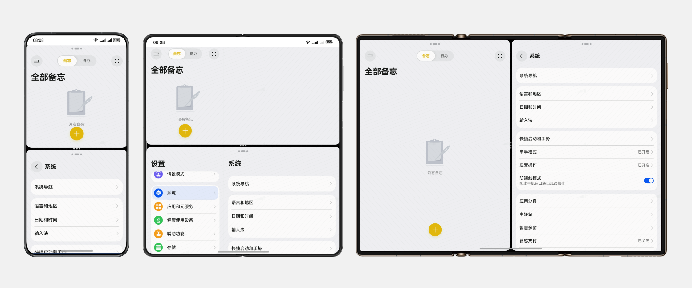
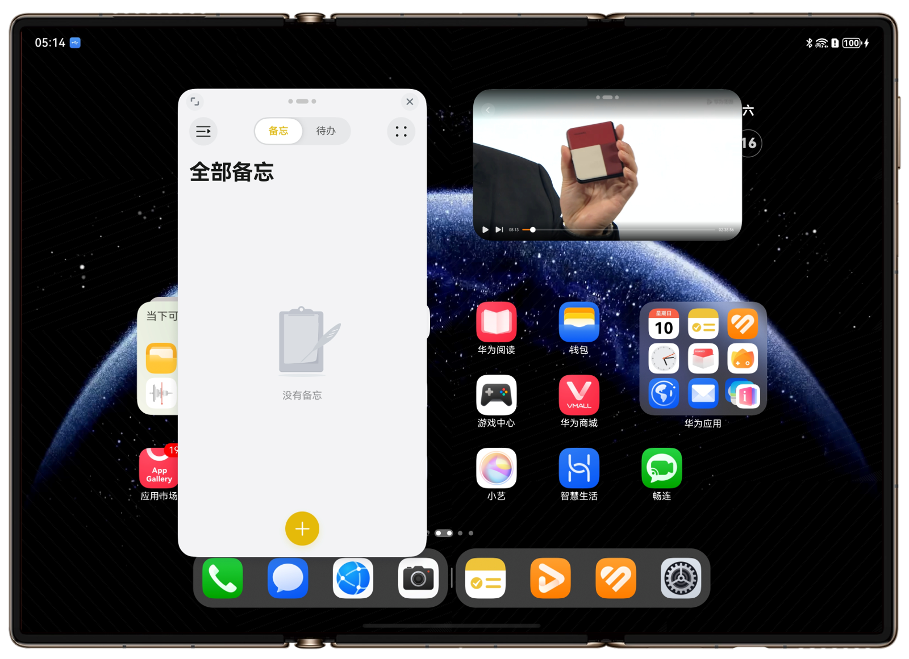
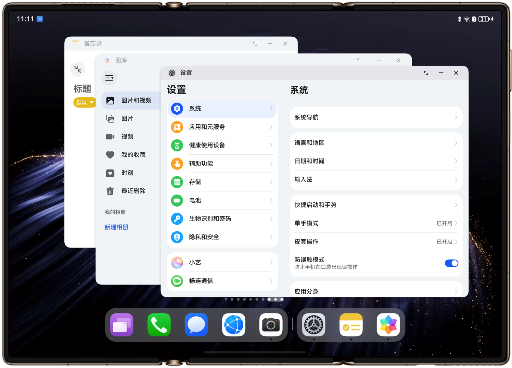
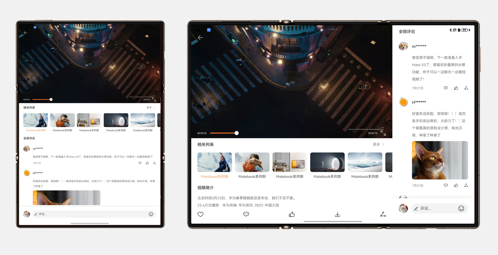
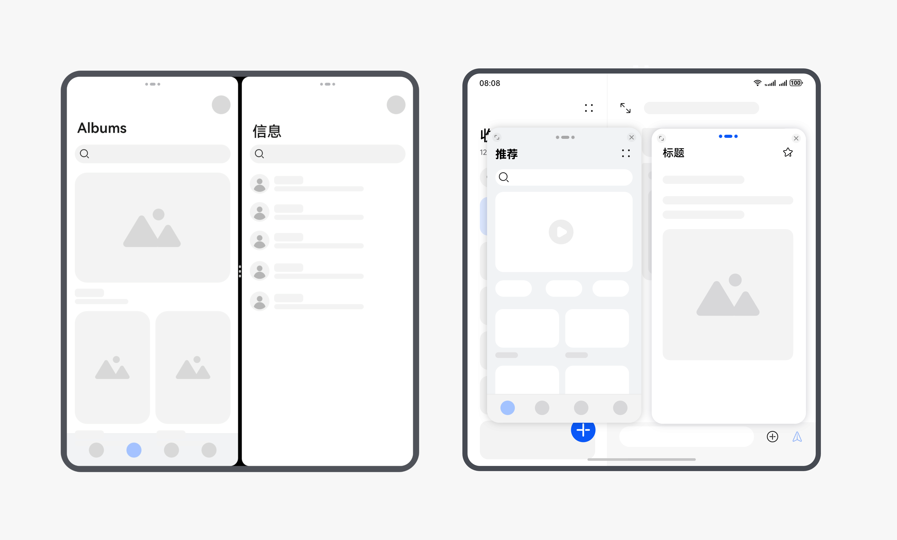
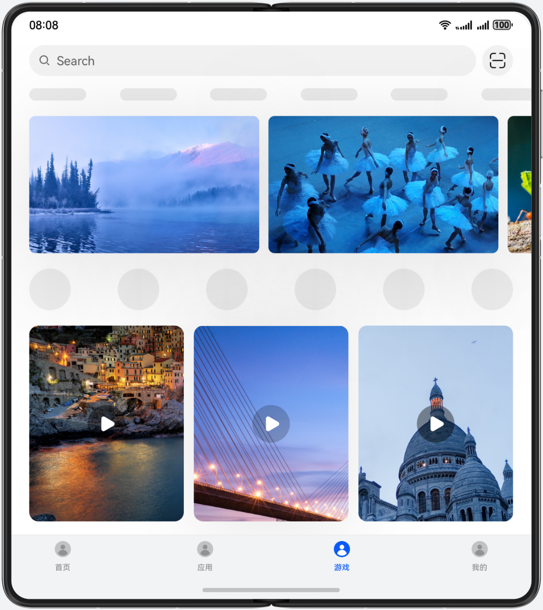
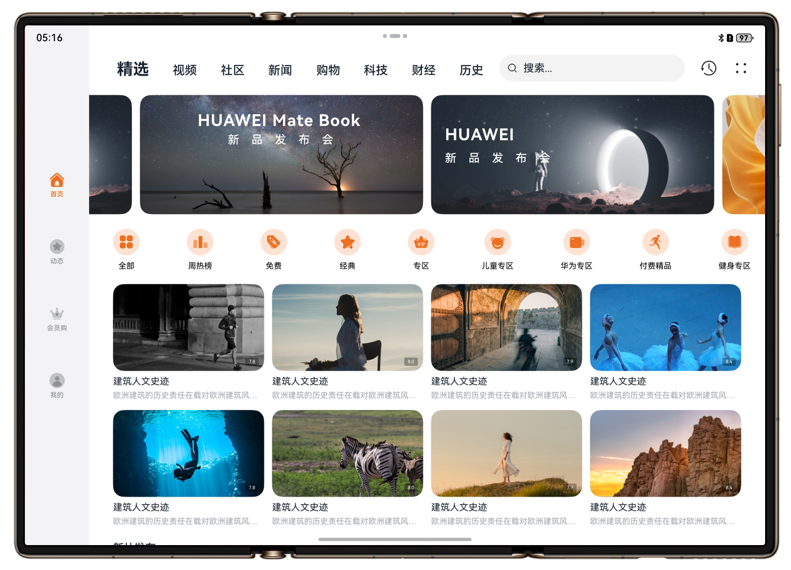
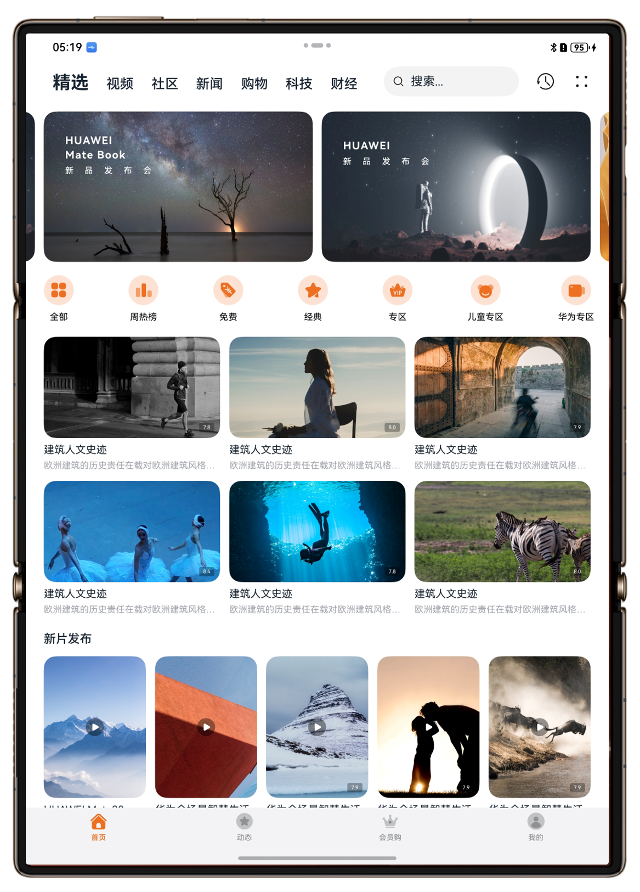
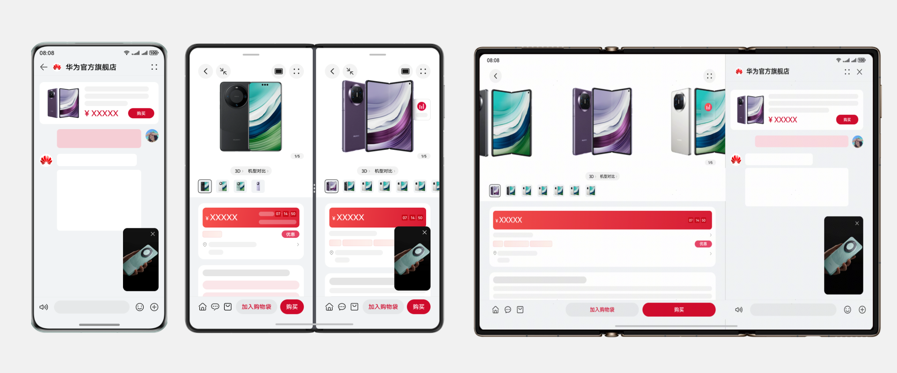

# 三折叠应用开发

更新时间：2026-05-18 00:55:31

来源：https://developer.huawei.com/consumer/cn/doc/best-practices/bpta-matext-guide

#### 概述
#### 三折叠设备特点
华为推出的“三折叠”旗舰折叠手机，拥有三块可联动显示的屏幕，且三块屏幕均可折叠。相对于直板机，三折叠设备有以下明显特点：
- 设备屏幕尺寸可变，具有不同大小和形态的UX界面。常见的三种使用状态分别为：单屏态（F态）、双屏态（M态）和三屏态（G态）。 使用状态  单屏态（F态）  双屏态（M态）  三屏态（G态） 效果图
- 具有特殊的折叠状态和交互事件。三折叠具备折叠的能力，共有9种折叠状态，具体描述可以参考[三折叠特有能力](#section152802181518)章节。
- 不同折叠状态下，可用的相机，相机的位置会发生变化。

#### 三折叠主要型号
三折叠Mate XT系列主要型号包括Mate XT、Mate XTs。

| 产品名称 | 示意图 |
| --- | --- |
| Mate XT |  |
| Mate XTs |  |

#### 硬件说明
本章将以Mate XT设备为例，介绍三折叠的屏幕方向、屏幕尺寸以及相机硬件参数等信息。

#### 屏幕规格信息
以下是三折叠在单屏态、双屏态和三屏态下的硬件参数。
**单屏态规格信息**

| 屏幕旋转角度（rotation） | 0(0度) | 1(90度) | 2(180度) | 3(270度) |
| --- | --- | --- | --- | --- |
| 折叠态示意图(顺时针旋转) |  |  |  |  |
| 屏幕方向Orientation | 竖屏PORTRAIT | 横屏LANDSCAPE | 反向竖屏PORTRAIT_INVERTED | 反向横屏LANDSCAPE_INVERTED |
| 屏幕ID | 0 | 0 | 0 | 0 |
| 分辨率(vp)(向下取整) | 350 * 776 | 776 * 350 | 350 * 776 | 776 * 350 |
| 分辨率(px)(宽 * 高) | 1008 * 2232 | 2232 * 1008 | 1008 * 2232 | 2232 * 1008 |
| 横纵断点 | 横向断点sm，纵向断点lg | 横向断点md，纵向断点sm | 横向断点sm，纵向断点lg | 横向断点md，纵向断点sm |

**双屏态规格信息**

| 屏幕旋转角度（rotation） | 0(0度) | 1(90度) | 2(180度) | 3(270度) |
| --- | --- | --- | --- | --- |
| 展开态示意图(顺时针旋转) |  |  |  |  |
| 屏幕方向Orientation | 竖屏PORTRAIT | 横屏LANDSCAPE | 反向竖屏PORTRAIT_INVERTED | 反向横屏LANDSCAPE_INVERTED |
| 屏幕ID | 0 | 0 | 0 | 0 |
| 分辨率(vp)(向下取整) | 712 * 776 | 776 * 712 | 712 * 776 | 776 * 712 |
| 分辨率(px)(宽 * 高) | 2048 * 2232 | 2232 * 2048 | 2048 * 2232 | 2232 * 2048 |
| 横纵断点 | 横向断点md，纵向断点md | 横向断点md，纵向断点md | 横向断点md，纵向断点md | 横向断点md，纵向断点md |

**三屏态规格信息**

| 屏幕旋转角度（rotation） | 0(0度) | 1(90度) | 2(180度) | 3(270度) |
| --- | --- | --- | --- | --- |
| 展开态示意图 |  |  |  |  |
| 屏幕方向Orientation | 反向横屏LANDSCAPE_INVERTED | 竖屏PORTRAIT | 横屏LANDSCAPE | 反向竖屏PORTRAIT_INVERTED |
| 屏幕ID | 0 | 0 | 0 | 0 |
| 分辨率(vp)(向下取整) | 1107 * 776 | 776 * 1107 | 1107 * 776 | 776 * 1107 |
| 分辨率(px)(宽 * 高) | 3184 * 2232 | 2232 * 3184 | 3184 * 2232 | 2232 * 3184 |
| 横纵断点 | 横向断点lg，纵向断点sm | 横向断点md，纵向断点lg | 横向断点lg，纵向断点sm | 横向断点md，纵向断点lg |

#### 相机硬件信息
相机有默认的[相机镜头安装角度](https://developer.huawei.com/consumer/cn/doc/harmonyos-guides/camera-rotation-term#相机镜头安装角度)，在使用时需要考虑镜头角度和设备的旋转角度，具体定义可参考[预览旋转角度](https://developer.huawei.com/consumer/cn/doc/harmonyos-guides/camera-rotation-term#预览旋转角度)。
**单屏态**
三折叠单屏态配置前置相机和后置相机，前置和后置相机镜头安装角度以及需要设置的预览流旋转角度如下。

| 屏幕旋转角度（rotation） | 0(0度) | 1(90度) | 2(180度) | 3(270度) |
| --- | --- | --- | --- | --- |
| 示意图 |  |  |  |  |
| 后置相机镜头角度 | 90度 | 90度 | 90度 | 90度 |
| 后置相机拍摄预览流旋转角度 | 90度 | 180度 | 270度 | 0度 |
| 前置相机镜头角度 | 270度 | 270度 | 270度 | 270度 |
| 前置相机拍摄预览流旋转角度 | 270度 | 0度 | 90度 | 180度 |

**双屏态**
三折叠双屏态后置相机镜头安装角度以及需要设置的预览流旋转角度如下。

| 屏幕旋转角度（rotation） | 0(0度) | 1(90度) | 2(180度) | 3(270度) |
| --- | --- | --- | --- | --- |
| 示意图 |  |  |  |  |
| 后置相机镜头角度 | 90度 | 90度 | 90度 | 90度 |
| 后置相机拍摄预览流旋转角度 | 90度 | 180度 | 270度 | 0度 |
| 前置相机镜头角度 | 270度 | 270度 | 270度 | 270度 |
| 前置相机拍摄预览流旋转角度 | 270度 | 0度 | 90度 | 180度 |

> [!NOTE] 说明
> 三折叠设备处于双屏态时，前置相机功能可用，但由于设备开合角度和用户位置的限制，成像效果或使用体验可能不理想，因此不推荐在此状态下使用前置相机。

**三屏态**
三折叠三屏配置前置相机和后置相机，前置和后置相机镜头安装角度以及需要设置的预览流旋转角度如下。

| 屏幕旋转角度（rotation） | 0(0度) | 1(90度) | 2(180度) | 3(270度) |
| --- | --- | --- | --- | --- |
| 示意图 |  |  |  |  |
| 后置相机镜头角度 | 90度 | 90度 | 90度 | 90度 |
| 后置相机拍摄预览流旋转角度 | 90度 | 180度 | 270度 | 0度 |
| 前置相机镜头角度 | 270度 | 270度 | 270度 | 270度 |
| 前置相机拍摄预览流旋转角度 | 270度 | 0度 | 90度 | 180度 |

#### 三折叠特有能力
三折叠屏共分为9种折叠状态，可以理解为由左右两块双折叠屏拼接到一起，左右两块折叠屏分别有3种折叠状态（折叠态/展开态/半折态），所以共有3*3=9种折叠状态。

| FoldStatus | FoldDisplayMode | 效果图 |
| --- | --- | --- |
| FOLD_STATUS_EXPANDED | FOLD_DISPLAY_MODE_FULL |  |
| FOLD_STATUS_FOLDED | FOLD_DISPLAY_MODE_MAIN |  |
| FOLD_STATUS_HALF_FOLDED | FOLD_DISPLAY_MODE_FULL |  |
| FOLD_STATUS_EXPANDED_WITH_SECOND_EXPANDED | FOLD_DISPLAY_MODE_FULL |  |
| FOLD_STATUS_EXPANDED_WITH_SECOND_HALF_FOLDED | FOLD_DISPLAY_MODE_FULL |  |
| FOLD_STATUS_FOLDED_WITH_SECOND_EXPANDED | FOLD_DISPLAY_MODE_MAIN |  |
| FOLD_STATUS_FOLDED_WITH_SECOND_HALF_FOLDED | FOLD_DISPLAY_MODE_MAIN |  |
| FOLD_STATUS_HALF_FOLDED_WITH_SECOND_EXPANDED | FOLD_DISPLAY_MODE_FULL |  |
| FOLD_STATUS_HALF_FOLDED_WITH_SECOND_HALF_FOLDED | FOLD_DISPLAY_MODE_FULL |  |

> [!NOTE] 说明
> 布局适配优先基于响应式断点，而非折叠状态：应使用统一的横纵向断点判断页面布局，确保在不同屏幕状态上实现一致的响应式表现。避免直接依赖折叠状态作为布局依据，防止因设备差异导致显示异常（如Pura XFOLD_STATUS_EXPANDED状态对应的是展开态，为直板机布局；而三折叠FOLD_STATUS_EXPANDED状态对应的是双屏态，应为大方形屏布局）。设备悬停态等特殊场景可针对性优化：其他特殊场景（例如折叠屏悬停态下特殊的布局设计），可使用折叠状态作为判断条件，效果可参考悬停态适配案例。

#### 体验标准
应用体验建议分为功能与兼容性、稳定性、性能、功耗、安全和UX六个部分，详细信息如下所示。

| 名称 | 简介 |
| --- | --- |
| 应用基础功能和兼容性体验建议 | 应用与OS兼容、应用与设备兼容、应用升级兼容、功能体验相关等 |
| 应用稳定性体验建议 | 长时间运行故障率（崩溃、冻屏等）、长时间运行内存资源异常 |
| 应用性能体验建议 | 时延、帧率流畅体验和内存占用、CPU占用、线程数等资源占用约束 |
| 应用功耗体验建议 | 后台任务使用、后台硬件器件资源/软件系统资源占用管控，分布式资源占用等 |
| 应用安全隐私体验建议 | 基础安全、恶意软件、应用安全、隐私合规等 |
| 应用UX体验建议 | 设计规范、设计约束的符合性，UX精致体验要求等 |

#### UX体验建议
**体验设计标准**
三折叠的三种形态分别为折叠态、展开态和悬停态。折叠态便于随身携带和单手操作，适合移动场景下的便捷使用；双屏态和三屏态能够充分展示应用内容，适合多任务处理和沉浸式体验；双屏态涉及悬停，其悬停态可稳定放置，让用户解放双手。详细的UX设计标准可参考[三折叠](https://developer.huawei.com/consumer/cn/doc/design-guides/trifold-0000002352915021)和[折叠屏应用UX体验标准](https://developer.huawei.com/consumer/cn/doc/design-guides/ux-guidelines-foldable-screen-0000001807866557)。三折叠的主要体验标准如下：
- 响应式布局：随着屏幕状态的变化，界面中应用内容进行适配变化，常见的响应式布局的表现形式为：相对拉伸、相对缩放、延伸布局、挪移布局、重复布局、瀑布流布局等。
- 多窗口交互：三折叠的双屏态和三屏态，拥有大屏特性，具备多窗口适配的优势，例如分屏和悬浮窗。
- 开合连续性：应用在设备折叠/展开后不应出现操作步骤增加，操作更复杂等体验下降的情况。例如：页面异常跳转、滚动位置偏移、输入内容丢失、图片模糊或播放进度异常等。
- 开合流畅：折叠与展开的交互过程需采用连贯的动态过渡，确保视觉体验自然流畅，避免断层式硬切换。
- 悬停态适配：长视频、短视频、直播、通话、会议、拍摄类应用需针对三折叠的悬停态进行单独适配。下半屏区域内可放置交互操作，上半屏区域内进行信息显示，呈现浏览型内容。交互型控件，例如弹出框、半模态，在下半屏显示；跟随上下文的控件，例如菜单，跟随触发元素所在侧的屏幕显示。
- 折痕避让：悬停态时，中间弯折区域难以操作且显示内容会变形。长视频、短视频、直播、通话、会议、拍摄类应用需针对折痕区域进行避让适配。

> [!NOTE] 说明
> 页面布局应基于断点进行响应式设计，不建议依赖deviceType、isFoldable、foldStatus等设备状态接口作为布局决策条件，以防在多尺寸折叠屏设备上出现适配异常。

**体验设计差异点**
三折叠主要设计差异点体现在折叠状态变化上，主要为开合连续和悬停态适配以及页面的响应式布局。开合连续需要确保应用状态在开合前后状态一致，可参考[适配应用界面开合连续](#section139966382310)章节。悬停态需对上下半屏进行合理的布局和折痕避让，可参考[适配设备悬停态](#section18454203812224)章节。三折叠的显示尺寸会随着设备的开合而变化，应用能够响应这些变化自动调整布局，可参考[响应式布局](https://developer.huawei.com/consumer/cn/doc/best-practices/bpta-multi-device-responsive-layout)。
**应用设计最佳实践**
根据上述UX体验标准和设计差异点，各垂域应用可根据功能和场景特点进行折叠屏UX设计，例如影音娱乐类应用主要体验为沉浸式视频播放和互动，需要考虑不同折叠状态的沉浸式视频播放布局和交互设计。更多垂域设计信息和方案可参考[应用设计最佳实践](https://developer.huawei.com/consumer/cn/doc/design-guides/practices-overview-0000001746498066)。

#### 工程管理
在三折叠设备上运行的应用，需要在module.json5配置文件的module字段中包含"phone"，新建工程默认包含该字段。更多详情可参考[deviceTypes标签](https://developer.huawei.com/consumer/cn/doc/harmonyos-guides/module-configuration-file#devicetypes标签)。

#### 窗口适配
#### 适配设备窗口模式
三折叠的单屏态、双屏态和三屏态均支持全屏、分屏、悬浮窗三种应用窗口模式，Mate XTs的三屏态还支持自由多窗模式，详情请参考[窗口模式](https://developer.huawei.com/consumer/cn/doc/best-practices/bpta-multi-device-window-mode)。
**全屏**
三折叠上的应用启动时默认全屏模式。
**分屏**
应用主窗口启动时占据屏幕的某个部分。三折叠三种状态分屏时的窗口尺寸、断点等信息如下表所示。具体适配信息请参考
。

| 状态 | 分屏方向 | 分屏比例 | 分屏窗口尺寸(vp) | 分屏窗口断点 |
| --- | --- | --- | --- | --- |
| 单屏态（F态） | 上下分屏（竖屏） | 1:1 | 351 * 367 | 横向断点sm，纵向断点md |
| 1:2 | 351 * 245 | 横向断点sm，纵向断点sm |  |  |
| 2:1 | 351 * 490 | 横向断点sm，纵向断点lg |  |  |
| 左右分屏（横屏） | 1:1 | 367 * 351 | 横向断点sm，纵向断点md |  |
| 双屏态（M态） | 上下分屏（竖屏） | 1:1 | 352 * 776 | 横向断点sm，纵向断点lg |
| 左右分屏（横屏） | 1:1 | 384 * 712 | 横向断点sm，纵向断点lg |  |
| 三屏态（G态） | 上下分屏（竖屏） | 1:1 | 776 * 533 | 横向断点md，纵向断点sm |
| 1:2 | 776 * 355 | 横向断点md，纵向断点sm |  |  |
| 2:1 | 776 * 710 | 横向断点md，纵向断点md |  |  |
| 左右分屏（横屏） | 1:1 | 550 * 776 | 横向断点sm，纵向断点lg |  |
| 1:2 | 367 * 776 | 横向断点sm，纵向断点lg |  |  |
| 2:1 | 733 * 776 | 横向断点md，纵向断点md |  |  |

**自由悬浮窗****口**

> [!NOTE] 说明
> 三折叠在单屏态、双屏态和三屏态均支持悬浮窗。Mate XTs在三屏态下点击开启自由多窗按钮后，可以开启自由多窗模式，此时FLOATING代表自由窗口；关闭自由多窗模式，FLOATING代表悬浮窗。

- 悬浮窗
悬浮窗是一种在设备屏幕上悬浮的非全屏应用窗口。一般用于在已有全屏任务运行的基础上，临时处理另一个任务，或短时间多任务并行使用，例如，在浏览网页的同时回复消息。悬浮窗分为纵向悬浮窗和横向悬浮窗，三折叠的悬浮窗窗口尺寸和断点如下表所示。具体适配信息请参考
。

| 状态 | 悬浮窗类型 | 悬浮窗口尺寸(vp) | 悬浮窗口断点 |
| --- | --- | --- | --- |
| 单屏态（F态） | 纵向悬浮窗 | 351 * 575 | 横向断点sm，纵向断点md |
| 横向悬浮窗 | 776 * 437 | 横向断点md，纵向断点sm |  |
| 双屏态（M态） | 纵向悬浮窗 | 351 * 658 | 横向断点sm，纵向断点md |
| 横向悬浮窗 | 776 * 437 | 横向断点md，纵向断点sm |  |
| 三屏态（G态） | 纵向悬浮窗 | 351 * 658 | 横向断点sm，纵向断点md |
| 横向悬浮窗 | 776 * 437 | 横向断点md，纵向断点sm |  |

- 自由窗口
Mate XTs在三屏态时，横屏状态下可以开启[自由多窗](https://developer.huawei.com/consumer/cn/doc/design-guides/trifold-0000002352915021#section64071419124413)，窗口的大小和位置可自由调整。同一个屏幕上可同时显示多个自由窗口，这些自由窗口按照打开或者获取焦点的顺序在Z轴排布。当自由窗口被点击或触摸时，其Z轴高度提升，并获取焦点。
Mate XTs在开启自由多窗模式后，会强制屏幕锁定，不支持屏幕旋转，要想切换为竖屏，需要先退出自由多窗模式。更多适配信息请参考[自由窗口模式适配](https://developer.huawei.com/consumer/cn/doc/best-practices/bpta-multi-device-window-mode#section151195853214)。

#### 适配设备显示方向
可以通过设置窗口旋转策略（[orientation](https://developer.huawei.com/consumer/cn/doc/harmonyos-references/arkts-apis-window-e#orientation9)）的方式控制应用的显示方向。窗口旋转策略（orientation）与屏幕旋转角度的关系请参考[窗口的Orientation和屏幕rotation的关系](https://developer.huawei.com/consumer/cn/doc/best-practices/bpta-multi-device-window-direction#section20201743171811)。三折叠开发的横竖屏旋转策略以及适配方案可参考[窗口方向](https://developer.huawei.com/consumer/cn/doc/best-practices/bpta-multi-device-window-direction)。
**单屏态**

| 屏幕旋转角度（rotation） | 0(0度) | 1(90度) | 2(180度) | 3(270度) |
| --- | --- | --- | --- | --- |
| 旋转状态 |  |  |  |  |
| 默认窗口旋转策略（Orientation） | UNSPECIFIED 未定义方向模式，由系统判定 |  |  |  |
| 表现形式 | PORTRAIT 竖屏显示 |  |  |  |

**双屏态**

| 屏幕旋转角度（rotation） | 0(0度) | 1(90度) | 2(180度) | 3(270度) |
| --- | --- | --- | --- | --- |
| 旋转状态 |  |  |  |  |
| 默认窗口旋转策略（Orientation） | UNSPECIFIED 未定义方向模式，由系统判定 |  |  |  |
| 表现形式 | PORTRAIT 竖屏显示 |  |  |  |

**三屏态**

| 屏幕旋转角度（rotation） | 0(0度) | 1(90度) | 2(180度) | 3(270度) |
| --- | --- | --- | --- | --- |
| 旋转状态 |  |  |  |  |
| 默认窗口旋转策略（Orientation） | UNSPECIFIED 未定义方向模式，由系统判定 |  |  |  |
| 表现形式 | AUTO_ROTATION_RESTRICTED 跟随传感器自动旋转，可以旋转到竖屏、横屏、反向竖屏、反向横屏四个方向，且受控制中心的旋转开关控制。 |  |  |  |

> [!NOTE] 说明
> 表格中的参数表示屏幕属性中顺时针旋转角度（rotation）对应的窗口旋转策略。

建议优化三折叠设备在双屏及三屏形态下的横竖屏旋转体验：界面布局应根据设备方向（横屏或竖屏）实现自适应调整，充分利用不同方向的空间特性。例如，在三折叠三屏态下切换至横屏时，可将评论区自动调整至侧边栏显示，以提升多设备协同场景下（如长视频播放）的观看与交互体验。具体适配逻辑可参考[为多设备配置旋转策略](https://developer.huawei.com/consumer/cn/doc/best-practices/bpta-multi-device-window-direction#section12636154743220)。

三折叠推荐的旋转逻辑如下。

| 折叠状态 | 窗口全屏时尺寸（vp） | 是否支持横竖屏旋转（以348vp为阈值） | 应用是否默认支持横竖屏旋转 |
| --- | --- | --- | --- |
| 单屏态 | 350 * 776 | 是 | 否 |
| 双屏态 | 712 * 776 | 是 | 否 |
| 三屏态 | 1107 * 776 | 是 | 是 |

#### 适配设备沉浸式
**建议适配不同窗口模式的沉浸式**
三折叠支持的三种窗口模式：全屏、分屏、悬浮窗。应用可根据支持的窗口模式进行沉浸式适配，详情可参考[窗口沉浸式](https://developer.huawei.com/consumer/cn/doc/best-practices/bpta-multi-device-window-immersive)。

**建议适配不同窗口方向的沉浸式**
三折叠在不同旋转状态下避让区会发生变化。窗口方向的变化引起避让区的变化的适配方案可参考[窗口沉浸式](https://developer.huawei.com/consumer/cn/doc/best-practices/bpta-multi-device-window-immersive)。

> [!NOTE] 说明
> 三折叠在下面几种场景中避让区会发生变化： 窗口模式切换（全屏/悬浮窗/分屏）。窗口方向变化（横竖屏切换）。折叠屏状态切换（展开/折叠）。 适配方案可参考窗口沉浸式。

#### 界面开发
#### 典型布局场景
三折叠上典型的响应式布局方式有分栏布局、重复布局、挪移布局和缩进布局。应用可以利用不同的UI组件和断点来实现多样的布局，从而打造丰富的布局场景。

| 响应式布局方式 | 典型布局场景 | 实现方案 | 单屏态效果 | 双屏态效果 | 三屏态效果 |
| --- | --- | --- | --- | --- | --- |
| 重复布局 | 列表布局 | List组件+断点 |  |  |  |
| 瀑布流布局 | WaterFlow组件+断点 |  |  |  |  |
| 轮播布局 | Swiper组件+断点 |  |  |  |  |
| 网格布局 | Grid组件+断点 |  |  |  |  |
| 分栏布局 | 侧边栏 | SideBarContainer组件+断点 |  |  |  |
| 单/双栏 | Navigation组件+断点 |  |  |  |  |
| 三分栏 | SideBarContainer组件+Navigation组件+断点 |  |  |  |  |
| 挪移布局 | 插图和文字组合布局 | GridRow/GridCol组件+断点+栅格 |  |  |  |
| 底部/侧边导航 | Tabs组件+断点 |  |  |  |  |
| 缩进布局 | 单列列表布局 | GridRow/GridCol组件+断点+栅格 |  |  |  |

上述典型布局场景的实现方式可参考[页面布局场景](https://developer.huawei.com/consumer/cn/doc/best-practices/bpta-multi-device-page-layout)。复杂的分栏布局，例如单双栏形态变化时的路由跳转，可参考[分栏布局](https://developer.huawei.com/consumer/cn/doc/best-practices/bpta-multi-device-page-layout#section11897247142110)。

#### 三折叠双屏态适配建议
三折叠双屏态纵向断点为md，屏幕比例近似1:1，呈现出对称且均衡的视觉效果，横向宽度超过 600vp，是典型的大方形屏。大方形屏非常适合多任务处理、内容分屏展示以及创作类应用，能够显著提升用户的操作效率与交互体验。大方形屏的布局设计与实现可参考[大方形屏](https://developer.huawei.com/consumer/cn/doc/best-practices/bpta-multi-device-screen-layout#section12921201325714)。

#### 三折叠三屏态适配建议
**大屏横屏**
三折叠三屏态横屏时横向断点为lg，纵向断点为sm，提供更宽广的显示视野和更强的信息承载能力。大屏横屏的布局设计与实现可参考[大屏横屏](https://developer.huawei.com/consumer/cn/doc/best-practices/bpta-multi-device-screen-layout#section6493354468)。

**大屏竖屏**
三折叠三屏态竖屏时横向断点为md，纵向断点为lg，竖向上提供更大的操作空间。大屏竖屏的布局设计与实现可参考[大屏竖屏](https://developer.huawei.com/consumer/cn/doc/best-practices/bpta-multi-device-screen-layout#section86231545125515)。

#### 适配设备悬停态
三折叠在双屏态时，悬停态可以在桌面平稳放置，实现免手持体验，常用于视频通话、播放视频、拍照和听歌等不需要频繁交互的场景。这种状态下，应用需要对中间折痕区域进行避让，并且对上下两个界面进行悬停适配，重新布局。悬停态的实现方案可参考[折叠屏悬停态](https://developer.huawei.com/consumer/cn/doc/best-practices/bpta-folded-hover)。

#### 适配应用界面开合连续
开合连续指应用在各种屏幕和窗口状态间切换时页面内容连续，切换之前的任务和相关状态能保存、延续，或能够快速恢复，给用户提供连续的体验。具体实现方案，可参考折叠屏的[适配应用界面开合连续](https://developer.huawei.com/consumer/cn/doc/best-practices/bpta-foldable-guide#section186893019118)章节。

#### 交互适配
三折叠的交互方式为触控屏和外接键鼠，常见的操作有点击、双击、长按、拖拽等，应用可根据这些操作进行功能适配，详情可参考[多设备交互](https://developer.huawei.com/consumer/cn/doc/best-practices/bpta-multi-interaction)。
Mate XTs搭载手写笔，支持无感连接与低延迟传输，开盒即用，适用于全局批注、提笔速记及按键遥控等功能场景，实现流畅自然的书写与交互体验。系统提供的[Pen Kit](https://developer.huawei.com/consumer/cn/doc/harmonyos-guides/pen-introduction)能力，开发者可灵活接入手写套件、全局取色、一笔成形等接口，提升书写交互的扩展性与创作效率。

#### 功能开发
#### 相机开发
对于需要实现相机页面和功能的应用，在三折叠上需要对不同的折叠状态、屏幕尺寸，相机镜头进行适配。三折叠相机开发详情请参考[相机硬件差异](https://developer.huawei.com/consumer/cn/doc/best-practices/bpta-multi-device-camera)，主要考虑的有以下几点。
- 相机页面布局：通过横向断点区分和实现不同形态屏幕的页面布局，可参考[通过断点实现多套页面布局](https://developer.huawei.com/consumer/cn/doc/best-practices/bpta-multi-device-camera#section181143569262)。
- 相机设备选择：根据相机的状态和位置，选择当前形态下可用的相机。折叠状态切换时需要重置相机预览画面。可参考[选择相机设备](https://developer.huawei.com/consumer/cn/doc/best-practices/bpta-multi-device-camera#section13854163154917)。
- 相机预览流配置：配置预览流分辨率，避免出现压缩、拉伸、异常旋转的问题，可参考[设置多设备上相机预览画面比例](https://developer.huawei.com/consumer/cn/doc/best-practices/bpta-multi-device-camera#section882216138497)。
- 拍照旋转适配：在横竖屏拍照场景下，正确获取并设置旋转角度，需确保图片始终正向显示，可参考[设置拍照旋转角度](https://developer.huawei.com/consumer/cn/doc/best-practices/bpta-multi-device-camera#section0752024124911)。
- 悬停态相机页面：对悬停态进行UX重布局和折痕避让，可参考[实现悬停态相机页面](https://developer.huawei.com/consumer/cn/doc/best-practices/bpta-multi-device-camera#section50639679)。

| 设备形态 | 单屏态（F态） | 悬停态 | 双屏态（M态） | 三屏态（G态） |
| --- | --- | --- | --- | --- |
| 效果图 |  |  |  |  |
| 效果图 |  |  |  |  |

折叠屏上开发相机功能的一些常见问题和解决方案可参考[相机硬件差异常见问题](https://developer.huawei.com/consumer/cn/doc/best-practices/bpta-multi-device-camera#section1684283074912)。

#### 设备典型案例
购物比价类应用可以在三折叠双屏和三屏状态时可以展示更丰富的信息，例如可以使用分屏能力同时浏览两个商品的内容，方便用户进行对比；还可以利用三屏大横屏的优势使用侧边栏，展示更多信息。详细开发方案可参考[多设备购物比价界面](https://developer.huawei.com/consumer/cn/doc/best-practices/multi-shopping-price-comparison)。

更多垂域案例可参考[多设备界面开发案例](https://developer.huawei.com/consumer/cn/doc/best-practices/bpta-multi-device-ui-development)。

#### 常见问题
#### 平板布局正常，但是三折叠G态布局异常
**问题现象**
平板上应用页面显示正常，但是三折叠G态页面布局出现大图、大字体、拉伸、压缩、留白等问题。
**可能原因**
开发者使用“deviceType === tablet”作为lg断点对应页面布局的判断条件，导致平板布局正常，三折叠G态布局异常。
**解决方案**
UX布局和窗口尺寸、形状相关，和物理硬件无关，同一种UX布局风格在不同设备的同一种尺寸窗口上应该一致。三折叠G态应与平板的布局一致，三折叠M态应与双折叠展开态的布局一致，三折叠F态应与直板机的布局一致。因此建议使用断点方案替代设备形态接口，做共性UX布局判断逻辑，详情可参考[断点](https://developer.huawei.com/consumer/cn/doc/best-practices/bpta-multi-device-responsive-layout#section1532120147301)。

> [!NOTE] 说明
> 三折叠不同折叠状态下展示的页面布局，统一使用一多横向断点和纵向断点进行判断。下列方式不推荐作为判断UX布局的条件： deviceInfo.deviceType：使用设备类型做UX布局导致同一种UX布局无法一次开发跨多设备类型。display.isFoldable、display.getFoldStatus、display.getFoldDisplayMode等折叠状态相关接口：折叠状态和折叠显示模式无法区分大折叠、小折叠、Pura X和三折叠，扩展性差。不同折叠屏开合过程页面布局的异常，多数情况下是因为使用isFoldable、foldStatus作为布局的判断条件，导致不同折叠屏处于同一折叠状态时展示相同的布局，实际不同折叠屏的同一个折叠状态屏幕属性差异很大。

#### 三折叠G态仅支持竖屏，无法旋转
**问题现象**
三折叠G态页面仅支持竖屏，无法旋转。
**可能原因**
开发者通过判断大折叠的折叠状态为FoldStatus.FOLD_STATUS_EXPANDED（展开态）时，支持旋转；其他情况竖屏显示。而三折叠的G态，对应的折叠状态为FoldStatus.FOLD_STATUS_EXPANDED_WITH_SECOND_EXPANDED，导致三折叠G态无法旋转，仅支持竖屏。
**解决方案**
使用窗口宽高属性或断点作为判断横竖屏旋转的条件，详情可参考[为多设备配置旋转策略](https://developer.huawei.com/consumer/cn/doc/best-practices/bpta-multi-device-window-direction#section12636154743220)。

#### 展开态应用启动页面未铺满屏幕，出现异常布局
**问题现象**
在折叠屏展开态启动应用时，应用的启动页面未铺满整个屏幕，出现白屏区域或者启动页被截断。
**可能原因**
应用未配置增强启动页。
**解决方案**
应用需要[配置增强启动页](https://developer.huawei.com/consumer/cn/doc/harmonyos-guides/launch-page-config#配置增强启动页)，配置后启动页面中的背景、图片和图标等资源能根据窗口大小自适应填充，保证启动页面在不同设备形态上正常显示，配置中各标签的说明可参考[startWindow标签](https://developer.huawei.com/consumer/cn/doc/harmonyos-guides/module-configuration-file#startwindow标签)。

#### 折叠开合过程导致屏幕显示方向变化
**问题现象**
三折叠在默认使用状态、不旋转屏幕的条件下，进行折叠开合，会导致屏幕显示方向变化。
**可能原因**
三折叠不同折叠状态、相同屏幕旋转角度条件下，屏幕显示方向的定义不同。
**解决方案**
应用需要注意三折叠在不同折叠状态下，默认的屏幕显示方向的定义不同，避免出现因为判断错误导致的页面或功能异常。

| 三折叠折叠状态 | F态 | M态 | G态 |
| --- | --- | --- | --- |
| 效果图（充电口朝下） |  |  |  |
| 屏幕旋转角度（rotation） | 0 | 0 | 0 |
| 屏幕显示方向（orientation） | PORTRAIT竖屏 | PORTRAIT竖屏 | LANDSCAPE_INVERTED反向横屏 |
