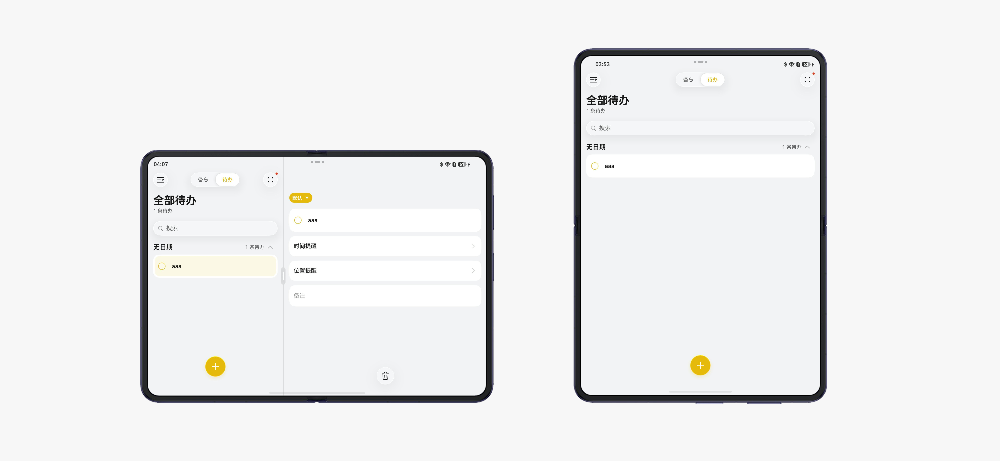
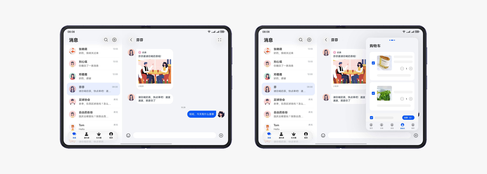
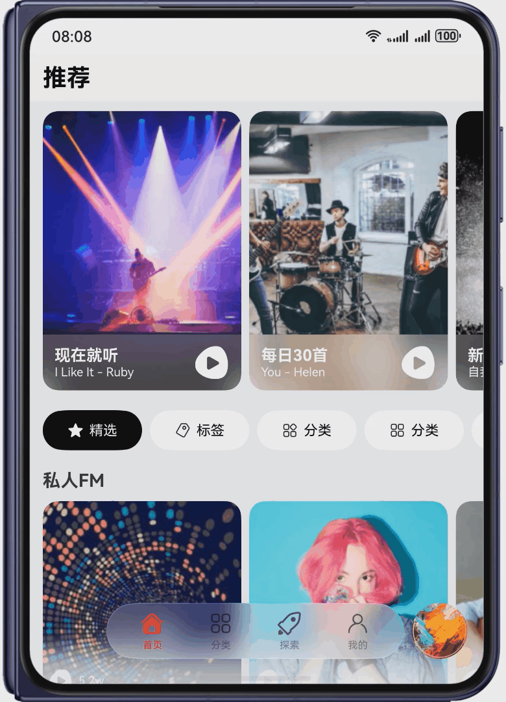
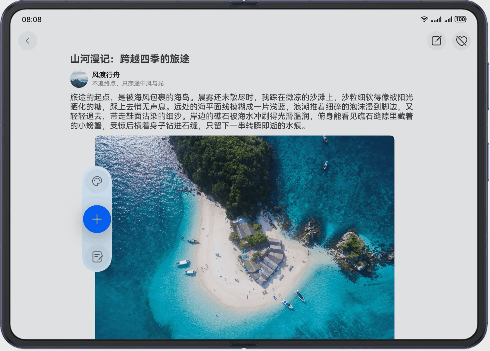
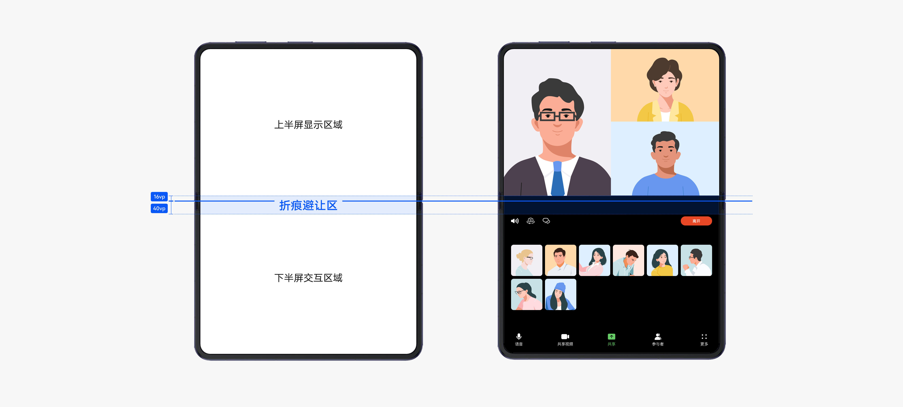

# 阔折叠应用开发

更新时间：2026-04-23 12:14:00

来源：https://developer.huawei.com/consumer/cn/doc/best-practices/bpta-purax-guide

## 概述


阔折叠设备现有Pura X和Pura X Max两款产品。其中，Pura X配有一块16:10比例的宽阔内屏（展开态）和一块1:1比例的方形外屏（折叠态）；Pura X Max配有一块宽高比10:14的较宽外屏（折叠态）和一块宽高比14:10的内屏（展开态）。相对于直板机，阔折叠有以下明显特点：

1. 设备屏幕尺寸可变，具有不同大小和形态的窗口。需要针对不同的应用窗口尺寸，做响应式的页面布局适配。
- 折叠时，Pura X外屏为小方形屏。Pura X Max外屏屏幕尺寸较直板机宽度更宽、高度更矮。
- 展开后，Pura X内屏屏幕接近于直板机，较直板机宽度更宽、高度更矮。Pura X Max内屏屏幕尺寸接近于平板，对内容的展示面积增大。
2. 具有特殊的折叠状态和交互事件。包含三种状态：折叠态，展开态和悬停态。需保障不同状态下的应用体验一致性（如开合连续性）。
- 展开态：阔折叠完全展开后的形态。有更大的屏幕尺寸，可充分显示应用内容。
- 折叠态：阔折叠折叠后的形态。折叠后屏幕尺寸变小。
- 悬停态：阔折叠处于完全展开和折叠的中间状态，可平稳放置。
3. 设备的折叠态和展开态均配置相机：Pura X折叠时仅有前置相机，展开时配有前置相机和后置相机；Pura X Max折叠和展开时均配有前置相机和后置相机。在不同折叠状态下，可用相机和相机的位置会发生变化。开发相机功能时需考虑摄像头切换与预览流重置。


| 产品名称 | 示意图 |
| --- | --- |
| Pura X |  |
| Pura X Max |  |


## 产品硬件说明


屏幕规格信息

本章节以当前发售的阔折叠产品Pura X和Pura X Max为例，介绍阔折叠的屏幕规格信息。

下表中展示的是阔折叠产品常用形态的屏幕规格信息：Pura X折叠态横向、展开态竖向；Pura X Max折叠态竖向、展开态横向。


| 产品名称 | 设备形态 | 屏幕规格信息(宽*高) | 示意图 |
| --- | --- | --- | --- |
| Pura X | 折叠态(横向) | 分辨率(vp)(向下取整)：326*326 |  |
| 分辨率(px)：980*980 |  |  |  |
| 横纵断点(横向*纵向)：sm*md |  |  |  |
| 展开态(竖向) | 分辨率(vp)(向下取整)：440*707 |  |  |
| 分辨率(px)：1320*2120 |  |  |  |
| 横纵断点(横向*纵向)：sm*lg |  |  |  |
| Pura X Max | 折叠态(竖向) | 分辨率(vp)(向下取整)：459*672 |  |
| 分辨率(px)：1264*1848 |  |  |  |
| 横纵断点(横向*纵向)：sm*lg |  |  |  |
| 展开态(横向) | 分辨率(vp)(向下取整)：939*664 |  |  |
| 分辨率(px)：2584*1828 |  |  |  |
| 横纵断点(横向*纵向)：lg*sm |  |  |  |


相机硬件信息

本章节介绍阔折叠的相机硬件信息，以Pura X和Pura X Max产品为例。Pura X折叠态配置一个前置相机，展开态配置一个前置相机和后置相机。Pura X Max折叠态和展开态均配置一个前置相机和后置相机。


| 产品名称 | 设备形态 | 相机硬件信息 | 示意图 |
| --- | --- | --- | --- |
| Pura X | 折叠态(横向) | 前置相机安装镜头角度 | 270度 |
| 前置相机拍摄预览流旋转角度 | 180度 |  |  |
| 展开态(竖向) | 后置相机镜头安装角度 | 90度 |  |
| 后置相机预览流旋转角度 | 90度 |  |  |
| 前置相机镜头安装角度 | 270度 |  |  |
| 前置相机预览流旋转角度 | 270度 |  |  |
| Pura X Max | 折叠态(竖向) | 后置相机镜头安装角度 | 90度 |
| 后置相机预览流旋转角度 | 90度 |  |  |
| 前置相机镜头安装角度 | 270度 |  |  |
| 前置相机预览流旋转角度 | 270度 |  |  |
| 展开态(横向) | 后置相机镜头安装角度 | 90度 |  |
| 后置相机预览流旋转角度 | 0度 |  |  |
| 前置相机镜头安装角度 | 270度 |  |  |
| 前置相机预览流旋转角度 | 180度 |  |  |


相机预览流旋转角度=(后置镜头安装角度+屏幕旋转角度)%360，在设备状态改变后（如横竖屏旋转）需要重置相机预览流，具体实现可参考设置拍照旋转角度。

设备特有能力

阔折叠有着独特的折叠能力，在不同的折叠状态下有着不同的折叠属性，下表以Pura X Max产品为例，展示了阔折叠的折叠状态和属性。


|  | 折叠态 | 悬停态 | 展开态 |
| --- | --- | --- | --- |
| 示意图 |  |  |  |
| [isFoldable](https://developer.huawei.com/consumer/cn/doc/harmonyos-references/js-apis-display#displayisfoldable10) | true |  |  |
| [FoldStatus](https://developer.huawei.com/consumer/cn/doc/harmonyos-references/js-apis-display#foldstatus10) | FOLD_STATUS_FOLDED | FOLD_STATUS_HALF_FOLDED | FOLD_STATUS_EXPANDED |


## 体验标准


应用体验建议分为功能与兼容性、稳定性、性能、功耗、安全和UX六个部分，详细信息如下所示。


| 名称 | 简介 |
| --- | --- |
| [应用基础功能和兼容性体验建议](https://developer.huawei.com/consumer/cn/doc/harmonyos-guides/experience-suggestions-compatibility) | 应用与OS兼容、应用与设备兼容、应用升级兼容、功能体验相关等 |
| [应用稳定性体验建议](https://developer.huawei.com/consumer/cn/doc/harmonyos-guides/experience-suggestions-stability) | 长时间运行故障率（崩溃、冻屏等）、长时间运行内存资源异常 |
| [应用性能体验建议](https://developer.huawei.com/consumer/cn/doc/harmonyos-guides/performance-experience-suggestions) | 时延、帧率流畅体验和内存占用、CPU占用、线程数等资源占用约束 |
| [应用功耗体验建议](https://developer.huawei.com/consumer/cn/doc/harmonyos-guides/app-power-experience-standards) | 后台任务使用、后台硬件器件资源/软件系统资源占用管控，分布式资源占用等 |
| [应用安全隐私体验建议](https://developer.huawei.com/consumer/cn/doc/harmonyos-guides/security-privacy-experience-standards) | 基础安全、恶意软件、应用安全、隐私合规等 |
| [应用UX体验建议](https://developer.huawei.com/consumer/cn/doc/harmonyos-guides/experience-suggestions-ux) | 设计规范、设计约束的符合性，UX精致体验要求等 |


阔折叠设备主要在UX上有着特殊的适配体验和建议，下文主要介绍阔折叠的UX体验建议。


### UX体验建议


体验设计标准

阔折叠设备的三种形态分别为折叠态、展开态和悬停态，其多态特性使应用交互与视觉体验显著区别于直板机型，具体体验标准可参考阔折叠和折叠屏应用开发的UX体验建议的体验设计标准章节。

体验设计差异点

阔折叠设备的屏幕相较于直板机手机宽度更宽、高度更矮，在适配时要额外考虑布局完整性、沉浸式等设计。阔折叠的典型布局适配可参考典型布局场景，差异化的适配要点可参考差异化适配要点。

阔折叠设备在折叠态和展开态之间切换时，需要保证当前任务的连续性。切换之前的任务和相关状态能保存、延续，或能够快速恢复，给用户提供连续的体验。不发生闪退、重启等异常。可参考开合适配章节。

应用设计最佳实践

根据上述UX体验标准和设计差异点，各垂域应用可根据功能和场景特点进行UX设计，例如影音娱乐类应用主要体验为沉浸式视频播放和互动，需要考虑不同折叠状态的布局完整性，更多垂域设计信息和方案可参考应用设计最佳实践。


## 工程管理


### 工程配置


在阔折叠设备上运行的应用，需要在module.json5配置文件的module字段中包含"phone"。更多详情可参考deviceTypes标签。更多工程部署的技术细节实现，可参考多设备工程部署。


## 窗口适配


### 适配窗口模式


当前阔折叠设备支持的窗口模式有全屏窗口模式、分屏窗口模式以及悬浮窗口模式，各模式的详细信息见窗口模式。


> [!NOTE]
> Pura X外屏仅支持全屏模式。


下表以Pura X Max产品为例，展示了其折叠态和展开态在分屏和悬浮窗模式下的示意图：


| 窗口模式 | 示意图（折叠态-展开态） |
| --- | --- |
| 分屏 |  |
| 悬浮窗 |  |


分屏模式适配：分屏一般用于两个应用长时间并行使用的场景，例如边看购物攻略边购物的场景，应用也可以主动实现应用内分屏。具体适配信息请参考分屏窗口模式适配。

悬浮窗模式适配：悬浮窗一般用于阅读新闻资讯、购物等场景。具体适配信息请参考悬浮窗口模式适配。


### 适配设备显示方向


可以通过设置窗口旋转策略（orientation）的方式控制应用的显示方向。窗口旋转策略（orientation）与屏幕旋转角度的关系请参考窗口的Orientation和屏幕rotation的关系。阔折叠设备开发的横竖屏旋转策略以及适配方案可参考窗口方向。


> [!NOTE]
> Pura X外屏当前不支持旋转，仅支持反向横屏（270度）展示。建议设置窗口旋转策略为FOLLOW_DESKTOP，表示跟随桌面的旋转模式。具体适配逻辑可参考为多设备配置旋转策略。





阔折叠设备支持开发者设置窗口旋转策略，以Pura X和Pura X Max产品为例，产品默认的旋转逻辑如下表：


| 产品名称 | 设备状态 | 桌面支持旋转 |
| --- | --- | --- |
| Pura X | 折叠态 | 否 |
| 展开态 | 否 |  |
| Pura X Max | 折叠态 | 否 |
| 展开态 | 是 |  |


### 适配设备沉浸式


沉浸式模式是指通过减少无关元素的干扰，使应用界面更加专注于内容呈现，以提升用户体验的设计模式，详情可参考窗口沉浸式的实现沉浸式效果章节。





设备使用过程中避让区会发生变化，例如：设备旋转导致横竖屏切换，像这种设备使用状态变化引起避让区的变化的适配方案可参考避让处理。


> [!NOTE]
> 在下面几种场景中避让区会发生变化：
>  窗口模式切换（全屏/悬浮窗/分屏）。窗口方向变化（横竖屏切换）。折叠屏状态切换（展开/折叠）。


## 界面开发


### 典型布局场景


从典型布局场景出发，常见的响应式布局方式包括分栏布局、重复布局、挪移布局及缩进布局。应用可依托不同UI组件与断点实现多样化布局，构建丰富的场景效果，具体实现可参考页面布局场景。

针对屏幕类型布局场景，阔折叠的布局可参考直板机竖屏方案。

除上述适配外，建议结合系统新能力，通过悬浮导航栏、滑动隐藏等设计进一步优化交互体验。以下是实现方案：

1.悬浮导航栏

使用透明磨砂材质的悬浮导航栏，提升可视区域的面积。





1. 使用[HdsTab](https://developer.huawei.com/consumer/cn/doc/harmonyos-references/ui-design-hdstabs)组件的[barFloatingStyle](https://developer.huawei.com/consumer/cn/doc/harmonyos-references/ui-design-hdstabs#barfloatingstyle)属性，设置systemMaterialEffect悬浮[SystemMaterialParams](https://developer.huawei.com/consumer/cn/doc/harmonyos-references/ui-design-hdstabs#systemmaterialparams)材质，使用[TabContent](https://developer.huawei.com/consumer/cn/doc/harmonyos-references/ts-container-tabcontent)包裹每一项子页面的内容。
```text
HdsTabs({
barPosition: BarPosition.End
}) {
TabContent() {
// ...
}
.tabBar(this.tabBuilder(this.tabsData[0], 0))

TabContent()
.tabBar(this.tabBuilder(this.tabsData[1], 1))

TabContent()
.tabBar(this.tabBuilder(this.tabsData[2], 2))

TabContent()
.tabBar(this.tabBuilder(this.tabsData[3], 3))
}
.barOverlap(true)
.barFloatingStyle({
// ...
barBottomMargin: this.barBottomMargin,
systemMaterialEffect: {
materialType: hdsMaterial.MaterialType.IMMERSIVE,
materialLevel: hdsMaterial.MaterialLevel.ADAPTIVE
},
lightColor: Color.Pink
})
.height('100%')
.width('100%')
```
2. 为增强界面的可玩性与功能延展性，利用[HdsTabsMiniBar](https://developer.huawei.com/consumer/cn/doc/harmonyos-references/ui-design-hdstabs#hdstabsminibar)，如下示例代码，在悬浮属性barFloatingStyle中增加一个miniBar属性，指向对应的Builder组件。通过该设定，即可在导航区域集成一个可扩展的迷你标签栏。该组件可在不占用过多空间的前提下，提供额外的导航维度或快捷功能入口，丰富用户交互路径，提升整体体验的灵活性与趣味性。
```text
.barFloatingStyle({
miniBar: {
miniBarBuilder: () => { this.miniBarExpandBuilder() }
},
// ...
})
```
3. 自定义一个组件用于mini标签栏的UI渲染。
```text
// Expanded miniBar component.
@Builder
miniBarExpandBuilder() {
Row() {
Stack() {
// ...
}
.borderRadius(24)
.clip(true)
.width(56)
.height(56)

Row() {
// ...
}
.justifyContent(FlexAlign.Start)
}
.layoutWeight(1)
.justifyContent(FlexAlign.Start)
.margin({
left: 4,
right: 8
})
}
.width('100%')
.height('100%')
}
```


2.滑动隐藏

在用户滑动浏览内容时，自动隐藏底部导航栏与顶部标题栏，以最大化可视区域，提升有效信息的呈现面积。


1. 不同状态下，顶部和底部系统避让区高度会随应用窗口变化而变化。在窗口生命周期创建时，调用[window.getWindowAvoidArea](https://developer.huawei.com/consumer/cn/doc/harmonyos-references/arkts-apis-window-window#getwindowavoidarea9)获取初始的系统避让区高度，并使用window.on('avoidAreaChange')监听系统避让区的变化。常见触发系统避让区回调的场景可参考[on('avoidAreaChange')](https://developer.huawei.com/consumer/cn/doc/harmonyos-references/arkts-apis-window-window#onavoidareachange9)。并使用全局状态变量，在页面中可以拿到该状态值用于安全区的避让操作。
```text
// Callback when the system safe area insets change.
public onAvoidAreaChange: (avoidOptions: window.AvoidAreaOptions) => void =
(avoidOptions: window.AvoidAreaOptions) => {
if (avoidOptions.type === window.AvoidAreaType.TYPE_SYSTEM) {
this.mainWindowInfo.AvoidSystem = avoidOptions.area;
} else if (avoidOptions.type === window.AvoidAreaType.TYPE_CUTOUT) {
this.mainWindowInfo.AvoidCutout = avoidOptions.area;
} else if (avoidOptions.type === window.AvoidAreaType.TYPE_SYSTEM_GESTURE) {
this.mainWindowInfo.AvoidSystemGesture = avoidOptions.area;
} else if (avoidOptions.type === window.AvoidAreaType.TYPE_KEYBOARD) {
this.mainWindowInfo.AvoidKeyboard = avoidOptions.area;
} else if (avoidOptions.type === window.AvoidAreaType.TYPE_NAVIGATION_INDICATOR) {
this.mainWindowInfo.AvoidNavigationIndicator = avoidOptions.area;
}
};
```


> [!NOTE]
> 鉴于不同设备的系统安全区高度存在差异，为确保代码的通用性与复用性，采用系统接口动态获得系统安全区避让高度，替代固定硬编码。典型场景：PuraX 设备的外屏底部导航条安全区高度为 0，而其他常规设备通常不为 0。


2. 定义顶部标题栏的高度和底部导航栏的高度headerTitleHeight、透明度headerOpacity。
- 顶部导航栏高度初始值为：默认标题栏高度+顶部避让区高度；
- 透明度初始值为1，表示全显示。


```text
@State headerOpacity: number = 1;
@State headerTitleHeight: number = CommonConstants.DEFAULT_TABS_HEIGHT + this.topAvoidHeight;
```
3. 定义底部导航栏的高度tabsBarHeight、底部导航栏与底部的边距barBottomMargin。
- 底部导航栏高度初始值为：默认底部标题栏高度；
- 底部边距初始值为：当底部系统避让区高度不等于0时，为底部系统避让区高度，否则赋予一个默认的初始值。


```text
@State tabsBarHeight: number = CommonConstants.DEFAULT_TABS_HEIGHT;
@State barBottomMargin: number = this.bottomAvoidHeight || CommonConstants.DEFAULT_BAR_BOTTOM_MARGIN;
```
4. 将步骤二和步骤三的变量，作为属性值赋值给对应的组件。
- 顶部标题栏的高度和透明度。


```text
Row() {
Text($r('app.string.General_homepage'))
.fontSize('22fp')
.fontWeight(700)
}
// ...
.height(this.headerTitleHeight)
.opacity(this.headerOpacity)
```

- 底部导航栏的高度、导航栏的下边距、透明度。


```text
HdsTabs({
barPosition: BarPosition.End
}) {
// ...
.barFloatingStyle({
// ...
barBottomMargin: this.barBottomMargin,
barOpacity: this.headerOpacity
})
.barHeight(this.tabsBarHeight)
// ...
```
5. 使用[onScrollFrameBegin()](https://developer.huawei.com/consumer/cn/doc/harmonyos-references/ts-container-scroll#onscrollframebegin9)监听内容区域滚动。
- 在向上滚动一定范围内（如100vp）线性改变顶部标题栏高度、底部导航栏高度、透明度、底部导航栏与底部的边距的值，达到逐渐隐藏的效果。
- 当向上滚动超过某个范围（如100vp），则直接将属性值赋值为0，达到完全隐藏的效果。


```text
.onScrollFrameBegin((offset: number) => {
if (offset > 0) {
this.currentYOffset += offset;
// Linear hiding is applied to the first 100 vp.
if (this.currentYOffset <= 100) {
this.tabsBarHeight = this.tabsBarHeight * (1 - this.currentYOffset / 100);
this.barBottomMargin = this.barBottomMargin * (1 - this.currentYOffset / 100);
this.headerTitleHeight = this.headerTitleHeight * (1 - this.currentYOffset / 100);
this.headerOpacity = 1 - this.currentYOffset / 100;
} else {
// Hide immediately if the sliding distance exceeds 100 vp.
this.headerTitleHeight = 0;
this.tabsBarHeight = 0;
this.headerOpacity = 0;
this.barBottomMargin = 0;
}
this.isHiding = true;
}
// ...
return { offsetRemain: offset };
})
```

- 当向下滚动时，将属性值恢复为初始值，达到显示的效果。


```text
if (offset < 0 && this.isHiding) {
this.getUIContext().animateTo({
duration: 300
}, () => {
// Show the navigation bar and title bar when sliding upward.
this.tabsBarHeight = CommonConstants.DEFAULT_TABS_HEIGHT;
this.headerTitleHeight = this.defaultHeaderHeight + this.topAvoidHeight;
this.barBottomMargin = this.bottomAvoidHeight || CommonConstants.DEFAULT_BAR_BOTTOM_MARGIN;
this.headerOpacity = 1;
this.currentYOffset = 0;
this.isHiding = false;
});
}
```
6. 当设备状态改变时，如折叠状态切换、窗口模式切换（全屏切换成分屏）时，需要实时刷新系统避让区的尺寸信息，让上述定义的各项属性值也随之刷新，保持页面的布局完整、美观。
```text
@ObjectLink @Watch('mainWindowInfoChange') mainWindowInfo: WindowInfo;
// ...
mainWindowInfoChange(): void {
this.topAvoidHeight = this.getUIContext().px2vp(this.mainWindowInfo.AvoidSystem?.topRect.height);
this.bottomAvoidHeight = this.getUIContext().px2vp(this.mainWindowInfo.AvoidNavigationIndicator?.bottomRect.height);
this.headerTitleHeight = CommonConstants.DEFAULT_TABS_HEIGHT + this.topAvoidHeight;
this.tabsBarHeight = CommonConstants.DEFAULT_TABS_HEIGHT + this.bottomAvoidHeight;
this.barBottomMargin = this.bottomAvoidHeight || CommonConstants.DEFAULT_BAR_BOTTOM_MARGIN;
this.headerOpacity = 1;
}
```


### 差异化适配要点


小方形屏适配建议


以Pura X产品为例，该产品折叠态时，外屏由于独特的1:1比例的小方形屏，在设计时应确保布局完整显示，避免截断、挤压、堆叠，充分利用屏幕空间，提供最佳用户体验。小方形屏的布局设计与实现可参考小方形屏。


横屏适配建议

以Pura X Max产品为例，该产品展开态横屏时横向断点为lg，纵向断点为sm，提供更宽广的显示视野和更强的信息承载能力。在布局设计与实现上，建议充分利用其横向空间优势：

- 内容展示：推荐使用分栏布局（如二分栏、三分栏）或重复布局（如瀑布流、多列网格），以清晰展示层级关系并提升信息密度。
- 图文排版：对于插图与文字组合场景，建议由竖屏的上下排列调整为左右分布，使页面更加美观高效。


具体的布局设计与实现细节，可参考大屏横屏相关规范。

为了提升交互体验，建议适配横屏时结合系统新能力，通过适配智感握姿、跟手弹框和跟手半模态等设计进一步优化交互体验，确保用户操作更快捷、更高效。以下是实现方案：

1.智感握姿：系统提供感知用户当前握持手信息的能力，应用在获得手部信息后，改变核心交互组件的显示位置，提升用户单手操作效率。





1. 在module.json5文件中注明申请ohos.permission.DETECT_GESTURE权限。
```ts
"module": {
  // ...
  "requestPermissions": [
  {
    "name": 'ohos.permission.DETECT_GESTURE'
  }
  ]
}
```
2. 页面加载时订阅握持手状态变化感知事件[motion.on('holdingHandChanged')](https://developer.huawei.com/consumer/cn/doc/harmonyos-references/js-apis-awareness-motion#motiononholdinghandchanged-20)。
```text
try {
if (canIUse("SystemCapability.MultimodalAwareness.Motion")) {
motion.on('holdingHandChanged', holdingHandCallback);
} else {
hilog.info(0x0000, 'NewsArticle', `The current device does not support the Motion capability.`);
}
} catch (err) {
let error = err as BusinessError;
hilog.error(0x0000, 'NewsArticle', `motion on holdingHandChanged error, code is ${error.code}, message is ${error.message}`);
}
```
3. 在回调函数中，获得握持手状态信息，根据信息改变组件的现在位置。如下示例，根据左右手的不同，改变[Stack](https://developer.huawei.com/consumer/cn/doc/harmonyos-references/ts-container-stack)容器子组件在容器内的对齐方式。
```text
let holdingHandCallback: Callback<motion.HoldingHandStatus> = (data: motion.HoldingHandStatus) => {
if (canIUse("SystemCapability.MultimodalAwareness.Motion")) {
if (data === motion.HoldingHandStatus.LEFT_HAND_HELD) {
this.alignment = Alignment.Start;
} else if (data === motion.HoldingHandStatus.RIGHT_HAND_HELD) {
this.alignment = Alignment.End;
}
} else {
hilog.info(0x0000, 'NewsArticle', `The current device does not support the Motion capability.`);
}
};
```


> [!NOTE]
> 使用智感握姿功能前，请先打开【设置-系统-智感握姿】开关，若设置菜单中不存在“智感握姿”开关，表示当前设备不支持该功能，接口会返回801错误码。


2.跟手弹框：展开状态下中间的弹出组件手指难以触达，弹出组件在点击的位置跟手出现，更易于交互，提升交互效率。


1. 应用适配[响应式布局](https://developer.huawei.com/consumer/cn/doc/best-practices/bpta-multi-device-responsive-layout)，监听窗口尺寸变化，使用窗口的[断点](https://developer.huawei.com/consumer/cn/doc/best-practices/bpta-multi-device-responsive-layout#section1532120147301)值来适配不同尺寸窗口的页面布局，实现方法可参考[通过断点刷新UI](https://developer.huawei.com/consumer/cn/doc/best-practices/bpta-multi-device-responsive-layout#section175001836203617)。当窗口尺寸发生变化时，页面应能实时、平滑地适配不同设备或窗口宽度（如Pura X Max从折叠态切换到展开态），从而提供一致且优质的用户体验。
2. 构建UI布局时，使用条件表达式判断当横向断点为sm时，使用普通居中弹框。否则，使用跟手弹框[PopoverDialog](https://developer.huawei.com/consumer/cn/doc/harmonyos-references/ohos-arkui-advanced-dialog#popoverdialog14)，提升大屏设备下的操作效率。
```text
if (this.mainWindowInfo.widthBp === WidthBreakpoint.WIDTH_SM) {
ClickButton({ btnImg: $r('app.media.heart_slash') })
.onClick(() => {
this.dialogControllerConfirm.open();
})
} else {
PopoverDialog({
visible: this.isShow,
popover: this.popoverOptions,
targetBuilder: () => {
this.buttonBuilder();
},
})
}
```


3.跟手半模态.：横屏设备可以考虑跟手半模态窗口或者居中半模态窗口显示，具体根据业务需要选择。

1. 使用[bindSheet](https://developer.huawei.com/consumer/cn/doc/harmonyos-references/ts-universal-attributes-sheet-transition#bindsheet)绑定半模态转场时，设置半模态属性preferType为[SheetType](https://developer.huawei.com/consumer/cn/doc/harmonyos-references/ts-universal-attributes-sheet-transition#sheettype11枚举说明).POPUP，设置该属性后，半模态弹框在窗口宽度小于600vp的设备上为默认底部弹框，在其他设备上为跟手弹框。
```text
ClickButton({ btnImg: $r('app.media.square_and_pencil') })
.bindSheet(this.showEditPanel, this.EditPanel, {
height: SheetSize.MEDIUM,
title: { title: $r('app.string.toolbar_comment') },
dragBar: false,
preferType: SheetType.POPUP,
shadow: ShadowStyle.OUTER_DEFAULT_SM,
backgroundColor: Color.White
})
```


## 悬停态适配


悬停态可以在桌面平稳放置，实现免手持体验，常用于视频通话、播放视频、拍照和听歌等不需要频繁交互的场景。这种状态下，应用需要对中间折痕区域进行避让，并且对上下两个界面进行悬停适配，重新布局。悬停态的实现方案可参考使用FolderStack组件实现悬停态。





## 开合适配


开合连续指应用在各种屏幕和窗口状态间切换时页面内容连续，切换之前的任务和相关状态能保存、延续，或能够快速恢复，给用户提供连续的体验。如阔折叠设备从折叠态到展开态，应用页面内容连续，不发生改变，保持用户的应用体验。具体实现方案，可参考适配应用界面开合连续章节。


## 交互适配


阔折叠设备的交互方式为触控屏，常见的操作有点击、双击、长按、拖拽、滑动等，应用可根据这些操作进行功能适配，详情可参考多设备交互。

除了触控屏交互，部分阔折叠产品（如Pura X Max）还搭载手写笔，支持无感连接与低延迟传输，开盒即用，适用于全局批注、提笔速记及按键遥控等功能场景，实现流畅自然的书写与交互体验。通过系统提供的Pen Kit能力，开发者可灵活接入手写套件、全局取色、一笔成形等接口，提升书写交互的扩展性与创作效率。


## 功能开发


### 相机功能开发


对于需要实现相机页面和功能的应用，在阔折叠设备上需要对不同的折叠状态、屏幕尺寸、相机镜头进行适配。相机开发详情请参考相机硬件差异，主要考虑的有以下几点。

- 相机页面布局：通过横向断点区分和实现不同形态屏幕的页面布局，可参考[通过断点实现多套页面布局](https://developer.huawei.com/consumer/cn/doc/best-practices/bpta-multi-device-camera#section181143569262)。
- 相机设备选择：根据相机的状态和位置，选择当前形态下可用的相机。折叠状态切换时需要重置相机预览画面。可参考[选择相机设备](https://developer.huawei.com/consumer/cn/doc/best-practices/bpta-multi-device-camera#section13854163154917)。
- 相机预览流配置：配置预览流分辨率，避免出现压缩、拉伸、异常旋转的问题，可参考[设置多设备上相机预览画面比例](https://developer.huawei.com/consumer/cn/doc/best-practices/bpta-multi-device-camera#section882216138497)。
- 拍照旋转适配：在横竖屏拍照场景下，正确获取并设置旋转角度，需确保图片始终正向显示，可参考[设置拍照旋转角度](https://developer.huawei.com/consumer/cn/doc/best-practices/bpta-multi-device-camera#section0752024124911)。


开发相机功能的其他常见问题和解决方案可参考相机硬件差异常见问题。


## 常见问题


### 界面开发常见问题


典型问题一：应用启动页面未铺满屏幕或出现异常布局

问题现象：在阔折叠展开态启动应用时，应用的启动页面未铺满整个屏幕，出现白屏区域或者启动页面被截断。

解决方案：应用需要配置增强启动页，配置后启动页面中的背景、图片和图标等资源能根据窗口大小自适应填充，保证启动页面在不同设备形态上正常显示，配置中各标签的说明可参考startWindow标签。

典型问题二：如何实现不同折叠状态下的页面布局

问题现象：应用页面布局在不同折叠状态下不知道如何适配或适配有问题。

解决方案：推荐使用断点进行页面布局的适配，根据不同断点下页面布局的UX设计，开发不同断点下的页面布局，实现方法可参考通过断点刷新UI。

典型问题三：阔折叠页面弹框有截断/留白

问题现象：应用页面在直板机上弹框正常显示，在阔折叠上出现截断/留白。

解决方案：阔折叠相较于直板机高度更矮，实现弹框时建议使用如下几种实现方式：

1. 使用[自适应布局](https://developer.huawei.com/consumer/cn/doc/best-practices/bpta-multi-device-adaptive-layout)实现弹框布局，当容器组件尺寸发生变化时，可自动适应调整宽高。
2. 使用[constraintSize](https://developer.huawei.com/consumer/cn/doc/harmonyos-references/ts-universal-attributes-size#constraintsize)约束弹框高度最大不超过父组件的90%，避免弹框内容截断。


典型问题四：应用在阔折叠上页面有截断/留白

问题现象：应用页面在直板机上显示正常，在阔折叠上出现截断/留白。

解决方案：阔折叠的折叠态和展开态，对应不同的窗口尺寸大小。在不同窗口大小上实现页面布局时建议使用响应式布局，根据窗口大小动态调整页面布局，详情可参考页面适配不同尺寸屏幕。

典型问题五：阔折叠折叠态冷启动应用，退出到后台，设备展开点击应用热启动，应用先竖屏显示，再转换成横屏

问题现场：以Pura X Max为例，应用在折叠态时冷启动应用，退出到后台，设备展开后点击应用热启动，应用先竖屏显示，再转换成横屏

可能原因：应用设置了折叠态窗口策略为portrait，展开态设置为auto_rotation_restricted。应用在折叠态保持后台运行状态时，此时窗口为竖屏，展开后应用先保持竖屏的状态，再响应折叠状态改变导致的窗口旋转策略变化，即切换成横屏。

解决方案：应用使用跟随桌面的旋转策略，修改module.json5配置文件中的orientation属性，设置为FOLLOW_DESKTOP。


### 功能开发常见问题


典型问题一：阔折叠外屏相机功能异常

问题现象：以Pura X为例，外屏相机页面的开发，可能出现以下问题：

1. 相机页面布局异常。
2. 切换折叠状态后预览画面压缩/拉伸的问题。
3. 预览画面黑屏。
4. 拍照后照片显示角度异常。


解决方案：

1. 针对不同横向断点设计多套相机页面布局并实现。详情请参考[通过断点实现多套页面布局](https://developer.huawei.com/consumer/cn/doc/best-practices/bpta-multi-device-camera#section181143569262)。
2. 设置XComponent组件对应Surface区域的宽高比，使其与预览流旋转后的宽高比保持一致。详情请参考[设置多设备上相机预览画面比例](https://developer.huawei.com/consumer/cn/doc/best-practices/bpta-multi-device-camera#section882216138497)。
3. 折叠状态切换过程窗口尺寸会变化，通过监听窗口尺寸变化，重新选择可用相机生成预览流。详情请参考[选择相机设备](https://developer.huawei.com/consumer/cn/doc/best-practices/bpta-multi-device-camera#section13854163154917)。
4. 设置拍照时的旋转角度。详情请参考[设置拍照旋转角度](https://developer.huawei.com/consumer/cn/doc/best-practices/bpta-multi-device-camera#section0752024124911)。
