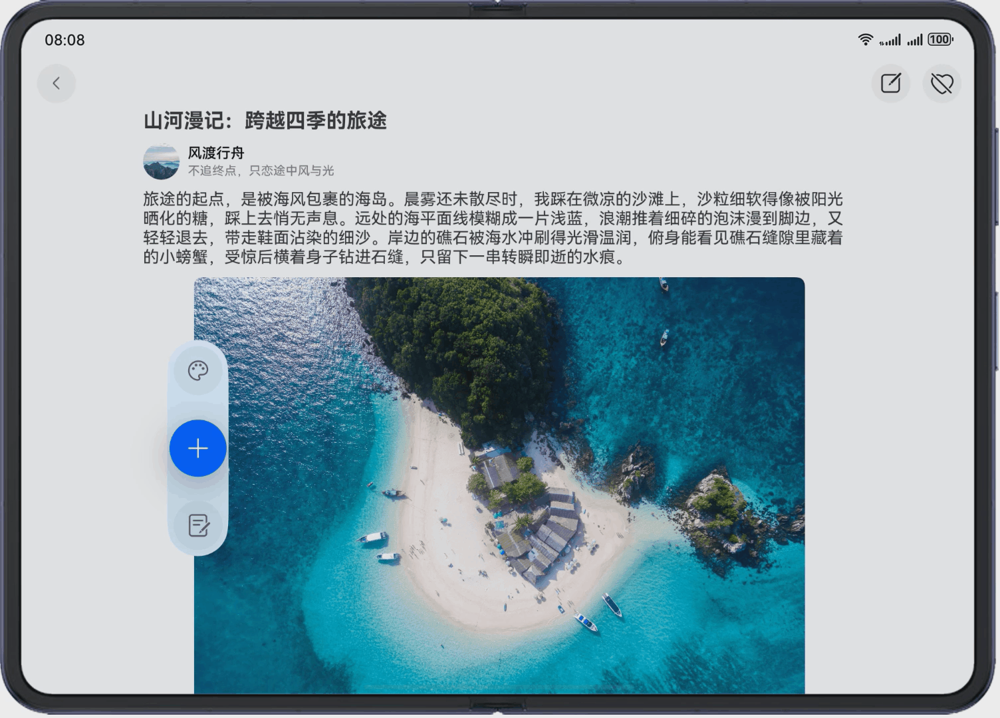
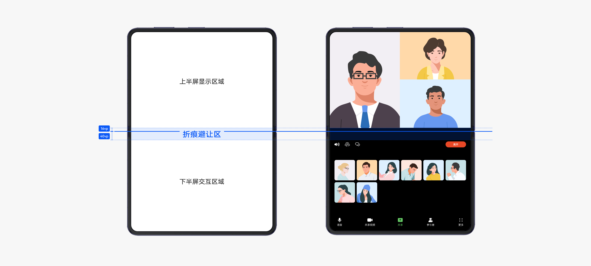

# 阔折叠应用开发

更新时间：2026-06-12 07:22:00

来源：https://developer.huawei.com/consumer/cn/doc/best-practices/bpta-purax-guide

#### 概述

阔折叠设备现有Pura X和Pura X Max两款产品。其中，Pura X配有一块16:10比例的宽阔内屏（展开态）和一块1:1比例的方形外屏（折叠态）；Pura X Max配有一块宽高比10:14的较宽外屏（折叠态）和一块宽高比14:10的内屏（展开态）。相对于直板机，阔折叠有以下明显特点：
 1. 设备屏幕尺寸可变，具有不同大小和形态的窗口。需要针对不同的应用窗口尺寸，做响应式的页面布局适配。
- 折叠时，Pura X外屏为小方形屏。Pura X Max外屏屏幕尺寸较直板机宽度更宽、高度更矮。

2. 展开后，Pura X内屏屏幕接近于直板机，较直板机宽度更宽、高度更矮。Pura X Max内屏屏幕尺寸接近于平板，对内容的展示面积增大。

3. 具有特殊的折叠状态和交互事件。包含三种状态：折叠态，展开态和悬停态。需保障不同状态下的应用体验一致性（如开合连续性）。
展开态：阔折叠完全展开后的形态。有更大的屏幕尺寸，可充分显示应用内容。

4. 折叠态：阔折叠折叠后的形态。折叠后屏幕尺寸变小。

5. 悬停态：阔折叠处于完全展开和折叠的中间状态，可平稳放置。

6. 设备的折叠态和展开态均配置相机：Pura X折叠时仅有前置相机，展开时配有前置相机和后置相机；Pura X Max折叠和展开时均配有前置相机和后置相机。在不同折叠状态下，可用相机和相机的位置会发生变化。开发相机功能时需考虑摄像头切换与预览流重置。

| 产品名称 | 示意图 |

| --- | --- |

| Pura X |  |

| Pura X Max |  |

  
> [!NOTE]
> 本文聚焦于阔折叠应用的体验提升开发指导。如需多设备开发的基础通用能力指导，请参考“ 一次开发，多端部署概览 ”系列文章。

  

  #### 产品硬件说明

  

  #### 屏幕规格信息

  本章节介绍阔折叠的屏幕规格信息，以Pura X和Pura X Max产品的常用屏幕形态为例：

  Pura X折叠态横向、展开态竖向；Pura X Max折叠态竖向、展开态横向。

| 产品名称 | 设备形态 | 屏幕规格信息(宽*高) | 示意图 |

| --- | --- | --- | --- |

| Pura X | 折叠态(横向) | 分辨率(vp)(向下取整)：326*326 |  |

| Pura X | 分辨率(px)：980*980 | 折叠态(横向) |  |

| Pura X | 横纵断点(横向*纵向)：sm*md | 折叠态(横向) |  |

| Pura X | 展开态(竖向) | 分辨率(vp)(向下取整)：440*707 |  |

| 展开态(竖向) | 分辨率(px)：1320*2120 |  |

| 展开态(竖向) | 横纵断点(横向*纵向)：sm*lg |  |

| Pura X Max | 折叠态(竖向) | 分辨率(vp)(向下取整)：459*672 |  |

| Pura X Max | 分辨率(px)：1264*1848 | 折叠态(竖向) |  |

| Pura X Max | 横纵断点(横向*纵向)：sm*lg | 折叠态(竖向) |  |

| Pura X Max | 展开态(横向) | 分辨率(vp)(向下取整)：939*664 |  |

| 展开态(横向) | 分辨率(px)：2584*1828 |  |

| 展开态(横向) | 横纵断点(横向*纵向)：lg*sm |  |

  

  #### 相机硬件信息

  本章节介绍阔折叠的相机硬件信息。以Pura X和Pura X Max产品的相机为例：Pura X折叠态配置一个前置相机，展开态配置一个前置相机和后置相机。Pura X Max折叠态和展开态均配置一个前置相机和后置相机。

| 产品名称 | 设备形态 | 相机硬件信息 | 示意图 |

| --- | --- | --- | --- |

| Pura X | 折叠态(横向) | 前置相机安装镜头角度 | 270度 |  |

| Pura X | 前置相机拍摄预览流旋转角度 | 折叠态(横向) | 180度 |  |

| Pura X | 展开态(竖向) | 后置相机镜头安装角度 | 90度 |  |

| 展开态(竖向) | 后置相机预览流旋转角度 | 90度 |  |

| 展开态(竖向) | 前置相机镜头安装角度 | 270度 |  |

| 展开态(竖向) | 前置相机预览流旋转角度 | 270度 |  |

| Pura X Max | 折叠态(竖向) | 后置相机镜头安装角度 | 90度 |  |

| Pura X Max | 后置相机预览流旋转角度 | 折叠态(竖向) | 90度 |  |

| Pura X Max | 前置相机镜头安装角度 | 折叠态(竖向) | 270度 |  |

| Pura X Max | 前置相机预览流旋转角度 | 折叠态(竖向) | 270度 |  |

| Pura X Max | 展开态(横向) | 后置相机镜头安装角度 | 90度 |  |

| 展开态(横向) | 后置相机预览流旋转角度 | 0度 |  |

| 展开态(横向) | 前置相机镜头安装角度 | 270度 |  |

| 展开态(横向) | 前置相机预览流旋转角度 | 180度 |  |

  相机预览流旋转角度=(后置镜头安装角度+屏幕旋转角度)%360，在设备状态改变后（如横竖屏旋转）需要重置相机预览流，具体实现可参考[设置拍照旋转角度](https://developer.huawei.com/consumer/cn/doc/best-practices/bpta-multi-device-camera#section0752024124911)。

  

  #### 设备折叠能力

  阔折叠具备独特的折叠功能，在不同折叠状态下展现出不同的特性。

  通过[display.isFoldable()](https://developer.huawei.com/consumer/cn/doc/harmonyos-references/js-apis-display#displayisfoldable10)接口可判断设备是否支持折叠，若支持则返回true，否则返回false。通过[display.getFoldStatus()](https://developer.huawei.com/consumer/cn/doc/harmonyos-references/js-apis-display#displaygetfoldstatus10)接口可获取折叠设备当前的折叠状态，返回结果可参考[FoldStatus](https://developer.huawei.com/consumer/cn/doc/harmonyos-references/js-apis-display#foldstatus10)。下表以Pura X Max产品为例，展示了阔折叠的折叠状态和属性。

|    | 折叠态 | 悬停态 | 展开态 |

| --- | --- | --- | --- |

| 示意图 |  |  |  |

| isFoldable | true |

| FoldStatus | FOLD_STATUS_FOLDED | FOLD_STATUS_HALF_FOLDED | FOLD_STATUS_EXPANDED |

  

  #### 创新与体验提升

  

  #### 滑动隐藏

  以Pura X Max产品为例，该产品外屏高度小于直板机，在用户滑动浏览内容时，自动隐藏底部导航栏与顶部标题栏，可最大化可视区域，提升有效信息的呈现面积。

  

  将导航栏与标题栏的高度、透明度设为变量，通过监听滑动动作并根据交互实时改变变量值，即可达到预期效果。详细实现可参考小方形屏[布局设计与实现](https://developer.huawei.com/consumer/cn/doc/best-practices/bpta-multi-device-screen-layout#section13926555601)的沉浸式浏览章节。

  

  #### 交互跟手

  以Pura X Max产品为例，该产品展开态横屏时横向断点为lg，纵向断点为sm，提供更宽广的显示视野和更强的信息承载能力。在布局设计与实现上，建议充分利用其横向空间优势：

  
内容展示：推荐使用分栏布局（如二分栏、三分栏）或重复布局（如瀑布流、多列网格），以清晰展示层级关系并提升信息密度。
- 图文排版：针对图文混排场景，可将竖屏的上下排布调整为左右布局，让页面视觉效果更美观，内容展示也更为高效。

 
具体的布局设计与实现细节，可参考[大屏横屏](https://developer.huawei.com/consumer/cn/doc/best-practices/bpta-multi-device-screen-layout#section6493354468)相关规范。
 
为了提升横屏使用交互体验，建议适配系统全新交互能力，通过接入智感握姿、跟手弹框和跟手半模态等新特性，让用户操作更快捷、高效。
 
**1.智感握姿**：系统提供感知用户当前握持手信息的能力，应用可依据获取的手部信息，自适应调整核心交互组件的显示位置，有效提升用户单手操作便捷性。
 

 
通过订阅握持手状态变化感知事件[motion.on('holdingHandChanged')](https://developer.huawei.com/consumer/cn/doc/harmonyos-references/js-apis-awareness-motion#motiononholdinghandchanged-20)，获取到握持手信息后，更改组件的显示位置。
 
**2.跟手弹框**：设备展开状态下，屏幕中间的弹窗组件手指不易触达。采用跟手式弹出设计，让弹窗在点击位置就近唤起，可降低操作难度，提升交互效率。
 

 
构建UI布局时，可通过条件表达式判断：当横向断点为sm时，使用普通居中弹框；否则，使用跟手弹框[PopoverDialog](https://developer.huawei.com/consumer/cn/doc/harmonyos-references/ohos-arkui-advanced-dialog#popoverdialog14)，提升大屏设备的操作效率。
 
**3.跟手半模态**.：横屏设备可根据业务需要，灵活选用跟手半模态窗口或居中半模态窗口。
 
使用[bindSheet](https://developer.huawei.com/consumer/cn/doc/harmonyos-references/ts-universal-attributes-sheet-transition#bindsheet)绑定半模态转场时，设置半模态属性preferType为[SheetType](https://developer.huawei.com/consumer/cn/doc/harmonyos-references/ts-universal-attributes-sheet-transition#sheettype11枚举说明).POPUP。设置该属性后，窗口宽度小于600vp的设备将默认显示底部弹窗，其他设备则自动适配为跟手弹窗。
 
 

#### 悬停态适配

以Pura X Max产品为例，该产品悬停态支持设备平稳放置于桌面，实现免手持体验，常用于视频通话、视频播放、拍照、听歌等不需要频繁交互的场景。这种状态下，应用需要对中间折痕区域进行避让，并对上下两个界面进行悬停态布局适配。
 

 
 

#### 开合适配

开合连续指应用在屏幕形态与窗口状态切换时，保持页面内容连贯，延续任务进度与运行状态。支持用户快速接续切换前的操作，打造流畅的切换体验。例如阔折叠设备在折叠态与展开态相互切换时，应用页面内容保持不变、状态无缝接续，保障使用体验不受影响。具体实现方案，可参考[开合连续](https://developer.huawei.com/consumer/cn/doc/best-practices/bpta-multi-device-screen-diff#section16541144511135)章节。
 
 

#### 悬浮组件

以Pura X Max产品为例，该产品外屏高度小于直板机，实现界面布局时需着重考虑提升显示效率。
 
借助[HdsTabs](https://developer.huawei.com/consumer/cn/doc/harmonyos-references/ui-design-hdstabs)组件的[barFloatingStyle](https://developer.huawei.com/consumer/cn/doc/harmonyos-references/ui-design-hdstabs#barfloatingstyle)属性实现悬浮导航栏，并通过悬浮材质参数[SystemMaterialParams](https://developer.huawei.com/consumer/cn/doc/harmonyos-references/ui-design-hdstabs#systemmaterialparams)配置透明磨砂材质效果，能有效提升可视区域面积。此外，为增强界面的可玩性与功能延展性，可接入[HdsTabsMiniBar](https://developer.huawei.com/consumer/cn/doc/harmonyos-references/ui-design-hdstabs#hdstabsminibar)组件，在导航区增设一个可扩展迷你标签栏。该组件可在不占用过多空间的前提下，提供额外的导航维度或快捷功能入口，丰富用户交互路径，进一步提升界面操作的灵活性和趣味性。
 

 
 

#### 视频自适应沉浸

以Pura X Max产品为例，该产品外屏高度小于直板机，为避免视频播放画面出现异常拉伸、过度裁剪等问题，可通过自适应沉浸全屏播放方案，精简界面元素、减少视觉干扰，让用户聚焦视频画面，有效提升观看体验。具体实现方案，可参考[视频适配不同尺寸屏幕](https://developer.huawei.com/consumer/cn/doc/best-practices/bpta-multi-device-screen-diff#section1452572513130)章节。
 

 
 

#### 全景多窗

[全景多窗](https://developer.huawei.com/consumer/cn/doc/harmonyos-guides/multi-window-intro#全景多窗)旨在帮助用户高效处理多个任务。通过全景多窗，用户可以突破物理屏幕局限，在同一屏幕内并行运行多款应用，实现应用间快捷切换，提升操作效率。以Pura X Max产品为例，该产品展开态横屏状态下拥有更大的显示视野，具备更强的信息展示与内容承载能力。该产品可依托全景多窗能力，充分利用大屏空间优势，最高支持三个窗口同屏并行运行，助力用户一边浏览资讯、一边编辑内容、一边沟通办公，多任务同步处理、互不冲突，实现办公、娱乐、日常操作一站式协同。
 

 
 

#### 手写笔适配

阔折叠设备的交互方式为触控屏，常见的操作有点击、双击、长按、拖拽、滑动等，应用可根据这些操作进行功能适配，详情可参考[多设备交互](https://developer.huawei.com/consumer/cn/doc/best-practices/bpta-multi-interaction)。
 
除了触控屏交互，部分阔折叠产品（如Pura X Max）还搭载手写笔，支持无感连接与低延迟传输，开盒即用，适用于全局批注、提笔速记及按键遥控等功能场景，实现流畅自然的书写与交互体验。通过系统提供的[Pen Kit简介](https://developer.huawei.com/consumer/cn/doc/harmonyos-guides/pen-introduction)能力，开发者可灵活接入手写套件、全局取色、一笔成形等接口，提升书写交互的扩展性与创作效率。
 
 

#### 设备常见适配问题

 

#### 截断/留白

**应用启动页面未铺满屏幕或出现异常布局**
 
问题描述：在阔折叠展开态启动应用时，应用的启动页面未铺满整个屏幕，出现白屏区域或者启动页面被截断。
 
解决方案：应用需要[配置增强启动页](https://developer.huawei.com/consumer/cn/doc/harmonyos-guides/launch-page-config#配置增强启动页)，配置后启动页面中的背景、图片和图标等资源能根据窗口大小自适应填充，保证启动页面在不同设备形态上正常显示，配置中各标签的说明可参考[startWindow标签](https://developer.huawei.com/consumer/cn/doc/harmonyos-guides/module-configuration-file#startwindow标签)。
 
**应用弹框有截断/留白**
 
问题描述：应用弹窗在直板机上正常显示，在阔折叠上出现截断/留白。
 
解决方案：阔折叠外屏竖向高度小于直板机，实现弹框时建议使用如下几种实现方式：
 1. 使用[自适应布局](https://developer.huawei.com/consumer/cn/doc/best-practices/bpta-multi-device-adaptive-layout)实现弹框布局，当容器组件尺寸发生变化时，可自动适应调整宽高。
2. 使用[constraintSize](https://developer.huawei.com/consumer/cn/doc/harmonyos-references/ts-universal-attributes-size#constraintsize)约束弹框高度最大不超过父组件的90%，避免弹框内容截断。
 
**应用页面有截断/留白**
 
问题描述：应用页面在直板机上正常显示，在阔折叠上出现截断/留白。
 
解决方案：阔折叠的折叠态和展开态，对应不同的窗口尺寸。建议采用响应式布局适配不同窗口尺寸，并随窗口尺寸变化动态调整页面布局，详情可参考[页面适配不同尺寸屏幕](https://developer.huawei.com/consumer/cn/doc/best-practices/bpta-multi-device-screen-diff#section103508214132)。
 
 

#### 异常旋转

**设备形态切换应用启动显示异常**
 
问题描述：以 Pura X Max 为例，在折叠态冷启动应用并退出至后台，将设备展开再热启动该应用，页面会先以竖屏样式展示，再自动切换为横屏显示。
 
可能原因：应用将折叠态窗口旋转策略配置为portrait，展开态配置为auto_rotation_restricted。应用在折叠态后台运行时，页面维持竖屏窗口状态；设备展开后应用会先保留原有竖屏样式，再响应设备形态变更，触发旋转策略切换为横屏展示。
 
解决方案：应用可使用[跟随桌面的旋转策略](https://developer.huawei.com/consumer/cn/doc/best-practices/bpta-multi-device-window-direction#section3434202623320)，通过修改module.json5配置文件中的orientation属性为FOLLOW_DESKTOP解决该问题。
 
 

#### 相机开发

**外屏相机功能异常**
 
问题描述：以Pura X为例，外屏相机页面的开发，可能出现以下问题：
 1. 相机页面布局异常。
2. 设备形态切换后预览画面拉伸/压缩。
3. 预览画面黑屏。
4. 拍摄照片显示角度异常。
 
解决方案：
 1. 针对不同屏幕尺寸的横向断点适配多套相机页面布局。详情请参考[通过断点实现多套页面布局](https://developer.huawei.com/consumer/cn/doc/best-practices/bpta-multi-device-camera#section181143569262)。
2. 调整XComponent组件Surface区域的宽高比，使其与预览流旋转后的宽高比保持一致。详情请参考[设置多设备上相机预览画面比例](https://developer.huawei.com/consumer/cn/doc/best-practices/bpta-multi-device-camera#section882216138497)。
3. 监听设备形态切换导致的窗口尺寸变更，重新选择可用相机并生成预览流。详情请参考[选择相机设备](https://developer.huawei.com/consumer/cn/doc/best-practices/bpta-multi-device-camera#section13854163154917)。
4. 正确配置拍照的旋转角度。详情请参考[设置拍照旋转角度](https://developer.huawei.com/consumer/cn/doc/best-practices/bpta-multi-device-camera#section0752024124911)。
