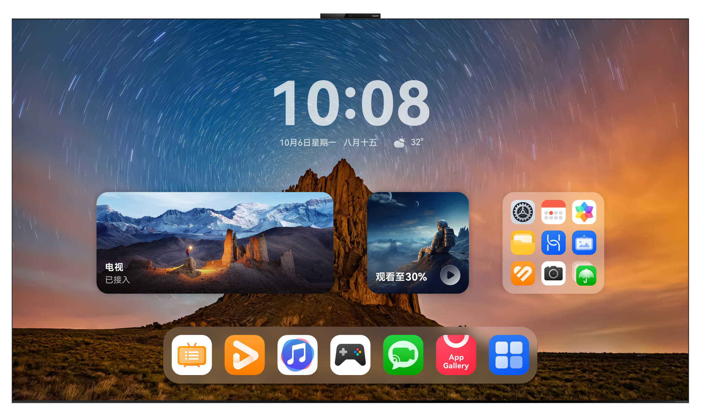

# MateTV智慧屏应用开发

更新时间：2026-05-22 09:46:30

来源：https://developer.huawei.com/consumer/cn/doc/best-practices/bpta-matetv-guide

##### 概述

 

##### 设备特点

华为Mate TV智慧屏作为家居场景下的核心设备，致力于为家庭用户带来更加智慧、沉浸、无缝的娱乐体验，是HarmonyOS 1+8设备全场景一体化体验中不可或缺的部分。具有以下突出特点：
 
- 配备高清大屏，兼具高分辨率与高刷新率，呈现细腻流畅的视觉体验，轻松满足学习、娱乐与办公等多场景内容展示需求。
- Mate TV智慧屏注重操作的便捷性与灵活性，搭配灵犀指向遥控和灵犀触控板，带来如操作平板般直观流畅的人机交互体验。

 

 
 

##### 硬件说明

本章将介绍智慧屏的屏幕方向、屏幕尺寸以及相机硬件参数等信息。
 
 

##### 屏幕规格信息

Mate TV的屏幕不支持旋转，屏幕旋转角度为0°，屏幕方向为横屏，以下是智慧屏的硬件参数。
  
| 屏幕旋转角度（rotation） | 0(0度) | 1(90度) | 2(180度) | 3(270度) |
| --- | --- | --- | --- | --- |
| 示意图 |  | 不支持 | 不支持 | 不支持 |
| --- | --- | --- | --- | --- |
| 屏幕方向Orientation | 横屏LANDSCAPE | 不支持 | 不支持 | 不支持 |
| --- | --- | --- | --- | --- |
| 屏幕ID | 0 | 不支持 | 不支持 | 不支持 |
| --- | --- | --- | --- | --- |
| 分辨率(vp) (向下取整) | 1280 * 720 | 不支持 | 不支持 | 不支持 |
| --- | --- | --- | --- | --- |
| 分辨率(px) | 3840 * 2160 | 不支持 | 不支持 | 不支持 |
| --- | --- | --- | --- | --- |
| 横纵断点 | 横向断点lg，纵向断点sm | 不支持 | 不支持 | 不支持 |
| --- | --- | --- | --- | --- |
 
 
 

##### Mate TV其他硬件信息

**相机硬件信息**
 
相机有默认的[镜头安装角度](https://developer.huawei.com/consumer/cn/doc/harmonyos-guides/camera-rotation-term#相机镜头安装角度)，在使用时需要考虑镜头角度和设备的旋转角度，具体定义可参考[预览旋转角度](https://developer.huawei.com/consumer/cn/doc/harmonyos-guides/camera-rotation-term#预览旋转角度)。Mate TV配备一枚后置摄像头，镜头固定于屏幕顶部，不支持旋转，相机镜头角度为0°，屏幕旋转角度也为0°，因此拍摄预览流旋转角度=相机镜头角度+屏幕旋转角度，结果为0°。Mate TV镜头角度以及需要设置的预览流旋转角度如下。
  
| 屏幕旋转角度（rotation） | 0(0度) | 1(90度) | 2(180度) | 3(270度) |
| --- | --- | --- | --- | --- |
| 示意图 |  | 不支持 | 不支持 | 不支持 |
| --- | --- | --- | --- | --- |
| 后置相机镜头角度 | 0度 | 不支持 | 不支持 | 不支持 |
| --- | --- | --- | --- | --- |
| 后置相机拍摄预览流旋转角度 | 0度 | 不支持 | 不支持 | 不支持 |
| --- | --- | --- | --- | --- |
| 前置相机镜头角度 | 不支持 | 不支持 | 不支持 | 不支持 |
| --- | --- | --- | --- | --- |
| 前置相机拍摄预览流旋转角度 | 不支持 | 不支持 | 不支持 | 不支持 |
| --- | --- | --- | --- | --- |
 
 
> [!WARNING]
> Mate TV仅配备一枚位于设备前方的摄像头，其 CameraPosition 参数显示为CAMERA_POSITION_BACK，开发者在适配时需注意这一设备差异，避免因位置判断错误导致功能异常。 开发者可以通过相机设备信息 CameraDevice 查看相机安装角度cameraOrientation，Mate TV的相机安装角度为0°。

 
 

##### 体验标准

应用体验建议分为功能与兼容性、稳定性、性能、功耗、安全和UX六个部分，详细信息如下所示。
  
| 名称 | 简介 |
| --- | --- |
| 应用基础功能和兼容性体验建议 | 应用与OS兼容、应用与设备兼容、应用升级兼容、功能体验相关等 |
| 应用稳定性体验建议 | 长时间运行故障率（崩溃、冻屏等）、长时间运行内存资源异常 |
| 应用性能体验建议 | 时延、帧率流畅体验和内存占用、CPU占用、线程数等资源占用约束 |
| 应用功耗体验建议 | 后台任务使用、后台硬件器件资源/软件系统资源占用管控，分布式资源占用等 |
| 应用安全隐私体验建议 | 基础安全、恶意软件、应用安全、隐私合规等 |
| 应用UX体验建议 | 设计规范、设计约束的符合性，UX精致体验要求等 |
 
 
智慧屏的UX需针对性适配大屏场景，下文主要介绍智慧屏的UX体验建议。
 
 

##### UX体验建议

**体验设计标准**
 
智慧屏采用固定式大屏设计，专注于提供开阔的视野和沉浸式的视觉体验，适合家庭娱乐、远程协作与多任务高效办公，其稳定的大屏呈现为用户带来专注、舒适的内容观赏与操作体验。详细的UX设计标准可参考[智慧屏](https://developer.huawei.com/consumer/cn/doc/design-guides/vision-0000002321377950)和[智慧屏应用UX体验标准](https://developer.huawei.com/consumer/cn/doc/design-guides/ux-guidelines-vision-0000002360813381)：
 
- 使用系统控件：优先采用系统提供的底部标签、标题栏、弹窗等标准组件，在保障一致性和基础体验的同时，有效降低设计与开发成本。可根据品牌调性对控件的样式或尺寸进行适度定制，彰显产品个性。
- 使用合适的应用架构：根据业务的特点采用合适的架构，智慧屏有沉浸式布局、分栏式布局和通用布局三种应用架构。例如，影音娱乐类应用可选择沉浸式布局，提升内容视觉沉浸感；即时通讯类应用通常采用左右分栏的应用架构，以达到快速高效浏览的作用。
- 充分利用遥控器交互：在基础走焦与指向操作之外，充分挖掘遥控器的多功能按键与交互特性。例如，短按“菜单键”可唤出上下文相关的扩展功能；结合指向式光标的悬浮状态，设计动态视觉反馈或快捷操作入口，提升交互的直观性与趣味性。

 
**体验设计差异点**
 
区别于手机、平板等移动设备，智慧屏以大屏沉浸体验为基础，融合智慧交互与多设备无缝协同，打造家庭场景下内容沉浸、操作智能、连接流畅的全场景智慧生活中心。体验设计应围绕沉浸、智慧、无缝三个原则展开。可参考智慧屏的[设计原则](https://developer.huawei.com/consumer/cn/doc/design-guides/vision-0000002321377950#section17309185552418)章节。
 
**应用设计最佳实践**
 
根据上述UX体验标准和设计差异点，各垂域应用可根据功能和场景特点进行智慧屏UX设计，更多垂域设计信息和方案可参考[应用设计最佳实践](https://developer.huawei.com/consumer/cn/doc/design-guides/practices-overview-0000001746498066)。
 
 

##### 工程管理

 

##### 工程配置

在智慧屏设备上运行的应用，需要在module.json5配置文件的module字段中包含"tv"。更多详情可参考[deviceTypes标签](https://developer.huawei.com/consumer/cn/doc/harmonyos-guides/module-configuration-file#devicetypes标签)。
 
 

##### 包管理策略

Mate TV上HAP包的管理策略建议根据场景差异灵活选择，在统一性与个性化之间取得平衡，兼顾开发效率与用户体验：
 
- 统一HAP多端部署：对于页面结构与交互逻辑高度相似的应用（如布局可通过响应式设计适配，核心功能一致），推荐使用同一HAP包，依托 HarmonyOS 的多设备自适应与响应式布局能力，实现跨端（如手机、平板、智慧屏）协同部署，有助于降低维护成本，提升发布与迭代效率。
- 独立HAP精准适配：若智慧屏与其他设备在页面设计、功能形态上存在显著差异（如移动端为多元素交互界面，智慧屏则以图文展示为主，且功能范围不同），应创建独立HAP包，分别构建面向phone/tablet与tv等设备的模块化组件，实现设备专属的UX设计、资源优化与体验定制。

 
更多详情可参见[分层架构设计](https://developer.huawei.com/consumer/cn/doc/best-practices/bpta-layered-architecture-design)的产品定制层相关内容。
 
 

##### 工程调试

智慧屏使用WIFI无线调试（支持自动签名），调试步骤为：
 
- 将智慧屏真机设备和安装了DevEco Studio的PC连接到同一WLAN网络；
- 获取智慧屏的IP地址；
- 在DevEco Studio中通过IP地址和端口号（固定为5555）连接设备；
- 连接成功后，选择该设备运行应用。

 
上述步骤请在满足[前提条件](https://developer.huawei.com/consumer/cn/doc/harmonyos-guides/ide-run-device#section1691422586)后进行，详细操作步骤可参考[使用无线调试连接方式](https://developer.huawei.com/consumer/cn/doc/harmonyos-guides/ide-run-device#section9315596477)。
 
 

##### 窗口适配

 

##### 窗口模式

Mate TV仅支持全屏模式，不支持分屏模式和自由悬浮形式窗口模式。
 
 

##### 窗口方向

智慧屏屏幕不支持旋转，屏幕方向仅支持横屏，通过[getPreferredOrientation()](https://developer.huawei.com/consumer/cn/doc/harmonyos-references/arkts-apis-window-window#getpreferredorientation12)获取的窗口方向[Orientation](https://developer.huawei.com/consumer/cn/doc/harmonyos-references/arkts-apis-window-e#orientation9)为UNSPECIFIED，表示由系统判定窗口方向。开发者在开发智慧屏应用时，应明确窗口方向与屏幕方向保持一致，可以通过[display.getDefaultDisplaySync()](https://developer.huawei.com/consumer/cn/doc/harmonyos-references/js-apis-display#displaygetdefaultdisplaysync9)接口获取屏幕显示方向orientation。
 
> [!NOTE]
> Mate TV默认窗口方向为UNSPECIFIED，表示由系统判定窗口方向，且 window.setPreferredOrientation() 设置窗口方向不生效，所以不建议调用 window.setPreferredOrientation() 设置智慧屏的窗口方向。

 
 

##### 窗口沉浸式

**建议适配全屏模式的沉浸式**
 
Mate TV仅支持全屏模式，其窗口全屏布局方案主要涉及应用扩展布局，不隐藏避让区和应用扩展布局，隐藏避让区两个应用场景。详情可参考[窗口沉浸式](https://developer.huawei.com/consumer/cn/doc/best-practices/bpta-multi-device-window-immersive)。
 
 

##### 界面开发

 

##### 典型布局场景

Mate TV上典型的响应式布局场景包括分栏布局与重复布局。开发者可结合不同UI组件与断点规则，灵活调整界面结构，适配多尺寸屏幕与使用场景，实现从紧凑到宽敞视图的平滑过渡，从而构建层次清晰、体验丰富的多样化布局效果。
  
| 响应式布局方式 | 典型布局场景 | 实现方案 | 效果图 |
| --- | --- | --- | --- |
| 重复布局 | 列表布局 | List组件+断点 |  |
| 重复布局 | 瀑布流布局 | WaterFlow组件+断点 |  |
| 重复布局 | 轮播布局 | Swiper组件+断点 |  |
| 重复布局 | 网格布局 | Grid组件+断点 |  |
| 分栏布局 | 侧边栏 | SideBarContainer组件+断点 |  |
| 分栏布局 | 单/双栏 | Navigation组件+断点 |  |
 
 
> [!TIP]
> List组件默认在智慧屏上开启渐隐效果（ fadingEdge ），应用可将其设置为false关闭该效果。当fadingEdge生效时，需注意以下限制与影响： 属性覆盖与截屏异常：会覆盖原组件的 .overlay() 和 .blendMode() 属性，并导致当前组件及其子组件的截屏接口无法获取正确画面。 背景属性冲突：建议不要在设置fadingEdge的组件上设置 background 相关属性，否则会影响渐隐的显示效果。 裁剪限制：组件会强制裁剪至边界，此时在该组件上设置 clip 属性为false将不生效。 详细说明可参考 fadingEdge 说明。

 
 

##### 大屏横屏适配建议

Mate TV为固定尺寸的大屏设备，不支持屏幕旋转，结合其横向断点为lg、纵向断点为sm的特性，设备始终以大屏横屏形态呈现。设计时应充分依托大屏空间优势，合理规划分栏布局与内容层级，优化信息密度与视觉动线，打造适配家庭场景的沉浸式、高效化交互体验。大屏横屏的布局设计与实现可参考[大屏横屏](https://developer.huawei.com/consumer/cn/doc/best-practices/bpta-multi-device-screen-layout#section6493354468)。
 
> [!NOTE]
> 智慧屏ArkUI控件默认采用深色模式配色，应用在适配时需要确认在智慧屏上的显示效果，确保渲染正确，规避白底白字等显示异常。

 
 

##### 交互体验

Mate TV支持多种输入设备：
 
- [灵犀指向遥控](#section1910112843519)：用户可通过指向操作实现光标精准控制，直接点击或滑动屏幕内容。
- 灵犀悬浮触控：效果类比手机触摸屏，支持手指悬浮悬停以精准感应位置，触控瞬间即时响应，操作流畅灵敏。
- [走焦类遥控器](#section1258594118353)：用户通过方向键移动界面焦点，逐项聚焦并确认选择，适用于标准走焦式交互场景。
- [外接键鼠](#section13775551173519)：支持蓝牙外接键盘与鼠标，启用后，鼠标可实现精准光标控制，键盘支持快捷键操作。

 
鼠标、灵犀指向遥控和灵犀悬浮触控作为归一化的交互设备，支持悬浮、点击、双击、长按、上下文菜单、拖拽、轻扫和滚动等基础操作，并依托灵犀指向遥控的精准光标能力，可实现跳选、圈选、滑动等进阶交互。
 
键盘支持快捷键事件，走焦类遥控器支持焦点导航，满足不同场景下的操控需求。
 
> [!NOTE]
> 系统底层对灵犀悬浮触控提供统一支持，确保开发者免适配即可实现开箱即用的自然触控操作。 灵犀悬浮触控内置振动马达，可以使用 vibrator 振动传感器能力设置振动效果、时长等，典型应用场景如游戏打斗时的振动反馈，可增强沉浸感，提升用户代入感，开发步骤如下： 使用马达振动前，通过 vibrator.on 监听马达热插拔事件上报。 使用 vibrator.getVibratorInfoSync() 查询设备的马达信息列表，获得马达信息。 设备准备完全后，使用 vibrator.startVibration() 和 vibrator.stopVibration() 接口控制马达振动的启动和关闭。

 
 

##### 灵犀指向遥控

采用光标指向交互时，使用的是灵犀指向遥控器，相比传统的焦点导航遥控器，点选方式更加轻松自如。操控方式像使用激光笔，可以精准指向目标并选中，无需一步一步地切换图标选择，高效便捷，所指即所得，享受流畅的操控体⁠验。
 

 
以下是对灵犀指向遥控按键的说明：
  
| 按键 | 说明 |
| --- | --- |
| 电源键 | 关机或熄屏。 |
| Home键 | 短按返回Home页，长按进入任务中心。 |
| OK键&触摸区 | 短按OK键即对当前指向对象进行点击，如指向应用图标，点击OK键即可打开应用。在触摸区滑动即可对指向对象进行滑动交互，如左右滑动切换桌面。 |
| 方向键 | 灵犀指向遥控不支持方向键调节焦点功能，方向键对应上下左右四个方向的滑动操作。例如，可使用方向键的上下键调节页面上下滑动切换。 |
| 菜单键 | 短按可呼出当前交互对象更多隐藏功能，长按可进入控制中心。 |
| 语音键 | 长按可呼出小艺进行语音交互。 |
| 音量键 | 调节音量大小。 |
 
 
借助灵犀遥控器，用户可实现指向、点击、滑动、圈选、跳选、拖拽等操作，提供接近手机触屏的精准交互体验，突破传统大屏遥控器依赖按键和焦点导航的局限，显著提升操作效率与直观性。以下是灵犀指向遥控支持的交互事件，建议开发者使用如下归一化手势事件，实现一次开发，多端兼容，同时适配灵犀遥控器、触摸屏、鼠标、键盘、手写笔等多种输入设备。
  
| 事件 | 方法 | 说明 |
| --- | --- | --- |
| 悬浮 | onHover | 当光标指向组件时触发。 |
| 点击 | onClick | 当用户按下确认键时触发。 |
| 长按 | LongPressGesture | 当用户在屏幕上长按时间超过500毫秒时触发，支持最少1个手指触发。 |
| 拖拽 | Drag | 当在组件上长按并开始移动后触发，用于响应拖拽交互行为。 |
| 滑动 | PanGesture | 当滑动的最小距离达到设定的最小值时触发，触摸区滑动和方向键均可触发该手势事件。 |
 
 
Mate TV交互默认使用遥控器进行控制，应用可通过[按键事件](https://developer.huawei.com/consumer/cn/doc/harmonyos-references-V5/ts-universal-events-key-V5)监听遥控器按键实现相应的功能响应，下列按键键值[KeyCode](https://developer.huawei.com/consumer/cn/doc/harmonyos-references-V5/js-apis-keycode-V5#keycode)为灵犀指向遥控特别定义的功能键值，用于实现特定交互操作。
  
| 名称 | 值 | 说明 |
| --- | --- | --- |
| KEYCODE_MENU | 2067 | 菜单键 |
| KEYCODE_VOLUME_UP | 16 | 音量增加键 |
| KEYCODE_VOLUME_DOWN | 17 | 音量减小键 |
 
 
> [!NOTE]
> 灵犀指向遥控上的电源键、Home键、OK键、返回键、语音键均具备默认功能，不响应onKeyEvent事件，例如：电源键默认功能为关机或熄屏；Home键默认功能为短按返回Home页，长按进入任务中心。

 
 

##### 走焦类遥控器

使用走焦类遥控器时，用户通过遥控器的方向键在界面元素间逐级移动焦点，实现导航与操作。系统通过焦点框的高亮反馈明确指示当前可交互对象，确保操作的可视性与准确性。为提升用户体验，应用应合理设置焦点顺序、支持循环导航与快捷跳转，并针对复杂布局优化焦点管理逻辑。更多详情可参考[焦点导航事件适配](https://developer.huawei.com/consumer/cn/doc/best-practices/bpta-multi-interaction#section168661941154220)。
 
 

##### 外接键鼠

用户通过蓝牙外接鼠标和键盘进行操作时，应用应针对键鼠输入特性进行针对性适配，以提升操作效率与交互体验：
 
- 鼠标交互：建议为可交互 UI 组件（如按钮、菜单、列表项等）适配悬浮态视觉反馈（如颜色变化、阴影、缩放等），增强操作可感知性。开发方案请参考[交互归一事件适配](https://developer.huawei.com/consumer/cn/doc/best-practices/bpta-multi-interaction#section088812013815)的悬浮场景。鼠标常用的点击、长按等交互事件已实现交互归一，开发指导可参考[交互归一事件适配](https://developer.huawei.com/consumer/cn/doc/best-practices/bpta-multi-interaction#section088812013815)。
- 键盘操作：建议支持常用快捷键（如Enter确认、Esc 返回、方向键导航等），提升文本输入与页面浏览效率。开发方案请参考[基础输入事件](https://developer.huawei.com/consumer/cn/doc/best-practices/bpta-multi-interaction#section151791829184110)的按键事件适配。

 
 

##### 功能开发

 

##### Mate TV功能差异

受限于硬件配置，一些在移动端常见的功能与能力在Mate TV上不支持。为确保应用在Mate TV上的兼容性，应用侧需主动识别设备支持的能力并进行适配，对不可用功能进行屏蔽。
 
例如，以下两个常用功能，Mate TV暂不支持：
 
- [地图服务](https://developer.huawei.com/consumer/cn/doc/harmonyos-references/map-api)：智慧屏地图服务，涉及地图展示、路径规划等功能的模块，应在Mate TV端进行功能屏蔽。
- [重力传感器](https://developer.huawei.com/consumer/cn/doc/harmonyos-references/js-apis-sensor#gravity9)：设备无法感知倾斜、晃动或方向变化，依赖该传感器的功能（如摇一摇、屏幕旋转监听等）无法使用，应在智慧屏端进行功能屏蔽。

 
 

##### 相机功能开发

对于需要实现相机页面和功能的应用，在智慧屏上主要考虑的有以下几点。
 
**相机页面布局**
 
根据智慧屏相机页面的UX设计稿，通过横向断点区分和实现智慧屏的页面布局。
 

 
**选择****相机设备**
 
Mate TV仅配备一枚位于设备前方的摄像头，其[CameraPosition](https://developer.huawei.com/consumer/cn/doc/harmonyos-references/arkts-apis-camera-e#cameraposition)参数显示为CAMERA_POSITION_BACK，开发者开发时应选择后置相机。
 
**相机预览流配置**
 
配置预览流分辨率，避免出现压缩、拉伸、异常旋转的问题。Mate TV的屏幕不支持旋转，以获取预览流宽高比4:3为例，Mate TV固定屏幕状态下，应通过[setXComponentSurfaceRect()](https://developer.huawei.com/consumer/cn/doc/harmonyos-references/ts-basic-components-xcomponent#setxcomponentsurfacerect12)设置Surface宽高比为4:3。
 
**设置拍照旋转角度**
 
拍照场景下，需确保图片始终正向显示，避免出现照片方向异常，开发时应采用统一的计算模型：预览旋转角度=相机安装角度+屏幕旋转角度。Mate TV的相机安装角度和屏幕旋转角度均为固定值，预览旋转角度为0°。详情可参考[Mate TV其他硬件信息](#section28146401514)相机硬件信息章节。
 
**屏蔽不支持的功能**
 
智慧屏不支持重力传感器，如果应用在拍照时通过重力传感器判断拍照的旋转角度，要在智慧屏上屏蔽，否则可能导致应用拍照功能无法正常使用。
 
 

##### 未成年人模式适配

[未成年人模式](https://developer.huawei.com/consumer/cn/doc/harmonyos-guides/account-overview-minorsprotection)旨在协同应用与系统能力，构建安全、健康的网络环境，加强对未成年人的网络保护。智慧屏作为家庭场景中的核心设备，面向全家人共享使用，其应用生态中涵盖大量儿童教育类应用，尤其需要加强对未成年用户的使用监管与内容过滤。
 
智慧屏上的应用通过接入Account Kit提供的[未成年人模式能力](https://developer.huawei.com/consumer/cn/doc/harmonyos-references/account-api-minorsprotection)与系统联动，可快速实现自动切换未成年人模式状态，简化了家长用户的设置步骤，为未成年人提供安全、健康的网络环境。主要包含以下几种场景：
 
- 应用与系统联动切换未成年人模式：应用实时获取系统未成年人模式的开启状态，并确保应用内的未成年人模式状态与系统状态保持一致。
- 应用内开启未成年人模式：调用系统未成年人模式的开启接口[leadToTurnOnMinorsMode()](https://developer.huawei.com/consumer/cn/doc/harmonyos-references/account-api-minorsprotection#leadtoturnonminorsmode)，拉起系统未成年人模式开启流程。
- 关闭应用的未成年人模式：应用可独立关闭自身未成年人模式，需先家长身份验证接口[verifyMinorsProtectionCredential()](https://developer.huawei.com/consumer/cn/doc/harmonyos-references/account-api-minorsprotection#verifyminorsprotectioncredential)，验证通过后，可关闭应用的未成年人模式。
- 关闭系统的未成年人模式：调用系统未成年人模式的关闭接口[leadToTurnOffMinorsMode()](https://developer.huawei.com/consumer/cn/doc/harmonyos-references/account-api-minorsprotection#leadtoturnoffminorsmode)，拉起系统的未成年人模式关闭流程，系统未成年人模式关闭后，应用需跟随同步关闭。
- 应用内调整未成年人模式设置：用户调整内容偏好、使用时长等设置，验证家长身份。操作前需调用家长身份验证接口[verifyMinorsProtectionCredential()](https://developer.huawei.com/consumer/cn/doc/harmonyos-references/account-api-minorsprotection#verifyminorsprotectioncredential)进行身份验证。

 
具体开发指导可参考[应用与系统实现未成年人模式联动](https://developer.huawei.com/consumer/cn/doc/harmonyos-guides/account-follow-minorsprotection)。
 
 

##### 应用接续

应用接续是指应用可通过[应用接续概述](https://developer.huawei.com/consumer/cn/doc/best-practices/bpta-continue-cast)能力，从其他设备接续到智慧屏继续运行，实现跨设备的任务延续，保障用户操作的连贯性与体验的无缝性。例如，用户在手机上观看视频时，可将其接续至智慧屏，同步播放进度，实现不间断的观影体验。
 
应用接续的原理是实现将应用当前任务（包括页面控件状态变量等）迁移到目标设备，并在目标设备上接续使用。具体的开发指导可参考[开发步骤](https://developer.huawei.com/consumer/cn/doc/best-practices/bpta-continue-data#section58703554417)。
 
> [!NOTE]
> 由于智慧屏与其他设备存在差异，同一应用在不同设备类型上可能使用不同的BundleName，若需支持应用接续，需进行额外配置以确保接续正常。详情可参考 支持同应用不同BundleName的Ability跨端迁移 。

 
 

##### 服务卡片开发

应用可在智慧屏桌面上将用户关注的重要信息或常用操作以服务卡片形式呈现，以达到信息展示、服务直达的便捷体验效果。开发指导可参考[ArkTS卡片开发](https://developer.huawei.com/consumer/cn/doc/harmonyos-guides/arkts-ui)。
 
 

##### 常见问题

 

##### 如何判断当前设备是智慧屏

**问题现象**
 
智慧屏与平板处于相同的断点区间，理论上可共用同一布局，但在实际应用中，因屏幕尺寸、观看距离和交互方式的差异，两者的布局表现可能存在区别。例如，智慧屏需适配更远的观看距离，宜采用更简洁的结构、更大的触控热区与更强的视觉引导。因此，需要区分当前设备是否为智慧屏。
 
**解决方案**
 
通过[包管理策略](#section1870515318482)实现不同场景下的设备适配判断：
 
- 统一HAP包，当智慧屏与其他设备的页面结构与交互逻辑高度相似时，则使用断点判断，对于同一断点区间的设备（如平板），采用相同的布局。
- 独立HAP包，当智慧屏与其他设备在界面设计与交互方式上存在显著差异时，建议在product层单独开发tv的HAP包，在代码层直接进行差异化开发。

 
 

##### 相机预览流旋转方向异常

**问题现象**
 
相机预览流旋转方向异常旋转90°或270°。
 
**可能原因**
 
开发时应考虑手机和智慧屏的差异，以直板机竖屏、充电口向下为例，其后置相机预览旋转角度为90°，前置相机预览旋转角度为270°。而智慧屏屏幕不支持旋转，其预览旋转角度始终为0°，开发时应考虑这一差异点。
 
**解决方案**
 
开发时应采用统一的计算模型：预览旋转角度=相机安装角度+屏幕旋转角度。Mate TV的相机安装角度和屏幕旋转角度均为固定值，预览旋转角度为0°。详情可参考[相机功能开发](#section191715440233)章节。
 
 

##### 相机预览画面黑屏

**问题现象**
 
应用相机初始化失败，预览画面黑屏。
 
**可能原因**
 
Mate TV仅配备一枚位于设备前方的摄像头，其CameraPosition为CAMERA_POSITION_BACK，若应用选择前置相机则会导致初始化失败。
 
**解决方案**
 
开发时应以系统返回的参数值为准，Mate TV相机开发时应调用后置相机作为使用相机。
 
 

##### 使用相机拍照时闪退

**问题现象**
 
应用内点击拍照按钮时，应用闪退。
 
**可能原因**
 
应用在手机上实现相机时，根据重力传感器数据设置拍照时的旋转角度，由于Mate TV不支持重力传感器，导致闪退。
 
**解决方案**
 
开发Mate TV应用时屏蔽重力传感器功能。
 
 

##### 应用部分按钮、弹窗、输入框显示异常

**问题现象**
 
应用整体为浅色，但是按钮、弹窗、输入框等样式默认均为深色，颜色不统一。
 
**可能原因**
 
Mate TV仅支持深色模式，系统控件默认为深色样式，部分未适配深色模式的应用因页面与控件颜色不一致而出现显示异常。
 
**解决方案**
 
应用应适配深色模式，确保与系统显示风格一致，避免出现样式异常问题。适配指导可参考[深色模式适配](https://developer.huawei.com/consumer/cn/doc/best-practices/bpta-dark-mode-adaptation#section128661451172714)。
 
 

##### 系统未成年人模式下，应用禁止使用

**问题现象**
 
系统处于未成年人模式，无法正常使用应用。
 
**可能原因**
 
应用未适配未成年人模式，导致应用处于禁用状态。
 
**解决方案**
 
退出系统未成年人模式可正常访问应用。建议应用适配未成年人模式，提升用户体验，适配指导可参考[未成年人模式适配](#section1641895117238)章节。
 
 

##### 三方应用不兼容有线网络问题

**问题现象**
 
有线网络下，应用无法正常访问网络。
 
**可能原因**
 
应用未适配有线网络，导致在使用有线连接时无法正常进行网络请求。
 
**解决方案**
 
智慧屏存在有线网络连接的使用场景，应用适配时应考虑这一场景，使用[以太网连接管理](https://developer.huawei.com/consumer/cn/doc/harmonyos-references/js-apis-net-ethernet)能力管理有线网络，开发指导可参考[管理网络连接](https://developer.huawei.com/consumer/cn/doc/harmonyos-guides/net-connection-manager)。
 
 

##### 打开协议或隐私，弹出异常弹框

**问题现象**
 
应用在打开协议或隐私政策查看详情时，未正常显示详情内容，而是弹出了异常提示框。
 
**可能原因**
 
应用通过调用浏览器打开协议或隐私政策，但智慧屏设备不支持浏览器，导致无法正常查看。
 
**解决方案**
 
建议智慧屏上的应用在打开协议或隐私政策时，建议使用[WebView](https://developer.huawei.com/consumer/cn/doc/harmonyos-references/js-apis-webview)的方式展示。
 
 

##### 应用显示出现白底白字现象，导致看不清文字

**问题现象**
 
应用在智慧屏上界面出现白底白字的问题，用户无法看清文字。
 
**可能原因**
 
ArkUI控件在TV端默认使用深色样式，但是应用没有适配深色模式。
 
**解决方案**
 
建议应用适配深色模式，或者确认应用在智慧屏上的显示效果，确保无白底白字这类问题。
