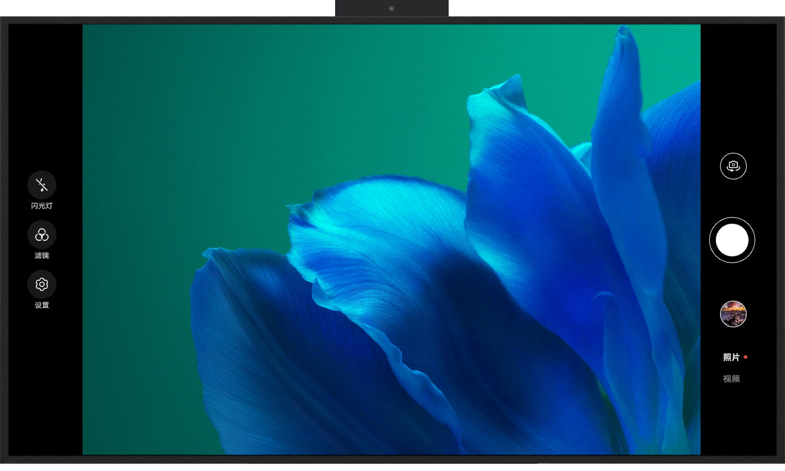

# 智慧屏应用开发

更新时间：2026-05-30 09:52:30

来源：https://developer.huawei.com/consumer/cn/doc/best-practices/bpta-matetv-guide

华为智慧屏作为家居场景下的核心设备，致力于为家庭用户带来更加智慧、沉浸、无缝的娱乐体验，是HarmonyOS 1+8设备全场景一体化体验中不可或缺的部分。具有以下突出特点：
 
- 配备高清大屏，兼具高分辨率与高刷新率，呈现细腻流畅的视觉体验，轻松满足学习、娱乐与办公等多场景的内容展示需求。
- 智慧屏注重操作的便捷性与灵活性，搭配灵犀指向遥控和灵犀触控板，带来如操作平板般直观流畅的人机交互体验。

 
华为智慧屏目前主要的产品为Mate TV，示意图如下：
  
| 产品名称 | 示意图 |
| --- | --- |
| Mate TV |  |
 
 
> [!NOTE]
> 本文聚焦于智慧屏应用的体验提升开发指导。如需多设备开发的基础通用能力指导，请参考“ 一次开发，多端部署概览 ”系列文章。

 

#### 硬件说明

本章以Mate TV产品为例介绍智慧屏的屏幕方向、屏幕尺寸以及相机硬件参数等信息。
 
 

#### 屏幕规格信息

Mate TV的屏幕不支持旋转，屏幕旋转角度为0°，屏幕方向为横屏，以下是智慧屏的硬件参数。
  
| 屏幕旋转角度(rotation) | 0(0度) | 1(90度) | 2(180度) | 3(270度) |
| --- | --- | --- | --- | --- |
| 示意图 |  | 不支持 | 不支持 | 不支持 |
| --- | --- | --- | --- | --- |
| 屏幕方向(Orientation) | 横屏LANDSCAPE | 不支持 | 不支持 | 不支持 |
| --- | --- | --- | --- | --- |
| 屏幕ID | 0 | 不支持 | 不支持 | 不支持 |
| --- | --- | --- | --- | --- |
| 分辨率(vp)(向下取整) | 1280*720 | 不支持 | 不支持 | 不支持 |
| --- | --- | --- | --- | --- |
| 分辨率(px)(宽*高) | 3840*2160 | 不支持 | 不支持 | 不支持 |
| --- | --- | --- | --- | --- |
| 横纵断点 | 横向断点lg，纵向断点sm | 不支持 | 不支持 | 不支持 |
| --- | --- | --- | --- | --- |
 
 
 

#### 相机硬件信息

相机有默认的[相机镜头安装角度](https://developer.huawei.com/consumer/cn/doc/harmonyos-guides/camera-rotation-term#相机镜头安装角度)，在使用时需要考虑镜头角度和设备的旋转角度，具体定义可参考[预览旋转角度](https://developer.huawei.com/consumer/cn/doc/harmonyos-guides/camera-rotation-term#预览旋转角度)。智慧屏配备一枚摄像头，镜头固定于屏幕顶部，不支持旋转，相机镜头角度为0°，屏幕旋转角度也为0°，因此拍摄预览流旋转角度=相机镜头角度+屏幕旋转角度，结果为0°。智慧屏镜头角度以及需要设置的预览流旋转角度如下。
  
| 屏幕旋转角度(rotation) | 0(0度) | 1(90度) | 2(180度) | 3(270度) |
| --- | --- | --- | --- | --- |
| 示意图 |  | 不支持 | 不支持 | 不支持 |
| --- | --- | --- | --- | --- |
| 后置相机镜头角度 | 0度 | 不支持 | 不支持 | 不支持 |
| --- | --- | --- | --- | --- |
| 后置相机拍摄预览流旋转角度 | 0度 | 不支持 | 不支持 | 不支持 |
| --- | --- | --- | --- | --- |
| 前置相机镜头角度 | 不支持 | 不支持 | 不支持 | 不支持 |
| --- | --- | --- | --- | --- |
| 前置相机拍摄预览流旋转角度 | 不支持 | 不支持 | 不支持 | 不支持 |
| --- | --- | --- | --- | --- |
 
 
> [!WARNING]
> 智慧屏仅配备一枚位于设备前方的摄像头，其 CameraPosition 参数显示为CAMERA_POSITION_BACK，开发者在适配时需注意这一设备差异，避免因位置判断错误导致功能异常。 开发者可以通过相机设备信息 CameraDevice 查看相机安装角度cameraOrientation，智慧屏的相机安装角度为0°。

 
 

#### 创新与体验提升

 

#### 灵犀指向遥控

采用光标指向交互时，使用的是灵犀指向遥控器，相比传统的焦点导航遥控器，点选方式更加轻松自如。操控方式如同激光笔，可精准指向并选中目标，无需逐级切换图标，所指即所得，高效便捷、操控流畅。
 

 
以下是对灵犀指向遥控按键的说明：
  
| 按键 | 说明 |
| --- | --- |
| 电源键 | 关机或熄屏。 |
| Home键 | 短按返回Home页，长按进入任务中心。 |
| OK键&触摸区 | 短按OK键即对当前指向对象进行点击，如指向应用图标，点击OK键即可打开应用。在触摸区滑动即可对指向对象进行滑动交互，如左右滑动切换桌面。 |
| 方向键 | 灵犀指向遥控不支持方向键调节焦点功能，方向键对应上下左右四个方向的滑动操作。例如，可使用方向键的上下键调节页面上下滑动切换。 |
| 菜单键 | 短按可呼出当前交互对象更多隐藏功能，长按可进入控制中心。 |
| 语音键 | 长按可呼出小艺进行语音交互。 |
| 音量键 | 调节音量大小。 |
 
 
借助灵犀遥控器，用户可实现指向、点击、滑动、圈选、跳选、拖拽等操作，提供接近手机触屏的精准交互体验，突破传统大屏遥控器依赖按键和焦点导航的局限，显著提升操作效率与直观性。以下是灵犀指向遥控支持的交互事件，建议开发者使用如下归一化手势事件，同时适配灵犀遥控器、触摸屏、鼠标、键盘、手写笔等多种输入设备，实现一次开发，多端兼容。
  
| 事件 | 方法 | 说明 |
| --- | --- | --- |
| 悬浮 | onHover | 当光标指向组件时触发。 |
| 点击 | onClick | 当用户按下确认键时触发。 |
| 长按 | LongPressGesture | 当用户在屏幕上长按时间超过500毫秒时触发，支持最少1个手指触发。 |
| 拖拽 | 拖拽控制 | 当在组件上长按并开始移动后触发，用于响应拖拽交互行为。 |
| 滑动 | PanGesture | 当滑动的最小距离达到设定的最小值时触发，触摸区滑动和方向键均可触发该手势事件。 |
 
 
Mate TV交互默认使用遥控器进行控制，应用可通过[按键事件](https://developer.huawei.com/consumer/cn/doc/harmonyos-references-V5/ts-universal-events-key-V5)监听遥控器按键实现相应的功能响应，下列按键键值[KeyCode](https://developer.huawei.com/consumer/cn/doc/harmonyos-references-V5/js-apis-keycode-V5#keycode)为灵犀指向遥控特别定义的功能键值，用于实现特定交互操作。
  
| 名称 | 值 | 说明 |
| --- | --- | --- |
| KEYCODE_MENU | 2067 | 菜单键 |
| KEYCODE_VOLUME_UP | 16 | 音量增加键 |
| KEYCODE_VOLUME_DOWN | 17 | 音量减小键 |
 
 
> [!TIP]
> 灵犀指向遥控上的电源键、Home键、OK键、返回键、语音键均具备默认功能，不响应onKeyEvent事件，例如：电源键默认功能为关机或熄屏；Home键默认功能为短按返回Home页，长按进入任务中心。 灵犀指向遥控的上下左右按键，响应 PanGesture 事件，暂不支持自定义响应。更多灵犀指向遥控的交互说明可参考多设备交互 手势事件 。

 
 

#### 应用接续

应用接续是指应用可通过[应用接续概述](https://developer.huawei.com/consumer/cn/doc/best-practices/bpta-continue-cast)能力，从其他设备接续到智慧屏继续运行，实现跨设备任务延续，保障用户操作连贯、体验无缝衔接。例如，用户在手机上观看视频时，可将其接续至智慧屏，同步播放进度，实现不间断的观影体验。
 
应用接续的核心机制，是将应用当前的完整任务（涵盖页面路由、控件状态及业务数据等）无缝迁移至目标设备，从而保障用户体验的连续性。具体的开发指导可参考应用接续数据迁移的[开发步骤](https://developer.huawei.com/consumer/cn/doc/best-practices/bpta-continue-data#section58703554417)章节。
 
> [!NOTE]
> 同一应用在不同设备类型上可能使用不同的BundleName，若需支持应用接续，需进行额外配置以确保接续正常。详情可参考 支持同应用不同BundleName的Ability跨端迁移 。

 
 

#### 未成年人模式适配

未成年人模式[概述](https://developer.huawei.com/consumer/cn/doc/harmonyos-guides/account-overview-minorsprotection)旨在协同应用与系统能力，构建安全、健康的网络环境，加强对未成年人的网络保护。智慧屏作为家庭场景中的核心设备，面向全家人共享使用，其应用生态中涵盖大量儿童教育类应用，尤其需要加强对未成年用户的使用监管与内容过滤。
 
智慧屏上的应用通过接入Account Kit提供的[华为账号未成年人模式](https://developer.huawei.com/consumer/cn/doc/harmonyos-references/account-api-minorsprotection)与系统联动，可快速实现自动切换未成年人模式状态，简化了家长用户的设置步骤，为未成年人提供安全、健康的网络环境。主要包含以下几种场景：
 
- 应用与系统联动切换未成年人模式：应用实时获取系统未成年人模式的开启状态，并确保应用内的未成年人模式状态与系统状态保持一致。
- 应用内开启未成年人模式：调用系统未成年人模式的开启接口[leadToTurnOnMinorsMode()](https://developer.huawei.com/consumer/cn/doc/harmonyos-references/account-api-minorsprotection#leadtoturnonminorsmode)，拉起系统未成年人模式开启流程。
- 关闭应用的未成年人模式：应用可独立关闭自身未成年人模式，需先家长身份验证接口[verifyMinorsProtectionCredential()](https://developer.huawei.com/consumer/cn/doc/harmonyos-references/account-api-minorsprotection#verifyminorsprotectioncredential)，验证通过后，可关闭应用的未成年人模式。
- 关闭系统的未成年人模式：调用系统未成年人模式的关闭接口[leadToTurnOffMinorsMode()](https://developer.huawei.com/consumer/cn/doc/harmonyos-references/account-api-minorsprotection#leadtoturnoffminorsmode)，拉起系统的未成年人模式关闭流程，系统未成年人模式关闭后，应用需跟随同步关闭。
- 应用内调整未成年人模式设置：用户调整内容偏好、使用时长等设置，验证家长身份。操作前需调用家长身份验证接口[verifyMinorsProtectionCredential()](https://developer.huawei.com/consumer/cn/doc/harmonyos-references/account-api-minorsprotection#verifyminorsprotectioncredential)进行身份验证。

 
具体开发指导可参考[应用与系统实现未成年人模式联动](https://developer.huawei.com/consumer/cn/doc/harmonyos-guides/account-follow-minorsprotection)。
 
 

#### 键鼠适配

用户通过蓝牙外接鼠标和键盘进行操作时，应用应针对键鼠输入特性进行针对性适配，以提升操作效率与交互体验：
 
- 鼠标交互：建议为可交互UI组件（如按钮、菜单、列表项等）适配悬浮态视觉反馈（如颜色变化、阴影、缩放等），增强操作可感知性。开发方案请参考[交互归一](https://developer.huawei.com/consumer/cn/doc/best-practices/bpta-multi-interaction#section088812013815)的悬浮场景。鼠标常用的点击、长按等交互事件已实现交互归一，开发指导可参考[交互归一事件适配](https://developer.huawei.com/consumer/cn/doc/best-practices/bpta-multi-interaction#section088812013815)。
- 键盘操作：建议支持常用快捷键（如Enter确认、Esc返回、方向键导航等），提升文本输入与页面浏览效率。开发方案请参考[基础输入事件](https://developer.huawei.com/consumer/cn/doc/best-practices/bpta-multi-interaction#section151791829184110)的按键事件适配。

 
 

#### 设备常见适配问题

 

#### 工程调试

**智慧屏设备****上如何进行工程调试**
 
问题描述：拿到智慧屏设备后，不知如何将应用部署到智慧屏设备上调试应用功能。
 
解决方案：智慧屏使用WIFI无线调试（支持自动签名），调试步骤为：
 1. 将智慧屏真机设备和安装了DevEco Studio的PC连接到同一WLAN网络；
2. 获取智慧屏的IP地址；
3. 在DevEco Studio中通过IP地址和端口号（固定为5555）连接设备；
4. 连接成功后，选择该设备运行应用。
 
请在满足[前提条件](https://developer.huawei.com/consumer/cn/doc/harmonyos-guides/ide-run-device#section1691422586)后执行上述步骤，详细操作步骤可参考[使用无线连接方式](https://developer.huawei.com/consumer/cn/doc/harmonyos-guides/ide-run-device#section9315596477)。
 
 

#### 包管理策略

**采用“一次开发，多端部署”分层架构开发的应用工程，如何管理智慧屏设备与其他设备上的应用HAP包**
 
问题描述：应用采用“一次开发，多端部署”将移动端、智慧屏端在一个工程中管理，不知该如何管理HAP包。
 
解决方案：智慧屏上HAP包的管理策略，建议根据场景差异灵活选择，在统一性与个性化之间取得平衡，兼顾开发效率与用户体验：
 1. 统一HAP多端部署：对于页面结构与交互逻辑与平板高度相似的应用（如布局可通过响应式设计适配，核心功能一致），推荐使用同一HAP包，依托HarmonyOS的多设备自适应与响应式布局能力，实现跨端（如手机、平板、智慧屏）协同部署，有助于降低维护成本，提升发布与迭代效率。
2. 独立HAP精准适配：若智慧屏与其他设备在页面设计、功能形态上存在显著差异（如移动端为多元素交互界面，智慧屏则以图文展示为主，且功能范围不同），应创建独立HAP包，分别构建面向phone/tablet与tv等设备的模块化组件，实现设备专属的UX设计、资源优化与体验定制。
 
更多详情可参见[分层架构设计](https://developer.huawei.com/consumer/cn/doc/best-practices/bpta-layered-architecture-design)的产品定制层相关内容。
 
 

#### 相机开发

**相机预览流旋转方向异常**
 
问题描述：相机预览流旋转方向异常旋转90°或270°。
 
解决方案：开发时应采用统一的计算模型：预览旋转角度=相机安装角度+屏幕旋转角度。智慧屏的相机安装角度和屏幕旋转角度均为固定值，预览旋转角度为0°。开放方案详情可参考[相机硬件差异](https://developer.huawei.com/consumer/cn/doc/best-practices/bpta-multi-device-camera)。
 
**相机预览画面黑屏**
 
问题描述：应用相机初始化失败，预览画面黑屏。
 
可能原因：智慧屏仅配备一枚位于设备前方的摄像头，其CameraPosition为CAMERA_POSITION_BACK，若应用选择前置相机则会导致初始化失败。
 
解决方案：开发时应以系统返回的参数值为准，智慧屏相机开发应调用后置相机。
 
**使用相机拍照时闪退**
 
问题描述：应用内点击拍照按钮时，应用闪退。
 
可能原因：应用在手机上实现相机功能时，根据重力传感器数据设置拍照时的旋转角度，由于智慧屏不支持重力传感器，导致闪退。
 
解决方案：开发智慧屏应用时屏蔽重力传感器功能。
 
 

#### 界面布局

**应用出现****白底白字现象，看不清文字**
 
问题描述：应用在智慧屏上界面出现白底白字的问题，用户无法看清文字。
 
可能原因：智慧屏仅支持深色模式，ArkUI控件在智慧屏上默认使用深色样式，部分未适配深色模式的应用因页面与控件颜色不一致而出现显示异常。
 
解决方案：建议应用适配深色模式，或者确认应用在智慧屏上的显示效果，避免出现白底白字这类问题。深色模式适配指导可参考[深色模式适配](https://developer.huawei.com/consumer/cn/doc/best-practices/bpta-dark-mode-adaptation#section128661451172714)。
 
**打开协议或隐私，弹出异常弹框**
 
问题描述：应用在打开协议或隐私政策查看详情时，未正常显示详情内容，而是弹出了异常提示框。
 
可能原因：应用通过调用浏览器打开协议或隐私政策，但智慧屏设备不支持浏览器，导致无法正常查看。
 
解决方案：建议智慧屏应用使用[Webview](https://developer.huawei.com/consumer/cn/doc/harmonyos-references/js-apis-webview)的方式打开协议或隐私政策。
 
**智慧屏上ArkUI组件的设备兼容性与表现差异**
 
问题描述：ArkUI组件在智慧屏设备上的默认表现与其他设备有差异：
 1. ArkUI组件在智慧屏上默认使用深色模式展示，可能会导致文字看不清、组件显示异常等问题。
2. List组件默认在智慧屏上开启渐隐效果（[fadingEdge](https://developer.huawei.com/consumer/cn/doc/harmonyos-references/ts-container-scrollable-common#fadingedge14)），可能会导致当前组件及其子组件的截屏接口无法获取正确画面。
 
解决方案：
 1. 建议应用适配深色模式，或者确认应用在智慧屏上的显示效果，确保无白底白字这类问题。深色模式适配指导可参考[深色模式适配](https://developer.huawei.com/consumer/cn/doc/best-practices/bpta-dark-mode-adaptation#section128661451172714)。
2. List组件默认在智慧屏上开启渐隐效果（[fadingEdge](https://developer.huawei.com/consumer/cn/doc/harmonyos-references/ts-container-scrollable-common#fadingedge14)），应用可将其设置为false关闭该效果。当fadingEdge生效时，需注意以下限制与影响：
属性覆盖与截屏异常：会覆盖原组件的.overlay()和.blendMode()属性，并导致当前组件及其子组件的截屏接口无法获取正确画面。
3. 背景属性冲突：建议不要在设置fadingEdge的组件上设置[background](https://developer.huawei.com/consumer/cn/doc/harmonyos-references/ts-universal-attributes-background#background10)相关属性，否则会影响渐隐的显示效果。
4. 裁剪限制：组件会强制裁剪至边界，此时将组件的[clip](https://developer.huawei.com/consumer/cn/doc/harmonyos-references/ts-universal-attributes-sharp-clipping#clip12)属性设置为false将不生效。
