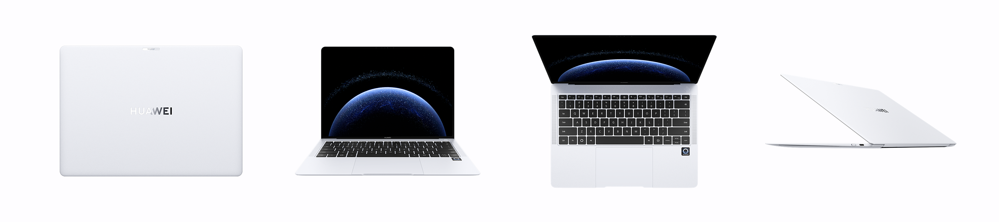
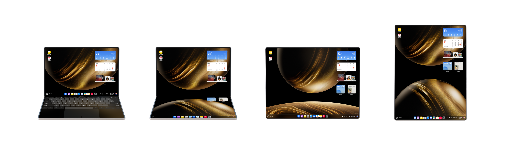
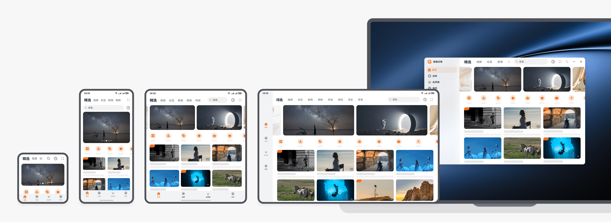

# 电脑应用开发

更新时间：2026-05-22 09:46:30

来源：https://developer.huawei.com/consumer/cn/doc/best-practices/bpta-pc-guide

#### 概述
电脑设备在日常生活中发挥重要作用，是HarmonyOS 1+8设备全场景一体化体验中不可或缺的部分。

#### 设备特点
电脑设备有以下明显特点：
- 电脑设备拥有高分辨率的大屏幕，且尺寸、比例的跨度较大，适合展示更多内容，提高学习、娱乐和办公效率。
- 电脑支持全屏、分屏、自由窗口显示应用。
- 电脑设备支持鼠标、触控板和键盘交互。

#### 电脑主要型号
HarmonyOS电脑当前主要型号包括MateBook Pro和MateBook Fold。下文将以MateBook Pro设备为例，介绍其相关信息，MateBook Fold的相关信息可参考[MateBook Fold折叠电脑](https://developer.huawei.com/consumer/cn/doc/best-practices/bpta-mate-book-fold)。






#### 硬件说明
本章将介绍电脑的屏幕尺寸以及相机硬件参数等信息。

#### 屏幕规格信息
下面以MateBook Pro设备为例，介绍其效果图、分辨率以及横纵断点，请参见下表所示的对应关系。

|  | MateBook Pro（笔记本形态） | 外接显示器 |
| --- | --- | --- |
| 效果图 |  |  |
| 屏幕ID | 0 | 主显示器：0 外接显示器：与连接的MateBook Pro端口有关 |
| 屏幕方向Orientation | 横屏LANDSCAPE | NA |
| 分辨率（px） | 3120*2080 | 主显示器：3120*2080 外接显示器：取决于外接显示器的分辨率 |
| 分辨率（vp）向下取整 | 1642*1094 | 主显示器：1642*1094 外接显示器：取决于外接显示器的分辨率 |
| 屏幕可用宽高（px） | 3120*1955 | 主显示器：3120*1955 外接显示器：取决于外接显示器的分辨率 |
| 屏幕可用宽高（vp）向下取整 | 1642*1028 | 主显示器：1642*1028 外接显示器：取决于外接显示器的分辨率 |
| 横纵断点 | 横向断点xl，纵向断点sm | 主显示器：横向断点xl，纵向断点sm 外接显示器：取决于外接显示器的分辨率 |

#### 其他硬件信息
电脑的相机预设了默认的[相机镜头安装角度](https://developer.huawei.com/consumer/cn/doc/harmonyos-guides/camera-rotation-term#相机镜头安装角度)。使用时，需考虑镜头角度与设备的旋转角度，具体定义可参考[预览旋转角度](https://developer.huawei.com/consumer/cn/doc/harmonyos-guides/camera-rotation-term#预览旋转角度)。当屏幕方向一致时，前置镜头安装角度与需设置的预览流旋转角度如下。当前电脑（以MateBook Pro设备为例）的摄像头不支持旋转。

| 屏幕旋转角度（rotation） | 0(0度) | 1(90度) | 2(180度) | 3(270度) |
| --- | --- | --- | --- | --- |
| 示意图 |  | NA | NA | NA |
| 前置相机镜头安装角度 | 270° | NA | NA | NA |
| 预览旋转角度 | 270°+0°=270° | NA | NA | NA |
| 后置相机镜头安装角度 | 无后置相机 |  |  |  |

#### 设备特有能力
**支持自由窗口****模式**
在电脑设备上，应用启动时默认应为自由窗口模式。
**支持创建悬浮窗类型的窗口**
悬浮窗在电脑上是一种特殊的应用窗口，悬浮窗窗口类型为WindowType.TYPE_FLOAT。
**支持外接设备**
在合适的场景下，电脑可以连接一些配件来提升交互的效率，带来更好的体验。例如键盘、鼠标、显示器等。鼠标和键盘的适配请参考[大屏应用交互体验标准](https://developer.huawei.com/consumer/cn/doc/design-guides/ux-guidelines-large-screen-0000001807707561#section65561444209)。

#### 体验标准
应用体验建议分为功能与兼容性、稳定性、性能、功耗、安全和UX六个部分，详细信息如下所示。

| 名称 | 简介 |
| --- | --- |
| 应用基础功能和兼容性体验建议 | 应用与OS兼容、应用与设备兼容、应用升级兼容、功能体验相关等 |
| 应用稳定性体验建议 | 长时间运行故障率（崩溃、冻屏等）、长时间运行内存资源异常 |
| 应用性能体验建议 | 时延、帧率流畅体验和内存占用、CPU占用、线程数等资源占用约束 |
| 应用功耗体验建议 | 后台任务使用、后台硬件器件资源/软件系统资源占用管控，分布式资源占用等 |
| 应用安全隐私体验建议 | 基础安全、恶意软件、应用安全、隐私合规等 |
| 应用UX体验建议 | 设计规范、设计约束的符合性，UX精致体验要求等 |

电脑设备主要在性能与UX上有着特殊的适配体验和建议，下文主要介绍电脑的UX体验标准。

#### UX体验标准
**体验设计标准**
电脑拥有独特的大尺寸屏幕优势，开发其应用时推荐使用[响应式布局](https://developer.huawei.com/consumer/cn/doc/best-practices/bpta-multi-device-responsive-layout)实时响应窗口尺寸变化，确保以最佳的布局来展示内容。电脑的UX设计标准及规范，请参考[电脑](https://developer.huawei.com/consumer/cn/doc/design-guides/2in1-0000001777531700)、[电脑应用 UX 体验标准](https://developer.huawei.com/consumer/cn/doc/design-guides/ux-guidelines-2in1-0000001777895636)。
电脑的主要体验标准如下：
- **使用系统控件：**利用系统提供的菜单、标题栏、弹出框等标准控件，在保证良好基础体验的同时，减少设计和开发的工作量。
- **使用合适的应用架构：**根据业务的特点采用合适的架构。例如，内容类应用通常采用侧边页签的应用架构，以达到快速在不同类别的内容间切换的作用；效率类应用通常采用二分栏以及三分栏的应用架构，以达到快速高效浏览的作用。
- **考虑更多内容合理布局：**考虑充分利用电脑屏幕大尺寸的优势，利用响应式布局实时响应尺寸变化，确保以最佳的布局来显示内容。关于应用布局的更多详细指导，请参阅[应用布局](https://developer.huawei.com/consumer/cn/doc/design-guides/app-design-0000002353509845#section195431623181117)。
- **考虑多任务交互：**利用大屏幕的优势来同时完成多种任务，并且结合窗口来聚焦当前任务，提高生产力效率。
- **支持更多交互方式：**在合适的场景下，电脑可以连接一些配件来提升交互的效率，带来更好的体验。例如键盘、鼠标。关于电脑支持的交互方式，请参阅[人机交互](https://developer.huawei.com/consumer/cn/doc/design-guides/hmi-overview-0000001795410269)。

> [!NOTE] 说明
> 不同尺寸屏幕下的页面布局应通过断点进行划分和设计实现。

**体验设计差异点**
电脑设备配有高分辨率的大屏幕，在开发应用时，建议采用[响应式布局](https://developer.huawei.com/consumer/cn/doc/best-practices/bpta-multi-device-responsive-layout)，以根据屏幕尺寸自动调整布局，实时响应窗口尺寸变化，确保内容以最优布局展示。响应式布局中最常用的特征是窗口宽度和窗口高宽比，可以将这些参数划分为不同的范围。应用需通过横纵断点来决定不同状态下的页面布局，关于断点的原理和使用示例，可参考[断点](https://developer.huawei.com/consumer/cn/doc/best-practices/bpta-multi-device-responsive-layout#section1532120147301)。
下面以一个长视频案例为例，展示电脑界面适配自由窗口时的响应式变化和自适应变化场景效果。


实际效果：
**应用设计最佳实践**
根据上述UX体验标准和设计差异点，各垂域应用可根据功能和场景特点进行电脑的UX设计；更多垂域设计信息和方案可参考[应用设计最佳实践](https://developer.huawei.com/consumer/cn/doc/design-guides/practices-overview-0000001746498066)、[多设备界面开发案例](https://developer.huawei.com/consumer/cn/doc/best-practices/bpta-multi-device-ui-development)。

#### 工程管理
#### 工程配置
在电脑设备上运行的应用，需要在module.json5配置文件的module字段中增加支持的deviceTypes字段，即需增设"2in1"。更多详情可参考[deviceTypes标签](https://developer.huawei.com/consumer/cn/doc/harmonyos-guides/module-configuration-file#devicetypes标签)。

#### 包管理策略
电脑设备上HAP包的管理策略建议根据场景差异灵活选择，在统一性与个性化之间取得平衡，兼顾开发效率与用户体验：
- 统一HAP多端部署：对于页面结构与交互逻辑高度相似的应用（如布局可通过响应式设计适配，核心功能一致），推荐使用同一HAP包，依托 HarmonyOS 的多设备自适应与响应式布局能力，实现跨端（如手机、平板、电脑）协同部署。此举有助于降低维护成本，提升发布与迭代效率。
- 独立HAP精准适配：电脑应用与平板的界面布局和交互功能差异较大时（如移动端为多元素交互界面，电脑则以图文展示为主，且功能范围不同），应创建独立HAP包，分别构建面向phone/tablet与电脑等设备的模块化组件，实现设备专属的UX设计、资源优化与体验定制。
更多详情可参见[分层架构设计](https://developer.huawei.com/consumer/cn/doc/best-practices/bpta-layered-architecture-design)的产品定制层相关内容。

#### 窗口适配
本章主要介绍电脑设备应用在窗口模式、窗口方向和窗口沉浸式适配上需要注意的内容。

> [!NOTE] 说明
> 本章所介绍的适配内容均面向应用的主窗口。

#### 适配窗口模式
电脑设备支持全屏、分屏、自由窗口三种应用窗口模式。各模式的详细信息见[窗口模式](https://developer.huawei.com/consumer/cn/doc/best-practices/bpta-multi-device-window-mode)。
**全屏**
电脑应用启动时默认为自由窗口模式，用户可以使用以下两种方式进入全屏模式：
- 在主窗口调用[maximize()](https://developer.huawei.com/consumer/cn/doc/harmonyos-references/arkts-apis-window-window#maximize12)接口，可实现窗口最大化功能并进入全屏模式。
- 在[module.json5配置文件](https://developer.huawei.com/consumer/cn/doc/harmonyos-guides/module-configuration-file)中的[abilities标签](https://developer.huawei.com/consumer/cn/doc/harmonyos-guides/module-configuration-file#abilities标签)下，取消supportWindowMode字段支持的floating，仅配置[fullscreen]或[fullscreen, split]进入全屏模式。具体适配请参考[设置应用启动时的窗口模式、大小与位置](https://developer.huawei.com/consumer/cn/doc/best-practices/bpta-multi-device-window-mode#section6205417153714)。
全屏窗口沉浸式适配信息请参考[窗口沉浸式](https://developer.huawei.com/consumer/cn/doc/best-practices/bpta-multi-device-window-immersive)。
**分屏**
电脑支持分屏窗口模式，一般用于两个应用长时间并行使用的场景，例如边看购物攻略边购物的场景；应用也可以主动实现应用内分屏。电脑默认支持左右分屏，分屏窗口参数如下，具体适配信息请参考[分屏窗口模式适配](https://developer.huawei.com/consumer/cn/doc/best-practices/bpta-multi-device-window-mode#section579413164399)。

| 设备 | 分屏方式 | 默认分屏比例 | 分屏窗口尺寸(px) | 分屏窗口尺寸(vp)向下取整 | 分屏窗口断点 |
| --- | --- | --- | --- | --- | --- |
| MateBook Pro | 左右分屏 | 1:1(默认) | 1549*1955 | 815*1028 | 横向断点md，纵向断点lg |


> [!NOTE] 说明
> 电脑设备默认分屏比例为1:1，滑动分屏条可自由调节分屏窗口的宽度。 分屏窗口最小宽度为320vp。

**自由窗口**
在电脑设备上，应用启动时默认应为自由窗口模式。自由窗口模式下应用可按需进行如下适配：
- 设置应用启动时的窗口模式大小与位置；
- 主动调节窗口大小；
- 设置窗口拖拽热区。
具体适配信息请参考[自由窗口模式适配](https://developer.huawei.com/consumer/cn/doc/best-practices/bpta-multi-device-window-mode#section151195853214)。

> [!NOTE] 说明
> 自由多窗下，允许用户在一块屏幕上同时显示多个应用窗口。此时的应用窗口为自由窗口。

#### 悬浮窗
悬浮窗口在电脑上是一种特殊的应用窗口，悬浮窗窗口类型为WindowType.TYPE_FLOAT，可以在已有的任务基础上，创建一个始终在前台显示的窗口，通常位于所有应用窗口之上。即使创建悬浮窗的任务退至后台，悬浮窗仍然可以在前台显示。开发者可以参考[设置悬浮窗](https://developer.huawei.com/consumer/cn/doc/harmonyos-guides/application-window-stage#设置全局悬浮窗受限开放)章节创建悬浮窗，并对悬浮窗进行属性设置等操作。
- 后台拉起悬浮窗 使用minimize()设置主窗口最小化后，延迟调用创建悬浮窗的接口，实现后台拉起悬浮窗的场景（此处为举例说明）。 async createFloatWindowBackground() {
  let context = this.getUIContext().getHostContext() as common.UIAbilityContext;
  try {
 window.getLastWindow(context, (err: BusinessError, topWindow) => {
 const errCode: number = err.code;
 if (errCode) {
 hilog.error(DOMAIN, TAG, '%{public}s',
 `Failed to obtain the top window. Cause code: ${err.code}, message: ${err.message}`);
 return;
 }
 topWindow.minimize().catch((err: BusinessError) => {
 hilog.error(DOMAIN, TAG, '%{public}s',
 `Failed to minimize the window. Code: ${err.code}, message: ${err.message}`);
 });
 hilog.info(DOMAIN, TAG, '%{public}s',
 `Succeeded in obtaining the top window. Window id: ${topWindow.getWindowProperties().id}`);
 setTimeout(() => {
 this.createFloatWindow();
 }, 5000);
 });
  } catch (err) {
 hilog.error(DOMAIN, TAG, '%{public}s',
 `Failed to obtain the top window. Cause code: ${err.code}, message: ${err.message}`);
  }
}

async createFloatWindow() {
  let context = this.getUIContext().getHostContext() as common.UIAbilityContext;
  let floatWindowName = 'floatWindow';
  let config: window.Configuration = {
 name: floatWindowName,
 windowType: window.WindowType.TYPE_FLOAT,
 ctx: context
  };
  try {
 let floatWindow: window.Window = await window.createWindow(config);
 let storage: LocalStorage = new LocalStorage();
 await floatWindow.moveWindowTo(250, 200);
 await floatWindow.resize(1800, 600);
 await floatWindow.setWindowCornerRadius(50);
 floatWindow.setWindowShadowRadius(50);
 await floatWindow.loadContent('pages/Index', storage);
 floatWindow.showWindow().catch((err: BusinessError) => {
 hilog.error(DOMAIN, TAG, '%{public}s', `Failed to show the window. Code: ${err.code}, message: ${err.message}`);
 });
 this.floatWindow = floatWindow;
 storage.setOrCreate('name', floatWindowName);
  } catch (err) {
 hilog.error(DOMAIN, TAG, '%{public}s',
 `Failed to create the window. Cause code: ${err.code}, message: ${err.message}`);
  }
}
- 移动悬浮窗 通过startMoving()接口实现拖拽移动悬浮窗的场景。 .onTouch((event: TouchEvent) => {
  if (event.type === TouchType.Down) {
 try {
 let windowClass: window.Window = window.findWindow('floatWindow');
 if (!windowClass) {
 hilog.error(DOMAIN, TAG, '%{public}s', 'Failed to find window.');
 return;
 }
 windowClass.startMoving().then(() => {
 hilog.info(DOMAIN, TAG, '%{public}s', 'Succeeded in starting moving window.')
 }).catch((err: BusinessError) => {
 hilog.error(DOMAIN, TAG, '%{public}s',
 `Failed to start moving. Cause code: ${err.code}, message: ${err.message}`);
 });
 } catch (err) {
 hilog.error(DOMAIN, TAG, '%{public}s',
 `Failed to start moving window. Cause code: ${err.code}, message: ${err.message}`);
 }
  }
})
- 在悬浮窗中拉起主窗 使用startAbility()指定want内容，拉起主窗。

#### 适配窗口显示方向
电脑上的窗口显示方向[Orientation](https://developer.huawei.com/consumer/cn/doc/harmonyos-references/arkts-apis-window-e#orientation9)效果始终跟随屏幕显示方向[Orientation](https://developer.huawei.com/consumer/cn/doc/harmonyos-references/js-apis-display#orientation10)的效果，屏幕显示方向由具体产品定义（MateBook Pro只支持横屏，MateBook Fold支持三个方向），具体信息可参考[硬件说明](#section127915358619)。

> [!NOTE] 说明
> 由于window.setPreferredOrientation()设置窗口方向无效，不建议使用window.setPreferredOrientation()设置电脑的窗口方向，也不建议使用getPreferredOrientation()获取窗口的显示方向。

#### 适配窗口沉浸式
不同设备的沉浸式策略，推荐通过窗口模式或方向进行区分，而非依赖设备类型判断。可通过动态识别当前窗口模式（如全屏、分屏、自由窗口等）和方向，针对不同窗口形态实施定制化的沉浸式策略。适配窗口沉浸式请参考[窗口沉浸式](https://developer.huawei.com/consumer/cn/doc/best-practices/bpta-multi-device-window-immersive)。
**建议适配不同窗口模式的沉浸式**
电脑设备支持的三种窗口模式：全屏、分屏、自由悬浮窗口（其中自由悬浮窗口分为自由窗口和悬浮窗）。应用可根据支持的窗口模式进行沉浸式适配，详情可参考[窗口沉浸式](https://developer.huawei.com/consumer/cn/doc/best-practices/bpta-multi-device-window-immersive)。
**建议适配不同窗口方向的沉浸式**
电脑设备MateBookPro仅支持竖屏方向，MateBookFold支持竖屏、横屏、反向横屏三个方向。不同窗口方向对应的避让区（如挖孔区）不同，在不同旋转状态下避让区会发生变化。窗口方向变化引起避让区变化的适配方案可参考[窗口沉浸式](https://developer.huawei.com/consumer/cn/doc/best-practices/bpta-multi-device-window-immersive)。

#### 界面开发
电脑的响应式布局。

#### 典型布局场景
电脑设备上常见的响应式布局方式包括重复布局、分栏布局、挪移布局和缩进布局。

| 响应式布局方式 | 典型布局场景 | 实现方案 | 效果图 |
| --- | --- | --- | --- |
| 重复布局 | 列表布局 | List组件+断点 |  |
| 瀑布流布局 | WaterFlow组件+断点 |  |  |
| 轮播布局 | Swiper组件+断点 |  |  |
| 网格布局 | Grid组件+断点 |  |  |
| 分栏布局 | 侧边栏 | SideBarContainer组件+断点 |  |
| 侧边分级导航栏 | SideBarContainer组件+断点 |  |  |
| 三分栏 | SideBarContainer组件+Navigation组件+断点 |  |  |
| 挪移布局 | 插图和文字组合布局 | GridRow/GridCol组件+断点+栅格 |  |
| 底部/侧边导航 | Tabs组件+断点 |  |  |
| 缩进布局 | 单列列表布局 | GridRow/GridCol组件+断点+栅格 |  |

上述典型布局场景的实现方式可参考[页面布局场景](https://developer.huawei.com/consumer/cn/doc/best-practices/bpta-multi-device-page-layout)。复杂的分栏布局，例如：在单栏和三栏布局之间切换时的路由跳转，可参考[分栏布局](https://developer.huawei.com/consumer/cn/doc/best-practices/bpta-multi-device-page-layout#section11897247142110)。

#### 适配深浅色模式
当前系统存在深浅色两种显示模式，为了给用户更好的使用体验，应用应适配深浅色模式，具体适配规范可参考[应用深浅色适配](https://developer.huawei.com/consumer/cn/doc/harmonyos-guides/ui-dark-light-color-adaptation)。

#### 交互适配
本章节介绍电脑上常用交互事件，并以电脑上视频类应用为案例，介绍手势/按键相关功能的开发指导。

#### 常用交互事件
电脑设备上的应用，需要考虑更多交互场景，鼠标、键盘和触控板的适配请参考[大屏应用交互体验标准](https://developer.huawei.com/consumer/cn/doc/design-guides/ux-guidelines-large-screen-0000001807707561#section65561444209)。
常见交互事件包含以下5个方面：
- 交互归一：在电脑设备上，应用应保证用户体验与其他设备上保持一致。开发方案请参考[交互归一事件适配](https://developer.huawei.com/consumer/cn/doc/best-practices/bpta-multi-interaction#section088812013815)。
- 鼠标悬浮效果：电脑设备上的应用支持交互的UI组件建议都要适配鼠标悬浮效果。开发方案请参考[交互归一事件适配](https://developer.huawei.com/consumer/cn/doc/best-practices/bpta-multi-interaction#section088812013815)的悬浮场景。
- 焦点导航：电脑设备自带键盘，应用应支持通过键盘实现焦点导航，指示用户当前焦点位置。开发方案请参考[焦点导航事件适配](https://developer.huawei.com/consumer/cn/doc/best-practices/bpta-multi-interaction#section168661941154220)。
- 键盘快捷键：应用需要支持响应常用快捷键，便于用户快速操作。开发方案请参考[基础输入事件](https://developer.huawei.com/consumer/cn/doc/best-practices/bpta-multi-interaction#section151791829184110)的按键事件适配。
- 拖拽：拖拽操作通过鼠标或触控实现跨应用数据交互，支持文字、图片、文件及图文混合内容的传输，可显著提升操作效率与用户体验。开发方案请参考[统一拖拽](https://developer.huawei.com/consumer/cn/doc/best-practices/bpta-unified-drag-and-drop)。

#### 功能开发
针对电脑设备无后置摄像头的硬件特性，应用需通过功能适配策略解决[拍照/录像](#section7919713141911)及[扫一扫](#section118098394242)场景的兼容性问题，对于[音频焦点](#section0638656152519)及[剪贴板](#section515211420267)场景也需优先处理音频焦点管理与剪贴板权限差异，以确保任务场景的稳定性。

#### 适配相机的旋转角度
当折叠电脑处于不同的设备状态时，屏幕的状态也会有所不同。在这种情况下，相机应用预览输出的原始图像需要旋转不同的角度，以确保图像在正确的方向上显示。（预览旋转角度= 镜头安装角度+屏幕显示补偿角度，屏幕显示补偿角度的值与屏幕旋转角度相同。若要自行获取镜头安装角度，可以参考：[getSupportedCameras()](https://developer.huawei.com/consumer/cn/doc/harmonyos-references/arkts-apis-camera-cameramanager#getsupportedcameras)）
在预览时，预览旋转角度与屏幕显示旋转角度（[Display](https://developer.huawei.com/consumer/cn/doc/harmonyos-references/js-apis-display#属性).rotation）相关。若要适配相机的旋转角度，则需要在session调用[commitConfig](https://developer.huawei.com/consumer/cn/doc/harmonyos-references/arkts-apis-camera-session#commitconfig11)完成配流后，配置输出流：
1. 通过[display.getDefaultDisplaySync()](https://developer.huawei.com/consumer/cn/doc/harmonyos-references/js-apis-display#displaygetdefaultdisplaysync9)接口获取[Display](https://developer.huawei.com/consumer/cn/doc/harmonyos-references/js-apis-display#属性)对象并读取其rotation属性值，获得显示设备的屏幕旋转角度。
2. 并根据[相机镜头安装角度](https://developer.huawei.com/consumer/cn/doc/harmonyos-guides/camera-rotation-term#相机镜头安装角度)+[屏幕旋转角度](https://developer.huawei.com/consumer/cn/doc/harmonyos-guides/camera-rotation-term#屏幕旋转角度)的值计算[预览旋转角度](https://developer.huawei.com/consumer/cn/doc/harmonyos-guides/camera-rotation-term#预览旋转角度)，可参考[其他硬件信息](#section6957183310132)查看对应预览旋转角度。
3. 再调用[setPreviewRotation()](https://developer.huawei.com/consumer/cn/doc/harmonyos-references/arkts-apis-camera-previewoutput#setpreviewrotation12)接口，设置图像的预览旋转角度。
具体开发指导可参考[适配相机旋转角度(ArkTS)](https://developer.huawei.com/consumer/cn/doc/harmonyos-guides/camera-rotation-angle-adaptation)。
**应用对接预览流二次处理场景下的问题**
若三方应用接口对接的是预览流二次处理，导致系统无法将镜头安装角度补充到预览旋转角度中，导致不能使用系统现有的能力，因此向应用提供两种方案：
- 若应用不需要非镜像成像，建议应用在预览流二次处理后，直接套用系统现有的角度计算方法，应用补偿相机镜头安装角度进行适配。
- 若应用需要非镜像成像，建议应用在预览流二次处理后，自行开发一套角度计算公式，应用自行适配。（非镜像成像场景下，自行适配的性能大大优于补偿相机镜头安装角度的方法）

#### 扫一扫
由于电脑设备无后置摄像头的硬件特性，前置摄像头不便进行扫一扫操作，因此电脑端的系统暂不支持扫码能力，具体限制场景可参考[统一扫码服务](https://developer.huawei.com/consumer/cn/doc/harmonyos-guides/scan-introduction)。
应用在电脑上调用扫码能力时，需先验证设备是否支持扫码功能后进行扫码操作，以确保应用不会闪退。可通过[canIUse()](https://developer.huawei.com/consumer/cn/doc/harmonyos-references/js-apis-syscap#caniuse)接口查询系统是否具备扫一扫的能力，若系统能力SystemCapability.Multimedia.Scan.ScanBarcode的验证结果为true表示系统具备扫码能力，false表示系统不具备扫码能力。

```ArkTS
Button('Scan Bar Code', { controlSize: ControlSize.SMALL })
  .width(448)
  .margin({
    right: 16,
    bottom: 16,
    left: 16
  })
  .onClick(() => {
    const isLocationAvailable = canIUse('SystemCapability.Multimedia.Scan.ScanBarcode');
    try {
      if (isLocationAvailable) {
        this.getUIContext().getPromptAction().showToast({ message: 'Scan bar code.' });
      } else {
        this.getUIContext().getPromptAction().showToast({ message: 'Scan bar code is not supported' });
      }
    } catch (err) {
      hilog.error(DOMAIN, TAG, '%{public}s',
        `showToast args error. Cause code: ${err.code}, message: ${err.message}`);
    }
  })
```


> [!NOTE] 说明
> 应用获取到当前设备不支持扫码能力后，需要进行如下的处理：  建议应用侧弹出与“当前设备暂不支持扫码”相同或类似的弹窗。 删除整个扫一扫的功能。

#### 音频焦点适配
电脑上前后台应用需从以下四个方面处理音频焦点问题：[音频焦点抢占流程](https://developer.huawei.com/consumer/cn/doc/best-practices/bpta-audio-focus-management#section1747213761316)，[音频流类型正确配置](https://developer.huawei.com/consumer/cn/doc/best-practices/bpta-audio-focus-management#section2888185819153)，[自定义焦点策略设置](https://developer.huawei.com/consumer/cn/doc/best-practices/bpta-audio-focus-management#section048671914296)，[焦点中断事件正确处理](https://developer.huawei.com/consumer/cn/doc/best-practices/bpta-audio-focus-management#section1664171514332)。
电脑设备场景下的管理机制与其他设备相通，主要区别在于系统默认策略不一样，开发者可参考[自定义焦点策略设置](https://developer.huawei.com/consumer/cn/doc/best-practices/bpta-audio-focus-management#section048671914296)查看电脑与其他设备间的差异。

#### 剪贴板适配
允许应用读取剪贴板的权限[ohos.permission.READ_PASTEBOARD](https://developer.huawei.com/consumer/cn/doc/harmonyos-guides/restricted-permissions#ohospermissionread_pasteboard)受限使用，电脑设备均可申请，但其他设备只有在银行卡号复制、口令复制、输入法和文档编辑类应用场景可申请该权限，其余场景需[使用粘贴控件](https://developer.huawei.com/consumer/cn/doc/harmonyos-guides/pastebutton)读取剪贴板数据。剪贴板的具体开发指导可参考[剪贴板服务](https://developer.huawei.com/consumer/cn/doc/harmonyos-guides/pasteboard)，具体开发实例可参考[跨设备剪贴板](https://developer.huawei.com/consumer/cn/doc/best-practices/bpta-distributed-pasteboard)。

#### 性能优化
电脑应用的性能优化直接影响用户体验、运行效率和硬件资源利用率。HarmonyOS为开发者提供[DevEco Profiler](https://developer.huawei.com/consumer/cn/doc/best-practices/bpta-optimization-overview#section2012922312284)工具，支持全维度性能监控（CPU/GPU/内存/帧率/能耗/网络等），以及代码级定位分析，协助开发者快速发现并优化性能瓶颈。性能工具使用指导可参考[性能优化概述](https://developer.huawei.com/consumer/cn/doc/harmonyos-guides/ide-insight-description)，性能场景优化案例可参考[性能场景优化案例](https://developer.huawei.com/consumer/cn/doc/best-practices/bpta-scenario-performance-optimization)。
对于电脑中的关键线程，可以通过提升任务调度优先级，确保其获得足够的连续执行时间和资源，从而保障应用流畅运行，优化用户体验。详情可参考[高负载场景线程优先级设置](https://developer.huawei.com/consumer/cn/doc/best-practices/bpta-thread-priority-setting)。

#### 兼容模式
- **兼容运行** 兼容运行是HarmonyOS为开发者提供的在电脑设备上直接运行手机/Pad应用的方式。 兼容运行在电脑设备的窗口模式 手机/Pad应用兼容运行在电脑设备上，窗口默认体验：  如果应用支持横屏，应用以横屏窗口固定大小显示（窗口高度为屏幕高度的2/3，宽度比高度为1:1）。 如果是应用仅支持竖屏，以竖屏窗口固定大小显示（窗口高度为屏幕高度的2/3，宽度比高度为9:18）。 兼容应用不支持进入最大化。 窗口模式的白名单策略 操作系统中预置了白名单功能，通过该白名单控制应用的默认显示比例，其中包括18:9、1:1和全屏铺满。
- **兼容运行工程配置** 已经支持手机/Pad的应用，在电脑上兼容运行。在应用Entry Module的module.json5中去除对2in1设备的支持： "deviceTypes": [
 "default",
 "tablet",
 "2in1"(去除)
] Entry Module所依赖的module同名配置文件也需要同步修改。
- **应用兼容性调试** 开发者在生态初期采用兼容方式上架电脑，生态逐步成熟后，允许开发者持续在电脑设备上做横屏适配，因此系统提供一个设置选项，用于系统兼容策略。 电脑设备上清除系统窗口锁定的方法 在应用安装后，检查设置中的此应用的设置项（设置->显示和亮度->应用显示布局），将比例调整为原始比例可以退出兼容模式，以供开发者调试。
- **兼容运行上架配置** 电脑兼容运行方式如何上架 应用上架过程中，在基本信息中，勾选“兼容分发到PC/2in1的AppGallery”选项，参考下图红圈处： 若在支持设备处选择“PC/2in1”上架，则不会进入兼容运行模式，系统兼容能力将不会生效。
- **需要排查或简单适配内容** 兼容模式下应用运行和适配的原则 原则上，兼容应用仅需要对差异化部分做少量适配或不适配，是否需要适配，参考下方文档进行排查和处理。 相机显示问题 建议严格按规范适配，确保相机图像方向角度正常且不会出现内容挤压，参考：Camera Kit（相机服务）。 电脑设备硬件上无后置摄像头，所以拍照录像及扫一扫等场景需要适配，否则会出现功能不可用或者闪退等情况。 适配点  适配指导 扫一扫功能适配  方案一：电脑上直接屏蔽扫一扫功能。 方案二：默认使用前置摄像头扫码。 拍照录像默认使用前置摄像头  应用先调用getSupportedCameras获取系统可用相机列表，如果拿不到CameraPosition为CAMERA_POSITION_BACK的CameraDevice，就使用CAMERA_POSITION_FRONT的CameraDevice。 人脸识别  三方人脸识别KIT，在通过相机规范适配图像角度，保障画面正常后，按需进行算法训练。保障人脸识别的准确性。 接口行为差异 差异点  接口行为差异  影响场景 Display尺寸  兼容模式下，通过以下接口获取到的Display.width和Display.height、以及DPI，不是设备真实分辨率和DPI： 1）display.getAllDisplays() 2）display.getDisplayByIdSync() 3）display.getDefaultDisplaySync()  电脑自由多窗模式：自由窗口和最大化场景 方向请求  兼容模式下，应用通过window.setPreferredOrientation申请横/竖屏方向，会触发应用窗口在横屏全屏/竖屏居中之间切换，不会改变屏幕方向  电脑自由多窗模式：自由窗口和最大化场景 画中画  在API version 20之前，电脑设备不支持画中画功能。从API version 20起，电脑设备支持使用画中画功能。使用isPiPEnabled()接口可判断当前系统是否支持画中画功能。  在API version 20之前，移动应用在电脑上调用画中画接口不会崩溃，但是也无法回到画中画界面。 返回键差异 由于手机和电脑操作存在差异，部分页面无返回键，手机可通过屏幕边缘向内滑动进行返回，但电脑无此功能，因此电脑系统已在窗口界面上设置返回键，模拟手指从屏幕边缘向内滑动返回上一界面的行为。 电脑窗口的返回键效果图如下：  安全键盘的差异 电脑设备上默认带物理键盘，对于安全登录的场景，如果应用的实现是基于私有的安全键盘SDK，用户通过物理键盘输入时，可能会出现密码明文显示、无法输入、输入后无法提交等问题。  建议修改方案一： 密码输入框如果是使用ArkUI的TextInput等输入控件，请将InputType设置为Password，即设置为密码模式。参考链接：TextInput。 建议修改方案二： 对于使用私有安全键盘的应用，密码输入控件可以直接禁止物理键盘输入，即在控件中绑定onKeyPreIme()方法并返回true。参考链接：onKeyPreIme。  文件沙箱的差异 由于不同设备的文件访问权限存在差异，且移动应用可能通过主动分发或兼容模式运行于平板、电脑等多种终端，开发时需关注以下两点：  开发时应遵循应用沙箱目录开发规范，将文件存储于正确目录中。 开发时对敏感数据进行加密存储，保障应用安全与用户隐私，防范数据泄露。  PhotoPicker的差异 电脑设备和tablet设备均支持使用PhotoPicker组件访问图片/视频。 不同Picker访问范围： Picker  可访问范围 PhotoPicker（PhotoViewPicker）  访问媒体库内的图片/视频。 支持保存图片/视频到媒体库 FilePicker（DocumentViewPicker）  访问公共目录下的文件。 支持保存图片/视频/文件到公共目录 建议修改方案一： 应用没有访问/保存媒体库之外的文件需求，可保持继续使用PhotoPicker。 建议修改方案二： 应用需要访问/保存图片/视频/文件时，建议使用FilePicker。  查看文件： FilePicker可访问公共目录下的文件，同时支持访问媒体库（图库）中的图片和视频。 保存文件：当应用保存文件时使用FilePicker的save模式，文件由用户选择公共目录。 场景  建议方法  实现机制 应用内新建文本/文档，用户点击应用提供的保存按钮/选项  使用FilePicker由用户选择保存路径以及文件名。  创建文件选择器DocumentViewPicker实例。调用save()接口拉起FilePicker界面进行文件保存。 应用如果后续需要对该文件继续访问需调用文件持久化接口对授权文件进行持久化操作。 应用内打开文件进行查看/编辑操作，用户点击应用提供的打开文件按钮  使用FilePicker由用户选择需要打开的文件。  创建文件选择器DocumentViewPicker实例。调用select()接口拉起FilePicker应用界面进行文件选择。 系统在用户选择文件后，将该文件读写权限授予应用。 应用内打开预制3D目录下的文件（仅限电脑设备或tablet设备）  使用3D目录预授权，用户同意后，应用可访问对应文件夹下的文件  调用系统接口， 下载目录： "ohos.permission.READ_WRITE_DOWNLOAD_DIRECTORY" 文档目录： "ohos.permission.READ_WRITE_DOCUMENTS_DIRECTORY" 应用获取到文件/文件夹的URI，但是没有访问权限时，申请单文件/文件夹授权 文件夹授权仅限电脑设备或tablet设备  使用FilePicker授权模式，同时传递URI  创建文件选择器DocumentViewPicker实例。调用select()接口拉起FilePicker应用界面进行文件选择。携带参数authMode 与defaultFilePathUri。 此授权仍然为临时授权，需要应用申请文件/文件夹持久化。 应用选择指定目录保存文件  使用FilePicker由用户选择需要打开的文件。  创建文件选择器DocumentViewPicker实例。调用select()接口DocumentSelectMode传递参数为“FOLDER” 拉起FilePicker应用界面进行文件夹选择。 此授权仍然为临时授权，需要应用申请文件夹持久化。 使用KIT和传感器的排查 电脑的硬件规格和手机不同，如Modem、GPS、后置摄像头等，使得应用在电脑上使用部分KIT的情况对比手机会出现如下差异化：  不支持，可兼容运行：应用可通过canIUse()系统接口检测此KIT是否支持，以运行对应逻辑，或屏蔽相关功能。如果应用不做修改，为保证三方应用顺利运行不出错，此类KIT API可运行，但不会生效。 模拟支持(Sensor)：应用可枚举此类Sensor，API可正常调用，返回固定数据。 支持：通过WIFI定位，代替GPS定位，精度有损失。 KIT / Sensor  PC规格  修改建议 电话/短信  不支持，可兼容运行  接口可调用，但不执行。建议屏蔽相关功能入口。 陀螺仪/加速器  模拟支持  模拟设备静止。建议屏蔽相关功能入口。 Location Kit  支持，精度降低  支持WIFI定位，无特殊诉求，如导航，无需修改。 Scan Kit  不支持，可兼容运行  接口可调用，但不执行。建议屏蔽相关功能入口。 AR Engine  不支持，可兼容运行  接口可调用，但不执行。建议屏蔽相关功能入口。 XEngine Kit  不支持，可兼容运行  接口可调用，但不执行。建议屏蔽相关功能入口。 Device Security Kit  安全地理位置证明不支持，可兼容运行  接口可调用，但返回失败。建议屏蔽相关功能入口。 Account Kit  未成年人模式不支持，可兼容运行  接口可调用，但不执行。建议屏蔽相关功能入口。 Live View Kit  不支持，可兼容运行  接口可调用，但不执行。建议屏蔽相关功能入口。 Car Kit  不支持，可兼容运行  接口可调用，但不执行。建议屏蔽相关功能入口。 Graphics Accelerate Kit  不支持，可兼容运行  接口可调用，但不执行。建议屏蔽相关功能入口。 NFC  不支持，不兼容  不可调用，建议使用前先判断，不是所有设备支持NFC。 Camera  仅支持前置摄像头  建议屏蔽后置摄像头相关功能。优先使用前置摄像头。 Vision Kit  不支持，可兼容运行  接口可调用，但返回失败。建议屏蔽相关功能入口。

#### 典型业务案例
#### 长视频
在全屏播放视频时，长视频类应用通过横向大屏能有效提升用户的观看体验。详细开发方案可参考[多设备长视频界面](https://developer.huawei.com/consumer/cn/doc/best-practices/multi-video-app)。


更多垂域案例可参考[多设备界面开发案例](https://developer.huawei.com/consumer/cn/doc/best-practices/bpta-multi-device-ui-development)。

#### 常见问题
#### 如何区分MateBook Pro和MateBook Fold
- 页面布局类问题： 页面布局由窗口形态、宽度和高宽比属性决定，不应区分产品型号或设备类型。例如MateBook Fold的横向展开态布局应该和MateBook Pro布局保持一致，MateBook Fold的其他状态对应横向断点lg的页面布局，应与平板布局保持一致。所以，布局类问题只需判断断点，开发响应式布局即可。详情可参考断点的使用。
- 非页面布局或功能类问题： 由于MateBook Pro和MateBook Fold的设备类型deviceType均为2in1，因此，可以通过isFoldable()判断是否为可折叠设备，MateBook Fold返回为true，MateBook Pro返回为false。

#### 应用感知可用区域变化不及时
**问题现象**
应用未感知可用区域变化或者感知可用区域变化不及时，但调用moveTo()和resize()调整窗口大小或位置，导致窗口大小或位置异常。
**解决措施**
使用以下三种方法均可解决该问题：
- 使用[display.getDisplayByIdSync()](https://developer.huawei.com/consumer/cn/doc/harmonyos-references/js-apis-display#displaygetdisplaybyidsync12)根据displayId主动获取对应可用区域的[display](https://developer.huawei.com/consumer/cn/doc/harmonyos-references/js-apis-display#display)对象。
- 使用[display.getAvailableArea()](https://developer.huawei.com/consumer/cn/doc/harmonyos-references/js-apis-display#getavailablearea12)主动获取当前设备屏幕的可用区域。
- 使用[on('availableAreaChange')](https://developer.huawei.com/consumer/cn/doc/harmonyos-references/js-apis-display#onavailableareachange12)开启当前设备屏幕的可用区域监听。

#### 自由多窗在适配电脑设备时，如何实现窗口设置
**问题**现象
自由多窗在适配电脑设备时，存在以下问题：
- 窗口大小不合适；
- 窗口被拖动并缩放到过小尺寸时，可能出现页面布局异常；
- 窗口拖动场景实现场景不明确或实现困难。
**解决措施**
- 在适配电脑设备时，存在窗口大小不合适，需要主动设置窗口的尺寸的场景，开发者可参考[主动调节窗口大小](https://developer.huawei.com/consumer/cn/doc/best-practices/bpta-multi-device-window-mode#section323513274320)实现该场景。
- 在适配电脑设备时，当自由窗口被拖动并缩放到过小尺寸时，可能出现页面布局异常，开发者可参考[如何限制自由窗窗口尺寸](https://developer.huawei.com/consumer/cn/doc/best-practices/bpta-multi-device-window-mode#section6754152523715)，确保页面正常显示。
- 应用窗口拖动是在电脑设备上使用自由多窗时常见的操作，指鼠标点击或手指触控应用窗口在屏幕区域内拖动，应用窗口跟随鼠标或手指位置移动的场景。对于使用默认标题栏的窗口，系统提供了高性能的应用窗口拖动能力。而对于没有标题栏或需要自定义标题栏的窗口，需要开发者调用系统提供的拖动能力来实现。具体的实现可参考[如何设置窗口拖拽热区](https://developer.huawei.com/consumer/cn/doc/best-practices/bpta-multi-device-window-mode#section1758193815438)。

#### 窗口启动时应用闪跳
**可能原因**
在module.json5配置项metadata标签中设置的窗口位置大小，与窗口布局时使用[onWindowStageCreate()](https://developer.huawei.com/consumer/cn/doc/harmonyos-guides/uiability-lifecycle#onwindowstagecreate)设置的窗口位置大小不同。
**解决措施**
在module.json5配置项metadata标签与窗口布局处设置相同的窗口位置和大小。

```json
"abilities": [
  {
    "name": "EntryAbility",
    "srcEntry": "./ets/entryability/EntryAbility.ets",
    "supportWindowMode": [
      "fullscreen"
    ],
    "metadata": [
      {
        "name": "ohos.ability.window.height",
        "value": "600"
      },
      {
        "name": "ohos.ability.window.width",
        "value": "600"
      },
      {
        "name": "ohos.ability.window.left",
        "value": "left"
      },
      {
        "name": "ohos.ability.window.top",
        "value": "top"
      }
    ],
    // ...
  },
  // ...
],
```


```ArkTS
onWindowStageCreate(windowStage: window.WindowStage): void {
  // Main window is created, set main page for this ability
  hilog.info(DOMAIN, TAG, '%{public}s', 'Ability onWindowStageCreate');
  try {
    let mainWindow = windowStage.getMainWindowSync();
    let displayId = mainWindow.getWindowProperties().displayId;
    let displayClass = display.getDisplayByIdSync(displayId);
    displayClass.getAvailableArea().then(() => {
      mainWindow.resize(mainWindow.getUIContext().px2vp(600), mainWindow.getUIContext().px2vp(600))
        .catch((err: BusinessError) => {
          hilog.error(DOMAIN, TAG, '%{public}s',
            `Failed to change the window size. Code: ${err.code}, message: ${err.message}`);
        });
      mainWindow.moveWindowTo(0, 0).catch((err: BusinessError) => {
        hilog.error(DOMAIN, TAG, '%{public}s',
          `Failed to move the window. Code: ${err.code}, message: ${err.message}`);
      });
    }).catch((err: BusinessError) => {
      hilog.error(DOMAIN, TAG, '%{public}s',
        `Failed to get the available area in this display. Code: ${err.code}, message: ${err.message}`);
    })
  } catch (err) {
    hilog.error(DOMAIN, TAG, '%{public}s',
      `Failed to move the window. Cause code: ${err.code}, message: ${err.message}`);
  }
  windowStage.loadContent('pages/Index', (err) => {
    if (err.code) {
      hilog.error(DOMAIN, TAG, 'Failed to load the content. Cause: %{public}s', err);
      return;
    }
    hilog.info(DOMAIN, TAG, 'Succeeded in loading the content.');
  });
}
```

#### 相机预览画面旋转异常
**问题现象**
折叠电脑在屏幕旋转后，相机生成的预览画面出现异常。
**可能原因**
折叠电脑在屏幕旋转后，相机预览流未适配旋转后的预览角度，造成预览画面未更新。
**解决措施**
在session调用[commitConfig](https://developer.huawei.com/consumer/cn/doc/harmonyos-references/arkts-apis-camera-session#commitconfig11)完成配流后调用，通过[display.getDefaultDisplaySync()](https://developer.huawei.com/consumer/cn/doc/harmonyos-references/js-apis-display#displaygetdefaultdisplaysync9)获得显示设备的屏幕旋转角度displayRotation，并通过[setPreviewRotation()](https://developer.huawei.com/consumer/cn/doc/harmonyos-references/arkts-apis-camera-previewoutput#setpreviewrotation12)，设置图像的预览旋转角度。具体可参考[功能开发](#section8405105782317)章节。