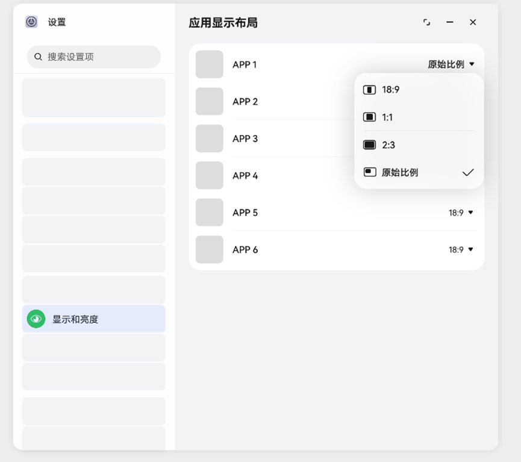
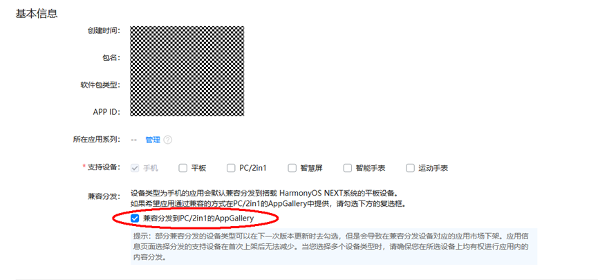
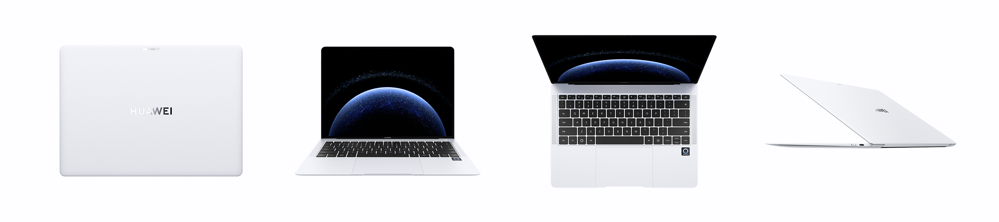
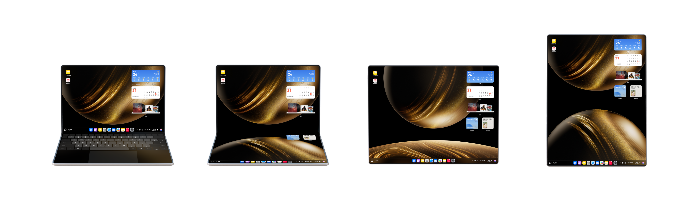

# 电脑应用开发

更新时间：2026-05-30 09:52:30

来源：https://developer.huawei.com/consumer/cn/doc/best-practices/bpta-pc-guide

#### 概述

电脑设备在日常生活中发挥重要作用，是HarmonyOS 1+8设备全场景一体化体验中不可或缺的部分。
 
 
电脑设备有以下明显特点：
 
- 电脑设备拥有高分辨率的大屏幕，且尺寸、比例的跨度较大，适合展示更多内容，提高学习、娱乐和办公效率。
- 电脑支持全屏、分屏、自由窗口显示应用。
- 电脑设备支持触控板、鼠标和键盘交互。

 
当前电脑产品主要为MateBook Pro系列。
  
| 产品名称 | 示意图 |
| --- | --- |
| MateBook Pro系列 |  |
 
 
> [!NOTE]
> 本文聚焦于电脑应用的体验提升开发指导。如需多设备开发的基础通用能力指导，请参考“ 一次开发，多端部署概览 ”系列文章。

 

#### 产品硬件信息

本章将介绍电脑的屏幕尺寸以及相机硬件参数等信息。
 
 

#### 屏幕规格信息

下面以MateBook Pro设备为例，介绍其效果图、分辨率以及横纵断点，请参见下表所示的对应关系。
  
|    | MateBook Pro（笔记本形态） | 外接显示器 |
| --- | --- | --- |
| 效果图 |  |  |
| --- | --- | --- |
| 屏幕ID | 0 | 主显示器：0 外接显示器：与连接的MateBook Pro端口有关 |
| --- | --- | --- |
| 屏幕方向(Orientation) | 横屏LANDSCAPE | NA |
| --- | --- | --- |
| 分辨率(px) | 3120*2080 | 主显示器：3120*2080 外接显示器：取决于外接显示器的分辨率 |
| --- | --- | --- |
| 分辨率(vp)(向下取整) | 1642*1094 | 主显示器：1642*1094 外接显示器：取决于外接显示器的分辨率 |
| --- | --- | --- |
| 屏幕可用宽高(px) | 3120*1955 | 主显示器：3120*1955 外接显示器：取决于外接显示器的分辨率 |
| --- | --- | --- |
| 屏幕可用宽高(vp)(向下取整) | 1642*1028 | 主显示器：1642*1028 外接显示器：取决于外接显示器的分辨率 |
| --- | --- | --- |
| 横纵断点 | 横向断点xl，纵向断点sm | 主显示器：横向断点xl，纵向断点sm 外接显示器：取决于外接显示器的分辨率 |
| --- | --- | --- |
 
 
 

#### 相机硬件信息

电脑的相机预设了默认的[相机镜头安装角度](https://developer.huawei.com/consumer/cn/doc/harmonyos-guides/camera-rotation-term#相机镜头安装角度)。使用时，需考虑镜头角度与设备的旋转角度，具体定义可参考[预览旋转角度](https://developer.huawei.com/consumer/cn/doc/harmonyos-guides/camera-rotation-term#预览旋转角度)。当屏幕方向一致时，前置镜头安装角度与需设置的预览流旋转角度如下。当前电脑（以MateBook Pro设备为例）的摄像头不支持旋转。
  
| 屏幕旋转角度（rotation） | 0(0度) | 1(90度) | 2(180度) | 3(270度) |
| --- | --- | --- | --- | --- |
| 示意图 |  | NA | NA | NA |
| --- | --- | --- | --- | --- |
| 前置相机镜头安装角度 | 270° | NA | NA | NA |
| --- | --- | --- | --- | --- |
| 预览旋转角度 | 270°+0°=270° | NA | NA | NA |
| --- | --- | --- | --- | --- |
| 后置相机镜头安装角度 | 无后置相机 |
| --- | --- |
 
 
 

#### 创新与体验提升

 

#### 性能优化

电脑应用的性能优化，直接关系到用户体验、运行效率和硬件资源利用率。HarmonyOS为开发者提供[DevEco Profiler](https://developer.huawei.com/consumer/cn/doc/best-practices/bpta-optimization-overview#section2012922312284)工具，可实现全维度性能监控（CPU/GPU/内存/帧率/能耗/网络等），并支持代码级问题定位分析，协助开发者快速发现并优化性能瓶颈。性能工具使用指导可参考[性能调优工具简介](https://developer.huawei.com/consumer/cn/doc/harmonyos-guides/ide-insight-description)，性能场景优化案例可参考[性能场景优化案例](https://developer.huawei.com/consumer/cn/doc/best-practices/bpta-scenario-performance-optimization)。
 
对于电脑中的关键线程，可以通过提升任务调度优先级，确保其获得充足的连续执行时长和资源，从而保障应用流畅运行，优化用户体验。详情可参考[高负载场景线程优先级设置](https://developer.huawei.com/consumer/cn/doc/best-practices/bpta-thread-priority-setting)。
 
 

#### 焦点导航

电脑设备自带键盘，应用应支持通过键盘实现焦点导航，并配置获焦视觉效果，清晰指示当前焦点位置，以保证交互体验。开发方案请参考[焦点事件](https://developer.huawei.com/consumer/cn/doc/best-practices/bpta-multi-interaction#section168661941154220)。
 
 

#### 音频焦点适配

电脑上前后台应用需从以下四个方面处理音频焦点问题：[音频焦点抢占流程](https://developer.huawei.com/consumer/cn/doc/best-practices/bpta-audio-focus-management#section1747213761316)，[音频流类型正确配置](https://developer.huawei.com/consumer/cn/doc/best-practices/bpta-audio-focus-management#section2888185819153)，[自定义焦点策略设置](https://developer.huawei.com/consumer/cn/doc/best-practices/bpta-audio-focus-management#section048671914296)，[焦点中断事件正确处理](https://developer.huawei.com/consumer/cn/doc/best-practices/bpta-audio-focus-management#section1664171514332)。
 
电脑设备场景下的管理机制与其他设备相通，主要区别在于系统默认策略不一样，开发者可参考[自定义焦点策略设置](https://developer.huawei.com/consumer/cn/doc/best-practices/bpta-audio-focus-management#section048671914296)查看电脑与其他设备间的差异。
 
 

#### 悬浮窗

悬浮窗口在电脑端是一种特殊的应用窗口，其窗口类型为WindowType.TYPE_FLOAT。开发者可在现有任务基础上创建悬浮窗，使其常驻前台、置于所有应用窗口顶层展示；即便创建悬浮窗的应用退至后台，悬浮窗仍可保持前台显示。开发者可参考[设置全局悬浮窗（受限开放）](https://developer.huawei.com/consumer/cn/doc/harmonyos-guides/application-window-stage#设置全局悬浮窗受限开放)相关章节，完成悬浮窗创建及属性配置等操作。
 
- 后台拉起悬浮窗使用[minimize()](https://developer.huawei.com/consumer/cn/doc/harmonyos-references/arkts-apis-window-window#minimize11)设置主窗口最小化后，延迟调用创建悬浮窗的接口，实现后台拉起悬浮窗的场景（此处为举例说明）。

  
```ArkTS
async createFloatWindowBackground() {
  let context = this.getUIContext().getHostContext() as common.UIAbilityContext;
  try {
    window.getLastWindow(context, (err: BusinessError, topWindow) => {
      const errCode: number = err.code;
      if (errCode) {
        hilog.error(DOMAIN, TAG, '%{public}s',
          `Failed to obtain the top window. Cause code: ${err.code}, message: ${err.message}`);
        return;
      }
      topWindow.minimize().catch((err: BusinessError) => {
        hilog.error(DOMAIN, TAG, '%{public}s',
          `Failed to minimize the window. Code: ${err.code}, message: ${err.message}`);
      });
      hilog.info(DOMAIN, TAG, '%{public}s',
        `Succeeded in obtaining the top window. Window id: ${topWindow.getWindowProperties().id}`);
      setTimeout(() => {
        this.createFloatWindow();
      }, 5000);
    });
  } catch (err) {
    hilog.error(DOMAIN, TAG, '%{public}s',
      `Failed to obtain the top window. Cause code: ${err.code}, message: ${err.message}`);
  }
}

async createFloatWindow() {
  let context = this.getUIContext().getHostContext() as common.UIAbilityContext;
  let floatWindowName = 'floatWindow';
  let config: window.Configuration = {
    name: floatWindowName,
    windowType: window.WindowType.TYPE_FLOAT,
    ctx: context
  };
  try {
    let floatWindow: window.Window = await window.createWindow(config);
    let storage: LocalStorage = new LocalStorage();
    await floatWindow.moveWindowTo(250, 200);
    await floatWindow.resize(1800, 600);
    await floatWindow.setWindowCornerRadius(50);
    floatWindow.setWindowShadowRadius(50);
    await floatWindow.loadContent('pages/Index', storage);
    floatWindow.showWindow().catch((err: BusinessError) => {
      hilog.error(DOMAIN, TAG, '%{public}s', `Failed to show the window. Code: ${err.code}, message: ${err.message}`);
    });
    this.floatWindow = floatWindow;
    storage.setOrCreate('name', floatWindowName);
  } catch (err) {
    hilog.error(DOMAIN, TAG, '%{public}s',
      `Failed to create the window. Cause code: ${err.code}, message: ${err.message}`);
  }
}
```

- 移动悬浮窗通过[startMoving()](https://developer.huawei.com/consumer/cn/doc/harmonyos-references/arkts-apis-window-window#startmoving14)接口实现拖拽移动悬浮窗的场景。

  
```ArkTS
.onTouch((event: TouchEvent) => {
  if (event.type === TouchType.Down) {
    try {
      let windowClass: window.Window = window.findWindow('floatWindow');
      if (!windowClass) {
        hilog.error(DOMAIN, TAG, '%{public}s', 'Failed to find window.');
        return;
      }
      windowClass.startMoving().then(() => {
        hilog.info(DOMAIN, TAG, '%{public}s', 'Succeeded in starting moving window.')
      }).catch((err: BusinessError) => {
        hilog.error(DOMAIN, TAG, '%{public}s',
          `Failed to start moving. Cause code: ${err.code}, message: ${err.message}`);
      });
    } catch (err) {
      hilog.error(DOMAIN, TAG, '%{public}s',
        `Failed to start moving window. Cause code: ${err.code}, message: ${err.message}`);
    }
  }
})
```

- 在悬浮窗中拉起主窗使用[startAbility()](https://developer.huawei.com/consumer/cn/doc/harmonyos-references/js-apis-inner-application-uiabilitycontext#startability-1)指定want内容，拉起主窗。

 
 

#### 兼容模式

本节介绍电脑端兼容模式的运行规则、上架配置、调试方式，以及相机、接口、文件访问、硬件能力等多方面的适配要点。
 
 

#### 兼容运行

兼容运行是HarmonyOS为开发者提供的在电脑设备上直接运行手机/平板应用的方式。
 
**兼容运行在电脑设备的窗口模式**
 
手机/平板应用以兼容模式在电脑端运行时，窗口默认显示规则如下：
 
- 若应用支持横屏，将以固定大小的横屏窗口展示（窗口高度为屏幕高度的2/3，宽度比高度为1:1）。


- 若应用仅支持竖屏，则以固定大小的竖屏窗口展示（窗口高度为屏幕高度的2/3，宽度比高度为9:18）。



 
> [!NOTE]
> 兼容应用不支持进入最大化。

 
**窗口模式的白名单策略**
 
操作系统中预置了白名单功能，用于管控应用默认显示比例，包括18:9、1:1和全屏铺满。
 
 

#### 兼容运行工程配置

已适配手机/平板的应用在电脑上兼容运行时，需在应用Entry Module的module.json5中移除对2in1设备的支持：
 
```text
"deviceTypes": [
    "default",
    "tablet",
    "2in1"(去除)
]
```
 
> [!NOTE]
> Entry Module所依赖的module同名配置文件也需要同步修改。

 
 

#### 应用兼容性测试

生态发展初期，开发者主要通过兼容模式上架电脑端应用；随着生态逐步成熟，为便于开发者持续在电脑设备上做横屏适配，系统提供了对应设置项用于管控兼容策略。
 
应用安装后，可进入设置->显示和亮度->应用显示布局，将应用显示比例调整为原始比例，即可退出兼容模式，方便开发者调试。
 



 
 

#### 兼容运行上架配置

应用上架时，在基本信息中勾选“兼容分发到PC/2in1的AppGallery”选项，参考下图红圈处：
 



 
> [!NOTE]
> 若在支持设备处选择“PC/2in1”上架，应用将不会进入兼容运行模式，系统兼容能力不会生效。

 
 

#### 需要排查或简单适配内容

原则上，兼容运行的应用仅需针对差异点做少量适配，或无需额外适配；具体适配要求可参考下文说明逐一排查处理。
 
- 相机显示问题建议严格按照规范完成相机适配，保证图像方向与角度正常，避免画面挤压。详情请参考：[Camera Kit（相机服务）](https://developer.huawei.com/consumer/cn/doc/harmonyos-guides/camera-kit)。

  电脑设备未配备后置摄像头，因此拍照、录像、扫一扫等场景需针对性适配，否则易出现功能异常或应用闪退问题。

| 适配点 | 适配指导 |

| --- | --- |

| 扫一扫功能 | 方案一：电脑上直接屏蔽扫一扫功能。 方案二：默认调用前置摄像头实现扫码功能。 |

| 拍照录像 | 默认使用前置摄像头：用先通过getSupportedCameras()获取系统可用相机列表，若未查询到后置摄像头（CameraPosition为CAMERA_POSITION_BACK的CameraDevice），则切换使用前置摄像头（CameraPosition为CAMERA_POSITION_FRONT的CameraDevice）。 |

| 人脸识别 | 使用第三方人脸识别KIT时，需先按相机规范适配图像角度以保证画面正常，再按需开展算法训练，提升人脸识别准确度。 |
- 接口行为差异

| 差异点 | 接口行为差异 | 影响场景 |

| --- | --- | --- |

| Display尺寸 | 兼容模式下，通过display.getAllDisplays()、display.getDisplayByIdSync()、display.getDefaultDisplaySync()获取到的Display.width、Display.height以及DPI，并非设备实际的分辨率和DPI。 | 电脑自由多窗模式：自由窗口和最大化场景。 |

| 方向请求 | 兼容模式下，应用通过window.setPreferredOrientation()切换横竖屏方向时，仅会使应用窗口在横屏全屏与竖屏居中两种形态间切换，不会改变设备实际屏幕方向。 | 电脑自由多窗模式：自由窗口和最大化场景。 |

| 画中画 | 在API version 20之前，电脑设备不支持画中画功能；从API version 20起，电脑设备支持使用画中画功能，可通过PiPWindow.isPiPEnabled()接口判断当前系统是否具备该能力。 | 在API version 20之前，移动应用在电脑上调用画中画接口不会崩溃，但是也无法回到画中画界面。 |
- 返回键差异由于手机与电脑操作方式存在差异，部分页面未提供返回按钮：手机端可通过屏幕边缘向内滑动返回上一页，电脑端无该手势操作。为此电脑系统在应用窗口界面增设返回键，模拟边缘侧滑返回的交互效果，效果如下图所示。

  


- 安全键盘的差异电脑设备自带物理键盘，在安全登录场景中，若应用基于私有安全键盘SDK开发，用户通过物理键盘输入密码时，可能出现密码明文显示、无法输入、输入后无法提交等问题。对于上述情况，建议采用如下方案进行优化。

  
方案一：如果密码输入框使用ArkUI的TextInput等输入控件，可将[InputType](https://developer.huawei.com/consumer/cn/doc/harmonyos-references/ts-basic-components-textinput#inputtype枚举说明)设置为Password，即密码输入模式。
- 方案二：使用私有安全键盘的应用，可在密码控件中绑定[onKeyPreIme()](https://developer.huawei.com/consumer/cn/doc/harmonyos-references/ts-universal-events-key#onkeypreime12)方法并返回true，直接拦截物理键盘输入。

 - 文件沙箱的差异不同设备的文件访问权限存在差异，且移动应用可通过主动分发或兼容模式在平板、电脑等多终端运行，开发时需重点关注以下两点：

  
遵循[应用沙箱目录](https://developer.huawei.com/consumer/cn/doc/harmonyos-guides/app-sandbox-directory)开发规范，将文件存储于正确目录中。
- 对敏感数据进行加密存储，保障应用安全与用户隐私，避免数据泄露。

 - PhotoPicker的差异电脑设备支持使用PhotoPicker组件访问图片/视频。不同Picker访问范围如下表所示。

| Picker | 可访问范围 |

| --- | --- |

| PhotoPicker(Class (PhotoViewPicker)) | 支持访问媒体库内的图片/视频；支持保存图片/视频到媒体库。 |

| FilePicker(DocumentViewPicker) | 支持访问公共目录下的文件；支持保存图片/视频/文件到公共目录。 |

  对于PhotoPicker体验差异，建议采用如下方案进行适配。

  应用对媒体库进行访问或保存操作时，可继续使用PhotoPicker；若应用需要访问或保存媒体库以外的文件，建议使用FilePicker。
查看文件：FilePicker支持访问公共目录文件及媒体库（图库）中的图片和视频。
- 保存文件：应用可通过FilePicker的save模式，由用户自主选择公共目录完成文件保存。

 
  
| 场景 | 建议方法 | 实现机制 |
| --- | --- | --- |
| 用户在应用内新建文本或文档后，点击应用提供的保存按钮/选项。 | 使用FilePicker由用户选择保存路径以及文件名。 | 创建DocumentViewPicker文件选择器实例，调用save()接口拉起FilePicker界面完成文件保存；若应用后续需再次访问该文件，应调用文件持久化接口对授权文件执行持久化操作。 |
| 户在应用内点击打开文件按钮，对文件进行查看或编辑操作。 | 使用FilePicker由用户选择需要打开的文件。 | 创建DocumentViewPicker文件选择器实例，调用select()接口拉起FilePicker界面供用户选择文件；用户选定文件后，系统将授予应用该文件的读写权限。 |
| 应用内打开预制3D目录下的文件（仅限平板和电脑）。 | 使用3D目录预授权，用户同意后，应用可访问对应文件夹下的文件。 | 调用相应系统接口：下载目录使用"ohos.permission.READ_WRITE_DOWNLOAD_DIRECTORY"；文档目录使用"ohos.permission.READ_WRITE_DOCUMENTS_DIRECTORY"。 |
| 当应用获取文件/文件夹的URI但无访问权限时，申请单文件/文件夹授权（文件夹授权仅限平板和电脑）。 | 使用FilePicker授权模式，同时传递URI。 | 创建DocumentViewPicker文件选择器实例，调用select()接口并传入authMode、defaultFilePathUri参数，拉起FilePicker界面完成文件选择；该授权为临时授权，应用需额外申请文件/文件夹持久化权限。 |
| 应用选择指定目录保存文件。 | 使用FilePicker由用户选择需要打开的文件。 | 创建DocumentViewPicker文件选择器实例，调用select()接口并将参数DocumentSelectMode设为FOLDER，拉起FilePicker界面选择文件夹；该授权为临时授权，应用需主动申请文件夹持久化权限。 |
 
 - 使用KIT和传感器的排查电脑硬件规格与手机存在差异（如Modem、GPS、后置摄像头等），导致应用在电脑端使用部分Kit能力时与手机端表现不同，具体分为三类情况：

  
不支持但可兼容运行：应用可通过[canIUse()](https://developer.huawei.com/consumer/cn/doc/harmonyos-references/js-apis-syscap#caniuse)接口检测对应Kit是否可用，按需执行逻辑或屏蔽功能；若未做适配，相关 API 可正常调用但不会实际生效，保障应用稳定运行。
- 模拟支持(Sensor)：应用可枚举此类Sensor，接口调用正常，返回固定数据。
- 有限支持：如导航定位，通过WIFI定位代替GPS定位，定位精度会有所损失。

  
| KIT/Sensor | 电脑规格 | 修改建议 |
| --- | --- | --- |
| 电话/短信 | 不支持，可兼容运行 | 接口可调用，但不执行。建议屏蔽相关功能入口。 |
| 陀螺仪/加速器 | 模拟支持 | 模拟设备静止。建议屏蔽相关功能入口。 |
| Location Kit | 有限支持，精度降低 | 支持WIFI定位，无特殊诉求则无需修改。 |
| Scan Kit | 不支持，可兼容运行 | 接口可调用，但不执行。建议屏蔽相关功能入口。 |
| AR Engine | 不支持，可兼容运行 | 接口可调用，但不执行。建议屏蔽相关功能入口。 |
| XEngine Kit | 不支持，可兼容运行 | 接口可调用，但不执行。建议屏蔽相关功能入口。 |
| Device Security Kit | 安全地理位置证明不支持，可兼容运行 | 接口可调用，但返回失败。建议屏蔽相关功能入口。 |
| Account Kit | 未成年人模式不支持，可兼容运行 | 接口可调用，但不执行。建议屏蔽相关功能入口。 |
| Live View Kit | 不支持，可兼容运行 | 接口可调用，但不执行。建议屏蔽相关功能入口。 |
| Car Kit | 不支持，可兼容运行 | 接口可调用，但不执行。建议屏蔽相关功能入口。 |
| Graphics Accelerate Kit | 不支持，可兼容运行 | 接口可调用，但不执行。建议屏蔽相关功能入口。 |
| NFC | 不支持，不兼容 | 不可调用，建议使用前先做设备能力判断，并非所有设备均支持NFC功能。 |
| Camera | 仅支持前置摄像头 | 建议屏蔽后置摄像头相关功能，优先使用前置摄像头。 |
| Vision Kit | 不支持，可兼容运行 | 接口可调用，但返回失败。建议屏蔽相关功能入口。 |
 
 
 
 

#### 设备常见适配问题

 

#### 设备类型区分

**如何区分MateBook Pro和MateBook Fold**
 
- 页面布局类问题：页面布局由窗口形态、窗口宽高、宽高比决定，无需区分具体产品型号或设备类型。例如：MateBook Fold横向展开态布局应与MateBook Pro保持一致；MateBook Fold其余状态对应lg横向断点，布局需与平板保持一致。因此布局适配只需判断断点、实现响应式布局即可，详情可参考[断点](https://developer.huawei.com/consumer/cn/doc/best-practices/bpta-multi-device-responsive-layout#section1532120147301)的使用。
- 非页面布局或功能类问题：MateBook Pro与 MateBook Fold的设备类型[deviceType](https://developer.huawei.com/consumer/cn/doc/harmonyos-references/js-apis-device-info#常量)均为2in1。因此，需要通过[display.isFoldable()](https://developer.huawei.com/consumer/cn/doc/harmonyos-references/js-apis-display#displayisfoldable10)判断是否为可折叠设备，MateBook Fold返回true，MateBook Pro返回false。

 
 

#### 包管理策略

电脑端HAP包的管理策略需结合使用场景灵活选择，在统一性与个性化之间实现平衡，兼顾开发效率与用户体验，具体方案如下：
 
- 统一HAP多端部署：针对页面结构、交互逻辑高度相似的应用（可通过响应式布局适配、核心功能一致），建议采用统一HAP包，依托HarmonyOS的多设备自适应与响应式布局能力，实现手机、平板、电脑等多端统一部署，有效降低维护成本，提升应用发布与迭代效率。
- 独立HAP精准适配：若电脑端与平板端应用在界面布局、交互功能上差异较大（例如移动端交互元素丰富，电脑端侧重图文展示，且功能范围不同），建议创建独立HAP包，分别构建适配手机/平板和电脑的模块化组件，实现设备专属的UX设计、资源优化与体验定制。

 
更多详情可参见[分层架构设计](https://developer.huawei.com/consumer/cn/doc/best-practices/bpta-layered-architecture-design)的产品定制层相关内容。
 
 

#### 窗口适配

**窗口变化时，应用对可用区域变化感知不及时**
 
问题描述：应用无法感知可用区域变化或感知存在延迟，直接调用[moveWindowTo()](https://developer.huawei.com/consumer/cn/doc/harmonyos-references/arkts-apis-window-window#movewindowto9)、[resize()](https://developer.huawei.com/consumer/cn/doc/harmonyos-references/arkts-apis-window-window#resize9)调整窗口大小或位置，导致窗口大小或位置异常。
 
解决措施：使用以下三种方法均可解决该问题。
 
- 调用[display.getDisplayByIdSync()](https://developer.huawei.com/consumer/cn/doc/harmonyos-references/js-apis-display#displaygetdisplaybyidsync12)，根据displayId主动获取对应可用区域的[display](https://developer.huawei.com/consumer/cn/doc/harmonyos-references/js-apis-display#display)对象。
- 调用[display.getAvailableArea()](https://developer.huawei.com/consumer/cn/doc/harmonyos-references/js-apis-display#getavailablearea12)，主动获取当前设备屏幕的可用区域。
- 注册[on('availableAreaChange')](https://developer.huawei.com/consumer/cn/doc/harmonyos-references/js-apis-display#onavailableareachange12)监听，实时监听设备屏幕可用区域的变化。

 
**自由多窗适配电脑设备窗口异常问题**
 
 
问题描述：自由多窗适配电脑设备时，可能出现以下问题：
 
- 窗口大小不合适；
- 窗口拖动至过小尺寸后，页面布局错乱；
- 窗口拖动场景逻辑不清晰，实现难度较高。

 
解决措施：
 
- 若窗口尺寸适配不合理，开发者可主动配置窗口大小，具体可参考[主动调节窗口大小](https://developer.huawei.com/consumer/cn/doc/best-practices/bpta-multi-device-window-mode#section323513274320)实现方案。

 
- 针对窗口被拖动缩至过小导致布局异常的问题，可参考[如何限制自由窗窗口尺寸](https://developer.huawei.com/consumer/cn/doc/best-practices/bpta-multi-device-window-mode#section6754152523715)，确保页面正常显示。

 
- 电脑端自由多窗支持鼠标点击或手指触控拖动窗口，默认标题栏的窗口由系统提供高性能拖动能力；无标题栏或自定义标题栏的窗口，需开发者调用系统拖动能力接口实现，具体可参考[如何设置窗口拖拽热区](https://developer.huawei.com/consumer/cn/doc/best-practices/bpta-multi-device-window-mode#section1758193815438)。

 
**窗口启动时应用闪跳**
 
可能原因：module.json5配置文件中metadata标签设置的窗口位置、大小，与[onWindowStageCreate()](https://developer.huawei.com/consumer/cn/doc/harmonyos-guides/uiability-lifecycle#onwindowstagecreate) 中布局设置的窗口参数不一致。
 
解决措施：保持module.json5的metadata配置与[onWindowStageCreate()](https://developer.huawei.com/consumer/cn/doc/harmonyos-guides/uiability-lifecycle#onwindowstagecreate) 中窗口位置、大小参数一致。
 
```ArkTS
"abilities": [
  {
    "name": "EntryAbility",
    "srcEntry": "./ets/entryability/EntryAbility.ets",
    "supportWindowMode": [
      "fullscreen"
    ],
    "metadata": [
      {
        "name": "ohos.ability.window.height",
        "value": "600"
      },
      {
        "name": "ohos.ability.window.width",
        "value": "600"
      },
      {
        "name": "ohos.ability.window.left",
        "value": "left"
      },
      {
        "name": "ohos.ability.window.top",
        "value": "top"
      }
    ],
    // ...
  },
  // ...
],
```
 
```ArkTS
onWindowStageCreate(windowStage: window.WindowStage): void {
  // Main window is created, set main page for this ability
  hilog.info(DOMAIN, TAG, '%{public}s', 'Ability onWindowStageCreate');
  try {
    let mainWindow = windowStage.getMainWindowSync();
    let displayId = mainWindow.getWindowProperties().displayId;
    let displayClass = display.getDisplayByIdSync(displayId);
    displayClass.getAvailableArea().then(() => {
      mainWindow.resize(mainWindow.getUIContext().px2vp(600), mainWindow.getUIContext().px2vp(600))
        .catch((err: BusinessError) => {
          hilog.error(DOMAIN, TAG, '%{public}s',
            `Failed to change the window size. Code: ${err.code}, message: ${err.message}`);
        });
      mainWindow.moveWindowTo(0, 0).catch((err: BusinessError) => {
        hilog.error(DOMAIN, TAG, '%{public}s',
          `Failed to move the window. Code: ${err.code}, message: ${err.message}`);
      });
    }).catch((err: BusinessError) => {
      hilog.error(DOMAIN, TAG, '%{public}s',
        `Failed to get the available area in this display. Code: ${err.code}, message: ${err.message}`);
    })
  } catch (err) {
    hilog.error(DOMAIN, TAG, '%{public}s',
      `Failed to move the window. Cause code: ${err.code}, message: ${err.message}`);
  }
  windowStage.loadContent('pages/Index', (err) => {
    if (err.code) {
      hilog.error(DOMAIN, TAG, 'Failed to load the content. Cause: %{public}s', err);
      return;
    }
    hilog.info(DOMAIN, TAG, 'Succeeded in loading the content.');
  });
}
```
