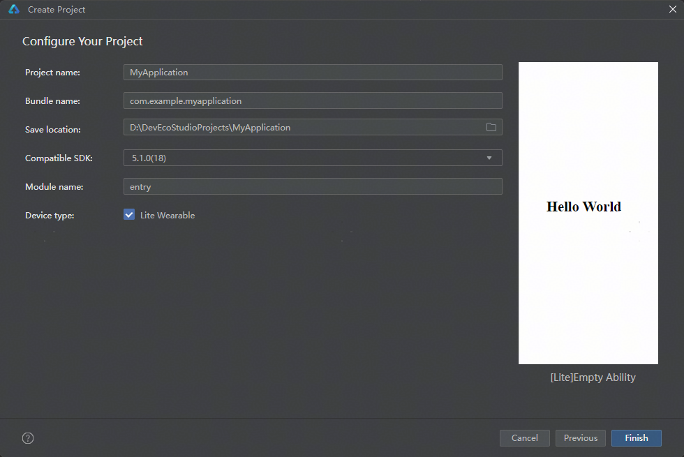
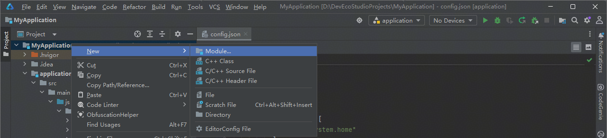
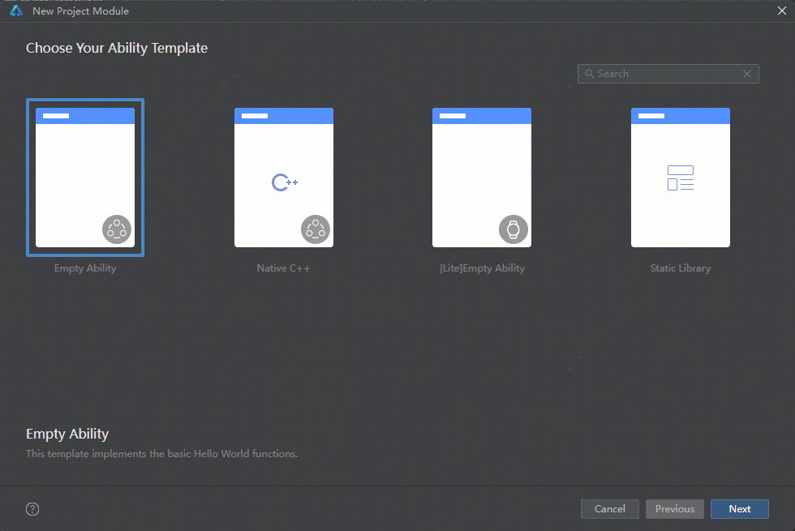

# 智能穿戴应用开发

更新时间：2026-06-23 06:26:30

来源：https://developer.huawei.com/consumer/cn/doc/best-practices/bpta-smartwatch

智能穿戴是一种腕部可穿戴设备，提供沟通功能和与移动设备的数据交互功能，包括成人智能表和儿童智能表。智能穿戴设备具有以下显著特点：
 
- 表盘屏幕尺寸较小，有圆形屏和方形屏两种屏幕形态。其中，圆形屏显示区域为圆形，方形屏显示区域为圆角矩形。
- 随腕携带，查看表盘屏幕更为便捷。
- 电池容量较小，一般小于1000mAh。
- 支持更为丰富的传感器。

 
目前， 智能穿戴设备主要有WATCH 5、WATCH Ultimate 2和超新星 X系列产品。
  
| 产品名称 | 示意图 |
| --- | --- |
| WATCH 5 |  |
| WATCH Ultimate 2 |  |
| 超新星 X系列 |  |
 
 
> [!WARNING]
> 本文聚焦于智能穿戴应用的体验提升开发指导。如需多设备开发的基础通用能力指导，请参考“ 一次开发，多端部署概览 ”系列文章。 儿童智能表应用在发布时，除通用智能穿戴应用要求外，还存在额外审核和材料要求，开发者在开发前需参考 儿童智能表发布注意事项 。

 

#### 产品硬件说明

 

#### 屏幕规格信息

智能穿戴设备屏幕不支持旋转，屏幕旋转角度为0°，屏幕方向为竖屏。下表以WATCH 5和超新星 X1 Pro产品为例，展示产品的屏幕规格信息。
  
| 产品名称 | 屏幕规格信息(宽*高) | 示意图 |
| --- | --- | --- |
| WATCH 5 | 分辨率(vp)(向下取整)：233*233 |  |
| WATCH 5 | 分辨率(px)：466*466 |  |
| 超新星 X1 Pro | 分辨率(vp)(向下取整)：240*204 |  |
| 超新星 X1 Pro | 分辨率(px)：480*408 |  |
 
 
> [!NOTE]
> 其他智能穿戴设备产品可通过 display 的 getDefaultDisplaySync() 方法获取设备屏幕分辨率(px)，通过 px2vp() 方法得到分辨率的vp值。

 
 

#### 相机硬件信息

部分智能穿戴设备（如儿童智能表超新星 X系列产品）配置前置和后置摄像头，在进行摄像头相关开发时需要关注镜头安装角度和预览流旋转角度。相关定义可参考[相机镜头安装角度](https://developer.huawei.com/consumer/cn/doc/harmonyos-guides/camera-rotation-term#相机镜头安装角度)和[预览旋转角度](https://developer.huawei.com/consumer/cn/doc/harmonyos-guides/camera-rotation-term#预览旋转角度)。镜头参数可参考下表。
  
| 屏幕旋转角度(rotation) | 0(0度) | 1(90度) | 2(180度) | 3(270度) |
| --- | --- | --- | --- | --- |
| 前置相机示意图 |  | 不支持 | 不支持 | 不支持 |
| --- | --- | --- | --- | --- |
| 前置相机镜头角度 | 0度 | 不支持 | 不支持 | 不支持 |
| --- | --- | --- | --- | --- |
| 前置相机拍摄预览流旋转角度 | 0度 | 不支持 | 不支持 | 不支持 |
| --- | --- | --- | --- | --- |
 
  
| 屏幕旋转角度(rotation) | 0(0度) | 1(90度) | 2(180度) | 3(270度) |
| --- | --- | --- | --- | --- |
| 后置相机示意图 |  | 不支持 | 不支持 | 不支持 |
| --- | --- | --- | --- | --- |
| 后置相机镜头角度 | 0度 | 不支持 | 不支持 | 不支持 |
| --- | --- | --- | --- | --- |
| 后置相机拍摄预览流旋转角度 | 0度 | 不支持 | 不支持 | 不支持 |
| --- | --- | --- | --- | --- |
 
 
 

#### 创新与体验提升

 

#### 旋转表冠交互

智能穿戴的表冠（上键）支持按压与旋转两种交互方式，其旋转操作可触发实时交互响应。系统通过[onDigitalCrown()](https://developer.huawei.com/consumer/cn/doc/harmonyos-references/ts-universal-events-crown#ondigitalcrown)回调函数处理表冠旋转事件，并已为常用组件内置了表冠交互支持。
 
主要特性：
 
- 事件响应：旋转操作实时触发onDigitalCrown回调。
```ArkTS
Text(this.count.toString())
  // ...
  .onDigitalCrown((event: CrownEvent) => {
    event.stopPropagation();
    this.count += event.degree;
  })
```

- 系统集成：滚动条等组件自动响应表冠旋转方向。

 
默认支持表冠交互的组件包括：
 
- 滑动选择类：Slider、Scroll、ArcSwiper、Refresh。
- 列表展示类：List、Grid、WaterFlow、ArcList。
- 时间日期类：DatePicker、TimePicker。
- 文本选择类：TextPicker。

 
开发者可通过开放接口自定义表冠事件处理逻辑，实现更丰富的交互体验。关于智能穿戴表冠旋转事件的开发，可以参考[表冠事件](https://developer.huawei.com/consumer/cn/doc/harmonyos-references/ts-universal-events-crown)。
 
> [!NOTE]
> 旋转表冠功能依赖设备的物理硬件支持。请确认当前设备是否搭载了旋转表冠硬件，若无旋转表冠硬件交互事件不会响应。 对于不支持旋转表冠的智能穿戴设备，不应将核心操作设计为依赖表冠旋转触发。相关场景建议改为触控点击、滑动或普通列表操作。

 
 

#### 智慧手势

智慧手势是智能穿戴设备除屏幕交互、表冠交互和按键交互外的独特感知交互方式。在情景障碍，需要单手处理的场景，用户可以使用敲击手指和滑动指关节实现控制和切换选择诉求。
 
> [!NOTE]
> 请确认当前设备是否支持智慧手势，可通过查看【设置】-【手势】是否有智慧手势识别选项。设备不支持智慧手势，交互事件不会响应。 使用智慧手势功能要确保设备上的智慧手势识别开关已打开。

 
**交互场景**
 
- 提醒场景，需及时处理的控制，如电话、闹钟等。
- 高频使用场景的便捷操控，如播控中心“下一首”。
- 不方便双手点击操作的场景，如遥控拍照。

 
**手势类型**
 
- 捏合确认：拇指和食指快速触碰两下，表示确认当前焦点的操作。常用于确认键、音乐暂停/播放等场景。

 
实现原理：系统识别手势后，会触发组件的[onKeyEvent](https://developer.huawei.com/consumer/cn/doc/harmonyos-references/ts-universal-events-key#onkeyevent)事件，KeyCode为KEYCODE_ENTER，type为KeyType.Down，应用可以在该条件触发后进行功能执行，如暂停音乐。
 
示例代码：
 
```ArkTS
.onKeyEvent((event: KeyEvent) => {
  if (event.keyCode === KeyCode.KEYCODE_ENTER && event.type === KeyType.Down) {
    // Trigger the pinching gesture
    this.oneButton1Color = '#ffe3ba51';
    this.oneButton1Text = 'Confirm';
  }
})
```
 



 
- 滑动切焦：切换当前焦点，以确认下一步操作，通过将拇指沿食指第二关节向指尖快速滑动两下切换焦点，后续再进行确认操作，可以用于切换到取消按钮，或切换到播放下一首按钮上，用于取消消息、切换歌曲等操作场景。

 
实现原理：系统识别手势后，会分别触发失焦组件和获焦组件的[onBlur](https://developer.huawei.com/consumer/cn/doc/harmonyos-references/ts-universal-focus-event#onblur)和[onFocus](https://developer.huawei.com/consumer/cn/doc/harmonyos-references/ts-universal-focus-event#onfocus)事件，应用可以在该条件触发后进行功能执行，如更改获焦组件的样式为高亮展示。
 
示例代码：
 
```ArkTS
.onFocus(() => {
  this.oneButton1Color = '#ff57c853';
  this.oneButton1Text = 'Hover';
  this.oneButton2Text = 'Two';
})
.onBlur(() => {
  this.oneButton1Color = '';
  this.oneButton1Text = 'One';
})
```
 



 
智慧手势交互的前提是组件获焦。首先使用[activate](https://developer.huawei.com/consumer/cn/doc/harmonyos-references/arkts-apis-uicontext-focuscontroller#activate14)激活当前界面的焦点激活态。
 
```ArkTS
this.getUIContext().getFocusController().activate(true, false);
```
 
激活焦点激活态后，可调用[requestFocus()](https://developer.huawei.com/consumer/cn/doc/harmonyos-references/arkts-apis-uicontext-focuscontroller#requestfocus12)方法使目标组件获得焦点，随后手势操作方可生效。示例代码如下，页面渲染后默认使得id为"btn1"的按钮获焦：
 
```ArkTS
// register a button to get focus by default.
this.getUIContext().getFocusController().requestFocus('btn1');
```
 
退出页面时，设置当前界面的焦点激活态为false，退出焦点激活态。
 
```ArkTS
aboutToDisappear(): void {
  this.getUIContext().getFocusController().activate(false);
}
```
 
 

#### 功耗管理优化

为提升智能穿戴设备续航能力并给用户带来更持久、更流畅的使用体验，可以采取以下措施：
 
- 显示优化配置1. 默认启用深色主题模式降低显示能耗。



2. 仅允许视频、游戏、导航等必要场景保持屏幕常亮。
- 后台应用管理1. 关键服务类应用（闹钟、日程提醒、邮件、IM类应用）可依据实际需求启动。

2. 除被前台应用拉起的情况外，闹钟、日程提醒、邮件、IM类应用按需自启，禁止非必要应用以任何形式自启动。
- 定位服务规范1. 后台GPS仅对导航、运动健康等核心功能开放。

2. 严禁非用户交互场景在后台调用定位服务。

 
若应用涉及导航、视频等需要保持应用常亮的场景，可以根据如下步骤实现：
 1. 设定应用屏幕常亮首先需要在EntryAbility通过[window.getLastWindow](https://developer.huawei.com/consumer/cn/doc/harmonyos-references/arkts-apis-window-f#windowgetlastwindow9)接口获取window实例。

  
```ArkTS
onWindowStageCreate(windowStage: window.WindowStage): void {
  let windowClass: window.Window | undefined = undefined;
  window.getLastWindow(this.context, (err: BusinessError, data: window.Window) => {
    const errCode: number = err.code;
    if (errCode) {
      hilog.error(0x0000, TAG, 'Failed to obtain the top window. Cause: ' + JSON.stringify(err));
      return;
    }
    windowClass = data;
    hilog.info(0x0000, TAG, 'Succeeded in obtaining the top window. Data: ' + JSON.stringify(data));
    AppStorage.setOrCreate('windowClass', windowClass);
  });
  // ...
}
```

2. 调用window的[setWindowKeepScreenOn()](https://developer.huawei.com/consumer/cn/doc/harmonyos-references/arkts-apis-window-window#setwindowkeepscreenon9)接口，设置isKeepScreenOn参数为true使屏幕常亮。

  
```ArkTS
// Window object obtained from EntryAbility, which is used to ensure that the screen is steady on during navigation.
@StorageLink('windowClass') windowClass: window.Window | undefined = undefined;
// ...

aboutToAppear(): void {
  // ...
  if (this.windowClass) {
    this.windowClass.setWindowKeepScreenOn(true, (err: BusinessError) => {
      const errCode: number = err.code;
      if (errCode) {
        hilog.error(0x0000, TAG,
          `Failed to set the screen to be always on. Cause code: ${err.code}, message: ${err.message}`);
        return;
      }
      hilog.info(0x0000, TAG, 'Succeeded in setting the screen to be always on.');
    });
  }
}
```

3. 若要关闭屏幕常亮，调用[setWindowKeepScreenOn()](https://developer.huawei.com/consumer/cn/doc/harmonyos-references/arkts-apis-window-window#setwindowkeepscreenon9)接口，设置isKeepScreenOn参数为false即可。
 
 

#### 跨设备互通

手机与智能穿戴设备的互联通信是智能穿戴设备的核心开发场景，开发者可通过[WearEngine](https://developer.huawei.com/consumer/cn/doc/harmonyos-references/wearengine_api)提供的标准化接口实现跨设备交互，具体开发流程如下：
 1. 通过wearEngine.getDeviceClient()获取Device模块的客户端用于获取连接设备。

  
```ArkTS
export class ConnectUtil {
  // Peer communication device entity class object
  device?: wearEngine.Device;
  // Unique ID of the peer communication device.
  deviceRandomId?: string;
  // Used to obtain linked devices
  deviceClient?: wearEngine.DeviceClient;
  // ...

  constructor(context: Context) {
    if (canIUse('SystemCapability.Health.WearEngine')) {
      this.deviceClient = wearEngine.getDeviceClient(context);
      // ...
    }
  }
  // ...
}
```

2. 通过Device客户端获取当前已连接且支持wearEngine能力集的设备。

  
```ArkTS
// Obtains the information about the peer device connected to the peer device
// and listens on the communication between the peer device and the peer device.
async getConnectedDevices(): Promise<void> {
  try {
    if (canIUse('SystemCapability.Health.WearEngine')) {
      let devices: wearEngine.Device[] = await this.deviceClient?.getConnectedDevices() as wearEngine.Device[];
      this.device = devices[0];
      this.deviceRandomId = devices[0].randomId;
    }
    await this.registerMessageReceiver();
  } catch (err) {
    hilog.error(0x0000, TAG, 'getConnectedDevices is err' + JSON.stringify(err));
  }
}
```

3. 通过获取P2P模块的客户端用于互联通信。

  
```ArkTS
export class ConnectUtil {
  // ...
  // Used to p2p
  p2pClient?: wearEngine.P2pClient;
  // ...

  constructor(context: Context) {
    if (canIUse('SystemCapability.Health.WearEngine')) {
      // ...
      this.p2pClient = wearEngine.getP2pClient(context);
    }
  }
  // ...
}
```

4. 订阅对端设备应用向本侧发送消息的事件。

  
```ArkTS
// Callback Method for Listening to Peer Communication.
private onMsgCallback: Callback<wearEngine.P2pMessage> = (data: wearEngine.P2pMessage): void => {
  // Decodes the intercepted content into a character string.
  let decoder: util.TextDecoder = util.TextDecoder.create();
  if (canIUse('SystemCapability.Health.WearEngine')) {
    let str: string = decoder.decodeToString(data.content);
    promptAction.openToast({
      message: 'message: ' + str,
      duration: 2000
    });
  }
}

// Listening to the communication between the peer end.
async registerMessageReceiver(): Promise<void> {
  try {
    if (canIUse('SystemCapability.Health.WearEngine')) {
      await this.p2pClient?.registerMessageReceiver(this.deviceRandomId, appParam, this.onMsgCallback);
      hilog.info(0x0000, TAG, 'registerMessageReceiver is ok');
    }
  } catch (err) {
    hilog.error(0x0000, TAG, 'registerMessageReceiver is err ', JSON.stringify(err));
  }
}

// Disabling the Interception of Peer Communication。
async unregisterMessageReceiver(): Promise<void> {
  try {
    if (canIUse('SystemCapability.Health.WearEngine')) {
      await this.p2pClient?.unregisterMessageReceiver(this.deviceRandomId, appParam, this.onMsgCallback);
      hilog.info(0x0000, TAG, 'unregisterMessageReceiver is ok');
    }
  } catch (err) {
    hilog.error(0x0000, TAG, 'unregisterMessageReceiver is err ', JSON.stringify(err));
  }
}
```

5. 向对端设备发送消息。

  
```ArkTS
// Method of sending messages to the peer end
async sendMessage(message: string): Promise<void> {
  try {
    let p2pMessage: wearEngine.P2pMessage = this.getP2pMessage(message);
    if (canIUse('SystemCapability.Health.WearEngine')) {
      let value = await this.p2pClient?.sendMessage(this.deviceRandomId, appParam, p2pMessage);
      hilog.info(0x0000, TAG, 'sendMessage value is' + JSON.stringify(value))
    }
  } catch (err) {
    hilog.error(0x0000, TAG, 'sys sendMessage is err ' + JSON.stringify(err));
  }
}
```

 
> [!NOTE]
> 鉴于部分智能穿戴设备可能不支持WearEngine能力，开发时务必充分考量设备差异。在调用相关接口前，请使用 canIUse 接口进行能力检测，以确保应用的稳定性，避免因兼容性问题引发崩溃。可参考 多设备应用开发 。 使用WearEngine实现互联通信功能需要获取WearEngine权限，具体可以参考 申请接入Wear Engine服务 。 手机端与智能穿戴端应用实现与对端互连通信的原理一致，详细开发方案可参考 实现手机手表互联通信与手表心率监听 。

 
 

#### 消息通知

智能穿戴设备的消息通知来源包括：
 
- 手机应用通知：应用通过华为运动健康授权消息通知权限后，配对手机的应用通知将同步至穿戴设备。
- 手机主动推送：手机应用使用WearEngine接口直接向穿戴设备发送消息通知。
- 穿戴设备本地通知：手表应用通过Notification Kit自主发送通知。

 
**手机应用通知**
 
在华为运动健康APP中，进入消息通知设置界面，为指定手机应用开启通知权限，即可将该应用的消息实时同步至已配对的华为智能穿戴设备。
 
**手机主动推送**
 
手机应用可以通过[WearEngine](https://developer.huawei.com/consumer/cn/doc/harmonyos-references/wearengine_api)的[notify()](https://developer.huawei.com/consumer/cn/doc/harmonyos-references/wearengine_api#notify)实现手机向智能穿戴设备主动推送消息通知，开发步骤如下：
 1. 通过[wearEngine.getNotifyClient()](https://developer.huawei.com/consumer/cn/doc/harmonyos-references/wearengine_api#wearenginegetnotifyclient)获取Notify客户端类。

  
```ArkTS
// Used to notify message
notifyClient: wearEngine.NotifyClient | undefined;
```
 使用当前组件所在Ability的Context，获取Notify模块的客户端。

  
```ArkTS
try {
  this.connectUtils.notifyClient = wearEngine.getNotifyClient(this.getUIContext().getHostContext());
} catch (err) {
  hilog.error(0x0000, TAG,
    `Failed to get notify client. Cause code: ${err.code}, message: ${err.message}`);
}
```

2. 通过NotifyClient.[notify()](https://developer.huawei.com/consumer/cn/doc/harmonyos-references/wearengine_api#notify)实现手机向智能穿戴设备发送模板化通知。

  
```ArkTS
/*
 * Method of notifying a message to watch.
 */
notifyMessage() {
  // Configure the notification content.
  // Including the package name of the notification source, notification title, and notification content.
  let type1Notification: wearEngine.Notification = {
    type: wearEngine.NotificationType.NOTIFICATION_WITHOUT_BUTTONS,
    bundleName: 'com.example.smartwatchmapnavigation',
    title: 'smartwatchmapnavigation',
    text: 'walk navigation start',
  }
  let options: wearEngine.NotificationOptions = {
    notification: type1Notification,
    onAction: (feedback: wearEngine.NotificationFeedback) => {
      hilog.info(0x000, TAG,
        `one button notify get feedback is ${feedback.action ? feedback.action : feedback.errorCode}`);
    }
  }

  // Sends a notification to the watch based on notifyClient.
  // This method can be invoked only by apps on mobile phones.
  this.notifyClient!.notify(this.deviceRandomId, options).then(result => {
    hilog.info(0x000, TAG, `Succeeded in sending notification.`);
  }).catch((error: BusinessError) => {
    hilog.error(0x000, TAG, `Failed to send notification. Code is ${error.code}, message is ${error.message}`);
  })
}
```

 
> [!NOTE]
> 使用WearEngine的NotifyClient. notify() 需要获取WearEngine权限，具体可以参考 申请接入Wear Engine服务 。

 
**智能穿戴设备本地通知**
 
智能穿戴设备应用可以通过[NotificationManager模块](https://developer.huawei.com/consumer/cn/doc/harmonyos-references/js-apis-notificationmanager)实现自主发送通知。
 1. 请求通知授权。

  可通过requestEnableNotification的错误码判断用户是否授权。若返回的错误码为1600004，即为拒绝授权。

  
```ArkTS
aboutToAppear() {
  let context = this.getUIContext().getHostContext() as common.UIAbilityContext;
  notificationManager.isNotificationEnabled().then((data: boolean) => {
    hilog.info(DOMAIN_NUMBER, TAG, "isNotificationEnabled success, data: " + JSON.stringify(data));
    if (!data) {
      notificationManager.requestEnableNotification(context).then(() => {
        hilog.info(DOMAIN_NUMBER, TAG, `[ANS] requestEnableNotification success`);
      }).catch((err: BusinessError) => {
        if (1600004 == err.code) {
          hilog.error(DOMAIN_NUMBER, TAG,
            `[ANS] requestEnableNotification refused, code is ${err.code}, message is ${err.message}`);
        } else {
          hilog.error(DOMAIN_NUMBER, TAG,
            `[ANS] requestEnableNotification failed, code is ${err.code}, message is ${err.message}`);
        }
      });
    }
  }).catch((err: BusinessError) => {
    hilog.error(DOMAIN_NUMBER, TAG, `isNotificationEnabled fail, code is ${err.code}, message is ${err.message}`);
  });
}
```

2. 构造NotificationRequest对象，并发布通知。

  
```ArkTS
Button('发送通知')
  .onClick(()=>{
    let notificationRequest: notificationManager.NotificationRequest = {
      id: 1,
      content: {
        // General text type notification.
        notificationContentType: notificationManager.ContentType.NOTIFICATION_CONTENT_BASIC_TEXT,
        normal: {
          title: 'test_title',
          text: 'test_text',
          additionalText: 'test_additionalText',
        }
      }
    };
    notificationManager.publish(notificationRequest, (err: BusinessError) => {
      if (err) {
        hilog.error(DOMAIN_NUMBER, TAG, `Failed to publish notification. Code is ${err.code}, message is ${err.message}`);
        return;
      }
      hilog.info(DOMAIN_NUMBER, TAG, 'Succeeded in publishing notification.');
    });
  })
```

 
> [!NOTE]
> 由于不同设备的能力支持度不同，在调用相关接口前，请使用 canIUse 接口进行能力检测，以确保应用的稳定性，避免因兼容性问题引发崩溃。可参考 多设备应用开发 。

 
 

#### 未成年人模式适配

智能穿戴设备中的儿童智能表应用面向儿童用户，启蒙教育、内容展示、社交互动、音视频、游戏等应用应重点评估未成年人保护要求。应用如需跟随系统未成年人模式调整内容展示、功能入口或使用时长，应适配未成年人模式能力。
 
未成年人模式相关能力可参考[Account Kit（华为账号服务）](https://developer.huawei.com/consumer/cn/doc/harmonyos-guides/account-kit-guide)中的[minorsProtection](https://developer.huawei.com/consumer/cn/doc/harmonyos-references/account-api-minorsprotection)能力。开发者应根据应用场景判断是否需要获取未成年人模式开启状态、年龄段信息，或引导用户开启未成年人模式。
 
 

#### 适配设备常见问题

 

#### 工程调试

**智能穿戴设备****上如何进行工程调试**
 
问题描述：拿到智能穿戴设备后，不知如何将应用部署到智能穿戴设备上调试应用功能。
 
解决方案：智能穿戴使用WIFI无线调试（支持自动签名），调试规范如下：
 1. 调试模式：智能穿戴设备推荐使用WiFi无线调试（支持自动签名）。无线调试内容可参考[使用无线连接方式](https://developer.huawei.com/consumer/cn/doc/harmonyos-guides/ide-run-device#section9315596477)。
2. 调试稳定性：设备熄屏后WiFi调试连接会断开，建议在系统设置中延长自动熄屏时间，确保调试过程稳定。
3. 设备授权：首次调试时，手表将弹出“信任设备”提示，需点击“信任”以允许IDE连接。
 
 

#### 工程配置

**智能穿戴设备****上如何进行工程配置**
 
问题描述：不知道智能穿戴设备需要完成哪些工程配置，成人智能表和儿童智能表的工程配置有哪些不同。
 
解决方案：开发在智能穿戴设备上的应用，需要在module.json5配置文件的module字段中，为deviceTypes字段设置wearable类型。更多详情可参考[deviceTypes标签](https://developer.huawei.com/consumer/cn/doc/lite-wearable-guides/module-structure#devicetype标签)。若当前已有适配轻量级智能表的工程，需要迁移适配成人智能表设备，可以参考[FA工程迁移](#section14111733132515)。
 
成人智能表应用完成以上配置即可，儿童智能表应用需要额外添加儿童智能表分发策略配置，DevEco Studio需更新至6.1.0 Release及以上，具体步骤如下：
 1. 在resources/base/profile目录下新增distributionFilter_config.json，配置方形屏和屏幕尺寸，文件内容如下：
```text
{
  <span style="color: rgb(255,0,0);">"distributionFilter"</span>: {
    <span style="color: rgb(255,0,0);">"screenShape"</span>: {
      <span style="color: rgb(255,0,0);">"policy"</span>: <span style="color: rgb(0,0,255);">"include"</span>,
      <span style="color: rgb(255,0,0);">"value"</span>: [
        <span style="color: rgb(0,0,255);">"rect"</span>
      ]
    },
    <span style="color: rgb(255,0,0);">"screenWindow"</span>: {
      <span style="color: rgb(255,0,0);">"policy"</span>: <span style="color: rgb(0,0,255);">"include"</span>,
      <span style="color: rgb(255,0,0);">"value"</span>: [
        <span style="color: rgb(0,0,255);">"480*408"</span>
      ]
    }
  }
}
```

2. 在module.json5中关联该分发策略文件，并声明儿童智能表设备特征。以下为配置片段，开发者需按实际工程结构合入module字段：
```text
{
  <span style="color: rgb(255,0,0);">"module"</span>: {
    <span style="color: rgb(255,0,0);">"deviceTypes"</span>: [
      <span style="color: rgb(0,0,255);">"wearable"</span>
    ],
    <span style="color: rgb(255,0,0);">"metadata"</span>: [
      {
        <span style="color: rgb(255,0,0);">"name"</span>: <span style="color: rgb(0,0,255);">"string"</span>,
        <span style="color: rgb(255,0,0);">"value"</span>: <span style="color: rgb(0,0,255);">"string"</span>,
        <span style="color: rgb(255,0,0);">"resource"</span>: <span style="color: rgb(0,0,255);">"$profile:distributionFilter_config"</span>
      }
    ],
    <span style="color: rgb(255,0,0);">"requiredDeviceFeatures"</span>: {
      <span style="color: rgb(255,0,0);">"wearable"</span>: [
        <span style="color: rgb(0,0,255);">"child"</span>
      ]
    }
  }
}
```

3. 儿童智能表应用项目的API版本不低于API 23，需要修改工程级build-profile.json5文件的相关字段：
```text
{
<span style="color: rgb(255,0,0);">  "targetSdkVersion"</span>: <span style="color: rgb(0,0,255);">"6.1.0(23)"</span>,
<span style="color: rgb(255,0,0);">  "compatibleSdkVersion"</span>: <span style="color: rgb(0,0,255);">"6.1.0(23)"</span>
}
```

 
 

#### 包管理策略

**采用“一次开发，多端部署”分层架构开发的应用工程，如何管理智能穿戴设备与其他设备上的应用HAP包**
 
问题描述：应用采用“一次开发，多端部署”将手机端、智能穿戴端的应用在一个工程中管理，不知该如何管理HAP包。
 
解决方案：由于应用在智能穿戴设备上的页面设计、功能形态会与其他设备有明显差异，因此推荐独立HAP精准适配的HAP包的管理策略：
 
- 独立HAP精准适配：智能穿戴设备与其他设备在页面设计、功能形态上存在显著差异，应创建独立HAP包，分别构建面向手机/平板与穿戴等设备的模块化组件，实现设备专属的UX设计、资源优化与体验定制。
- 对于儿童智能表场景，当前不支持同一个应用同时精准分发到成人智能表和儿童智能表，需要采用独立工程或独立包开发与发布。

 
更多详情可参见[分层架构设计](https://developer.huawei.com/consumer/cn/doc/best-practices/bpta-layered-architecture-design)的产品定制层相关内容。
 
 

#### 应用发布

**手表应用发布注意事项**
 
问题描述：手表应用在涉及到智能穿戴设备与轻量级智能穿戴设备时，应用发布的常见问题以及注意事项。
 1. 手表应用在发布时，仅可选择“手表”设备，无法对智能穿戴与轻量级智能穿戴做区分。


2. 应用涉及两种穿戴设备时，应用发布是否需要上传两个对应的发布包。
 
解决方案：
 1. 点击确认后跳转至发布页，可在发布页具体选择设备类型。


2. 智能穿戴支持ArkTS与JS，轻量级智能穿戴仅支持JS，若应用发布包支持在智能穿戴与轻量级智能穿戴上运行，则无需对应用发布包做区分，若应用发布包仅支持某一种穿戴设备，则需要分别为智能穿戴设备与轻量级智能穿戴设备创建AppID，并上传其对应的发布包。
3. APP创建流程可参考[创建HarmonyOS应用](https://developer.huawei.com/consumer/cn/doc/app/agc-help-create-app-0000002247955506)。
 
儿童智能表除上述流程外，还存在额外审核和材料要求，请参考[儿童智能表发布注意事项](#section46521457810)。
 
 

#### 功能开发

**应用在某智能穿戴设备上能够正常使用，安装到另一款设备产品上后应用崩溃闪退****/功能无响应**
 
问题描述：应用在某款智能穿戴设备上能够正常使用功能，在另一款智能穿戴设备上使用时应用崩溃闪退/功能无响应。
 
可能原因：不同智能穿戴设备的硬件配置与系统能力支持度存在差异。应用未针对这些设备差异进行充分的兼容性适配。
 
解决方案：
 1. 接口调用前进行能力检测：在调用相关接口前，请使用[canIUse](https://developer.huawei.com/consumer/cn/doc/harmonyos-references/js-apis-syscap#caniuse)接口进行能力检测，以确保应用的稳定性，可参考[多设备应用开发](https://developer.huawei.com/consumer/cn/doc/best-practices/bpta-multi-device-function#多设备应用开发)。
2. 硬件功能适配排查：若功能无响应，请排查该设备是否支持该功能（排查示例：若旋转表冠交互事件未响应，请先确认当前智能穿戴设备是否具备旋转表冠这一物理硬件条件）。
 
**迁移FA项目后，同步/异步接口无法正常调用或功能异常**
 
问题描述：迁移项目后，原项目中的同步/异步接口无法正常调用或功能异常。
 
解决方案：需要改写接口调用方式，以[huks.generateKeyItem()](https://developer.huawei.com/consumer/cn/doc/harmonyos-references/js-apis-huks#huksgeneratekeyitem9)接口为例，原项目中：
 
```text
huks.generateKeyItem(alias, options, callback);
```
 
迁移项目后，改写为：
 
```text
try {
  const data = await huks.generateKeyItem(alias, options);
  // Result of successful processing.
} catch (error) {
  // Capture and handle exceptions.
}
```
 
 
**迁移FA工程后，无法与手机侧通信**
 
问题描述：完成项目迁移后，原项目有与手机侧通信交互的功能，但是新项目该功能无法使用。
 
可能原因：应用使用指纹信息来验证进行应用间的通信，迁移后应查询新应用的APP ID并在配置文件中更改值。
 
解决方案：通过"hdc shell bm dump –n YourBundleName | grep appIdentifier"获取穿戴侧应用的APP ID，在两侧应用的配置文件中更改fingerprint。
 

#### 儿童智能表发布注意事项

儿童智能表应用在发布时存在额外审核和材料要求。
 
应用发布的通用配置和流程可参考[发布HarmonyOS应用](https://developer.huawei.com/consumer/cn/doc/app/agc-help-release-app-0000002271695230)。儿童智能表除遵循智能穿戴应用发布要求外，还需满足以下差异化要求：
 1. 开发前需完成儿童智能表应用上架准入申请。
2. 应用开发完成后，需按照儿童智能表上架标准完成自检。
3. 提交[《华为儿童智能表三方应用守则》](https://developer.huawei.com/consumer/cn/blog/topic/03212947909493241)的自检回执。
 
具体操作说明如下：
 1. 儿童智能表应用上架准许申请。儿童智能表开发前，发送邮件**【**华为儿童智能手表应用上架申请】到邮箱developer@huawei.com，邮件内提供如下信息，已与华为接口人取得联系的开发者，可将相关信息提交给接口人，由接口人配置应用白名单，接口人包括商业拓展（BD）和解决方案（SA）负责人：

| APP名称 | xxx |

| 包名 | xxx.xxx.xxx |

| APP版本号 | xxx |

| APP ID | xxx（APP ID的创建，可参考为HarmonyOS应用创建APP ID） |

| 分发的表侧 | 仅儿童智能表；成人智能表+儿童智能表 |

| APP名称是否与成人智能表相同 | 是/否（如果APP名称相同，则包名不能相同，包名需要核准，可参考HarmonyOS应用核准（备案）） |

| APP名称是否与手机、平板、电脑等其他品类相同 | 是/否（如果APP名称相同，则包名不能相同，包名需要核准，可参考HarmonyOS应用核准（备案）） |

| 开发者名称 | xxx |

| 其他说明（重要） | 含应用介绍、免费内容占比、应用功能说明（形式不限）等 |

  申请结果会在十个工作日内反馈。
2. 开发准备。准许通过后，请开发者参照[《华为儿童智能表三方应用守则》](https://developer.huawei.com/consumer/cn/blog/topic/03212947909493241)评估开发，并在开发完成后提供《华为儿童智能表三方应用守则》的自检回执到邮箱developer@huawei.com或对应的华为接口人。
3. 提交上架。儿童智能表应用开发完成后，提交应用时选择智能手表选项，儿童智能表应用在智能手表选项下。发布应用的通用配置和流程可参考[发布HarmonyOS应用](https://developer.huawei.com/consumer/cn/doc/app/agc-help-release-app-0000002271695230)。在提交时，忽略以下弹窗，点击确认或关闭按钮以继续下一步操作：

  


4. 选择应用分类标签。**应用分类**：根据应用特性选择相关分类（如音乐、休闲娱乐、儿童等），“应用/儿童”为非必选项。

  


  **应用标签**：至少选择一个标签作为应用主标签，同时可以再选择一个或多个其它标签作为补充（非必须）。根据应用特性选择标签，“儿童”为非必选项。

  


 
 

#### FA工程迁移

智能穿戴设备兼容FA模型，本章节提供了如何将使用JS构建的[轻量级智能穿戴](https://developer.huawei.com/consumer/cn/doc/best-practices/bpta-lite-wearable-guide)项目迁移到智能穿戴设备上继续使用，实现功能的延续与适配。
 
以[轻量级智能穿戴应用开发](https://gitcode.com/harmonyos_samples/BestPracticeSnippets/tree/master/LiteWearable)为例，按照如下步骤，可以将使用JS构建的项目迁移到智能穿戴设备上：
 1. 使用DevEco Studio创建项目。

  


  


  工程名目录右键选择“New”->“Module”创建模块。

  


  选择“Empty Ability”，点击“Next”进入下一步。

  


  默认配置无需修改，点击“Next”进入下一步。

  


  为了兼容智能穿戴，需要修改Ability name为“HiWearMainAbility”。点击“Finish”完成智能穿戴兼容模块创建。

  


  删除工程默认创建的entry模块，此时实现轻量级智能穿戴项目迁移的基础框架创建完成。

  


2. 将原轻量级智能穿戴项目/entry/src/main/js目录下的代码文件及资源文件按对应位置迁移至新工程。

  


3. 修改适配智能穿戴所需的配置文件。

  迁移的文件后需要修改config.json。修改资源文件的引用；pages目录下如果有新页面文件需添加至config.json；修改页面设计基线宽度为466。

  


  config.json文件中补充所需的权限。如果原项目中使用了震动功能，需添加震动权限。

  


4. 代码适配。由于轻量级智能穿戴和智能穿戴的同步/异步机制不同，因此在迁移时，需要对相关接口进行修改。以Huks接口为例，说明如何进行这些修改。

  
```text
huks.generateKeyItem(alias, options, callback);
```
 在轻量级智能穿戴设备上，回调将同步执行。但在智能穿戴设备上是异步的，因此需要更改书写样式增加await，保证代码同轻量级智能穿戴设备一样同步执行。

  
```text
try {
  const data = await huks.generateKeyItem(alias, options);
  // Result of successful processing.
} catch (error) {
  // Capture and handle exceptions.
}
```
