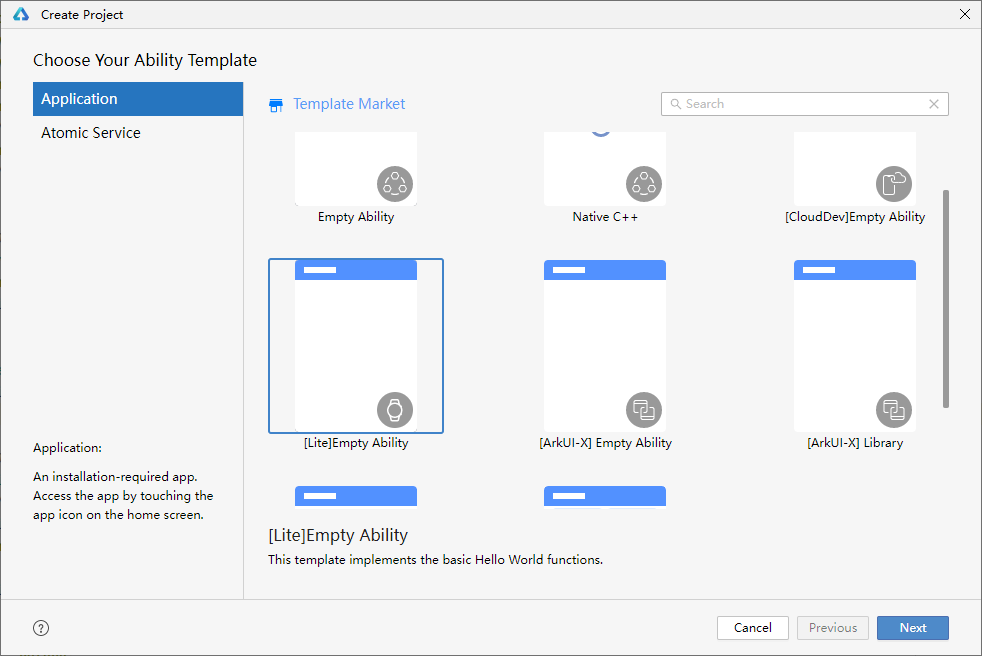
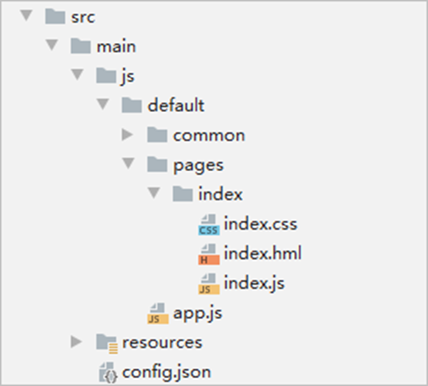
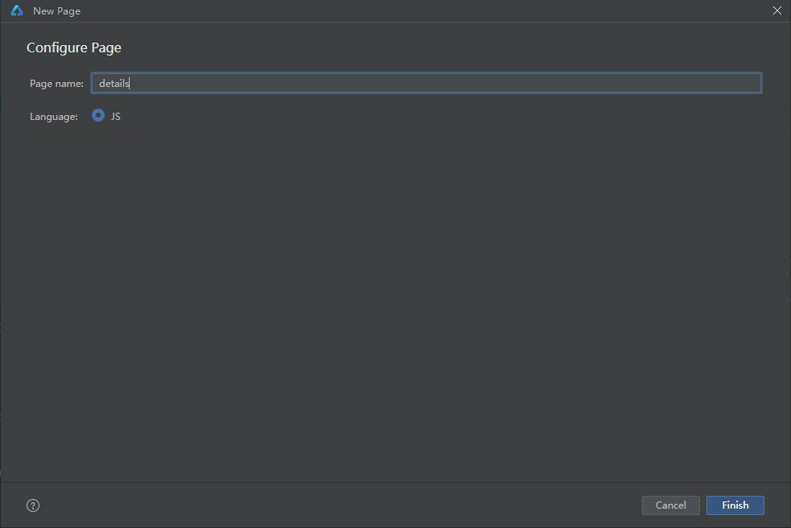
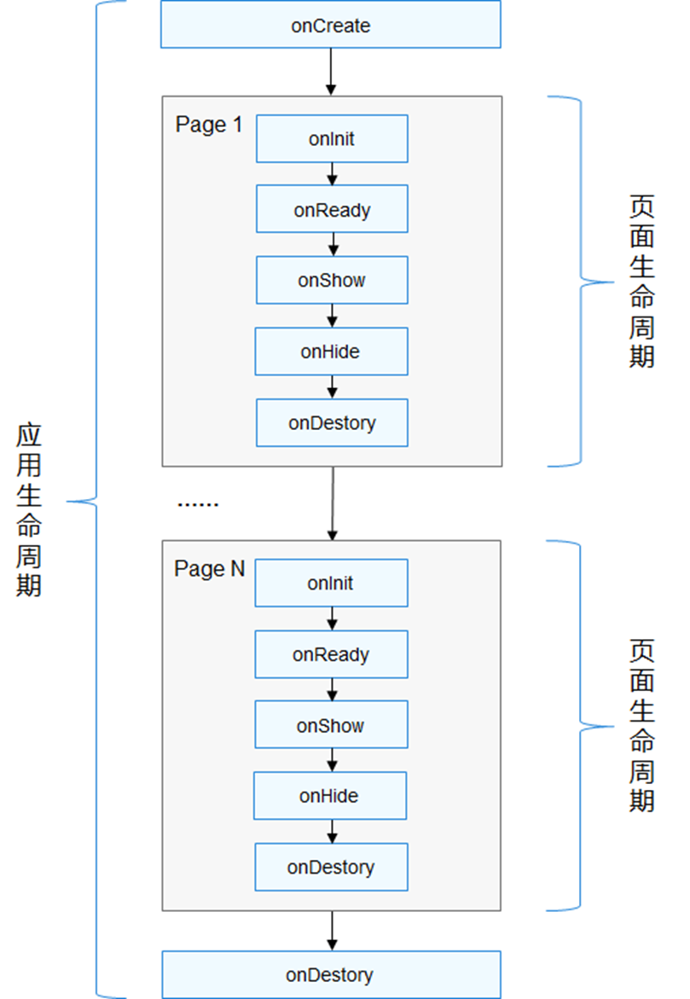
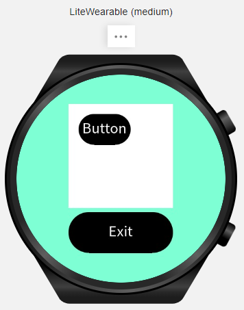
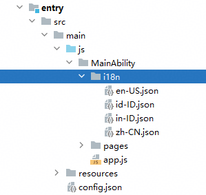

# 轻量级智能穿戴应用开发

更新时间：2026-03-26 08:46:30

来源：https://developer.huawei.com/consumer/cn/doc/best-practices/bpta-lite-wearable-guide

## 概述


对于轻量级智能穿戴（Lite Wearable），应用可以通过HarmonyOS提供的接口实现传感器、UI交互等常规业务的开发。开发者可以根据轻量级智能穿戴的特点，打造针对轻量级智能穿戴的独特应用。当前支持产品有：HUAWEI WATCH GT系列、Watch D系列、Fit系列、Watch Ultimate系列。

轻量级智能穿戴产品系列对应的分辨率和支持API如下表所示：


| 产品系列 | 分辨率（px） | 支持API |
| --- | --- | --- |
| WATCH GT 2 | 390*390 | 5 |
| WATCH GT 2 Pro | 454*454 | 6 |
| WATCH GT 3 | 466*466 | 6 |
| WATCH GT 4 | 466*466 | 10 |
| WATCH GT 5 | 466*466 | 12 |
| WATCH GT 6 | 466*466 | 20 |
| WATCH D | 280*456 | 6 |
| WATCH D2 | 408*480 | 12 |
| WATCH FIT 2 | 336*480 | 6 |
| WATCH FIT 3 | 408*480 | 10 |
| WATCH FIT 4 | 408*480 | 19 |


本章节后续部分将以创建“Hello World”的轻量级智能穿戴应用为例，逐步讲解如何在应用中构建布局、绘制样式、添加组件、绑定事件、实现页面路由跳转等。


> [!NOTE]
> 本文档适用于轻量级智能穿戴应用开发，针对智能穿戴应用请参考[智能穿戴](https://developer.huawei.com/consumer/cn/doc/best-practices/bpta-smartwatch)。


## 体验应用


### 搭建环境和创建项目


- 搭建环境：请参考[安装DevEco Studio](https://developer.huawei.com/consumer/cn/doc/harmonyos-guides/ide-software-install)，配置开发环境。
- 创建项目：请参考[创建一个新的工程](https://developer.huawei.com/consumer/cn/doc/harmonyos-guides/ide-create-new-project)，模板选择“[Lite]Empty Ability”，设备类型选择“Lite Wearable”。



### 工程目录介绍


HelloWorld工程目录如下图所示：





pages/index/index.hml：此文件定义了index页面的布局，在index页面中用到的组件，以及这些组件的层级关系。以下示例代码包含了一个text组件，内容为“Hello World”。

```text
<!-- Output the content of the text component. -->
<div class="container">
<text class="title">
Hello {{ title }}
</text>
</div>
```

pages/index/index.css：此文件定义了index页面的样式。以下示例代码定义了“container”和“title”的样式。

```text
.container {
display: flex;
justify-content: center;
align-items: center;
left: 0px;
top: 0px;
width: 466px;
height: 466px;
}
.title {
font-size: 30px;
text-align: center;
width: 200px;
height: 100px;
}
```

pages/index/index.js：此文件定义了index页面的业务逻辑，比如数据绑定，事件处理等。以下示例代码变量通过动态绑定的形式定义“title”字符串为“World”。

```ts
export default {
  data: {
    title: 'World',
  },
};
```

resources：此目录用于存放系统级资源配置文件，如应用图标等。

config.json：此文件是配置文件，主要定义了页面路由和应用信息，可根据DevEco Studio的工程和页面创建向导自动完成填充。

```ts
{
  "app": {
    "bundleName": "com.example.litewearable",
    "vendor": "example",
    "version": {
      "code": 1000000,
      "name": "1.0.0"
    }
  },
  "deviceConfig": {},
  "module": {
    "deviceType": [
    "liteWearable"
    ],
    "distro": {
      "deliveryWithInstall": true,
      "moduleName": "entry",
      "moduleType": "entry"
    },
    // ...
    "abilities": [
    {
      "name": ".MainAbility",
      "srcLanguage": "js",
      "srcPath": "MainAbility",
      "icon": "$media:icon",
      "description": "$string:MainAbility_desc",
      "label": "$string:MainAbility_label",
      "type": "page"
    }
    ],
    "js": [
    {
      "pages": [
      "pages/index/index",
      // ...
      ],
      "name": ".MainAbility"
    }
    ]
  }
}
```


### 运行应用


使用预览器查看效果，请参考查看ArkTS/JS预览效果。

在Lite Wearable中运行应用/服务，依赖HarmonyOS NEXT版本以前的华为手机上的运动健康和应用调测助手APP辅助进行。

前提条件

- 已将**运动健康APP**升级至最新版本。
- 从华为应用市场安装**应用调测助手APP**。
- 在Lite Wearable中运行应用/服务，需要根据[应用/元服务签名](https://developer.huawei.com/consumer/cn/doc/harmonyos-guides/ide-signing)，提前对应用/服务进行签名。

> [!NOTE]
> 因Lite Wearable设备无法与DevEco Studio进行连接，因此在对Lite Wearable应用/服务签名时，不能采用自动化签名方案，只能使用[手动签名](https://developer.huawei.com/consumer/cn/doc/harmonyos-guides/ide-signing#section297715173233)，然后再手动配置签名信息。


操作步骤

1. 使用USB连接线将手机和电脑进行连接，确保连接状态是正常的。
2. 手机与电脑使用USB连接时，在手机上选择**传输文件**连接方式。
3. 在工程目录中的**Build > outputs >hap**中选择生成的HAP，通过手工拷贝的方式将HAP拷贝至手机中的“/sdcard/haps/”目录。
4. 将Lite Wearable通过蓝牙与华为手机进行连接。进入**运动健康**APP，在设备页签中，单击**添加设备**按钮。
5. 进入**手表**列表中，选择对应的Lite Wearable型号。
6. 单击**开始配对**，按照界面指引完成Lite Wearable与华为手机之间的连接。

 打开应用调测助手APP，界面会显示已经与华为手机连接的Lite Wearable。

> [!NOTE]
> 如果Lite Wearable与华为手机未连接，请单击应用调测助手APP界面的连接设备按钮，手机会自动打开运动健康APP添加Lite Wearable。申请调试Profile时，需先注册设备，再选择调试设备。


 单击应用调测助手APP界面中的应用管理按钮，选择需要安装的HarmonyOS安装包进行安装。安装完成后，单击Lite Wearable中的应用图标，运行HarmonyOS应用。

## 构建布局


### 布局说明


本文以轻量级智能穿戴中的圆形表盘为例，把466px（px为逻辑像素，非物理像素）作为基准宽度。在构建页面布局时，需要对基本元素进行分析：

- 元素的尺寸和排列位置是否合理
- 是否有重叠的元素
- 是否需要设置对齐、内间距或者边界
- 是否包含子元素及其排列位置
- 是否需要容器组件

> [!NOTE]
> 将页面中的元素分解之后再逐个对基本元素进行自上而下的实现，可以减少多层嵌套造成的视觉混乱，尽可能的避免出现逻辑混乱，还可以提高代码的可读性，方便对页面做后续的调整和增改。


### 实现应用页面


应用页面由组件声明（.hml）、css样式（.css）和script脚本（.js）三部分构成。组件声明在“pages/index/index.hml”文件中实现，使用<text>组件显示文字，并用一个容器组件来包裹<text>组件，这里以<div>为例进行说明。示例代码如下：

```text
<!-- The "style" contains the style information of the component. -->
<!-- The detailed introduction about the style will be presented in the next subsection. -->
<div style="width: 466px; height: 466px;">
<text style="width: 200px; height: 100px;">
<!-- The content to be displayed in the <text> component. -->
Hello World
</text>
</div>
```

现在已经完成了一个简单应用开发的第一步，在后续章节中将继续介绍样式、事件的开发方法，不断优化和完善应用。


## 绘制样式


组件标签中类似“style="width:466px;height:466px;"”的语句即为样式设置语句，通过样式可以设置组件的显示大小、背景颜色、对齐方式等属性。本章节以<div>和<text>组件为例来介绍如何设置样式，样式主要有三种设置方式：行内样式、选择器样式和动态绑定样式，三种方式设置的样式效果一致。


### 行内样式


行内样式是将样式内容直接放到组件的style属性中，多个样式值则是通过分号间隔。以下示例代码通过行内样式对div和text组件设置了高度、宽度或其他属性。

```text
<!-- Set the child components within the div to be flexible layout and display them centered; -->
<!-- ensure that the text component is displayed in the middle of the screen. -->
<div style="width: 466px; height: 466px; display: flex; justify-content: center; align-items: center;">
<!-- Set the text component to display the text centered; -->
<!-- ensure that "Hello World" is displayed right in the middle of the screen. -->
<text style="width: 200px; height: 100px; font-size: 30px; text-align: center;">
Hello World
</text>
</div>
```


### 选择器样式


使用行内样式存在以下缺点：

- 针对每个组件都要设置样式。
- 如果多个组件需要设置相同的样式，则每个组件都写同样的样式，导致代码冗余；而且修改样式时，需要修改所有代码，工作量大。


针对以上问题，我们可以采用选择器样式，将所有的样式代码写到pages/index/index.css文件中，然后通过class、id等方式和组件关联起来。以上节中的代码为例，修改后的代码如下：

```text
/* index.css */
/* . For the class selector, all components with the class attribute set to "container" will apply this style. */
.container {
display: flex;
justify-content: center;
align-items: center;
width: 466px;
height: 466px;
} /* # For the ID selector, the component with the ID "title" will apply this style. */
#title {
font-size: 30px;
text-align: center;
width: 200px;
height: 100px;
}
```

```text
<!-- index.hml -->
<!-- Link the style code block of .container in index.css -->
<div class="container">
<!-- Link to the #title style code block in index.css -->
<text id="title">
Hello World
</text>
</div>
```


### 动态绑定样式


在行内样式和选择器样式中，样式设置方式是静态的，即代码开发中设置的样式在程序运行的时候不能更改，这种方式限制了程序的显示效果。如果要在程序运行过程中动态地改变样式，需要用到动态绑定样式。动态绑定就是值和变量动态关联，随着值的变更而显示不同的效果。动态绑定的使用方式为“{{变量名}}”，其中变量名是js文件中data对象的属性值。目前动态绑定样式只支持绑定行内样式。

以下示例代码中，text的字体大小和data中的fontSize属性绑定，字体颜色和data中的fontColor属性绑定：

```text
<!-- index.hml -->
<div class="container">
<text class="title" style="font-size: {{fontSize}}; color: {{fontColor}};">
Hello World
</text>
</div>
```

```ts
// index.js:
export default {
  data: {
    fontSize: '30px',
    fontColor: '#FF0000',
  },
};
```

现在已经完成了字体大小和颜色的样式绑定，下一节交互事件将介绍如何通过按钮的点击事件实现动态改变字体的样式。


## 交互事件


### 通用事件


每个组件都有一些通用事件和特有事件，开发者可在这些事件中实现应用的功能和逻辑。组件中添加事件的格式如下：

```text
<element onevent="eventAction">
```

常见的组件事件如下表所示：


| 事件 | 描述 |
| --- | --- |
| click | 组件被点击时触发，使用方法参见下面示例。 |
| longpress | 组件被长按时触发，使用方法与click相同。 |
| swipe | 组件上快速滑动时触发，使用方法参见应用退出章节。 |


以<input>组件的onclick事件为例，介绍事件的使用方法。首先，在index.hml文件中添加一个<input>组件，添加后的代码示例如下：

```text
<!-- index.hml -->
<div class="container">
<text class="title" style="font-size: {{fontSize}}; color: {{fontColor}};">
Hello World
</text>
<input type="button" value="Change" style="width: 200px; height: 50px;" onclick="clickAction"></input>
</div>
```

在以上代码中，页面里添加了一个<input>组件，包含了onclick事件及其处理函数。clickAction()是一个JavaScript函数，点击按钮改变字体的大小和颜色。它的实现在pages/index/index.js文件中，示例代码如下：

```text
// index.js:
export default {
data: {
fontSize: '30px',
fontColor: '#FF0000',
},
clickAction() {
this.fontSize = '38px';
this.fontColor = '#FFFFFF';
}
};
```


### 表冠事件


轻量级智能穿戴的表冠，旋转操作可触发实时交互响应。目前支持旋转表冠的组件有list，slider，swiper。

表冠事件的适配需要如下操作：

1. 页面启动时，在onShow()生命周期激活焦点。
2. 指定一个组件获焦（仅支持list，slider，swiper）。
3. 在需要页面切换时或不需要使用时释放焦点。


具体开发步骤可参考开发示例。


## 页面路由


应用通常由多个页面组成，需要页面路由来实现页面间的跳转。页面路由router根据uri的地址来找到目标页面，实现跳转。下面以两个简单页面之间的跳转为例说明页面跳转的操作，具体实现步骤如下：

1. 在“pages”目录右键，选择“New >  Page”，将“Page name”设置为“details”。如果使用其他方式添加页面，则在添加页面后需要修改配置文件config.json中的pages标签。

2. 在index.hml页面添加一个文本和一个按钮，文本通过用来指明当前页面，按钮绑定clickAction()方法，用来实现两个页面之间的相互跳转。
```text
<!-- index.hml -->
<div class="container">
<text class="title">
Hello World
</text>
<input class="btn" type="button" value="View" onclick="clickAction"></input>
</div>
```
3. 在details.hml页面添加一个文本和一个按钮，按钮绑定clickAction()方法。
```text
<!-- details.hml -->
<div class="container">
<text class="title">
Details Page
</text>
<input class="btn" type="button" value="Back" onclick="clickAction"></input>
</div>
```
4. 在index.js文件中实现clickAction()方法，调用router.replaceUrl()函数跳转到详情页。
```text
import router from '@ohos.router';

// index.js
export default {
clickAction() {
router.replaceUrl({
uri: 'pages/details/details'
});
}
};
```
5. 在details.js文件中实现clickAction()方法点击按钮调用router.replaceUrl()回到首页。
```text
import router from '@ohos.router';

// details.js
export default {
clickAction() {
router.replaceUrl({
uri: 'pages/index/index'
});
}
};
```
6. 使用Preview预览效果，详情请参考[查看ArkTS/JS预览效果](https://developer.huawei.com/consumer/cn/doc/harmonyos-guides/ide-previewer-arkts-js)。


## 应用退出


应用退出除使用物理按键触发外，还可以通过组件的事件触发。本章节以右滑表盘退出为例，讲解实现应用退出的方式。

1. 在index.hml页面的最外层父容器中绑定onswipe事件，当页面右滑的时候会触发onswipe事件绑定的函数。示例代码如下：
```text
<!-- index.hml: Binding swipe event to div element -->
<div class="container" onswipe="touchMove">
<text id="title">
Hello {{ title }}
</text>
<input type="button" value="View" style="width: 200px; height: 50px;" onclick="clickAction"></input>
</div>
```
2. 在index.js文件中实现touchMove()方法，调用app模块的terminate()方法实现应用退出。因为swipe是有方向属性的，在事件函数处理中要注意判断方向，否则任意方向的滑动都会触发退出应用操作，示例代码如下：
```ts
// index.js
import router from '@ohos.router';
// Import the app module.
import app from '@system.app';

export default {
  data: {
    title: 'World',
  },
  clickAction() {
    router.replaceUrl({
      uri: 'pages/details/details',
    });
  },
  touchMove(e) {
    // Handle swipe events.
    if (e.direction == 'right') {
      // Swipe right to exit.
      app.terminate();
    }
  },
};
```


## 应用与页面的生命周期


轻量级智能穿戴应用的生命周期主要有两个：应用创建时会触发app.js文件中的的onCreate()，应用销毁时触发onDestroy()。

一个应用中可能会有多个页面，每个页面都包括onInit()、onReady()、onShow()、onHide()和onDestroy()，在页面初始化、准备、显示、隐藏和销毁时触发调用的事件：

- onInit()：表示页面的数据已经准备好，可以使用js文件中的data数据。
- onReady()：表示页面已经编译完成，可以将界面显示给用户。
- onShow()：方舟开发框架只支持应用同时运行并展示一个页面，当打开一个页面时，上一个页面会被销毁。当一个页面显示的时候，会调用onShow。
- onHide()：页面消失时被调用。
- onDestroy()：页面销毁时被调用。





常用场景如下：

- 当应用从页面A跳转到页面B时，首先调用页面A的onDestroy()函数。页面A销毁后，依次调用页面B的onInit()、onReady()、onShow()函数来初始化和显示页面B。
- 应用不具备后台运行能力，当用户执行返回系统桌面操作时，应用进程将被销毁，且会触发应用生命周期的onDestroy()回调。
- 系统暂未开放熄屏动作的监听接口，应用无法注册熄屏相关的监听回调。


## 百分比使用


> [!NOTE]
> 从API Version 5 开始支持。


绘制样式中的部分字段（width，height，margin，top，left）支持使用百分比设置，通过指定百分比，应用在运行时可以自动换算成真实像素值。百分比可以在一定程度上帮助应用进行显示自适应，在不同尺寸的屏幕上显示尽可能做到一致或合理的布局。本章节将介绍百分比在绘制样式中具体的使用。

1. 在index.hml首页中定义一个div容器，在容器内添加一个包含按钮的stack容器和另一个按钮。
```text
<!-- index.hml -->
<div class="container">
<stack class="stackContainer">
<input class="button" type="button" value="Button"></input>
</stack>
<input class="button2" type="button" value="Exit"></input>
</div>
```
2. 在index.css文件中，对container的class，设置width和height为100%，设置背景色为碧绿色，效果将覆盖整个屏幕。
```text
/* index.css */
.container {
width: 100%;   /* The width of the container is set to 100%. */
height: 100%;  /* The height of the container is set to 100%. */
justify-content: center;
align-items: center;
flex-direction: column;
background-color: aquamarine;  /* Set the background color to light green. */
}
```
3. 在index.css文件中，对stackContainer的class，设置width和height为50%，背景色为白色，stack容器的宽高则均为父组件的一半。对button的class，设置width为父组件（stack容器）宽度的50%，height为stack容器高度的30%，top距离顶部为stack容器高度的10%，left距离左侧为stack容器宽度的10%；对button2的class，设置width为父组件（div容器）宽度的50%，height为div容器高度的20%，margin-top上方距离stack容器为div容器高度的2%。
```text
/* index.css */
.stackContainer {
width: 50%;
height: 50%;
background-color: white;
}

.button {
top: 10%;   /* Set the position on the y-axis to be 10% of the height of the parent component from the top. */
left: 10%;  /* Set the position on the x-axis to be 10% of the width of the parent component from the parent component itself. */
width: 50%;
height: 30%;
font-size: 30px;
background-color: black;
}


.button2 {
width: 50%;
height: 20%;
font-size: 30px;
background-color: black;
margin-top: 2%;  /* 2% of the height of the parent component. */
}
```
4. 在preview中预览在轻量级智能穿戴上的显示效果，如下图所示。



> [!NOTE]
> 百分比计算会通过浮点数计算后保留整数部分。


## 方表适配


应用如果需要同时适配方形的轻量级智能穿戴设备，需要完成以下步骤。

1. 在DevEco Studio中右键工程目录，选择“New -> Module ”，创建新的“Empty Ability”，将已有entry的内容拷贝至新建的entry，并修改Module的Name。
2. 打开新建entry的config.json文件，修改deviceType为liteWearable，并添加distroFilter属性如下：（以方表分辨率408*480为例）
```text
{
// ...
"module": {
"deviceType": [
"liteWearable"
],
"distro": {
"deliveryWithInstall": true
"moduleName": "entry",
"moduleType": "entry"
},
"distroFilter": {
"screenShape": {
"policy": "include",
"value": [
"rect"
]
},
"screenWindow": {
"policy": "include",
"value": [
"408*480"
]
}
},
// ...
}
}
```
3. 参考绘制样式章节，将方表对应的页面布局参数修改为408*480或百分比。修改完成后，点击“File -> Sync And Refresh Project”重新同步工程。

> [!NOTE]
> 应用上架时，应用市场会根据“distroFilter”属性对方形和圆形的轻量级智能穿戴进行分发。


## 多语言适配


轻量级智能穿戴应用开发时可以通过配置语言资源文件，无需开发多个不同语言的版本，就可以同时支持多种语言的切换，为项目维护带来便利。

1. 多语言资源文件放在[文件组织](https://developer.huawei.com/consumer/cn/doc/harmonyos-guides/js-framework-file)中指定的i18n文件夹内，命名规则为：语言-国家/地区.json，如zh-CN.json为简体中文，en-US.json为英文。限制词取值要求可参考[定义资源文件](https://developer.huawei.com/consumer/cn/doc/harmonyos-guides/js-framework-multiple-languages#定义资源文件)。




> [!NOTE]
> 应用进行印度尼西亚语言适配时，需要添加两个语言资源文件in-ID.json和id-ID.json并配置，如上图所示。轻量级智能穿戴设备只支持语言-国家/地区配置方式。切换语言时，需在与手表配对的手机上同步调整语言和地区设置。例如，若要使用繁体中文，请将手机语言设为“繁体中文”，地区设为“中国香港”，并配置zh-HK.json文件。


2. 创建语言资源文件后，在配置文件中配置索引和语言的映射关系，格式为："key值索引": "语言文本"，如下所示。
```text
{
"strings": {
"hello": "Hello",
"world": "World"
}
}
```
3. 配置好语言资源文件后，可在hml文件或js文件中使用\$t方法引用资源，详细请参考[引用资源](https://developer.huawei.com/consumer/cn/doc/harmonyos-guides/js-framework-multiple-languages#引用资源)中的简单格式化方法。


## 安全接口的使用


轻量级智能穿戴设备应用开发的安全相关接口，包含通用密钥库系统、加解密算法库框架和锁屏管理。


> [!NOTE]
> 轻量级智能穿戴设备目前不支持异步接口，所有异步接口会等待回调函数执行完成，再执行下一行代码。本章节所有异步接口可理解为同步接口。


### @ohos.security.huks（通用密钥库系统）


通用密钥库系统提供的接口，包含常见的对称加密算法、常见的非对称加密算法、常见的消息认证码（MAC）算法和公共接口。

常见的对称加密算法如下表所示：


| 算法类型 | 算法 | 用法 | 分组模式 | 填充模式 | 密钥长度 |
| --- | --- | --- | --- | --- | --- |
| 对称算法 | AES | 密钥生成、加密、解密 | CBC | NoPadding | 128/192/256 |
| ECB | NoPadding | 128/192/256 |  |  |  |
| GCM | NoPadding | 128/192/256 |  |  |  |
| DES | 密钥生成、加密、解密 | CBC | NoPadding | 64 |  |
| ECB | NoPadding | 64 |  |  |  |
| 3DES | 密钥生成、加密、解密 | CBC | NoPadding | 128/192 |  |
| ECB | NoPadding | 128/192 |  |  |  |


DES加密算法是一种对称加密算法，支持按照CBC/ECB 两种分组模式，填充模式为NoPadding，密钥长度为64位。下文以DES算法CBC分组模式为例，介绍在轻量级穿戴设备应用中实现密钥生成、加密和解密。

1. 生成DES-CBC算法密钥：定义一个 getDesCBCEncryptProperties()的函数，用于生成一个包含 DES-CBC加密算法相关属性的数组。这些属性用于配置加密操作的参数，并在generateDESKey()方法中生成密钥。
```ts
import huks from '@ohos.security.huks';

// Alias, used to distinguish the generated KEY.
const DES_CBC_64_KEY_ALIAS = 'DesCBC64KeyAlias';
// ...

// Configure the Tag required for generating the key.
function getDesGenProperties() {
  let properties = new Array();
  let index = 0;
  // DES algorithm.
  properties[index++] = {
    tag: huks.HuksTag.HUKS_TAG_ALGORITHM,
    value: huks.HuksKeyAlg.HUKS_ALG_DES,
  };
  // Key length: 64.
  properties[index++] = {
    tag: huks.HuksTag.HUKS_TAG_KEY_SIZE,
    value: huks.HuksKeySize.HUKS_DES_KEY_SIZE_64,
  };
  // Key usage, encryption and decryption.
  properties[index++] = {
    tag: huks.HuksTag.HUKS_TAG_PURPOSE,
    value:
      huks.HuksKeyPurpose.HUKS_KEY_PURPOSE_DECRYPT |
      huks.HuksKeyPurpose.HUKS_KEY_PURPOSE_ENCRYPT,
  };

  return properties;
}

// Generate a key.
function generateDESKey() {
  let huksInfo;
  let options = { properties: getDesGenProperties() };
  huks.generateKeyItem(DES_CBC_64_KEY_ALIAS, options, (err, data) => {
    if (err) {
      huksInfo =
        'generateKeyDES return code:' + err.code + ' ： ' + err.message;
    } else {
      huksInfo = 'The key has been generated:' + JSON.stringify(data);
    }
  });
  return huksInfo;
}
```
2. 使用DES-CBC算法进行加密：调用huks.initSession()初始化加密会话，并设置相关属性；调用huks.updateSession()处理明文的前16个字符；调用huks.finishSession()处理明文的剩余16个字符，并完成加密。
```ts
// Alias, used to distinguish the generated KEY.
const DES_CBC_64_KEY_ALIAS = 'DesCBC64KeyAlias';
// Three-part handle, used for connecting three-part context.
let handle;
let IV = '12345678';
// Plain text, data before encryption.
let plainText = 'DESAAAdffssghCBC5612345612345L64';
// Ciphertext, storing the encrypted data.
let cipherText = '';

// ...
function getDesCBCEncryptProperties() {
  let properties = new Array();
  let index = 0;
  // algorithm.
  properties[index++] = {
    tag: huks.HuksTag.HUKS_TAG_ALGORITHM,
    value: huks.HuksKeyAlg.HUKS_ALG_DES,
  };

  // key length.
  properties[index++] = {
    tag: huks.HuksTag.HUKS_TAG_KEY_SIZE,
    value: huks.HuksKeySize.HUKS_DES_KEY_SIZE_64,
  };

  // Key usage.
  properties[index++] = {
    tag: huks.HuksTag.HUKS_TAG_PURPOSE,
    value: huks.HuksKeyPurpose.HUKS_KEY_PURPOSE_ENCRYPT,
  };

  // Filling method.
  properties[index++] = {
    tag: huks.HuksTag.HUKS_TAG_PADDING,
    value: huks.HuksKeyPadding.HUKS_PADDING_NONE,
  };

  // packet mode.
  properties[index++] = {
    tag: huks.HuksTag.HUKS_TAG_BLOCK_MODE,
    value: huks.HuksCipherMode.HUKS_MODE_CBC,
  };

  // Group encryption offset vector, more secure.
  properties[index++] = {
    tag: huks.HuksTag.HUKS_TAG_IV,
    value: stringToUint8Array(IV),
  };

  return properties;
}

function encryptDES() {
  let huksInfo;
  let ret = true;
  let initOptions = {
    properties: getDesCBCEncryptProperties(),
    inData: new Uint8Array(),
  };

  let updateOptions = {
    properties: getDesCBCEncryptProperties(),
    inData: stringToUint8Array(plainText.substring(0, 16)),
  };

  let finishOptions = {
    properties: getDesCBCEncryptProperties(),
    inData: stringToUint8Array(plainText.substring(16, 32)),
  };

  huks.initSession(DES_CBC_64_KEY_ALIAS, initOptions, (initErr, initData) => {
    if (initErr) {
      huksInfo =
        'encryptDES initSession return code:' +
        initErr.code +
        ' ： ' +
        initErr.message;
      ret = false;
      huks.abortSession(initData.handle, initOptions, (abortErr, abortData) => {
        if (abortErr) {
          huksInfo =
            'encryptDES init abortSession return code:' +
            abortErr.code +
            ' ： ' +
            abortErr.message;
        }
      });
    } else {
      handle = initData.handle;
    }
  });

  if (!ret) {
    return huksInfo;
  }

  huks.updateSession(handle, updateOptions, (updateErr, updateData) => {
    if (updateErr) {
      huksInfo =
        'encryptDES updateSession return code:' +
        updateErr.code +
        ' ： ' +
        updateErr.message;
      ret = false;
      huks.abortSession(handle, updateOptions, (abortErr, abortData) => {
        if (abortErr) {
          huksInfo =
            'encryptDES update abortSession return code:' +
            abortErr.code +
            ' ： ' +
            abortErr.message;
        }
      });
    } else {
      // Encrypted message reception
      cipherText = uint8ArrayToString(updateData.outData);
      huksInfo = cipherText;
    }
  });
  if (!ret) {
    return huksInfo;
  }

  huks.finishSession(handle, finishOptions, (finishErr, finishData) => {
    if (finishErr) {
      ret = false;
      huksInfo =
        'encryptDES finishSession return code:' +
        finishErr.code +
        ' ： ' +
        finishErr.message;
      huks.abortSession(handle, finishOptions, (abortErr, abortData) => {
        if (abortErr) {
          huksInfo =
            'encryptDES finish  abortSession return code:' +
            abortErr.code +
            ' ： ' +
            abortErr.message;
        }
      });
    } else {
      // Encrypted message reception
      cipherText = cipherText + uint8ArrayToString(finishData.outData);
      huksInfo = cipherText;
    }
  });

  return huksInfo;
}
function stringToUint8Array(str) {
  let arr = [];
  for (let i = 0, j = str.length; i < j; ++i) {
    arr.push(str.charCodeAt(i));
  }

  return new Uint8Array(arr);
}

function uint8ArrayToString(fileData) {
  let dataString = '';
  for (let i = 0; i < fileData.length; i++) {
    dataString += String.fromCharCode(fileData[i]);
  }

  return dataString;
}
```
3. 使用DES-CBC算法进行解密：调用huks.initSession()初始化解密会话；调用huks.updateSession()处理密文的前16个字节，并将解密后的数据转换为字符串存储在outPlainText中；调用huks.finishSession()处理密文的剩余16个字节，并将解密后的数据追加到outPlainText中。
```ts
// Alias, used to distinguish the generated KEY.
const DES_CBC_64_KEY_ALIAS = 'DesCBC64KeyAlias';
// Three-part handle, used for connecting three-part context.
let handle;
let IV = '12345678';
// Plain text, data before encryption.
let plainText = 'DESAAAdffssghCBC5612345612345L64';
// Ciphertext, storing the encrypted data.
let cipherText = '';

// ...
function stringToUint8Array(str) {
  let arr = [];
  for (let i = 0, j = str.length; i < j; ++i) {
    arr.push(str.charCodeAt(i));
  }

  return new Uint8Array(arr);
}

function uint8ArrayToString(fileData) {
  let dataString = '';
  for (let i = 0; i < fileData.length; i++) {
    dataString += String.fromCharCode(fileData[i]);
  }

  return dataString;
}

function GetDesCBCDecryptProperties() {
  let properties = new Array();
  let index = 0;
  // algorithm
  properties[index++] = {
    tag: huks.HuksTag.HUKS_TAG_ALGORITHM,
    value: huks.HuksKeyAlg.HUKS_ALG_DES,
  };
  // key length
  properties[index++] = {
    tag: huks.HuksTag.HUKS_TAG_KEY_SIZE,
    value: huks.HuksKeySize.HUKS_DES_KEY_SIZE_64,
  };
  // Key usage
  properties[index++] = {
    tag: huks.HuksTag.HUKS_TAG_PURPOSE,
    value: huks.HuksKeyPurpose.HUKS_KEY_PURPOSE_DECRYPT,
  };
  // Filling method
  properties[index++] = {
    tag: huks.HuksTag.HUKS_TAG_PADDING,
    value: huks.HuksKeyPadding.HUKS_PADDING_NONE,
  };
  // packet mode
  properties[index++] = {
    tag: huks.HuksTag.HUKS_TAG_BLOCK_MODE,
    value: huks.HuksCipherMode.HUKS_MODE_CBC,
  };
  // Group encryption offset vector, more secure
  properties[index++] = {
    tag: huks.HuksTag.HUKS_TAG_IV,
    value: stringToUint8Array(IV),
  };
  return properties;
}

function decryptDES() {
  let huksInfo;
  let ret = true;
  let outPlainText;
  let initOptions = {
    properties: GetDesCBCDecryptProperties(),
    inData: new Uint8Array(),
  };
  let updateOptions = {
    properties: GetDesCBCDecryptProperties(),
    inData: stringToUint8Array(cipherText.substring(0, 16)),
  };

  let finishOptions = {
    properties: GetDesCBCDecryptProperties(),
    inData: stringToUint8Array(cipherText.substring(16, 32)),
  };

  huks.initSession(DES_CBC_64_KEY_ALIAS, initOptions, (initErr, initData) => {
    if (initErr) {
      ret = false;
      huksInfo =
        'decryptDES initSession return code:' +
        initErr.code +
        ' ： ' +
        initErr.message;
      huks.abortSession(initData.handle, initOptions, (abortErr, abortData) => {
        if (abortErr) {
          huksInfo =
            'decryptDES initSession abortSession return code:' +
            abortErr.code +
            ' ： ' +
            abortErr.message;
        }
      });
    } else {
      handle = initData.handle;
    }
  });

  if (!ret) {
    return huksInfo;
  }

  huks.updateSession(handle, updateOptions, (updateErr, updateData) => {
    if (updateErr) {
      ret = false;
      huksInfo =
        'decryptDES updateSession return code:' +
        updateErr.code +
        ' ： ' +
        updateErr.message;
      huks.abortSession(handle, updateOptions, (abortErr, abortData) => {
        if (abortErr) {
          huksInfo =
            'decryptDES update abortSession return code:' +
            abortErr.code +
            ' ： ' +
            abortErr.message;
        }
      });
    } else {
      // Clear text reception
      outPlainText = uint8ArrayToString(updateData.outData);
      huksInfo = outPlainText;
    }
  });

  if (!ret) {
    return huksInfo;
  }

  huks.finishSession(handle, finishOptions, (finishErr, finishData) => {
    if (finishErr) {
      ret = false;
      huksInfo =
        'decryptDES finishSession return code:' +
        finishErr.code +
        ' ： ' +
        finishErr.message;
      huks.abortSession(handle, finishOptions, (abortErr, abortData) => {
        if (abortErr) {
          huksInfo =
            'decryptDES abortSession return code:' +
            abortErr.code +
            ' ： ' +
            abortErr.message;
        }
      });
    } else {
      // Clear text reception
      outPlainText = outPlainText + uint8ArrayToString(finishData.outData);
      huksInfo = outPlainText;
    }
  });

  return huksInfo;
}
```


常见的非对称加密算法如下表所示：


| 算法类型 | 算法 | 用法 | 分组模式 | 摘要模式 | 填充模式 | 密钥长度 | 标准 | 开闭源 |
| --- | --- | --- | --- | --- | --- | --- | --- | --- |
| 非对称算法 | RSA | 密钥生成、加密、解密 | ECB |  | NoPadding | [1024,2048] | RFC | 开源 |
| ECB |  | PKCS#1 V1.5 | [1024,2048] | RFC | 开源 |  |  |  |
| ECB | SHA256 | OAEP | [1024,2048] | RFC | 开源 |  |  |  |
| 密钥生成、签名、验签 |  | SHA256 | PKCS#1 V1.5 | [1024,2048] | RFC | 开源 |  |  |
| 密钥生成、签名、验签 | SHA256 | PSS | [1024,2048] | RFC | 开源 |  |  |  |
| 密钥生成、签名、验签 | SHA1 | ISO/IEC 9796-2 | [1024,2048] | ISO-9796 | 闭源 |  |  |  |


RSA加密算法是一种非对称加密算法，支持密钥对生成、加解密、签名和验签操作。RSA的填充模式通常为PKCS#1 V1.5或OAEP，密钥长度通常为1024位、2048位，密钥长度越长，安全性越高，但计算开销也越大。下文以RSA算法、填充模式PKCS#1 V1.5为例，介绍在轻量级穿戴设备应用中实现密钥对生成、加解密、签名和验签。

1. 生成RSA算法密钥：定义一个 getRSAGenProperties()的函数，用于生成一个包含 RSA加密算法相关属性的数组。这些属性用于配置加密操作的参数，并在generateRSAKey()方法中生成密钥。
```ts
import huks from '@ohos.security.huks';

// Alias, used to distinguish the generated KEY.
const RSA_KEY_ALIAS = 'RSAKeyAlias';
// The custom key length must be between 1024 and 2048, and it must be a multiple of 8.
const HUKS_RSA_KEY_SIZE_1024 = 1024;
// ...
function getRSAGenProperties() {
  let properties = new Array();
  let index = 0;
  // algorithm.
  properties[index++] = {
    tag: huks.HuksTag.HUKS_TAG_ALGORITHM,
    value: huks.HuksKeyAlg.HUKS_ALG_RSA,
  };
  // key length.
  properties[index++] = {
    tag: huks.HuksTag.HUKS_TAG_KEY_SIZE,
    value: HUKS_RSA_KEY_SIZE_1024,
  };
  // Key usage.
  properties[index++] = {
    tag: huks.HuksTag.HUKS_TAG_PURPOSE,
    value:
      huks.HuksKeyPurpose.HUKS_KEY_PURPOSE_DECRYPT |
      huks.HuksKeyPurpose.HUKS_KEY_PURPOSE_ENCRYPT,
  };
  return properties;
}

function generateRSAKey() {
  let huksInfo;
  let options = { properties: getRSAGenProperties() };
  huks.generateKeyItem(HUKS_RSA_KEY_SIZE_1024, options, (err, data) => {
    if (err) {
      huksInfo =
        'generateRSAKey return code:' + err.code + ' ： ' + err.message;
    } else {
      huksInfo = 'The key has been generated:' + JSON.stringify(data);
    }
  });
  return huksInfo;
}
```
2. 使用RSA算法进行加密：调用huks.initSession()初始化加密会话，并设置相关属性；调用huks.updateSession()对明文的前半部分进行加密；调用huks.finishSession()对明文的后半部分进行加密，并获取最终的密文。
```ts
// Alias, used to distinguish the generated KEY.
const RSA_KEY_ALIAS = 'RSAKeyAlias';
// The custom key length must be between 1024 and 2048, and it must be a multiple of 8.
const HUKS_RSA_KEY_SIZE_1024 = 1024;
// Plain text, data before encryption.
let plainText = 'RSASSAdffssghCBC5612345612345192';
// Plain text, the length of the data before encryption.
let plainTextLen = 32;
// Ciphertext, storing the encrypted data.
let cipherText = '';
// Operation handle.
let handle;

// ...
function getRSAEncryptProperties() {
  let properties = new Array();
  let index = 0;
  // algorithm.
  properties[index++] = {
    tag: huks.HuksTag.HUKS_TAG_ALGORITHM,
    value: huks.HuksKeyAlg.HUKS_ALG_RSA,
  };
  // key length.
  properties[index++] = {
    tag: huks.HuksTag.HUKS_TAG_KEY_SIZE,
    value: HUKS_RSA_KEY_SIZE_1024,
  };

  // Key usage.
  properties[index++] = {
    tag: huks.HuksTag.HUKS_TAG_PURPOSE,
    value: huks.HuksKeyPurpose.HUKS_KEY_PURPOSE_ENCRYPT,
  };
  // Key PADDING method.
  properties[index++] = {
    tag: huks.HuksTag.HUKS_TAG_PADDING,
    value: huks.HuksKeyPadding.HUKS_PADDING_PKCS1_V1_5,
  };
  properties[index++] = {
    tag: huks.HuksTag.HUKS_TAG_DIGEST,
    value: huks.HuksKeyDigest.HUKS_DIGEST_SHA256,
  };
  return properties;
}

function encryptProcess() {
  let ret = true;
  let huksInfo;
  let initOptions = {
    properties: getRSAEncryptProperties(),
    inData: new Uint8Array(),
  };
  let updateOptions = {
    properties: getRSAEncryptProperties(),
    inData: stringToUint8Array(plainText.substring(0, plainTextLen / 2)),
  };
  let finishOptions = {
    properties: getRSAEncryptProperties(),
    inData: stringToUint8Array(
      plainText.substring(plainTextLen / 2, plainTextLen),
    ),
  };
  huks.initSession(RSA_KEY_ALIAS, initOptions, (initErr, initData) => {
    if (initErr) {
      huksInfo =
        'encryptProcess initSession return code:' +
        initErr.code +
        ' ： ' +
        initErr.message;
      ret = false;
      huks.abortSession(initData.handle, initOptions, (abortErr, abortData) => {
        if (abortErr) {
          huksInfo =
            'encryptProcess init abortSession return code:' +
            abortErr.code +
            ' ： ' +
            abortErr.message;
        }
      });
    } else {
      handle = initData.handle;
    }
  });
  if (!ret) {
    return huksInfo;
  }

  huks.updateSession(handle, updateOptions, (updateErr, updateData) => {
    if (updateErr) {
      huksInfo =
        'encryptProcess updateSession return code:' +
        updateErr.code +
        ' ： ' +
        updateErr.message;
      ret = false;
      huks.abortSession(handle, updateOptions, (abortErr, abortData) => {
        if (abortErr) {
          huksInfo =
            'encryptProcess updateSession abortSession return code:' +
            abortErr.code +
            ' ： ' +
            abortErr.message;
        }
      });
    }
  });

  if (!ret) {
    return huksInfo;
  }

  huks.finishSession(handle, finishOptions, (finishErr, finishData) => {
    if (finishErr) {
      ret = false;
      huksInfo =
        'encryptProcess finishSession return code:' +
        finishErr.code +
        ' ： ' +
        finishErr.message;
      huks.abortSession(handle, finishOptions, (abortErr, abortData) => {
        if (abortErr) {
          huksInfo =
            'encryptProcess finish  abortSession return code:' +
            abortErr.code +
            ' ： ' +
            abortErr.message;
        }
      });
    } else {
      // Encrypted message reception.
      cipherText = uint8ArrayToString(finishData.outData);
      huksInfo = cipherText;
    }
  });
  return huksInfo;
}

function uint8ArrayToString(fileData) {
  let dataString = '';
  for (let i = 0; i < fileData.length; i++) {
    dataString += String.fromCharCode(fileData[i]);
  }
  return dataString;
}

function stringToUint8Array(str) {
  let arr = [];
  for (let i = 0, j = str.length; i < j; ++i) {
    arr.push(str.charCodeAt(i));
  }
  return new Uint8Array(arr);
}
```
3. 使用RSA算法进行解密：调用huks.getRSADecryptProperties()设置RSA算法的秘钥长度、填充模式、摘要算法等属性；调用huks.initSession()初始化解密会话；调用huks.updateSession()处理密文的前半部分，并将解密后的数据转换为字符串存储在outPlainText中；调用huks.finishSession()处理密文的后半部分，并将解密后的数据追加到outPlainText中。
```ts
import huks from '@ohos.security.huks';

// Alias, used to distinguish the generated KEY.
const RSA_KEY_ALIAS = 'RSAKeyAlias';
// The custom key length must be between 1024 and 2048, and it must be a multiple of 8.
const HUKS_RSA_KEY_SIZE_1024 = 1024;
// Plain text, data before encryption.
let plainText = 'RSASSAdffssghCBC5612345612345192';
// Plain text, the length of the data before encryption.
let plainTextLen = 32;
// Ciphertext, storing the encrypted data.
let cipherText = '';
// Operation handle.
let handle;

// ...
function getRSADecryptProperties() {
  let properties = new Array();
  let index = 0;
  // algorithm.
  properties[index++] = {
    tag: huks.HuksTag.HUKS_TAG_ALGORITHM,
    value: huks.HuksKeyAlg.HUKS_ALG_RSA,
  };
  // key length.
  properties[index++] = {
    tag: huks.HuksTag.HUKS_TAG_KEY_SIZE,
    value: HUKS_RSA_KEY_SIZE_1024,
  };

  // Key usage.
  properties[index++] = {
    tag: huks.HuksTag.HUKS_TAG_PURPOSE,
    value: huks.HuksKeyPurpose.HUKS_KEY_PURPOSE_DECRYPT,
  };

  // Key PADDING method.
  properties[index++] = {
    tag: huks.HuksTag.HUKS_TAG_PADDING,
    value: huks.HuksKeyPadding.HUKS_PADDING_PKCS1_V1_5,
  };

  // digest algorithm.
  properties[index++] = {
    tag: huks.HuksTag.HUKS_TAG_DIGEST,
    value: huks.HuksKeyDigest.HUKS_DIGEST_SHA256,
  };

  return properties;
}

function decryptProcess() {
  // Length of encrypted ciphertext.
  let len = HUKS_RSA_KEY_SIZE_1024 / 8;
  let ret = true;
  let outPlainText;
  let huksInfo;
  let initOptions = {
    properties: getRSADecryptProperties(),
    inData: new Uint8Array(),
  };
  let updateOptions = {
    properties: getRSADecryptProperties(),
    inData: stringToUint8Array(cipherText.substring(0, len / 2)),
  };
  let finishOptions = {
    properties: getRSADecryptProperties(),
    inData: stringToUint8Array(cipherText.substring(len / 2, len)),
  };
  huks.initSession(RSA_KEY_ALIAS, initOptions, (initErr, initData) => {
    if (initErr) {
      huksInfo =
        'decryptProcess initSession return code:' +
        initErr.code +
        ' ： ' +
        initErr.message;
      ret = false;
      huks.abortSession(initData.handle, initOptions, (abortErr, abortData) => {
        if (abortErr) {
          huksInfo =
            'decryptProcess init abortSession return code:' +
            abortErr.code +
            ' ： ' +
            abortErr.message;
        }
      });
    } else {
      handle = initData.handle;
    }
  });
  if (!ret) {
    return huksInfo;
  }
  huks.updateSession(handle, updateOptions, (updateErr, updateData) => {
    if (updateErr) {
      huksInfo =
        'decryptProcess updateSession return code:' +
        updateErr.code +
        ' ： ' +
        updateErr.message;
      ret = false;
      huks.abortSession(handle, updateOptions, (abortErr, abortData) => {
        if (abortErr) {
          huksInfo =
            'decryptProcess updateSession abortSession return code:' +
            abortErr.code +
            ' ： ' +
            abortErr.message;
        }
      });
    }
  });

  if (!ret) {
    return huksInfo;
  }
  huks.finishSession(handle, finishOptions, (finishErr, finishData) => {
    if (finishErr) {
      ret = false;
      huksInfo =
        'decryptProcess finishSession return code:' +
        finishErr.code +
        ' ： ' +
        finishErr.message;
      huks.abortSession(handle, finishOptions, (abortErr, abortData) => {
        if (abortErr) {
          huksInfo =
            'decryptProcess finish  abortSession return code:' +
            abortErr.code +
            ' ： ' +
            abortErr.message;
        }
      });
    } else {
      // Clear text reception.
      outPlainText = uint8ArrayToString(finishData.outData);
    }
  });
  if (!ret) {
    return huksInfo;
  } else {
    huksInfo = 'Success:' + outPlainText;
  }
  return huksInfo;
}
```


常见的消息认证码（MAC）算法如下：


| 算法类型 | 算法 | 用途 | 分组模式 | 填充模式 | 密钥长度 | 标准 | 开闭源 | 摘要算法 | 加密算法 |
| --- | --- | --- | --- | --- | --- | --- | --- | --- | --- |
| 消息认证码（MAC）算法 | CMAC | MAC | CBC | ISO/IEC-9797_1 | 128 | ISO-9797 | 闭源 |  | 3DES |
| HMAC | MAC |  |  | 按照现有密钥规格 | RFC | 开源 | SHA256 |  |  |


HMAC是基于哈希函数的消息认证码算法，用于验证消息的完整性和真实性。下文将以HMAC为例，介绍消息认证码算法的使用。

1. 生成HMAC密钥：定义一个 getRSAGenProperties()的函数，用于生成一个包含 RSA加密算法相关属性的数组。这些属性用于配置加密操作的参数，并在generateHMACKey()方法中生成密钥。
```ts
import huks from '@ohos.security.huks';

// HMACKeyAlias - Alias used to distinguish the generated KEY.
const HMAC_KEY_ALIAS = 'HMACKeyAlias';
// ...
function getHMACGenProperties() {
  let properties = new Array();
  let index = 0;
  // algorithm
  properties[index++] = {
    tag: huks.HuksTag.HUKS_TAG_ALGORITHM,
    value: huks.HuksKeyAlg.HUKS_ALG_AES,
  };
  // key length.
  properties[index++] = {
    tag: huks.HuksTag.HUKS_TAG_KEY_SIZE,
    value: huks.HuksKeySize.HUKS_AES_KEY_SIZE_256,
  };
  // Key usage.
  properties[index++] = {
    tag: huks.HuksTag.HUKS_TAG_PURPOSE,
    value: huks.HuksKeyPurpose.HUKS_KEY_PURPOSE_MAC,
  };
  return properties;
}

function generateHMACKey() {
  let huksInfo;
  let options = {
    properties: getHMACGenProperties(),
  };
  huks.generateKeyItem(HMAC_KEY_ALIAS, options, (err, data) => {
    if (err) {
      huksInfo =
        'generateKeyHMAC return code:' + err.code + ' ： ' + err.message;
    } else {
      huksInfo = 'The key has been generated' + JSON.stringify(data);
    }
  });
  return huksInfo;
}
```
2. 生成HMAC密文：定义getHMACProperties()方法，生成一个包含HMAC操作所需属性的数组，包括HMAC算法、密钥长度、密钥用途和摘要算法；并在HMACProcess()方法中分别调用huks.initSession()、huks.updateSession()、huks.finishSession()生成HMAC密文。
```ts
import huks from '@ohos.security.huks';

// HMACKeyAlias - Alias used to distinguish the generated KEY.
const HMAC_KEY_ALIAS = 'HMACKeyAlias';
// Plain text, data before encryption.
let plainText = 'HMACSAdffssghABC5612345612345192';
// Ciphertext, storing the encrypted data.
let cipherText = '';
// Operation handle.
let handle;
// ...
function uint8ArrayToString(fileData) {
  let dataString = '';
  for (let i = 0; i < fileData.length; i++) {
    dataString += String.fromCharCode(fileData[i]);
  }
  return dataString;
}

function stringToUnit8Array(str) {
  let arr = [];
  for (let i = 0, j = str.length; i < j; ++i) {
    arr.push(str.charCodeAt(i));
  }
  return new Uint8Array(arr);
}

function getHMACProperties() {
  let properties = new Array();
  let index = 0;
  // algorithm.
  properties[index++] = {
    tag: huks.HuksTag.HUKS_TAG_ALGORITHM,
    value: huks.HuksKeyAlg.HUKS_ALG_HMAC,
  };
  // key length.
  properties[index++] = {
    tag: huks.HuksTag.HUKS_TAG_KEY_SIZE,
    value: huks.HuksKeySize.HUKS_AES_KEY_SIZE_256,
  };
  // Key usage.
  properties[index++] = {
    tag: huks.HuksTag.HUKS_TAG_PURPOSE,
    value: huks.HuksKeyPurpose.HUKS_KEY_PURPOSE_MAC,
  };
  // digest algorithm.
  properties[index++] = {
    tag: huks.HuksTag.HUKS_TAG_DIGEST,
    value: huks.HuksKeyPurpose.HUKS_DIGEST_SHA256,
  };
  return properties;
}

function HMACProcess() {
  let huksInfo;
  let ret = true;
  let initOptions = {
    properties: getHMACProperties(),
    inData: new Uint8Array(),
  };
  let updateOptions = {
    properties: getHMACProperties(),
    inData: stringToUnit8Array(plainText.substring(0, 16)),
  };
  let finishOptions = {
    properties: getHMACProperties(),
    inData: stringToUnit8Array(plainText.substring(16, 32)),
  };

  huks.initSession(HMAC_KEY_ALIAS, initOptions, (initErr, initData) => {
    if (initErr) {
      huksInfo =
        'HMAC initSession return code:' +
        initErr.code +
        ' ： ' +
        initErr.message;
      ret = false;
      huks.abortSession(initData.handle, initOptions, (abortErr, abortData) => {
        if (abortErr) {
          huksInfo =
            'HMAC init abortSession return code:' +
            abortErr.code +
            ' ： ' +
            abortErr.message;
        }
      });
    } else {
      handle = initData.handle;
    }
  });
  if (!ret) {
    return huksInfo;
  }

  huks.updateSession(handle, updateOptions, (updateErr, updateData) => {
    if (updateErr) {
      huksInfo =
        'HMAC updateSession return code:' +
        updateErr.code +
        ' ： ' +
        updateErr.message;
      ret = false;
      huks.abortSession(handle, updateOptions, (abortErr, abortData) => {
        if (abortErr) {
          huksInfo =
            'HMAC update abortSession return code:' +
            abortErr.code +
            ' ： ' +
            abortErr.message;
        }
      });
    }
  });

  if (!ret) {
    return huksInfo;
  }

  huks.finishSession(handle, finishOptions, (finishErr, finishData) => {
    if (finishErr) {
      ret = false;
      huksInfo =
        'encrypt HMAC finishSession return code:' +
        finishErr.code +
        ' ： ' +
        finishErr.message;
      huks.abortSession(handle, finishOptions, (abortErr, abortData) => {
        if (abortErr) {
          huksInfo =
            'encrypt HMAC finish abortSession return code:' +
            abortErr.code +
            ' ： ' +
            abortErr.message;
        }
      });
    } else {
      // HMAC ciphertext reception.
      cipherText = uint8ArrayToString(finishData.outData);
    }
  });
  if (!ret) {
    return huksInfo;
  } else {
    huksInfo = 'success:' + cipherText;
  }
  return huksInfo;
}
```


公共接口包含导入密钥、导出密钥、查询密钥是否存在和删除密钥。

- 导入密钥定义导入密钥的相关配置项，并调用huks.importKeyItem()方法导入密钥。
```ts
import huks from '@ohos.security.huks';

// Key material.
let plainTextKey = new Uint8Array([
  0x1d, 0x2c, 0x3a, 0x4b, 0x5e, 0x6f, 0x7d, 0x8a, 0x9c, 0xab, 0xbc, 0xcd, 0xde,
  0xef, 0xf1, 0x23,
]);
// Confirm the key alias.
const KEY_ALIAS = 'keyAlias';

// Package the set of key attributes and key materials.
function getImportKeyProperties() {
  let properties = new Array();
  let index = 0;
  // algorithm.
  properties[index++] = {
    tag: huks.HuksTag.HUKS_TAG_ALGORITHM,
    value: huks.HuksKeyAlg.HUKS_ALG_AES,
  };
  // Key length (128/192/256).
  properties[index++] = {
    tag: huks.HuksTag.HUKS_TAG_KEY_SIZE,
    value: huks.HuksKeySize.HUKS_AES_KEY_SIZE_128,
  };
  // Key usage: When generating the key,
  // using it can limit the usage rights of the key (AES is generally used for encryption and decryption).
  properties[index++] = {
    tag: huks.HuksTag.HUKS_TAG_PURPOSE,
    value:
      huks.HuksKeyPurpose.HUKS_KEY_PURPOSE_DECRYPT |
      huks.HuksKeyPurpose.HUKS_KEY_PURPOSE_ENCRYPT,
  };
  return properties;
}

// Explicitly imported key.
function importKey() {
  let huksInfo;
  let ret = true;
  let options = {
    properties: getImportKeyProperties(),
    inData: plainTextKey,
  };
  huks.importKeyItem(KEY_ALIAS, options, (initErr, initData) => {
    if (initErr) {
      ret = false;
      huksInfo = 'import key:' + initErr.code + ' ： ' + initErr.message;
      huks.abortSession(initData.handle, options, (abortErr, abortData) => {
        if (abortErr) {
          huksInfo =
            'import key init abortSession return code:' +
            abortErr.code +
            ' ： ' +
            abortErr.message;
        }
      });
    } else {
      huksInfo = uint8ArrayToString(initData.outData);
    }
  });

  if (!ret) {
    return huksInfo + ' import failed';
  }

  return huksInfo + ' import succeed';
}

function uint8ArrayToString(fileData) {
  let dataString = '';
  for (let i = 0; i < fileData.length; i++) {
    dataString += String.fromCharCode(fileData[i]);
  }

  return dataString;
}
```


- 导出密钥
```ts
import huks from '@ohos.security.huks';

// ...
// Confirm the key alias.
const KEY_ALIAS = 'keyAlias';

// ...
function exportKeyProcess() {
  let huksInfo;
  let emptyOptions = {
    properties: [],
  };

  huks.exportKeyItem(KEY_ALIAS, emptyOptions, (err, data) => {
    if (err) {
      huksInfo =
        'exportKeyItem error return code:' + err.code + ' ： ' + err.message;
    } else {
      huksInfo = uint8ArrayToString(data.outData);
    }
  });

  return huksInfo;
}
```
- 查询密钥是否存在调用huks.isKeyItemExist()方法，检查指定别名（KEY_ALIAS）的密钥项是否存在于密钥管理系统中。
```ts
import huks from '@ohos.security.huks';

const KEY_ALIAS = 'DesCBC64KeyAlias';
function isKeyItemExist() {
  let huksInfo;
  let emptyOptions = {
    properties: [],
  };

  huks.isKeyItemExist(KEY_ALIAS, emptyOptions, (err, data) => {
    if (data) {
      huksInfo = 'The key:' + KEY_ALIAS + ' exists';
    } else {
      huksInfo =
        "The key doesn't exist errcode:" + err.code + ' ： ' + err.message;
    }
  });

  return huksInfo;
}
```
- 删除密钥
调用huks.deleteKeyItem()方法，删除指定别名的密钥。
```ts
import huks from '@ohos.security.huks';

const KEY_ALIAS = 'DesCBC64KeyAlias';
// ...
function deleteKeyProcess() {
  let huksInfo;
  let emptyOptions = {
    properties: [],
  };
  huks.deleteKeyItem(KEY_ALIAS, emptyOptions, (err, data) => {
    if (err) {
      huksInfo =
        'deleteKeyItem error return code:' + err.code + ' ： ' + err.message;
    } else {
      huksInfo = 'The key has been deleted';
    }
  });
  return huksInfo;
}
```


### @ohos.security.cryptoFramework (加解密算法库框架)


加解密算法库框架包含消息摘要算法和安全随机数的生成。消息摘要算法是一种能将任意长度的输入消息，通过特定运算生成固定长度摘要的算法；安全随机数能够生成不可预测、均匀分布的随机数，确保系统的安全性和可靠性。

- 消息摘要算法首先通过cryptoFramework.createMd()方法创建基于SHA256算法的摘要操作实例，将其赋值给handle；其次调用handle的updateSync()方法，将待摘要的消息转换为Uint8Array后传入，用于更新摘要操作实例中的数据；最后调用handle的digest方法，获取摘要计算的结果，并用handle的getMdLength()方法获取摘要的长度。
```ts
import cryptoFramework from '@ohos.security.cryptoFramework';
// ...
function stringToUint8Array(str) {
  let arr = [];
  for (let i = 0, j = str.length; i < j; ++i) {
    arr.push(str.charCodeAt(i));
  }
  let tmpUint8Array = new Uint8Array(arr);
  return tmpUint8Array;
}

function doMd() {
  let mdAlgName = 'SHA256'; // Abstract algorithm name.
  let message = 'mdTestMessage'; // The data to be summarized.
  let handle;
  let mdResult;
  let mdLen;
  // Specify the digest algorithm SHA256 and generate an instance of the digest operation.
  try {
    handle = cryptoFramework.createMd(mdAlgName);
  } catch (error) {
    console.error(`createMd error, code: ${error.code}, msg: ${error.message}`);
  }
  try {
    // When the data volume is small, only one update operation can be performed, and all the data can be sent in.
    // The interface does not impose any restrictions on the length of the input parameters.
    handle?.updateSync({ data: stringToUint8Array(message) });
  } catch (error) {
    console.error(
      `updateSync error, code:+${error.code}, msg: ${error.message}`,
    );
  }
  // Obtain the summary calculation results.
  try {
    mdResult = handle?.digest();
  } catch (error) {
    console.error(`digest error, code: ${error.code}, msg: ${error.message}`);
  }
  console.info('Md result:' + mdResult?.data);
  // Obtain the length of the summary calculation, with the unit being bytes.
  try {
    mdLen = handle?.getMdLength();
  } catch (error) {
    console.error(
      `getMdLength error, code: ${error.code}, msg: ${error.message}`,
    );
  }
  console.info(`md len: ${mdLen}`);
}
```


> [!NOTE]
> 在同一应用内，开发者应该避免连续多次调用handle.digest()接口，否则会导致不必要的内存开销。


- 安全随机数的生成
首先调用cryptoFramework.createRandom()方法创建随机数操作实例，并赋值给rand；其次调用rand的setSeed()方法为随机数生成池设置种子（可选）；最后调用rand的generateRandomSync()方法生成指定长度的随机安全数，并将结果赋值给randData。
```ts
function doRand() {
  let rand;
  let ret = true;
  let randData;
  // Example of generating random numbers operation.
  try {
    rand = cryptoFramework.createRandom();
  } catch (error) {
    ret = false;
    console.error(
      `createRandom error, code:+${error.code}, msg: ${error.message}`,
    );
  }
  let len = 24; // Generate a 24-byte random number.
  // (Optional) Call Random.setSeed to set the seed for the random number generation pool.
  let seed = new Uint8Array([1, 2, 3]);
  try {
    rand?.setSeed({ data: seed });
  } catch (error) {
    ret = false;
    console.error(`setSeed error, code:+${error.code}, msg: ${error.message}`);
  }

  try {
    // Generate secure random numbers.
    randData = rand?.generateRandomSync(len);
  } catch (error) {
    ret = false;
    console.error(
      `generateRandomSync error, code:+${error.code}, msg: ${error.message}`,
    );
  }
  if (ret) {
    return randData?.data;
  } else {
    console.error(`doRand error`);
    return 'doRand error';
  }
}
```


> [!NOTE]
> 在同一应用内，开发者应该避免连续多次调用rand.generateRandomSync()接口，否则会导致不必要的内存开销。


### @ohos.screenLock (锁屏管理)


锁屏管理服务向三方应用提供解锁屏幕、查询锁屏状态、查询当前锁屏是否安全的能力。

- 解锁屏幕：调用screen.unlockScreen()方法解锁。
```ts
import screenLock from '@ohos.screenLock';

// ...

function unlockScreen() {
  let result;
  screenLock.unlockScreen((err) => {
    if (err) {
      result = `Failed to unlock the screen, Code: ${err.code}, ${err.message}`;
    } else {
      result = `call unlockScreen sucess`;
    }
  });

  return result;
}
```
- 查询锁屏状态：调用screenLock.isScreenLocked()方法查询。
```ts
function isScreenLocked() {
  let isLocked = false;
  let result;
  screenLock.isScreenLocked((err, data) => {
    if (err) {
      result = `call isScreenLocked erro ${err.message}`;
    } else {
      isLocked = data;
      result = `call isScreenLocked sucess islocked: ${isLocked}`;
    }
  });
  return result;
}
```
- 查询当前锁屏是否安全：调用screenLock.isSecureMode()方法查询。
```ts
function isSecureMode() {
  let result;
  let isSafety = false;
  screenLock.isSecureMode((err, data) => {
    if (err) {
      result = `call isSecureMode erro ${err.message}`;
    } else {
      isSafety = data;
      result = `call isSecureMode sucess isSafety ${isSafety}`;
    }
  });
  return result;
}
```


## 常见问题


### 轻量级智能穿戴调试问题


问题现象：运动表（如GT/FIT系列）在系统设置中无WiFi调试选项，运动表该如何进行调试

解决方案：

运动表无法通过WiFi进行调试，需要通过应用调测助手APP进行调试，具体流程开发者可参考运行应用章节。


### 轻量级智能穿戴网络请求大小限制问题


问题现象：运动表发起fetch请求时，请求失败。

可能原因：

1. WATCH GT5及更早运动表版本与iOS手机配对，无法发起fetch请求。

2. 欧洲地区运动表均无法发起fetch请求。

3. fetch请求携带数据过大，例如 请求头大小超过2KB，或者传输层单包数据超过7KB。

解决方案：

针对原因3，需要减少对应fetch请求数据的大小。


### 轻量级智能穿戴安装app包常见错误


问题现象：运动表安装hap出现的常见问题以及对应的解决方案。

可能原因：

1. 错误码40：配置文件格式错误
2. 错误码31：签名验证错误
3. 错误码47：配置文件app.apiVersion字段不合法
4. 错误码34：内部错误


解决方案：

错误码40：配置文件格式错误

1.检查一下配置文件，比如compileSdkVersion 的配置。

2.检查config.json中"label": "\$string:squarewatch_MainAbility"，label的string名字是否过长（不要超过22个字符）

3.排查下应用图标是否太大（正常图标大小为80×80和114×114）


错误码31：签名验证错误

1. 检查签名中是否添加了手表的udid，udid操作请参考[注册设备](https://developer.huawei.com/consumer/cn/doc/app/agc-help-add-device-0000002283189937)。
2. 检查添加的udid是否超过10个。
3. 检查签名证书是否过期。
4. 手动签名详情请参考[手动签名](https://developer.huawei.com/consumer/cn/doc/harmonyos-guides/ide-signing#section297715173233)。


错误码47：配置文件app.apiVersion字段不合法

原因：

厂商配置sdk版本如下，compatibleSdkVersion的版本过高导致。

```text
compileSdkVersion 6
defaultConfig {
compatibleSdkVersion 6
}
```

解决：

compatibleSdkVersion版本改为3，如下所示

```text
compileSdkVersion 6
defaultConfig {
compatibleSdkVersion  3
}
```


安装失败34：内部错误

解决：

单个js页面过大，超过48kb，减小单个js页面。


## 示例代码


- [轻量级智能穿戴应用开发](https://gitcode.com/harmonyos_samples/BestPracticeSnippets/tree/master/LiteWearable)
