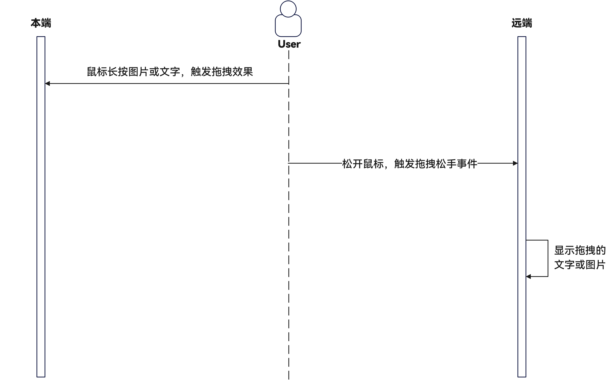
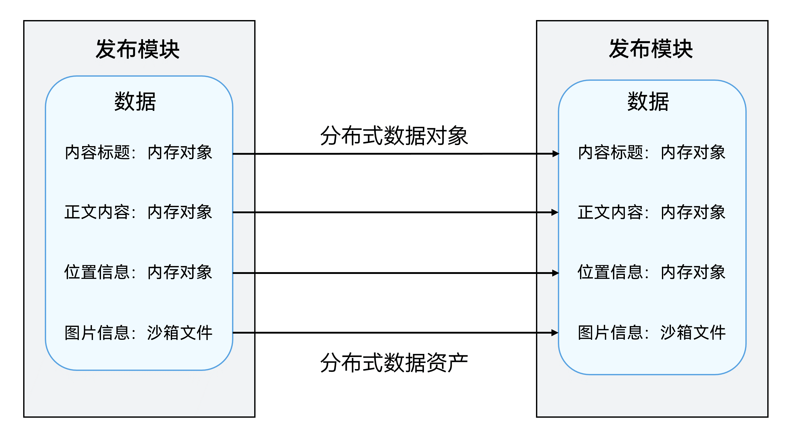

# 内容编辑多设备协同

更新时间：2026-05-22 09:46:30

来源：https://developer.huawei.com/consumer/cn/doc/best-practices/bpta-continue

##### 概述

在办公、创作和社区交友等应用中，内容发布是用户互动与交流的核心，它允许用户创作并分享包含图片、文字等多媒体信息，从而增强用户间的连接与互动。随着手机、平板、PC/2in1等多设备的普及，用户对在不同设备间无缝切换、跨设备处理图片和文字及接续编辑内容的需求日益增长。本文介绍如何通过应用接续功能（实现不同设备间的快速切换）和跨设备互通功能，提升内容发布的便利性。

本文主要包含以下几个方面内容：

 - [跨设备互通](#section81333710289)：基于分布式协同框架，面向跨设备拍照等业务场景，提供[createCollaborationServiceMenuItems()](https://developer.huawei.com/consumer/cn/doc/harmonyos-references/servicecollaboration-collaborationservice#createcollaborationservicemenuitems)（相机设备列表组件）和[CollaborationServiceStateDialog()](https://developer.huawei.com/consumer/cn/doc/harmonyos-references/servicecollaboration-collaborationservice#collaborationservicestatedialog)（远端相机状态弹窗组件）两个组件。应用只需要调用这两个组件，即可实现跨设备调用相机、拍照、扫描及访问图库的功能。
 - [跨设备拖拽图片/文字](#section103557271407)：支持跨设备拖拽场景，系统自动完成键鼠穿越和跨设备的数据传递，应用可根据实际需求，使用[拖拽控制](https://developer.huawei.com/consumer/cn/doc/harmonyos-references/ts-universal-attributes-drag-drop)和[拖拽事件](https://developer.huawei.com/consumer/cn/doc/harmonyos-references/ts-universal-events-drag-drop)能力，实现在平板或PC/2in1类型的任意两台设备间拖拽文件和文本的功能。
 - [跨设备剪贴图片/文字](#section1838716271127)：基于[剪贴板](https://developer.huawei.com/consumer/cn/doc/harmonyos-references/js-apis-pasteboard)能力，支持系统复制、粘贴功能，实现本地剪贴板和跨设备剪贴板的业务场景。本地剪贴板提供设备内的内容复制粘贴，跨设备剪贴板提供跨设备的内容复制粘贴。
 - [跨设备应用接续](#section181890343316)：基于UIAbility应用组件，通过在本端使用[onContinue()](https://developer.huawei.com/consumer/cn/doc/harmonyos-references/js-apis-app-ability-uiability#oncontinue)接口保存迁移数据，在目的端使用[onCreate()](https://developer.huawei.com/consumer/cn/doc/harmonyos-references/js-apis-app-ability-uiability#oncreate)或[onNewWant()](https://developer.huawei.com/consumer/cn/doc/harmonyos-references/js-apis-app-ability-uiability#onnewwant)接口恢复迁移数据，实现应用接续的场景。即当用户在一个设备上操作某个应用时，可以在另一个设备的同一个应用中快速切换，并无缝衔接上一个设备的应用体验。


##### 用户体验


##### 使用限制

| 限制\场景 | 跨设备互通 | 跨设备拖拽 | 跨设备剪贴 | 跨设备应用接续 |
| --- | --- | --- | --- | --- |
| HarmonyOS NEXT及以上版本的设备 | √ | √ | √ | √ |
| 登录同一个华为账号 | √ | √ | √ | √ |
| 打开Wi-Fi和蓝牙开关 | √ | √ | √ | √ |
| 打开键鼠穿越开关 | NA | √ | NA | NA |
| 设备需解锁、亮屏 | NA | NA | √ | NA |
| 设备类型（垂域常见设备手机、平板、PC） | 本端设备：平板或PC设备。 远端设备：具有相机能力的手机或平板设备。 | 必须有电脑设备接入，或者部分支持电脑模式的平板设备接入 | 手机、平板、PC | 手机、平板、PC |
| 只能在同应用（UIAbility）之间触发 | NA | NA | NA | √ |
| 开启“多设备协同 > 接续”功能 | NA | NA | NA | √ |
| 应用在安装前的HAP包中已经存在的资源文件不能跨端 | NA | √ | NA | NA |


##### 跨设备互通


##### 场景描述

当用户在平板或PC/2in1设备上使用文本编辑应用（如备忘录、邮件、笔记等）时，若需拍摄照片作为素材，当设备操作不便时，可利用跨设备互通功能解决。用户可在当前设备的应用中选择平板或手机，启动其相机拍摄所需素材，或从图库中选取所需图片。使用手机或平板拍摄具备更高的灵活性和取景便利性，以及更强大的相机功能。所选照片将迅速传输至平板或PC/2in1设备的应用中，助力用户高效完成图文编辑任务。

> [!NOTE]
> 该功能的使用需满足设备限制和使用限制，具体约束与限制可参考：跨设备互通开发指导中的 约束与限制 章节。


**实现效果**


##### 实现原理

**场景分析**
1. 用户在本端（平板或PC/2in1）应用界面操作，选择使用远端设备的拍照、扫描或图库功能，向远端发起请求。
2. 系统将自动唤醒远端设备上的相机、图库或扫描功能，进入相应的界面。
3. 使用远端设备完成拍照或选择图片并确认，远端拍摄状态信息实时回传到本端，并将数据插入到本端设备的应用中。





**关键技术**

在分布式协同框架下，针对跨设备互通图片信息的业务场景，应用只需要调用[createCollaborationServiceMenuItems()](https://developer.huawei.com/consumer/cn/doc/harmonyos-references/servicecollaboration-collaborationservice#createcollaborationservicemenuitems)（相机设备列表组件）和[CollaborationServiceStateDialog()](https://developer.huawei.com/consumer/cn/doc/harmonyos-references/servicecollaboration-collaborationservice#collaborationservicestatedialog)（远端相机状态弹窗组件）两个组件，即可完成跨端拍照、扫描、图库访问能力，开发者无需关注分布式场景下的数据传输和指令控制等细节，具体运作机制可参考：跨设备互通特性简介中的[运作机制](https://developer.huawei.com/consumer/cn/doc/harmonyos-guides/servicecollaboration-service-overview#运作机制)章节。


##### 实现方案

 - 拉取远端菜单，选择远端设备        通过[createCollaborationServiceMenuItems()](https://developer.huawei.com/consumer/cn/doc/harmonyos-references/servicecollaboration-collaborationservice#createcollaborationservicemenuitems)组件，获取组网内具有对应能力的设备列表。当用户选择特定的设备功能后，系统将自动激活远端设备的相机或图库，并使设备屏幕自动点亮。可设置传输照片的最大数量，范围为1至50张；若设置数量小于或等于0，则不会触发设备的相应功能；若设置数量超过50，则默认为50张。

  
```ArkTS
// Remote menu.
@Builder
MyTestMenu() {
  Menu() {
    MenuItem({
      symbolStartIcon: new SymbolGlyphModifier($r('sys.symbol.picture_2')),
      content: $r('app.string.local_device')
    })
      .onClick(() => {
        if (this.imageUriArray.length < CommonConstants.MAX_ADD_PIC) {
          this.selectImage();
        } else {
          try {
            this.getUIContext().getPromptAction().showToast({ message: $r('app.string.add_picture_prompt') });
          } catch (err) {
            hilog.error(DOMAIN, TAG, FORMAT, `ShowToast failed. Cause code: ${err.code}, message: ${err.message}`);
          }
        }
      })
    createCollaborationServiceMenuItems([CollaborationServiceFilter.ALL], 9)
  }
}
```

 - 将远端拍摄状态信息实时回传        应用将弹出提示框，实时回传远端拍摄状态信息到组件[CollaborationServiceStateDialog()](https://developer.huawei.com/consumer/cn/doc/harmonyos-references/servicecollaboration-collaborationservice#collaborationservicestatedialog)（远端相机状态弹窗组件），为弹窗组件绑定和实现[onState()](https://developer.huawei.com/consumer/cn/doc/harmonyos-references/servicecollaboration-collaborationservice#onstate)方法，在业务开始后，此方法将被协同框架调用，用于接收和处理数据。该回调函数接收的数据中，stateCode表示完成状态，bufferType表示回传的数据类型，buffer则是回传的图片数据。

  
```ArkTS
build() {
  Column() {
    CollaborationServiceStateDialog({
      onState: (stateCode: number, bufferType: string, buffer: ArrayBuffer): void => this.doInsertPicture(stateCode,
        bufferType, buffer)
    })
    // ...
  }
  // ...
}
```

 - 将回传数据写入页面        用户使用远端设备完成拍照或选择图库照片后，通过自定义方法将返回的图片数据写入本端设备的页面。远端设备将自动退出相机或图库界面，恢复到初始状态。

  
```ArkTS
// Remote images fall into.
doInsertPicture(stateCode: number, bufferType: string, buffer: ArrayBuffer): void {
  if (stateCode != 0) {
    return;
  }
  if (bufferType === 'general.image') {
    let imageSource = image.createImageSource(buffer);
    imageSource.createPixelMap().then((pixelMap) => {
      if (this.imageUriArray.length < CommonConstants.MAX_ADD_PIC) {
        let uuid = util.generateRandomUUID();
        this.PixelMapToBuffer(pixelMap, uuid);
        this.imageUriArray.push({ imagePixelMap: pixelMap, imageName: uuid });
      }
    })
  }
}
```


##### 跨设备拖拽图片/文字


##### 场景描述

当用户拥有多台设备时，开启键鼠共享功能，可以实现键鼠在不同设备间的自由移动。通过跨设备拖拽，用户可以轻松地将本端上的素材拖拽到远端，快速完成内容创作，享受高效的跨设备协同工作体验。

> [!NOTE]
> 该功能的使用需满足设备限制和使用限制，具体约束与限制可参考： 跨设备拖拽约束与限制 。


**实现效果**


##### 实现原理

**场景分析**
1. 用户通过长按鼠标触发拖拽事件，可以从本端编辑页面将图片或文字拖拽到远端的编辑页面。
2. 在此过程中，系统自动处理跨设备的数据传输，开发者无需介入。
3. 当用户释放鼠标时，触发拖拽松手事件，远端应用处理接收到的拖拽数据，并将其写入远端编辑页面。


**关键技术**

在开发跨设备拖拽功能时，系统会自动处理鼠标和键盘的跨设备操作及数据传递。应用可以根据实际需求，实现组件的拖入或拖出，完成拖拽事件的开发。具体运作机制可参考：[跨设备拖拽运作机制](https://developer.huawei.com/consumer/cn/doc/best-practices/bpta-distribute-drag-cast#section1457705692219)。


##### 实现方案

 - 设置组件允许拖拽        将需要触发拖拽事件和松手事件的Image组件、TextInput组件及TextArea组件设置[draggable()](https://developer.huawei.com/consumer/cn/doc/harmonyos-references/ts-universal-attributes-drag-drop#draggable)为true，以允许拖拽。
 - 设置组件允许落入的类型        使用[allowDrop()](https://developer.huawei.com/consumer/cn/doc/harmonyos-references/ts-universal-attributes-drag-drop#allowdrop)方法设置组件允许拖入的数据类型，包括PLAIN_TEXT、IMAGE、OPENHARMONY_PIXEL_MAP等。
 - 定义[拖拽事件](https://developer.huawei.com/consumer/cn/doc/harmonyos-references/ts-universal-events-drag-drop)       将允许拖入的组件绑定[onDrop()](https://developer.huawei.com/consumer/cn/doc/harmonyos-references/ts-universal-events-drag-drop#ondrop)事件作为释放目标。当在该组件范围内停止拖拽操作时，将触发回调函数，实现图片的拖出和写入页面的功能。

  
```ArkTS
build() {
  Column() {
    // ...
  }
  .draggable(true)
  .allowDrop([uniformTypeDescriptor.UniformDataType.IMAGE,
    uniformTypeDescriptor.UniformDataType.OPENHARMONY_PIXEL_MAP])
  .onDrop((dragEvent?: DragEvent) => {
    // The logic behind the image falling in, achieving image writing.
    // ...
    })
  })

}


// ...

/*
 *  Adding an image.
 */
@Builder
addPic() {
  Row() {
    List({ space: CommonConstants.LIST_COMM_SPACE }) {
      ForEach(this.imageUriArray, (item: ImageInfo) => {
        ListItem() {
          Image(item.imagePixelMap)// ...
            .draggable(true)
            .onDragEnd((event) => {
              // The logic after dragging and dropping is completed.
              // ...
            })// ...
        }
      }, (item: ImageInfo, index: number) => JSON.stringify(item) + index)
      // ...
    }
    // ...
  }
  // ...
}
```
当在TextInput()和TextArea()组件范围内停止拖放行为时，将触发回调，实现文字拖出和写入页面的效果。

  
```ArkTS
build() {
  Flex({ direction: FlexDirection.Column }) {
    TextInput({ text: this.mainTitle, placeholder: $r('app.string.text_input_placeholder') })// ...
      .draggable(true)
      .allowDrop([uniformTypeDescriptor.UniformDataType.PLAIN_TEXT])
      .onDrop((dragEvent?: DragEvent) => {
        // The logic after the text falls in, realizing the writing of text.
        // ...
      })

    TextArea({ text: this.textContent, placeholder: $r('app.string.richEditor_placeholder') })// ...
      .draggable(true)
      .allowDrop([uniformTypeDescriptor.UniformDataType.PLAIN_TEXT])
      .onDrop((dragEvent?: DragEvent) => {
        // The logic after the text falls in, realizing the writing of text.
        // ...
      })
  }
  .backgroundColor($r('sys.color.background_primary'))
  // ...
}
```


##### 跨设备剪贴图片/文字


##### 场景描述

当用户拥有多台设备时，可以利用跨设备剪贴板的功能，在本端的应用中复制文本或图片，并在远端的应用中粘贴，实现高效的内容共享。

> [!NOTE]
> 该功能的使用需满足设备限制和使用限制，具体约束与限制可参考： 跨设备剪贴板约束与限制 。


**实现效果**


##### 实现原理

**场景分析**

1. 用户在本端复制数据，写入到系统剪贴板服务。

2. 系统剪贴板服务处理数据并完成同步，此过程开发者不感知。

3. 用户在远端读取系统剪贴板内容，粘贴来自本端的数据。


**关键技术**

在开发跨设备剪贴板功能时，系统会自动处理设备间的数据传输，应用程序可根据实际需求接入跨设备剪贴板，实现跨设备间的数据共享。具体运作机制可参考：[跨设备剪贴板运作机制](https://developer.huawei.com/consumer/cn/doc/best-practices/bpta-distributed-pasteboard-cast#section111721843182510)。


##### 实现方案

 - 本端复制数据，写入到剪贴板服务        使用[SystemPasteboard](https://developer.huawei.com/consumer/cn/doc/harmonyos-references/js-apis-pasteboard#systempasteboard)(系统剪贴板对象)的[setData()](https://developer.huawei.com/consumer/cn/doc/harmonyos-references/js-apis-pasteboard#setdata9)方法将本端复制的数据写入剪贴板服务。

  
```ArkTS
// Copy picture.
async setPasteDataTest(pixelMap: image.PixelMap): Promise<void> {
  let pasteData: pasteboard.PasteData = pasteboard.createData(pasteboard.MIMETYPE_PIXELMAP, pixelMap);
  let systemPasteBoard: pasteboard.SystemPasteboard = pasteboard.getSystemPasteboard();
  await systemPasteBoard.setData(pasteData).catch((err: BusinessError) => {
    hilog.error(DOMAIN, TAG, FORMAT, `Failed to set pastedata. Code: ${err.code}, message: ${err.message}`);
  });
}
```

 - 远端粘贴数据，读取剪贴板内容        在远端设备上粘贴数据时，使用[SystemPasteboard](https://developer.huawei.com/consumer/cn/doc/harmonyos-references/js-apis-pasteboard#systempasteboard)（系统剪贴板对象）的[getData()](https://developer.huawei.com/consumer/cn/doc/harmonyos-references/js-apis-pasteboard#getdata9)方法读取剪贴板中的内容，并将数据展示在页面上。

  
```ArkTS
// Paste picture.
async getPasteDataTest(): Promise<void> {
  let systemPasteBoard: pasteboard.SystemPasteboard = pasteboard.getSystemPasteboard();
  systemPasteBoard.getData((err: BusinessError, data: pasteboard.PasteData) => {
    if (err) {
      hilog.error(DOMAIN, TAG, FORMAT, `Failed to get pastedata. Code: ${err.code}, message: ${err.message}`);
      return;
    }
    // Process pasteData, obtain type, number, etc
    // Retrieve the number of records in the clipboard.
    let recordCount: number = data.getRecordCount();
    // Retrieve the type of data from the clipboard.
    let types: string = data.getPrimaryMimeType();
    hilog.info(DOMAIN, TAG, FORMAT, `recordCount: ${recordCount}, types: ${types}`);
    // Retrieve the content of data from the clipboard.
    if (types === 'pixelMap') {
      let primaryPixelMap: image.PixelMap = data.getPrimaryPixelMap();
      if (this.imageUriArray.length < CommonConstants.MAX_ADD_PIC) {
        let uuid = util.generateRandomUUID();
        this.PixelMapToBuffer(primaryPixelMap, uuid);
        this.imageUriArray.push({ imagePixelMap: primaryPixelMap, imageName: uuid });
      } else {
        this.toastShow = true;
      }
    } else if (types === 'text/uri') {
      this.uri2pixelMap(data.getPrimaryUri());
    }
  });
}
```


##### 跨设备应用接续


##### 场景描述

在用户使用过程中，使用场景发生了变化，之前使用的设备不再适合继续当前任务，或者周围有更合适的设备，此时用户可以选择使用新的设备来继续当前的任务。接续完成后，之前设备的应用可退出或保留，用户可以将注意力集中在被拉起的设备上，继续执行任务。

> [!NOTE]
> 该功能的使用需满足设备限制和使用限制，具体约束与限制可参考： 应用接续约束与限制 。


**实现效果**


##### 实现原理

**场景分析**
1. 输入数据：用户在本端设备的编辑页面上选择照片、输入标题和正文等文字信息。
2. 用户点击远端设备Dock栏图标后，本端设备发起接续，数据进行传输。
3. 远端设备接收接续数据并显示。

场景核心在于应用接续的过程中如何传递数据。对于文字信息可使用分布式数据对象保存，对于图片可以拷贝到分布式文件目录下，使用分布式数据资产作为分布式数据对象的根属性保存。





**关键技术**

将发起接续的设备称为本端设备，接收数据的设备称为远端设备，运作机制如图，接续过程底层依赖分布式框架和软总线，开发者只需要启用接续、保存数据和恢复数据，具体运作机制可参考：[应用接续运作机制](https://developer.huawei.com/consumer/cn/doc/best-practices/bpta-continue-cast#section1218874218264)。


##### 实现方案


 - 启用应用接续能力       在module.json5文件的abilities中，将continuable标签配置为“true”，表示该UIAbility可被迁移。配置为false的UIAbility将被系统识别为无法迁移且该配置默认值为false。

  
```json
{
  "module": {
    // ...
    "abilities": [
      {
        // ...
        "continuable": true,
        // ...
      }
    ],
    // ...
  }
}
```

 - 基础数据&文件资产迁移       对于图片、文档等文件类数据，可以转化成ArrayBuffer类型，保存在分布式文件目录下。

  
```ArkTS
writeDistributedFile(buf: ArrayBuffer, displayName: string): void {
  // The asset is written to the distributed file directory.
  // Obtain the distributed file directory path.
  let distributedDir: string = this.context.distributedFilesDir;
  let fileName: string = '/' + displayName;
  let filePath: string = distributedDir + fileName;
  try {
    // Create a file in a distributed directory.
    let file = fileIo.openSync(filePath, fileIo.OpenMode.READ_WRITE | fileIo.OpenMode.CREATE);
    hilog.info(DOMAIN, TAG, FORMAT, 'Create file success.');
    // Write content to a file (if the asset is a picture, the picture can be converted to a buffer to write)
    fileIo.writeSync(file.fd, buf);
    // closed file.
    fileIo.closeSync(file.fd);
  } catch (error) {
    let err: BusinessError = error as BusinessError;
    hilog.info(DOMAIN, TAG, FORMAT,
      `Failed to openSync / writeSync / closeSync. Code: ${err.code}, message: ${err.message}`);
  }
}
```
使用分布式数据对象时，需要在本端onContinue()接口中进行数据保存。在本端UIAbility的[onContinue()](https://developer.huawei.com/consumer/cn/doc/harmonyos-references/js-apis-app-ability-uiability#oncontinue)接口中，创建分布式数据对象并保存数据，执行流程如下：

1. 在onContinue()接口中使用create()接口创建分布式数据对象，将所要迁移的数据填充到分布式数据对象数据中。

2. 如果有图片、文档等文件类数据要迁移，需要先将其转换为资产commonType.Asset类型，再封装到分布式数据对象中进行迁移。

3. 调用genSessionId()接口生成数据对象组网id，并使用该id调用setSessionId()加入组网，激活分布式数据对象。

4. 使用save()接口将已激活的分布式数据对象持久化，确保本端退出后远端依然可以获取到数据。

5. 将生成的sessionId通过want传递到远端，供远端激活同步使用。

  
```ArkTS
async onContinue(wantParam: Record<string, Object | undefined>): Promise<AbilityConstant.OnContinueResult> {
  wantParam.imageUriArray = JSON.stringify(AppStorage.get<Array<PixelMap>>('imageUriArray'));
  try {
    // Generate the session ID of the distributed data object.
    let sessionId: string = distributedDataObject.genSessionId();
    wantParam.distributedSessionId = sessionId;

    let imageUriArray = AppStorage.get<Array<ImageInfo>>('imageUriArray');
    let assets: commonType.Assets = [];
    if (imageUriArray) {
      for (let i = 0; i < imageUriArray.length; i++) {
        let append = imageUriArray[i];
        let attachment: commonType.Asset = this.getAssetInfo(append);
        assets.push(attachment);
      }
    }

    let contentInfo: ContentInfo = new ContentInfo(
      AppStorage.get('mainTitle'),
      AppStorage.get('textContent'),
      AppStorage.get('imageUriArray'),
      AppStorage.get('isShowLocalInfo'),
      AppStorage.get('isAddLocalInfo'),
      AppStorage.get('selectLocalInfo'),
      assets
    );
    let source = contentInfo.flatAssets();
    this.distributedObject = distributedDataObject.create(this.context, source);
    this.distributedObject.setSessionId(sessionId).catch((err: BusinessError) => {
      hilog.info(DOMAIN, TAG, FORMAT, `SetSessionId failed. Cause code: ${err.code}, message: ${err.message}`);
    });
    await this.distributedObject.save(wantParam.targetDevice as string).catch((err: BusinessError) => {
      hilog.info(DOMAIN, TAG, FORMAT, `Failed to save. Code: ${err.code}, message: ${err.message}`);
    });
  } catch (error) {
    hilog.error(DOMAIN, TAG, FORMAT, 'distributedDataObject failed', `code ${(error as BusinessError).code}`);
  }
  return AbilityConstant.OnContinueResult.AGREE;
}
```

 - 基础数据&文件资产恢复       在远端设备UIAbility的onCreate()/onNewWant()中调用restoreDistributedObject()方法，通过加入与本端一致的分布式数据对象组网进行数据恢复，执行流程如下：

1. 在restoreDistributedObject()方法中创建空的分布式数据对象，用于接收恢复的数据。

2. 从want中读取分布式数据对象组网id。

3. 注册on()接口监听数据变更。在收到status为restore的事件的回调中，实现数据恢复完毕时需要进行的业务操作。由于恢复的数据中有图片文件，调用fileCopy()方法从分布式文件中读取ArrayBuffer，然后把ArrayBuffer转化成图片类型数据进行存储。

4. 调用setSessionId()加入组网，激活分布式数据对象。

5. 打开远端设备，点击接续图标，应用打开，页面数据恢复。

  
```ArkTS
onCreate(want: Want, launchParam: AbilityConstant.LaunchParam): void {
  hilog.info(DOMAIN, TAG, FORMAT, 'Ability onCreate');
  this.restoreDistributedObject(want, launchParam);
  AppStorage.setOrCreate('systemColorMode', this.context.config.colorMode);
  try {
    this.context.getApplicationContext().setColorMode(ConfigurationConstant.ColorMode.COLOR_MODE_NOT_SET);
  } catch (err) {
    hilog.error(DOMAIN, TAG, FORMAT, `SetColorMode failed. Cause code: ${err.code}, message: ${err.message}`);
  }
  // ...
}

onNewWant(want: Want, launchParam: AbilityConstant.LaunchParam): void {
  hilog.info(DOMAIN, TAG, FORMAT, 'Ability onNewWant');
  this.restoreDistributedObject(want, launchParam);
}

/*
 * The peer device receives data.
 * @param want
 * @param launchParam
 * @returns
 */
async restoreDistributedObject(want: Want, launchParam: AbilityConstant.LaunchParam): Promise<void> {
  if (launchParam.launchReason !== AbilityConstant.LaunchReason.CONTINUATION) {
    return;
  }

  let mailInfo: ContentInfo = new ContentInfo(undefined, undefined, [], undefined, undefined, undefined, undefined);
  this.distributedObject = distributedDataObject.create(this.context, mailInfo);
  // Add a data restored listener.
  try {
    this.distributedObject.on('status',
      (sessionId: string, networkId: string, status: 'online' | 'offline' | 'restored') => {
        hilog.info(DOMAIN, TAG, FORMAT, `status changed, sessionId: ${sessionId}`);
        hilog.info(DOMAIN, TAG, FORMAT, `status changed, status: ${status}`);
        hilog.info(DOMAIN, TAG, FORMAT, `status changed, networkId: ${networkId}`);
        if (status === 'restored') {
          if (!this.distributedObject) {
            return;
          }
          AppStorage.setOrCreate('mainTitle', this.distributedObject['mainTitle']);
          AppStorage.setOrCreate('textContent', this.distributedObject['textContent']);
          AppStorage.setOrCreate('isShowLocalInfo', this.distributedObject['isShowLocalInfo']);
          AppStorage.setOrCreate('isAddLocalInfo', this.distributedObject['isAddLocalInfo']);
          AppStorage.setOrCreate('selectLocalInfo', this.distributedObject['selectLocalInfo']);
          AppStorage.setOrCreate('attachments', this.distributedObject['attachments']);
          let attachments = this.distributedObject['attachments'] as commonType.Assets;
          hilog.info(DOMAIN, TAG, FORMAT,
            `attachments: ${JSON.stringify(this.distributedObject['attachments'])}`);
          for (const attachment of attachments) {
            this.fileCopy(attachment);
          }
          AppStorage.setOrCreate<Array<ImageInfo>>('imageUriArray', this.imageUriArray);
        }
      });
  } catch (err) {
    hilog.error(DOMAIN, TAG, FORMAT, `On status failed. Cause code: ${err.code}, message: ${err.message}`);
  }
  let sessionId: string = want.parameters?.distributedSessionId as string;
  this.distributedObject.setSessionId(sessionId).catch((err: BusinessError) => {
    hilog.info(DOMAIN, TAG, FORMAT, `SetSessionId failed. Cause code: ${err.code}, message: ${err.message}`);
  });
  try {
    this.context.restoreWindowStage(new LocalStorage());
  } catch (err) {
    hilog.error(DOMAIN, TAG, FORMAT, `RestoreWindowStage failed. Cause code: ${err.code}, message: ${err.message}`);
  }
}
```
接续过来的图片，需要从分布式文件目录路径下读取所需的文件，经处理后，转化成需要的数据类型。

  
```ArkTS
/*
 * Copy distributed files.
 * @param attachmentRecord
 * @param key
 */
private fileCopy(attachment: commonType.Asset): void {
  if (canIUse('SystemCapability.DistributedDataManager.CommonType')) {
    let filePath: string = this.context.distributedFilesDir + '/' + attachment.name;
    let savePath: string = this.context.filesDir + '/' + attachment.name;
    try {
      if (fileIo.accessSync(filePath)) {
        let saveFile = fileIo.openSync(savePath, fileIo.OpenMode.READ_WRITE | fileIo.OpenMode.CREATE);
        let file = fileIo.openSync(filePath, fileIo.OpenMode.READ_WRITE);
        let buf: ArrayBuffer = new ArrayBuffer(Number(attachment.size));
        let readSize = 0;
        let readLen = fileIo.readSync(file.fd, buf, {
          offset: readSize
        });
        let sourceOptions: image.SourceOptions = {
          sourceDensity: 120
        };
        let imageSourceApi: image.ImageSource = image.createImageSource(buf, sourceOptions);
        this.imageUriArray.push({
          imagePixelMap: imageSourceApi.createPixelMapSync(),
          imageName: attachment.name
        });
        while (readLen > 0) {
          readSize += readLen;
          fileIo.writeSync(saveFile.fd, buf);
          readLen = fileIo.readSync(file.fd, buf, {
            offset: readSize
          });
        }
        fileIo.closeSync(file);
        fileIo.closeSync(saveFile);
        hilog.info(DOMAIN, TAG, FORMAT, attachment.name + 'synchronized successfully.');
      }
    } catch (error) {
      let err: BusinessError = error as BusinessError;
      hilog.error(DOMAIN, TAG, FORMAT, `DocumentViewPicker failed with err: ${JSON.stringify(err)}`);
    }
  }
}
```


##### 示例代码

 - [基于应用接续及跨设备互通功能实现内容发布功能](https://gitcode.com/harmonyos_samples/ContinuePublish)
