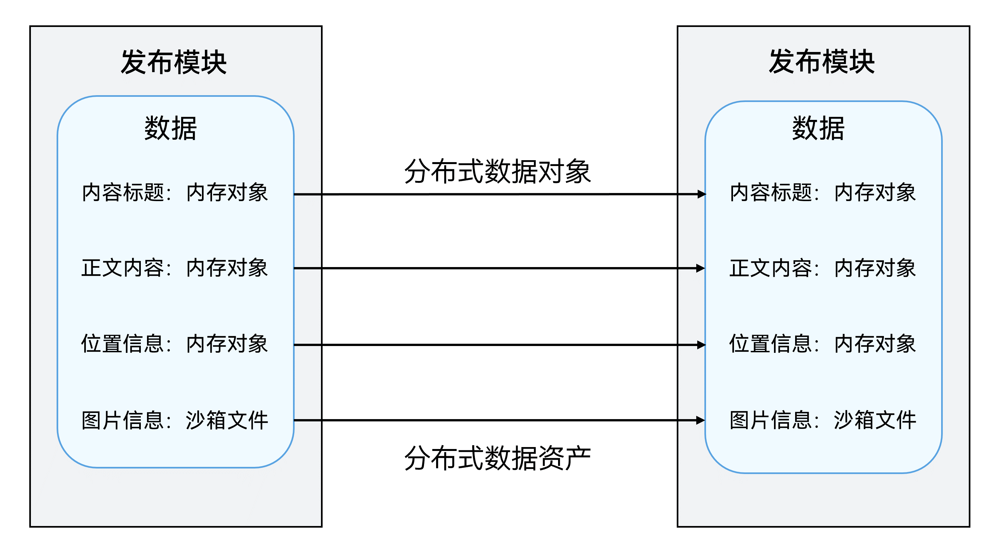
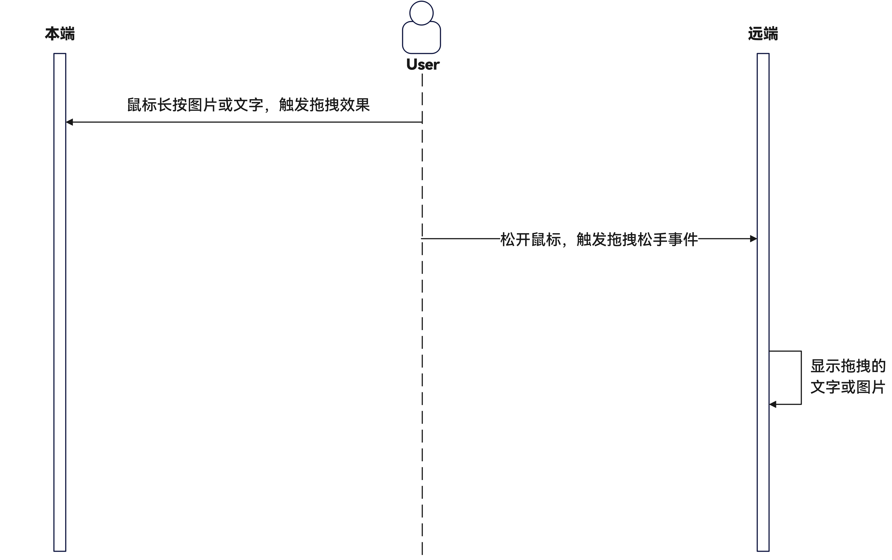

# 社交通讯全场景协同最佳实践

更新时间：2026-06-12 07:22:00

来源：https://developer.huawei.com/consumer/cn/doc/best-practices/bpta-continue

#### 概述

在办公、创作和社区交友等应用中，内容发布和浏览分享是用户互动与交流的核心。它允许用户创作并分享包含图片、视频、文字等多媒体信息，从而增强用户间的连接与互动。随着手机、平板、电脑等电子设备的普及，用户对跨设备处理图片/视频/文字及接续编辑内容、在不同设备间无缝切换及快速便捷分享内容的需求日益增长。本文介绍如何通过跨端迁移和多端协同功能，实现不同设备间的快速无缝切换，提升内容发布和浏览分享的便利性。

本文主要包含以下几个方面内容：

 - [跨设备互通](#section81333710289)：基于分布式协同框架，面向跨设备拍照等业务场景，提供[createCollaborationServiceMenuItems](https://developer.huawei.com/consumer/cn/doc/harmonyos-references/servicecollaboration-collaborationservice#createcollaborationservicemenuitems)（相机设备列表组件）和[CollaborationServiceStateDialog](https://developer.huawei.com/consumer/cn/doc/harmonyos-references/servicecollaboration-collaborationservice#collaborationservicestatedialog)（远端相机状态弹窗组件）两个组件。应用只需要调用这两个组件，即可实现跨设备调用相机、拍照、扫描及访问图库的功能。
 - [跨设备拖拽图片/文字](#section103557271407)：支持跨设备拖拽场景，系统自动完成键鼠穿越和跨设备的数据传递，应用可根据实际需求，使用[拖拽控制](https://developer.huawei.com/consumer/cn/doc/harmonyos-references/ts-universal-attributes-drag-drop)和[拖拽事件](https://developer.huawei.com/consumer/cn/doc/harmonyos-references/ts-universal-events-drag-drop)能力，实现在平板或电脑类型的任意两台设备间拖拽图片和文本的功能。
 - [跨设备剪贴图片/视频/文字](#section1838716271127)：基于[@ohos.pasteboard (剪贴板)](https://developer.huawei.com/consumer/cn/doc/harmonyos-references/js-apis-pasteboard)能力，支持系统复制、粘贴功能，实现本地剪贴板和跨设备剪贴板的业务场景。本地剪贴板提供设备内的内容复制粘贴，跨设备剪贴板提供跨设备的内容复制粘贴。
 - [跨设备应用接续](#section181890343316)：基于UIAbility应用组件，通过在本端使用[onContinue()](https://developer.huawei.com/consumer/cn/doc/harmonyos-references/js-apis-app-ability-uiability#oncontinue)接口保存迁移数据，在目的端使用[onCreate()](https://developer.huawei.com/consumer/cn/doc/harmonyos-references/js-apis-app-ability-uiability#oncreate)或[onNewWant()](https://developer.huawei.com/consumer/cn/doc/harmonyos-references/js-apis-app-ability-uiability#onnewwant)接口恢复迁移数据，实现应用接续的场景。即当用户在一个设备上操作某个应用时，可以在另一个设备的同一个应用中快速切换，并无缝衔接上一个设备的应用体验。
 - [碰一碰插入图片](#section14748162055210)：基于系统[手机与PC/2in1碰一碰分享](https://developer.huawei.com/consumer/cn/doc/harmonyos-guides/knock-share-pc-phones)能力，实现将移动端设备图库中的图片分享后插入到电脑端应用页面中。
 - [碰一碰分享页面](#section19925183913145)：基于系统[碰一碰分享](https://developer.huawei.com/consumer/cn/doc/harmonyos-guides/knock-share)能力，支持通过碰一碰分享内容页面到其他设备。并结合App Linking技术（详情可参考[App Linking Kit简介](https://developer.huawei.com/consumer/cn/doc/harmonyos-guides/applinking-introduction)），可实现内容的快速跨设备分享，直达目标应用，提供高效、便捷、无缝的分享体验。
 - [隔空传送分享页面](#section186686762112)：基于系统[隔空传送](https://developer.huawei.com/consumer/cn/doc/harmonyos-guides/gestures-share)能力，支持通过隔空传送手势分享内容页面到其他设备。通过隔空传送手势触发分享App Linking链接，安装应用的接收端可直接打开查看内容。


#### 用户体验


#### 体验
| 特性 | 体验视频 |
| 跨设备互通 |  |
| 跨设备拖拽 |  |
| 跨设备剪贴 |  |
| 跨设备应用接续 |  |
| 碰一碰插入图片 |  |
| 碰一碰分享页面 |  |
| 隔空传送分享页面 |  |


#### 使用限制

| 限制\场景 | 跨设备互通 | 跨设备拖拽 | 跨设备剪贴 | 跨设备应用接续 | 碰一碰分享 | 隔空传送分享 |
| --- | --- | --- | --- | --- | --- | --- |
| HarmonyOS NEXT及以上版本的设备 | √ | √ | √ | √ | √ | √ |
| 登录同一个华为账号 | √ | √ | √ | √ | 手机与手机碰一碰分享不需要。 手机与电脑碰一碰分享需要。 | NA |
| 打开Wi-Fi和蓝牙开关 | √ | √ | √ | √ | NA | NA |
| 设备需解锁、亮屏 | NA | NA | √ | NA | √ | √ |
| 设备类型（垂域常见设备手机、平板、电脑） | 本端设备：平板或电脑设备。 远端设备：具有相机能力的手机或平板设备。 | 必须有电脑设备接入，或者部分支持电脑模式的平板设备接入。 | 手机、平板、电脑 | 手机、平板、电脑 | 本端设备：手机设备。 对端设备：手机、平板（6.1.0(23)版本开始）、电脑设备。仅支持直板手机或折叠手机直板态与电脑屏幕碰一碰分享。 | 手机、平板、电脑 |
| 在"设置>多设备协同"中开启相应功能 | √ | 开启键鼠共享开关。 | 开启跨设备剪贴板开关。 | 开启接续开关。 | NA | NA |
| 其他 | 支持根据特定调用策略调用设备，详见“约束与限制>使用限制”中的调用策略部分。 | 需接入同一个局域网且应用本身预置的资源文件（即应用在安装前的HAP包中已经存在的资源文件）不支持跨设备拖拽。 | NA | 双端设备都需要安装该应用。 | 已开启华为分享服务（系统默认开启）。手机与电脑碰一碰交互约束详见使用约束的轻碰屏幕交互约束部分。 | 需打开设备侧隔空传送开关。 |


#### 跨设备互通


#### 场景描述

用户在平板或电脑上使用文本编辑应用（如备忘录、邮件、笔记等）时，若当前设备不便拍摄，可利用跨设备互通功能，直接调用手机或平板的相机完成拍摄，也可从其图库中选择图片或视频。手机和平板设备在拍摄灵活性、取景便利性及相机性能上更具优势。所选素材将快速传输至原设备的应用中，帮助用户高效完成图文编辑任务。

> [!NOTE]
> 该功能的使用需满足设备限制和使用限制，具体约束与限制可参考：跨设备互通开发指导中的 约束与限制 章节。


#### 实现原理

**场景分析**
1. 用户在本端（平板或电脑）应用界面操作，选择使用远端设备的拍照、扫描或图库功能，向远端发起请求。
2. 系统将自动唤醒远端设备上的相机、图库或扫描，进入相应的界面。
3. 使用远端设备完成拍照或选择图片/视频并确认，远端拍摄状态信息实时回传到本端，并将数据插入到本端设备的应用中。


**关键技术**

跨设备互通的核心在于使用HarmonyOS的分布式协同框架：
1. **设备发现**：通过[createCollaborationServiceMenuItems](https://developer.huawei.com/consumer/cn/doc/harmonyos-references/servicecollaboration-collaborationservice#createcollaborationservicemenuitems)组件获取组网内具有对应能力的设备列表。
2. **远端唤醒**：系统自动唤醒远端设备上的相机、图库或扫描功能。
3. **状态回传**：通过[CollaborationServiceStateDialog](https://developer.huawei.com/consumer/cn/doc/harmonyos-references/servicecollaboration-collaborationservice#collaborationservicestatedialog)组件实时回传远端拍摄状态信息。
4. **数据接收**：在onState()回调中处理接收到的数据。

在分布式协同框架下，针对跨设备互通图片/视频信息的业务场景，应用只需要调用[createCollaborationServiceMenuItems](https://developer.huawei.com/consumer/cn/doc/harmonyos-references/servicecollaboration-collaborationservice#createcollaborationservicemenuitems)（相机设备列表组件）和[CollaborationServiceStateDialog](https://developer.huawei.com/consumer/cn/doc/harmonyos-references/servicecollaboration-collaborationservice#collaborationservicestatedialog)（远端相机状态弹窗组件）两个组件，即可实现跨端拍照、扫描、图库访问功能，开发者无需关注分布式场景下的数据传输和指令控制等细节，具体运作机制可参考：跨设备互通特性简介中的[运作机制](https://developer.huawei.com/consumer/cn/doc/harmonyos-guides/servicecollaboration-service-overview#运作机制)章节。


#### 实现方案

 - 拉取远端菜单，选择远端设备        通过[createCollaborationServiceMenuItems](https://developer.huawei.com/consumer/cn/doc/harmonyos-references/servicecollaboration-collaborationservice#createcollaborationservicemenuitems)组件，获取组网内具有对应能力的设备列表。当用户选择特定的设备功能后，系统将自动激活远端设备的相机或图库，并使设备屏幕自动点亮。可设置传输照片/视频的最大数量canReceiveNumber，范围为1至50张；若设置数量小于或等于0，则不会触发设备的相应功能；若设置数量超过50，则默认为50。

  
```ArkTS
// Remote menu.
@Builder
MyTestMenu() {
  Menu() {
    MenuItem({
      symbolStartIcon: new SymbolGlyphModifier($r('sys.symbol.picture_2')),
      content: $r('app.string.local_device')
    })
      .onClick(() => {
        if (this.mediaUriArray.length < CommonConstants.MAX_ADD_MEDIA_NUM) {
          this.selectImage();
        } else {
          try {
            this.getUIContext().getPromptAction().showToast({ message: $r('app.string.add_picture_prompt') });
          } catch (err) {
            hilog.error(DOMAIN, TAG, FORMAT, `ShowToast failed. Cause code: ${err.code}, message: ${err.message}`);
          }
        }
      })

    if (canIUse('SystemCapability.Collaboration.Service')) {
      createCollaborationServiceMenuItems([CollaborationServiceFilter.ALL, CollaborationServiceFilter.VIDEO_PICKER],
        CommonConstants.MAX_ADD_MEDIA_NUM)
    }
  }
}
```

 - 将远端拍摄状态信息实时回传        应用将弹出提示框，实时回传远端拍摄状态信息到组件[CollaborationServiceStateDialog](https://developer.huawei.com/consumer/cn/doc/harmonyos-references/servicecollaboration-collaborationservice#collaborationservicestatedialog)（远端相机状态弹窗组件），为弹窗组件绑定和实现[onState()](https://developer.huawei.com/consumer/cn/doc/harmonyos-references/servicecollaboration-collaborationservice#onstate)方法，在业务开始后，此方法将被协同框架调用，用于接收和处理数据。该回调函数接收的数据中，stateCode表示完成状态，bufferType表示回传的数据类型，buffer则是回传数据。当bufferType取值为"general.image"时，buffer返回图片数据；当其取值为"general.video"时,buffer则返回沙箱视频uri路径。

  
```ArkTS
build() {
  Column() {
    CollaborationServiceStateDialog({
      onState: (stateCode: number, bufferType: string, buffer: ArrayBuffer): void => this.doInsertMedia(stateCode,
        bufferType, buffer)
    })
    // ...
  }
  // ...
}
```

 - 将回传数据写入页面        用户使用远端设备完成拍照或选择图库照片/视频后，通过自定义方法将返回的图片/视频数据写入本端设备的页面。远端设备将自动退出相机或图库界面，恢复到初始状态。

  
```ArkTS
// Remote images or videos fall into.
doInsertMedia(stateCode: number, bufferType: string, buffer: ArrayBuffer): void {
  if (stateCode != 0) {
    return;
  }
  if (this.mediaUriArray.length >= CommonConstants.MAX_ADD_MEDIA_NUM) {
    return;
  }

  if (bufferType === 'general.image') {
    let imageSource = image.createImageSource(buffer);
    imageSource.createPixelMap().then((pixelMap) => {
      let uuid = util.generateRandomUUID();
      this.PixelMapToBuffer(pixelMap, uuid);
      this.mediaUriArray.push({ imagePixelMap: pixelMap, mediaName: uuid, mediaType: MediaType.MEDIA_IMAGE });
      imageSource.release();
    })
  } else if (bufferType === 'general.video') {
    let uuid = util.generateRandomUUID();
    let decoder = util.TextDecoder.create('utf-8');
    let videoUriStr = decoder.decodeToString(new Uint8Array(buffer));
    writeDistributedFile(this.context, uuid, MediaType.MEDIA_VIDEO, undefined, videoUriStr);
    this.mediaUriArray.push({ videoUri: videoUriStr, mediaName: uuid, mediaType: MediaType.MEDIA_VIDEO });
  }
}
```


#### 跨设备拖拽图片/文字


#### 场景描述

当用户拥有多台设备时，开启键鼠共享功能，可以实现键鼠在不同设备间的自由移动。通过跨设备拖拽，用户可以轻松地将本端上的素材拖拽到远端，快速完成内容创作，享受高效的跨设备协同工作体验。

> [!NOTE]
> 该功能的使用需满足设备限制和使用限制，具体约束与限制可参考：跨设备拖拽中的 约束与限制 章节。


#### 实现原理

**场景分析**
1. 用户通过长按鼠标触发拖拽事件，可以从本端编辑页面将图片或文字拖拽到远端的编辑页面。
2. 在此过程中，系统自动处理跨设备的数据传输，开发者无需介入。
3. 当用户释放鼠标时，触发拖拽松手事件，远端应用处理接收到的拖拽数据，并将其写入远端编辑页面。





**关键技术**

在开发跨设备拖拽功能时，系统会自动处理鼠标的跨设备操作及数据传递。应用可以根据实际需求，实现组件的拖入或拖出，完成拖拽事件的开发。具体运作机制可参考：跨设备拖拽中的[运作机制](https://developer.huawei.com/consumer/cn/doc/best-practices/bpta-distribute-drag-cast#section1457705692219)章节。


#### 实现方案

 - 设置组件允许拖拽        将需要触发拖拽事件和松手事件的Image组件、TextInput组件及TextArea组件设置[draggable()](https://developer.huawei.com/consumer/cn/doc/harmonyos-references/ts-universal-attributes-drag-drop#draggable)为true，以允许拖拽。
 - 设置组件允许落入的类型        使用[allowDrop()](https://developer.huawei.com/consumer/cn/doc/harmonyos-references/ts-universal-attributes-drag-drop#allowdrop)方法设置组件允许拖入的数据类型，包括PLAIN_TEXT、IMAGE、OPENHARMONY_PIXEL_MAP等，具体可参考[UniformDataType](https://developer.huawei.com/consumer/cn/doc/harmonyos-references/js-apis-data-uniformtypedescriptor#uniformdatatype)。
 - 定义[拖拽事件](https://developer.huawei.com/consumer/cn/doc/harmonyos-references/ts-universal-events-drag-drop)       将允许拖入的组件绑定[onDrop()](https://developer.huawei.com/consumer/cn/doc/harmonyos-references/ts-universal-events-drag-drop#ondrop)事件作为释放目标。当在该组件范围内停止拖拽操作时，将触发回调函数，实现图片的拖出和拖入页面的功能。

  
```ArkTS
build() {
  Column() {
    // ...
  }
  .draggable(true)
  .allowDrop([uniformTypeDescriptor.UniformDataType.IMAGE,
    uniformTypeDescriptor.UniformDataType.OPENHARMONY_PIXEL_MAP])
  .onDrop((dragEvent?: DragEvent) => {
    // The logic behind the image falling in, achieving image writing.
    // ...
    })
  })

}


// ...

/*
 *  Adding an image or video.
 */
@Builder
addMedia() {
  Row() {
    List({ space: CommonConstants.LIST_COMM_SPACE }) {
      ForEach(this.mediaUriArray, (item: MediaInfo) => {
        ListItem() {
          if (item.imagePixelMap) {
            Image(item.imagePixelMap)// ...
              .draggable(true)
              .onDragEnd((event) => {
                // The logic after dragging and dropping is completed.
                // ...
              })// ...
          } else if (item.videoUri) {
            Video({
              src: item.videoUri,
              posterOptions: {
                showFirstFrame: true
              }
            })// ...
              .draggable(true)
              .controls(false)
              .autoPlay(true)
              .loop(true)
              .onDragEnd((event) => {
                // The logic after dragging and dropping is completed.
                // ...
              })// ...
          }
        }
      }, (item: MediaInfo, index: number) => JSON.stringify(item) + index)
      // ...
    }
    // ...
  }
  // ...
}
```
当在TextInput和TextArea组件范围内停止拖放行为时，将触发回调，实现文字拖出和写入页面的效果。

  
```ArkTS
build() {
  Flex({ direction: FlexDirection.Column }) {
    TextInput({ text: this.mainTitle, placeholder: $r('app.string.text_input_placeholder') })// ...
      .draggable(true)
      .allowDrop([uniformTypeDescriptor.UniformDataType.PLAIN_TEXT])
      .onDrop((dragEvent?: DragEvent) => {
        // The logic after the text falls in, realizing the writing of text.
        // ...
      })

    TextArea({ text: this.textContent, placeholder: $r('app.string.richEditor_placeholder') })// ...
      .draggable(true)
      .allowDrop([uniformTypeDescriptor.UniformDataType.PLAIN_TEXT])
      .onDrop((dragEvent?: DragEvent) => {
        // The logic after the text falls in, realizing the writing of text.
        // ...
      })
  }
  .backgroundColor($r('sys.color.background_primary'))
  // ...
}
```


#### 跨设备剪贴图片/视频/文字


#### 场景描述

当用户拥有多台设备时，可以利用跨设备剪贴板的功能，在本端的应用中复制文本、图片或视频，并在远端的应用中粘贴，实现高效的内容共享。

> [!NOTE]
> 该功能的使用需满足设备限制和使用限制，具体约束与限制可参考：跨设备剪贴板中的 约束与限制 章节。


#### 实现原理

**场景分析**

1. 用户在本端复制数据，写入到系统剪贴板服务。

2. 系统剪贴板服务处理数据并完成同步，此过程开发者不感知。

3. 用户在远端读取系统剪贴板内容，粘贴来自本端的数据。





**关键技术**

在开发跨设备剪贴板功能时，系统会自动处理设备间的数据传输，应用程序可根据实际需求接入跨设备剪贴板，实现跨设备间的数据共享。具体运作机制可参考：跨设备剪贴板中的[运作机制](https://developer.huawei.com/consumer/cn/doc/best-practices/bpta-distributed-pasteboard-cast#section111721843182510)章节。


#### 实现方案

 - 本端复制数据，写入到剪贴板服务        使用[SystemPasteboard](https://developer.huawei.com/consumer/cn/doc/harmonyos-references/js-apis-pasteboard#systempasteboard)（系统剪贴板对象）的[setData()](https://developer.huawei.com/consumer/cn/doc/harmonyos-references/js-apis-pasteboard#setdata9)方法将本端复制的数据写入剪贴板服务。

  
```ArkTS
// Copy picture or video.
async setPasteDataTest(data: image.PixelMap | string): Promise<void> {
  let pasteData: pasteboard.PasteData;
  if (typeof data === 'string') {
    pasteData = pasteboard.createData(pasteboard.MIMETYPE_TEXT_URI, data);
  } else {
    pasteData = pasteboard.createData(pasteboard.MIMETYPE_PIXELMAP, data);
  }
  let systemPasteBoard: pasteboard.SystemPasteboard = pasteboard.getSystemPasteboard();
  await systemPasteBoard.setData(pasteData).catch((err: BusinessError) => {
    hilog.error(DOMAIN, TAG, FORMAT, `Failed to set pastedata. Code: ${err.code}, message: ${err.message}`);
  });
}
```

 - 远端粘贴数据，读取剪贴板内容        在远端设备上粘贴数据时，使用系统剪贴板对象[SystemPasteboard](https://developer.huawei.com/consumer/cn/doc/harmonyos-references/js-apis-pasteboard#systempasteboard)的[getData()](https://developer.huawei.com/consumer/cn/doc/harmonyos-references/js-apis-pasteboard#getdata9)方法读取剪贴板中的内容，并将数据展示在页面上。

  
```ArkTS
// Paste picture or video.
async getPasteDataTest(): Promise<void> {
  let systemPasteBoard: pasteboard.SystemPasteboard = pasteboard.getSystemPasteboard();
  systemPasteBoard.getData((err: BusinessError, data: pasteboard.PasteData) => {
    if (err) {
      hilog.error(DOMAIN, TAG, FORMAT, `Failed to get pastedata. Code: ${err.code}, message: ${err.message}`);
      return;
    }
    // Process pasteData, obtain type, number, etc
    // Retrieve the number of records in the clipboard.
    let recordCount: number = data.getRecordCount();
    // Retrieve the type of data from the clipboard.
    let type: string = data.getPrimaryMimeType();
    hilog.info(DOMAIN, TAG, FORMAT, `recordCount: ${recordCount}, type: ${type}`);
    // Retrieve the content of data from the clipboard.
    if (this.mediaUriArray.length < CommonConstants.MAX_ADD_MEDIA_NUM) {
      if (type === pasteboard.MIMETYPE_PIXELMAP) {
        let primaryPixelMap: image.PixelMap = data.getPrimaryPixelMap();
        let uuid = util.generateRandomUUID();
        this.PixelMapToBuffer(primaryPixelMap, uuid);
        this.mediaUriArray.push({
          imagePixelMap: primaryPixelMap,
          mediaName: uuid,
          mediaType: MediaType.MEDIA_IMAGE
        });
      } else if (type === pasteboard.MIMETYPE_TEXT_URI) {
        let uuid = util.generateRandomUUID();
        writeDistributedFile(this.context, uuid, MediaType.MEDIA_VIDEO, undefined, data.getPrimaryUri());
        this.mediaUriArray.push({
          videoUri: data.getPrimaryUri(),
          mediaName: uuid,
          mediaType: MediaType.MEDIA_VIDEO
        });
      }
    } else {
      this.toastShow = true;
    }
  });
}
```


#### 跨设备应用接续


#### 场景描述

在用户使用过程中，使用场景发生了变化，之前使用的设备不再适合继续当前任务，或者周围有更合适的设备，此时用户可以选择使用新的设备来继续当前的任务。接续完成后，之前设备的应用可退出或保留，用户可以将注意力集中在被拉起的设备上，继续执行任务。

> [!NOTE]
> 该功能的使用需满足设备限制和使用限制，具体约束与限制可参考：应用接续概述中的 约束限制 章节。


#### 实现原理

**场景分析**
1. 输入数据：用户在本端设备的编辑页面上选择照片/视频、输入标题和正文等文字信息。
2. 用户点击远端设备Dock栏图标后，本端设备发起接续，数据进行传输。
3. 远端设备接收接续数据并显示。


场景核心在于应用接续的过程中如何传递数据。对于文字信息可使用分布式数据对象保存，对于图片/视频可以拷贝到分布式文件目录下，使用分布式数据资产作为分布式数据对象的根属性保存。


**关键技术**

将发起接续的设备称为本端设备，接收数据的设备称为远端设备，接续过程底层依赖分布式框架和软总线，开发者只需要启用接续、保存数据和恢复数据，具体运作机制可参考：应用接续概述中的[运作机制](https://developer.huawei.com/consumer/cn/doc/best-practices/bpta-continue-cast#section1218874218264)章节。


#### 实现方案


 - 启用应用接续能力       在module.json5文件的abilities中，将continuable标签配置为“true”（默认值为false），表示该UIAbility可被迁移。配置为false的UIAbility将被系统识别为无法迁移。

  
```json
{
  "module": {
    // ...
    "abilities": [
      {
        // ...
        "continuable": true,
        // ...
      }
    ],
    // ...
  }
}
```

 - 基础数据&文件资产迁移       对于图片、视频、文档等文件类数据，可以转化成ArrayBuffer类型，保存在分布式文件目录下。

  
```ArkTS
export function writeDistributedFile(context: common.UIAbilityContext, displayName: string, mediaType: MediaType,
  buf?: ArrayBuffer, uri?: string): void {
  // The asset is written to the distributed file directory.
  // Obtain the distributed file directory path.
  let distributedDir: string = context.distributedFilesDir;
  let fileName: string = '/' + displayName;
  let filePath: string = distributedDir + fileName;
  let file: fileIo.File | undefined = undefined;
  let srcFile: fileIo.File | undefined = undefined;
  try {
    // Create a file in a distributed directory.
    file = fileIo.openSync(filePath, fileIo.OpenMode.READ_WRITE | fileIo.OpenMode.CREATE);
    hilog.info(DOMAIN, TAG, FORMAT, 'Create file success.');
    if (mediaType === MediaType.MEDIA_IMAGE && buf) {
      // Write content to a file (if the asset is a picture, the picture can be converted to a buffer to write)
      fileIo.writeSync(file.fd, buf);
    } else if (mediaType === MediaType.MEDIA_VIDEO && uri) {
      srcFile = fileIo.openSync(uri, fileIo.OpenMode.READ_ONLY);
      fileIo.copyFileSync(srcFile.fd, file.fd);
    }
  } catch (error) {
    let err: BusinessError = error as BusinessError;
    hilog.info(DOMAIN, TAG, FORMAT,
      `Failed to openSync / writeSync / closeSync. Code: ${err.code}, message: ${err.message}`);
  } finally {
    // closed file.
    if (file) {
      fileIo.closeSync(file.fd);
    }
    if (srcFile) {
      fileIo.closeSync(srcFile.fd);
    }
  }
}
```
使用分布式数据对象时，需要在本端onContinue()接口中进行数据保存。在本端UIAbility的[onContinue()](https://developer.huawei.com/consumer/cn/doc/harmonyos-references/js-apis-app-ability-uiability#oncontinue)接口中，创建分布式数据对象并保存数据，执行流程如下：

1. 在onContinue()接口中使用create()接口创建分布式数据对象，将所要迁移的数据填充到分布式数据对象数据中。

2. 如果有图片、视频、文档等文件类数据要迁移，需要先将其转换为资产commonType.Asset类型，再封装到分布式数据对象中进行迁移。

3. 调用genSessionId()接口生成数据对象组网id，并使用该id调用setSessionId()加入组网，激活分布式数据对象。

4. 使用save()接口将已激活的分布式数据对象持久化，确保本端退出后远端依然可以获取到数据。

5. 将生成的sessionId通过want传递到远端，供远端激活同步使用。

  
```ArkTS
async onContinue(wantParam: Record<string, Object | undefined>): Promise<AbilityConstant.OnContinueResult> {
  wantParam[wantConstant.Params.SUPPORT_CONTINUE_PAGE_STACK_KEY] = false;
  wantParam.mediaUriArray = JSON.stringify(AppStorage.get<Array<MediaInfo>>('mediaUriArray'));
  try {
    // Generate the session ID of the distributed data object.
    let sessionId: string = distributedDataObject.genSessionId();
    wantParam.distributedSessionId = sessionId;
    let currNavPathNames: string[] = AppStorage.get<NavPathStack>('pageInfos')?.getAllPathName() as string[];
    wantParam.currContinuePageUrl = currNavPathNames[currNavPathNames?.length - 1];

    let mediaUriArray = AppStorage.get<Array<MediaInfo>>('mediaUriArray');
    let assets: commonType.Assets = [];
    if (mediaUriArray) {
      for (let i = 0; i < mediaUriArray.length; i++) {
        let append = mediaUriArray[i];
        let attachment: commonType.Asset = getAssetInfo(this.context, append);
        assets.push(attachment);
      }
    }

    let contentInfo: ContentInfo = new ContentInfo(
      AppStorage.get('mainTitle'),
      AppStorage.get('textContent'),
      AppStorage.get('mediaUriArray'),
      AppStorage.get('isShowLocalInfo'),
      AppStorage.get('isAddLocalInfo'),
      AppStorage.get('selectLocalInfo'),
      assets
    );
    let source = contentInfo.flatAssets();
    this.distributedObject = distributedDataObject.create(this.context, source);
    this.distributedObject.setSessionId(sessionId).catch((err: BusinessError) => {
      hilog.info(DOMAIN, TAG, FORMAT, `SetSessionId failed. Cause code: ${err.code}, message: ${err.message}`);
    });
    await this.distributedObject.save(wantParam.targetDevice as string).catch((err: BusinessError) => {
      hilog.info(DOMAIN, TAG, FORMAT, `Failed to save. Code: ${err.code}, message: ${err.message}`);
    });
  } catch (error) {
    hilog.error(DOMAIN, TAG, FORMAT, 'distributedDataObject failed', `code ${(error as BusinessError).code}`);
  }
  return AbilityConstant.OnContinueResult.AGREE;
}
```

 - 基础数据&文件资产恢复       在远端设备UIAbility的onCreate()/onNewWant()中调用restoreDistributedObject()方法，通过加入与本端一致的分布式数据对象组网进行数据恢复，执行流程如下：

1. 在restoreDistributedObject()方法中创建空的分布式数据对象，用于接收恢复的数据。

2. 从want中读取分布式数据对象组网id。

3. 注册on()接口监听数据变更。在收到status为restore的事件的回调中，实现数据恢复完毕时需要进行的业务操作。由于恢复的数据中有图片/视频文件，调用fileCopy()方法从分布式文件中读取ArrayBuffer，然后把ArrayBuffer转化成对应类型数据进行存储。

4. 调用setSessionId()加入组网，激活分布式数据对象。

5. 打开远端设备，点击接续图标，应用打开，页面数据恢复。

  
```ArkTS
onCreate(want: Want, launchParam: AbilityConstant.LaunchParam): void {
  hilog.info(DOMAIN, TAG, FORMAT, 'Ability onCreate');
  this.restoreDistributedObject(want, launchParam);
  // ...
}

onNewWant(want: Want, launchParam: AbilityConstant.LaunchParam): void {
  hilog.info(DOMAIN, TAG, FORMAT, 'Ability onNewWant');
  this.restoreDistributedObject(want, launchParam);
  // ...
}


/*
 * The peer device receives data.
 * @param want
 * @param launchParam
 * @returns
 */
async restoreDistributedObject(want: Want, launchParam: AbilityConstant.LaunchParam): Promise<void> {
  if (launchParam.launchReason !== AbilityConstant.LaunchReason.CONTINUATION) {
    return;
  }

  let mailInfo: ContentInfo = new ContentInfo(undefined, undefined, [], undefined, undefined, undefined, undefined);
  this.distributedObject = distributedDataObject.create(this.context, mailInfo);
  // Add a data restored listener.
  try {
    this.distributedObject.on('status',
      (sessionId: string, networkId: string, status: 'online' | 'offline' | 'restored') => {
        hilog.info(DOMAIN, TAG, FORMAT, `status changed, sessionId: ${sessionId}`);
        hilog.info(DOMAIN, TAG, FORMAT, `status changed, status: ${status}`);
        hilog.info(DOMAIN, TAG, FORMAT, `status changed, networkId: ${networkId}`);
        if (status === 'restored') {
          if (!this.distributedObject) {
            return;
          }
          AppStorage.setOrCreate('mainTitle', this.distributedObject['mainTitle']);
          AppStorage.setOrCreate('textContent', this.distributedObject['textContent']);
          AppStorage.setOrCreate('isShowLocalInfo', this.distributedObject['isShowLocalInfo']);
          AppStorage.setOrCreate('isAddLocalInfo', this.distributedObject['isAddLocalInfo']);
          AppStorage.setOrCreate('selectLocalInfo', this.distributedObject['selectLocalInfo']);
          AppStorage.setOrCreate('attachments', this.distributedObject['attachments']);
          let attachments = this.distributedObject['attachments'] as commonType.Assets;
          hilog.info(DOMAIN, TAG, FORMAT,
            `attachments: ${JSON.stringify(this.distributedObject['attachments'])}`);
          for (const attachment of attachments) {
            fileCopy(this.context, attachment, this.mediaUriArray);
          }
          AppStorage.setOrCreate<Array<MediaInfo>>('mediaUriArray', this.mediaUriArray);
        }
      });
  } catch (err) {
    hilog.error(DOMAIN, TAG, FORMAT,
      `On status failed. Cause code: ${(err as BusinessError).code}, message: ${(err as BusinessError).message}`);
  }
  let sessionId: string = want.parameters?.distributedSessionId as string;
  this.distributedObject.setSessionId(sessionId).catch((err: BusinessError) => {
    hilog.info(DOMAIN, TAG, FORMAT, `SetSessionId failed. Cause code: ${err.code}, message: ${err.message}`);
  });

  let currContinuePageUrl = want.parameters?.currContinuePageUrl as string;
  AppStorage.setOrCreate<string>(CommonConstants.CONTINUE_PAGE_URL, currContinuePageUrl);
}
```
接续过来的图片、视频，需要从分布式文件目录路径下读取所需的文件，经处理后，转化成需要的数据类型。

  
```ArkTS
/*
 * Copy distributed files.
 * @param attachmentRecord
 * @param key
 */
export function fileCopy(context: common.UIAbilityContext, attachment: commonType.Asset,
  mediaUriArray: Array<MediaInfo>): void {
  if (canIUse('SystemCapability.DistributedDataManager.CommonType')) {
    let mediaName = attachment.name.substring(attachment.name.indexOf('_') + 1);
    let mediaType = attachment.name.substring(0, attachment.name.indexOf('_'));
    let filePath: string = context.distributedFilesDir + '/' + mediaName;
    let savePath: string = context.filesDir + '/' + mediaName;
    let file: fileIo.File | undefined = undefined;
    let saveFile: fileIo.File | undefined = undefined;
    let imageSourceApi: image.ImageSource | undefined;
    try {
      if (fileIo.accessSync(filePath)) {
        saveFile = fileIo.openSync(savePath, fileIo.OpenMode.READ_WRITE | fileIo.OpenMode.CREATE);
        file = fileIo.openSync(filePath, fileIo.OpenMode.READ_WRITE);
        let buf: ArrayBuffer = new ArrayBuffer(Number(attachment.size));
        let readSize = 0;
        let readLen = fileIo.readSync(file.fd, buf, {
          offset: readSize
        });
        if (mediaType == MediaType.MEDIA_IMAGE) {
          let sourceOptions: image.SourceOptions = {
            sourceDensity: 120
          };
          imageSourceApi = image.createImageSource(buf, sourceOptions);
          mediaUriArray.push({
            imagePixelMap: imageSourceApi.createPixelMapSync(),
            mediaName: mediaName,
            mediaType: mediaType
          });
        } else if (mediaType == MediaType.MEDIA_VIDEO) {
          mediaUriArray.push({
            videoUri: attachment.uri,
            mediaName: mediaName,
            mediaType: mediaType
          })
        }

        while (readLen > 0) {
          readSize += readLen;
          fileIo.writeSync(saveFile.fd, buf);
          readLen = fileIo.readSync(file.fd, buf, {
            offset: readSize
          });
        }
        hilog.info(DOMAIN, TAG, FORMAT, `${attachment.name} synchronized successfully.`);
      }
    } catch (error) {
      let err: BusinessError = error as BusinessError;
      hilog.error(DOMAIN, TAG, FORMAT, `${attachment.name} fileCopy failed with err: ${JSON.stringify(err)}`);
    } finally {
      if (file) {
        fileIo.closeSync(file.fd);
      }
      if (saveFile) {
        fileIo.closeSync(saveFile.fd);
      }
      if (imageSourceApi) {
        imageSourceApi.release();
        imageSourceApi = undefined;
      }
    }
  }
}
```


#### 碰一碰插入图片


#### 场景描述

在多设备协同场景中，用户可以通过碰一碰将手机端的图片快速传输到电脑端。例如在手机端浏览图库中的图片，然后碰一碰将图片插入到电脑端的应用中。

> [!NOTE]
> 该功能的使用需满足设备限制和使用限制，具体约束与限制可参考：手机与PC/2in1碰一碰分享概述中的 使用约束 章节。


#### 实现原理

**场景分析**
1. 用户在手机设备上浏览图库中的图片，选中想插入的图片。
2. 基于图库的碰一碰分享功能，手机顶端轻触电脑屏幕拉起碰一碰分享界面后分享图片。
3. 电脑端接收到分享的图片后，插入到应用页面中。


具体流程可参考：手机与PC/2in1碰一碰分享概述中[业务流程](https://developer.huawei.com/consumer/cn/doc/harmonyos-guides/knock-share-pc-phones-overview#业务流程)章节的“PC/2in1设备作为数据接收端”部分。

**关键技术**

电脑端接收碰一碰插入图片的核心在于使用harmonyShare的数据接收功能：
1. 注册数据接收监听：通过harmonyShare.on('dataReceive')注册数据接收监听。
2. 设置接收能力：定义支持的数据类型和最大数量。
3. 处理接收数据：在onDataReceived回调中处理接收到的文件数据。
4. 转换为PixelMap：将接收到的图片数据转换为PixelMap用于显示。


#### 实现方案
1. 注册数据接收监听：在电脑端应用注册[on('dataReceive')](https://developer.huawei.com/consumer/cn/doc/harmonyos-references/share-harmony-share#ondatareceive)监听，接收手机端发送的数据。        
```ArkTS
/**
 * Add dataReceive listening in 2in1 device type.
 */
public dataReceiveListeningPC(uiContext: UIContext) {
  if (!canIUse('SystemCapability.Collaboration.HarmonyShare')) {
    return;
  }
  window.getLastWindow(this.context).then(((data) => {
    try {
      let mainWindowID: number = data.getWindowProperties().id;
      harmonyShare.on('dataReceive', {
        windowId: mainWindowID, capabilities: [
          {
            'utd': uniformTypeDescriptor.UniformDataType.MEDIA,
            'maxSupportedCount': 5
          },
          {
            'utd': uniformTypeDescriptor.UniformDataType.FILE,
            'maxSupportedCount': 5
          }
        ]
      },
        (receiveTarget: harmonyShare.ReceivableTarget) => {
          if (!this.context) {
            return;
          }

          // Process the received file data.
          receiveTarget.receive(fileUri.getUriFromPath(this.context.filesDir), {
            onDataReceived: (shareData: systemShare.SharedData) => {
              // ...
            },
            onResult(resultCode: harmonyShare.ShareResultCode) {
              if (resultCode === harmonyShare.ShareResultCode.SHARE_SUCCESS) {
                hilog.info(DOMAIN, TAG, FORMAT, 'receive file success');
              } else {
                hilog.error(DOMAIN, TAG, FORMAT, 'receive failed ' + resultCode);
              }
            }
          });
        });
    } catch (error) {
      hilog.error(DOMAIN, TAG, FORMAT, `getWindowProperties error ${error.code} ${error.message}`);
    }
  })).catch((error: BusinessError) => {
    hilog.error(DOMAIN, TAG, FORMAT, `failed to obtain the window. cause ${error.code} ${error.message}`);
  });
}
```

2. 处理接收到的图片数据：自定义实现[ReceiveCallback()](https://developer.huawei.com/consumer/cn/doc/harmonyos-references/share-harmony-share#receivecallback)回调函数，在该回调函数中处理接收的数据。例如此处将接收到的图片数据转换为PixelMap，用于在应用中显示。        
```ArkTS
let shareRecords = shareData.getRecords();
let mediaUriArray = AppStorage.get('mediaUriArray') as Array<MediaInfo>;
shareRecords.forEach(async (record: systemShare.SharedRecord) => {
  if (!record.uri) {
    return;
  }
  let fileName = record.uri.split('/').pop()?.split('.')[0];
  if (record.uri.endsWith('png') || record.uri.endsWith('jpg') || record.uri.endsWith('jpeg')) {
    let imageUri = record.uri;
    let file = fileIo.openSync(imageUri, fileIo.OpenMode.READ_ONLY);
    let imageSourceApi: image.ImageSource | undefined = undefined;
    try {
      imageSourceApi = image.createImageSource(file.fd);
    } catch (err) {
      hilog.error(DOMAIN, TAG, FORMAT,
        `CreateImageSource error: ${(err as BusinessError).code} ${(err as BusinessError).message}`);
    } finally {
      fileIo.closeSync(file.fd);
    }
    const imagePackApi = image.createImagePacker();
    let packOpts: image.PackingOption = { format: 'image/png', quality: 100 };
    imagePackApi.packToData(imageSourceApi!, packOpts).then(async readBuffer => {
      let imageSource: image.ImageSource = image.createImageSource(readBuffer as ArrayBuffer);
      let option: image.InitializationOptions = {
        pixelFormat: 3,
        size: {
          width: 100,
          height: 100
        }
      };
      imageSource.createPixelMap(option).then((pixelMap: PixelMap) => {
        if (mediaUriArray.length < CommonConstants.MAX_ADD_MEDIA_NUM) {
          mediaUriArray.push({
            imagePixelMap: pixelMap,
            mediaName: fileName,
            mediaType: MediaType.MEDIA_IMAGE
          });
        } else {
          try {
            uiContext.getPromptAction().showToast({ message: $r('app.string.add_picture_prompt') });
          } catch (err) {
            hilog.error(DOMAIN, TAG, FORMAT,
              `ShowToast failed. Cause code: ${(err as BusinessError).code}, message: ${(err as BusinessError).message}`);
          }
        }
        imageSource.release();
        imageSource = undefined;
        imageSourceApi?.release();
        imageSourceApi = undefined;
      });
    }).catch((err: BusinessError) => {
      hilog.error(DOMAIN, TAG, FORMAT,
        `PackToData failed. Cause code: ${err.code}, message: ${err.message}`);
    });
  }
});
```

3. 取消数据接收监听：离开可分享页面（包括应用退至后台等场景）时，取消隔空传送分享监听事件，释放资源。        
```ArkTS
/**
 *  Remove dataReceive listening.
 */
public dataReceiveDisableListeningPC() {
  if (!canIUse('SystemCapability.Collaboration.HarmonyShare')) {
    return;
  }
  window.getLastWindow(this.context).then(((data) => {
    try {
      let mainWindowID: number = data.getWindowProperties().id;
      harmonyShare.off('dataReceive', {
        windowId: mainWindowID, capabilities: [
          {
            'utd': uniformTypeDescriptor.UniformDataType.MEDIA,
            'maxSupportedCount': 5
          },
          {
            'utd': uniformTypeDescriptor.UniformDataType.FILE,
            'maxSupportedCount': 5
          }
        ]
      });
    } catch (error) {
      hilog.error(DOMAIN, TAG, FORMAT, `getWindowProperties error ${error.code} ${error.message}`);
    }
  })).catch((error: BusinessError) => {
    hilog.error(DOMAIN, TAG, FORMAT, `failed to obtain the window. cause ${error.code} ${error.message}`);
  });
}
```


#### 碰一碰分享页面


#### 场景描述

在多设备协同场景中，用户可以通过碰一碰将当前页面分享到另一台设备。例如在手机端浏览到感兴趣的内容页面，然后碰一碰将页面分享到附近的设备打开。

> [!NOTE]
> 该功能的使用需满足设备限制和使用限制，具体约束与限制可参考： 手机与手机碰一碰分享： 使用约束 。 手机与电脑碰一碰分享： 使用约束 。


#### 实现原理

**场景分析**

1. 用户在本端打开应用，点进待分享的浏览详情页。

2. 将本端设备与远端设备进行碰一碰操作。本端设备触发碰一碰分享面板，上滑分享。

3.远端设备弹出接收面板，点击接收可以直达应用分享页面。若点击拒绝，则本端设备上会显示分享被拒绝的提示弹框。


**关键技术**

碰一碰分享页面的核心在于支持通过碰一碰跨端分享链接。详情可参考[碰一碰链接分享](https://developer.huawei.com/consumer/cn/doc/best-practices/bpta-application-knock-video-share)。


#### 实现方案

1. 配置App Linking服务。为了通过碰一碰分享实现直达应用的功能，应用需集成App Linking，以确保端到端体验的完整性。具体配置方式可参考[配置App Linking服务](https://developer.huawei.com/consumer/cn/doc/best-practices/bpta-application-knock-video-share#section97421941152319)章节。

```json
{
  "module": {
    // ...
    "abilities": [
      {
        "name": "EntryAbility",
        // ...
        "exported": true,
        "skills": [
          {
            "entities": [
              "entity.system.home",
              // entities must contain "entity.system.browsable"
              "entity.system.browsable"
            ],
            "actions": [
              "action.system.home",
              // Actions must contain "ohos.want.action.viewData"
              "ohos.want.action.viewData"
            ],
            "uris": [
              {
                // The scheme must be configured as https
                "scheme": "https",
                // The host must be configured as the associated domain name
                "host": "www.example.com",
                "path": ""
              }
            ],
            // domainVerify must be set to true
            "domainVerify": true
          }
        ],
        // ...
      }
    ],
    // ...
  }
}
```

2. 注册碰一碰事件的监听[on('knockShare')](https://developer.huawei.com/consumer/cn/doc/harmonyos-references/share-harmony-share#onknockshare)和取消监听[off('knockShare')](https://developer.huawei.com/consumer/cn/doc/harmonyos-references/share-harmony-share#offknockshare-1)。

```ArkTS
/**
 *  Add knock listening.
 */
public immersiveListening() {
  if (canIUse('SystemCapability.Collaboration.HarmonyShare')) {
    harmonyShare.on('knockShare', (target: harmonyShare.SharableTarget) => {
      this.immersiveCallback(target);
    });
  }
}

/**
 *  Add knock listening in 2in1 device type.
 */
public immersiveListeningPC() {
  if (canIUse('SystemCapability.Collaboration.HarmonyShare')) {
    window.getLastWindow(this.context).then((data) => {
      try {
        let mainWindowID: number = data.getWindowProperties().id;
        harmonyShare.on('knockShare', { windowId: mainWindowID }, (target: harmonyShare.SharableTarget) => {
          this.immersiveCallback(target);
        });
      } catch (err) {
        hilog.error(DOMAIN, TAG, FORMAT,
          `GetWindowProperties error: ${(err as BusinessError).code} ${(err as BusinessError).message}`);
      }
    }).catch((error: BusinessError) => {
      hilog.error(DOMAIN, TAG, FORMAT, `GetLastWindow failed. Error: ${error.code} ${error.message}`);
    });
  }
}

/**
 *  remove knock listening.
 */
public immersiveDisableListening() {
  if (canIUse('SystemCapability.Collaboration.HarmonyShare')) {
    harmonyShare.off('knockShare');
  }
}

/**
 *  remove knock listening.
 */
public immersiveDisableListeningPC() {
  if (canIUse('SystemCapability.Collaboration.HarmonyShare')) {
    window.getLastWindow(this.context).then((data) => {
      try {
        let mainWindowID: number = data.getWindowProperties().id;
        harmonyShare.off('knockShare', { windowId: mainWindowID });
      } catch (err) {
        hilog.error(DOMAIN, TAG, FORMAT,
          `GetWindowProperties error ${(err as BusinessError).code} ${(err as BusinessError).message}`);
      }
    }).catch((error: BusinessError) => {
      hilog.error(DOMAIN, TAG, FORMAT, `GetLastWindow failed. Error: ${error.code} ${error.message}`);
    });
  }
}
```

3. 本端构建分享数据并发起分享。构造分享数据记录[ShareRecord](https://developer.huawei.com/consumer/cn/doc/harmonyos-references/share-system-share#sharedrecord)，并设置其utd属性为uniformTypeDescriptor.UniformDataType.HYPERLINK（属性含义可参考[UniformDataType](https://developer.huawei.com/consumer/cn/doc/harmonyos-references/js-apis-data-uniformtypedescriptor#uniformdatatype)），content属性则设置为对应的页面链接。构造完成后，调用sharableTarget的[share()](https://developer.huawei.com/consumer/cn/doc/harmonyos-references/share-harmony-share#share)方法发起分享。

```ArkTS
/**
 * Knock listening callback.
 *
 * @param target After the Huawei Share event is triggered,
 * you can call back the parameters and share them across devices.
 */
public immersiveCallback(target: harmonyShare.SharableTarget) {
  let shareData: systemShare.SharedData = this.getLinkShareData();
  target.share(shareData);
}

/**
 * Get link share data.
 * @returns systemShare.SharedData.
 */
getLinkShareData(): systemShare.SharedData {
  let encodedParams = encodeURIComponent(JSON.stringify(this.pageParamsData));
  let title: string = CommonConstants.STRING_DEFAULT_VALUE;
  try {
    title = this.context!.resourceManager.getStringSync(this.pageParamsData?.userName.id);
  } catch (err) {
    hilog.error(DOMAIN, TAG, FORMAT,
      `resourceManager getStringSync error: ${(err as BusinessError).code} ${(err as BusinessError).message}`);
  }
  // share app linking.
  let shareData: systemShare.SharedData = new systemShare.SharedData({
    // Set the shared data type to Link.
    utd: uniformTypeDescriptor.UniformDataType.HYPERLINK,
    // title
    title: title,
    // description
    description: this.pageParamsData?.title,
    // The shared App Linking link is replaced with the real address here.
    content: `${CommonConstants.SHARE_URL_SCHEME}://www.example.com?pageUrl=${this.pageUrl}&pageParams=${encodedParams}&sharingMechanism=knockShare`,
  });
  return shareData;
}
```

4.（对端已安装应用）对端在[onCreate()](https://developer.huawei.com/consumer/cn/doc/harmonyos-references/js-apis-app-ability-uiability#oncreate)与[onNewWant()](https://developer.huawei.com/consumer/cn/doc/harmonyos-references/js-apis-app-ability-uiability#onnewwant)生命周期中获取链接中目标页面及传参等信息，供后续跳转使用。

```ArkTS
onCreate(want: Want, launchParam: AbilityConstant.LaunchParam): void {
  // ...

  let pageUrl = getValueFromWant(want, 'pageUrl');
  let pageParams = getValueFromWant(want, 'pageParams');
  let shareMechanism = getValueFromWant(want, 'sharingMechanism');
  if (pageUrl !== '') {
    if (shareMechanism === 'gesturesShare') {
      // ...
    } else if (shareMechanism === 'knockShare') {
      AppStorage.setOrCreate(CommonConstants.KNOCK_SHARE_SHARE_PAGE_URL, pageUrl);
      AppStorage.setOrCreate(CommonConstants.KNOCK_SHARE_SHARE_PAGE_PARAMS, pageParams);
      AppStorage.setOrCreate(CommonConstants.KNOCK_SHARE_IS_SHARE_LINK, true);
    }
  }
  hilog.info(DOMAIN, TAG, FORMAT, `onCreate() pageUrl: ${pageUrl} pageParams:${pageParams}`);
}

onNewWant(want: Want, launchParam: AbilityConstant.LaunchParam): void {
  // ...
  let pageUrl = getValueFromWant(want, 'pageUrl');
  let pageParams = getValueFromWant(want, 'pageParams');
  let shareMechanism = getValueFromWant(want, 'sharingMechanism');
  if (pageUrl !== '') {
    if (shareMechanism === 'gesturesShare') {
      // ...
    } else if (shareMechanism === 'knockShare') {
      AppStorage.setOrCreate(CommonConstants.KNOCK_SHARE_SHARE_PAGE_URL, pageUrl);
      AppStorage.setOrCreate(CommonConstants.KNOCK_SHARE_SHARE_PAGE_PARAMS, pageParams);
      AppStorage.setOrCreate(CommonConstants.KNOCK_SHARE_IS_SHARE_LINK, true);
    }
  }
  hilog.info(DOMAIN, TAG, FORMAT, `onNewWant() pageUrl: ${pageUrl} pageParams:${pageParams}`);
}
```

可以将解析逻辑统一封装到工具方法，方便后续调用。

```ArkTS
export function getValueFromWant(want: Want, key: string): string {
  let value: string = '';
  try {
    let uri = want?.uri;
    if (!uri) {
      hilog.error(DOMAIN, TAG, FORMAT, `Failed to getValueFromWant, uri is undefined.`);
      return value;
    }
    // Parse the parameters to obtain the app linking
    let urlObject = url.URL.parseURL(want?.uri);
    if (key !== 'pageParams') {
      value = urlObject.params.get(key) as string;
      return value;
    }
    let encodedData = urlObject.params.get(key);
    if (encodedData) {
      value = decodeURIComponent(encodedData);
    }
    return value;
  } catch (err) {
    let error = err as BusinessError;
    hilog.error(DOMAIN, TAG, FORMAT, `Failed to getValueFromWant, error: ${error.code} ${error.message}`);
  }
  return value;
}
```


#### 隔空传送分享页面


#### 场景描述

在多设备协同场景中，用户可以通过隔空手势将当前页面分享到另一台设备。例如在手机端浏览内容，通过“一抓一放”手势将页面分享到附近的设备。

> [!NOTE]
> 该功能的使用需满足设备限制和使用限制，具体约束与限制可参考： 使用限制 。


#### 实现原理

**场景分析**

1. 用户在本端打开应用，点进待分享的浏览详情页。

2. 在本端设备执行隔空传送“抓”手势后，在远端设备执行隔空传送“放”手势。

3. 远端设备识别成功后，可以直达应用分享页面。


**关键技术**

隔空传送基于分享服务，应用通过监听harmonyShare.on('gesturesShare')事件，支持用户通过简单的“一抓一放”手势实现跨端分享。详情可参考[关键技术](https://developer.huawei.com/consumer/cn/doc/best-practices/bpta-application-gesture-share#section1065412435817)。


#### 实现方案

1.配置App Linking服务。为了通过隔空传送分享实现直达应用的功能，应用需集成App Linking，以确保端到端体验的完整性。具体配置方式可参考[配置App Linking服务](https://developer.huawei.com/consumer/cn/doc/best-practices/bpta-application-gesture-share#section1685558173015)章节。

```json
{
  "module": {
    // ...
    "abilities": [
      {
        "name": "EntryAbility",
        // ...
        "exported": true,
        "skills": [
          {
            "entities": [
              "entity.system.home",
              // entities must contain "entity.system.browsable"
              "entity.system.browsable"
            ],
            "actions": [
              "action.system.home",
              // Actions must contain "ohos.want.action.viewData"
              "ohos.want.action.viewData"
            ],
            "uris": [
              {
                // The scheme must be configured as https
                "scheme": "https",
                // The host must be configured as the associated domain name
                "host": "www.example.com",
                "path": ""
              }
            ],
            // domainVerify must be set to true
            "domainVerify": true
          }
        ],
        // ...
      }
    ],
    // ...
  }
}
```

2.注册隔空传送事件的监听[on('gesturesShare')](https://developer.huawei.com/consumer/cn/doc/harmonyos-references/share-harmony-share#ongesturesshare)和取消监听[off('gesturesShare')](https://developer.huawei.com/consumer/cn/doc/harmonyos-references/share-harmony-share#offgesturesshare)。

```ArkTS
/**
 *  Add gesturesShare listening.
 */
public immersiveListening(shareType: ShareType) {
  if (canIUse('SystemCapability.Collaboration.HarmonyShare')) {
    window.getLastWindow(this.context).then((data) => {
      try {
        let mainWindowID: number = data.getWindowProperties().id;
        harmonyShare.on('gesturesShare', { windowId: mainWindowID }, (target: harmonyShare.SharableTarget) => {
          this.immersiveCallback(target, shareType);
        });
      } catch (err) {
        let error = err as BusinessError;
        hilog.error(DOMAIN, TAG, FORMAT, `getWindowProperties error ${error.code} ${error.message}`);
      }
    }).catch((error: BusinessError) => {
      hilog.error(DOMAIN, TAG, FORMAT, `immersiveListening error ${error.code} ${error.message}`);
    })
  }
}

/**
 *  Remove gesturesShare listening.
 */
public immersiveDisableListening() {
  if (canIUse('SystemCapability.Collaboration.HarmonyShare')) {
    window.getLastWindow(this.context).then((data) => {
      try {
        let mainWindowID: number = data.getWindowProperties().id;
        harmonyShare.off('gesturesShare', { windowId: mainWindowID });
      } catch (error) {
        let err = error as BusinessError;
        hilog.error(DOMAIN, TAG, FORMAT, `getWindowProperties error ${err.code} ${err.message}`);
      }
    }).catch((error: BusinessError) => {
      hilog.error(DOMAIN, TAG, FORMAT, `immersiveDisableListening error ${error.code} ${error.message}`);
    })
  }
}
```

3.本端构建分享数据并发起分享。构造分享数据记录[ShareRecord](https://developer.huawei.com/consumer/cn/doc/harmonyos-references/share-system-share#sharedrecord)，并设置其utd属性为uniformTypeDescriptor.UniformDataType.HYPERLINK，content属性则设置为对应的页面链接。构造完成后，调用sharableTarget的[share()](https://developer.huawei.com/consumer/cn/doc/harmonyos-references/share-harmony-share#share)方法发起分享。

```ArkTS
public immersiveCallback(target: harmonyShare.SharableTarget, shareType: ShareType) {
  if (shareType === ShareType.LINK_SHARE) {
    let shareData: systemShare.SharedData = this.getLinkShareData();
    target.share(shareData);
  }
}


/**
 * Get link share data.
 * @returns systemShare.SharedData.
 */
getLinkShareData(): systemShare.SharedData {
  let encodedParams = encodeURIComponent(JSON.stringify(this.pageParamsData));
  let title: string = CommonConstants.STRING_DEFAULT_VALUE;
  try {
    title = this.context!.resourceManager.getStringSync(this.pageParamsData?.userName.id);
  } catch (err) {
    hilog.error(DOMAIN, TAG, FORMAT,
      `resourceManager getStringSync error: ${(err as BusinessError).code} ${(err as BusinessError).message}`);
  }
  // share app linking.
  let shareData: systemShare.SharedData = new systemShare.SharedData({
    // Set the shared data type to Link.
    utd: uniformTypeDescriptor.UniformDataType.HYPERLINK,
    // title
    title: title,
    // description
    description: this.pageParamsData?.title,
    // The shared App Linking link is replaced with the real address here.
    content: `${CommonConstants.SHARE_URL_SCHEME}://www.example.com?pageUrl=${this.pageUrl}&pageParams=${encodedParams}&sharingMechanism=gesturesShare`,
  });
  return shareData;
}
```

4.（对端已安装应用）对端在[onCreate()](https://developer.huawei.com/consumer/cn/doc/harmonyos-references/js-apis-app-ability-uiability#oncreate)与[onNewWant()](https://developer.huawei.com/consumer/cn/doc/harmonyos-references/js-apis-app-ability-uiability#onnewwant)生命周期中获取链接中目标页面及传参等信息，供后续跳转使用。

```ArkTS
onCreate(want: Want, launchParam: AbilityConstant.LaunchParam): void {
  // ...

  let pageUrl = getValueFromWant(want, 'pageUrl');
  let pageParams = getValueFromWant(want, 'pageParams');
  let shareMechanism = getValueFromWant(want, 'sharingMechanism');
  if (pageUrl !== '') {
    if (shareMechanism === 'gesturesShare') {
      AppStorage.setOrCreate(CommonConstants.GESTURES_SHARE_SHARE_PAGE_URL, pageUrl);
      AppStorage.setOrCreate(CommonConstants.GESTURES_SHARE_SHARE_PAGE_PARAMS, pageParams);
      AppStorage.setOrCreate(CommonConstants.GESTURES_SHARE_IS_SHARE_LINK, true);
    } else if (shareMechanism === 'knockShare') {
      // ...
    }
  }
  hilog.info(DOMAIN, TAG, FORMAT, `onCreate() pageUrl: ${pageUrl} pageParams:${pageParams}`);
}

onNewWant(want: Want, launchParam: AbilityConstant.LaunchParam): void {
  // ...
  let pageUrl = getValueFromWant(want, 'pageUrl');
  let pageParams = getValueFromWant(want, 'pageParams');
  let shareMechanism = getValueFromWant(want, 'sharingMechanism');
  if (pageUrl !== '') {
    if (shareMechanism === 'gesturesShare') {
      AppStorage.setOrCreate(CommonConstants.GESTURES_SHARE_SHARE_PAGE_URL, pageUrl);
      AppStorage.setOrCreate(CommonConstants.GESTURES_SHARE_SHARE_PAGE_PARAMS, pageParams);
      AppStorage.setOrCreate(CommonConstants.GESTURES_SHARE_IS_SHARE_LINK, true);
    } else if (shareMechanism === 'knockShare') {
      // ...
    }
  }
  hilog.info(DOMAIN, TAG, FORMAT, `onNewWant() pageUrl: ${pageUrl} pageParams:${pageParams}`);
}
```


可以将解析逻辑统一封装到工具方法，方便后续调用。

```ArkTS
export function getValueFromWant(want: Want, key: string): string {
  let value: string = '';
  try {
    let uri = want?.uri;
    if (!uri) {
      hilog.error(DOMAIN, TAG, FORMAT, `Failed to getValueFromWant, uri is undefined.`);
      return value;
    }
    // Parse the parameters to obtain the app linking
    let urlObject = url.URL.parseURL(want?.uri);
    if (key !== 'pageParams') {
      value = urlObject.params.get(key) as string;
      return value;
    }
    let encodedData = urlObject.params.get(key);
    if (encodedData) {
      value = decodeURIComponent(encodedData);
    }
    return value;
  } catch (err) {
    let error = err as BusinessError;
    hilog.error(DOMAIN, TAG, FORMAT, `Failed to getValueFromWant, error: ${error.code} ${error.message}`);
  }
  return value;
}
```


#### 示例代码

 - [基于自由流转实现社交通讯协同](https://gitcode.com/harmonyos_samples/ContinuePublish)
