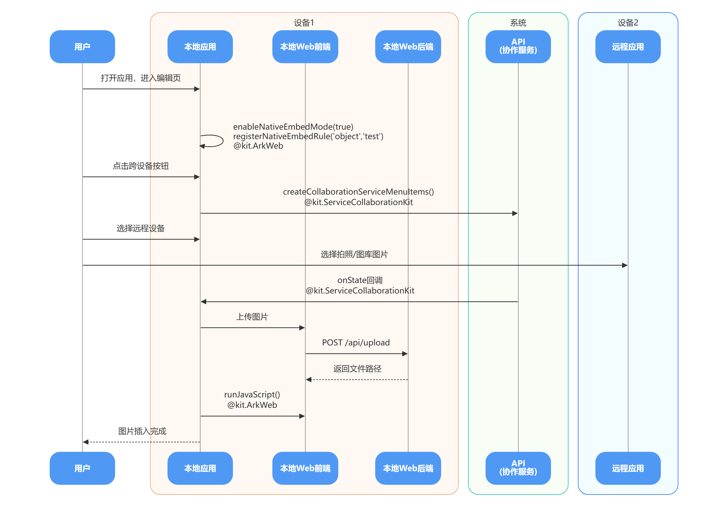
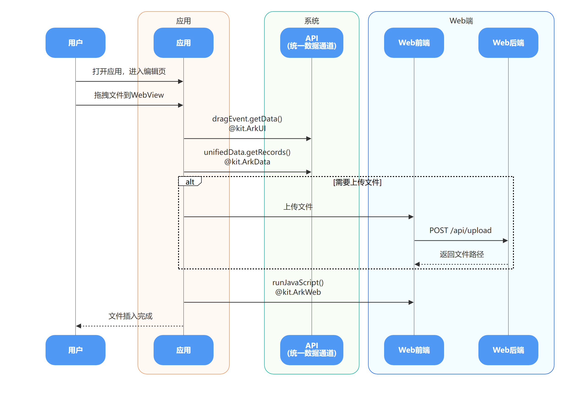
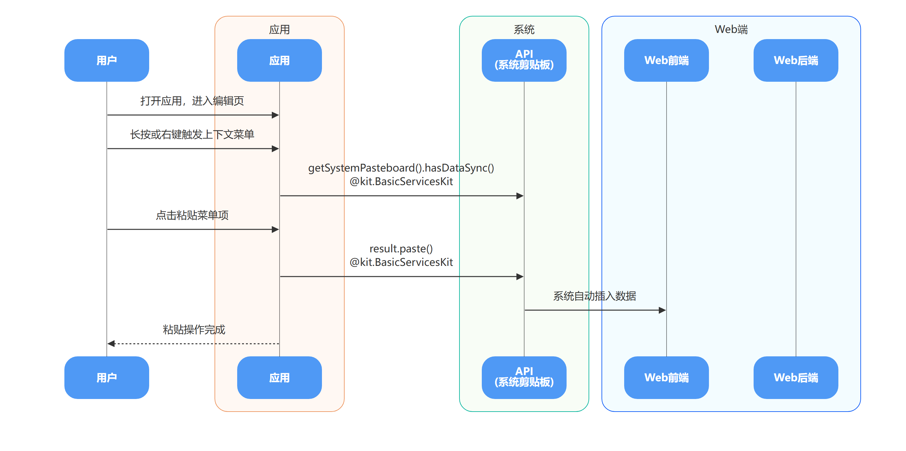
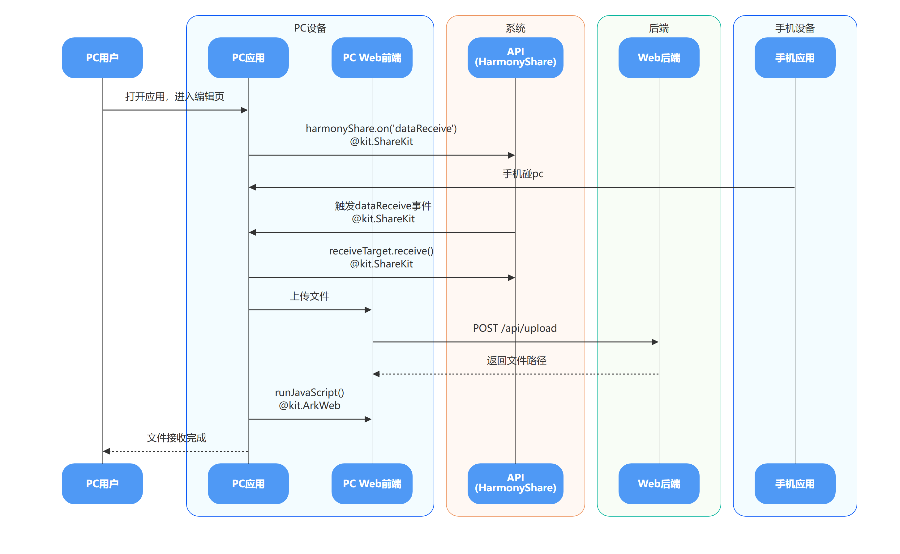
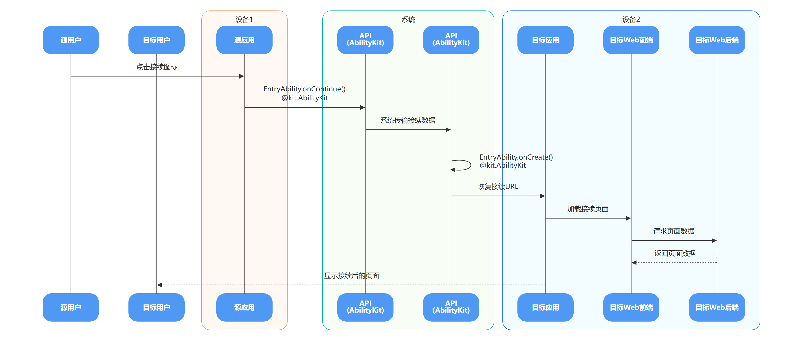
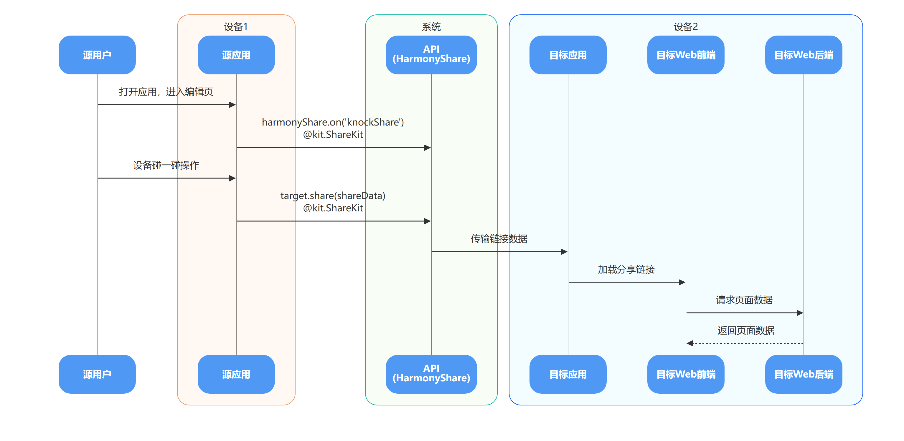
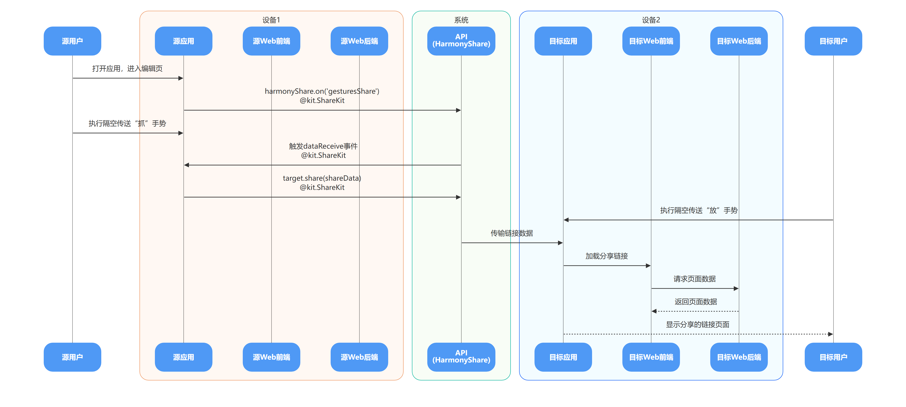

# 办公编辑全场景协同最佳实践

更新时间：2026-05-22 09:46:30

来源：https://developer.huawei.com/consumer/cn/doc/best-practices/bpta-collaboration-office

#### 概述
全场景协同是鸿蒙（HarmonyOS）分布式能力的核心，通过整合多设备资源实现跨终端无缝体验。在办公编辑场景中，用户常需要在多台设备间协同操作，例如插入其他设备中的图片、将其他设备用作扩展屏以同时编辑多个文档，或在不同设备间切换。应用可通过接入全场景协同能力，帮助用户实现多设备协同工作，从而减少因设备切换带来的效率损耗与专注力分散，让用户更聚焦于任务本身，而非设备间的数据传输与切换过程。
本文主要面向办公场景的开发者/产品经理，提供场景范例和开发指导，。在开始前，建议对ArkTS项目有基础了解，若想调试开发本项目代码，建议有两台以上设备，目前全场景的能力暂不支持模拟器调试。
目前，在商务办公应用中，集成Web编辑页面已成为主流方案。然而，这一架构下应用侧与Web侧如何通信，正是全场景协同能力接入时面临的主要难点。本文将以集成Web编辑页面的应用为基础，介绍如何[插入其他设备的图文](#section94919784915)、[切换设备继续编辑](#section1099115610472)、[分享协作](#section1739891118221)，具体目录如下：
- [用户体验](#section11739191313401)：通过图文形式介绍应用按照本文建议接入后的具体体验提升，以及用户使用时的约束限制。
- [插入其他设备的图文](#section94919784915)：在办公编辑时，若需要来源于其他设备的图文数据，本章介绍应用如何通过不同方式快速获取其他设备的数据。
- [切换设备继续编辑](#section1099115610472)：随着使用场景的变化，例如上班路上通过手机编辑文档，到公司之后需要通过PC继续编辑时，适宜的办公设备亦会相应切换。本章介绍应用如何实现设备的快速切换编辑。
- [分享协作](#section1739891118221) ：办公编辑业务往往涉及多人协同，本章介绍应用如何实现通过设备间的互动快速邀请其他用户编辑文档。
- [示例代码](#section149086232359)：开发者可以下载安装，配合本文一起使用，也可自行调试和参考开发。

> [!NOTE] 说明
> 若应用不涉及Web页面集成，也可参考本文提供的体验设计及代码示例，将应用侧与Web交互步骤改为应用自身数据的获取与写入流程。

#### 用户体验
#### 体验

|  | 特性 | 特性体验 | 体验视频 |
| --- | --- | --- | --- |
| 插入其他设备图文 | 跨设备互通插入图片 | 1、用户使用平板/电脑打开应用。 2、点击应用跨设备互通按钮。 3、弹窗选择设备拍照/图库。 4、用其他设备拍照/选择插入的图片。 5、插入图片到文档中。 |  |
| 插入其他设备图文 | 碰一碰文件/图片插入 | 1、用户在电脑上打开应用。 2、通过手机碰PC窗口触发，手机向电脑传输图片/文件。 3、文档接收文件，图片直接展示，文件形成链接。 |  |
| 插入其他设备图文 | 跨设备剪贴板 | 1、用户使用两台/多台设备（至少包含一台电脑），均打开键鼠穿越，选择共享的设备。 2、复制图文。 3、粘贴选中图文到另一台设备的应用，图文正常落入。 |  |
| 插入其他设备图文 | 跨设备拖拽 | 1、用户使用两台/多台设备，均打开键鼠穿越，并链接鼠标。 2、拖拽图文到另一台设备的应用窗口。 3、图文正常落入。 |  |
| 切换设备继续编辑 | 应用接续 | 1、应用在源端设备打开，想切换到对端设备继续编辑。 2、点击对端设备docker栏应用图标。 3、对端设备正常打开文档。 |  |
| 分享协作 | 碰一碰邀请协同 | 1、用户A打开应用。 2、A的设备和B的设备之间相碰。 3、用户B的设备打开文档。 |  |
| 分享协作 | 隔空传送邀请协同 | 1、用户A打开应用。 2、用户A做隔空传送手势到用户B的设备，手势见场景介绍。 3、用户B的设备打开文档。 |  |

#### 使用限制

|  | 特性 | 设备版本 | 设备类型（垂域常见设备手机、平板、电脑） | 双端登录同一华为账号 | 双端打开WLAN 和蓝牙开关 | 设置配置 | 其他限制 |
| --- | --- | --- | --- | --- | --- | --- | --- |
| 插入其他设备图文 | 跨设备互通插入图片 | HarmonyOS NEXT Developer Preview0以上 | 本端设备：平板或电脑设备。 远端设备：具有相机能力的手机或平板设备。 | √ | √（条件允许时，建议双端设备接入同一个局域网，可提升唤醒相机的速度。） | 设置中开启“多设备协同 > 跨设备互通”功能 | 电脑设备可以调用平板和手机，平板可以调用手机，同类型设备不可调用。 |
| 碰一碰文件/图片插入 | 手机和pc均6.0及以上，手机nova畅想系列不支持 | 发起端设备：手机或折叠手机直板态 接收端设备：电脑设备 | √ | × | 双端在设置中开启“多设备协同 > 华为分享 > 更多华为分享设置 > 启用华为分享服务”功能 | 需要电脑打开应用窗口 对碰一碰的角度、手机壳厚度限制见使用约束。 |  |
| 跨设备剪贴板 | HarmonyOS NEXT Developer Preview0及以上 | 手机、平板、电脑 | √ | √ | 双端在设置中开启“多设备协同 > 跨设备剪贴板”功能 | / |  |
| 跨设备拖拽 | HarmonyOS NEXT Developer Preview0 | 必须有电脑设备接入，或者部分支持PC模式的平板设备接入 | √ | √ | 双端在设置中开启“多设备协同 > 键鼠穿越”功能 | / |  |
| 切换设备继续编辑 | 应用接续 | HarmonyOS NEXT Developer Preview0以上 | 手机、平板、电脑 | √ | √ | 双端在设置中开启“多设备协同 > 接续”功能 | / |
| 分享协作 | 碰一碰邀请协同 | 5.0及以上，nova畅想系列不支持 | 手机或折叠手机直板态 | × | √ | 双端在设置中开启“多设备协同 > 华为分享 > 更多华为分享设置 > 启用华为分享服务”功能 | 手机和电脑也可以进行链接分享，但双端需要登录同一个华为账号，且手机和电脑版本均需6.0及以上。 |
| 隔空传送邀请协同 | HarmonyOS 6.0.0 Beta1及以上版本 | 均支持 | × | × | 双端在设置中开启“多设备协同 > 华为分享 > 更多华为分享设置 > 启用华为分享服务”功能 | 设备型号限制见隔空传送支持的机型和版本说明。 |  |

#### 插入其他设备的图文
随着个人设备数量的增加，用户在某一设备上操作时，常需从其他设备获取图片或文字。鸿蒙系统提供了多种方式，简化用户操作，降低开发成本，实现设备间的数据直接传输，减少设备间的界限。本章节介绍如何通过不同方式快速获取其他设备的数据。

#### 跨设备互通插入图片
跨设备互通提供跨设备的相机、扫描和图库访问功能，平板或电脑设备能够调用手机的相机、扫描和图库功能，用户可借此功能快速向文档添加来自其他设备的图片。
**实现原理**
通过同层渲染在Web页面中嵌入按钮，点击后调用[createCollaborationServiceMenuItems()](https://developer.huawei.com/consumer/cn/doc/harmonyos-references/servicecollaboration-collaborationservice#createcollaborationservicemenuitems-1)创建设备选择菜单。使用对端设备执行操作（如拍照）后，通过[onState()](https://developer.huawei.com/consumer/cn/doc/harmonyos-references/servicecollaboration-collaborationservice#onstate)回调返回数据（Buffer或URI）。应用根据数据类型上传到服务器，再通过[runJavaScript()](https://developer.huawei.com/consumer/cn/doc/harmonyos-references/arkts-apis-webview-webviewcontroller#runjavascript)将图片插入Web编辑器。

**开发步骤**
1. web页面同层渲染。 在Web页面中标记需要同层渲染的HTML标签，在本案例中，使用object标签进行渲染，也可选择embed标签，可参考Web网页的同层渲染标签。 <object type="test" id="crossDeviceEmbed" class="crossDevice-btn" title="Cross-Device Share"></object> 应用侧使用enableNativeEmbedMode()开启同层渲染，并使用registerNativeEmbedRule()注册object标签，第二个参数'test'，需要与a步骤中HTML标签中的type值相同。 Web({
  src: `${this.viewModel.SERVER_URL}/edit.html?docId=${encodeURIComponent(this.getSafeDocIdForUrl())}`,
  controller: this.viewModel.controller
})
// ...
  .enableNativeEmbedMode(true)
  .registerNativeEmbedRule('object', 'test') 创建自定义组件，该ArkTS组件将会被渲染进Web页面中。 创建Component，封装Button按钮，并为按钮增加onClick()点击事件以响应用户手势，通过bindContextMenu()绑定菜单，第一个参数为显隐控制，响应点击事件。 @Component
struct CrossDeviceComponent {
  // Whether cross-device relay is active.
  @State isCrossDevice: boolean = false;
  // Builder params (position, size, onClick).
  @Prop param: CrossDeviceEmbedParams;

  build() {
 Button() {
 // ...
 }
 // ...
 .onClick(() => {
 this.isCrossDevice = true;
 })
 .bindContextMenu(this.isCrossDevice, crossDeviceMenu(), {
 aboutToDisappear: () => {
 this.isCrossDevice = false;
 }
 })
  }
} 将Component封装为Builder，以便后续调用。 /**
 * Builder for cross-device button content in native embed.
 */
@Builder
export function CrossDeviceEmbedBuilder(params: CrossDeviceEmbedParams) {
  CrossDeviceComponent({ param: params })
} 创建节点控制器NodeController，用于实现自定义节点的创建、显示、更新等操作的管理，并负责将自定义节点挂载到NodeContainer上。 重写makeNode()方法，创建UI节点：检查销毁状态，已销毁则返回null；如果根节点已存在，直接返回对应的FrameNode，否则创建新的BuilderNode并构建跨设备嵌入UI。 定义updateNode()，更新节点参数，调用根节点的update方法。 定义getEmbedId()，返回嵌入标识符。 定义setDestroy()，设置销毁状态，销毁时会清空根节点。 定义postEvent()，处理触摸事件，转发给根节点处理。 export class CrossDeviceNodeController extends NodeController {
  // Builder node for cross-device button UI.
  private rootNode: BuilderNode<CrossDeviceEmbedParams[]> | undefined | null = null;
  // Embed id from Web.
  private embedId: string = '';
  // Surface id for native embed.
  private surfaceId: string = '';
  // Render type (display/texture).
  private renderType: NodeRenderType = NodeRenderType.RENDER_TYPE_DISPLAY;
  // Node width in vp.
  private width: number = 0;
  // Node height in vp.
  private height: number = 0;
  // Whether controller is destroyed.
  private isDestroy: boolean = false;

  setRenderOption(params: NodeControllerParams): void {
 this.surfaceId = params.surfaceId;
 this.renderType = params.renderType;
 this.embedId = params.embedId;
 this.width = params.width;
 this.height = params.height;
  }

  makeNode(uiContext: UIContext): FrameNode | null {
 if (this.isDestroy) {
 return null;
 }
 if (this.rootNode) {
 return this.rootNode.getFrameNode();
 }
 this.rootNode = new BuilderNode(uiContext, {
 surfaceId: this.surfaceId,
 type: this.renderType
 });
 if (!this.rootNode) {
 return null;
 }
 this.rootNode.build(wrapBuilder(CrossDeviceEmbedBuilder), {
 width: this.width,
 height: this.height,
 });
 return this.rootNode.getFrameNode();
  }

  updateNode(arg: CrossDeviceEmbedParams): void {
 this.rootNode?.update(arg);
  }

  getEmbedId(): string {
 return this.embedId;
  }

  setDestroy(isDestroy: boolean): void {
 this.isDestroy = isDestroy;
 if (this.isDestroy) {
 this.rootNode = null;
 }
  }

  postEvent(event: TouchEvent | undefined): boolean {
 return (this.rootNode?.postTouchEvent(event) as boolean) ?? false;
  }
}  监听同层渲染的生命周期变化。 开启该功能后，当网页中存在同层渲染支持的标签时，ArkWeb内核会触发回调函数。开发者则需要调用onNativeEmbedLifecycleChange()来监听同层渲染标签的生命周期变化。Web的同层渲染标签创建、更新、销毁时，同层渲染组件也应创建、更新、销毁。 Web({
  src: `${this.viewModel.SERVER_URL}/edit.html?docId=${encodeURIComponent(this.getSafeDocIdForUrl())}`,
  controller: this.viewModel.controller
})
// ...
  .onNativeEmbedLifecycleChange((embed: NativeEmbedDataInfo) => {
 const componentId = embed.info?.id?.toString() ?? '';
 const uiContext = this.getUIContext();
 if (embed.status === NativeEmbedStatus.CREATE) {
 this.viewModel.embedLifecycleCreate(embed, uiContext, componentId);
 this.componentIdArr = [...this.componentIdArr, componentId];
 } else if (embed.status === NativeEmbedStatus.UPDATE) {
 this.viewModel.embedLifecycleUpdate(embed, uiContext, componentId, this.isCrossDevice)
 } else if (embed.status === NativeEmbedStatus.DESTROY) {
 hilog.info(Constant.HILOG_DOMAIN, LOG_TAG, `NativeEmbed destroy: ${componentId}`);
 this.viewModel.embedLifecycleDestroy(componentId);
 this.componentIdArr = this.componentIdArr.filter((id: string) => id !== componentId);
 }
  }) 组件创建： embedLifecycleCreate(embed: NativeEmbedDataInfo, uiContext: UIContext, componentId: string) {
  const params: NodeControllerParams = {
 surfaceId: embed.surfaceId as string,
 type: embed.info?.type as string,
 renderType: NodeRenderType.RENDER_TYPE_TEXTURE,
 embedId: embed.embedId as string,
 width: uiContext.px2vp(embed.info?.width ?? 0),
 height: uiContext.px2vp(embed.info?.height ?? 0),
  };
  const nodeController = new CrossDeviceNodeController();
  nodeController.setRenderOption(params);
  nodeController.setDestroy(false);
  this.nodeControllerMap.set(componentId, nodeController);
  this.widthMap.set(componentId, params.width);
  this.heightMap.set(componentId, params.height);
  let edges: Edges = {
 left: `${embed.info?.position?.x as number }px`,
 top: `${embed.info?.position?.y  as number }px`
  };
  this.positionMap.set(componentId, edges);
} 组件更新： embedLifecycleUpdate(embed: NativeEmbedDataInfo, uiContext: UIContext, componentId: string, isCrossDevice: boolean) {
  const nodeController = this.nodeControllerMap.get(componentId);
  let edges: Edges = {
 left: `${embed.info?.position?.x as number}px`,
 top: `${embed.info?.position?.y as number}px`
  };
  this.positionMap.set(componentId, edges);
  const width = uiContext.px2vp(embed.info?.width ?? 0);
  const height = uiContext.px2vp(embed.info?.height ?? 0);
  this.widthMap.set(componentId, width);
  this.heightMap.set(componentId, height);
  nodeController?.updateNode({
 width: width,
 height: height,
 crossButtonX: edges.left,
 crossButtonY: edges.top,
 isCrossDevice: isCrossDevice,
 onClick: () => {
 }
  });
} 组件销毁： embedLifecycleDestroy(componentId: string) {
  const nodeController = this.nodeControllerMap.get(componentId);
  nodeController?.setDestroy(true);
  this.nodeControllerMap.delete(componentId);
  this.positionMap.delete(componentId);
  this.widthMap.delete(componentId);
  this.heightMap.delete(componentId);
}
2. 跨设备服务互通菜单实现 构建列表选择器。createCollaborationServiceMenuItems()组件是设备列表选择器，需要在Menu组件内调用。用于显示组网内具有对应能力的设备列表。 @Builder
function crossDeviceMenu() {
  Menu() {
 // Add cross-device menu items, supporting up to 5 images.
 createCollaborationServiceMenuItems([CollaborationServiceFilter.ALL], 5)
  }
} 在页面中弹窗提示对端应用状态，并实现onState()方法作为数据接收回调。该方法接收三个参数：stateCode表示操作完成状态，bufferType表示回传的数据类型，buffer为回传的数据内容。在回调中调用应用封装的webViewHelper.doInsertPicture() 方法，将数据传递至Web端。 // Cross-device communication state dialog component.
CollaborationServiceStateDialog({
  onState: (stateCode: number, bufferType: string, buffer: ArrayBuffer): void => {
 this.webViewHelper.doInsertPicture(stateCode, bufferType, buffer);
  }
})
3. web的图片插入 实现doInsertPicture()，最终将文件进行封装为WebFileData，使用runJavaScript()执行web端的函数。 /**
 * Process image data returned from remote device
 * @param stateCode Completion status code
 * @param bufferType Returned data type
 * @param buffer Returned image data
 */
public doInsertPicture(stateCode: number, bufferType: string, buffer: ArrayBuffer): void {
  // ...
 this.viewModel.handleCrossDeviceImage(buffer, `cross-device-image-${Date.now()}.jpg`, 'image/jpeg')
 .then(() => {
 // Show success message.
 this.showToast('Image added to editor');
 })
 // ...
} public async handleCrossDeviceImage(buffer: ArrayBuffer, fileName: string, mimeType: string): Promise&lt;void&gt; {
  // ...
 const serverFilePath = await this.fileUploadUtil.uploadBufferToServer(buffer, fileName, mimeType);
 const webFileData: WebFileData = {
 uri: serverFilePath,
 mimeType: mimeType,
 fileName: fileName,
 title: fileName
 };
 hilog.info(Constant.HILOG_DOMAIN, LOG_TAG, 'Sending cross-device image to Web page, server path: %{public}s',
 serverFilePath);
 await this.controller.runJavaScript(`receiveFileToEditor(${JSON.stringify(webFileData)})`);
 // ...
} 图片注入前端页面，该步骤开发时由具体业务实现和原有的编辑器代码框架决定。前端网页获取arkts传递的uri参数，用于页面展示。 function registerReceiveFileToEditor() {
  window.receiveFileToEditor = function (fileData) {
 const parsedData = parseNativeFileData(fileData);
 if (!parsedData) {
 return;
 }
 ensureEditModeForNativeInsert();
 const editor = document.getElementById('editor');
 if (editor) {
 applyDropPositionIfSaved(editor);
 }
 const displayFileName = getDisplayFileNameFromParsedData(parsedData);
 const fileType = inferNativeFileType(parsedData);
 handleNativeFileByType(parsedData, fileType, displayFileName);
  };
}

#### 跨设备拖拽
拖拽能力允许用户自由的拖拽图文到其他窗口，在适配拖拽后，鸿蒙也自动支持跨设备拖拽。
**实现原理**
拖拽落入：
在WebView的 [onDrop()](https://developer.huawei.com/consumer/cn/doc/harmonyos-references/ts-universal-events-drag-drop#ondrop) 事件中，首先通过 [dragEvent.getData()](https://developer.huawei.com/consumer/cn/doc/harmonyos-references/ts-universal-events-drag-drop#getdata10)获取[UnifiedData](https://developer.huawei.com/consumer/cn/doc/harmonyos-references/ts-universal-events-drag-drop#unifieddata10) 对象。处理时遵循以下优先级：
1. 优先处理 HTML 类型数据：若存在，则解析 HTML，提取其中的图片，并按顺序插入文本和图片。
2. 若无 HTML 数据，则根据数据类型分别处理： -- 文本：直接插入； -- 图片、文件、视频：先上传，再插入； -- 超链接：直接插入  拖拽落入时序图如下：

拖拽拖出：
系统支持，无需适配。
**开发步骤**
1. web落入 自定义落入，使用onDrop()接口进行监听，当Web组件监听到拖拽落入时，将会触发此监听，应用应当处理拖拽数据。 Web({
  src: `${this.viewModel.SERVER_URL}/edit.html?docId=${encodeURIComponent(this.getSafeDocIdForUrl())}`,
  controller: this.viewModel.controller
})
// ...
  .onDrop((dragEvent?: DragEvent) => {
 hilog.info(Constant.HILOG_DOMAIN, LOG_TAG, 'Drag completed, start processing drag data.');
 this.isDraggingOver = false;
 if (dragEvent) {
 try {
 this.viewModel.processDragData(dragEvent)
 .then(() => {
 hilog.info(Constant.HILOG_DOMAIN, LOG_TAG, 'Successfully processed drag data.');
 })
 .catch((error: BusinessError) => {
 hilog.error(Constant.HILOG_DOMAIN, LOG_TAG, 'Failed to process drag data: %{public}d %{public}s',
 error.code, error.message);
 });
 } catch (error) {
 const err = error as BusinessError;
 hilog.error(Constant.HILOG_DOMAIN, LOG_TAG,
 'Failed to process drag event: %{public}d %{public}s', err.code,err.message);
 }
 }
  }) 数据处理 异步处理拖拽数据，当存在HTML数据时，优先处理HTML类型；无HTML数据时，支持文本、图片、文件、超链接、视频等多种数据类型，不同的类型使用不同的处理方式。 public async processDragData(dragEvent: DragEvent): Promise&lt;void&gt; {
  try {
 const unifiedData = dragEvent.getData();
 const records: unifiedDataChannel.UnifiedRecord[] = unifiedData.getRecords();

 // ...
 let processedCount = 0;
 const totalCount = records.length;

 // Check if there is any HTML type data.
 const hasHtmlData = records.some(record => 
 record.getType() === uniformTypeDescriptor.UniformDataType.HTML
 );
 // ...

 for (const record of records) {
 const recordType = record.getType();

 try {
 if (hasHtmlData) {
 // If there is HTML data, only process HTML type.
 if (recordType === uniformTypeDescriptor.UniformDataType.HTML) {
 hilog.info(Constant.HILOG_DOMAIN, LOG_TAG, 'Processing HTML type drag data (has HTML data)');
 await this.processHtmlDrag(record as unifiedDataChannel.HTML);
 processedCount++;
 } else {
 // For other types, just log and do not process.
 hilog.info(Constant.HILOG_DOMAIN, LOG_TAG,
 `Skipping non-HTML drag data type when HTML exists: ${recordType}`);
 }
 } else {
 // If no HTML data, process all types as before.
 hilog.info(Constant.HILOG_DOMAIN, LOG_TAG, `Processing non-HTML drag data type: ${recordType}`);

 if (recordType === uniformTypeDescriptor.UniformDataType.TEXT ||
 recordType === uniformTypeDescriptor.UniformDataType.PLAIN_TEXT) {
 // Process text drag.
 await this.processTextDrag(record as unifiedDataChannel.PlainText);
 processedCount++;
 } else if (recordType === uniformTypeDescriptor.UniformDataType.IMAGE) {
 // Process image drag.
 await this.processImageDrag(record as unifiedDataChannel.Image);
 processedCount++;
 } else if (recordType === uniformTypeDescriptor.UniformDataType.FILE) {
 // Process file drag.
 await this.processFileDrag(record as unifiedDataChannel.File);
 processedCount++;
 } else if (recordType === uniformTypeDescriptor.UniformDataType.HYPERLINK) {
 let hyperLinkUds =
 record.getEntry(uniformTypeDescriptor.UniformDataType.HYPERLINK) as uniformDataStruct.Hyperlink;
 if (hyperLinkUds) {
 let url = hyperLinkUds.url;
 let text = hyperLinkUds.description ?? url;
 hilog.info(Constant.HILOG_DOMAIN, LOG_TAG, `Received hyperlink drag: url=${url}, text=${text}`);
 await this.processHyperlinkDrag(url, text);
 processedCount++;
 }
 } else if (recordType === uniformTypeDescriptor.UniformDataType.VIDEO) {
 const fileUriUds =
 record.getEntry(uniformTypeDescriptor.UniformDataType.FILE_URI) as uniformDataStruct.FileUri;
 if (fileUriUds) {
 let uri = fileUriUds.oriUri;
 hilog.info(Constant.HILOG_DOMAIN, LOG_TAG, `Received video drag: uri=${uri}`);
 await this.processVideoDrag(uri);
 processedCount++;
 }
 } else {
 hilog.warn(Constant.HILOG_DOMAIN, LOG_TAG, `Unsupported drag data type: ${recordType}`);
 }
 }
 } catch (recordError) {
 // ...
 }
 }
 // ...
  } catch (error) {
 // ...
  }
} 数据处理，以图片拖拽为例。先通过uploadFileToServer()将本地图片URI上传到服务器，再通过runJavaScript()注入方式将文件信息传递给前端编辑器。 private async processImageDrag(imageRecord: unifiedDataChannel.Image): Promise&lt;void&gt; {
  const imageUri = imageRecord.imageUri;
  // ...
  try {
 // Generate unique file name.
 const fileName = `drag-image-${Date.now()}.jpg`;
 const mimeType = 'image/jpeg';

 // Upload image to server using URI.
 const serverFilePath = await this.fileUploadUtil.uploadFileToServer(imageUri, fileName, mimeType);
 hilog.info(Constant.HILOG_DOMAIN, LOG_TAG, `Image uploaded to server: ${serverFilePath}`);

 // Send the image URL to the web editor.
 const fileInfo: FileInfo = {
 uri: serverFilePath,
 mimeType: mimeType,
 fileName: fileName,
 title: fileName
 };
 await this.controller.runJavaScript(`receiveFileToEditor(${JSON.stringify(fileInfo)})`);
  } catch (error) {
 // ...
  }
}
2. web拖出 ArkWeb目前支持以下四种数据格式。应用按照H5标准设置这些格式的拖拽数据，即可将内容拖拽到其他应用中。 数据格式  说明 text/plain  文本 text/uri-list  链接 text/html  HTML格式 Files  文件 手机不支持web内容拖出。

#### 跨设备剪贴板
**实现原理**
首先获取剪贴板权限，通过[onContextMenuShow()](https://developer.huawei.com/consumer/cn/doc/harmonyos-references/arkts-basic-components-web-events#oncontextmenushow9)显示上下文菜单，使用[getSystemPasteboard().hasDataSync()](https://developer.huawei.com/consumer/cn/doc/harmonyos-references/js-apis-pasteboard#hasdatasync11)检查剪贴板是否有数据。用户点击粘贴后调用[result.paste()](https://developer.huawei.com/consumer/cn/doc/harmonyos-references/arkts-basic-components-web-webcontextmenuresult#paste9)，系统自动将剪贴板内容插入WebView。

**开发步骤**
1. 复制数据 复制与粘贴的常用快捷键系统默认已经适配，开发不需要适配，电脑端Web组件左键/长按需要适配弹窗。
2. 粘贴数据 授权获取，通过checkAccessTokenSync()检测是否由剪贴板权限。 // Use synchronous method to get application bundle info.
const bundleInfo: bundleManager.BundleInfo =
  bundleManager.getBundleInfoForSelfSync(bundleManager.BundleFlag.GET_BUNDLE_INFO_WITH_APPLICATION);
const appInfo: bundleManager.ApplicationInfo = bundleInfo.appInfo;
tokenId = appInfo.accessTokenId;

// Use synchronous method to check permission.
const permissionStatus = atManager.checkAccessTokenSync(tokenId, 'ohos.permission.READ_PASTEBOARD');
hasPermission = permissionStatus === abilityAccessCtrl.GrantStatus.PERMISSION_GRANTED; 通过requestPermissionsFromUser()获取授权。 const requestResult =
  await atManager.requestPermissionsFromUser(context, ['ohos.permission.READ_PASTEBOARD']); 获取上下文菜单。 创建弹出Menu，是以垂直列表形式显示的菜单，会垂直展示MenuItem子组件。 @Builder
MenuBuilder() {
  Menu() {
 MenuItem({
 symbolStartIcon: new SymbolGlyphModifier(\$r('sys.symbol.plus_square_on_square')),
 content: \$r('app.string.copy'),
 labelInfo: \$r('app.string.copy_info')
 })
 // ...
 .onClick(() => {
 this.result?.copy();
 this.showMenu = false;
 })
 MenuItem({
 symbolStartIcon: new SymbolGlyphModifier(\$r('sys.symbol.plus_square_dashed_on_square')),
 content: \$r('app.string.paste'),
 labelInfo: \$r('app.string.paste_info')
 })
 // ...
 .onClick(() => {
 this.result?.paste();
 this.showMenu = false;
 })
 MenuItem({
 symbolStartIcon: new SymbolGlyphModifier(\$r('sys.symbol.checkmark_square_on_square')),
 content: \$r('app.string.select_all'),
 labelInfo: \$r('app.string.select_all_info')
 })
 // ...
 .onClick(() => {
 this.result?.selectAll();
 this.showMenu = false;
 })
  }
  // ...
} Web组件绑定onContextMenuShow()回调，其中param为WebContextMenuParam类型，包含点击位置对应HTML元素信息和位置信息，result为WebContextMenuResult类型，提供常见的菜单能力。回调返回false表示触发的自定义菜单无效，以允许自定义显示上下文菜单，通过bindPopup()绑定展示。 Web({
  src: `${this.viewModel.SERVER_URL}/edit.html?docId=${encodeURIComponent(this.getSafeDocIdForUrl())}`,
  controller: this.viewModel.controller
})
// ...
  .onContextMenuShow((event) => {
 if (this.deviceType === 'phone') {
 return false;
 }
 this.result = event.result;
 const flags = event.param.getEditStateFlags();
 this.canCopy = (flags & ContextMenuEditStateFlags.CAN_COPY) !== 0;
 this.canPaste = false;
 try {
 let hasData = pasteboard.getSystemPasteboard().hasDataSync();
 this.canPaste = (flags & ContextMenuEditStateFlags.CAN_PASTE) !== 0 && hasData;
 } catch (error) {
 const err = error as BusinessError;
 hilog.error(Constant.HILOG_DOMAIN, LOG_TAG, `Failed to check clipboard data: ${err.code} ${err.message}`);
 }
 this.showMenu = true;
 this.offsetX = Math.max(this.getUIContext().px2vp(event?.param.x() ?? 0) - 0, 0);
 this.offsetY = Math.max(this.getUIContext().px2vp(event?.param.y() ?? 0) - 0, 0);
 return true;
  })
  .bindPopup(this.showMenu,
 {
 builder: this.MenuBuilder(),
 enableArrow: false,
 placement: Placement.LeftTop,
 offset: { x: this.offsetX, y: this.offsetY },
 mask: false,
 onStateChange: async (e) => {
 let result = false;
 if (e.isVisible) {
 result = await PermissionUtil.checkAndRequestPasteboardPermission(this.context);
 }
 if (!result || !e.isVisible) {
 this.showMenu = false;
 try {
 this.result?.closeContextMenu();
 } catch (error) {
 const err = error as BusinessError;
 hilog.error(Constant.HILOG_DOMAIN, LOG_TAG,
 `Failed to close context menu: ${err.code} ${err.message}`);
 }
 }
 }
 })

#### 碰一碰文件/图片插入
**实现原理**
编辑页加载时注册[on('dataReceive')](https://developer.huawei.com/consumer/cn/doc/harmonyos-references/share-harmony-share#ondatareceive)监听，支持指定MEDIA和FILE类型。电脑端通过碰一碰发送文件后触发回调，调用[receiveTarget.receive()](https://developer.huawei.com/consumer/cn/doc/harmonyos-references/share-harmony-share#receive)接收数据。解析[getRecords()](https://developer.huawei.com/consumer/cn/doc/harmonyos-references/share-system-share#getrecords)获取文件URI，上传到服务器后通过[runJavaScript()](https://developer.huawei.com/consumer/cn/doc/harmonyos-references/arkts-apis-webview-webviewcontroller#runjavascript)插入编辑器。

**开发步骤**
1. 使用[canIUse()](https://developer.huawei.com/consumer/cn/doc/harmonyos-references/js-apis-syscap#caniuse)判断是否可以使用接口。 if (!canIUse('SystemCapability.Collaboration.HarmonyShare')) {
  hilog.error(Constant.HILOG_DOMAIN, LOG_TAG, 'Device does not support HarmonyShare functionality');
  return;
}
2. 注册监听事件on('dataReceive')实现应用沙箱接收文件。该方法需要传入当前应用的窗口ID，并且需要传入capabilities属性，以表示当前应用支持接收的文件标准化数据类型及其最大接收数量，该属性不能传入空数组。 // Use correct dataReceive event listening, implemented according to example structure.
harmonyShare.on('dataReceive', {
  windowId: mainWindowID,
  capabilities: [
 {
 'utd': uniformTypeDescriptor.UniformDataType.MEDIA,
 'maxSupportedCount': 5
 },
 {
 'utd': uniformTypeDescriptor.UniformDataType.FILE,
 'maxSupportedCount': 5
 }
  ]
}, (receiveTarget: harmonyShare.ReceivableTarget) => {
  hilog.info(Constant.HILOG_DOMAIN, LOG_TAG,
 `Received dataReceive event, receiveTarget: ${JSON.stringify(receiveTarget)}`);

  if (!this.context) {
 return;
  }

  receiveTarget.receive(fileUri.getUriFromPath(this.context.filesDir), {
 onDataReceived: (shareData: systemShare.SharedData) => {
 hilog.info(Constant.HILOG_DOMAIN, LOG_TAG,
 `Received shared data, shareData: ${JSON.stringify(shareData)}`);

 let shareRecords = shareData.getRecords();
 shareRecords.forEach((record: systemShare.SharedRecord) => {
 if (!record.uri) {
 return;
 }

 // Extract file name from uri (decode for correct display e.g. Chinese).
 const rawName = record.uri.split('/').pop() || 'Unknown file';
 let fileName: string;
 try {
 fileName = decodeURIComponent(rawName);
 } catch {
 fileName = rawName;
 }

 // Determine MIME type based on file name extension, not relying on record.mimeType.
 let mimeType = 'application/octet-stream'; // Default MIME type.
 const ext = fileName.split('.').pop()?.toLowerCase() || '';

 const mimeTypes = Constant.KNOCK_MIME_TYPES;

 // Get corresponding MIME type from mapping table.
 if (mimeTypes[ext]) {
 mimeType = mimeTypes[ext];
 }

 // Build fileData object suitable for web.
 const fileData: FileData = {
 data: record.uri,
 mimeType: mimeType,
 title: record.title || fileName,
 description: record.description || '',
 content: record.content,
 fileName: fileName,
 dataType: 'uri'
 };

 hilog.info(Constant.HILOG_DOMAIN, LOG_TAG, `Parsed file data: ${JSON.stringify(fileData)}`);
 // Call callback function, pass file data to application layer.
 callback(fileData);
 });
 },
 onResult(resultCode: number) {
 if (resultCode === 0) {
 hilog.info(Constant.HILOG_DOMAIN, LOG_TAG, 'File received successfully');
 } else {
 hilog.error(Constant.HILOG_DOMAIN, LOG_TAG, `Failed to receive file, result code: ${resultCode}`);
 }
 }
  });
3. 将沙箱图片上传到web侧。 public async sendFileToWeb(fileData: FileData): Promise&lt;void&gt; {
  if (fileData && fileData.data) {
 try {
 // ...
 const serverFilePath = await this.fileUploadUtil.uploadFileToServer(fileData.data, fileData.fileName,
 fileData.mimeType);
 const webFileData: WebFileData = {
 uri: serverFilePath,
 mimeType: fileData.mimeType,
 fileName: fileData.fileName,
 title: fileData.title
 };
 // ...
 } catch (error) {
 // ...
 }
  }
}

#### 切换设备继续编辑
#### 应用接续
**实现原理**
源端在[onContinue()](https://developer.huawei.com/consumer/cn/doc/harmonyos-references/js-apis-app-ability-uiability#oncontinue)中获取当前WebView的URL并保存到wantParam.webUrl，系统传输到目标设备。目标设备在[onCreate()](https://developer.huawei.com/consumer/cn/doc/harmonyos-references/js-apis-app-ability-uiability#oncreate)/[onNewWant()](https://developer.huawei.com/consumer/cn/doc/harmonyos-references/js-apis-app-ability-uiability#onnewwant)中检测launchReason.CONTINUATION，从want.parameters获取URL，设置给continuationUrl静态变量。页面加载时检查continuationUrl，若为编辑页则调用loadUrl加载接续URL。

**开发步骤**
1. 开启应用接续能力。 若应用需要接续的不同设备存在于多个hap打包中，可参考支持同应用中不同Ability跨端迁移进行配置，以支持不同hap包之间的应用接续。   {
  "module": {
 // ...
 "abilities": [
 {
 // ...
 "continuable": true,
 // ...
 }
 ],
 // ...
  }
}
2. 在源端UIAbility中实现[onContinue()](https://developer.huawei.com/consumer/cn/doc/harmonyos-references/js-apis-app-ability-uiability#oncontinue)接口，这里需要保存迁移数据（网页地址）到want.param中。 若需要接续的数据大于100KB或需要文件接续时，使用分布式数据对象迁移数据。   onContinue(wantParam: Record<string, Object>): AbilityConstant.OnContinueResult |
Promise&lt;AbilityConstant.OnContinueResult&gt; {
  // ...
 // Get current edit page ViewModel (Web controller lives there).
 const viewModel = EditViewModel.getInstance();

 if (viewModel) {
 const currentUrl = viewModel.controller.getUrl();
 wantParam.webUrl = currentUrl;
 } else {
 hilog.warn(Constant.HILOG_DOMAIN, LOG_TAG, 'No current EditViewModel instance available.');
 }
 // ...
  return AbilityConstant.OnContinueResult.AGREE;
}
3. 实现在[onCreate()](https://developer.huawei.com/consumer/cn/doc/harmonyos-references/js-apis-app-ability-uiability#oncreate)与[onNewWant()](https://developer.huawei.com/consumer/cn/doc/harmonyos-references/js-apis-app-ability-uiability#onnewwant)生命周期中恢复数据。 onCreate(want: Want, launchParam: AbilityConstant.LaunchParam): void {
  // ...
  // Check if it's launched from continuation - use launchParam.launchReason.
  if (launchParam.launchReason === AbilityConstant.LaunchReason.CONTINUATION) {
 // When restoring from continuation, get the saved Web browsing progress data.
 this.restoreWebProgress(want);
  }
  // ...
} onNewWant(want: Want, launchParam: AbilityConstant.LaunchParam): void {
  // ...
  // Check if it's launched from continuation - use launchParam.launchReason.
  if (launchParam.launchReason === AbilityConstant.LaunchReason.CONTINUATION) {
 // When restoring from continuation, get the saved Web browsing progress data.
 this.restoreWebProgress(want);
  }
  // ...
} restoreWebProgress(want: Want): void {
  try {
 // Get saved webUrl.
 const webUrl = want.parameters?.webUrl;
 if (webUrl && typeof webUrl === 'string') {
 // Save continuation URL to static variable, handled by page's aboutToAppear.
 IndexViewModel.getInstance().continuationUrl = webUrl;
 hilog.info(Constant.HILOG_DOMAIN, LOG_TAG, 'Saved continuation URL: %{public}s.', webUrl);
 } else {
 hilog.warn(Constant.HILOG_DOMAIN, LOG_TAG, 'No webUrl found in want parameters.');
 }
  } catch (error) {
 const err = error as BusinessError;
 hilog.error(Constant.HILOG_DOMAIN, LOG_TAG, 'Failed to restore web progress. Cause: %{public}s.', err.message);
  }
  try {
 this.context.restoreWindowStage(new LocalStorage());
  } catch (error) {
 const err = error as BusinessError;
 hilog.error(Constant.HILOG_DOMAIN, LOG_TAG,
 'Failed to restore window stage. Cause: %{public}s.', JSON.stringify(err));
  }
}

#### 分享协作
#### 碰一碰邀请协同
**实现原理**
初始化时注册[on('knockShare')](https://developer.huawei.com/consumer/cn/doc/harmonyos-references/share-harmony-share#onknockshare-1)事件监听。用户触发分享时保存当前文档URL和docId。设备碰一碰或执行手势后触发事件，优先使用预保存缩略图，创建SharedData对象（类型为HYPERLINK）并调用[SharableTarget.share()](https://developer.huawei.com/consumer/cn/doc/harmonyos-references/share-harmony-share#share)分享链接。

**开发步骤**
1. 配置App Linking服务。App Linking的配置和使用开发者可以参考[使用App Linking实现应用间跳转](https://developer.huawei.com/consumer/cn/doc/harmonyos-guides/app-linking-startup)。 {
  "module": {
 // ...
 "abilities": [
 {
 // ...
 "exported": true,
 // ...
 "skills": [
 {
 "entities": [
 "entity.system.home",
 // entities must contain "entity.system.browsable"
 "entity.system.browsable"
 ],
 "actions": [
 "ohos.want.action.home",
 // Actions must contain "ohos.want.action.viewData"
 "ohos.want.action.viewData"
 ],
 "uris": [
 {
 // The scheme must be configured as https
 "scheme": "https",
 // The host must be configured as the associated domain name
 "host": "www.example.com",
 "path": ""
 }
 ],
 // domainVerify must be set to true
 "domainVerify": true
 }
 ]
 }
 ],
 // ...
  }
}
2. 注册碰一碰事件的监听on('knockShare')和取消监听[off('knockShare')](https://developer.huawei.com/consumer/cn/doc/harmonyos-references/share-harmony-share#offknockshare-1)。 建议进入页面时，在aboutToAppear()和onPageShow()回调中注册监听；离开页面（包括应用退至后台等情况）时，建议在onPageHide()方法中及时取消监听，避免资源浪费和异常触发。 注册监听和取消监听的时机非常重要，如果设置错误将无法触发碰一碰功能或者触发后无法正常分享。   if (canIUse('SystemCapability.Collaboration.HarmonyShare')) {
  window.getLastWindow(this.context).then((windowData) => {
 try {
 this.windowId = windowData.getWindowProperties().id;
 // Listen for knock-to-share events.
 harmonyShare.on('knockShare', { windowId: this.windowId }, (target) => {
 this.handleKnockShare(target);
 });
 hilog.info(Constant.HILOG_DOMAIN, LOG_TAG, 'Knock-to-share listening started');
 } catch (err) {
 let error = err as BusinessError;
 hilog.error(Constant.HILOG_DOMAIN, LOG_TAG,
 `Failed to start knock-to-share listening: ${error.code} ${error.message}`);
 }
  }).catch((error: BusinessError) => {
 hilog.error(Constant.HILOG_DOMAIN, LOG_TAG, `Failed to get window: ${error.code} ${error.message}`);
  });
} else {
  hilog.info(Constant.HILOG_DOMAIN, LOG_TAG, 'Device does not support HarmonyShare functionality');
} if (canIUse('SystemCapability.Collaboration.HarmonyShare') && this.windowId > 0) {
  try {
 harmonyShare.off('knockShare', { windowId: this.windowId });
 hilog.info(Constant.HILOG_DOMAIN, LOG_TAG, 'Knock-to-share listening stopped');
  } catch (err) {
 let error = err as BusinessError;
 hilog.error(Constant.HILOG_DOMAIN, LOG_TAG,
 `Failed to stop knock-to-share listening: ${error.code} ${error.message}`);
  }
}
3. 加载预览图和发起分享。 先使用预保存的预览图进行分享，同时通过预览图延迟更新的能力获取页面截图作为预览图，当完成截图后，调用sharableTarget.updateShareData()刷新预览图。 let thumbnailUri: string | undefined;
const docIdSafe = this.docIdToShare && CommonUtil.isSafeDocIdForPath(this.docIdToShare);
const thumbnailPath = (this.context && docIdSafe) ?
  `${this.context.tempDir}/thumbnails/${this.docIdToShare}.jpeg` : '';
if (thumbnailPath && fileIo.accessSync(thumbnailPath)) {
  thumbnailUri = fileUri.getUriFromPath(thumbnailPath);
  hilog.info(Constant.HILOG_DOMAIN, LOG_TAG, `Using pre-saved thumbnail: ${thumbnailUri}`);
} else if (this.context && this.uiContext) {
  // Fallback: capture component snapshot for thumbnail.
  const timestamp = new Date().getTime();
  const sandboxPath = `${this.context.tempDir}/snapshots/snapshot_${timestamp}.jpeg`;
  CommonUtil.captureComponentSnapshot(Constant.COMPONENT_ID_EDIT, this.uiContext, sandboxPath);
  thumbnailUri = fileUri.getUriFromPath(sandboxPath);
  setTimeout(() => {
 try {
 hilog.info(Constant.HILOG_DOMAIN, LOG_TAG, 'Link updateShareData thumbnailUri');
 target.updateShareData({
 thumbnailUri: thumbnailUri
 });
 } catch (error) {
 const err = error as BusinessError;
 hilog.error(Constant.HILOG_DOMAIN, LOG_TAG,
 `updateShareData thumbnailUri failed: ${err.code} ${err.message}`);
 }
  }, 3000);
  hilog.info(Constant.HILOG_DOMAIN, LOG_TAG, `Component snapshot captured: ${thumbnailUri}`);
} 调用sharableTarget.share()方法发起分享，并设置分享卡片的信息，包括数据类型（utd）、content（数据内容）、标题（title）、描述（description）和缩略图URI（thumbnailUri）。这些参数将用于生成特定的卡片模板。 // Create link share data.
const shareData: systemShare.SharedData = new systemShare.SharedData({
  // Set share data type to link.
  utd: uniformTypeDescriptor.UniformDataType.HYPERLINK,
  // Share document link.
  content: this.linkToShare,
  title: 'Online Editor Document',
  thumbnailUri: thumbnailUri,
  description: Constant.SHARE_DEFAULT_DESCRIPTION
});
// Initiate sharing.
target.share(shareData)
  .then(() => {
 hilog.info(Constant.HILOG_DOMAIN, LOG_TAG, 'Link shared successfully');
  })
  .catch((error: BusinessError) => {
 hilog.error(Constant.HILOG_DOMAIN, LOG_TAG,
 `Failed to share link. Error code: ${error.code}, error message: ${error.message}`);
  });
4. （对端已安装应用）对端在[onCreate()](https://developer.huawei.com/consumer/cn/doc/harmonyos-references/js-apis-app-ability-uiability#oncreate)与[onNewWant()](https://developer.huawei.com/consumer/cn/doc/harmonyos-references/js-apis-app-ability-uiability#onnewwant)生命周期中获取链接，并进行跳转。 onCreate(want: Want, launchParam: AbilityConstant.LaunchParam): void {
  // ...
  this.getShareData(want);
}

onNewWant(want: Want, launchParam: AbilityConstant.LaunchParam): void {
  // ...
  this.getShareData(want);
} private getShareData(want: Want) {
  let uri = want?.uri;
  if (uri && typeof uri === 'string') {
 // Only accept continuation URLs that point to our own server and edit page.
 if (this.isSafeContinuationUrl(uri)) {
 IndexViewModel.getInstance().continuationUrl = uri;
 hilog.info(Constant.HILOG_DOMAIN, LOG_TAG, 'Saved safe continuation URL from share: %{public}s.', uri);
 } else {
 hilog.warn(Constant.HILOG_DOMAIN, LOG_TAG,
 'Rejected unsafe continuation URL from share (potential XSS or external site): %{public}s.', uri);
 }
  }
}
5. （对端未安装应用）为提升用户未安装应用时的体验，可配置[通过直达应用市场能力跳转至应用市场下载详情页](https://developer.huawei.com/consumer/cn/doc/harmonyos-guides/applinking-direct-to-ag)功能，引导用户下载安装应用。配置完成后，当对端收到源端分享的App Linking链接时，若设备未安装目标应用，系统将直接跳转至应用市场的应用详情页，支持一键下载安装。 同时，需要实现通过延迟链接跳转至应用详情页功能，确保安装后首次启动可直达内容。安装完应用之后，开发者可以在用户首次打开应用时，使用延迟链接，直接跳转到视频播放页面，这一流程不仅优化了用户体验，还有助于提升链接的转化率。

#### 隔空传送邀请协同
**实现原理**
初始化时注册[on('gesturesShare')](https://developer.huawei.com/consumer/cn/doc/harmonyos-references/share-harmony-share#ongesturesshare-1)事件监听。用户触发分享时保存当前文档URL和docId。设 备检测到隔空手势后触发事件，构建[SharedRecord](https://developer.huawei.com/consumer/cn/doc/harmonyos-references/share-system-share#sharedrecord)对象，并调用SharableTarget.share()分享链接。

**开发步骤**
1. 使用on('gesturesShare')监听，使用[off('gesturesShare')](https://developer.huawei.com/consumer/cn/doc/harmonyos-references/share-harmony-share#offgesturesshare-1)方法取消监听。 建议进入页面时，aboutToAppear()和onPageShow()回调中注册监听；离开页面（包括应用退至后台等情况）时，比如在onPageHide()方法中及时取消监听，避免资源浪费和异常触发。 注册监听和取消监听的时机非常重要，如果设置错误将无法触发碰一碰功能或者触发后无法正常分享。   if (canIUse('SystemCapability.Collaboration.HarmonyShare')) {
  window.getLastWindow(this.context).then((windowData) => {
 // ...
 harmonyShare.on('gesturesShare', { windowId: this.windowId }, (target) => {
 this.handleGestureShare(target);
 });
 // ...
  }).catch((error: BusinessError) => {
 // ...
  });
} else {
  // ...

} if (canIUse('SystemCapability.Collaboration.HarmonyShare')) {
  // ...
 harmonyShare.off('gesturesShare', { windowId: this.windowId });
 // ...
}
2. 调用sharableTarget.share()方法发起分享，并设置分享卡片的信息，包括数据类型（utd）、content（数据内容）、标题（title）、描述（description）和缩略图URI（thumbnailUri）。这些参数将用于生成特定的卡片模板。 private handleGestureShare(target: harmonyShare.SharableTarget): void {
  // ...
 let shareData: systemShare.SharedData = new systemShare.SharedData({
 // Set share data type to link.
 utd: uniformTypeDescriptor.UniformDataType.HYPERLINK,
 content: this.linkToShare,
 title: 'Online Editor Document',
 thumbnailUri: this.getThumbnailUri(),
 description: Constant.SHARE_DEFAULT_DESCRIPTION
 });

 target.share(shareData).then(() => {
 hilog.info(Constant.HILOG_DOMAIN, LOG_TAG, 'Link shared successfully.');
 if (this.shareCallback) {
 this.shareCallback('link', this.linkToShare);
 }
 }).catch((error: BusinessError) => {
 hilog.error(
 Constant.HILOG_DOMAIN,
 LOG_TAG,
 `Failed to share link. Error code: ${error.code}, Error message: ${error.message}.`
 );
 });
 // ...
}
3. 对端拉起和引导下载，和碰一碰邀请协同[第4步](#li616744215363)和[第5步](#li474162221318)相同。

#### 示例代码
- [基于ArkWeb和自由流转实现办公编辑协同](https://gitcode.com/HarmonyOS_Samples/OnlineEditorCollaboration)