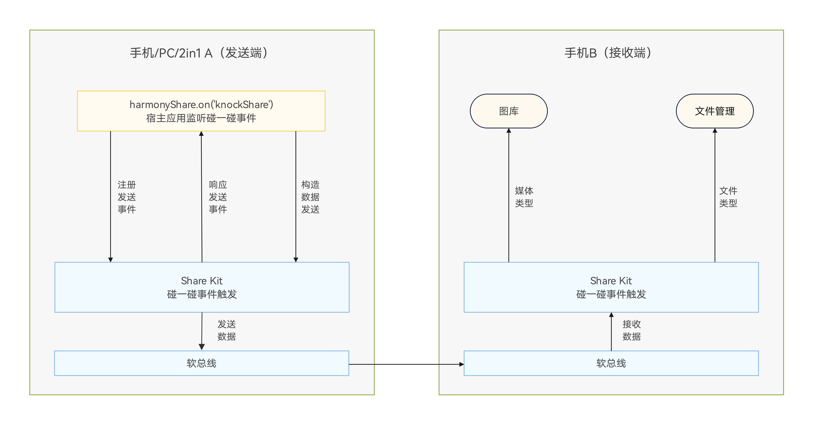
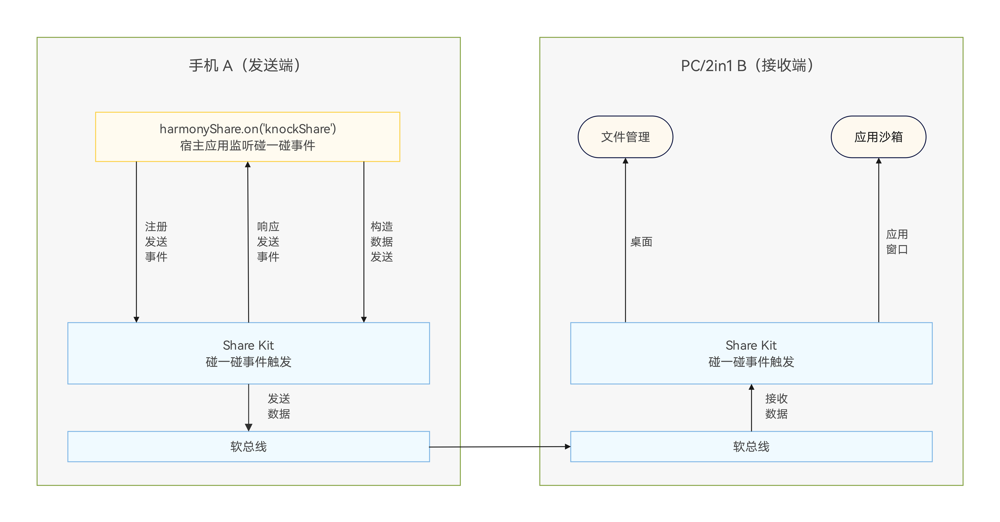

# 碰一碰文件分享

更新时间：2026-05-18 00:55:31

来源：https://developer.huawei.com/consumer/cn/doc/best-practices/bpta-application-knock-file-share

#### 概述
随着消费者终端设备不断增加，不同设备间进行文本分享（链接、文本等）和文件分享（图片、视频、文档等）已成为用户日常生活中不可或缺的需求。HarmonyOS通过[Share Kit（分享服务）](https://developer.huawei.com/consumer/cn/doc/harmonyos-guides/share-introduction)提供便捷的分享功能，其中“碰一碰”分享功能使用户能够轻松实现跨设备分享。本文将重点介绍应用如何实现碰一碰文件分享。

#### 特性体验
目前HarmonyOS 6.0.0 Beta1及以上版本的手机和PC/2in1支持两种触碰形式：手机碰手机和手机碰PC/2in1。由于设备形态和操作系统的限制，这两种形式具有不同的特性和体验。

> [!NOTE] 说明
> 手机与手机碰一碰对华为账号无要求，而手机与PC/2in1碰一碰则需登录同一华为账号方可进行分享。


|  | 手机碰手机 | 手机碰PC/2in1 |
| --- | --- | --- |
| 手机发送 | 通过手机顶部的相碰触发，文件被设备接收，接收端将媒体文件存储到图库中，非媒体文件存储到文件管理器中。 | 通过手机顶部与PC/2in1窗口的相碰触发，使用约束详见手机与PC/2in1碰一碰分享概述使用约束章节，文件应被窗口所属的应用接收，统一存储入沙箱文件中。 |
| 手机接收 | 通过手机顶部与PC/2in1窗口的相碰触发，使用约束详见手机与PC/2in1碰一碰分享概述使用约束章节，文件被手机设备接收，接收端将媒体文件存储到图库中，非媒体文件存储到文件管理器中。 |  |

#### 实现原理


碰一碰文件分享基于华为分享服务，通过手机与手机碰一碰或手机与PC/2in1屏幕碰一碰实现文件的跨端传输。应用需实现监听方法[on('knockShare')](https://developer.huawei.com/consumer/cn/doc/harmonyos-references/share-harmony-share#onknockshare)，用户触发碰一碰后即可分享文件至对方设备。文件接收则由分享服务按照[规则](https://developer.huawei.com/consumer/cn/doc/harmonyos-guides/share-access-one-step)处理，存储于图库或文件管理中。


PC/2in1设备除了可以默认碰一碰将文件保存到文件管理中，应用还可以注册监听文件接收接口[on('dataReceive')](https://developer.huawei.com/consumer/cn/doc/harmonyos-references/share-harmony-share#ondatareceive)方法，手机分享的文件将存储于应用沙箱目录下。详情可参考[手机与手机碰一碰分享](https://developer.huawei.com/consumer/cn/doc/harmonyos-guides/knock-share-between-phones)、[手机与PC/2in1碰一碰分享](https://developer.huawei.com/consumer/cn/doc/harmonyos-guides/knock-share-pc-phones)。

#### 开发步骤
#### 发起分享
1. 分享数据构建在分享数据时，分享发起方需要构建SharedRecord。在文件分享的场景中，发起方在构造此参数时，必须传入uri和utd这两个属性。其中，uri属性仅在文件分享场景中为必填项，而在内容分享场景下content属性则为必填项，uri属性不需要传值。  uri是指要分享的文件URI，而非文件路径，例如沙箱路径content.fileDir，应通过fileUri.getUriFromPath()获取其URI。utd则是当前文件的标准化数据类型，需要传入准确的值，以便系统匹配精确的目标应用，推荐使用uniformTypeDescriptor.getUniformDataTypeByFilenameExtension()方法，通过给定的文件后缀名查询标准化数据类型的ID，详情可见不同类型分享数据构建。  /**
 * Knock listening callback.
 *
 * @param target After the Huawei Share event is triggered,
 * you can call back the parameters and share them across devices.
 */
public immersiveCallback(target: harmonyShare.SharableTarget) {
  let fileShare = AppStorage.get('KnockFileShare_fileShare') as number[];
  let videoDataList = AppStorage.get('KnockFileShare_videoDataList') as FileData[];
  if (!fileShare || fileShare.length === 0) {
 return;
  }
  let shareData: systemShare.SharedData = new systemShare.SharedData(this.getShareRecord(videoDataList[fileShare[0]]));
  for (let i = 1; i < fileShare.length; i++) {
 try {
 shareData.addRecord(this.getShareRecord(videoDataList[fileShare[i]]));
 } catch (e) {
 hilog.error(0x0000, 'KnockFileShare', `addRecord failed ${JSON.stringify(e)}`);
 }
  }
  target.share(shareData);
}

/**
 * Get shared data.
 *
 * @param data File data to be shared.
 * @returns systemShare.SharedRecord.
 */
getShareRecord(data: FileData): systemShare.SharedRecord {
  let suffix = '.' + data.url.split('.').pop();
  // Obtain the UTD through the file extension.
  let utd = uniformTypeDescriptor.getUniformDataTypeByFilenameExtension(suffix);
  hilog.info(0x0000, 'KnockFileShare', `getShareRecord utd ${utd}`)
  return {
 utd: utd,
 uri: data.url,
 thumbnailUri: data.thumbnail,
 title: data.name,
 description: data.description
  };
}
2. 分享注册华为分享模块提供了碰一碰分享事件的监听方法on('knockShare')。在回调中调用this.immersiveCallback()方法，实现分享数据的构建，并通过sharableTarget.share()方法传输文件数据，完成碰一碰文件分享流程。 分享模块也同样提供了取消监听的方法off('knockShare')，当应用不需要碰一碰分享文件或离开页面（包括应用退至后台等情况）时，应及时调用取消监听的方法，以避免资源浪费和异常触发。 需要注意的是，PC端的碰一碰事件监听和取消监听需要传入窗口的ID，如immersiveListeningPC()和immersiveDisableListeningPC()方法所示。 /**
 *  Add knock listening.
 */
public immersiveListening() {
  if (canIUse('SystemCapability.Collaboration.HarmonyShare')) {
 harmonyShare.on('knockShare', (target: harmonyShare.SharableTarget) => {
 this.immersiveCallback(target);
 });
  }
}

/**
 *  Add knock listening in 2in1 device type.
 */
public immersiveListeningPC() {
  if (canIUse('SystemCapability.Collaboration.HarmonyShare')) {
 window.getLastWindow(this.context).then((data) => {
 let mainWindowID: number = data.getWindowProperties().id;
 harmonyShare.on('knockShare', { windowId: mainWindowID }, (target: harmonyShare.SharableTarget) => {
 this.immersiveCallback(target);
 });
 }).catch((error: BusinessError) => {
 hilog.error(0x0000, 'KnockFileShare', `getLastWindow failed ${JSON.stringify(error)}`);
 });
  }
}

/**
 *  remove knock listening.
 */
public immersiveDisableListening() {
  if (canIUse('SystemCapability.Collaboration.HarmonyShare')) {
 harmonyShare.off('knockShare');
  }
}

/**
 *  remove knock listening.
 */
public immersiveDisableListeningPC() {
  if (canIUse('SystemCapability.Collaboration.HarmonyShare')) {
 window.getLastWindow(this.context).then((data) => {
 let mainWindowID: number = data.getWindowProperties().id;
 harmonyShare.off('knockShare', { windowId: mainWindowID });
 }).catch((error: BusinessError) => {
 hilog.error(0x0000, 'KnockFileShare', `getLastWindow failed ${JSON.stringify(error)}`);
 });
  }
}

#### 接收文件
[华为分享](https://developer.huawei.com/consumer/cn/doc/harmonyos-references/share-harmony-share)模块提供了harmonyShare.on('dataReceive')方法，用于实现应用沙箱接收文件的事件监听。请注意当前接口仅在2in1设备类型可以正常调用，其他设备类型会返回801错误码。
PC/2in1应用可以通过监听harmonyShare.on('dataReceive')方法来实现应用沙箱接收文件。该方法需要传入当前应用的窗口ID，并且需要传入capabilities属性，以表示当前应用支持接收的文件标准化数据类型及其最大接收数量，该属性不能传入空数组。
在dataReceive回调方法中，通过receiveTarget.receive()传入应用接收文件的沙箱路径。当应用接收到碰一碰分享的文件后，会触发onDataReceived回调，开发者可以通过回调参数shareData.getRecords()获取分享的数据，当碰一碰接收事件结束后，将响应onResult回调，通过参数resultCode判断分享接收事件是否成功。

```ArkTS
/**
 * Add dataReceive listening in 2in1 device type.
 */
public dataReceiveListeningPC() {
  if (!canIUse('SystemCapability.Collaboration.HarmonyShare')) {
    return;
  }
  window.getLastWindow(this.context).then(((data) => {
    let mainWindowID: number = data.getWindowProperties().id;
    harmonyShare.on('dataReceive', { windowId: mainWindowID, capabilities: [
      {
        'utd': uniformTypeDescriptor.UniformDataType.MEDIA,
        'maxSupportedCount': 5
      },
      {
        'utd': uniformTypeDescriptor.UniformDataType.FILE,
        'maxSupportedCount': 5
      }
    ] },
      (receiveTarget: harmonyShare.ReceivableTarget) => {
        if (!this.context) {
          return;
        }
        // Process the received file data.
        receiveTarget.receive(fileUri.getUriFromPath(this.context.filesDir), {
          onDataReceived: (shareData: systemShare.SharedData) => {
            let shareRecords = shareData.getRecords();
            let videoDataList = AppStorage.get('KnockFileShare_videoDataList') as FileData[];
            shareRecords.forEach(async (record: systemShare.SharedRecord) => {
              if (!record.uri) {
                return;
              }
              // Get video thumbnails.
              let fileName = record.uri.split('/').pop()?.split('.')[0];
              let thumbPath: string = videoDataList[0].thumbnail;
              if (record.uri.endsWith('mp4') || record.uri.endsWith('mkv')) {
                thumbPath = record.uri.slice(0, record.uri.lastIndexOf('.')) + 'thumb.png';
                let result = await new FileUtil().getVideoThumbnail(record.uri, thumbPath);
                if (!result) {
                  thumbPath = videoDataList[0].thumbnail;
                }
              } else if (record.uri.endsWith('png') || record.uri.endsWith('jpg') || record.uri.endsWith('jpeg')) {
                thumbPath = record.uri;
              } else {
                thumbPath = videoDataList[0].thumbnail;
              }

              videoDataList.push({
                url: record.uri,
                name: fileName,
                description: record.description,
                thumbnail: thumbPath,
                index: videoDataList.length
              });
            });
          },
          onResult(resultCode: harmonyShare.ShareResultCode) {
            if (resultCode === harmonyShare.ShareResultCode.SHARE_SUCCESS) {
              hilog.info(0x0000, 'KnockFileShare', 'receive file success');
            } else {
              hilog.error(0x0000, 'KnockFileShare', 'receive failed ' + resultCode);
            }
          }
        });
      });
  })).catch((error: BusinessError) => {
    hilog.error(0x0000, 'KnockFileShare', `failed to obtain the window. cause ${error.code} ${error.message}`);
  });
}
```

#### 系统拦截策略
碰一碰分享接收端接收数据时遵循统一规则，详情请参考[目标设备接收分享数据一步直达体验](https://developer.huawei.com/consumer/cn/doc/harmonyos-guides/share-access-one-step)。

#### 不同类型分享数据构建
碰一碰文件分享需要关注文件分享类型，在[发起分享](#section0997243321)时作为参数传入，系统提供标准化数据类型解决跨设备传输中的数据类型模糊问题，通过统一的数据格式标识，接收端可精准识别文件属性。例如图片自动匹配图库应用接收，文档类文件定向唤起文件管理器，实现数据与处理程序的自动绑定。当传入的分享参数的utd为uniformTypeDescriptor.UniformDataType.IMAGE时，且文件确认为图片文件，接收端会默认将其存储在图库中。当传入的utd为uniformTypeDescriptor.UniformDataType.FILE时，文件会默认存储到文件管理中。系统中预置了一部分常用类型，更多类型可参考[UTD预置列表](https://developer.huawei.com/consumer/cn/doc/harmonyos-guides/uniform-data-type-list)。

| 后缀名 | UTD-ID | MIMEType类型 | 说明 |
| --- | --- | --- | --- |
| .png | general.png | image/png | PNG图片类型。 |
| .jpg，.jpeg，.jpe | general.jpeg | image/jpeg | JPEG图片类型。 |
| .mp4，.mp4v，.mpeg4 | general.mpeg-4 | video/mp4，video/mp4v | MPEG-4视频类型。 |
| .avi，.vfw | general.avi | video/avi，video/msvideo，video/x-msvideo | AVI视频类型。 |
| .txt，.text | general.plain-text | text/plain | 未指定编码的文本类型，无修饰的文本。 |
| .doc | com.microsoft.word.doc | application/msword | Microsoft Word数据类型。 |
| .xls | com.microsoft.excel.xls | application/vnd.ms-excel | Microsoft Excel数据类型。 |
| .ppt | com.microsoft.powerpoint.ppt | application/vnd.ms-powerpoint | Microsoft PowerPoint演示文稿类型。 |
| ... | ... | ... | ... |

#### 常见问题
#### 数据在分享过程中被丢弃或者提示无效的数据类型
分享服务支持内容分享和文件分享两种场景，但不支持两者混合分享。在混合分享时，数据可能会在分享过程中丢失或提示无效的数据类型。详情可参考[分享数据类型不支持](https://developer.huawei.com/consumer/cn/doc/harmonyos-guides/share-faq-2)。

#### 示例代码
- [基于Share Kit实现碰一碰文件分享](https://gitcode.com/harmonyos_samples/KnockFileShare)