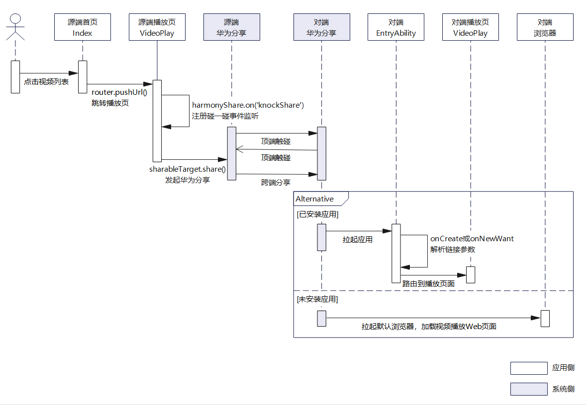
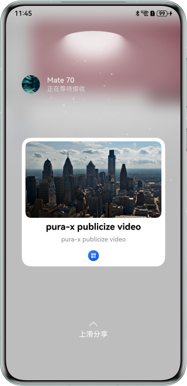
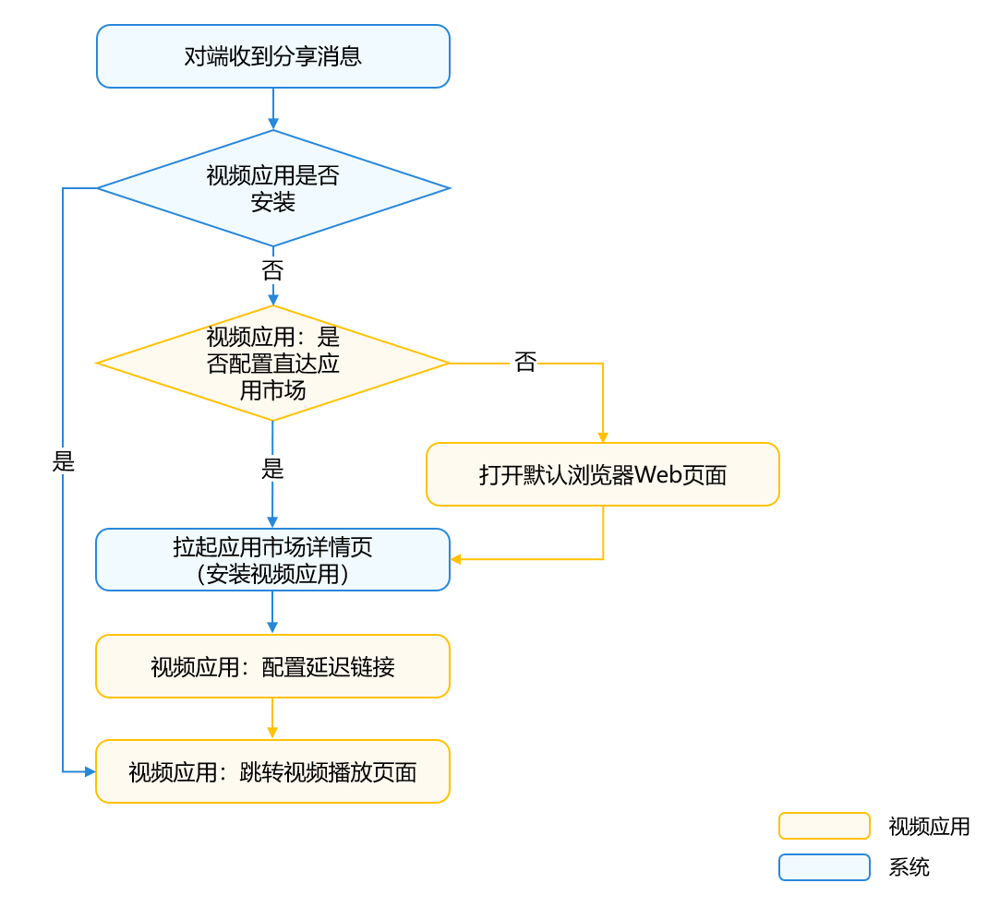

# 碰一碰链接分享

更新时间：2026-05-22 09:46:30

来源：https://developer.huawei.com/consumer/cn/doc/best-practices/bpta-application-knock-video-share

#### 概述

随着全场景智慧生活的不断演进，跨设备内容分享已成为用户的核心需求之一。传统分享方式普遍存在操作繁琐（需手动选择设备或应用）、依赖特定网络环境、传输效率低等问题，影响用户体验。HarmonyOS提供了[Share Kit（分享服务）](https://developer.huawei.com/consumer/cn/doc/harmonyos-guides/share-kit-guide)，并结合[App Linking](https://developer.huawei.com/consumer/cn/doc/harmonyos-guides/applinking-introduction)技术，可实现内容的快速跨设备分享，直达目标应用，无需依赖第三方应用中转，提供高效、便捷、无缝的分享体验。

本文以视频分享场景为例，详细介绍碰一碰快速分享视频的原理与开发步骤。


#### 典型场景

当用户在源端（发起碰一碰操作的设备）上使用视频应用播放视频时，可通过“碰一碰”功能将该视频分享至对端（接收分享的目标设备）。根据对端是否安装视频应用以及是否配置了直达应用市场，对端收到分享的视频之后，有如下三种场景：


#### 场景一：目标应用已安装

系统直接拉起目标应用视频播放页面播放视频，无需经过浏览器中转，实现一键直达，极大提高便捷度和转化率。


#### 场景二：目标应用未安装，已配置直达应用市场

当对端未安装目标应用且开发者配置了[直达应用市场](https://developer.huawei.com/consumer/cn/doc/harmonyos-guides/applinking-direct-to-ag)功能时，将直接跳转到应用市场的应用详情页。安装完成后，首次打开应用将通过[延迟链接](https://developer.huawei.com/consumer/cn/doc/harmonyos-guides/applinking-deferredlink)功能自动跳转到视频播放页面，无需用户重新搜索或操作。


#### 场景三：目标应用未安装，未配置直达应用市场（有Web页面）

对端收到分享的视频链接之后，系统通过浏览器打开Web页面，用户可直接查看内容。在Web页面可提供“下载”按钮，引导用户安装应用获取更佳体验，安装后仍可通过[延迟链接](https://developer.huawei.com/consumer/cn/doc/harmonyos-guides/applinking-deferredlink)直达原内容。


> [!NOTE]
> 对于不提供Web页面的应用，建议开启 直达应用市场 功能，避免因无法访问内容而造成体验断裂。


#### 实现原理

碰一碰视频分享功能主要依赖于Share Kit与App Linking实现，确保用户能够通过简单的设备接触快速分享内容并直达应用。首先，应用需要集成App Linking来保证从分享到打开的端到端体验流畅无阻，具体可参考：[使用App Linking实现应用间跳转](https://developer.huawei.com/consumer/cn/doc/harmonyos-guides/app-linking-startup)。

碰一碰视频分享后对端跳转目标应用的流程图如下，对端无论是否安装视频应用，用户都能获得连贯流畅的体验。





碰一碰视频分享时序图如下：





> [!NOTE]
> 碰一碰分享环境要求请参见 环境要求 。


#### 开发步骤

本章将详细介绍视频应用使用碰一碰分享App Linking实现直达应用，主要开发步骤如下：

 - [配置App Linking服务](#section97421941152319)


 - [碰一碰分享事件监听/取消](#section1261410588212)
 - [加载预览图和发起分享](#section89721840192313)
 - [对端跳转处理](#section3655631162511)


#### 配置App Linking服务

为了通过碰一碰分享实现直达应用的功能，应用需集成App Linking，以确保端到端体验的完整性。当碰一碰分享成功，对端收到源端分享的App Linking链接后，系统将根据链接配置自动拉起对应应用或浏览器，从而继续播放视频。

App Linking的配置和使用开发者可以参考[使用App Linking实现应用间跳转](https://developer.huawei.com/consumer/cn/doc/harmonyos-guides/app-linking-startup)。例如这里配置的App Linking的链接为：https://www.example.com，开发者需要在entry模块的module.json5进行如下配置：

```json
{
  "module": {
    // ...
    "abilities": [
      {
        "name": "EntryAbility",
        // ...
        "exported": true,
        "skills": [
          {
            "entities": [
              "entity.system.home",
              // entities must contain "entity.system.browsable"
              "entity.system.browsable"
            ],
            "actions": [
              "ohos.want.action.home",
              // Actions must contain "ohos.want.action.viewData"
              "ohos.want.action.viewData"
            ],
            "uris": [
              {
                // The scheme must be configured as https
                "scheme": "https",
                // The host must be configured as the associated domain name
                "host": "www.example.com",
                "path": ""
              }
            ],
            // domainVerify must be set to true
            "domainVerify": true
          }
        ]
      }
    ],
    // ...
  }
}
```


#### 碰一碰分享事件监听/取消

在视频播放页面中添加碰一碰分享事件的监听与取消功能前，需先使用[canIUse()](https://developer.huawei.com/consumer/cn/doc/harmonyos-references/js-apis-syscap#caniuse)接口判断设备是否支持该能力。下面将碰一碰分享的相关逻辑代码封装至KnockController类文件中，使碰一碰逻辑与UI界面分离，便于代码维护。

KnockController用于管理碰一碰事件监听的添加与取消，以及分享功能，支持手机和PC端碰一碰分享。它封装了[harmonyShare（华为分享）](https://developer.huawei.com/consumer/cn/doc/harmonyos-references/share-harmony-share)模块的相关方法，将碰一碰分享事件的监听[on('knockShare')](https://developer.huawei.com/consumer/cn/doc/harmonyos-references/share-harmony-share#onknockshare)、取消监听[off('knockShare')](https://developer.huawei.com/consumer/cn/doc/harmonyos-references/share-harmony-share#offknockshare)以及分享功能[share()](https://developer.huawei.com/consumer/cn/doc/harmonyos-references/share-harmony-share#share)分别进行了封装。需要注意的是PC端碰一碰事件的监听和取消监听需要传入窗口的ID，如immersiveListeningPC()和immersiveDisableListeningPC()方法所示。

```ArkTS
import { harmonyShare, systemShare } from '@kit.ShareKit';
import { fileUri } from '@kit.CoreFileKit';
import { BusinessError } from '@kit.BasicServicesKit';
import { uniformTypeDescriptor } from '@kit.ArkData';
import { common } from '@kit.AbilityKit';
// ...
export class KnockController {
  private static controller: KnockController;
  private context: common.UIAbilityContext | undefined = undefined;
  // Knock listening status
  private isKnockListening: boolean = false;

  public static getInstance(context: common.UIAbilityContext): KnockController {
    if (!KnockController.controller) {
      KnockController.controller = new KnockController(context);
    }
    return KnockController.controller;
  }

  constructor(context: common.UIAbilityContext) {
    this.context = context;
  }

  /**
   * knock listening callback
   * @param target After the Huawei Share event is triggered,
   * you can call back the parameters and share them across devices.
   */
  public immersiveCallback(target: harmonyShare.SharableTarget) {
    // ...
  }

  /**
   *  Add knock listening
   */
  public immersiveListening() {
    if (canIUse('SystemCapability.Collaboration.HarmonyShare') && !this.isKnockListening) {
      harmonyShare.on('knockShare', (target: harmonyShare.SharableTarget) => {
        this.immersiveCallback(target);
      });
      this.isKnockListening = true;
    }
  }

  /**
   *  remove knock listening
   */
  public immersiveDisableListening() {
    if (canIUse('SystemCapability.Collaboration.HarmonyShare') && this.isKnockListening) {
      harmonyShare.off('knockShare');
      this.isKnockListening = false;
    }
  }

  /**
   *  Add knock listening in 2in1 device type.
   */
  public immersiveListeningPC() {
    try {
      if (canIUse('SystemCapability.Collaboration.HarmonyShare') && !this.isKnockListening) {
        window.getLastWindow(this.context).then((data) => {
          let mainWindowID: number = data.getWindowProperties().id;
          harmonyShare.on('knockShare', { windowId: mainWindowID }, (target: harmonyShare.SharableTarget) => {
            this.immersiveCallback(target);
          });
        })

        this.isKnockListening = true;
      }
    } catch (err) {
      let error = err as BusinessError;
      Logger.error(TAG, `getWindowProperties err, errCode: ${error.code}, error mesage: ${error.message}`);
    }
  }

  /**
   *  Remove knock listening in 2in1 device type.
   */
  public immersiveDisableListeningPC() {
    try {
      if (canIUse('SystemCapability.Collaboration.HarmonyShare') && this.isKnockListening) {
        window.getLastWindow(this.context).then((data) => {
          let mainWindowID: number = data.getWindowProperties().id;
          harmonyShare.off('knockShare', { windowId: mainWindowID });
        })

        this.isKnockListening = false;
      }
    } catch (err) {
      let error = err as BusinessError;
      Logger.error(TAG, `getWindowProperties err, errCode: ${error.code}, error mesage: ${error.message}`);
    }
  }
}
```

根据前文所述场景，碰一碰分享功能主要用于视频播放页面，因此需在VideoPlay.ets中添加相应的事件监听与取消操作。进入页面时，在aboutToAppear()和onPageShow()回调中注册监听；离开页面（包括应用退至后台等情况）时，比如在onPageHide()方法中及时调用immersiveDisableListening()方法取消监听，避免资源浪费和异常触发。

```ArkTS
import { common } from '@kit.AbilityKit';
import { KnockController } from '../controller/KnockController';
// ...
@Entry
@Component
struct VideoPlay {
  // ...
  aboutToAppear(): void {
    // ...
    let context: common.UIAbilityContext = this.getUIContext().getHostContext() as common.UIAbilityContext;
    this.knockController = KnockController.getInstance(context);
    if (deviceInfo.deviceType === '2in1') {
      this.knockController?.immersiveListeningPC();
    } else {
      this.knockController?.immersiveListening();
    }
  }
  // ...
  onPageShow(): void {
    if (deviceInfo.deviceType === '2in1') {
      this.knockController?.immersiveListeningPC();
    } else {
      this.knockController?.immersiveListening();
    }
  }

  onPageHide(): void {
    if (deviceInfo.deviceType === '2in1') {
      this.knockController?.immersiveDisableListeningPC();
    } else {
      this.knockController?.immersiveDisableListening();
    }
  }

  aboutToDisappear(): void {
    if (deviceInfo.deviceType === '2in1') {
      this.knockController?.immersiveDisableListeningPC();
    } else {
      this.knockController?.immersiveDisableListening();
    }
    this.videoIndex=0;
    // ...
  }
  // ...
}
```


> [!NOTE]
> 收到碰一碰分享事件回调后，需尽快调用 sharableTarget.share() 方法发起分享，超过3秒可能会失败。


#### 加载预览图和发起分享

收到碰一碰事件分享回调后，调用[sharableTarget.share()](https://developer.huawei.com/consumer/cn/doc/harmonyos-references/share-harmony-share#share)方法发起分享，并设置分享卡片的信息，包括标题（title）、描述（description）和缩略图URI（thumbnailUri）。这些参数将用于生成特定的卡片模板，详情可参考[通过分享面板发起分享](https://developer.huawei.com/consumer/cn/doc/harmonyos-guides/share-mobilephone-app-share)。

utd需要设置为utd.UniformDataType.HYPERLINK，表示分享的内容为链接；content设置为[配置App Linking服务](#section97421941152319)章节中配置的链接，链接中拼接视频的唯一标识符videoIndex。

```ArkTS
/**
 * knock listening callback
 * @param target After the Huawei Share event is triggered,
 * you can call back the parameters and share them across devices.
 */
public immersiveCallback(target: harmonyShare.SharableTarget) {
  // share app linking
  try {
    let videoIndex: number = AppStorage.get('videoIndex') as number;
    let videoData: VideoData = VIDEO_SOURCES[videoIndex];
    // Video thumbnail image sandbox path
    let filePath: string = this.context?.filesDir + `/${videoData.head}`;
    // Get video thumbnail URI path
    let coverUri: string = fileUri.getUriFromPath(filePath);
    let shareData: systemShare.SharedData = new systemShare.SharedData({
      // Set the shared data type to Link
      utd: uniformTypeDescriptor.UniformDataType.HYPERLINK,
      // The shared App Linking link is replaced with the real address here
      content: `https://www.example.com?videoIndex=${videoIndex}`,
      thumbnailUri: coverUri,
      title: videoData.name,
      description: videoData.description
    });
    // Initiate a share
    target.share(shareData).then(() => {
      Logger.info(TAG, 'Share link success');
    }).catch((error: BusinessError) => {
      Logger.error(TAG, `Share link  error. code: ${error.code}, message: ${error.message}`);
    });
  } catch (err) {
    Logger.error(TAG, `Share link exception. code: ${err.code}, message: ${err.message}`);
  }
}
```

> [!NOTE]
> 为了提升分享预览模板缩略图的清晰度和整体用户体验，建议开发者优先使用thumbnailUri参数来设置缩略图。虽然thumbnailUri和thumbnail两个参数均可用于实现缩略图效果，但是thumbnail参数由于大小限制为32KB，在实际应用中可能会导致图片模糊不清，从而影响用户体验。因此，采用thumbnailUri来指定高质量的缩略图是更为推荐的做法。


thumbnailUri仅支持沙箱文件URI或用户文件URI。若需将网络图片作为缩略图，请先将其下载并保存至应用沙箱内。下面的代码示例展示了如何将media目录下的图片保存到应用沙箱路径中，以便于后续图片分享操作。

```ArkTS
import { BusinessError } from '@kit.BasicServicesKit';
import { common } from '@kit.AbilityKit';
import { Logger } from './Logger';
import { fileIo } from '@kit.CoreFileKit';

const TAG = 'ImageUtil';

export class ImageUtil {
  /**
   * Save image to sandbox.
   * @param context UIAbility Context.
   */
  public static saveImage(context: common.UIAbilityContext) {
    try {
      [
        [context.resourceManager.getMediaContentSync($r('app.media.video_cover_0').id), '/video_cover_0.png'],
        [context.resourceManager.getMediaContentSync($r('app.media.video_cover_1').id), '/video_cover_1.png'],
        [context.resourceManager.getMediaContentSync($r('app.media.video_cover_2').id), '/video_cover_2.png'],
        [context.resourceManager.getMediaContentSync($r('app.media.video_cover_3').id), '/video_cover_3.png']
      ].forEach(item => {
        let file: fileIo.File | undefined = undefined;
        try {
          file = fileIo.openSync(context.filesDir + item[1], fileIo.OpenMode.READ_WRITE | fileIo.OpenMode.CREATE);
          let writeLen = fileIo.writeSync(file.fd, (item[0] as Uint8Array).buffer);
          Logger.info(TAG, `write data to file succeed and size is: ${writeLen}`);
        } catch (err) {
          Logger.error(TAG, `Failed to save image. code: ${err.code}, message: ${err.message}`);
        } finally {
          fileIo.closeSync(file);
        }
      })
    } catch (err) {
      let error = err as BusinessError;
      Logger.error(TAG, `saveImage err, errCode: ${error.code}, error mesage: ${error.message}`);
    }
  }
}
```

卡片效果图如下：


#### 对端跳转处理
1. 拉起应用       对端收到分享的App Linking之后，系统拉起应用时有以下两种情况：

  
 - 应用未在后台运行：此时跳转应用，应在onCreate()方法中获取链接中的视频唯一标识符videoIndex。         
```ArkTS
import { AbilityConstant, ConfigurationConstant, UIAbility, Want } from '@kit.AbilityKit';
import { BusinessError } from '@kit.BasicServicesKit';
import { window } from '@kit.ArkUI';
import { url } from '@kit.ArkTS';
import { Logger } from '../utils/Logger';

const TAG = 'EntryAbility';
export default class EntryAbility extends UIAbility {
  private uiContext: UIContext | undefined = undefined;
  private mVideoIndex: string = '';

  private getVideoIndex(want: Want): string {
    let uri = want?.uri;
    let videoIndex: string = '';
    // Parse the parameters to obtain the app linking
    if (uri) {
      try {
        let urlObject = url.URL.parseURL(want?.uri);
        videoIndex = urlObject.params.get('videoIndex') as string;
      } catch (err) {
        let error = err as BusinessError;
        Logger.error(TAG, `parseURL err, errCode: ${error.code}, error mesage: ${error.message}`);
      }
      Logger.info(TAG, `getAid aid:${videoIndex}`);
    }
    return videoIndex;
  }
  onCreate(want: Want, launchParam: AbilityConstant.LaunchParam): void {
    // ...
    this.mVideoIndex = this.getVideoIndex(want);
  }
  // ...
}
```
在onWindowStageCreate()回调中使用windowStage.loadContent()方法加载详情页的URL为“pages/VideoPlay”。

  
```ArkTS
onWindowStageCreate(windowStage: window.WindowStage): void {
  // ...
  let pageUrl: string = 'pages/Index';
  if (this.mVideoIndex && this.mVideoIndex !== '') {
    AppStorage.setOrCreate('videoIndex', Number.parseInt(this.mVideoIndex));
    pageUrl = 'pages/VideoPlay';
  }

  windowStage.loadContent(pageUrl, (err) => {
    // ...
    try {
      let windowObj = windowStage.getMainWindowSync();
      this.uiContext = windowObj.getUIContext();
    } catch (err) {
      let error = err as BusinessError;
      Logger.error(TAG, `getMainWindowSync err, errCode: ${error.code}, error mesage: ${error.message}`);
    }
  });
}
```


2. 应用已在后台运行：此时跳转应用，需在onNewWant()方法中获取链接中的视频唯一标识符videoIndex，并通过UIContext.getRouter().pushUrl()实现页面跳转。         
```ArkTS
export default class EntryAbility extends UIAbility {
  private uiContext: UIContext | undefined = undefined;
  private mVideoIndex: string = '';

  private getVideoIndex(want: Want): string {
    // ...
  }
  // ...
  onNewWant(want: Want, launchParam: AbilityConstant.LaunchParam): void {
    let videoIndex: string = this.getVideoIndex(want);
    if (videoIndex && videoIndex !== '') {
      let page = this.uiContext?.getRouter().getState();
      if (page?.name === 'VideoPlay') {
        AppStorage.setOrCreate('videoIndex', Number.parseInt(videoIndex));
      } else {
        this.uiContext?.getRouter().pushUrl({
          url: 'pages/VideoPlay',
          params: {
            videoIndex: videoIndex
          }
        }).catch((error: BusinessError) => {
          Logger.error(TAG, `pushUrl err, errCode: ${error.code}, error mesage: ${error.message}`);
        });
      }
    }
  }
  // ...
}
```


3. 获取视频的唯一标识符videoIndex后，在视频播放页面根据该videoIndex并播放相应的视频内容。         
```ArkTS
@Entry
@Component
struct VideoPlay {
  // ...
  @StorageLink('videoIndex') videoIndex: number = 0;
  // ...
  aboutToAppear(): void {
    let params = this.getUIContext().getRouter().getParams() as Record<string, string>;
    if (params && params.videoIndex) {
      this.videoIndex = Number.parseInt(params.videoIndex);
    }
    // ...
  }
  // ...
  build() {
    Column() {
      VideoPlayingView({
        videoList: VIDEO_SOURCES,
        videoIndex: this.videoIndex
      })
      // ...
    }
    .width('100%')
  }
}
```

 - 配置直达应用市场与延迟链接       为提升用户未安装应用时的体验，可配置[直达应用市场](https://developer.huawei.com/consumer/cn/doc/harmonyos-guides/applinking-direct-to-ag)功能，引导用户下载安装应用。配置完成后，当对端收到源端分享的App Linking链接时，若设备未安装目标应用，系统将直接跳转至应用市场的应用详情页，支持一键下载安装。

  


  同时，需要实现[延迟链接](https://developer.huawei.com/consumer/cn/doc/harmonyos-guides/applinking-deferredlink)功能，确保安装后首次启动可直达内容。安装完应用之后，开发者可以在用户首次打开应用时，使用延迟链接，直接跳转到视频播放页面，这一流程不仅优化了用户体验，还有助于提升链接的转化率。

  


  通过[deferredLink.popDeferredLink()](https://developer.huawei.com/consumer/cn/doc/harmonyos-references/applinking-deferredlink-api#popdeferredlink)接口获取原始App Linking链接，并根据解析该链接直接跳转至视频播放页面。

  
```ArkTS
@Entry
@Component
struct Index {
  // ...
  aboutToAppear(): void {
    // ...
    //Get the deferred link parameter and go to video play page
    deferredLink.popDeferredLink()
      .then((link: string) => {
        Logger.info(TAG, `Succeeded in getting deferred link, result: ${link}`);
        const videoIndex = url.URL.parseURL(link)?.params?.get('videoIndex') as string;
        if (videoIndex) {
          this.getUIContext().getRouter().pushUrl({
            url: 'pages/VideoPlay',
            params: { videoIndex }
          });
        }
      }).catch((error: BusinessError) => {
        Logger.error(TAG, `Failed to get deferred link. code: ${error.code}, message: ${error.message}`);
      });
  }
  // ...
}
```

 - Web页面开发与部署       当应用未安装且未配置直达应用市场时，系统会打开浏览器加载视频播放Web页面来播放视频，保证应用在未安装的情况下也能体验播放视频功能，特别是与[延迟链接](https://developer.huawei.com/consumer/cn/doc/harmonyos-guides/applinking-deferredlink)结合使用，详细请参见[Web页面开发与部署（可选）](https://developer.huawei.com/consumer/cn/doc/best-practices/bpta-social-share#section157709544229)。

  



#### 常见问题


#### 碰一碰分享后，目标应用无法拉起、Web视频播放页面无法跳转异常等

对端成功接收到源端分享的App Linking链接，但是未拉起目标应用，具体请查看[AGC上显示了配置成功，但是配置到目标方后无法拉起如何解决](https://developer.huawei.com/consumer/cn/doc/best-practices/bpta-social-share#section1057235918212)。Web视频播放页面跳转异常请参考[Web页面跳转应用异常](https://developer.huawei.com/consumer/cn/doc/best-practices/bpta-social-share#section129769325414)。

更多关于碰一碰分享之后对端跳转问题请参考[社交分享跳转：常见问题](https://developer.huawei.com/consumer/cn/doc/best-practices/bpta-social-share#section1181324774617)。


#### 碰一碰分享预览图模糊

碰一碰预览图模糊不清，可能是因为图片本身画质低或者使用了thumbnail参数来设置预览图，这种情况需要更换更高质量的图片，优先使用thumbnailUri参数来设置缩略图。因为thumbnail仅支持32KB以下大小的图片，无法保证预览图的高清。


#### 示例代码

 - [基于Share Kit实现碰一碰视频快速分享](https://gitcode.com/harmonyos_samples/knock-share)
