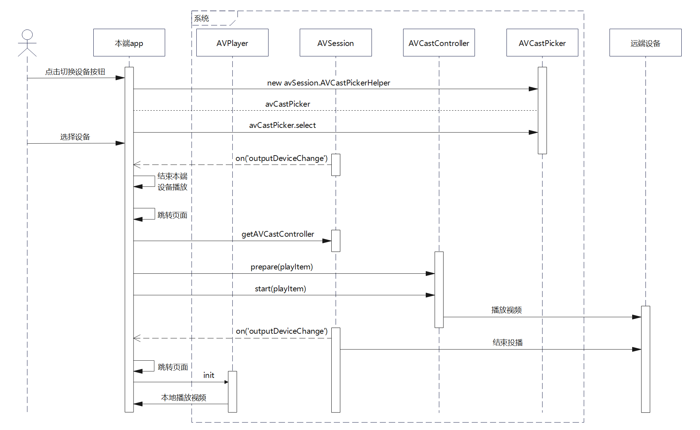
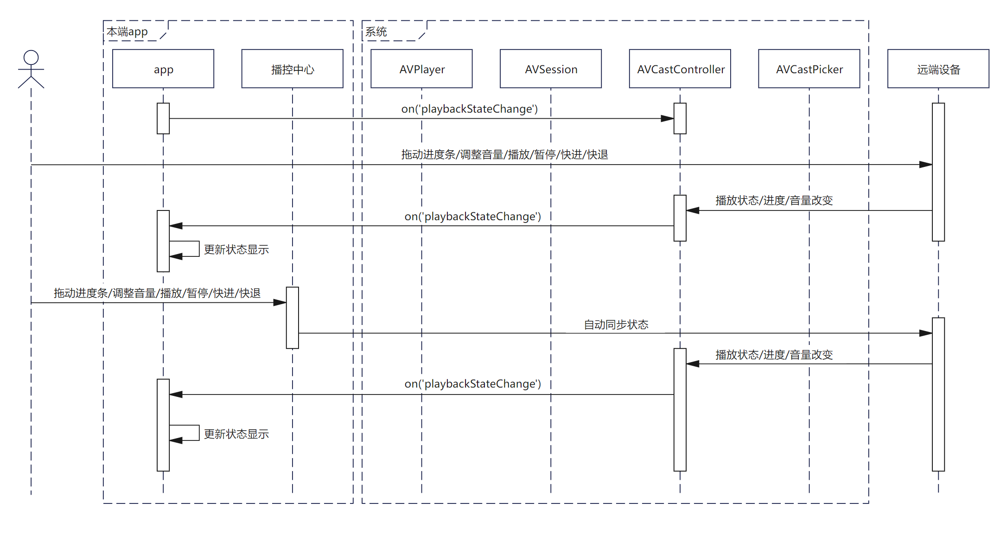
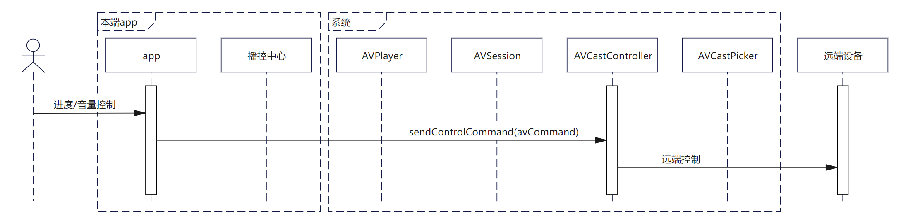

# 视频投播

更新时间：2026-04-01 09:49:00

来源：https://developer.huawei.com/consumer/cn/doc/best-practices/bpta-vdeocast

##### 概述

系统投播功能让用户能够轻松将手机上的音视频投放到其他设备（如PC/2in1设备、华为智慧屏）上继续播放，实现跨设备切换，带来流畅的观影体验。为简化开发流程，系统提供了标准化的音视频投播解决方案，开发者仅需配置资源信息、监听投播状态并实现播放控制（如播放、暂停），即可快速集成该功能。

本文将结合实际案例，详细介绍如何高效利用系统投播组件和接口实现视频投播，帮助开发者提升开发效率，包含如下关键步骤：

 - [接入播控中心](#section198061041155312)：播控中心系统提供的播放管理模块，可以后台管理应用播放任务，是投播接入的必备条件。
 - [本端控制远端设备状态](#section1850441982916)：手机端实现遥控器功能，直接控制远端设备的播放状态、进度、音量等。
 - [远端视频状态回传本端](#section13876193232918)：能够实时同步播放进度至手机端显示。
 - [视频资源切换](#section1133113013013)和[设备切换](#section6237193134112)：支持投播过程中集数的切换及投播设备的切换。


> [!NOTE]
> 设备限制： 详细版本、设备和使用限制见 约束与限制 。


##### 用户体验

**体验视频**


**用户体验路径**

本文案例提供本端播放和视频投播两种播放模式，体验路径和交互流程图如下。用户可以在本端和远端播放视频，在投播模式下，用户可以通过遥控界面实现快进/快退、切换上下集、音量调节（支持物理键控制）、进度条拖动跳转、选集切换控制功能，应用接入时，可根据实际需求参考本文实现，并按照[应用接入播控自检表](https://developer.huawei.com/consumer/cn/doc/harmonyos-guides/playback-control-access-checklist)完成基础功能验证，确保应用基础体验。

| 用户操作阶段 | 1、本端视频播放与控制 | 2、播控中心控制本端视频 | 3、接入投播 | 4、应用遥控远端设备 |
| --- | --- | --- | --- | --- |
| 预期行为 | 1、本端视频的正常播放。 2、本端视频的控制（切集、倍速、音量、进度等）。 | 1、播控中心状态与本端视频一致。 2、播放中心控制本端视频播放（切集、倍速、音量、进度等）。 | 1、初次链接认证。 2、选择设备。 | 1、本端状态与远端状态一致。 2、本端播控中心遥控远端设备播放（切集、倍速、音量、进度等）。 3、应用遥控远端设备播放（切集、倍速、音量、进度等）。 |
|    |  |  |  |  |


##### 实现原理

**名词解释**

| 概念 | 解释 |
| --- | --- |
| 媒体会话（AVSession） | 音视频管控服务，用于对系统中所有音视频行为进行统一的管理。 |
| 投播组件（AVCastPicker） | 系统级的投播组件，可嵌入应用界面的UI组件。当用户点击该组件后，系统将进行设备发现、连接、认证等流程，应用仅需要通过接口获取投播中相关的回调信息。 |
| 投播控制器（AVCastController） | 在投播后，由应用发起的用于控制远端播放的接口，包括播放、暂停、调节音量、设置播放模式、设置播放速度等能力。 |


投播功能通过AVSession建立设备连接，由AVCastController控制远端播放。详见[运作机制](https://developer.huawei.com/consumer/cn/doc/harmonyos-guides/distributed-playback-overview#运作机制)。





##### 模块设计

建议应用封装三个模块：

 - VideoPlayerController：应用封装的本地视频控制器，控制本端视频资源的暂停、播放、进度、音量、倍速。
 - VideoSessionController：应用封装的媒体会话控制器，本端视频播放时用于本应用与播控中心的同步、切换设备发起投播、结束投播。
 - VideoCastController：应用封装的投播视频控制器，控制远端设备视频资源的暂停、播放、进度、音量、倍速。


完成投播功能，建议参考如下流程接入，其中本端视频显示和控制可参考[视频播放组件](https://developer.huawei.com/consumer/cn/doc/harmonyos-guides/arkts-common-components-video-player)、[使用AVPlayer播放视频(ArkTS)](https://developer.huawei.com/consumer/cn/doc/harmonyos-guides/video-playback)、[使用AVPlayer播放视频(C/C++)](https://developer.huawei.com/consumer/cn/doc/harmonyos-guides/using-ndk-avplayer-for-video-playback)等视频实现方案根据功能诉求自行实现，本文从接入播控中心进行介绍。





##### 接入播控中心

投播功能依赖于播控中心，因此必须接入播控中心才能实现投播功能。播控中心不仅能够控制本端设备的播放，还能控制远端设备的播放。本章节将简要介绍应用接入播控中心的开发流程。





##### 媒体会话初始化
1. [avSession.createAVSession()](https://developer.huawei.com/consumer/cn/doc/harmonyos-references/arkts-apis-avsession-f#avsessioncreateavsession10)创建avsession，类型为video。
2. 设置后台长时播放任务，确保应用退至后台后播放不会停止。
3. [videoSession.setLaunchAbility()](https://developer.huawei.com/consumer/cn/doc/harmonyos-references/arkts-apis-avsession-avsession#setlaunchability10)设置一个WantAgent用于拉起会话的Ability。
4. [videoSession.activate()](https://developer.huawei.com/consumer/cn/doc/harmonyos-references/arkts-apis-avsession-avsession#activate10)激活videoSession。

```ArkTS
let videoSession = await avSession.createAVSession(context, 'VIDEO_SESSION', 'video');
// Set up a background task.
BackgroundTaskManager.startContinuousTask(context);
const wantAgentInfo: wantAgent.WantAgentInfo = {
  wants: [
    {
      bundleName: context.abilityInfo.bundleName,
      abilityName: context.abilityInfo.name
    }
  ],
  operationType: wantAgent.OperationType.START_ABILITIES,
  requestCode: 0,
  wantAgentFlags: [wantAgent.WantAgentFlags.UPDATE_PRESENT_FLAG]
};
let agent = wantAgent.getWantAgent(wantAgentInfo);
videoSession.setLaunchAbility(agent);
videoSession.activate();
return new VideoSessionController(videoSession);
```


##### 设置媒体会话元数据

[videoSession.setAVMetadata()](https://developer.huawei.com/consumer/cn/doc/harmonyos-references/arkts-apis-avsession-avsession#setavmetadata10)上传元数据，从而在播控中心界面进行展示。如媒体ID（assetId）、标题（title）、播控中心显示的图片（mediaImage）、媒体时长（duration）。

```ArkTS
let metadata: avSession.AVMetadata = {
  assetId: `${curSource.index}`,
  title: curSource.name,
  mediaImage: headPixel,
  duration: duration,
  filter: avSession.ProtocolType.TYPE_DLNA | avSession.ProtocolType.TYPE_CAST_PLUS_STREAM
};
await this.videoSession.setAVMetadata(metadata);
```


##### 本应用播放状态同步到播控中心

当设置元数据后，播控中心会显示进度条并自动计算播放进度，但播放状态变更（如暂停、播放、进度跳转）、音量调节和倍速设置等操作不会自动同步到播控中心。开发者需要主动监听本地的播放状态变化（包括进度跳转、倍速调整、音量修改等事件），并主动将这些状态同步到播控中心，以确保两端状态一致。

以下是videoSession状态更新的示例代码，特别注意的是，在更新进度状态时，需要传入当前时间戳updateTime和视频播放的时间进度elapsedTime。

```ArkTS
await this.videoSession.setAVPlaybackState({
  state: state === 'playing' ? avSession.PlaybackState.PLAYBACK_STATE_PLAY :
  avSession.PlaybackState.PLAYBACK_STATE_PAUSE,
});
```


##### 播控中心控制应用播放

当用户在播控中心进行操作（如播放、暂停、停止、进度跳转、快进、快退等）时，这些操作不会自动同步到应用端，开发者需要主动通过avCastController.on('controlCommand')监听这些事件，并在回调函数中主动更新应用播放器的状态以保持同步，例如在收到播放指令时调用本地播放器的play()方法，在收到跳转指令时调整播放进度等，确保播控中心与应用端的操作状态完全一致。

```ArkTS
this.videoSession.on('play', () => avPlayerController.setAVPlayerPlaying());
this.videoSession.on('pause', () => avPlayerController.setAVPlayerPause());
```

> [!NOTE]
> 这里注册的交互监听所有on()事件建议在退出播放页时通过videoSession.off()事件销毁。


##### 投播基础功能

为确保投播功能正常使用，应用在发起投播前需要完成播控中心[初始化](#section15774202314195)。如未完成此关键步骤，则导致投播功能不可用。


##### 创建投播

在完成创建投播后，远端设备即可正常播放视频，本端会停止播放并页面跳转。


创建投播时需要setExtras()告知系统可投播、绘制AVCastPicker、videosession监听设备改变事件，用户点击AVCastPicker组件后会弹出设备选择半模态，在选择设备后，应用需要设置投播媒体信息，调用prepare、start启动播放。时序图如下，具体实现见开发步骤：

**时序图**


**开发步骤**
1. videosession创建后，创建投播前，声明当前应用支持投播。        
```ArkTS
await videoSession.setExtras({
  'requireAbilityList': ['url-cast']
})
```

2. 绘制AVCastPicker，AVCastPicker是投播组件，点击后系统会弹出设备选择半模态。        


  
```ArkTS
AVCastPicker({
  normalColor: Color.White,
  pickerStyle: AVCastPickerStyle.STYLE_PANEL,
  sessionType: 'video',
  // ...
})
```

3. 当用户选择设备并设备切换成功后触发[videoSession.on('outputDeviceChange')](https://developer.huawei.com/consumer/cn/doc/harmonyos-references/arkts-apis-avsession-avsession#onoutputdevicechange10)事件，应用可选择停止本地播放并跳转到遥控页面（或保持本端继续播放），此时播控中心会自动接管远端设备的播放控制，开发者无需额外设置。        
```ArkTS
videoSession.on('outputDeviceChange', async (connectState: avSession.ConnectionState,
  device: avSession.OutputDeviceInfo) => {
  hilog.info(0x0000, TAG, `device ${JSON.stringify(device)}`);
  hilog.info(0x0000, TAG, `connectState ${JSON.stringify(connectState)}`);
  // The linked device is a remote device.
  if (device.devices[0].castCategory === avSession.AVCastCategory.CATEGORY_REMOTE &&
    connectState === avSession.ConnectionState.STATE_CONNECTED) {
    // Page jump
    this.remoteControlPathStack.replacePath({ name: 'detail', param: this.currentTime });
    this.castingList.push(this.videoType);
    await this.releaseAVPlayer();
    // The linked device is the local device.
  } else if (device.devices[0].castCategory === avSession.AVCastCategory.CATEGORY_REMOTE &&
    connectState === avSession.ConnectionState.STATE_DISCONNECTED) {
    if (this.avCastController) {
      await this.avCastController.releaseAVCast();
      await this.avSessionController!.stopCasting();
      this.avCastController = undefined;
    }
  }
  else if (device.devices[0].castCategory === avSession.AVCastCategory.CATEGORY_LOCAL) {
    this.remoteControlPathStack.clear();
    let videoType = this.castingList[0];
    this.castingList = [];
    let videoPlayParam = new VideoPlayParam(videoType, 0, this.avplayerContinueIndex);
    this.videoPlayPathStack.replacePath({ name: 'detail', param: videoPlayParam });
    if (this.avCastController) {
      await this.avCastController.releaseAVCast();
      await this.avSessionController!.stopCasting();
      this.avCastController = undefined;
    }
  }
})
```

4. 设置avCastController资源，完成以下三步后远端设备即可投播视频，以播放网络资源为例。        
 - 构建[avSession.AVQueueItem](https://developer.huawei.com/consumer/cn/doc/harmonyos-references/arkts-apis-avsession-i#avqueueitem10)。需要传入assetId（播放列表媒体ID，应用自定义）、title（媒体标题）、artist（媒体专辑作者）、mediaUri（媒体URI）、mediaType（媒体类型）、mediaImage（媒体图片像素数据）、duration（媒体播放时长）。

5. [avCastController.prepare(playItem)](https://developer.huawei.com/consumer/cn/doc/harmonyos-references/arkts-apis-avsession-avcastcontroller#prepare10-1)准备播放媒体资源，即进行播放资源的加载和缓冲。

6. [avCastController.start(playItem)](https://developer.huawei.com/consumer/cn/doc/harmonyos-references/arkts-apis-avsession-avcastcontroller#start10-1)启动播放媒体资源。          
```ArkTS
let playItem: avSession.AVQueueItem = {
  itemId: videoIndex,
  description: {
    assetId: 'VIDEO-' + JSON.stringify(videoIndex),
    title: this.videoDataArray[videoIndex].name,
    subtitle: 'video',
    mediaUri: this.videoDataArray[videoIndex].url as string,
    mediaType: 'VIDEO',
    mediaImage: imgPixel,
    startPosition: startPosition,
    duration: this.videoDataArray[videoIndex].duration
  }
};
await this.avCastController.prepare(playItem);
await this.avCastController.start(playItem);
```


  若需要投播本地资源，需要打开沙箱文件，并在fdSrc中传入文件fd实现。

  
```ArkTS
let file = await fileIo.open(context.filesDir + '/' + this.videoDataArray[videoIndex].url);
let avFileDescriptor: media.AVFileDescriptor = { fd: file.fd };
let playItem: avSession.AVQueueItem = {
  itemId: videoIndex,
  description: {
    assetId: 'VIDEO-' + JSON.stringify(videoIndex),
    title: this.videoDataArray[videoIndex].name,
    subtitle: 'video',
    mediaType: 'VIDEO',
    mediaImage: imgPixel,
    fdSrc: avFileDescriptor,
    startPosition: startPosition,
    duration: this.videoDataArray[videoIndex].duration
  }
};
await this.avCastController.prepare(playItem);
await this.avCastController.start(playItem);
```


##### 设备切换


设备切换依赖于videosession监听设备改变事件，可以通过stopCasting终止投播切换设备，也可以通过[avCastPicker.select()](https://developer.huawei.com/consumer/cn/doc/harmonyos-references/arkts-apis-avsession-avcastpickerhelper#select14)进行切换。均会触发[videoSession.on('outputDeviceChange')](https://developer.huawei.com/consumer/cn/doc/harmonyos-references/arkts-apis-avsession-avsession#onoutputdevicechange10)事件，当切换到远端设备播放，本端应该跳转到遥控器界面，当切换回本端设备播放，应当停止投播并跳转到视频播放页面。应用时序图如下，具体实现见开发步骤。

**时序图**


**开发步骤**

可以直接使用AVCastPicker切换设备，系统会自动弹出设备选择半模态弹窗，用户可直接选择目标设备完成切换。开发者无需额外处理弹窗逻辑。也可以使用[avCastPicker.select()](https://developer.huawei.com/consumer/cn/doc/harmonyos-references/arkts-apis-avsession-avcastpickerhelper#select14) 接口切换设备。

当设备切换时，[videoSession.on('outputDeviceChange')](https://developer.huawei.com/consumer/cn/doc/harmonyos-references/arkts-apis-avsession-avsessioncontroller#onoutputdevicechange10)事件将被触发，开发者可在回调中处理设备切换逻辑：若切换至远端设备则跳转至遥控页面，若切回本端设备则恢复本地播放，实现播放控制的无缝切换。

```ArkTS
videoSession.on('outputDeviceChange', async (connectState: avSession.ConnectionState,
  device: avSession.OutputDeviceInfo) => {
  hilog.info(0x0000, TAG, `device ${JSON.stringify(device)}`);
  hilog.info(0x0000, TAG, `connectState ${JSON.stringify(connectState)}`);
  // The linked device is a remote device.
  if (device.devices[0].castCategory === avSession.AVCastCategory.CATEGORY_REMOTE &&
    connectState === avSession.ConnectionState.STATE_CONNECTED) {
    // Page jump
    this.remoteControlPathStack.replacePath({ name: 'detail', param: this.currentTime });
    this.castingList.push(this.videoType);
    await this.releaseAVPlayer();
    // The linked device is the local device.
  } else if (device.devices[0].castCategory === avSession.AVCastCategory.CATEGORY_REMOTE &&
    connectState === avSession.ConnectionState.STATE_DISCONNECTED) {
    if (this.avCastController) {
      await this.avCastController.releaseAVCast();
      await this.avSessionController!.stopCasting();
      this.avCastController = undefined;
    }
  }
  else if (device.devices[0].castCategory === avSession.AVCastCategory.CATEGORY_LOCAL) {
    this.remoteControlPathStack.clear();
    let videoType = this.castingList[0];
    this.castingList = [];
    let videoPlayParam = new VideoPlayParam(videoType, 0, this.avplayerContinueIndex);
    this.videoPlayPathStack.replacePath({ name: 'detail', param: videoPlayParam });
    if (this.avCastController) {
      await this.avCastController.releaseAVCast();
      await this.avSessionController!.stopCasting();
      this.avCastController = undefined;
    }
  }
})
```


##### 远端视频状态回传本端


当视频在远端设备播放时，为了控制远端视频的播放应用需要监听远端视频播放状态并同步显示本端，通过远端设备或本端播控中心控制，都会直接改变远端设备的播放状态，并触发[avCastController.on('playbackStateChange')](https://developer.huawei.com/consumer/cn/doc/harmonyos-references/arkts-apis-avsession-avcastcontroller#onplaybackstatechange10)。应用时序图如下，具体实现见开发步骤。

**时序图**


**开发步骤**

当需要在本地遥控界面同步显示远端视频的播放状态时，可通过[avCastController.on('playbackStateChange')](https://developer.huawei.com/consumer/cn/doc/harmonyos-references/arkts-apis-avsession-avcastcontroller#onplaybackstatechange10) 监听状态变化，并使用过滤器筛选目标状态。

建议使用@Track修饰器标记这些经常改变的状态变量，以便页面自动响应数据更新。该机制可统一获取播放状态（如播放/暂停）、音量、总时长及倍速等信息，以下代码以获取已播放时长为例：

```ArkTS
@Observed
export class VideoCastController {
  @Track state: avSession.PlaybackState = avSession.PlaybackState.PLAYBACK_STATE_INITIAL;
  // ...
  /**
   * Sets up AV cast playback state change callbacks.
   * Handles playback completion, position updates, volume changes and errors.
   */
  setAVCastCallback() {
    this.avCastController.on('playbackStateChange', ['state'], async (playbackState: avSession.AVPlaybackState) => {
      if (playbackState.state) {
        this.state = playbackState.state;
      }
    });
    // ...
  }

  // ...
}
```


##### 本端控制远端设备状态


**时序图**


**开发步骤**

控制远端设备状态可通过[avCastController.sendControlCommand()](https://developer.huawei.com/consumer/cn/doc/harmonyos-references/arkts-apis-avsession-avcastcontroller#sendcontrolcommand10)接口实现，支持多种播放控制命令，包括：暂停、停止、下一首、上一首、快进、快退、跳转、音量调节和倍速设置。只需修改command字段即可切换不同功能，具体命令与功能的对应关系请参考[AVCastControlCommandType](https://developer.huawei.com/consumer/cn/doc/harmonyos-references/arkts-apis-avsession-t#avcontrolcommandtype10)。

```ArkTS
public async setAVCastPlay() {
  let avCommand: avSession.AVCastControlCommand = { command: 'play' };
  await this.avCastController.sendControlCommand(avCommand);
}
```

在控制跳转、音量调节和倍速设置时，需要传入时间（单位ms）、音量、倍速参数。

```ArkTS
public async setAVCastSeek(timeMS: number) {
  let avCommand: avSession.AVCastControlCommand = { command: 'seek', parameter: timeMS };
  await this.avCastController.sendControlCommand(avCommand);
}

public async setAVCastVolume(volume: number) {
  let avCommand: avSession.AVCastControlCommand = { command: 'setVolume', parameter: volume };
  await this.avCastController.sendControlCommand(avCommand);
}

public async setAVCastSpeed(speed: media.PlaybackSpeed) {
  let avCommand: avSession.AVCastControlCommand = { command: 'setSpeed', parameter: speed };
  await this.avCastController.sendControlCommand(avCommand);
}
```


##### 资源切换

在完成本集播放/用户触发集数切换时不需要断开连接，重新设置资源即可。
1. 构建[avSession.AVQueueItem](https://developer.huawei.com/consumer/cn/doc/harmonyos-references/arkts-apis-avsession-i#avqueueitem10)。
2. [avCastController.prepare(playItem)](https://developer.huawei.com/consumer/cn/doc/harmonyos-references/arkts-apis-avsession-avcastcontroller#prepare10-1)。
3. [avCastController.start(playItem)](https://developer.huawei.com/consumer/cn/doc/harmonyos-references/arkts-apis-avsession-avcastcontroller#start10-1)。        
```ArkTS
let playItem: avSession.AVQueueItem = {
  itemId: videoIndex,
  description: {
    assetId: 'VIDEO-' + JSON.stringify(videoIndex),
    title: this.videoDataArray[videoIndex].name,
    subtitle: 'video',
    mediaUri: this.videoDataArray[videoIndex].url as string,
    mediaType: 'VIDEO',
    mediaImage: imgPixel,
    startPosition: startPosition,
    duration: this.videoDataArray[videoIndex].duration
  }
};
await this.avCastController.prepare(playItem);
await this.avCastController.start(playItem);
```


##### 扩展功能


##### 悬浮球快捷控制

建议应用集成悬浮球快捷控制功能，便于用户快速返回投播页面进行操作控制，实现效果如图：


可以通过为页面设置浮层实现。

```ArkTS
.overlay(this.OverlayNode(), {
  align: Alignment.BottomEnd,
  offset: { x: -24,
    y: -136 }
})
```

```ArkTS
@Builder
OverlayNode() {
  // ...
}
```


##### 手机物理音量键同步远端

音量同步需要通过遥控器页面的焦点管理和按键监听实现，具体流程为：当遥控器页面获焦时，监听音量加减按键事件，在事件回调中调用音量调节函数并同步更新播控中心状态。典型实现示例如下：

```ArkTS
let upOptions: inputConsumer.KeyPressedConfig = {
  key: KeyCode.KEYCODE_VOLUME_UP,
  action: 1,
  isRepeat: true,
}
inputConsumer.on('keyPressed', upOptions, async () => {
  if (this.avCastPlayerController) {
    console.log('currentVolume' + JSON.stringify(this.currentVolume));
    let volume = this.currentVolume + 10;
    await this.avCastPlayerController.setAVCastVolume(volume);
  }
})
let downOptions: inputConsumer.KeyPressedConfig = {
  key: KeyCode.KEYCODE_VOLUME_DOWN,
  action: 1,
  isRepeat: true,
}
inputConsumer.on('keyPressed', downOptions, async () => {
  if (this.avCastPlayerController) {
    let volume = this.currentVolume - 10;
    if (volume < 0) {
      await this.avCastPlayerController.setAVCastVolume(0);
    }
    await this.avCastPlayerController.setAVCastVolume(volume);
  }
})
```


##### 投屏转投播

用户通过“无线投屏”功能实现手机等设备和大屏等的镜像投屏，然后打开视频应用进入视频播放，此时会自动切换为资源投播，详见[镜像投屏自动切换资源投播](https://developer.huawei.com/consumer/cn/doc/harmonyos-guides/distributed-playback-guide#镜像投屏自动切换资源投播)。目前投播暂不支持视频弹幕功能，若应用想优先保证弹幕体验，可不接入此功能。


##### 常见问题


##### 播控中心、本端应用、远端投播三端进度不一致

**问题现象**

在投播时，应用在本端、远端、播控中心均有进度条显示，三个进度条进度显示不一致。

**解决措施**

1、远端和播控中心进度自动保持一致，应用无需进行设置。

2、本端应通过监听远端设备的进度条进行更新同步，在控制时调用avCastController.sendControlCommand(avCommand)改变播放状态、进度，不主动改变本端显示的状态。

**参考链接**

[远端视频状态回传本端](#section13876193232918)


##### 投播时AVcastPicker无法搜索到设备

**问题现象**

使用AVCastPicker投播时，无法搜索到目标设备。

**解决措施**
1. 确认远端设备状态，锁屏、息屏时无法搜索到设备。
2. AVSession接入。
3. 应用是否设置媒体信息。
4. AVCastPicker显示期间AVSession没有销毁重建。
5. AVSession接入后告知当前应用支持投播。        
```ArkTS
await videoSession.setExtras({
  'requireAbilityList': ['url-cast']
})
```

6. 确认filter是否过滤掉设备。


##### 投播后远端黑屏

**问题现象**

投播后远端黑屏，无法播放视频。

**解决措施**

1、是否正确配置元数据。

2、调用prepare()和start()。


##### 投播后，播控中心按钮置灰

**问题现象**

投播后，播控中心按钮灰色无法点击调控。

**解决措施**

播放、暂停、音量变化：监听AVCastController.on('playbackStateChange')。

上一集：监听AVCastController.on('playPrevious')。

下一集：监听AVCastController.on('playNext')。

快进、快退、进度条：监听AVCastController.on('seekDone')。


##### AVCastPicker无法直接切换资源

**问题现象**

A视频投播成功后，在B视频播放的页面点击AVCastPicker切集，调起的半模态只可以切换A视频的播放设备。

**解决措施**

在本应用正在投播时，应用可自绘制AVCastPicker按钮，在点击事件中调用[资源切换](#section1133113013013)函数实现。


##### 示例代码

 - [实现视频投播功能](https://gitcode.com/harmonyos_samples/VideoCast)
