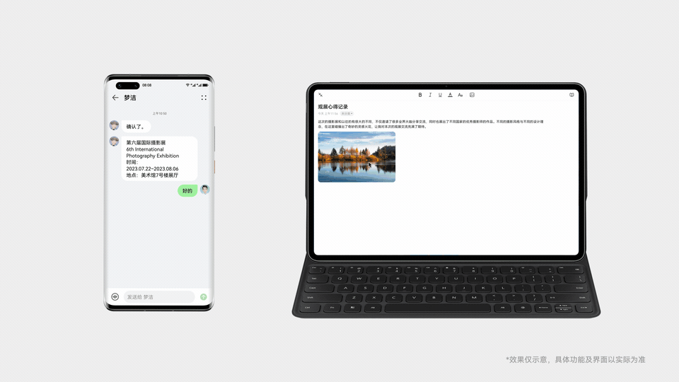
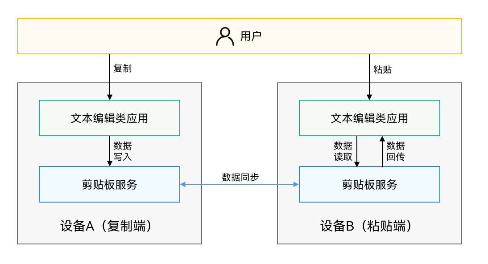

# 跨设备剪贴板

更新时间：2026-04-01 09:49:00

来源：https://developer.huawei.com/consumer/cn/doc/best-practices/bpta-distributed-pasteboard-cast

剪贴板分为本地剪贴板和跨设备剪贴板，本地剪贴板提供设备内的内容复制粘贴，跨设备剪贴板提供跨设备的内容复制粘贴。

当用户拥有多台设备时，可以通过跨设备剪贴板的功能，在A设备的应用上复制一段文本，粘贴到B设备的应用中，高效地完成多设备间的内容共享。

当开发者正在开发一款浏览器类应用，或是备忘录、笔记、邮件等富文本编辑类应用时，均可接入跨设备剪贴板，提升用户体验。





## 运作机制





1. 用户在设备A复制数据。

2. 系统剪贴板服务将处理相关数据，并完成数据同步。此过程开发者不感知。

3. 用户在设备B粘贴来自设备A的数据。


## 约束与限制


| 设备版本 | 使用限制 |
| --- | --- |
| HarmonyOS NEXT Developer Preview0及以上 | 双端设备需要打开跨设备剪贴板开关。双端设备需要登录同一华为账号。双端设备需要打开Wi-Fi和蓝牙开关。双端设备在过程中需解锁、亮屏。 |


## 接口说明


在开发具体功能前，请先查阅参考文档，获取详细的接口说明。


| 接口 | 说明 |
| --- | --- |
| getSystemPasteboard(): SystemPasteboard | 获取系统剪贴板对象。 |
| createData(mimeType: string, value: ValueType): PasteData | 构建一个自定义类型的剪贴板内容对象。 |
| setData(data: PasteData): Promise<void> | 将数据写入系统剪贴板，使用Promise异步回调。 |
| getData(callback: AsyncCallback<PasteData>): void | 读取系统剪贴板内容，使用callback异步回调。 应用使用自定义控件后台访问剪贴板需要申请ohos.permission.READ_PASTEBOARD。 |
| getRecordCount(): number | 获取剪贴板内容中条目的个数。 |
| getPrimaryMimeType(): string | 获取剪贴板内容中首个条目的数据类型。 |
| getPrimaryText(): string | 获取首个条目的纯文本内容。 |


## 开发示例


> [!NOTE]
> 跨设备复制的数据两分钟内有效。


- 设备A复制数据，写入到剪贴板服务。
```text
import pasteboard from '@ohos.pasteboard';
import { BusinessError } from '@ohos.base';
export async function setPasteDataTest(): Promise<void> {
let text: string = 'hello world';
let pasteData: pasteboard.PasteData = pasteboard.createData(pasteboard.MIMETYPE_TEXT_PLAIN, text);
let systemPasteBoard: pasteboard.SystemPasteboard = pasteboard.getSystemPasteboard();
await systemPasteBoard.setData(pasteData).catch((err: BusinessError) => {
console.error(`Failed to set pastedata. Code: ${err.code}, message: ${err.message}`);
});
}
```
- 设备B粘贴数据，读取剪贴板内容。
```text
import pasteboard from '@ohos.pasteboard';
import { BusinessError } from '@ohos.base';
// 设备B粘贴数据，读取剪贴板内容
export async function getPasteDataTest(): Promise<void> {
let systemPasteBoard: pasteboard.SystemPasteboard = pasteboard.getSystemPasteboard();
systemPasteBoard.getData((err: BusinessError, data: pasteboard.PasteData) => {
if (err) {
console.error(`Failed to get pastedata. Code: ${err.code}, message: ${err.message}`);
return;
}
// 对pastedata进行处理，获取类型，个数等
let recordCount: number = data.getRecordCount(); // 获取剪贴板内record的个数
let types: string = data.getPrimaryMimeType(); // 获取剪贴板内数据的类型
let primaryText: string = data.getPrimaryText(); // 获取剪贴板内数据的内容
});
}
```
