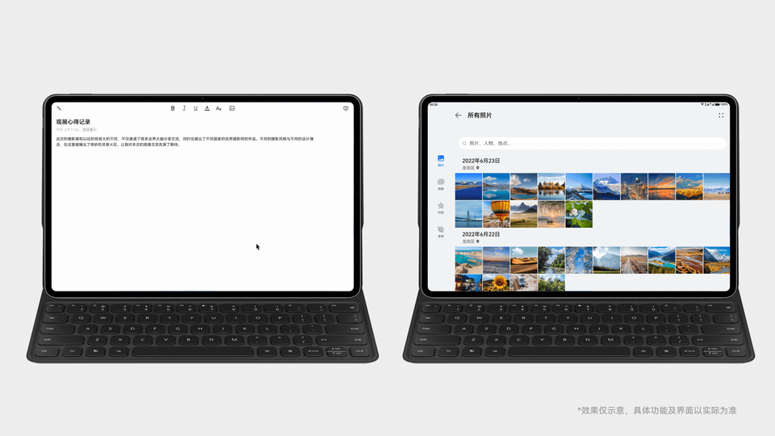
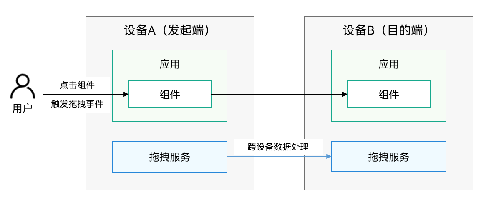

# 跨设备拖拽

更新时间：2026-05-18 00:55:31

来源：https://developer.huawei.com/consumer/cn/doc/best-practices/bpta-distribute-drag-cast

跨端拖拽提供跨设备的键鼠共享能力，支持在平板或2in1类型的任意两台设备之间拖拽文本、图片、视频、PDF文档等文件。
 
例如，当用户拥有两台平板设备时，可以共享一套键鼠，通过跨设备拖拽，一步将设备A的素材拖拽到设备B快速创作，实现跨设备的协同工作体验。
 
当前系统应用中，文件管理器、浏览器支持拖出；备忘录支持拖入。用户可以体验以下场景：
 
- 将A设备文件管理器中的图片拖拽至B设备的备忘录应用。
- 将A设备备忘录中的文本拖拽至B设备的备忘录应用，并在B设备中使用A设备连接的键盘输入，协同操作。

 
开发者可以根据实际需求，实现组件的拖入或拖出，即可接入跨设备拖拽。
 

 

 

##### 运作机制

 

 1. 用户使用鼠标点击组件，触发拖拽事件。
2. 应用设置拖拽数据。
3. 系统完成跨设备数据处理，此过程应用不感知。
4. 用户松手触发拖拽松手事件。
5. 目的端应用获取并处理拖拽数据。
 
 

##### 约束与限制

需同时满足以下条件，才能使用该功能：
 
- **设备限制**HarmonyOS NEXT Developer Preview0及以上版本的平板或2in1设备。
- **使用限制**
双端设备需要登录同一华为账号。
- 双端设备需要打开Wi-Fi和蓝牙开关，并接入同一个局域网。
- 打开键鼠穿越开关。
- 应用本身预置的资源文件（即应用在安装前的HAP包中已经存在的资源文件）不支持跨设备拖拽。

 
 
 

##### 接口说明

在开发具体功能前，请先查阅参考文档，获取详细的接口说明。
 
- [拖拽控制](https://developer.huawei.com/consumer/cn/doc/harmonyos-references/ts-universal-attributes-drag-drop)：设置组件是否可以响应拖拽事件的属性。组件均需要设置draggable属性才能响应拖拽事件。当前部分组件默认支持拖拽控制。应用使用这些组件时，只需要将draggable设置为true，系统将根据组件的支持情况，自动实现onDragStart的写信息或onDrop的读信息。
- [拖拽事件](https://developer.huawei.com/consumer/cn/doc/harmonyos-references/ts-universal-events-drag-drop)：组件被鼠标选中后拖拽时触发的事件。应用应根据实际需求，实现组件拖入或拖出。

 
 

##### 开发示例

拖拽事件通过鼠标左键来操作和响应，开发示例请参考：[拖拽事件](https://developer.huawei.com/consumer/cn/doc/harmonyos-references/ts-universal-events-drag-drop)。
