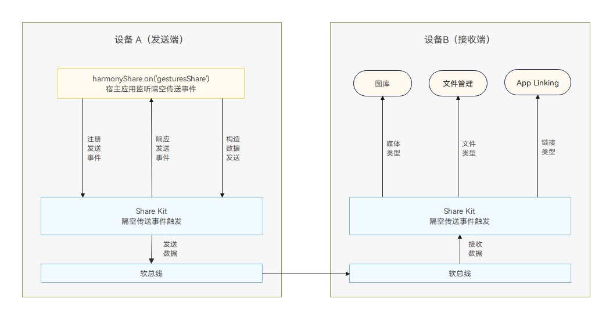
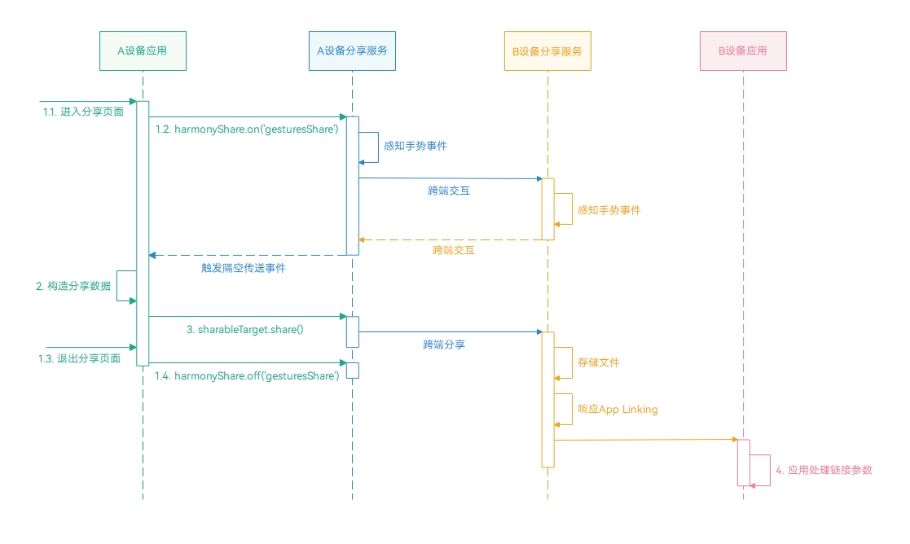

# 隔空传送快速分享

更新时间：2026-05-18 00:55:31

来源：https://developer.huawei.com/consumer/cn/doc/best-practices/bpta-application-gesture-share

#### 概述
[Share Kit（分享服务）](https://developer.huawei.com/consumer/cn/doc/harmonyos-guides/share-kit-guide)提供隔空传送分享，支持用户通过“一抓一放”手势实现跨设备文件分享（图片、视频、文档等）以及跨设备链接分享。

| 隔空传送分享文件 | 通过隔空传送手势触发文件分享，接收端为phone、tablet设备会将媒体文件存储至图库，非媒体文件存储至文件管理器，接收端为PC/2in1设备则会将媒体以及非媒体文件存储至文件管理器。 |
| --- | --- |
| 隔空传送分享链接 | 通过隔空传送手势触发分享App Linking链接，接收端已安装应用可直接打开应用查看内容。 |

#### 实现原理
#### 关键技术


隔空传送基于分享服务，允许用户通过简单的“一抓一放”手势实现跨设备分享，当前支持手机、平板、PC，使用体验无差异，应用接入只需监听harmonyShare.on('gesturesShare')方法。
当用户做出手势进行隔空传送分享时，系统触发回调，应用可以在回调中实现数据分享。
接收端的处理由系统统一管理：
- 媒体文件（如图片、视频）将存储到图库。
- 非媒体文件将存储到文件管理。
- App Linking链接将自动打开目标应用，并由应用处理链接传递的参数，实现内容的快速访问。

#### 开发流程


1. **分享注册监听与取消监听**：在分享页面的生命周期函数（如aboutToAppear或onPageShow）中，注册 harmonyShare.on('gesturesShare') 事件监听，以监听隔空传送事件。当页面即将隐藏或应用退至后台时，通过harmonyShare.off('gesturesShare')取消该监听。
2. **构建分享数据**：定义需要分享的数据[SharedData](https://developer.huawei.com/consumer/cn/doc/harmonyos-references/share-system-share#shareddata)。
3. **分享数据**：在监听回调中调用[share()](https://developer.huawei.com/consumer/cn/doc/harmonyos-references/share-harmony-share#share)方法来分享数据。
4. **文件接收策略与对端跳转处理**：文件分享：隔空传送文件分享的接收由对端系统自行接收，见文件接收策略。链接分享：隔空传送链接分享需配置App Linking并在接收端进行数据处理参考对端跳转处理。

> [!NOTE] 超时控制
> 超时控制：从触发事件到调用sharableTarget.share需在3秒内完成，否则可能导致失败。页面生命周期管理：确保页面隐藏或退至后台时取消监听。数据分享：可分享链接或文件（图片、视频、文档等），但每次分享内容只能是链接或文件中的一种，不支持混合分享。

#### 分享文件
#### 分享注册监听与取消监听
[harmonyShare（华为分享）](https://developer.huawei.com/consumer/cn/doc/harmonyos-references/share-harmony-share)模块提供了隔空传送分享事件的监听方法[on('gesturesShare')](https://developer.huawei.com/consumer/cn/doc/harmonyos-references/share-harmony-share#ongesturesshare)及取消监听的方法[off('gesturesShare')](https://developer.huawei.com/consumer/cn/doc/harmonyos-references/share-harmony-share#ongesturesshare)。

> [!NOTE] 说明
> 隔空传送监听方法： on(event: 'gesturesShare', capability: SendCapabilityRegistry, callback: Callback&lt;SharableTarget&gt;): void 该方法需传入capability参数，类型为SendCapabilityRegistry，继承自BaseCapabilityRegistry。其包含windowId属性，需要传入当前应用的窗口ID。在PC/2in1或平板自由窗口模式中，系统会根据窗口ID判断当前应用是否获取了窗口焦点。只有在获取焦点后，当用户触发隔空传送事件时，才会触发应用注册的隔空传送方法。 该方法支持phone、tablet和PC/2in1设备类型，在多设备开发时建议使用该接口。

定义ShareModel类，用于封装分享相关方法，也便于分享页面调用相关方法，首先需要导入相关模块，其中harmonyShare、systemShare为分享服务相关模块。

```ArkTS
import { harmonyShare, systemShare } from '@kit.ShareKit';
import { uniformTypeDescriptor } from '@kit.ArkData';
import { fileUri } from '@kit.CoreFileKit';
import { BusinessError } from '@kit.BasicServicesKit';
import { common } from '@kit.AbilityKit';
import { window } from '@kit.ArkUI';
import { hilog } from '@kit.PerformanceAnalysisKit';
import { FileData, ShareType, VIDEO_SOURCES } from './FileData';
```

将隔空传送监听方法[on('gesturesShare')](https://developer.huawei.com/consumer/cn/doc/harmonyos-references/share-harmony-share#ongesturesshare)封装为immersiveListening()，取消监听的方法[off('gesturesShare')](https://developer.huawei.com/consumer/cn/doc/harmonyos-references/share-harmony-share#ongesturesshare)封装为immersiveDisableListening()。在分享页面可通过初始化ShareModel类并调用immersiveListening()方法来启动监听，调用immersiveDisableListening()方法取消监听。

```ArkTS
/**
 *  Add gesturesShare listening.
 */
public immersiveListening(shareType: ShareType) {
  if (canIUse('SystemCapability.Collaboration.HarmonyShare')) {
    window.getLastWindow(this.context).then((data) => {
      try {
        let mainWindowID: number = data.getWindowProperties().id;
        harmonyShare.on('gesturesShare', { windowId: mainWindowID }, (target: harmonyShare.SharableTarget) => {
          this.immersiveCallback(target, shareType);
        });
      } catch (err) {
        let error = err as BusinessError;
        hilog.error(0x0000, 'GesturesShare', `getWindowProperties error ${error.code} ${error.message}`);
      }
    }).catch((error: BusinessError) => {
      hilog.error(0x0000, 'GesturesShare', `immersiveListening error ${error.code} ${error.message}`);
    })
  }
}

/**
 *  Remove gesturesShare listening.
 */
public immersiveDisableListening() {
  if (canIUse('SystemCapability.Collaboration.HarmonyShare')) {
    window.getLastWindow(this.context).then((data) => {
      try {
        let mainWindowID: number = data.getWindowProperties().id;
        harmonyShare.off('gesturesShare', { windowId: mainWindowID });
      } catch (error) {
        let err = error as BusinessError;
        hilog.error(0x0000, 'GesturesShare', `getWindowProperties error ${err.code} ${err.message}`);
      }
    }).catch((error: BusinessError) => {
      hilog.error(0x0000, 'GesturesShare', `immersiveDisableListening error ${error.code} ${error.message}`);
    })
  }
}
```

开发者应在用户进入隔空传送分享页面时调用隔空传送分享接口。当应用不再需要隔空传送分享文件或离开页面（包括退至后台等情况）时，应及时调用取消监听的方法。ShareModel模块自定义封装了分享相关方法，可以通过调用this.shareModel.immersiveListening()方法并传入ShareType.FILE_SHARE来注册文件分享事件监听，调用this.shareModel.immersiveDisableListening()来取消监听。
当用户在文件分享页面勾选或取消勾选文件时，会触发onChange()方法，在该方法中，调用setFileShare()方法将要分享的文件索引数据存储到shareModel实例中，以便在生成分享数据时使用。

```ArkTS
import { common } from '@kit.AbilityKit';
import { filePreview } from '@kit.PreviewKit';
import { hilog } from '@kit.PerformanceAnalysisKit';
import { FileData, FILE_SOURCES, ShareType } from '../model/FileData';
import { ShareModel } from '../model/ShareModel';
import { FileUtil, BreakpointConstants, BreakpointType } from '@ohos/common';

@Component
export struct FileSharePageComponent {
  // ...
  // Pending shared data index.
  @State fileShare: number[] = [];
  // All file data collection.
  @State dataList: FileData[] = FILE_SOURCES;

  build() {
    NavDestination() {
      List({ space: 16 }) {
        ForEach(this.dataList, (item: FileData, index: number) => {
          ListItem() {
            Stack() {
              // ...
              Column() {
                Checkbox({ name: index + '', group: 'checkboxGroup'})
                  // ...
                  .onChange((value: boolean) => {
                    if (value) {
                      this.fileShare.push(index);
                    } else {
                      this.fileShare.splice(this.fileShare.indexOf(index), 1);
                    }
                    this.shareModel = ShareModel.getInstance(this.context);
                    this.shareModel.setFileShare(this.fileShare);
                    this.shareModel.setVideoDataList(this.dataList);
                  })
                // ...
    }
    // ...
    .onShown(() => {
      // ...
      this.shareModel = ShareModel.getInstance(this.context);
      this.shareModel.immersiveListening(ShareType.FILE_SHARE);
    })
    .onHidden(() => {
      this.shareModel = ShareModel.getInstance(this.context);
      this.shareModel.immersiveDisableListening();
    })
  }
}
```

#### 构建分享数据
在分享数据时，分享发起方需要构建[SharedRecord](https://developer.huawei.com/consumer/cn/doc/harmonyos-references/share-system-share#sharedrecord)对象。在文件分享场景中，发起方在构造此参数时，必须传入uri和utd这两个属性。

> [!NOTE] 说明
> uri是指要分享的文件URI，而非文件路径，例如沙箱路径content.fileDir，应通过fileUri.getUriFromPath获取其URI。utd则是当前文件的标准化数据类型，需要传入与分享的数据匹配的类型，以便系统匹配精确的目标应用，推荐使用uniformTypeDescriptor.getUniformDataTypeByFilenameExtension方法，通过给定的文件后缀名查询标准化数据类型的ID。

在ShareModel模块中定义getShareRecord()方法，用于根据当前的文件类型构建分享数据。定义getFileShareData()方法，当需要分享多个文件时，该方法会通过循环处理来获取分享数据。

```ArkTS
/**
 * Get file Share data.
 * @returns systemShare.SharedData.
 */
private getFileShareData(): systemShare.SharedData {
  let shareData: systemShare.SharedData =
    new systemShare.SharedData(this.getShareRecord(this.videoDataList[this.fileShare[0]]));
  try {
    for (let i = 1; i < this.fileShare.length; i++) {
      shareData.addRecord(this.getShareRecord(this.videoDataList[this.fileShare[i]]));
    }
  } catch (err) {
    let error = err as BusinessError;
    hilog.error(0x0000, 'GesturesShare', `shareData.addRecord error ${error.code} ${error.message}`);
  }
  return shareData;
}

/**
 * Get shared data.
 *
 * @param data File data to be shared.
 * @returns systemShare.SharedRecord.
 */
private getShareRecord(data: FileData): systemShare.SharedRecord {
  let suffix = '.' + data.url.split('.').pop();
  // Obtain the UTD through the file extension.
  let utd = uniformTypeDescriptor.getUniformDataTypeByFilenameExtension(suffix);
  hilog.info(0x0000, 'GesturesShare', `getShareRecord utd ${utd}`);
  return {
    utd: utd,
    uri: data.url,
    thumbnailUri: data.thumbnail,
    title: data.name,
    description: data.description
  };
}
```

#### 分享数据
在隔空传送事件回调中，调用this.immersiveCallback()方法，通过传入的ShareType类型来判断当前是文件分享还是链接分享，文件分享调用getFileShareData()方法构造分享数据，并通过sharableTarget.share()方法分享数据，完成隔空传送文件分享流程。

```ArkTS
public immersiveCallback(target: harmonyShare.SharableTarget, shareType: ShareType) {
  if (shareType === ShareType.FILE_SHARE) {
    if (!this.fileShare || this.fileShare.length === 0) {
      return;
    }
    let shareData: systemShare.SharedData = this.getFileShareData();
    target.share(shareData);
  } else {
    let shareData: systemShare.SharedData = this.getLinkShareData();
    target.share(shareData);
  }
}
```

#### 文件接收策略
分享接收端接收数据时遵循统一规则，详情请参考[目标设备接收分享数据一步直达体验](https://developer.huawei.com/consumer/cn/doc/harmonyos-guides/share-access-one-step)。当传入的分享参数utd为uniformTypeDescriptor.UniformDataType.IMAGE且文件确认为图片文件时，接收端为phone、tablet设备时默认将其存储在图库中。当传入的utd为uniformTypeDescriptor.UniformDataType.FILE时，文件会默认存储到文件管理中。接收端为PC/2in1设备类型时则会将媒体以及非媒体文件存储至文件管理器。系统预置了常用类型，详情可参考[UTD预置列表](https://developer.huawei.com/consumer/cn/doc/harmonyos-guides/uniform-data-type-list)。

#### 分享链接
开发者可以通过分享 AppLinking 链接实现应用间的无缝跳转和内容精准直达。当用户通过隔空传送分享链接时，接收端接收链接后：
- 如果目标应用已安装，将直接启动目标应用。
- 如果目标应用未安装，将直接跳转到应用市场或启动浏览器打开网页查看内容。
详情请参考碰一碰视频分享[典型场景](https://developer.huawei.com/consumer/cn/doc/best-practices/bpta-application-knock-video-share#section95975396464)章节。

#### 分享注册监听及取消监听
分享链接再注册监听以及取消监听与分享文件章节下的[分享注册监听与取消监听](#section18279162912273)处理过程一致，开发者可参考分享文件这一章节的内容，在调用immersiveListening()方法需传入ShareType.LINK_SHARE来注册链接分享事件监听，调用this.shareModel.immersiveDisableListening()来取消监听。
在分享链接页面，当用户点击不同的视频集数时，会触发onClick()方法。在该方法中，调用setVideoIndex()方法将当前集数存储到shareModel实例中，以便在生成分享链接时使用。

```ArkTS
import { common } from '@kit.AbilityKit';
import { JSON } from '@kit.ArkTS';
import { FileData, ShareType, VIDEO_SOURCES } from '../model/FileData';
import { ShareModel } from '../model/ShareModel';
import { BreakpointConstants } from '@ohos/common';

@Component
export struct LinkSharePageComponent {
  // ...
  // Current playing video index.
  @State currentVideoIndex: number = 0;
  @State url: ResourceStr = $rawfile(this.dataList[this.currentVideoIndex].url);

  build() {
    NavDestination() {
      Scroll() {
        Column() {
          // ...
          Column() {
            // ...
            Scroll() {
              Row({ space: 10 }) {
                ForEach(this.dataList, (item: FileData, index) => {
                  RelativeContainer() {
                    // ...
                  }
                  // ...
                  .onClick(() => {
                    this.currentVideoIndex = index;
                    this.shareModel = ShareModel.getInstance(this.context);
                    this.shareModel.setVideoIndex(this.currentVideoIndex);
                    this.videoController.reset();
                    this.url = $rawfile(item.url);
                  })
                  // ...
    }
    // ...
    .onShown(() => {
      // ...
      this.shareModel = ShareModel.getInstance(this.context);
      this.shareModel?.immersiveListening(ShareType.LINK_SHARE);
    })
    .onHidden(() => {
      this.shareModel = ShareModel.getInstance(this.context);
      this.shareModel?.immersiveDisableListening();
    })
  }

  // ...
}
```

#### 构建分享数据并分享数据
在隔空传送事件回调中调用this.immersiveLinkCallback()方法，实现分享数据构建，在链接分享场景中，发起方在构造[SharedRecord](https://developer.huawei.com/consumer/cn/doc/harmonyos-references/share-system-share#sharedrecord)参数时，必须传入content和utd这两个属性，并通过sharableTarget.share()方法传输数据，完成隔空传送链接分享流程。

> [!NOTE] 说明
> utd需设置为utd.UniformDataType.HYPERLINK，表示分享内容为链接；content设置为配置App Linking章节中配置的链接，链接中拼接视频唯一标识符videoIndex。为提升分享预览模板缩略图的清晰度和整体用户体验，建议开发者优先使用thumbnailUri参数设置缩略图。尽管thumbnailUri和thumbnail两个参数均可实现缩略图效果，但thumbnail参数因大小限制为32KB，实际应用中可能导致图片模糊，影响用户体验。因此，采用thumbnailUri指定高质量缩略图更为推荐。


```ArkTS
getLinkShareData(): systemShare.SharedData {
  // share app linking.
  let videoData: FileData = VIDEO_SOURCES[this.videoIndex];
  // Video thumbnail image sandbox path.
  let filePath: string = this.context?.filesDir + `/${videoData.thumbnail}`;
  // Get video thumbnail URI path.
  let coverUri: string = fileUri.getUriFromPath(filePath);
  let shareData: systemShare.SharedData = new systemShare.SharedData({
    // Set the shared data type to Link.
    utd: uniformTypeDescriptor.UniformDataType.HYPERLINK,
    // The shared App Linking link is replaced with the real address here.
    content: `https://www.example.com?videoIndex=${this.videoIndex}`,
    thumbnailUri: coverUri,
    title: videoData.name,
    description: videoData.description
  });
  return shareData;
}
```

#### 配置App Linking
开发者可参考[使用App Linking实现应用间跳转](https://developer.huawei.com/consumer/cn/doc/harmonyos-guides/app-linking-startup)进行配置和使用。例如，此处配置的App Linking的链接为：www.example.com，开发者需在entry模块的module.json5中进行如下配置：

```json
{
  "module": {
    // ...
    "abilities": [
      {
        "name": "EntryAbility",
        // ...
        "exported": true,
        "skills": [
          {
            "entities": [
              "entity.system.home",
              // entities must contain "entity.system.browsable"
              "entity.system.browsable"
            ],
            "actions": [
              "ohos.want.action.home",
              // Actions must contain "ohos.want.action.viewData"
              "ohos.want.action.viewData"
            ],
            "uris": [
              {
                // The scheme must be configured as https
                "scheme": "https",
                // The host must be configured as the associated domain name
                "host": "www.example.com",
                "path": ""
              }
            ],
            // domainVerify must be set to true
            "domainVerify": true
          }
        ]
      }
    ],
    // ...
  }
}
```

#### 对端跳转处理
当对端设备已安装应用并收到分享的 App Linking 链接后，系统会拉起应用。根据应用是否已在运行，有以下两种情况需处理：
应用未运行：此时跳转应用，应在onCreate()方法中获取链接中的视频唯一标识符videoIndex并存储到AppStorage中，同时存储GesturesShare_isShareLink为true，表示当前应用通过分享系统启动，以便于跳转到隔空传送链接分享页面播放视频。

```ArkTS
onCreate(want: Want, launchParam: AbilityConstant.LaunchParam): void {
  // ...
  let videoIndex = this.getVideoIndex(want);
  if (videoIndex !== '') {
    AppStorage.setOrCreate('GesturesShare_shareVideoIndex', Number.parseInt(videoIndex));
    AppStorage.setOrCreate('GesturesShare_isShareLink', true);
  }
}
```

应用已运行：此时跳转应用，需在onNewWant()方法中获取链接中的视频唯一标识符videoIndex并存储到AppStorage中，并存储GesturesShare_isShareLink为true，表示当前应用通过分享系统启动，以便于跳转到隔空传送链接分享页面播放视频。

```ArkTS
onNewWant(want: Want, launchParam: AbilityConstant.LaunchParam) {
  let videoIndex = this.getVideoIndex(want);
  if (videoIndex !== '') {
    AppStorage.setOrCreate('GesturesShare_shareVideoIndex', Number.parseInt(videoIndex));
    AppStorage.setOrCreate('GesturesShare_isShareLink', true);
  }
}
```

getVideoIndex()通过want参数获取分享链接中的参数。

```ArkTS
private getVideoIndex(want: Want): string {
  try {
    let uri = want?.uri;
    let videoIndex: string = '';
    // Parse the parameters to obtain the app linking
    if (uri) {
      let urlObject = url.URL.parseURL(want?.uri);
      videoIndex = urlObject.params.get('videoIndex') as string;
      hilog.info(0x0000, 'GesturesShare', `getAid aid:${videoIndex}`);
    }
    return videoIndex;
  } catch (err) {
    let error = err as BusinessError;
    hilog.error(0x0000, 'GesturesShare', `Failed to getVideoIndex, error: ${error.code} ${error.message}`);
  }
  return '';
}
```

在应用首页判断GesturesShare_isShareLink是否为true，若为true则跳转至隔空传送链接分享页面。

```ArkTS
onPageShow(): void {
  if (this.isShareLink) {
    this.pageInfos.pushPathByName('LinkSharePage', null, true);
  }
}
```

#### 常见问题
#### 数据在分享过程中被丢弃或者提示无效的数据类型
分享服务支持链接分享和文件分享两种场景，但不支持两者混合分享。在混合分享时，数据可能会在分享过程中丢失或提示无效的数据类型。详情可参考[分享数据类型不支持](https://developer.huawei.com/consumer/cn/doc/harmonyos-guides/share-faq-2)。

#### 示例代码
- [基于Share Kit实现隔空传送分享文件和链接](https://gitcode.com/harmonyos_samples/GesturesShare)