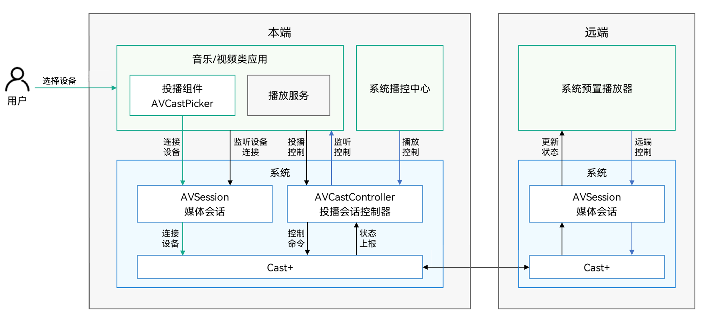
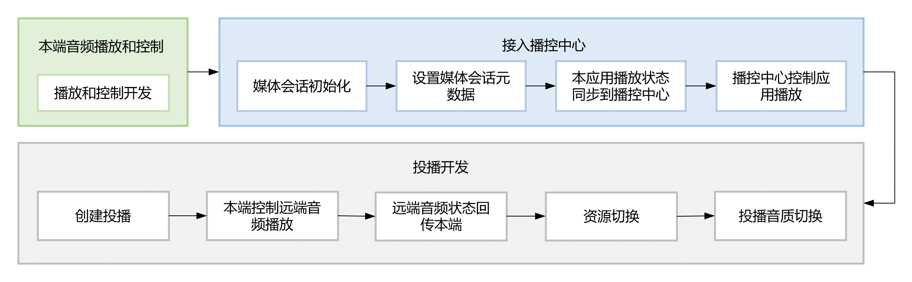
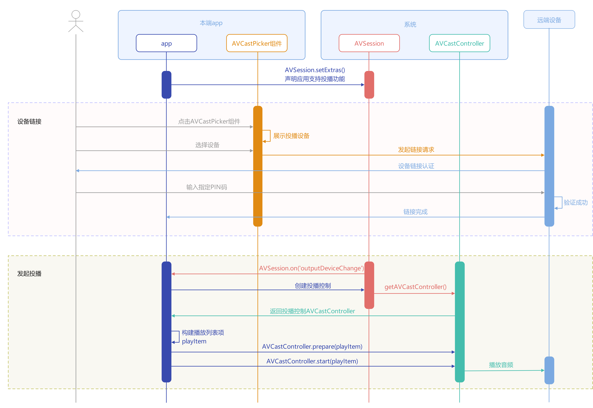
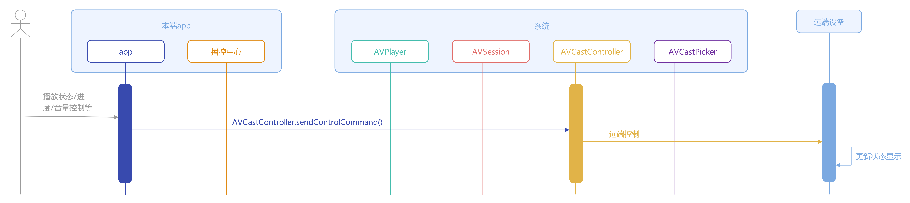
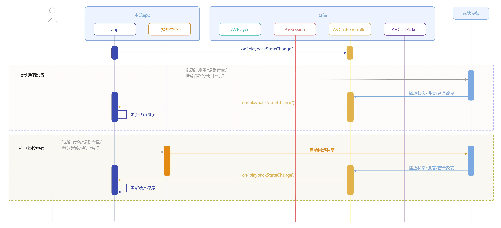
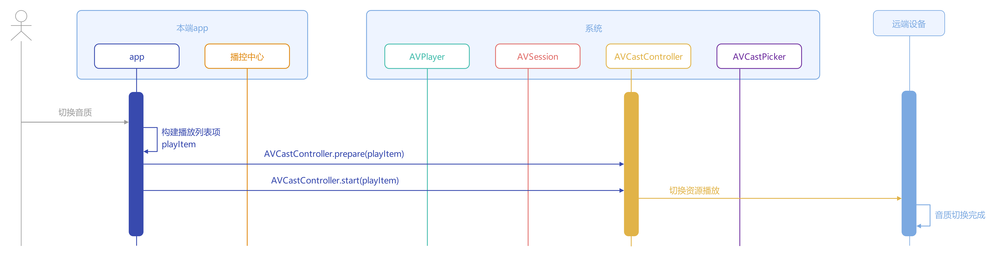

# 音频投播

更新时间：2026-05-18 00:55:31

来源：https://developer.huawei.com/consumer/cn/doc/best-practices/bpta-audio-cast

#### 概述
系统投播功能支持用户将手机上的音视频无缝流转到其他设备（如PC/2in1设备、华为智慧屏）上继续播放，实现跨终端自由切换，无需受到有线设备的束缚。为简化开发流程，系统提供了标准化的音视频投播解决方案，开发者仅需配置资源信息、监听投播状态并实现播放控制（如播放、暂停等），即可快速集成该功能。
本文将结合实际案例，详细介绍如何高效利用系统投播组件和接口实现音频投播，帮助开发者提升开发效率，包含如下关键步骤：
- [接入播控中心](#section157951042142811)：播控中心提供音视频统一管控能力和音频后台约束能力，是投播接入的必备条件。
- [创建投播](#section148446619451)：通过调用投播组件的设备选择接口，并注册媒体会话的设备改变事件监听，可以将手机端音视频无缝迁移到指定远端设备上继续播放。
- 本端控制远端音频播放：通过手机端可以直接控制远端设备的音频播放状态，包括播放、暂停和播放进度等。
- [远端音频状态回传本端](#section178775217533)：将远端设备的播放状态实时同步到手机端显示，包括播放、暂停和播放进度等。
- [资源切换](#section153951118172510)和[投播音质切换](#section10877141421614)：支持投播过程中不同音频的切换及不同音质的切换。

> [!NOTE] 说明
> 支持投播的设备规格和使用限制参见约束与限制。

#### 用户体验
**体验视频**
**图1 **音频投播流程体验视频
**用户体验路径**
本文案例提供本端播放和音频投播两种播放模式，体验路径和交互流程图如下。在投播模式下，可以通过本端的播放界面或播控中心对远端的音频进行播放控制，如播放、暂停、播放进度跳转、上一首/下一首切换和点击切换音频。应用接入音频投播时，可根据实际需求参考本文实现相关功能，并按照[应用接入播控自检表](https://developer.huawei.com/consumer/cn/doc/harmonyos-guides/playback-control-access-checklist)完成基础功能验证，确保应用基础体验。

| 用户操作阶段 | 本端音频播放与控制 | 播控中心控制本端音频 | 接入音频投播 | 本端控制远端音频播放 |
| --- | --- | --- | --- | --- |
| 预期行为 | 本端音频正常播放 通过播放页面控制本端音频播放 | 播控中心与本端音频播放状态一致 通过播控中心控制本端音频播放 | 初次连接认证 选择投播设备 | 本端与远端播放状态一致 通过播放页面控制远端音频播放 通过播控中心控制远端音频播放 |
| 操作示意图 | 图2 | 图3 | 图4 | 图5 |

#### 实现原理
**名词解释**

| 概念 | 解释 |
| --- | --- |
| 媒体会话（AVSession） | 音视频管控服务，用于统一管理系统中接入播控中心的音视频行为。 |
| 投播组件（AVCastPicker） | 可嵌入应用UI界面的系统级投播组件。用户点击该组件后，系统将执行设备发现、连接和认证等流程，应用仅需通过接口获取投播中的相关回调信息。 |
| 投播控制器（AVCastController） | 在投播建立后，由应用发起的用于控制远端播放的接口，包括播放、暂停、上一首/下一首切换和播放进度跳转等能力。 |

投播功能的实现基于AVSession媒体会话和AVCastController投播控制器的协同工作，系统通过AVSession建立设备连接，由AVCastController向Cast+服务发送控制指令。开发者需要聚焦两个核心环节——通过AVSession实现监听设备连接，以及使用AVCastController控制远端播放并同步状态，详见[运作机制](https://developer.huawei.com/consumer/cn/doc/harmonyos-guides/distributed-playback-overview#运作机制)。
**图6 **音视频投播运作机制示意图



#### 模块设计
建议应用实现音频投播时，封装如下三个模块：
- 本端音频控制器：控制本端音频资源的播放、暂停、上一首/下一首切换和播放进度等。
- 媒体会话控制器：将本端播放的音频接入播控中心，用于本应用发起投播、结束投播、与播控中心的播放状态同步。
- 音频投播控制器：控制远端设备音频资源的播放、暂停、上一首/下一首切换和播放进度等。
实现音频投播功能，建议参考如下流程接入，其中本端音频的播放和控制可参考[使用AVPlayer播放音频](https://developer.huawei.com/consumer/cn/doc/harmonyos-guides/using-avplayer-for-playback)、[使用AudioRenderer开发音频播放功能](https://developer.huawei.com/consumer/cn/doc/harmonyos-guides/using-audiorenderer-for-playback)等方案根据功能诉求自行实现，本文将从接入播控中心开始进行详细介绍。
**图7 **接入音频投播流程图



#### 接入播控中心
[音视频播控服务](https://developer.huawei.com/consumer/cn/doc/harmonyos-guides/avsession-overview)用于统一管理系统中所有音视频行为，开发者须接入播控中心才能实现投播功能。播控中心不仅能控制本端设备的播放，还能控制远端设备的播放。
**图8 **播控中心控制音频播放


本应用与系统播控中心通过媒体会话AVSession进行信息交互。创建并初始化媒体会话实例后，应用需要通过[setAVMetaData()](https://developer.huawei.com/consumer/cn/doc/harmonyos-references/arkts-apis-avsession-avsession#setavmetadata10)接口设置会话元数据，同时使用[setAVPlaybackState()](https://developer.huawei.com/consumer/cn/doc/harmonyos-references/arkts-apis-avsession-avsession#setavplaybackstate10)接口主动向播控中心同步当前播放状态，并通过on('controlCommand')注册事件监听实时响应播控中心的音频操作事件，最终实现本应用与播控中心的双向状态同步，确保两端数据的一致性。下面为应用接入播控中心的简要开发流程。

#### 媒体会话初始化
1. 通过[avSession.createAVSession()](https://developer.huawei.com/consumer/cn/doc/harmonyos-references/arkts-apis-avsession-f#avsessioncreateavsession10)创建会话类型为'audio'（音频）的会话实例AVSession。 this.AVSession = await avSession.createAVSession(this.context, "PLAY_AUDIO", 'audio');
2. 通过[AVSession.setLaunchAbility()](https://developer.huawei.com/consumer/cn/doc/harmonyos-references/arkts-apis-avsession-avsession#setlaunchability10)设置一个WantAgent用于拉起会话的Ability。 let wantAgentInfo: wantAgent.WantAgentInfo = {
  wants: [
 {
 bundleName: this.context.abilityInfo.bundleName,
 abilityName: this.context.abilityInfo.name
 }
  ],
  actionType: wantAgent.OperationType.START_ABILITIES,
  requestCode: 0,
  wantAgentFlags: [wantAgent.WantAgentFlags.UPDATE_PRESENT_FLAG]
};
wantAgent.getWantAgent(wantAgentInfo).then((agent) => {
  if (this.AVSession) {
 this.AVSession.setLaunchAbility(agent);
  }
}).catch(() => {
  hilog.error(0x0000, TAG, `getWantAgent failed.`);
});
3. 通过[AVSession.activate()](https://developer.huawei.com/consumer/cn/doc/harmonyos-references/arkts-apis-avsession-avsession#activate10)激活音频会话AVSession。 await this.AVSession.activate();

#### 设置媒体会话元数据
通过[AVSession.setAVMetadata()](https://developer.huawei.com/consumer/cn/doc/harmonyos-references/arkts-apis-avsession-avsession#setavmetadata10)上传元数据，从而在播控中心展示音频相关信息，如媒体ID（assetId）、媒体标题（title）、媒体图片（mediaImage）、媒体时长（duration）等。

```ArkTS
let metadata: avSession.AVMetadata;
// ...
  metadata = {
    assetId: 'AUDIO-' + JSON.stringify(this.musicIndex),
    title: this.songList[this.musicIndex].title,
    artist: this.songList[this.musicIndex].singer,
    filter: avSession.ProtocolType.TYPE_DLNA | avSession.ProtocolType.TYPE_CAST_PLUS_STREAM,
    mediaImage: mediaImage,
    duration: this.getDuration(),
  };
  // ...
if (this.AVSession) {
  await this.AVSession.setAVMetadata(metadata);
}
```

#### 本应用播放状态同步到播控中心
设置元数据后，开发者需要主动监听本地音频播放状态的变化（如播放、暂停、上一首/下一首切换和进度跳转等事件），并将其同步到播控中心，以确保两端播放状态一致。
以下为应用端调用本地播放器的播放/暂停方法时，通过AVSession更新播控中心的播放/暂停状态进行双端播放状态同步的示例代码：

```ArkTS
await this.AVSession?.setAVPlaybackState({
  state: isPlay ? avSession.PlaybackState.PLAYBACK_STATE_PLAY :
  avSession.PlaybackState.PLAYBACK_STATE_PAUSE,
});
```

需要注意的是，在更新播放进度时，需要同时传入音频播放的时间进度（elapsedTime）和当前时间戳（updateTime），以下为示例代码：

```ArkTS
await this.AVSession?.setAVPlaybackState({
  position: {
    elapsedTime: position,
    updateTime: new Date().getTime()
  }
});
```

#### 播控中心控制应用播放
当用户在播控中心操作音频（如播放、暂停、上一首/下一首切换和进度跳转等事件）时，这些操作不会自动同步到应用端。开发者需要通过AVSession.on('controlCommand')监听这些操作事件，并在回调函数中主动更新应用的播放状态，以确保应用端与播控中心的播放状态一致。
以下为应用端监听到播控中心的播放/暂停操作事件时，主动调用本地播放器的播放/暂停方法进行双端播放状态同步的示例代码：

```ArkTS
this.AVSession?.on('play', () => controller?.setPlaying());
this.AVSession?.on('pause', () => controller?.setPause());
```


> [!NOTE] 说明
> 建议在音频不需要与播控中心进行交互时，通过AVSession.off()销毁使用AVSession.on()注册的播控中心交互事件监听。

#### 投播基础功能
为确保投播功能正常使用，应用在发起投播前需要接入播控中心。如未完成此关键步骤，将导致投播功能不可用。

#### 创建投播
**图9 **本端播放的音频投播到远端
创建投播需要通过setExtras()声明应用支持投播功能，初始化投播组件AVCastPicker，同时通过媒体会话注册设备改变事件监听。用户交互时，触发AVCastPicker组件弹出设备选择的半模态弹窗，待设备选定后，应用需依次执行投播媒体信息设置、投播媒体资源准备（prepare）和投播媒体资源播放启动（start）来将本端音视频资源投播到远端继续播放。
**时序图**
**图10 **创建投播时序图


**开发步骤**
1. 接入播控中心后，在创建投播前，需要通过AVSession.setExtras({requireAbilityList: ['url-cast']})告知系统应用当前支持投播功能，才能成功发起投播。 await this.AVSession.setExtras({
  'requireAbilityList': ['url-cast']
});
2. 在音频播放页绘制投播组件[AVCastPicker](https://developer.huawei.com/consumer/cn/doc/harmonyos-references/ohos-multimedia-avcastpicker#avcastpicker)，用于拉起半模态弹窗选择投播设备。 图11 发起投播界面   AVCastPicker({
  normalColor: this.color, activeColor: this.color,
})
3. 设置播放设备变化的监听事件[AVSession.on('outputDeviceChange')](https://developer.huawei.com/consumer/cn/doc/harmonyos-references/arkts-apis-avsession-avsession#onoutputdevicechange10)，当用户选择投播设备并切换成功后，播控中心会自动接管远端设备的播放控制，无需开发者额外设置。开发者只需在相应的回调函数中实现本端音频的播放控制逻辑即可。 this.avSessionController?.AVSession?.on('outputDeviceChange', async (connectState: avSession.ConnectionState,
  device: avSession.OutputDeviceInfo) => {
  let currentDevice: avSession.DeviceInfo = device?.devices?.[0];
  this.deviceInfo = currentDevice;
  if (currentDevice.castCategory === avSession.AVCastCategory.CATEGORY_REMOTE &&
 connectState === avSession.ConnectionState.STATE_CONNECTED) {
 // ...
 this.isCasting = true;
 this.startCast(this.currentTime, this.selectIndex);
  }
  // ...
})
4. 设置投播媒体资源，以投播本地资源为例，具体步骤如下： a.构建播放列表项avSession.AVQueueItem。需要传入的媒体元数据为assetId（播放列表媒体ID，应用自定义）、title（媒体标题）、artist（媒体专辑作者）、subtitle（播放列表媒体子标题）、mediaType（媒体类型）、mediaImage（媒体图片像素数据）、fdSrc（播放列表媒体本地文件的句柄，系统通过该标识符定位具体的媒体文件）、startPosition（播放列表媒体起始播放位置）、duration（媒体播放时长）、lyricContent（播放列表媒体歌词内容）。 b.通过avCastController.prepare()准备媒体播放资源，即进行播放资源的加载和缓冲。 c.通过avCastController.start()启动播放媒体资源。 let playItem: avSession.AVQueueItem;
if (this.context && songItem.lyric) {
  lyricContent = await getRawStringData(this.context, songItem.lyric);
}
try {
  let file = await fileIo.open(this.context?.filesDir + '/' + curSrc);
  let avFileDescriptor: media.AVFileDescriptor = { fd: file.fd };
  playItem = {
 itemId: this.musicIndex,
 description: {
 assetId: 'AUDIO-' + JSON.stringify(this.musicIndex),
 title: songItem.title,
 artist: songItem.singer,
 subtitle: 'audio',
 mediaType: 'AUDIO',
 albumCoverUri: songItem.albumCoverUri,
 fdSrc: avFileDescriptor,
 startPosition: startPosition,
 duration: AppStorage.get('durationTime'),
 lyricContent: lyricContent,
 }
  };
  await this.avCastController?.prepare(playItem);
  await this.avCastController?.start(playItem);
} catch (err) {
  hilog.error(0x0000, TAG, `open file ${err}`);
}

#### 本端控制远端音频播放
**图12 **本端控制远端音频播放
开发者可以采用[avCastController.sendControlCommand()](https://developer.huawei.com/consumer/cn/doc/harmonyos-references/arkts-apis-avsession-avcastcontroller#sendcontrolcommand10)接口控制远端设备的播放状态，通过在command参数中传入不同的投播控制指令并设置相关参数，可以控制远端播放、暂停、播放进度、音量和循环模式等。具体指令与功能的对应关系可参考[AVCastControlCommandType](https://developer.huawei.com/consumer/cn/doc/harmonyos-references/arkts-apis-avsession-t#avcastcontrolcommandtype10)。
**时序图**
**图13 **本端控制远端音频播放时序图


**开发步骤**
以下为通过传入'play'指令在本端控制远端设备播放的示例代码：

```ArkTS
let avCommand: avSession.AVCastControlCommand = { command: 'play' };
await this.avCastController?.sendControlCommand(avCommand);
```

需要注意的是，在播放进度跳转、音量调节和循环模式设置时，需要传入时间（单位ms）、音量和循环模式参数。

```ArkTS
public async seek(timeMS: number) {
  let avCommand: avSession.AVCastControlCommand = { command: 'seek', parameter: timeMS };
  try {
    await this.avCastController?.sendControlCommand(avCommand);
  } catch (error) {
    hilog.error(0x0000, TAG, `avCastController sendControlCommand failed, the error is: ${JSON.stringify(error)}`);
  }
}

public async setAVCastVolume(volume: number) {
  let avCommand: avSession.AVCastControlCommand = { command: 'setVolume', parameter: volume };
  try {
    await this.avCastController?.sendControlCommand(avCommand);
  } catch (error) {
    hilog.error(0x0000, TAG, `avCastController sendControlCommand failed, the error is: ${JSON.stringify(error)}`);
  }
}

public async setPlayModel(mode: number) {
  let avCommand: avSession.AVCastControlCommand = { command: 'setLoopMode', parameter: mode };
  try {
    await this.avCastController?.sendControlCommand(avCommand);
  } catch (error) {
    hilog.error(0x0000, TAG, `avCastController sendControlCommand failed, the error is: ${JSON.stringify(error)}`);
  }
}
```

#### 远端音频状态回传本端
**图14 **远端音频状态回传本端
开发者可以采用[avCastController.on('playbackStateChange')](https://developer.huawei.com/consumer/cn/doc/harmonyos-references/arkts-apis-avsession-avcastcontroller#onplaybackstatechange10)接口监听远端设备播放状态的变化，通过在filter参数中传入不同的播放状态字段和callback参数设置相应的回调函数，可以将远端的播放状态（播放、暂停、上一首/下一首切换和播放进度等信息）同步到本端。具体的播放状态属性可参考[AVPlaybackState](https://developer.huawei.com/consumer/cn/doc/harmonyos-references/arkts-apis-avsession-i#avplaybackstate10)。
**时序图**
**图15 **远端音频状态回传本端时序图


**开发步骤**
开发者可以使用[@Track](https://developer.huawei.com/consumer/cn/doc/harmonyos-guides/arkts-track)装饰器管理这些经常被改变的状态变量，以便在远端播放状态变化时，实时响应并自动刷新本端音频状态。以下为获取远端已播放时长并同步给本端的示例代码：

```ArkTS
export class AudioCastController implements Controller {
  // ...
  @Track elapsedTime: number = 0;
  // ...
  setAVCastCallback() {
    this.unregisterCastListener();
    try {
      // ...
      this.avCastController?.on('playbackStateChange', ['position'], (playbackState: avSession.AVPlaybackState) => {
        if (playbackState.position) {
          this.elapsedTime = playbackState.position.elapsedTime;
        }
      });
      // ...
    } catch (error) {
      hilog.error(0x0000, TAG, `avCastController on event failed, the error is: ${JSON.stringify(error)}`);
    }
  }
  // ...
}
```

#### 资源切换
投播过程中，在完成本首播放或用户触发音频切换时，只需重新设置音频资源即可实现音频切换，无需断开投播连接。
**开发步骤**
1. 当切换音频时，触发音频资源的重新设置，设置资源的具体方法可参考[创建投播](#section148446619451)。
2. 在本端通过点击播放页面列表中的音频和上一首/下一首操作按钮的方式，或通过点击播控中心上一首/下一首操作按钮的方式来触发音频资源的重新设置。 通过播放页切换音频： Image(\$r('app.media.ic_public_previous'))
  // ...
  .onClick(() => {
 this.playNextOrPrevious('previous');
  })
// ...
Image(\$r('app.media.ic_public_next'))
  // ...
  .onClick(() => {
 this.playNextOrPrevious('next');
  }) 通过播控中心切换音频： this.avSessionController.AVSession?.on('playNext', () => {
  this.playNextOrPrevious('next');
});
this.avSessionController.AVSession?.on('playPrevious', () => {
  this.playNextOrPrevious('previous');
});
3. 采用[avCastController.on('playPrevious')](https://developer.huawei.com/consumer/cn/doc/harmonyos-references/arkts-apis-avsession-avcastcontroller#onplayprevious10)和[avCastController.on('playNext')](https://developer.huawei.com/consumer/cn/doc/harmonyos-references/arkts-apis-avsession-avcastcontroller#onplaynext10)接口监听远端上一首/下一首切换事件，并在回调函数中重新设置音频资源。 this.audioCastController.avCastController?.on('playNext', () => {
  this.playNextOrPrevious('next');
});
this.audioCastController.avCastController?.on('playPrevious', () => {
  this.playNextOrPrevious('previous');
});

#### 投播音质切换
**时序图**
**图16 **切换投播音质时序图


投播过程中，当用户触发音质切换功能时，开发者只需根据对应音质重新设置不同的投播资源即可实现音质的切换，无需断开投播连接。设置资源的具体方法可参考[创建投播](#section148446619451)。

> [!NOTE] 说明
> 需要注意的是，要将当前音频的播放进度（startPosition）同步设置给新的音频资源，以确保切换前后音频状态的同步。

#### 常见问题
#### 创建AVCastPicker后应用界面未显示
**问题现象**
打开音乐播放页，右上角的投播组件没有显示。
**可能原因**
1. 未初始化媒体会话AVSession。
2. 未配置媒体会话元数据AVMetaDate。
3. 未声明当前应用支持投播功能。
**解决措施**
1. 创建并激活媒体会话AVSession。
2. 通过[AVSession.setAVMetadata()](https://developer.huawei.com/consumer/cn/doc/harmonyos-references/arkts-apis-avsession-avsession#setavmetadata10)设置媒体会话元数据AVMetaData。
3. 通过[AVSession.setExtras()](https://developer.huawei.com/consumer/cn/doc/harmonyos-references/arkts-apis-avsession-avsession#setextras10)声明当前应用支持投播功能。
**参考链接**
- [媒体会话初始化](#section641024718268)
- [设置媒体会话元数据](#section343315312467)
- [创建投播](#section148446619451)

#### 投播后远端黑屏，无音频播放
**问题现象**
投播后，本端显示已切换到远端设备，但是远端黑屏，无音频播放。
**可能原因**
1. 未配置投播媒体元数据。
2. 未加载或启动媒体资源的播放。
3. 远端设备不支持当前投播的音频类型。
**解决措施**
1. 配置投播媒体元数据[avSession.AVQueueItem](https://developer.huawei.com/consumer/cn/doc/harmonyos-references/arkts-apis-avsession-i#avqueueitem10)。
2. 依次调用[avCastController.prepare()](https://developer.huawei.com/consumer/cn/doc/harmonyos-references/arkts-apis-avsession-avcastcontroller#prepare10)和[avCastController.start()](https://developer.huawei.com/consumer/cn/doc/harmonyos-references/arkts-apis-avsession-avcastcontroller#start10)接口加载并启动媒体资源的播放。
3. 检查远端设备是否支持当前投播的音频类型。

#### 示例代码
- [实现音频投播功能](https://gitcode.com/harmonyos_samples/AudioCast)