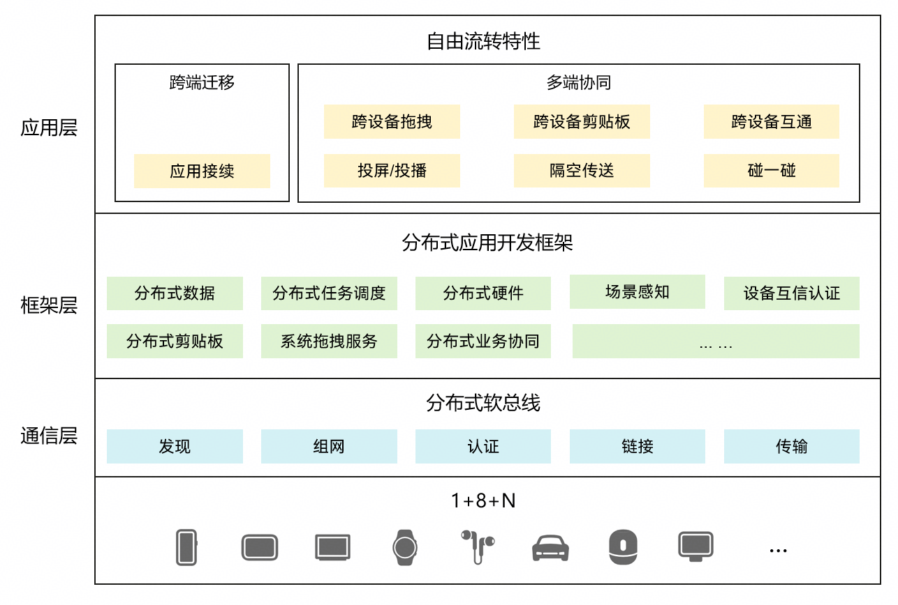

# 自由流转概述

更新时间：2026-04-01 09:49:00

来源：https://developer.huawei.com/consumer/cn/doc/best-practices/bpta-hopping

## 概述

随着全场景多设备的生活方式不断深入，用户拥有的设备数量日益增加。不同设备可以在适宜的场景下提供更优质的体验，如手表便于即时信息查看，电视则提供沉浸式观影体验。然而，每种设备的使用场景存在局限，例如，在电视上输入文本相较于移动设备而言，体验较差。当多个设备通过分布式操作系统能够相互感知、进而整合成一个超级终端时，设备间就可以取长补短、相互帮助，为用户提供更加自然流畅的分布式体验。

在HarmonyOS中，将跨多设备的分布式操作统称为流转；根据使用场景的不同，流转又分为跨端迁移和多端协同两种具体场景。

## 基本概念

- **自由流转**在HarmonyOS中泛指跨多设备的分布式操作。流转能力打破设备界限，多设备联动，使用户应用程序可分可合、可流转，实现如邮件跨设备编辑、多设备协同健身、多屏游戏等分布式业务。流转为开发者提供更广的使用场景和更新的产品视角，强化产品优势，实现体验升级。流转按照使用场景可分为**跨端迁移**和**多端协同**。
- **跨端迁移**在用户使用设备的过程中，当使用情境发生变化时（例如从室内走到户外或者周围有更合适的设备等），之前使用的设备可能已经不适合继续当前的任务，此时，用户可以选择新的设备来继续当前的任务，原设备可按需决定是否退出任务，这就是跨端迁移场景。 常见的跨端迁移场景实例：在平板上播放的视频，迁移到智慧屏继续播放，从而获得更佳的观看体验；平板上的视频应用退出。 在应用开发层面，跨端迁移指在A端运行的UIAbility迁移到B端上，完成迁移后，B端UIAbility继续任务，而A端UIAbility可按需决定是否退出。
- **多端协同**用户拥有的多个设备，可以作为一个整体，为用户提供比单设备更加高效、沉浸的体验，这就是多端协同场景。 常见的多端协同场景实例： 场景一：两台设备A和B打开备忘录同一篇笔记进行双端协同编辑，在设备A上可以使用本地图库中的图片资源插入编辑，设备B上进行文字内容编辑。 场景二：设备A上正在和客户进行聊天，客户需要的资料在设备B上，可以通过聊天软件打开设备B上的文档应用选择到想要的资料回传到设备A上，然后通过聊天软件发送给客户。 在应用开发层面，多端协同指多端上的不同UIAbility/ServiceExtensionAbility同时运行、或者交替运行实现完整的业务；或者多端上的相同UIAbility/ServiceExtensionAbility同时运行实现完整的业务。

## 自由流转架构

### 框架

自由流转依赖于鸿蒙系统提供的分布式运行环境，底层依托分布式软总线，解决设备发现、连接、组网等痛点，打通1+8+N互联互通能力，对外提供硬件、数据、应用三个维度的跨设备访问能力，应用开发只需遵循框架并适配应用层提供的指定的API，就能实现设备之间的跨端迁移和多端协同。

### 特性

|  | 特性 | 特性介绍 | 开发参考 |
| --- | --- | --- | --- |
| 跨端迁移 | 应用接续 | 指当用户在一个设备上操作某个应用时，可以在另一个设备的同一个应用中快速切换，并无缝衔接上一个设备的应用体验。 | 可参考[应用接续概述](https://developer.huawei.com/consumer/cn/doc/best-practices/bpta-continue-cast)。 |
| 多端协同 | 跨设备拖拽 | 跨端拖拽提供跨设备的键鼠共享能力，支持在平板或2in1类型的任意两台设备之间拖拽文件、文本。 | 跨设备拖拽功能只需接入拖拽即可实现，可参考[统一拖拽](https://developer.huawei.com/consumer/cn/doc/best-practices/bpta-unified-drag-and-drop)实现，效果如[跨设备拖拽](https://developer.huawei.com/consumer/cn/doc/best-practices/bpta-distribute-drag-cast)。 |
| 跨设备剪贴板 | 当用户拥有多台设备时，可以通过跨设备剪贴板的功能，在A设备的应用上复制一段文本，粘贴到B设备的应用中，高效地完成多设备间的内容共享。 | 跨设备剪贴板功能只需接入剪贴板即可实现，可参考[跨设备剪贴板](https://developer.huawei.com/consumer/cn/doc/best-practices/bpta-distributed-pasteboard-cast)实现。 |  |
| 跨设备互通 | 跨设备互通提供跨设备的相机、扫描、图库访问能力，平板或2in1设备可以调用手机的相机、扫描、图库等功能。 | 可参考[跨设备互通特性简介](https://developer.huawei.com/consumer/cn/doc/harmonyos-guides/servicecollaboration-service-overview)实现。 |  |
| 投屏 | 可在系统镜像投屏后，获取投屏设备信息，实现扩展屏模式的投播，实现双屏协作的能力。 | 可参考[扩展屏投播开发指导](https://developer.huawei.com/consumer/cn/doc/harmonyos-guides/avsession-extended-screen)实现。 |  |
| 投播 | 使用媒体播控，可以简单高效地将音频投放到其他HarmonyOS设备上播放，如在手机上播放的音频，可以投到2in1设备上继续播放。 | 若实现音乐类投播可参考[音频投播](https://developer.huawei.com/consumer/cn/doc/best-practices/bpta-audio-cast)实践实现，视频类投播参考[视频投播](https://developer.huawei.com/consumer/cn/doc/best-practices/bpta-vdeocast)实践实现。 |  |
| 隔空传送 | Share Kit新推出隔空传送分享，支持用户通过“一抓一放”实现跨端传输。 | 可以参考[隔空传送快速分享](https://developer.huawei.com/consumer/cn/doc/best-practices/bpta-application-gesture-share)实现。 |  |
| 碰一碰分享 | Share Kit推出碰一碰分享，支持用户通过碰一碰发起跨端分享，可实现传输图片、共享Wi-Fi等。 | 若实现笔记、购物信息、长视频短视频一碰分享，或碰一碰游戏组队，可参考[碰一碰链接分享](https://developer.huawei.com/consumer/cn/doc/best-practices/bpta-application-knock-video-share)实现，若实现一碰发送/接收文件，可参考[碰一碰文件分享](https://developer.huawei.com/consumer/cn/doc/best-practices/bpta-application-knock-file-share)。 |  |

