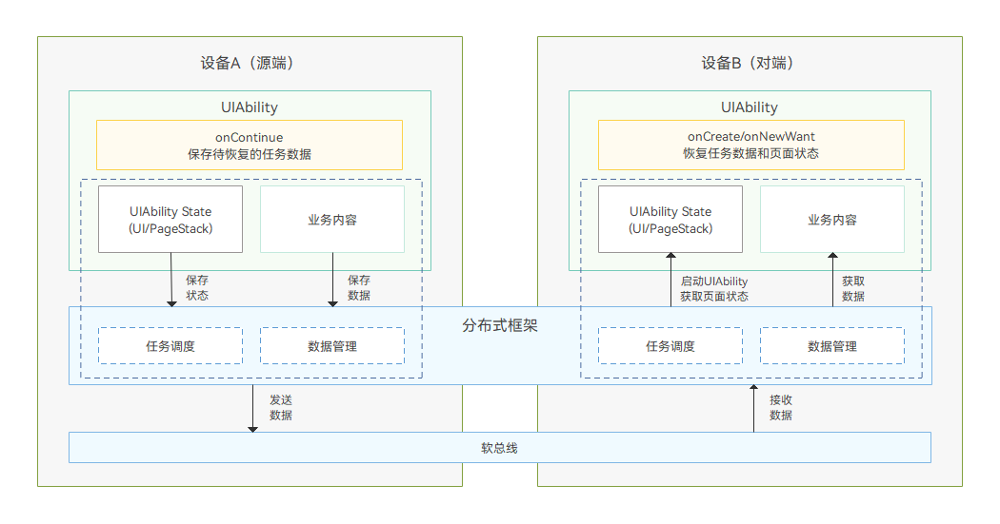
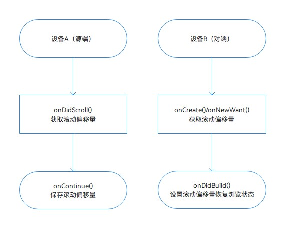
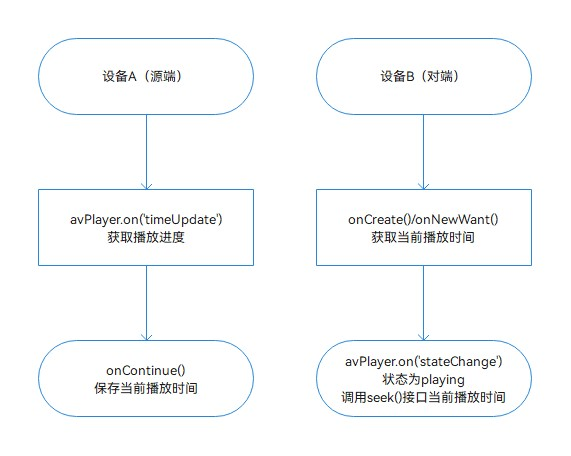
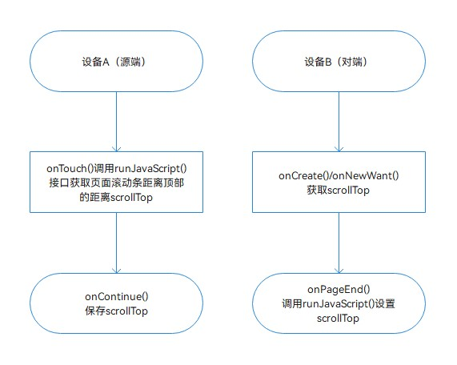
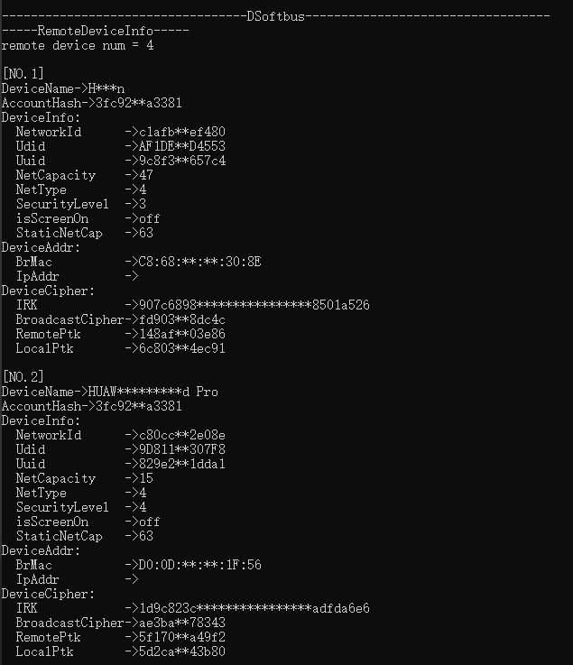

# 常见接续最佳实践

更新时间：2026-04-01 09:49:00

来源：https://developer.huawei.com/consumer/cn/doc/best-practices/bpta-application-continue-progess

## 概述


在日常生活中，随着个人设备数量的不断增加，用户在使用某个应用时，如果有更合适的设备在附近，可以利用接续功能将应用无缝切换到新设备上继续当前操作。本文主要针对长列表进度、媒体播放进度和Web浏览进度三个场景，实现了浏览进度的高效接续，提供给用户一种无缝的设备切换体验和浏览连贯性保障，确保用户在切换设备时能够轻松恢复之前的浏览进度，极大地提升了使用的便捷性和连贯性，实现了真正的无缝接续。

- [长列表进度接续](#section16702516134216)：可以让用户从上次离开的位置继续浏览，无需从头开始，精准定位到之前的条目附近，节省时间并减少操作成本，提升浏览体验。
- [媒体播放进度接续](#section12439210434)：从源设备当前播放的位置继续播放视频，保持播放进度、画面质量和音频设置的一致性，确保用户的观影体验不被打断。支持在线视频平台的剧集、电影以及本地存储的视频文件，实现流畅的接续播放。
- [Web浏览进度接续](#section3512987460)：能够快速定位到源设备浏览的网页位置，确保用户浏览的连续性，避免重复查找信息的不便，提高信息获取的效率。


## 实现原理


接续过程底层依赖分布式框架和软总线，开发者只需要启用接续、保存数据和恢复数据，具体运作机制可参考：运作机制。





## 开发流程


进度接续的核心在于确保进度数据在不同设备间的精确传输与同步。在实际开发过程中，开发者会遇到各种复杂的接续需求，首要任务是深入分析哪些数据对接续控制至关重要。在源设备启动接续时，应保存数据；在目标设备接续时，需准确恢复数据，以确保进度的连续性和设备间数据的一致性。

本章节将介绍如何配置应用以使用接续能力，以及如何保存和恢复数据以实现应用的无缝接续。具体场景包括长列表进度接续、媒体播放进度接续和Web浏览进度接续。

1. 启用接续在module.json5文件的abilities中，将continuable标签配置为“true”，表示该UIAbility可以被迁移。配置为“false”的UIAbility将被系统识别为不可迁移，且该配置的默认值为“false”。
```json
{
  "module": {
    // ...
    "abilities": [
      {
        // ...
        "continuable": true
      }
    ]
    // ...
  }
}
```
2. 源端保存迁移数据当对端点击接续图标时，源端将触发UIAbility中的[onContinue()](https://developer.huawei.com/consumer/cn/doc/harmonyos-references/js-apis-app-ability-uiability#oncontinue)接口。在此接口中，开发者可以将需要迁移的数据以键值对形式保存至wantParam中，并返回AbilityConstant.OnContinueResult.AGREE，标识应用同意迁移，从而将数据迁移至对端。
```ts
async onContinue(wantParam: Record<string, Object>): Promise<AbilityConstant.OnContinueResult> {
  // 1.1 Retrieve the data to be connected and transmit it via wantParam.
  let continueIndex = AppStorage.get('continueIndex') as number;
  wantParam.continueIndex = continueIndex;
  let currentOffset = AppStorage.get('currentOffset') as number;
  wantParam.currentOffset = currentOffset;
  let continueHeight = AppStorage.get('listItemHeight') as number;
  wantParam.continueHeight = continueHeight;
  let currentTime = AppStorage.get('currentTime') as number;
  wantParam.continueTime = currentTime;
  let videoIndex = AppStorage.get('videoIndex') as number;
  wantParam.continueItem = videoIndex;
  let flag = AppStorage.get('flag') as boolean;
  wantParam.flag = flag;
  let url = AppStorage.get('pageUrl') as string;
  wantParam.pageUrl = url;
  let distance = AppStorage.get('scrollDistance') as number;
  wantParam.scrollDistance = distance;
  let breakpoint = AppStorage.get(BreakpointConstants.BREAKPOINT_NAME) as string;
  wantParam.breakpoint = breakpoint;
  let pageInfos = AppStorage.get('pageInfos') as NavPathStack;
  let pageArr = pageInfos.getAllPathName();
  let currentPage = '';
  if (pageArr.length > 0) {
    currentPage = pageArr[pageArr.length - 1];
  }
  AppStorage.setOrCreate('continue', false);
  wantParam.currentPage = currentPage;

  return AbilityConstant.OnContinueResult.AGREE;
}
```
3. 对端恢复数据在源端保存数据并同意迁移后，对端可启动应用，并在UIAbility中的onCreate()或onNewWant()生命周期回调中恢复数据。如果Ability的启动原因为LaunchReason.CONTINUATION，开发者可以从want.parameters中获取保存的键值对数据。
```ts
onCreate(want: Want, launchParam: AbilityConstant.LaunchParam): void {
  GlobalContext.getContext().setObject('abilityWant', want);
  GlobalContext.getContext().setObject('context', this.context);
  if (want.parameters) {
    if (want.parameters.currentTime) {
      GlobalContext.getContext().setObject('currentTime', want.parameters.currentTime);
    }
  }
  try {
    this.context.getApplicationContext().setColorMode(ConfigurationConstant.ColorMode.COLOR_MODE_NOT_SET);
  } catch (e) {
    hilog.error(0x000, 'progress', `setColorMode error ${JSON.stringify(e)}`);
  }
  if (launchParam.launchReason === AbilityConstant.LaunchReason.CONTINUATION) {
    if (want.parameters) {
      this.continueRestore(want);
    }
  }
  hilog.info(DOMAIN, 'testTag', '%{public}s', 'Ability onCreate');
}
```
 可将恢复数据的方法提取为公共方法，以便于在UIAbility的onCreate()或onNewWant()中调用。
```ts
continueRestore(want: Want) {
  if (!want.parameters) {
    hilog.error(0x0000, 'EntryAbility', 'missing sessionId');
    return;
  }
  let currentPage = want.parameters.currentPage as string;
  AppStorage.setOrCreate('currentPage', currentPage);
  want.parameters.continueIndex && AppStorage.setOrCreate('continueWaterOffset', want.parameters.continueIndex);
  want.parameters.currentOffset && AppStorage.setOrCreate('continueOffset', want.parameters.currentOffset);
  want.parameters.continueHeight && AppStorage.setOrCreate('continueHeight', want.parameters.continueHeight);
  AppStorage.setOrCreate('continueEntry', true);
  AppStorage.setOrCreate('setCurrentOffset', true);
  want.parameters.continueTime && AppStorage.setOrCreate('currentTime', want.parameters.continueTime);
  want.parameters.continueItem && AppStorage.setOrCreate('videoIndex', want.parameters.continueItem);
  want.parameters.continueItem && AppStorage.setOrCreate('videoSelect', want.parameters.continueItem);
  want.parameters.flag && AppStorage.setOrCreate('flag', want.parameters.flag);
  AppStorage.setOrCreate('continue', true);
  AppStorage.setOrCreate('continueRestore', true);
  want.parameters.pageUrl && AppStorage.setOrCreate('pageUrl', want.parameters.pageUrl);
  want.parameters.scrollDistance && AppStorage.setOrCreate('scrollDistance', want.parameters.scrollDistance);
  want.parameters.breakpoint && AppStorage.setOrCreate('continueBreakpoint', want.parameters.breakpoint);

  try {
    this.context.restoreWindowStage(new LocalStorage());
  } catch (e) {
    hilog.error(0x000, 'progress', `restoreWindowStage error ${JSON.stringify(e)}`);
  }
}
```


## 长列表进度接续


长列表通常用于存储大量信息，可以通过List、Grid、Scroll、WaterFlow等组件进行封装。系统提供了分布式迁移标识，以便在使用这些组件时恢复进度状态，调用起来非常方便。使用方法如下：

```ts
WaterFlow({ footer: this.footStyle, scroller: this.waterFlowScroller }) {
  // ...
}
.restoreId(1)
```

使用分布式迁移标识可以快速实现接续。然而，该方法存在局限性，具体支持的场景和版本详见分布式迁移标识的说明。若需在开发中进行更多自定义设置以提升用户体验，可参考以下步骤。





1. [启用接续](#li6149192715494)。
2. 在Scroll组件的onDidScroll()接口中监听长列表的浏览进度变化。
```ts
Scroll(this.scroller) {
  // ...
  .onDidScroll((xOffset: number, yOffset: number, scrollState: ScrollState) => {
    if (!this.setCurrentOffset) {
      this.currentOffset = this.scroller.currentOffset().yOffset;
    }
  })
```
3. 在UIAbility的onContinue()回调中，将进度相关数据保存到wantParam中，参考[保存迁移数据](#li1745816354491)。
4. 在UIAbility的onNewWant()和onCreate()回调中，从want.parameters中恢复数据，参考[恢复数据](#li631218439498)。
5. 在onDidBuild()事件中恢复浏览状态。
```ts
onDidBuild(): void {
  hilog.info(0x000, 'progress', `onDidBuild ${this.setCurrentOffset} ${this.continueOffset}`);
  if (this.setCurrentOffset) {
    this.scroller.scrollTo({ xOffset: 0, yOffset: this.continueOffset });
    this.setCurrentOffset = false;
  }
}
```


## 媒体播放进度接续


媒体播放接续的内容主要包括播放列表中的集数、播放状态和进度。此外，还可以接续其他播放设置，以进一步提升用户体验。





1. [启用接续](#li6149192715494)。
2. 使用avPlayer.on('timeUpdate')接口来监听媒体播放进度的变化。
```ts
this.avPlayer.on('timeUpdate', (time: number) => {
  if (this.isSliderAction) {
    return;
  }
  this.currentTime = time;
  AppStorage.set('currentTime', this.currentTime);
});
```
3. 在UIAbility的onContinue()回调中，将当前播放时间this.time保存到wantParam中，参考[保存迁移数据](#li1745816354491)。
4. 在UIAbility中的onNewWant()和onCreate()回调中，从want.parameters中恢复数据，参考[恢复数据](#li631218439498)。
5. 在avPlayer初始化完成后，判断当前为接续状态，调用封装的调整视频进度方法videoSeek()，恢复至接续前的播放状态。
```ts
if (this.continue) {
  this.videoSeek(continueTime);
  this.continue = false;
  AppStorage.set('continue', false);
}
```


## Web浏览进度接续


系统提供的Web组件用于在应用程序中展示Web页面内容。当Web组件加载大量信息时，保持浏览进度的连续性尤为重要。为了实现内容的连续展示，需要像处理长列表一样，通过传递当前的滚动位置来维持这一连续性。这可以通过使用runJavaScript()接口来获取和恢复滚动位置来实现。





1. [启用接续](#li6149192715494)。
2. 使用onTouch()事件监听屏幕滑动，并通过runJavaScript()接口获取页面滚动条距离顶部的距离。
3. 在onContinue()回调中，将this.scrollDistance保存到wantParam中，参考[保存迁移数据](#li1745816354491)。
4. 在onNewWant()和onCreate()回调中，从want.parameters中恢复数据，参考[恢复数据](#li631218439498)。
5. 在onPageEnd()回调中调用runJavaScript()接口以恢复进度。
```ts
Web({ src: this.pageUrl, controller: this.controller })
  // ...
  .onPageEnd(async () => {
    // ...
    if (this.pageUrl.includes('product_list') && this.continueRestore) {
      this.controller.runJavaScript(
        'javascript:document.getElementById("productList").scrollTop = ' +
          this.scrollDistance,
      );
    }
    this.pageUrl = this.controller.getUrl();
    let result = await this.controller.runJavaScript(
      'javascript:document.getElementById("productList").scrollTop',
    );
    this.scrollDistance = Number(result);
  })
  // ...
  .onTouch(async (event: TouchEvent) => {
    if (event.type === TouchType.Up) {
      if (this.pageUrl.includes('product_list')) {
        let result = await this.controller.runJavaScript(
          'javascript:document.getElementById("productList").scrollTop',
        );
        this.scrollDistance = Number(result);
      }
    }
  });
```


## 常见问题


## 打开任意可接续应用后，对端未显示接续图标


在打开系统浏览器、已有内容的备忘录笔记界面或新开发的应用界面后，对端均未出现接续图标，可以按照以下步骤进行排查：

1. 检查蓝牙是否已开启；
2. 检查接续功能是否已开启：设置->多设备协同->接续；
3. 检查是否已登录相同的华为账号；
4. 通过命令行检查组网是否成功；
```ts
hidumper -s 4700 -a "buscenter -l remote_device_info"
```
 执行完成后，RemoteDeviceInfo中列出的设备即为已成功与当前设备组网的设备。如下图所示，该设备已与两台其他设备成功组网。



## 1分钟以上无任何操作，图标将自动消失；再次操作应用时，图标将重新出现


图标显隐是系统的一项特性。根据当前的策略，图标在源端最后一次触屏操作后的1分钟内保持显示。如果超过1分钟没有进行任何操作，图标将自动隐藏，以减少对用户的干扰。同样地，当锁屏时，图标将在10秒后自动消失，这也是系统正常运行的一部分。


## 打开新接入的应用后，对端不出现图标


仅当应用配置了continuable标签，并且处于获焦且可接续状态时，才会发送接续广播，使得对端显示接续图标。可以按照以下步骤排查：

1. 确认两端均已安装应用；
2. 检查应用是否已将continuable标签设置为true；
3. 确认应用是否已调用setMissionContinueState()接口将自身的迁移状态设置为false。


## 示例代码


- [实现浏览进度接续功能](https://gitcode.com/harmonyos_samples/continue-progress)
