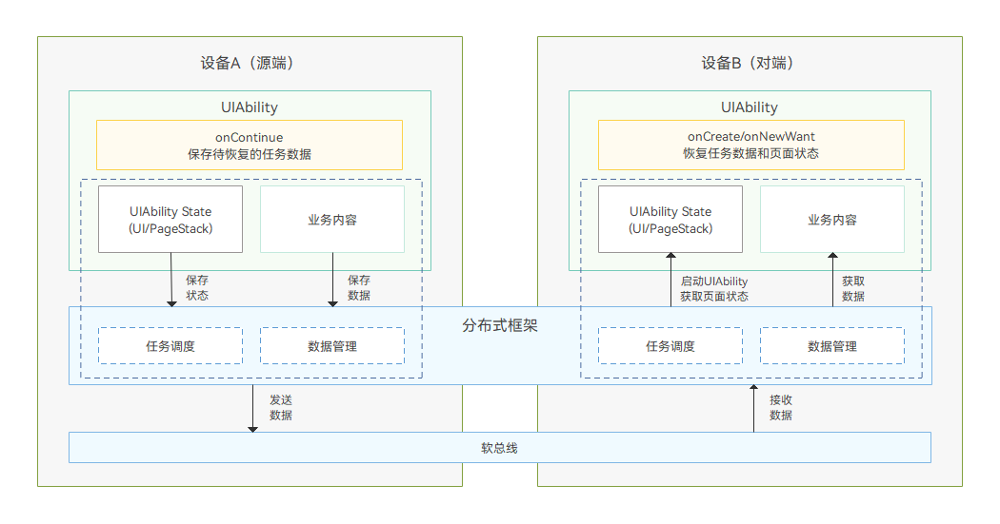
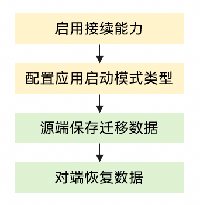

# 应用接续数据迁移

更新时间：2026-05-22 09:46:30

来源：https://developer.huawei.com/consumer/cn/doc/best-practices/bpta-continue-data

#### 概述
在应用接续实践过程中，需要选择合适的数据迁移方案进行迁移，迁移方案的选择与数据大小和是否涉及文件迁移有直接关系，选择方案如下：

|  | <100kb | >100kb |
| --- | --- | --- |
| 需要文件迁移 | 文件资产迁移 | 文件资产迁移 |
| 不需要文件迁移 | 使用want.param数据迁移 | 基础数据迁移 |

#### 实现原理

实现原理见[运作机制](https://developer.huawei.com/consumer/cn/doc/best-practices/bpta-continue-cast#section1218874218264)。

#### 开发步骤
接入应用接续需要[启用应用接续能力](https://developer.huawei.com/consumer/cn/doc/best-practices/bpta-continue-cast#section15192222815)、[配置应用启动模式类型](https://developer.huawei.com/consumer/cn/doc/best-practices/bpta-continue-cast#section10604645308)、[源端保存迁移数据](https://developer.huawei.com/consumer/cn/doc/best-practices/bpta-continue-cast#section634613594303)和[对端恢复数据](https://developer.huawei.com/consumer/cn/doc/best-practices/bpta-continue-cast#section12346113618453)，具体开发流程见[应用接续概述](https://developer.huawei.com/consumer/cn/doc/best-practices/bpta-continue-cast)，本文只关注在不同场景下迁移数据方案的选择。

#### 使用want.param数据迁移
1. 源端保存迁移数据 // ...
export default class EntryAbility extends UIAbility {
  // ...
  onContinue(wantParam: Record<string, Object>) {
 const continueInput = '迁移的数据';
 if (continueInput) {
 wantParam['data'] = continueInput;
 }
 // ...
 return AbilityConstant.OnContinueResult.AGREE;
  }
  // ...
}
2. 对端恢复数据 export default class EntryAbility extends UIAbility {
  storage: LocalStorage = new LocalStorage();
  onCreate(want: Want, launchParam: AbilityConstant.LaunchParam): void {
 if (launchParam.launchReason === AbilityConstant.LaunchReason.CONTINUATION) {
 let continueInput = '';
 if (want.parameters !== undefined) {
 continueInput = JSON.stringify(want.parameters.data);
 console.info(`continue input ${continueInput}`)
 }
 // ...
 this.context.restoreWindowStage(this.storage);
 }
 // ...
  }

  // ...
}

#### 使用分布式对象迁移数据
#### 基础数据迁移
1. 源端保存迁移数据 在源端UIAbility的onContinue()接口中创建分布式数据对象并保存数据，执行流程如下：  在onContinue()接口中使用create()接口创建分布式数据对象，将所要迁移的数据填充到分布式数据对象中。 调用genSessionId()接口生成分布式数据对象组网id，分布式数据对象调用setSessionId()方法将id传入，激活分布式数据对象。 使用save()接口将已激活的分布式数据对象持久化，确保源端退出后对端依然可以获取到数据。 将生成的sessionId通过want传递到对端，供对端激活同步使用。 分布式数据对象需要先激活，再持久化，因此必须在调用setSessionId()后再调用save()接口。 对于源端迁移后需要退出的应用，为了防止数据未保存完成应用就退出，应采用await的方式等待save()接口执行完毕。从API12 起，onContinue()接口提供了async版本供该场景使用。 当前，wantParams中“sessionId”字段在迁移流程中被系统占用，建议开发者在wantParams中定义其他key值存储该分布式数据对象生成的id，避免数据异常。 import { UIAbility, AbilityConstant, Want } from '@kit.AbilityKit';
import { distributedDataObject } from '@kit.ArkData';
import { BusinessError } from '@kit.BasicServicesKit';
import { hilog } from '@kit.PerformanceAnalysisKit';
// ...

const TAG: string = '[MigrationAbility]';
const DOMAIN_NUMBER: number = 0xFF00;
class ParentObject {
  mother: string
  father: string

  constructor(mother: string, father: string) {
 this.mother = mother
 this.father = father
  }
}

class SourceObject {
  name: string | undefined
  age: number | undefined
  isVis: boolean | undefined
  parent: ParentObject | undefined

  constructor(name: string | undefined, age: number | undefined, isVis: boolean | undefined, parent: ParentObject | undefined) {
 this.name = name
 this.age = age
 this.isVis = isVis
 this.parent = parent
  }
}

export default class MigrationAbility extends UIAbility {
  d_object?: distributedDataObject.DataObject;
  // ...

  // ...

  async onContinue(wantParam: Record<string, Object>): Promise&lt;AbilityConstant.OnContinueResult&gt; {
 // ...
 let parentSource: ParentObject = new ParentObject('jack mom', 'jack Dad');
 let source: SourceObject = new SourceObject('jack', 18, false, parentSource);

 this.d_object = distributedDataObject.create(this.context, source);

 let dataSessionId: string = distributedDataObject.genSessionId();
 this.d_object.setSessionId(dataSessionId);

 wantParam['dataSessionId'] = dataSessionId;

 this.d_object.save(wantParam.targetDevice as string).then((result:
 distributedDataObject.SaveSuccessResponse) => {
 hilog.info(DOMAIN_NUMBER, TAG, `Succeeded in saving. SessionId: ${result.sessionId},
 version:${result.version}, deviceId:${result.deviceId}`);
 }).catch((err: BusinessError) => {
 hilog.error(DOMAIN_NUMBER, TAG, 'Failed to save. Error: ', JSON.stringify(err) ?? '');
 });
 // ...
  }

  // ...
}
2. 对端恢复数据 在对端UIAbility的onCreate()/onNewWant()中，通过加入与源端一致的分布式数据对象组网进行数据恢复。执行流程如下：  创建空的分布式数据对象，用于接收恢复的数据； 从want中读取分布式数据对象组网id； 注册on()接口监听数据变更。在收到status为restore的事件的回调中，实现数据恢复完毕时需要进行的业务操作。 调用setSessionId()加入组网，激活分布式数据对象。 对端加入组网的分布式数据对象不能为临时变量，因为在分布式数据对象on()接口为异步回调，可能在onCreate()/onNewWant()执行结束后才执行，临时变量被释放可能导致空指针异常。可以使用类成员变量避免该问题。 对端用于创建分布式数据对象的Object，其属性应在激活分布式数据对象前置为undefined，否则会导致新数据加入组网后覆盖源端数据，数据恢复失败。 应当在激活分布式数据对象之前，调用分布式数据对象的on()接口进行注册监听，防止错过restore事件导致数据恢复失败。 const TAG: string = '[MigrationAbility]';
const DOMAIN_NUMBER: number = 0xFF00;

export default class MigrationAbility extends UIAbility {
  d_object?: distributedDataObject.DataObject;
  // ...

  onCreate(want: Want, launchParam: AbilityConstant.LaunchParam): void {
 if (launchParam.launchReason === AbilityConstant.LaunchReason.CONTINUATION) {
 this.handleDistributedData(want);
 }
  }

  onNewWant(want: Want, launchParam: AbilityConstant.LaunchParam): void {
 if (launchParam.launchReason === AbilityConstant.LaunchReason.CONTINUATION) {
 if (want.parameters !== undefined) {
 this.handleDistributedData(want);
 }
 }
  }

  handleDistributedData(want: Want) {
 let remoteSource: SourceObject = new SourceObject(undefined, undefined, undefined, undefined);
 this.d_object = distributedDataObject.create(this.context, remoteSource);
 let dataSessionId = '';
 if (want.parameters !== undefined) {
 dataSessionId = want.parameters.dataSessionId as string;
 }
 this.d_object.on('status', (sessionId: string, networkId: string, status: 'online' | 'offline' | 'restored') => {
 hilog.info(DOMAIN_NUMBER, TAG, 'status changed ' + sessionId + ' ' + status + ' ' + networkId);
 if (status === 'restored') {
 if (this.d_object) {
 hilog.info(DOMAIN_NUMBER, TAG, 'restored name:' + this.d_object['name']);
 hilog.info(DOMAIN_NUMBER, TAG, 'restored parents:' + JSON.stringify(this.d_object['parent']));
 // ...
 }
 }
 });
 this.d_object.setSessionId(dataSessionId);
  }

  // ...

  // ...
}

#### 文件资产迁移
- **单个文件资产迁移** 对于图片、文档等文件类数据，需要先将其转换为资产commonType.Asset类型，再封装到分布式数据对象中进行迁移。迁移实现方式与普通的分布式数据对象类似，下面仅针对差异部分进行说明。  在源端，将需要迁移的文件资产保存到分布式数据对象DataObject中，执行流程如下：   将文件资产拷贝到分布式文件目录下，相关接口与用法详见基础文件接口。 let distributedDir: string = this.context.distributedFilesDir; // 获取分布式文件目录路径
let fileName: string = '/test.txt'; // 文件名
let filePath: string = distributedDir + fileName; // 文件路径

try {
  let file = fileIo.openSync(filePath, fileIo.OpenMode.READ_WRITE | fileIo.OpenMode.CREATE);
  hilog.info(DOMAIN_NUMBER, TAG, 'Create file success.');
  fileIo.writeSync(file.fd, '[Sample] Insert file content here.');
  fileIo.closeSync(file.fd);
} catch (error) {
  let err: BusinessError = error as BusinessError;
  hilog.error(DOMAIN_NUMBER, TAG,
 `Failed to openSync / writeSync / closeSync. Code: ${err.code}, message: ${err.message}`);

} 使用分布式文件目录下的文件创建Asset资产对象。 let distributedUri: string = fileUri.getUriFromPath(filePath); 

let ctime: string = '';
let mtime: string = '';
let size: string = '';
await fileIo.stat(filePath).then((stat: fileIo.Stat) => {
  ctime = stat.ctime.toString(); 
  mtime = stat.mtime.toString(); 
  size = stat.size.toString();

})

let attachment: commonType.Asset = {
  name: fileName,
  uri: distributedUri,
  path: filePath,
  createTime: ctime,
  modifyTime: mtime,
  size: size,
} 将Asset资产对象作为分布式数据对象的根属性保存。 let parentSource: ParentObject = new ParentObject('jack mom', 'jack Dad');
let source: SourceObject = new SourceObject('jack', 18, false, parentSource, attachment);
this.d_object = distributedDataObject.create(this.context, source);  随后，与普通数据对象的迁移的源端实现相同，可以使用该数据对象加入组网，并进行持久化保存。
- **多文件资产迁移** 若应用想要同步多个资产，可采用两种方式实现：  可将每个资产作为分布式数据对象的一个根属性实现，适用于要迁移的资产数量固定的场景。 可以将资产数组转化为Object传递，适用于需要迁移的资产个数会动态变化的场景（如用户选择了不定数量的图片）。当前不支持直接将资产数组作为根属性传递。  其中方式1的实现可以直接参照添加一个资产的方式添加更多资产。方式2的示例如下所示： import { distributedDataObject, commonType } from '@kit.ArkData';
import { UIAbility, AbilityConstant, Want } from '@kit.AbilityKit';
// ...

class SourceObject {
  name: string | undefined
  assets: Object | undefined  
  constructor(name: string | undefined, assets: Object | undefined) {
 this.name = name
 this.assets = assets;
  }
}

export default class MigrationAbility_multi_asset extends UIAbility {
  d_object?: distributedDataObject.DataObject;
  // ...

  GetAssetsWrapper(assets: commonType.Assets): Record<string, commonType.Asset> {
 let wrapper: Record<string, commonType.Asset> = {}
 let num: number = assets.length;
 for (let i: number = 0; i < num; i++) {
 wrapper[`asset${i}`] = assets[i];
 }
 return wrapper;
  }

  async onContinue(wantParam: Record<string, Object>): Promise&lt;AbilityConstant.OnContinueResult&gt; {
 // ...
 let attachment1: commonType.Asset = {
 // ...
 }

 let attachment2: commonType.Asset = {
 // ...
 }

 let assets: commonType.Assets = [];
 assets.push(attachment1);
 assets.push(attachment2);

 let assetsWrapper: Object = this.GetAssetsWrapper(assets);
 let source: SourceObject = new SourceObject('jack', assetsWrapper);
 this.d_object = distributedDataObject.create(this.context, source);

 // ...
  }
}