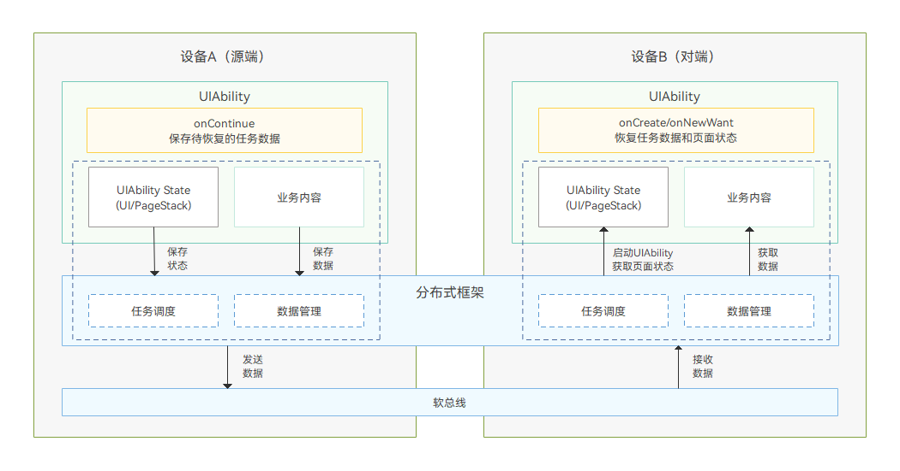
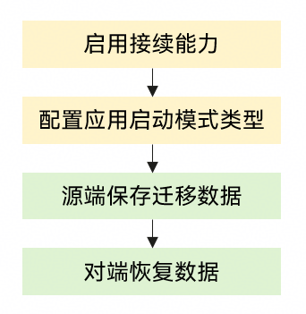

# 应用接续数据迁移

更新时间：2026-08-10 06:55:01

来源：https://developer.huawei.com/consumer/cn/doc/best-practices/bpta-continue-data

#### 概述

在应用接续实践过程中，需要选择合适的数据迁移方案进行迁移，迁移方案的选择与数据大小和是否涉及文件迁移有直接关系，选择方案如下：
 
  
|    | <100kb | >100kb |
| --- | --- | --- |
| 需要文件迁移 | 文件资产迁移 | 文件资产迁移 |
| 不需要文件迁移 | 使用want.param数据迁移 | 基础数据迁移 |
 
 

#### 实现原理




 
实现原理见[运作机制](https://developer.huawei.com/consumer/cn/doc/best-practices/bpta-continue-cast#section1218874218264)。
 
 

#### 开发步骤

接入应用接续需要[启用应用接续能力](https://developer.huawei.com/consumer/cn/doc/best-practices/bpta-continue-cast#section15192222815)、[配置应用启动模式类型](https://developer.huawei.com/consumer/cn/doc/best-practices/bpta-continue-cast#section10604645308)、[源端保存迁移数据](https://developer.huawei.com/consumer/cn/doc/best-practices/bpta-continue-cast#section634613594303)和[对端恢复数据](https://developer.huawei.com/consumer/cn/doc/best-practices/bpta-continue-cast#section12346113618453)，具体开发流程见[应用接续概述](https://developer.huawei.com/consumer/cn/doc/best-practices/bpta-continue-cast)，本文只关注在不同场景下迁移数据方案的选择。
 



 
 

#### 使用want.param数据迁移
1. 源端保存迁移数据
```ArkTS
export default class EntryAbility extends UIAbility {
  // ...
  async onContinue(wantParam: Record<string, Object | undefined>): Promise<AbilityConstant.OnContinueResult> {
    // ...
    // Migrate simple data using wantParam.param
    wantParam.wantBasicData = AppStorage.get('wantBasicData');
    // ...
    // Return AGREE to allow cross-device migration
    return AbilityConstant.OnContinueResult.AGREE;
  }
  // ...
}
```

2. 对端恢复数据
```ArkTS
export default class EntryAbility extends UIAbility {
  private distributedObject: distributedDataObject.DataObject | undefined = undefined;
  private storage: LocalStorage = new LocalStorage();
  private distributedFileUtil: DistributedFileUtil | undefined = undefined;
  onCreate(want: Want, launchParam: AbilityConstant.LaunchParam): void {
    hilog.info(DOMAIN, TAG, FORMAT, `Ability onCreate`);
    this.distributedFileUtil = new DistributedFileUtil(this.context);
    this.appContinuity(want, launchParam);
  }

  onNewWant(want: Want, launchParam: AbilityConstant.LaunchParam): void {
    hilog.info(DOMAIN, TAG, FORMAT, `Ability onNewWant`);
    this.appContinuity(want, launchParam);
  }

  appContinuity(want: Want, launchParam: AbilityConstant.LaunchParam) {
    if (launchParam.launchReason === AbilityConstant.LaunchReason.CONTINUATION) {
      if (want.parameters !== undefined) {
        // Use want.param to migrate the simple data page data
        AppStorage.setOrCreate('wantBasicData', want.parameters.wantBasicData);
      }
      // ...
      try {
        // Restore window stage with new LocalStorage instance
        this.context.restoreWindowStage(this.storage);
      } catch (err) {
        hilog.error(DOMAIN, TAG, FORMAT, `RestoreWindowStage failed. Cause : ${err}`);
      }
    }
  }

  // ...
}
```

 
 

#### 使用分布式对象迁移数据

 

#### 基础数据迁移
1. 源端保存迁移数据在源端UIAbility的[onContinue()](https://developer.huawei.com/consumer/cn/doc/harmonyos-references/js-apis-app-ability-uiability#oncontinue)接口中创建分布式数据对象并保存数据，执行流程如下：

  
- 在onContinue()接口中使用create()接口创建分布式数据对象，将所要迁移的数据填充到分布式数据对象中。

2. 调用genSessionId()接口生成分布式数据对象组网id，分布式数据对象调用setSessionId()方法将id传入，激活分布式数据对象。

3. 使用save()接口将已激活的分布式数据对象持久化，确保源端退出后对端依然可以获取到数据。

4. 将生成的sessionId通过want传递到对端，供对端激活同步使用。

  
> [!NOTE]
> 分布式数据对象需要先激活，再持久化，因此必须在调用setSessionId()后再调用save()接口。 对于源端迁移后需要退出的应用，为了防止数据未保存完成应用就退出，应采用await的方式等待save()接口执行完毕。从API12起，onContinue()接口提供了async版本供该场景使用。 当前，wantParams中“sessionId”字段在迁移流程中被系统占用，建议开发者在wantParams中定义其他key值存储该分布式数据对象生成的id，避免数据异常。


  
```ArkTS
export class ContinuationData {
  public basicDataStr: string | undefined;
  public basicDataNum: number | undefined;
  public distributedData: DistributedData | undefined;
  // ...
  constructor(
    basicDataStr: string | undefined,
    basicDataNum: number | undefined,
    distributedData: DistributedData | undefined,
    // ...
  ) {
    this.basicDataStr = basicDataStr;
    this.basicDataNum = basicDataNum;
    this.distributedData = distributedData;
    // ...
  }
  // ...
}
```
 
```ArkTS
export default class EntryAbility extends UIAbility {
  private distributedObject: distributedDataObject.DataObject | undefined = undefined;
  private storage: LocalStorage = new LocalStorage();
  private distributedFileUtil: DistributedFileUtil | undefined = undefined;
  // ...
  async onContinue(wantParam: Record<string, Object | undefined>): Promise<AbilityConstant.OnContinueResult> {
    if (!this.distributedFileUtil) {
      return AbilityConstant.OnContinueResult.REJECT;
    }
    // ...
    let sessionId: string = distributedDataObject.genSessionId();
    wantParam.distributedSessionId = sessionId;
    // ...
    let contentInfo: ContinuationData = new ContinuationData(
      AppStorage.get('basicDataStr') ?? '',
      AppStorage.get('basicDataNum') ?? undefined,
      AppStorage.get('distributedData') ?? undefined,
      // ...
      (AppStorage.get('pageInfos') as NavPathStack).getAllPathName()[0]
    );
    let source = await contentInfo.flatAssets();
    this.distributedObject = distributedDataObject.create(this.context, source);
    this.distributedObject.setSessionId(sessionId).catch((err: BusinessError) => {
      hilog.info(DOMAIN, TAG, FORMAT, `SetSessionId failed. Cause code: ${err.code}`);
    });
    await this.distributedObject.save(wantParam.targetDevice as string).catch((err: BusinessError) => {
      hilog.info(DOMAIN, TAG, FORMAT, `Failed to save. Code: ${err.code}`);
    });
    // Return AGREE to allow cross-device migration
    return AbilityConstant.OnContinueResult.AGREE;
  }
  // ...
}
```

- 对端恢复数据在对端UIAbility的onCreate()/onNewWant()中，通过加入与源端一致的分布式数据对象组网进行数据恢复。执行流程如下：

1. 创建空的分布式数据对象，用于接收恢复的数据；

2. 从want中读取分布式数据对象组网id；

3. 注册on()接口监听数据变更。在收到status为restore的事件的回调中，实现数据恢复完毕时需要进行的业务操作。

4. 调用setSessionId()加入组网，激活分布式数据对象。

  
> [!NOTE]
> 对端加入组网的分布式数据对象不能为临时变量，因为分布式数据对象on()接口为异步回调，可能在onCreate()/onNewWant()执行结束后才执行，临时变量被释放可能导致空指针异常。可以使用类成员变量避免该问题。 对端用于创建分布式数据对象，其属性应在激活分布式数据对象设置为undefined，否则会导致新数据加入组网后覆盖源端数据，数据恢复失败。 应当在激活分布式数据对象之前，调用分布式数据对象的on()接口进行注册监听，防止错过restore事件导致数据恢复失败。


  
```ArkTS
export default class EntryAbility extends UIAbility {
  private distributedObject: distributedDataObject.DataObject | undefined = undefined;
  private storage: LocalStorage = new LocalStorage();
  private distributedFileUtil: DistributedFileUtil | undefined = undefined;
  onCreate(want: Want, launchParam: AbilityConstant.LaunchParam): void {
    hilog.info(DOMAIN, TAG, FORMAT, `Ability onCreate`);
    this.distributedFileUtil = new DistributedFileUtil(this.context);
    this.appContinuity(want, launchParam);
  }

  onNewWant(want: Want, launchParam: AbilityConstant.LaunchParam): void {
    hilog.info(DOMAIN, TAG, FORMAT, `Ability onNewWant`);
    this.appContinuity(want, launchParam);
  }

  appContinuity(want: Want, launchParam: AbilityConstant.LaunchParam) {
    if (launchParam.launchReason === AbilityConstant.LaunchReason.CONTINUATION) {
      // ...
      let mailInfo: ContinuationData = new ContinuationData(undefined, undefined, undefined, undefined, undefined,
        undefined, undefined, undefined, undefined, undefined);
      this.distributedObject = distributedDataObject.create(this.context, mailInfo);
      // Add a data restored listener.
      try {
        this.distributedObject.on('status',
          (_sessionId: string, _networkId: string, status: 'online' | 'offline' | 'restored') => {
            if (status === 'restored') {
              if (!this.distributedObject || !this.distributedFileUtil) {
                return;
              }
              // Use the distributed object migration to transfer the basic page data
              AppStorage.setOrCreate('basicDataStr', this.distributedObject['basicDataStr'] ?? '');
              AppStorage.setOrCreate('basicDataNum', this.distributedObject['basicDataNum'] ?? undefined);
              AppStorage.setOrCreate('distributedData', this.distributedObject['distributedData'] ?? undefined);
              // ...
              AppStorage.setOrCreate('curPageInfos', this.distributedObject['curPageInfos'] ?? undefined);
            }
          });
      } catch (err) {
        hilog.error(DOMAIN, TAG, FORMAT, `On status failed. Cause code: ${err.code}`);
      }
      let sessionId: string = want.parameters?.distributedSessionId as string;
      this.distributedObject.setSessionId(sessionId).catch((err: BusinessError) => {
        hilog.info(DOMAIN, TAG, FORMAT, `SetSessionId failed. Cause code: ${err.code}`);
      });
      try {
        // Restore window stage with new LocalStorage instance
        this.context.restoreWindowStage(this.storage);
      } catch (err) {
        hilog.error(DOMAIN, TAG, FORMAT, `RestoreWindowStage failed. Cause : ${err}`);
      }
    }
  }

  // ...
}
```


 
 

#### 文件资产迁移

- **单个文件资产迁移**对于图片、文档等文件类数据，需要先将其转换为资产commonType.Asset类型，再封装到分布式数据对象中进行迁移。迁移实现方式与普通的分布式数据对象类似，下面仅针对差异部分进行说明。

  
在源端，将需要迁移的文件资产保存到分布式数据对象DataObject中，执行流程如下：

1. 将文件资产拷贝到分布式文件目录下，相关接口与用法详见基础文件接口。
```ArkTS
async writeDistributedFile(buf: ArrayBuffer, displayName: string): Promise<void> {
  let distributedDir: string = this.context.distributedFilesDir;
  let fileName: string = '/' + displayName;
  let filePath: string = distributedDir + fileName;
  let file: fileIo.File | undefined = undefined;
  try {
    file = await fileIo.open(filePath, fileIo.OpenMode.READ_WRITE | fileIo.OpenMode.CREATE);
    hilog.info(DOMAIN, TAG, FORMAT, 'Create file success.');
    await fileIo.write(file.fd, buf);
    hilog.info(DOMAIN, TAG, FORMAT, `File written successfully: ${displayName}`);
  } catch (error) {
    let err: BusinessError = error as BusinessError;
    hilog.error(DOMAIN, TAG, FORMAT, `Failed to open / write. Code: ${err.code}`);
  } finally {
    if (file) {
      try {
        await fileIo.close(file);
      } catch (err) {
        hilog.error(DOMAIN, TAG, FORMAT, `Failed to close. Cause: ${err}`);
      }
    }
  }
}
```

2. 使用分布式文件目录下的文件创建Asset资产对象。
```ArkTS
async getAssetInfo(append: ImageInfo): Promise<commonType.Asset | undefined> {
  let filePath = this.context.distributedFilesDir + '/' + append.imageName;
  let attachment: commonType.Asset;
  try {
    let uri: string = fileUri.getUriFromPath(filePath);
    let stat = await fileIo.stat(filePath);
    attachment = {
      name: append.imageName,
      uri: uri,
      path: filePath,
      createTime: stat.ctime.toString(),
      modifyTime: stat.ctime.toString(),
      size: stat.size.toString()
    };
    hilog.info(DOMAIN, TAG, FORMAT, `[getAssetInfo] attachments name: ${attachment.name}`);
    return attachment;
  } catch (err) {
    hilog.error(DOMAIN, TAG, FORMAT, `Stat failed. Cause code: ${err.code}`);
    return undefined;
  }
}
```

3. 将Asset资产对象作为分布式数据对象的根属性保存。
```ArkTS
let imageUri: ImageInfo | undefined = AppStorage.get<ImageInfo>('imageUri');
let asset: commonType.Assets | undefined;
if (imageUri !== undefined) {
  await this.distributedFileUtil.pixelMapToBuffer(imageUri);
  asset = await this.distributedFileUtil.buildAssetsFromImageInfo(imageUri);
}
// ...
let contentInfo: ContinuationData = new ContinuationData(
  // ...
  AppStorage.get('monoFileStr') ?? '',
  AppStorage.get('monoFileNum') ?? undefined,
  asset ?? undefined,
  // ...
  (AppStorage.get('pageInfos') as NavPathStack).getAllPathName()[0]
);
let source = await contentInfo.flatAssets();
this.distributedObject = distributedDataObject.create(this.context, source);
```

 
随后，与普通数据对象迁移的源端实现相同，可以使用该数据对象加入组网，并进行持久化保存。
 - **多文件资产迁移**若应用想要同步多个资产，可采用两种方式实现：

1. 可将每个资产作为分布式数据对象的一个根属性实现，适用于要迁移的资产数量固定的场景。

2. 可以将资产数组转化为Object传递，适用于需要迁移的资产个数会动态变化的场景（如用户选择了不定数量的图片）。当前不支持直接将资产数组作为根属性传递。

  其中方式1的实现可以直接参照添加一个资产的方式添加更多资产。方式2的示例如下所示：

  
```ArkTS
export class ContinuationData {
  // ...
  public multiFileStr: string | undefined;
  public multiFileNum: number | undefined;
  public attachments: commonType.Assets | undefined;
  public curPageInfos: string | undefined;
  constructor(
    // ...
    multiFileStr: string | undefined,
    multiFileNum: number | undefined,
    attachments: commonType.Assets | undefined,
    curPageInfos: string | undefined
  ) {
    // ...
    this.multiFileStr = multiFileStr;
    this.multiFileNum = multiFileNum;
    this.attachments = attachments;
    this.curPageInfos = curPageInfos;
  }
  async flatAssets(): Promise<object> {
    let obj: object = this;
    if (this.attachment !== undefined) {
      obj[`attachment${0}`] = this.attachment[0];
    }
    if (this.attachments !== undefined) {
      for (let i = 0; i < this.attachments.length; i++) {
        obj[`attachments${i}`] = this.attachments[i];
      }
    }
    return obj;
  }
}
```
 
```ArkTS
let imageUriArray: Array<ImageInfo> | undefined = AppStorage.get<Array<ImageInfo>>('imageUriArray');

let assets: commonType.Assets | undefined;
if (imageUriArray !== undefined) {
  for (const item of imageUriArray) {
    await this.distributedFileUtil.pixelMapToBuffer(item);
  }
  assets =
    await this.distributedFileUtil.buildAssetsFromImageArray(AppStorage.get<Array<ImageInfo>>('imageUriArray'));
}
let contentInfo: ContinuationData = new ContinuationData(
  // ...
  AppStorage.get('multiFileStr') ?? '',
  AppStorage.get('multiFileNum') ?? undefined,
  assets ?? undefined,
  (AppStorage.get('pageInfos') as NavPathStack).getAllPathName()[0]
);
let source = await contentInfo.flatAssets();
this.distributedObject = distributedDataObject.create(this.context, source);
```


 
 

#### 示例代码

- [基于应用接续实现数据迁移功能](https://gitcode.com/HarmonyOS_Samples/DataMigration)
