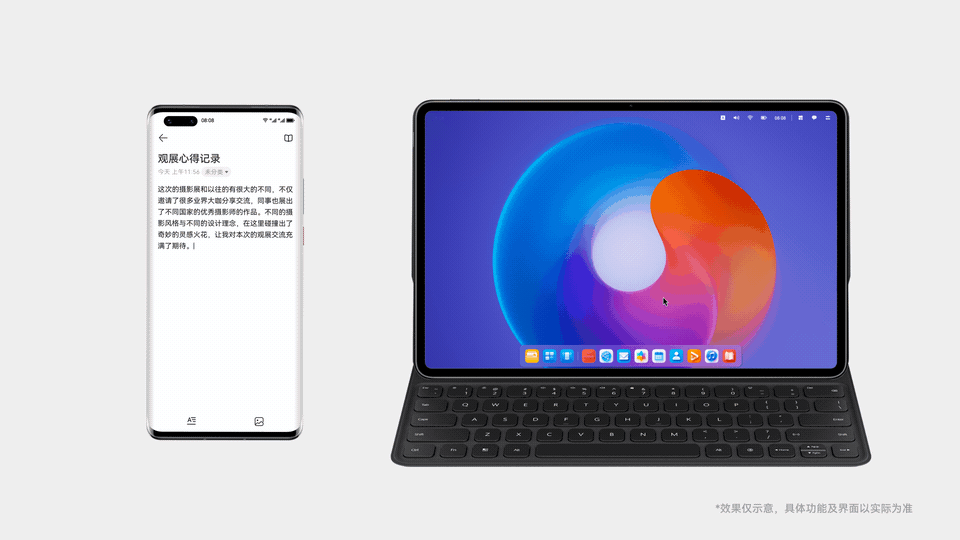
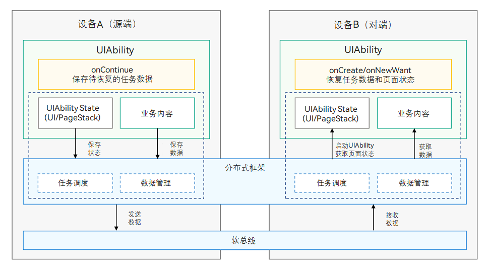
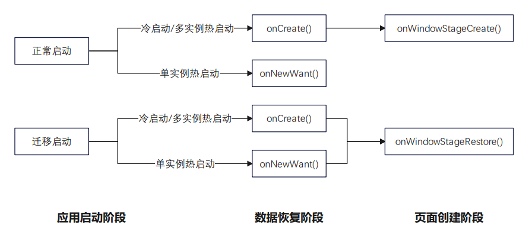
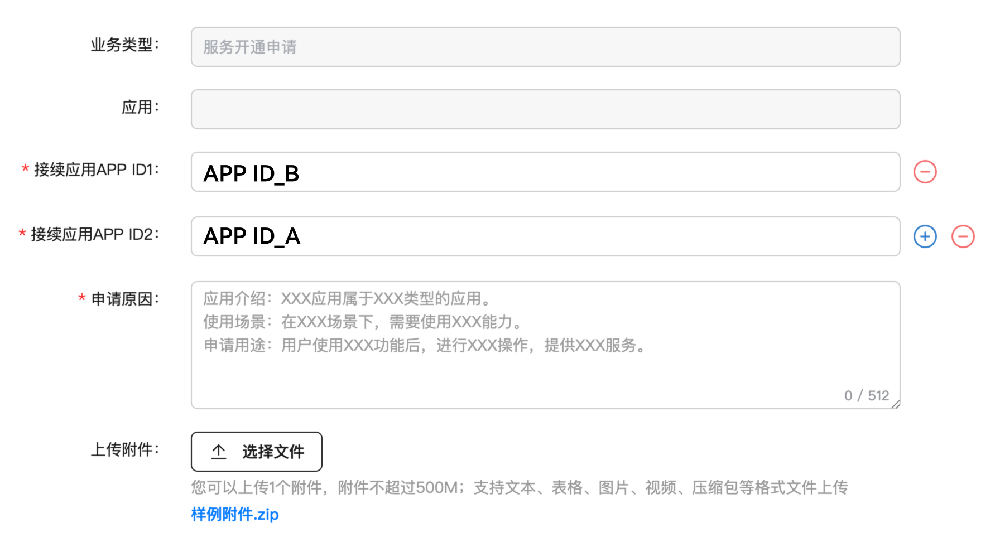
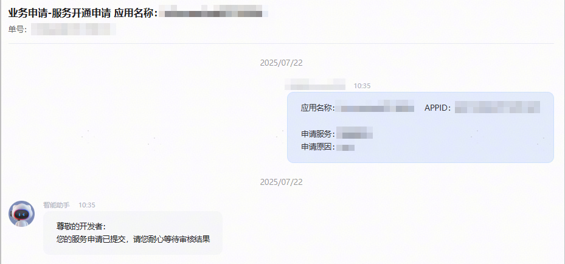
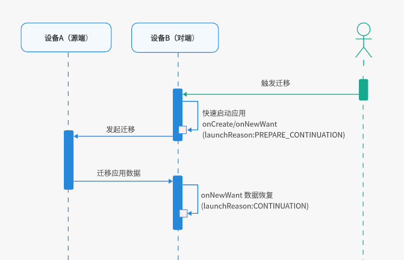

# 应用接续概述

更新时间：2026-04-08 00:27:30

来源：https://developer.huawei.com/consumer/cn/doc/best-practices/bpta-continue-cast

## 概述


应用接续，指当用户在一个设备上操作某个应用时，可以在另一个设备的相同应用中快速切换，无缝衔接上一个设备的应用体验。比如在用户使用过程中，使用情景发生了变化，之前使用的设备不再适合继续当前任务，或者周围有更合适的设备，此时用户可以选择使用新的设备来继续当前的任务。接续完成后，之前设备的应用可退出或保留，用户可以将注意力集中在被启动的设备上，继续执行任务。

如图所示，在手机上编辑备忘录，到办公室后切换到平板上继续编辑，完成任务的无缝衔接。

鸿蒙系统底层解决了设备发现、连接、组网等痛点，应用在接入时仅需关注数据的传输和恢复，参考如下章节完成开发：

- [约束限制](#section157187257261)：应用接续使用时应该满足的设备限制和使用限制。
- [常见接续场景体验建议](#section15231331142614)：不同垂类下接续场景的接入建议，哪些场景需要接续同步内容，以及源端是否需要退出。
- [开发步骤](#section49581955132610)：如何接入应用接续。
- [应用接续数据迁移](https://developer.huawei.com/consumer/cn/doc/best-practices/bpta-continue-data)：文件以及数据量较大的场景如何完成接续。
- [常见接续最佳实践](https://developer.huawei.com/consumer/cn/doc/best-practices/bpta-application-continue-progess)：长列表浏览、web页面浏览和媒体浏览三个场景如何完成接续。





## 约束限制


- **设备限制**HarmonyOS NEXT Developer Preview0及以上版本的设备。
- **使用限制**双端设备需要登录同一华为账号。
- 双端设备需要打开WLAN和蓝牙开关，或者在设置中的“多设备协同 > 高级”中启用“多设备协同增强服务”功能。
- 双端设备需要在“设置”应用中开启“多设备协同 > 接续”功能。
- 双端设备都需要安装该应用。
- 为了接续体验，在onContinue回调中使用wantParam传输的数据需要控制在100KB以下，大数据量请[使用分布式对象迁移数据](https://developer.huawei.com/consumer/cn/doc/best-practices/bpta-continue-data#section1842122135815)。

 模拟器支持
- 暂不支持


> [!NOTE]
> 自API12起，无需申请ohos.permission.DISTRIBUTED_DATASYNC权限。API11及以前版本，需要执行如下操作。 声明ohos.permission.DISTRIBUTED_DATASYNC权限，详见声明权限。由于ohos.permission.DISTRIBUTED_DATASYNC权限需要用户授权，应用需在首次启动、或进入接续页面时弹窗向用户申请授权，详见向用户申请授权。


## 常见接续场景体验建议


应用接续一般用于用户长时间停留的页面，默认情况下，应用接续完成后，源端应用会自动退出。开发者可以参考按需退出进行配置。

不同类型的应用建议的配置项如下：


| 垂类 | 场景 | 发起接续页面与接续同步内容 | 接续完成后，源端应用退出方案 |
| --- | --- | --- | --- |
| 工具 | 备忘录 | 备忘录详情页，备忘浏览进度同步。 | 退出 |
| 笔记 | 笔记编辑页，笔记浏览或编辑进度同步。 | 退出 |  |
| 日历 | 任意页面，日期视图、日程浏览或日程编辑进度同步。 | 退出 |  |
| 邮箱 | 邮件编辑页面，内容进度及附件同步。 | 退出 |  |
| 浏览器 | 网页内容详情页，网页浏览进度同步。 | 退出 |  |
| 出行导航 | 地图服务 | 路线查询、导航界面，当前路线及导航同步。 | 退出 |
| 影音娱乐 | 视频/短视频/微短剧/直播 | 音视频播放、直播页，音视频、直播播放进度同步。 | 应用按需适配 |
| 音乐/K歌/电台/乐器 | 音视频播放、直播页，音视频、直播播放进度同步。 | 应用按需适配 |  |
| 儿童 | 早教/儿歌 | 音视频播放、直播页，音视频、直播播放进度同步。 | 应用按需适配 |
| 新闻阅读 | 听书/有声读物/电子书/小说/杂志 | 书籍首页、小说阅读、听书页，阅读及听书进度同步。 | 退出，但若涉及较多听书或直播类场景，可不退出仅暂停（听书）、不退出且不暂停（直播）。 |
| 新闻 | 新闻详情页，新闻浏览进度同步。 | 退出 |  |
| 办公 | 会议 | 会议界面，当前会议同步。 | 不退出应用，仅退出会议，可返回聊天框界面。 |
| 设计 | CAD编辑界面，编辑内容同步。 | 应用按需适配 |  |
| 社交通讯 | 社交媒体平台 | 图文浏览、视频浏览、编辑页，浏览及编辑进度同步。 | 应用按需适配 |
| 拍摄美化 | 拍摄美化/图像美化 | 图片、视频编辑页，编辑内容及进度同步。 | 退出 |
| 便捷生活 | 租房买房/家居装修 | 应用按需适配 | 退出 |
| 菜谱/烘焙/饮食/食谱 | 应用按需适配 | 退出 |  |
| 种草 | 应用按需适配 | 退出 |  |
| 金融理财 | 股票/股票行情/基金/证券/证券投资咨询 | 应用按需适配 | 退出 |
| 游戏 | 游戏 | 应用按需适配 | 退出 |


## 运作机制





1. 在源端，通过UIAbility的onContinue()回调，开发者可以保存待接续的业务数据。例如，浏览器应用实现应用接续场景，在源端浏览一个页面，到对端继续浏览，开发者需要通过onContinue()接口保存页面url等业务内容。
2. 分布式框架提供跨设备应用界面、页面栈以及业务数据的保存和恢复机制，负责将数据从源端发送到对端。
3. 在对端，同一UIAbility通过onCreate()/onNewWant()接口恢复业务数据。


## 主要接口


以下为实现应用接续的主要接口，详细的接口说明可查阅UIAbility接口文档。


| 接口名 | 描述 |
| --- | --- |
| onContinue(wantParam : {[key: string]: Object}): OnContinueResult | 接续源端在该回调中保存迁移所需要的数据，同时返回是否同意迁移： AGREE：表示同意。REJECT：表示拒绝，如应用在onContinue中异常可以直接REJECT。MISMATCH：表示版本不匹配，接续源端应用可以在onContinue中获取到迁移对端应用的版本号，进行协商后，如果版本不匹配导致无法迁移，可以返回该错误。 |
| onCreate(want: Want, param: AbilityConstant.LaunchParam): void; | 接续目的端为冷启动或多实例应用热启动时，在该回调中完成数据恢复，并触发页面恢复。 |
| onNewWant(want: Want, launchParams: AbilityConstant.LaunchParam): void; | 接续目的端为单实例应用热启动时，在该回调中完成数据恢复，并触发页面恢复。 |


## 开发步骤


### 启用应用接续能力


在module.json5文件的abilities中，将continuable标签配置为“true”，表示该UIAbility可被迁移。默认值为false，将被系统识别为无法迁移。

```text
{
"module": {
...
"abilities": [
{
...
"continuable": true,
}
]
}
}
```


### 配置应用启动模式类型


根据需要配置应用启动模式类型，配置详情请参照UIAbility组件启动模式。


### 源端保存迁移数据


当应用触发迁移时，onContinue()接口在源端被调用，开发者可以在该接口中保存迁移数据，实现应用兼容性检测，决定是否支持此次迁移。

1. 保存迁移数据：开发者可以将要迁移的数据通过键值对的方式保存在wantParam中。

> [!NOTE]
> 如果迁移过程中的兼容性问题对于应用迁移体验影响较小或无影响，可以跳过该步骤。


2. （可选）检测应用兼容性：开发者可以在触发迁移时从onContinue()入参wantParam.version获取到迁移对端应用的版本号，与迁移源端应用版本号做兼容校验。应用在校验版本兼容性失败后，需要提示用户迁移失败的原因。
3. 返回迁移结果：开发者可以通过onContinue()回调的返回值决定是否支持此次迁移，接口返回值详见[OnContinueResult()](https://developer.huawei.com/consumer/cn/doc/harmonyos-references/js-apis-app-ability-abilityconstant#oncontinueresult)。
4. onContinue()接口传入的wantParam参数中，有部分字段由系统预置，开发者可以使用这些字段用于业务处理。同时，应用在保存自己的wantParam参数时，也应注意不要使用同样的key值，避免被系统覆盖导致数据获取异常。详见下表：

| 字段 | 含义 |
| --- | --- |
| version | 对端应用的版本号 |
| targetDevice | 对端设备的networkId |


```text
// ...
export default class EntryAbility extends UIAbility {
// ...
onContinue(wantParam: Record<string, Object>) {
const targetVersion = wantParam.version;
const versionThreshold: number = 0;
if (targetVersion < versionThreshold) {
promptAction.showToast({
message: '对端应用版本号过低，不支持接续，请您升级应用版本后再试',
duration: 2000
})
return AbilityConstant.OnContinueResult.MISMATCH;
}
console.info(`onContinue version = ${wantParam.version}, targetDevice: ${wantParam.targetDevice}`)
const continueInput = '迁移的数据';
if (continueInput) {
wantParam['data'] = continueInput;
}
// ...
return AbilityConstant.OnContinueResult.AGREE;
}
// ...
}
```


### 对端恢复数据


在Stage模型中，应用在不同启动模式下将调用不同的接口，以恢复数据、加载界面。不同情况下的函数调用如下图所示：





> [!NOTE]
> 在应用迁移启动时，无论是冷启动还是热启动，都会在执行完onCreate()/onNewWant()后，触发onWindowStageRestore()生命周期函数，不执行onWindowStageCreate()生命周期函数。开发者如果在onWindowStageCreate()中进行了一些应用启动时必要的初始化，那么迁移后需要在onWindowStageRestore()中执行同样的初始化操作，避免应用异常。


在目的端设备UIAbility中实现onCreate()与onNewWant()接口，恢复迁移数据。

- onCreate实现示例目的端设备上，在onCreate()中根据launchReason判断该次启动是否为迁移LaunchReason.CONTINUATION。
- 开发者可以从want中获取保存的迁移数据。
- 若开发者使用系统页面栈恢复功能，则需要在onCreate()/onNewWant()执行完成前，调用restoreWindowStage()，来触发带有页面栈的页面恢复，如果不需要迁移页面栈可以参考[按需迁移页面栈](https://developer.huawei.com/consumer/cn/doc/harmonyos-guides/app-continuation-guide#section34254151518)部分。


```text
import { AbilityConstant, UIAbility, Want, wantConstant } from '@kit.AbilityKit';
// ...
export default class EntryAbility extends UIAbility {
storage: LocalStorage = new LocalStorage();
onCreate(want: Want, launchParam: AbilityConstant.LaunchParam): void {
if (launchParam.launchReason === AbilityConstant.LaunchReason.CONTINUATION) {
let continueInput = '';
if (want.parameters !== undefined) {
continueInput = JSON.stringify(want.parameters.data);
console.info(`continue input ${continueInput}`)
}
// ...
this.context.restoreWindowStage(this.storage);
}
// ...
}

// ...
}
```


> [!NOTE]
> 接口restoreWindowStage(this.storage)必须在同步接口方法中执行，如果在异步回调中执行，可能会导致应用迁移后页面加载失败。


## 可选配置


### 支持同应用中不同Ability跨端迁移


一般情况下，跨端迁移的双端是同Ability之间，但有些应用在不同设备类型下的同一个业务Ability名称不同（即异Ability），为了支持该场景下的两个Ability之间能够完成迁移，可以通过在module.json5文件的abilities标签中配置迁移类型continueType进行关联。 需要迁移的两个Ability的continueType字段取值必须保持一致，示例如下：


> [!NOTE]
> continueType在本应用中要保证唯一，字符串以字母、数字和下划线组成，最大长度127个字节，不支持中文。continueType标签类型为字符串数组，如果配置了多个字段，当前仅第一个字段会生效。


设备A：


```text
{
"module": {
// ...
"abilities": [
{
// ...
"name": "Ability-deviceA",
"continueType": ['continueType1'],
}
]
}
}
```

设备B：

```text
{
"module": {
// ...
"abilities": [
{
// ...
"name": "Ability-deviceB",
"continueType": ['continueType1'],
}
]
}
}
```


### 支持同应用不同BundleName的Ability跨端迁移（适用于同一开发者）


同一开发者名下的某款应用，可能在不同设备类型上使用了不同的BundleName。如果该应用需要支持跨端迁移，则需要在该应用的不同Bundle对应的module.json5配置文件中进行如下配置：

- continueBundleName字段：分别添加对端应用的BundleName。
- continueType字段：必须保持一致。

> [!NOTE]
> continueType在本应用中要保证唯一，字符串以字母、数字和下划线组成，最大长度127个字节，不支持中文。continueType标签类型为字符串数组，如果配置了多个字段，当前仅第一个字段会生效。


示例如下：

不同BundleName的相同应用在设备A和设备B之间相互迁移，设备A应用的BundleName为com.demo.example1，设备B应用的BundleName为com.demo.example2。
```text
// 在设备A的应用配置文件中，continueBundleName字段配置包含设备B上应用的BundleName。
{
"module": {
// ...
"abilities": [
{
"name": "EntryAbility"
// ...
"continueType": ['continueType'],
"continueBundleName": ["com.demo.example2"], // continueBundleName标签配置，com.demo.example2为设备B上应用的BundleName。
}
]
}
}
```

```text
// 在设备B的应用配置文件中，continueBundleName字段配置包含设备A上应用的BundleName。
{
"module": {
// ...
"abilities": [
{
"name": "EntryAbility"
// ...
"continueType": ['continueType'],
"continueBundleName": ["com.demo.example1"], // continueBundleName标签配置，com.demo.example1为设备A上应用的BundleName。
}
]
}
}
```


### 支持同应用不同BundleName的Ability跨端迁移（适用于不同开发者）


某款应用在不同类型的设备上，可能会由不同的开发者发布。在这种场景下，如果该应用需要支持跨端迁移，则需要在AppGallery Connect平台申请“接续服务” 。

下面以同一应用对应2个开发者为例进行介绍操作步骤。假设手机应用A与PC应用B分别属于不同开发者，应用A的APP ID 为 AppId_A，应用B的APP ID为AppId_B。


> [!NOTE]
> 操作步骤中的界面截图在不同版本中可能存在差异，请以实际网站效果为准。


1. 接入AppGallery Connect（简称AGC），详细介绍参考[AGC](https://developer.huawei.com/consumer/cn/service/josp/agc/index.html#/)介绍章节。
2. 为应用A申请接续服务。进入A应用详情页找到接续服务，点击“申请”。

3. 在“新建业务申请”页面填写如下字段，填写完成后点击“提交”。
- “接续应用APP ID1”：填入“AppId_B”
- “接续应用APP ID2”：填入“AppId_A”。
- 申请原因：按照模板填写。
- 附件：可上传介绍应用的相关信息。

 应用接续支持配置多个不同的APP ID，配置顺序决定了在接续目标端设备上匹配应用的顺序。填写对应设备类型的APPID时务必包含自己的AppId。 AppId配置次序建议如下：

| 应用接续发起端 | 应用接续目标端 | 发起端A应用AppId配置优先次序（从高到低） |
| --- | --- | --- |
| 移动端 | TV端/PC端 | ① TV版A应用AppId ② PC版A应用AppId ③ 移动版A应用AppId |
| TV端 | PC端/移动端 | ① PC版A应用AppId ② TV版A应用AppId ③ 移动版A应用AppId |
| PC端 | TV端/移动端 | ① TV版A应用AppId ② PC版A应用AppId ③ 移动版A应用AppId |



4. 进入互动中心页面，可看到申请已提交的消息。

5. 返回“开放能力接入”页面，原“申请”按钮变为“申请中”。

6. 申请审批通过后，互动中心会发送通知消息给您。“申请中”按钮会变为“申请”，同时对应的能力开关会为您自动开启。至此，您的应用已成功接入接续服务能力。


1. 为应用B进行接续服务申请，详细步骤同第2步。
2. 重新分别申请并下载对应的Profile文件以供后续打包使用。
3. 在A应用和B应用的module.json5配置文件中，分别进行如下配置。
```text
// 在设备A的应用配置文件中，continueBundleName字段配置包含设备B上应用的BundleName。
{
"module": {
// ...
"abilities": [
{
"name": "EntryAbility"
// ...
"continueType": ['continueType'],
"continueBundleName": ["com.demo.example2"], // continueBundleName标签配置，com.demo.example2为设备B上应用的BundleName。
}
]
}
}
```

```text
// 在设备B的应用配置文件中，continueBundleName字段配置包含设备A上应用的BundleName。
{
"module": {
// ...
"abilities": [
{
"name": "EntryAbility"
// ...
"continueType": ['continueType'],
"continueBundleName": ["com.demo.example1"], // continueBundleName标签配置，com.demo.example1为设备A上应用的BundleName。
}
]
}
}
```


### 快速启动目标应用


默认情况下，发起迁移后不会立即启动对端的目标应用，而是等待迁移数据从源端传输到对端后才会拉起应用。若应用希望在用户发起接续后立即被拉起，减少等待时间，提升体验，可以在module.json5文件的continueType标签中添加“_ContinueQuickStart”后缀，配置快速启动目标应用能力。示例如下：

```text
{
"module": {
// ...
"abilities": [
{
// ...
"name": "EntryAbility"
"continueType": ['EntryAbility_ContinueQuickStart'], }
]
}
}
```

配置了快速启动的应用，在用户发起接续时会立即收到一次launchReason为提前拉起（PREPARE_CONTINUATION）的onCreate()/onNewWant()请求，随后再收到一次launchReason为接续拉起（CONTINUATION）的onNewWant()请求。如下所示：


| 场景 | 生命周期函数 | launchParam.launchReason |
| --- | --- | --- |
| 第一次启动请求 | onCreate (冷启动) 或 onNewWant (热启动) | AbilityConstant.LaunchReason.PREPARE_CONTINUATION |
| 第二次启动请求 | onNewWant | AbilityConstant.LaunchReason.CONTINUATION |





如果没有配置快速启动，则触发迁移时只会收到一次启动请求：


| 场景 | 生命周期函数 | launchParam.launchReason |
| --- | --- | --- |
| 一次启动请求 | onCreate (冷启动) 或 onNewWant (热启动) | AbilityConstant.LaunchReason.CONTINUATION |


配置快速启动后，对应的 onCreate()/onNewWant() 接口实现可参考如下示例：

```text
import { AbilityConstant, UIAbility, Want } from '@kit.AbilityKit';
import { hilog } from '@kit.PerformanceAnalysisKit';
// ...
const TAG: string = '[MigrationAbility]';
const DOMAIN_NUMBER: number = 0xFF00;

export default class MigrationAbility_quickStart extends UIAbility {
storage : LocalStorage = new LocalStorage();

onCreate(want: Want, launchParam: AbilityConstant.LaunchParam): void {
hilog.info(DOMAIN_NUMBER, TAG, '%{public}s', 'Ability onCreate');

if (launchParam.launchReason === AbilityConstant.LaunchReason.PREPARE_CONTINUATION) {
// ...
}
}

onNewWant(want: Want, launchParam: AbilityConstant.LaunchParam): void {
hilog.info(DOMAIN_NUMBER, TAG, 'onNewWant');

if (launchParam.launchReason === AbilityConstant.LaunchReason.PREPARE_CONTINUATION) {
// ...
}

if (launchParam.launchReason === AbilityConstant.LaunchReason.CONTINUATION) {
let continueInput = '';
if (want.parameters !== undefined) {
continueInput = JSON.stringify(want.parameters.data);
hilog.info(DOMAIN_NUMBER, TAG, `continue input ${JSON.stringify(continueInput)}`);
}
this.context.restoreWindowStage(this.storage);
}
}

// ...
}
```


### 动态配置迁移能力


从API version 10起，提供了支持动态配置迁移能力的功能。即应用可以根据实际使用场景，在需要迁移功能时，设置开启应用迁移能力；在业务不需要迁移时，则可以关闭迁移能力。开发者可以通过调用setMissionContinueState()接口对迁移能力进行设置。


| 接口状态值 | 含义 |
| --- | --- |
| AbilityConstant.ContinueState.ACTIVE | 应用当前可迁移能力开启 |
| AbilityConstant.ContinueState.INACTIVE | 应用当前可迁移能力关闭 |


设置迁移能力的时机

默认状态下，应用的迁移能力为ACTIVE状态，即可以迁移。

如果需要实现某些特殊场景，比如只在具体某个页面下支持迁移，或者只在某个事件发生时才支持迁移，可以按照如下步骤进行配置。

1. 在Ability的onCreate()生命周期回调中，关闭迁移能力。
```text
import { AbilityConstant, UIAbility, Want, wantConstant } from '@kit.AbilityKit';
// ...
export default class EntryAbility extends UIAbility {
// ...
onCreate(want: Want, launchParam: AbilityConstant.LaunchParam): void {
// ...
this.context.setMissionContinueState(AbilityConstant.ContinueState.INACTIVE, (result) => {
console.info(`setMissionContinueState: ${JSON.stringify(result)}`);
});
// ...
}
// ...
}

// ...
}
```
2. 如果需要在具体某个页面中打开迁移能力，可以在该页面的onPageShow()函数中设置。
```text
import { AbilityConstant, common } from '@kit.AbilityKit';
// ...

@Entry
@Component
struct PageName {
private context = getContext(this) as common.UIAbilityContext;

onPageShow() {
this.context.setMissionContinueState(AbilityConstant.ContinueState.ACTIVE, (result) => {
console.info('setMissionContinueState ACTIVE result: ', JSON.stringify(result));
});
}

build() {
// ...
}
}
```
3. 如果在某个组件的触发事件中打开迁移能力，可以在该事件中设置。下面以Button()组件的onClick()事件为例进行介绍。
```text
import { AbilityConstant, common } from '@kit.AbilityKit';
// ...

@Entry
@Component
struct PageName {
private context = getContext(this) as common.UIAbilityContext;

// ...
build() {
// ...

Button($r('app.string.setMissionContinueState_active')).onClick(() => {
this.context.setMissionContinueState(AbilityConstant.ContinueState.ACTIVE, (result) => {
console.info('setMissionContinueState ACTIVE result: ', JSON.stringify(result));
});
})
// ...

// ...
}
// ...
}
}
```


保证迁移连续性

由于迁移加载时，对端启动的应用可能执行过自己的迁移状态设置命令（如：冷启动时目标端在onCreate()中设置了INACTIVE；热启动时对端已打开了不可迁移的页面，迁移状态为INACTIVE等情况）。为了保证迁移过后的应用依然具有可以迁移回源端的能力，应在onCreate()和onNewWant()的迁移调用判断中，将迁移状态设置为ACTIVE。

```text
import { AbilityConstant, UIAbility, Want, wantConstant } from '@kit.AbilityKit';
// ...
export default class EntryAbility extends UIAbility {
// ...
onCreate(want: Want, launchParam: AbilityConstant.LaunchParam): void {
// ...
this.context.setMissionContinueState(AbilityConstant.ContinueState.ACTIVE, (result) => {
console.info(`setMissionContinueState: ${JSON.stringify(result)}`);
});
}

onNewWant(want: Want, launchParam: AbilityConstant.LaunchParam): void {
// ...
if (launchParam.launchReason === AbilityConstant.LaunchReason.CONTINUATION) {
this.context.setMissionContinueState(AbilityConstant.ContinueState.ACTIVE, (result) => {
console.info('setMissionContinueState ACTIVE result: ', JSON.stringify(result));
});
}
}

// ...
}
```


### 按需迁移页面栈


支持应用动态选择是否进行页面栈恢复（默认进行页面栈信息恢复）。如果应用不想使用系统默认恢复的页面栈，则可以设置不进行页面栈迁移，而需要在onWindowStageRestore()设置迁移后进入的页面，参数定义见Params中的SUPPORT_CONTINUE_PAGE_STACK_KEY。


> [!NOTE]
> 当前仅支持router路由的页面栈信息自动恢复，暂不支持navigation路由的页面栈自动恢复。如果应用使用navigation路由，可以设置不进行页面栈迁移，并将需要接续的页面（或页面栈）信息保存在want中传递，然后在对端手动加载指定页面。


应用在源端的页面栈中存在Index和Second路由，而在对端恢复时不需要按照源端页面栈进行恢复，需要恢复到指定页面。

示例：应用迁移不需要自动迁移页面栈信息

```text
import { AbilityConstant, UIAbility, Want, wantConstant } from '@kit.AbilityKit';
// ...
import { promptAction } from '@kit.ArkUI';
import { window } from '@kit.ArkUI';
export default class EntryAbility extends UIAbility {
// ...
onContinue(wantParam: Record<string, Object>) {
// ...
console.info(`onContinue version = ${wantParam.version}, targetDevice: ${wantParam.targetDevice}`);
wantParam[wantConstant.Params.SUPPORT_CONTINUE_PAGE_STACK_KEY] = false;
// ...
return AbilityConstant.OnContinueResult.AGREE;
}

onWindowStageRestore(windowStage: window.WindowStage) {
windowStage.loadContent('continue/PageName', (err, data) => {
if (err.code) {
console.info('Failed to load the content. Cause: %{public}s', JSON.stringify(err) ?? '');
return;
}
console.info('Succeeded in loading the content. Data: %{public}s', JSON.stringify(data) ?? '');
});
}
}
```


### 按需退出


支持应用动态选择迁移成功后是否退出迁移源端应用（默认迁移成功后退出迁移源端应用）。如果应用不想让系统自动退出迁移源端应用，则可以设置不退出，参数定义见Params中的SUPPORT_CONTINUE_SOURCE_EXIT_KEY。

示例：应用迁移设置不需要迁移成功后退出迁移源端应用

```text
import { AbilityConstant, UIAbility, Want, wantConstant } from '@kit.AbilityKit';
// ...
export default class EntryAbility extends UIAbility {
// ...
onContinue(wantParam: Record<string, Object>) {
// ...
console.info(`onContinue version = ${wantParam.version}, targetDevice: ${wantParam.targetDevice}`);
// ...
wantParam[wantConstant.Params.SUPPORT_CONTINUE_SOURCE_EXIT_KEY] = false;
return AbilityConstant.OnContinueResult.AGREE;
}

// ...
}
```


## 常见问题


### 打开任意可接续应用后，对端未显示接续图标


问题描述

系统浏览器等系统应用打开后对端设备也不出现接续图标。

解决方案

在打开系统浏览器、已有内容的备忘录笔记界面或新开发的应用界面后，对端均未出现接续图标，可以按照以下步骤进行排查：

1. 检查蓝牙是否已开启；
2. 检查接续功能是否已开启：设置->多设备协同->接续；
3. 检查是否已登录相同的华为账号；
4. 通过命令行检查组网是否成功；
```text
hidumper -s 4700 -a "buscenter -l remote_device_info"
```
 执行完成后，RemoteDeviceInfo中列出的设备即为已成功与当前设备组网的设备。如下图所示，该设备已与两台其他设备成功组网。


### 1分钟以上无任何操作，图标将自动消失；再次操作应用时，图标将重新出现


问题描述

1分钟以上无任何操作，图标将自动消失；再次操作应用时，图标将重新出现。

问题解释

图标显隐是系统的一项特性。根据当前的策略，图标在源端最后一次触屏操作后的1分钟内保持显示。如果超过1分钟没有进行任何操作，图标将自动隐藏，以减少对用户的干扰。同样地，当锁屏时，图标将在10秒后自动消失，这也是系统正常运行的一部分。


### 打开新接入的应用后，对端不出现图标


问题描述

系统浏览器等系统应用正常出现接续图标，新接入的应用无法出现接续图标。

解决方案

仅当应用配置了continuable标签，并且处于获焦且可接续状态时，才会发送接续广播，使得对端显示接续图标。可以按照以下步骤排查：

1. 确认两端均已安装应用；
2. 检查应用是否已将continuable标签设置为true；
3. 确认应用是否已调用setMissionContinueState()接口将自身的迁移状态设置为false。
