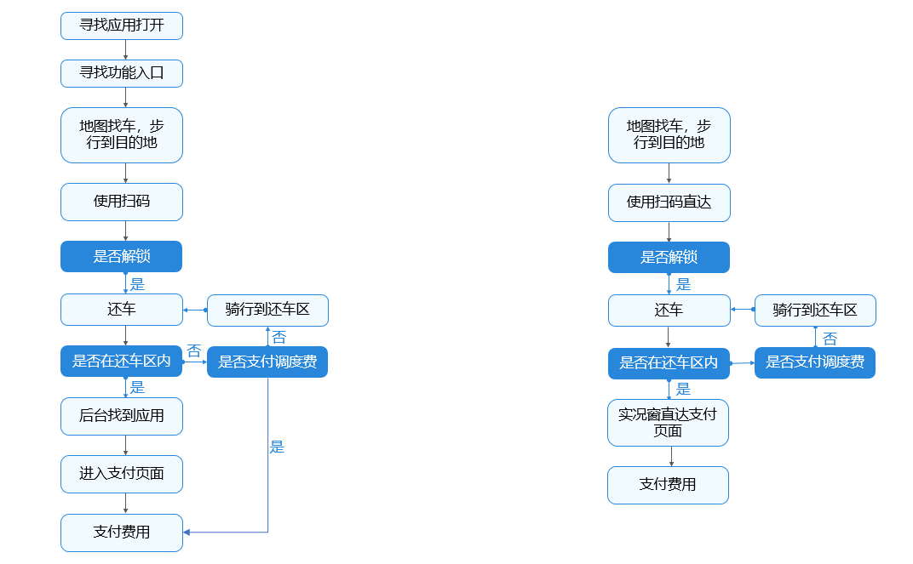
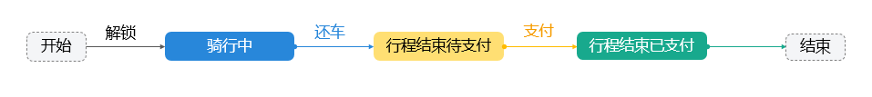
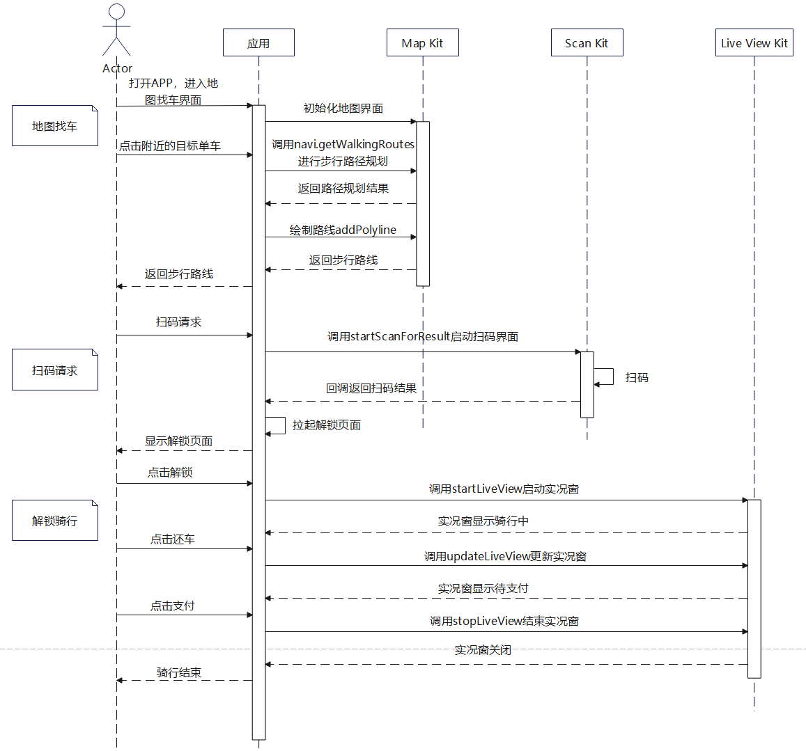
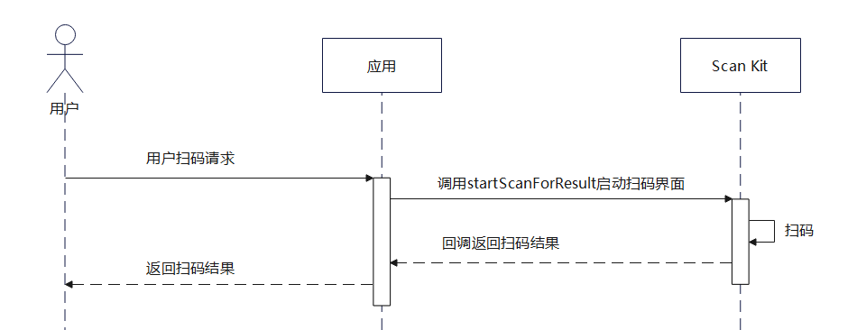
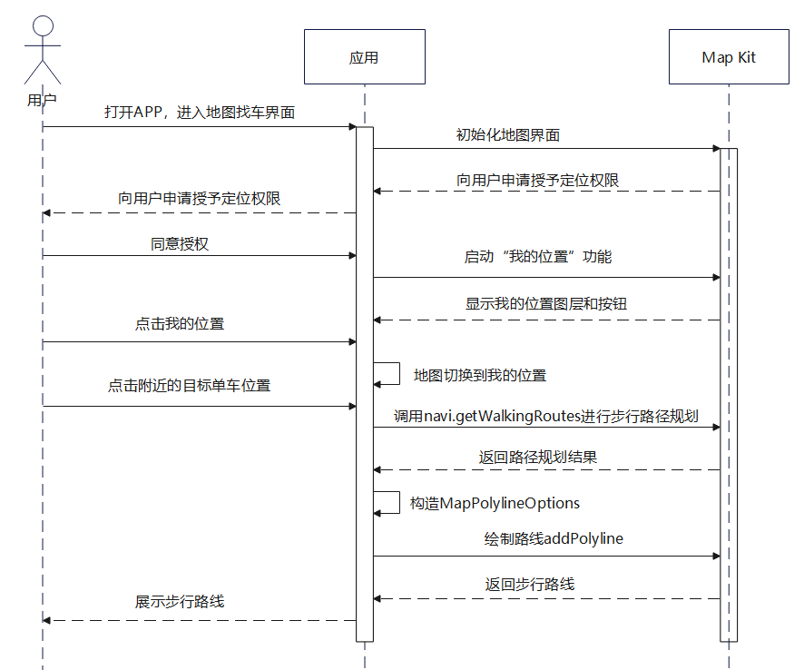
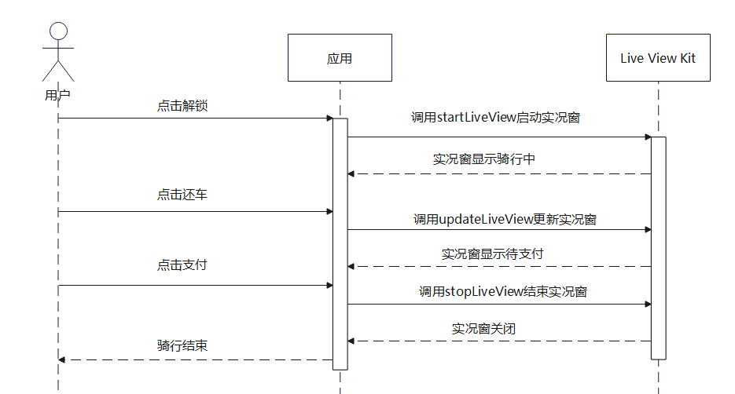

# 快捷骑行体验

更新时间：2026-05-18 00:55:31

来源：https://developer.huawei.com/consumer/cn/doc/best-practices/bpta-shared-bicycle

#### 概述

本场景解决方案涉及共享租赁、即时配送等应用，以共享单车为例，使用实况窗、地图导航和统一扫码等技术，为消费者提供更好的骑行体验。
 
 

#### 效果展示


 
 

#### 场景说明

 

#### 场景整体介绍


 
为了简化骑行流程，提升用户体验，建议如下：
 

 
1. 用户可以从应用内或者系统扫码入口进行扫码，直接进入共享单车解锁页面。
 
2. 点击解锁按钮后，拉起实况窗显示骑行状态。
 
3. 完成还车、支付等操作后，实况窗状态实时更新。
 

 
这样，用户无需重复寻找应用和功能入口，整个流程更加简便。
 
 

#### 场景优势

本场景结合提供的实况窗、地图导航、扫码等系统能力，可以带给用户更加便捷高效的体验。具体优势如下：
 
1.使用实况窗技术帮助用户聚焦任务，快速查看和即时处理。支持在锁屏、通知中心显示卡片，在状态栏显示胶囊，点击胶囊后展开悬浮卡片，方便用户查看重点信息。多种显示方式确保信息即时触达，减少用户进出应用或服务页面的次数。
 
2.基于Map Kit实现个性化地图呈现、地图搜索和路线规划等功能，提供缩放、旋转、移动等流畅的手势交互体验。
 
 

#### 场景分析

 

#### 典型场景
 
| 编号 | 场景名称 | 描述 | 实现方案 |
| 1 | 扫码解锁 | 首页和共享单车页面均可扫码直达解锁页面。 | 基于ScanKit能够快速实现扫码能力 |
| 2 | 地图规划路径 | 选中目的地，展示最短路径。 | 基于MapKit能够快速实现路径规划和路线绘制能力 |
| 3 | 实况窗展示骑行状态 | 骑行过程中，用户需要查看骑行状态。 | 使用实况窗，用户在锁屏状态下也能查看骑行状态，无需解锁应用。 |
 
 
 

#### 场景实现

 

#### 业务流程图

左图展示了当前骑行场景的流程，右图展示了优化后的流程。优化后，省去了在应用间切换和寻找功能入口的步骤，简化了用户操作，提升了用户体验。
 



 
 

#### 骑行状态图




 
 

#### 时序图




 
 

#### 扫码解锁

 

#### 效果展示

在首页或者共享单车页面，点击扫码进入扫码界面，可以使用后置摄像头进行扫码，也可以点击图库选择二维码图片进行扫码。“扫码直达”相关的使用请参见“[接入扫码直达服务](https://developer.huawei.com/consumer/cn/doc/harmonyos-guides/scan-directservice)”。
 

 


 
 

#### 时序图

主要业务流程如下：
 



 
 

#### 关键点说明

1、使用[Scan Kit](https://developer.huawei.com/consumer/cn/doc/harmonyos-guides/scan-kit-guide)实现扫码能力，Scan Kit应用了多项计算机视觉技术和AI算法技术，不仅实现了远距离自动扫码，同时还针对多种复杂扫码场景（如暗光、污损、模糊、小角度、曲面码等）做了识别优化，提升扫码成功率与用户体验。
 
2、在Entry模块的module.json5文件的requestPermissions字段中添加ohos.permission.CAMERA权限，以申请系统相机权限。
 
```json
"requestPermissions": [
    // ...
    {
      "name": "ohos.permission.CAMERA",
      "reason": "$string:reason_camera",
      "usedScene": {
        "abilities": [
          "EntryAbility"
        ],
        "when": "always"
      }
    }
  ]
},
```
 
3、支持多种识码类型，常用的是二维码，也支持条形码扫描。
 
 

#### 关键代码片段

```ArkTS
import { scanBarcode, scanCore } from '@kit.ScanKit';
import { CyclingConstants, CyclingStatus } from '../constants/CyclingConstants';
import { BusinessError } from '@kit.BasicServicesKit';
import Logger from './Logger';

export class ScanUtil {
  public static scan(obj: Object, uiContext: UIContext): void {
    let options: scanBarcode.ScanOptions = {
      scanTypes: [scanCore.ScanType.ALL, scanCore.ScanType.ONE_D_CODE],
      enableMultiMode: true,
      enableAlbum: true
    };
    try {
      scanBarcode.startScanForResult(uiContext?.getHostContext(), options).then((result: scanBarcode.ScanResult) => {
        Logger.info('[BicycleSharing]', 'Promise scan result: %{public}s', JSON.stringify(result));
        if (result.scanType === CyclingConstants.SCAN_TYPE) {
          AppStorage.setOrCreate(CyclingConstants.CYCLING_STATUS, CyclingStatus.WAITING_UNLOCK);
          uiContext?.getRouter().pushUrl({ url: 'pages/ConfirmUnlock' });
        }
      }).catch((error: BusinessError) => {
        Logger.error(0x0001, '[BicycleSharing]', 'Promise error: %{public}s', JSON.stringify(error));
      });
    } catch (error) {
      Logger.error(0x0001, '[BicycleSharing]', 'failReason: %{public}s', JSON.stringify(error));
    }
  }
}
```
 
 

#### 地图路径规划

 

#### 效果展示

进入找车页面后，可以点击任意位置模拟自行车的所在地，地图将进行步行路线规划并增加标记点。
 

 


 
 

#### 时序图




 
 

#### 关键点说明

1、使用[Map Kit](https://developer.huawei.com/consumer/cn/doc/harmonyos-guides/map-kit-guide)实现地图能力，Map Kit可以帮助开发者实现个性化地图呈现、地图搜索和路线规划等功能，轻松完成地图构建工作。
 
2、参考文档[开通地图服务](https://developer.huawei.com/consumer/cn/doc/harmonyos-guides/map-config-agc#开通地图服务)去AppGallery Connect开通地图服务。注意要在工程中entry模块的module.json5文件中配置client_id。
 
3、启用“我的位置”之前，确保应用已获取用户定位权限。需要申请ohos.permission.LOCATION和ohos.permission.APPROXIMATELY_LOCATION权限。
 
 

#### 关键代码片段

1、导入Map Kit
 
```ArkTS
import { MapComponent, mapCommon, map } from '@kit.MapKit';
```
 
2、集成地图组件，初始化地图页面
 
```ArkTS
aboutToAppear(): void {
  // initialize map
  this.callback = async (err, mapController) => {
    let hasPermissions = false;
    if (!err) {
      this.mapController = mapController;
      this.mapController.on('mapLoad', async () => {
        hasPermissions = await MapUtil.checkPermissions(this.mapController);
        if (!hasPermissions) {
          this.requestPermissions();
        }
        if (hasPermissions) {
          let requestInfo: geoLocationManager.CurrentLocationRequest = {
            'priority': geoLocationManager.LocationRequestPriority.FIRST_FIX,
            'scenario': geoLocationManager.LocationRequestScenario.UNSET,
            'maxAccuracy': 0
          };
          let locationChange = async (): Promise<void> => {
          };
          geoLocationManager.on('locationChange', requestInfo, locationChange);
          geoLocationManager.getCurrentLocation(requestInfo).then(async (result) => {
            let mapPosition: mapCommon.LatLng =
              await map.convertCoordinate(mapCommon.CoordinateType.WGS84, mapCommon.CoordinateType.GCJ02, result);
            AppStorage.setOrCreate('longitude', mapPosition.longitude);
            AppStorage.setOrCreate('latitude', mapPosition.latitude);
            let cameraPosition: mapCommon.CameraPosition = {
              target: mapPosition,
              zoom: 15,
              tilt: 0,
              bearing: 0
            };
            let cameraUpdate = map.newCameraPosition(cameraPosition);
            mapController?.animateCamera(cameraUpdate, 1000);
          })
        }
      });
      this.mapController.on('mapClick', async (position) => {
        this.mapController?.clear();
        this.marker?.remove();
        let requestInfo: geoLocationManager.CurrentLocationRequest = {
          'priority': geoLocationManager.LocationRequestPriority.FIRST_FIX,
          'scenario': geoLocationManager.LocationRequestScenario.UNSET,
          'maxAccuracy': 0
        };
        let locationChange = async (location: geoLocationManager.Location): Promise<void> => {
          let wgs84Position: mapCommon.LatLng = {
            latitude: location.latitude,
            longitude: location.longitude
          };
          let gcj02Posion: mapCommon.LatLng =
            await map.convertCoordinate(mapCommon.CoordinateType.WGS84, mapCommon.CoordinateType.GCJ02,
              wgs84Position);
          this.myPosition = gcj02Posion
        };
        geoLocationManager.on('locationChange', requestInfo, locationChange);
        // add walking marker
        this.marker = await MapUtil.addMarker(position, this.mapController);
        const walkingRoutes = await MapUtil.walkingRoutes(position, this.myPosition);
        await MapUtil.paintRoute(walkingRoutes!, this.mapPolyline, this.mapController);
      });
    }
  };
}
```
 
3、向用户申请授予定位权限，启动“我的位置”功能
 
```ArkTS
requestPermissions(): void {
  let atManager: abilityAccessCtrl.AtManager = abilityAccessCtrl.createAtManager();
  atManager.requestPermissionsFromUser(this.getUIContext().getHostContext() as common.UIAbilityContext,
    ['ohos.permission.LOCATION', 'ohos.permission.APPROXIMATELY_LOCATION'])
    .then(() => {
      this.mapController?.setMyLocationEnabled(true);
      this.mapController?.setMyLocationControlsEnabled(true);
      this.mapController?.setCompassControlsEnabled(false);
      this.mapController?.setMyLocationStyle({ displayType: mapCommon.MyLocationDisplayType.FOLLOW });
      geoLocationManager.getCurrentLocation().then(async (result) => {
        let mapPosition: mapCommon.LatLng =
          await map.convertCoordinate(mapCommon.CoordinateType.WGS84, mapCommon.CoordinateType.GCJ02, result);
        AppStorage.setOrCreate('longitude', mapPosition.longitude);
        AppStorage.setOrCreate('latitude', mapPosition.latitude);
        let cameraPosition: mapCommon.CameraPosition = {
          target: mapPosition,
          zoom: 15,
          tilt: 0,
          bearing: 0
        };
        let cameraUpdate = map.newCameraPosition(cameraPosition);
        this.mapController?.animateCamera(cameraUpdate, 1000);
      })
    })
    .catch((err: BusinessError) => {
      Logger.error(`Failed to request permissions from user. Code is ${err.code}, message is ${err.message}`);
    })
}
```
 
4、监听点击事件
 
```ArkTS
this.mapController.on('mapClick', async (position) => {
  this.mapController?.clear();
  this.marker?.remove();

  if (!this.myPosition) {
    Logger.error('Current position is not available');
    return;
  }

  this.marker = await MapUtil.addMarker(position, this.mapController);
  const walkingRoutes = await MapUtil.walkingRoutes(position, this.myPosition);
  await MapUtil.paintRoute(walkingRoutes!, this.mapPolyline, this.mapController);
});
```
 
5、启动步行路径规划
 
```ArkTS
public static async walkingRoutes(position: mapCommon.LatLng, myPosition?: mapCommon.LatLng) {
  let params: navi.RouteParams = {
    origins: [myPosition!],
    destination: position,
    language: 'zh_CN'
  };
  try {
    const result = await navi.getWalkingRoutes(params);
    Logger.info('naviDemo', 'getWalkingRoutes success result =' + JSON.stringify(result));
    return result;
  } catch (err) {
    Logger.error('naviDemo', 'getWalkingRoutes fail err =' + JSON.stringify(err));
  }
  return undefined;
}
```
 
6、绘制路线
 
```ArkTS
public static async paintRoute(routeResult: navi.RouteResult, mapPolyline?: map.MapPolyline,
  mapController?: map.MapComponentController) {
  mapPolyline?.remove();
  let polylineOption: mapCommon.MapPolylineOptions = {
    points: routeResult.routes[0].overviewPolyline!,
    clickable: true,
    startCap: mapCommon.CapStyle.BUTT,
    endCap: mapCommon.CapStyle.BUTT,
    geodesic: false,
    jointType: mapCommon.JointType.BEVEL,
    visible: true,
    width: 20,
    zIndex: 10,
    gradient: false,
    color: 0xFF2970FF
  }
  try {
    mapPolyline = await mapController?.addPolyline(polylineOption);
  } catch (error) {
    Logger.error('naviDemo', `addPolyline error: ${JSON.stringify(error)}`);
  }
}
```
 
 

#### 实况窗展示骑行状态

 

#### 效果展示

点击解锁后，实况窗显示骑行状态。完成还车、支付等操作后，实况窗的状态实时更新。支持在锁屏、通知中心显示卡片，状态栏显示胶囊形态。点击状态栏的胶囊后，展开悬浮卡片，方便用户查看骑行状态。
 

 


 
 

#### 时序图




 
 

#### 关键点说明

1、使用Live View Kit实现实况窗服务，支持应用在设备的关键界面展示订单或服务的实时状态信息。
 
2、参考文档[申请实况窗正式权限](https://developer.huawei.com/consumer/cn/doc/harmonyos-guides/liveview-formal-authority)去AppGallery Connect开通实况窗服务。
 
3、此场景中仅使用了本地实况窗的能力。本地更新或结束实况窗依赖于您的应用进程。若业务需要，可使用Push Kit远程更新或结束实况窗。
 
 

#### 关键代码片段

1、导入Live View Kit
 
```ArkTS
import { liveViewManager } from '@kit.LiveViewKit';
```
 
2、创建实况窗
 
```ArkTS
public async startLiveView(context: LiveViewContext,
  liveViewEnvironment?: LiveViewEnvironment): Promise<liveViewManager.LiveViewResult | undefined> {
  // build liveView
  this.liveViewData = await LiveViewController.buildDefaultView(context);
  let env = liveViewEnvironment;
  if (!env) {
    env = {
      id: 0,
      event: 'RENT'
    };
  }
  this.liveNotification = LiveNotification.from(context, env);
  return await this.liveNotification.create(this.liveViewData);
}
```
 
3、更新和结束实况窗
 
```ArkTS
public async updateLiveView(status: number,
  context: LiveViewContext): Promise<liveViewManager.LiveViewResult | undefined> {
  // update liveView
  const liveViewData = this.liveViewData!;
  switch (status) {
    case CyclingStatus.WAITING_PAYMENT:
      liveViewData.primary.title = CyclingConstants.WAITING_PAYMENT_TITLE;
      liveViewData.primary.content = [
        {
          text: CyclingConstants.WAITING_PAYMENT_CONTENT,
          textColor: CyclingConstants.CONTENT_COLOR
        }
      ];
      liveViewData.primary.clickAction = await LiveViewController.buildWantAgent(context.want);
      liveViewData.primary.layoutData = new TextLayoutBuilder()
        .setTitle(CyclingConstants.WAITING_PAYMENT_LAYOUT_TITLE)
        .setContent(CyclingConstants.WAITING_PAYMENT_LAYOUT_CONTENT)
        .setDescPic('bike_page.png');

      liveViewData.capsule = new TextCapsuleBuilder()
        .setIcon('white_bike.png')
        .setBackgroundColor(CyclingConstants.CAPSULE_COLOR)
        .setTitle(CyclingConstants.WAITING_PAYMENT_LAYOUT_TITLE)
      break;
    case CyclingStatus.PAYMENT_COMPLETED:
      liveViewData.primary.title = CyclingConstants.WAITING_PAYMENT_TITLE;
      liveViewData.primary.clickAction = await LiveViewController.buildWantAgent(context.want);
      liveViewData.primary.content = [
        {
          text: CyclingConstants.WAITING_PAYMENT_PAY,
          textColor: CyclingConstants.CONTENT_COLOR
        },
        {
          text: CyclingConstants.WAITING_PAYMENT_PAY_SUCCESS,
          textColor: CyclingConstants.CONTENT_COLOR
        }
      ];

      liveViewData.primary.layoutData = new TextLayoutBuilder()
        .setTitle(CyclingConstants.WAITING_PAYMENT_PAY_END)
        .setContent(CyclingConstants.WAITING_PAYMENT_LAYOUT_CONTENT)
        .setDescPic('bike_page.png');

      liveViewData.capsule = new TextCapsuleBuilder()
        .setIcon('white_bike.png')
        .setBackgroundColor(CyclingConstants.CAPSULE_COLOR)
        .setTitle(CyclingConstants.PAYMENT_COMPLETED_CAPSULE_TITLE)

      return await this.liveNotification!.stop(liveViewData);
    default:
      break;
  }

  return await this.liveNotification!.update(liveViewData);
}
```
 
4、开发用户自定义沉浸态实况窗
 
```ArkTS
export default class LiveViewLockScreenExtAbility extends LiveViewLockScreenExtensionAbility {
  onCreate() {
    hilog.info(0x0000, 'LiveViewLockScreenTag', 'LiveViewLockScreenExtAbility onCreate begin.');
  }

  onForeground() {
    hilog.info(0x0000, 'LiveViewLockScreenTag', 'LiveViewLockScreenExtAbility onForeground begin.');
  }

  onBackground() {
    hilog.info(0x0000, 'LiveViewLockScreenTag', 'LiveViewLockScreenExtAbility onBackground begin.');
  }

  onDestroy() {
    hilog.info(0x0000, 'LiveViewLockScreenTag', 'LiveViewLockScreenExtAbility onDestroy begin.');
  }

  onSessionCreate(_want: Want, session: UIExtensionContentSession) {
    hilog.info(0x0000, 'LiveViewLockScreenTag', 'LiveViewLockScreenExtAbility onSessionCreate begin.');
    try {
      session.loadContent('pages/LiveViewLockScreenPage');
    } catch (error) {
      hilog.error(0x0000, 'LiveViewLockScreenTag', `onSessionCreate error: ${JSON.stringify(error)}.`)
    }
  }

  onSessionDestroy(_session: UIExtensionContentSession) {
  }
}
```
 
5、在LiveViewDataBuilder中配置沉浸态实况窗参数
 
```ArkTS
this.primary = {
  title: '',
  content: [
    {
      text: '',
      textColor: ''
    }
  ],
  keepTime: CyclingConstants.KEEP_TIME,
  clickAction: undefined,
  layoutData: undefined,
  liveViewLockScreenPicture: 'icBike.png',
  liveViewLockScreenAbilityName: 'LiveViewLockScreenExtAbility',
  liveViewLockScreenAbilityParameters: parameters
};
```
 
6、在module.json5中配置拓展的ability
 
```ArkTS
"extensionAbilities": [
  {
    "name": "LiveViewLockScreenExtAbility",
    "type": "liveViewLockScreen",
    "srcEntry": "./ets/entryability/LiveViewLockScreenExtAbility.ets",
    "exported": true
  }
],
```
 
 

#### 示例代码

- [基于实况窗和扫码功能实现快捷触达的骑行场景](https://gitcode.com/HarmonyOS_Samples/bicycle-sharing)
