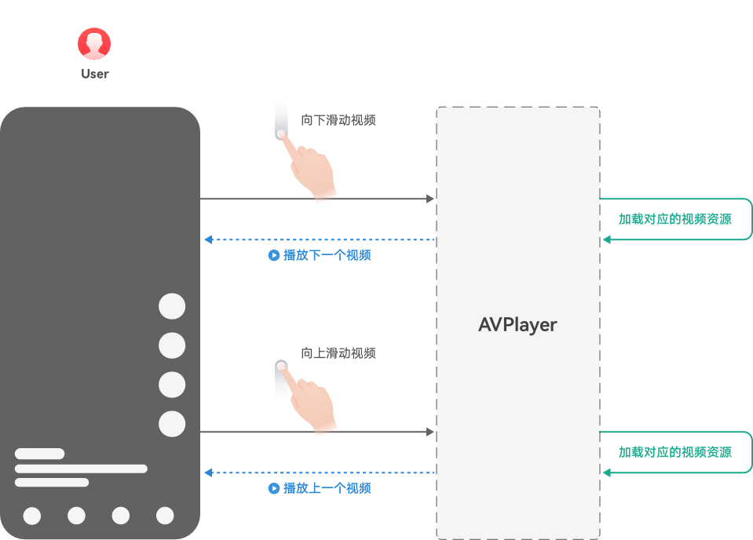
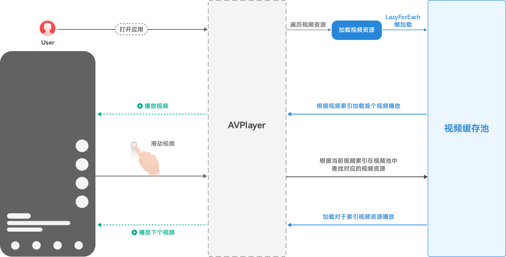
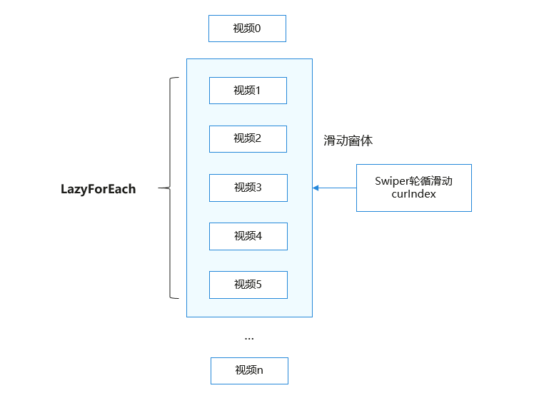
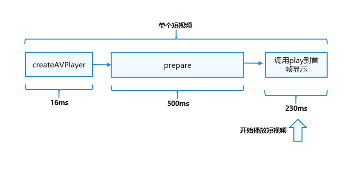
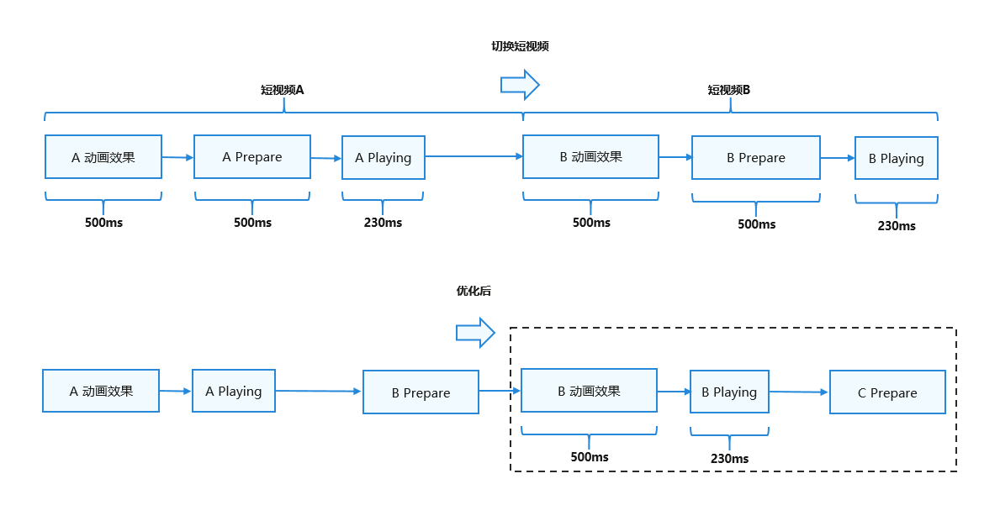
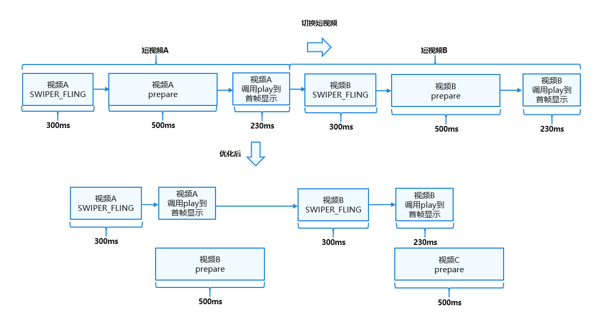

# 在线短视频流畅切换

更新时间：2026-05-18 00:55:31

来源：https://developer.huawei.com/consumer/cn/doc/best-practices/bpta-smooth-switching

**   


##### 概述

在短视频应用中，用户在快速切换视频时，新视频起播容易出现时延过长的问题。针对该问题，本文提供了如下解决方案：
 

 
- 视频播放框架AVPlayer和滑块视图容器Swiper进行短视频滑动轮播切换。
- 绘制组件XComponent的Surface类型动态渲染视频流。
- 使用LazyForEach进行数据懒加载，设置cachedCount属性指定缓存数量，搭配组件复用能力以提升性能。冷启动时创建并初始化AVPlayer到prepared阶段。轮播过程中，每次异步创建一个播放器为下一个视频播放做准备。

 
在动画开始时使用预先准备的播放器起播，起播时延不超过230ms，具体可参考[在线短视频类应用的快速切换与快速起播](https://developer.huawei.com/consumer/cn/doc/harmonyos-guides/performance-delay#section12851131281914)。
 
> [!NOTE]
> 如果使用自研播放器引擎而非AVPlayer，也可以参考该解决方案思路实现优化。

 
 

##### 效果展示

图1 ****在线短视频滑动切换效果图**



 
 
 

##### 场景说明

 

##### 适用范围

适用于应用中在线短视频快速切换的场景，该场景下可能会出现播放起始延迟。
 
 

##### 场景体验指标

起播时延计时标准
 
1、以用户滑动屏幕后抬手、手指离屏的时刻为起点，以视频第二帧画面显示的时刻为终点。
 
2、转场动画时长建议设置为300ms。
 
3、在动画开始时使用预先准备的播放器起播，起播时延不超过230ms。
  
| 描述 | 应用内滑动视频，新视频起播时延应≤230ms。 |
| 类型 | 规则 |
| 适用设备 | 手机、折叠屏、平板 |
| 说明 | 无 |
 
 
 

##### 场景分析

 

##### 典型场景及优化方案

**典型场景描述**
 
短视频：以小于5分钟的短视频为例进行说明。
 1. 应用内滑动视频，新视频起播时延≤230ms（不包含滑动动画效果耗时）。
2. 起点时间：松手时的时间。
3. 终点时间：视频内容开始播放，画面首次变化的时间。
 
**场景优化方案**
 
 
AVPlayer：
 1. 数据懒加载冷启动时创建第一个播放器，播放当前视频时预加载下一个视频（预加载会增加用户流量消耗，需开发者自行决策）。使用XComponent的Surface类型动态渲染视频流，LazyForEach进行数据懒加载，设置cachedCount属性指定缓存数量。结合组件复用能力，以达到高性能效果。
2. 异步在线视频预加载在轮播过程中，对下一个视频提前进入AVPlayer的prepared状态。
3. 在线视频播放预接力滑动过程中，手指离开屏幕时，滑动动效开始播放。此时，可以调用AVPlayer的play方法进行播放。
 
三方自研播放器：
 1. 数据懒加载同上文AVPlayer的数据懒加载方案一致。
2. 异步在线视频预加载在轮播过程中，对下一个视频提前初始化播放器所需内容（视频源下载、AudioRender初始化、解码器初始化等），并对视频提前预解析首帧画面。
3. 在线视频播放预接力滑动过程中，手指离开屏幕时，滑动动效开始播放。在动效开始时，可以调用播放引擎进行播放。为了保证用户的起播体验，在前几帧画面送显时应优先送显，而不是等待AudioRender写入音频数据。由于音频硬件时延大于显示时延，播放起始几帧建议不要做强音画同步，而是采用慢追帧策略进行同步，视频帧稍微增大送显间隔，直到完成音画同步。
 

##### 场景实现

 

##### 场景整体介绍

基于AVPlayer实现了在线流媒体的短视频流畅播放和控制功能。使用滑块视图容器Swiper进行短视频滑动轮播切换，使用XComponent的Surface类型动态渲染视频流并实现懒加载，最终实现短视频快速切换，起播时间≤230ms。提供开发者解决此类问题的方案。
 
 
**图2 ****功能时序图**



 
 

##### 在线短视频快速切换

**图3 ****实现流程图**



 
 
**关键点**
 
**AVPlayer**
 
AVPlayer可以将Audio/Video媒体资源（比如mp4/mp3/mkv/mpeg-ts等）转码为可供渲染的图像和可听见的音频模拟信号，并通过输出设备进行播放。
 
**LazyForEach数据懒加载**
 
LazyForEach懒加载可以通过设置cachedCount属性来指定缓存数量（目前设置为3），同时搭配组件复用能力以达到高性能效果。
 
每次都会创建新的SurfaceID和AVPlayer，不共用已有的SurfaceID和AVPlayer，进而将提前加载好的视频（prepared阶段）放入缓存池中。
 
在通过Swiper切换时，会根据当前轮询滑动的窗口索引index到缓存池中找到对应的视频（prepared阶段），直接进行播放，从而提高切换性能。
 
**图4 ****视频懒加载示意图****


 
**异步视频预加载**
 
异步视频预加载：在Swiper轮播过程中，在播放当前视频时，提前加载好下一个视频，在缓存中同时存在多个播放器实例，根据视频当前的索引来确定使用缓存中的哪个播放器来播放，从而达到流畅切换的效果。
 
（1）本地播放一个短视频的耗时。
 
图5 ****单视频加载示意图****


 
（2）播放视频A时，提前预加载视频B。切换短视频时，可以立即播放已预加载的视频B，从而减少切换时间，提升切换性能。
 
图6 ****异步视频预加载示意图****


 

 
**视频播放预启动接力**
 
为了提升滑动播放体验，动效开始时即启动播放，实现动效与播放并行：
 
（1）在收到AnimationStart回调时开始播放，而不是在动效结束后再播放。
 
（2）不要使用默认的弹簧曲线（弹簧动效持续560毫秒，而视频窗口在400毫秒左右已完全展开，最后150毫秒的位移变化较小）。可以将曲线改为Curve.Ease，并将持续时间设置为300毫秒（具体时间根据APP UX确定）。
 
视频播放预启动接力：这种预加载机制的工作方式类似于接力赛跑。为了尽快完成接力，当第一个选手接近终点时，第二个选手会提前起跑并与第一个选手完美交接接力棒，从而减少整个接力赛的时间。短视频切换也是如此，如下图所示：
 
图7 ****视频播放预启动接力****示意图**


 
**开发步骤**
 1. 通过组件复用实现单个视频播放的自定义组件VideoPlayView。
```ArkTS
// Key point: Reuse custom video playback components by using the @Reusable decorator.
@Reusable
@Component
export struct VideoPlayView {
  @Prop @Watch('onIndexChange') curIndex: number = -1;
  // ...
}
```
 在自定义组件VideoPlayView中，设置XComponent组件用于视频流渲染，并获取SurfaceID以设置显示画面。在onLoad时，异步创建并初始化AVPlayer播放器，使其提前进入prepared状态，实现视频的异步预加载。

  
```ArkTS
XComponent({
  id: 'player',
  type: XComponentType.SURFACE,
  controller: this.xComponentController
})
  .width(this.XComponentWidth)
  .height(this.XComponentHeight)
  .onLoad(async () => {
    this.surfaceID = this.xComponentController.getXComponentSurfaceId();
    hilog.info(0x0000, TAG,
      `surfaceID: ${this.surfaceID}, curIndex: ${this.curIndex}, index: ${this.index}.`);
    // Key point: Initialize the AVPlayer asynchronously so that the AVPlayer enters the prepared state in advance to implement asynchronous video preloading.
    this.initAVPlayer();
  })
```

2. 在Swiper组件中使用LazyForEach懒加载自定义组件VideoPlayView，实现视频轮播。通过LazyForEach懒加载VideoPlayView自定义组件，确保每个视频拥有独立的SurfaceID和AVPlayer。

  通过设置cachedCount属性，在XComponent的onLoad中异步初始化AVPlayer，使视频提前进入prepared状态，实现异步预加载。

  视频切换时，在onAnimationStart阶段更新当前窗口索引curIndex，开始播放下一个视频，实现预接力播放。

  设置弹簧曲线为.curve(Curve.Ease)。

  
```ArkTS
Swiper(this.swiperController) {
  // Key point: Use LazyForEach to create an independent SurfaceID in the VideoPlayView component. (The AVPlayer is created in the VideoPlayView and does not share the AVPlayer.)
  LazyForEach(new AVDataSource(Const.VIDEO_SOURCE), (item: string, index: number) => {
    VideoPlayView({
      curSource: item,
      curIndex: this.curIndex,
      index: index,
      firstFlag: this.firstFlag,
      isPageShow: this.isPageShow,
      foldStatus: this.foldStatus
    })
  }, (item: string, index: number) => JSON.stringify(item) + index)
}
// Key point: Set cachedCount to implement preloading.
.cachedCount(this.firstFlag ? 0 : 2)
.width('100%')
.height('100%')
.vertical(true)
.loop(true)
// Key point: Change the spring curve to Curve.Ease.
.curve(Curve.Ease)
.duration(300)
.indicator(false)
.backgroundColor(Color.Black)
.onGestureSwipe((index: number, extraInfo: SwiperAnimationEvent) => {
  hilog.info(0x0000, TAG, `onGestureSwipe index: ${index}, extraInfo: ${extraInfo}.`);
})
.onAnimationStart((index: number, targetIndex: number, extraInfo: SwiperAnimationEvent) => {
  hilog.info(0x0000, TAG,
    `onAnimationStart index: ${index}, targetIndex: ${targetIndex}, extraInfo: ${extraInfo}.`);
  // Key point: The curIndex is updated at AnimationStart and the next video starts to be played.
  this.curIndex = targetIndex;
})
```

3. 视频播放预加载。在自定义组件VideoPlayView中，使用@Watch装饰器监听Swiper轮播的curIndex值。

  
```ArkTS
@Prop @Watch('onIndexChange') curIndex: number = -1;
```
 将视频缓存流中的index与curIndex进行比较，判断视频流中哪个视频播放，其余视频均暂停。

  
```ArkTS
onIndexChange() {
  hilog.info(0x0000, TAG,
    `enter onIndexChange. curIndex: ${this.curIndex}, index: ${this.index}, isPageShow: ${this.isPageShow}.`);
  if (this.curIndex !== this.index) {
    pauseVideo(this.avPlayer, this.curIndex, this.index);
    this.isPlaying = false;
    this.trackThicknessSize = Const.TRACK_SIZE_MIN;
  } else {
    hilog.info(0x0000, TAG,
      `enter indexChange play. curIndex: ${this.curIndex}, index: ${this.index}, isPageShow: ${this.isPageShow}.`);
    // Key point: When the index(curIndex) of the current window is the same as the index of the this, the playback starts.
    if (this.flag === true) {
      playVideo(this.avPlayer, this.curIndex, this.index);
      this.isPlaying = true;
      this.trackThicknessSize = Const.TRACK_SIZE_MIN;
    } else {
      let countNum = 0;
      let intervalFlag = setInterval(() => {
        countNum++;
        if (this.curIndex !== this.index) {
          hilog.info(0x0000, TAG, `enter indexChange play error, clearIntreval. flag: ${this.flag},
        curIndex: ${this.curIndex}, index: ${this.index}.`);
          clearInterval(intervalFlag);
        }
        // Start playing when the video is prepared and the page is visible.
        if (this.flag === true && this.isPageShow) {
          countNum = 0;
          playVideo(this.avPlayer, this.curIndex, this.index);
          this.isPlaying = true;
          this.trackThicknessSize = Const.TRACK_SIZE_MIN;
          clearInterval(intervalFlag);
        } else {
          hilog.info(0x0000, TAG, `enter indexChange play error, clearIntreval. countNum: ${countNum},
         flag: ${this.flag}, curIndex: ${this.curIndex}, index: ${this.index}.`);
          if (countNum > 15) {
            hilog.info(0x0000, TAG,
              `enter indexChange play error, reinit initAVPlayer. countNum: ${countNum}, flag: ${this.flag},
            curIndex: ${this.curIndex}, index: ${this.index}.`);
            countNum = 0;
            this.initAVPlayer();
          }
        }
      }, 100);
    }
  }
}
```

 
 

##### 总结

本文介绍数据懒加载、异步在线视频预加载及在线视频播放预接力等优化方案，帮助开发者解决快速切换播放延时问题。开发者可基于[SwipePlayer](https://gitcode.com/harmonyos_samples/SwipePlayer#工程主要模块结构) 库快速实现短视频流畅滑动的场景开发体验，可以更加聚焦实际场景业务的开发。
 
 

##### 示例代码

- [实现流畅切换短视频](https://gitcode.com/harmonyos_samples/SmoothSwitchShortVideos)
