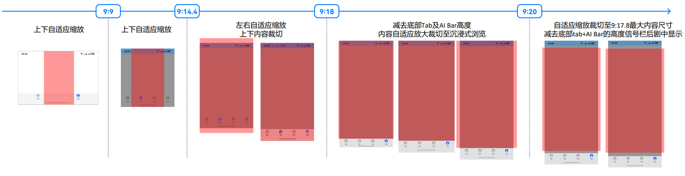
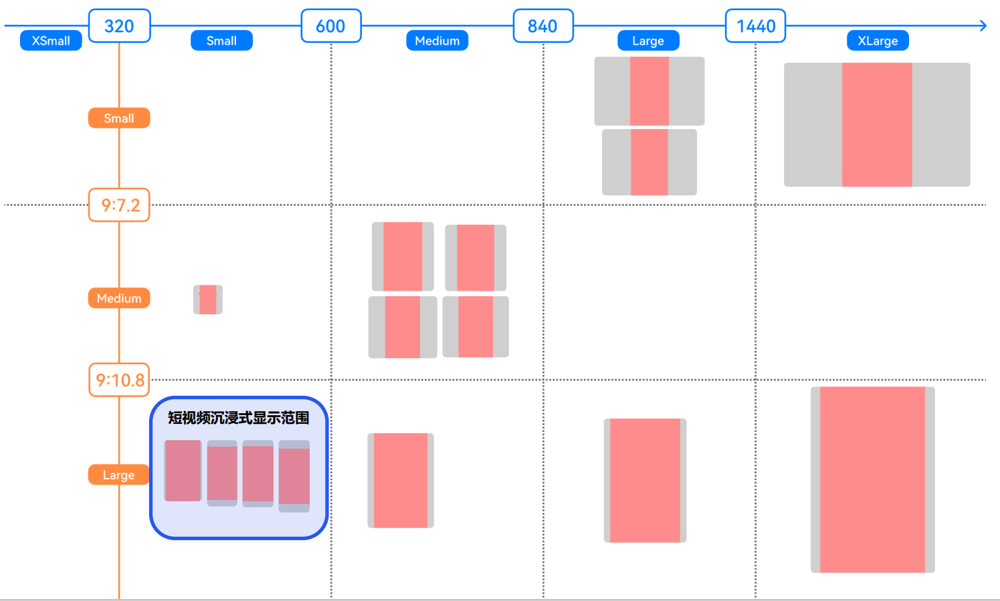
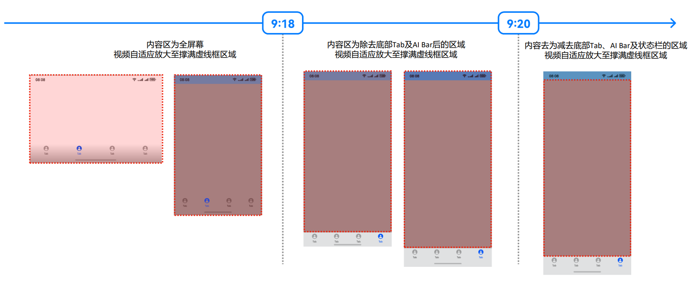
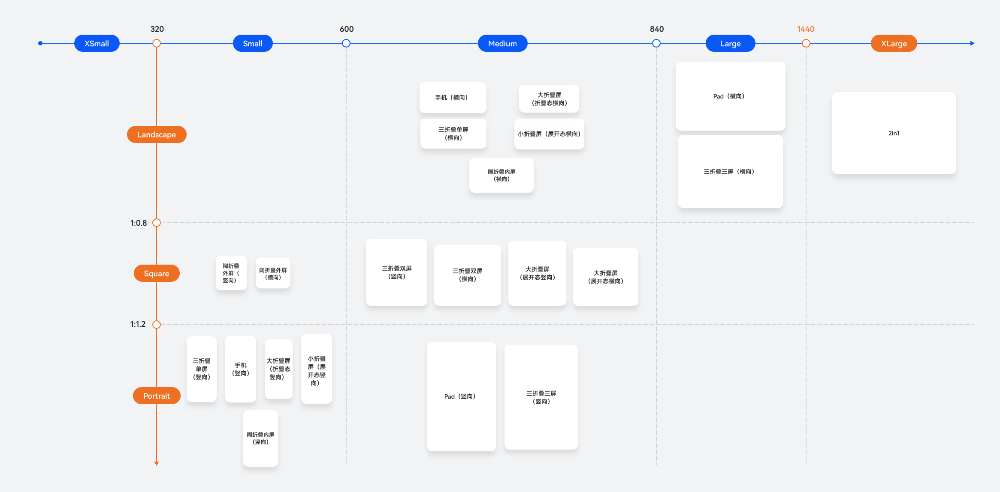

# 基于adaptive_video的短视频适配

更新时间：2026-03-17 02:20:01

来源：https://developer.huawei.com/consumer/cn/doc/best-practices/bpta-short-video-base-adaptivevideo

## 概述


短视频是一种时长较短、内容直观的视频内容形式，单条视频通常为数秒至数分钟。为提升用户的观感体验，短视频页面常采用沉浸式模式展示视频内容，并支持根据用户持握设备的方向自动旋转屏幕页面。然而，由于设备本身、设备屏幕尺寸的差异，不同设备短视频页面的沉浸效果、旋转属性可能会有所不同，这通常需要开发者额外适配。

对此，adaptive_video三方库提供了完整的适配方案，能够使短视频页面在遵循当前主流沉浸、旋转规则下达到多端一致的观感体验，简化短视频页面开发，开发者可参考adaptive_video使用说明进行安装配置与快速上手。下文将介绍adaptive_video支持的短视频页面开发适配场景。


## 短视频自适应沉浸


### 场景描述


短视频沉浸是一种通过全屏展示、弱化界面干扰，让用户专注于视频内容的呈现模式。在开发过程中，通常结合屏幕适配、视频裁剪等技术，以增强视觉沉浸感。在当前主流的沉浸式策略中，短视频的呈现方式会根据设备屏幕尺寸进行调整：大屏设备通常会完整呈现视频内容，而小屏设备则根据窗口比例对视频进行适当裁剪，以提升用户的沉浸体验。


| 设备 | 手机 | 折叠屏展开 |
| --- | --- | --- |
| 实现效果图 |  |  |
| 设备 | 平板 | 2in1 |
| 实现效果图 |  |  |


### 规则描述


adaptive_video提供短视频自适应沉浸的能力，以降低开发者在多端设备上实现短视频沉浸布局的工作量。为确保短视频滑动播放页面在不同设备上均能呈现最佳视觉效果，adaptive_video将综合考虑页面窗口尺寸、视频比例、Tab导航栏高度等信息，根据沉浸规则计算沉浸式布局方案，并依此生成视频播放组件的尺寸与位置建议，同时提供状态栏和Tab导航栏的沉浸建议。

以下是adaptive_video使用的自适应沉浸布局计算规则：


| 序号 | 视频宽高比 r | 窗口宽高比 x | 窗口宽 w (vp) | 沉浸规则描述 |
| --- | --- | --- | --- | --- |
| 1 | 9:16.1 <= r < 9:15.9 | x < 9:20 | 320 <= w < 600 | 窗口高度减去底部导航栏高度，状态栏高度后，等比例缩放视频至视频可视区域宽高比为9:17.8，并居中显示在剩余区域，左右超出窗口部分自适应裁剪; 状态栏、底部tab都不沉浸 |
| 2 | 9:20 <= x < 9:18 | 窗口高度减去底部导航栏高度后，视频内容自适应缩放至剩余区域高度撑满，左右超出部分自适应裁剪; 状态栏沉浸、底部tab不沉浸 |  |  |
| 3 | 9:18 <= x< 9:14.4 | 9:18 <= x < r：视频自适应缩放至窗口高度撑满，左右超出窗口部分自适应裁剪状态栏和底部tab都沉浸 r < x < 9:14.4：视频自适应缩放至将窗口宽度撑满，上下超出窗口部分自适应裁剪状态栏和底部tab都沉浸 |  |  |
| 4 | 9:14.4 <= x < 9:10.8 | 视频将窗口高度撑满，视频宽自适应等比例缩放 状态栏和底部tab都沉浸 |  |  |
| 5 | x <= 9:10.8 | 600 <= w |  |  |
| 6 | 9:10.8 <= x | 320 <= w |  |  |
| 7 | r >= 9:15.9 或 r < 9:16.1 (非9:16区间的视频) | x < 9:20 | 320 <= w | 窗口高度减去底部导航栏高度，状态栏高度后，视频自适应放大至撑满剩余区域 状态栏、底部tab都不沉浸 |
| 8 | 9:20 <= x < 9:18 | 窗口高度减去底部导航栏高度、后，视频自适应放大至撑满剩余区域 状态栏沉浸、底部tab不沉浸 |  |  |
| 9 | x > 9:18 | 视频自适应放大至撑满剩余区域 状态栏沉浸、底部tab根据视频区域大小决定是否沉浸 |  |  |


按照上述沉浸规则进行适配后，视频宽高比处于9:16区间的短视频在窗口宽为320vp至840vp设备上的沉浸效果图如下（红色部分为视频显示区域）

视频宽高比处于9:16区间的短视频在完整断点区间上的沉浸效果图如下（红色部分为视频显示区域）：



视频宽高比处于非9:16区间的短视频在窗口宽为320vp以上设备的沉浸效果如下（虚线框内为视频可能显示的区域）：





### 开发步骤


> [!NOTE]
> adaptive_video三方库中的视频自适应沉浸组件支持网络视频链接，因此三方库使用了以下权限。权限设置详情参考[声明权限](https://developer.huawei.com/consumer/cn/doc/harmonyos-guides/declare-permissions)。
>  ohos.permission.INTERNET：允许应用访问互联网。 以下代码默认应用已经安装并导入了adaptive_video三方库，详细的三方库安装教程可以参考[如何使用ohpm引入三四方库](https://developer.huawei.com/consumer/cn/doc/harmonyos-faqs/faqs-command-line-tool-13)。


- 沉浸模式要求将视频页面的内容扩展至状态栏和导航栏，因此需设置窗口为全屏模式，此时组件的布局范围将从安全区域延伸至整个窗口。
```ts
// Set full screen
windowClass.setWindowLayoutFullScreen(true).catch(() => {
  hilog.error(
    DOMAIN,
    LOG_TAG,
    '%{public}s',
    'Set WindowLayoutFullScreen failed.',
  );
});
let deviceTypeInfo: string = deviceInfo.deviceType;
if (deviceTypeInfo === '2in1') {
  if (canIUse('SystemCapability.Window.SessionManager')) {
    // 2in1 device settings hide title bar and title bar height
    try {
      windowClass.setWindowDecorVisible(false);
    } catch (error) {
      hilog.error(
        DOMAIN,
        LOG_TAG,
        '%{public}s',
        'Set WindowDecorVisible failed.',
      );
    }
    // ...
  }
}
```


- 从adaptive_video三方库导入AdaptiveImmersion自适应沉浸工具并初始化。
```ts
import { AdaptiveImmersion } from '@hadss/adaptive_video';
// ...
const adaptiveImmersion = AdaptiveImmersion.getInstance(); // get AdaptiveImmersion instance
// ...
@Component
export struct AdaptiveAVPlayer {
  // ...
  aboutToAppear(): void {
    adaptiveImmersion.init(this.context) // The UIAbilityContext is initialized with the adaptive immersion tool
    // ...
  }

  // ...
}
```
- 调用AdaptiveImmersion的接口，根据视频宽高及底部Tab导航栏高度计算页面沉浸信息，并根据计算结果调整页面布局（包括视频组件的宽高、视频组件的位置等），以实现页面的沉浸式布局。
```ts
build() {
  RelativeContainer() {
    Stack() {
      Column() {
        XComponent({
          id: 'AdaptiveAVPlayer', // Playback component ID
          type: XComponentType.SURFACE, // Playback component type
          controller: this.xComponentController // Playback Component Controller
        })
        .width(this.surfaceWidth)// Playback component width
        .height(this.surfaceHeight)// Playback component height
        .position(this.videoPosition)// The playback component is positioned relative to the upper left corner of the window
        // ...
      }
    }

    // ...
    // Non-full-screen video playback
    private async changePortraitVideo() {
      try {
        // ...
        const immersionInfo = adaptiveImmersion
        .getImmersionInfo({ width: this.oriSurfaceWidth as number, height: this.oriSurfaceHeight as number },
        this.bottomTabHeight); // Input the width and height of the current video and the height of the tab navigation bar at the bottom to obtain the immersive layout information
        // Adjust the page layout based on the immersive information
        if (immersionInfo) {
          hilog.info(DOMAIN, LOG_TAG, `changePortraitVideo immersionInfo = ${JSON.stringify(immersionInfo)}`);
          this.surfaceWidth = immersionInfo.videoSize.width; // Video component width
          this.surfaceHeight = immersionInfo.videoSize.height; // Video component height
          this.videoPosition =
          immersionInfo.videoPosition; // Position of the video component relative to the upper left corner of the window
        }
      } catch (err) {
        hilog.error(DOMAIN, LOG_TAG, `changePortraitVideo error = ${JSON.stringify(err)}`);
      }
    }
```


> [!NOTE]
> 短视频滑动播放页面通常懒加载了多个视频播放组件，这些组件包括不同宽高比例的视频。在视频切换时，需要重新调用AdaptiveImmersion的接口来计算当前页面的沉浸式布局；此外，当设备窗口发生变化时，也需要重新计算页面的沉浸式布局。有关AdaptiveImmersion接口的详细说明，请参阅[adaptive_video使用说明](https://gitcode.com/openharmony-sig/hadss_adaptive/tree/master/adaptive_video)。


## 短视频自适应旋转


### 场景描述


短视频页面旋转是指当用户改变设备的持握方向（如从竖屏切换为横屏）时，视频内容和页面布局能自动适应方向变化，从而实现视频连续旋转播放的特性。这一功能通常需要结合重力感应与屏幕方向监听来实现，根据监听结果动态调整页面内容与界面元素，保证用户在不同持握姿势下都能获得流畅的观感体验。


| 设备 | 竖屏 | 横屏 |
| --- | --- | --- |
| 手机 |  |  |
| 折叠屏 |  |  |
| 平板 |  |  |
| 2in1 | 无竖屏效果 |  |


### 规则描述


adaptive_video提供短视频自适应旋转的能力，降低开发者在多端设备上适配短视频页面旋转的工作量，确保短视频页面的旋转属性与当前主流应用的旋转属性相符合。总的来说，adaptive_video综合考虑设备类型、屏幕区间、视频类型、屏幕方向等因素，根据旋转规则自动设置屏幕旋转属性，并提供页面布局变化的监听功能。

以下是adaptive_video使用的自适应旋转计算规则：

- 设备类型：2in1/PC、车机、TV不支持旋转，其他类型设备支持旋转。
- 屏幕区间：根据应用窗口宽高计算设备所在的屏幕区间。计算规则如下图，屏幕区间由应用窗口宽（图中横轴，单位为vp）和窗口宽高比（图中纵轴）计算得到，例如，设备Mate60（竖向）的屏幕区间为：Small_Portrait。

- 视频类型：根据视频宽高判定：横向视频（宽>高）、竖向视频（宽≤高）。
- 屏幕方向：根据[重力传感器](https://developer.huawei.com/consumer/cn/doc/harmonyos-references/js-apis-sensor#gravity9)判定：0：竖屏，1：反向横屏，2：反向竖屏， 3：横屏。


以下是自适应旋转属性的详细计算规则：


| 序号 | 屏幕区间 | 视频类型 | 全屏/非全屏 | 屏幕方向：旋转属性 |
| --- | --- | --- | --- | --- |
| 1 | Small_Portrait Medium_Landscape | 横向视频 | 全屏 | 0，2，3：window.Orientation.USER_ROTATION_LANDSCAPE 1：window.Orientation.USER_ROTATION_LANDSCAPE_INVERTED |
| 2 | Small_Portrait Medium_Landscape Small_Square | 竖向视频 | 全屏 | 0，1，2，3：window.Orientation.PORTRAIT |
| 3 | Small_Portrait Medium_Landscape | 横向视频 | 非全屏 | 0，1，2，3：window.Orientation.USER_ROTATION_PORTRAIT |
| 4 | Small_Portrait Medium_Landscape Small_Square | 竖向视频 | 非全屏 | 0，1，2，3：window.Orientation.PORTRAIT |
| 5 | Small_Square | 横向视频 | 非全屏 | 0，1，2，3：window.Orientation.PORTRAIT |
| 6 | Small_Square | 横向视频 | 全屏 | 0，1，2，3：window.Orientation.PORTRAIT, |
| 7 | Medium_Portrait Medium_Square Large_Portrait Large_Landscape Large_Square XLarge_Landscape | 横向视频 | 全屏 | 0，1，2，3：window.Orientation.AUTO_ROTATION_UNSPECIFIED, |
| 8 | Medium_Portrait Medium_Square Large_Portrait Large_Landscape Large_Square XLarge_Landscape | 竖向视频 | 全屏 | 0，1，2，3：window.Orientation.AUTO_ROTATION_UNSPECIFIED, |
| 9 | Medium_Portrait Medium_Square Large_Portrait Large_Landscape Large_Square XLarge_Landscape | 横向视频 | 非全屏 | 0，1，2，3：window.Orientation.AUTO_ROTATION_UNSPECIFIED, |
| 10 | Medium_Portrait Medium_Square Large_Portrait Large_Landscape Large_Square XLarge_Landscape | 竖向视频 | 非全屏 | 0，1，2，3：window.Orientation.AUTO_ROTATION_UNSPECIFIED, |


当设备的短视频页面无法匹配上述旋转规则时，则设定旋转属性为：window.Orientation.UNSPECIFIED。关于窗口旋转属性，详情可见： window.Orientation。


### 开发步骤


- 从adaptive_video三方库导入AdaptiveRotation自适应旋转工具、ScreenModeNotifier页面布局变换工具并初始化。导入后开发者可直接通过调用AdaptiveRotation的接口设置视频页面旋转属性，并通过ScreenModeNotifier监听页面布局变换通知。
```ts
import { AdaptiveRotation, ScreenMode, ScreenModeNotifier } from '@hadss/adaptive_video';
// ...
const adaptiveRotation = AdaptiveRotation.getInstance(); // get AdaptiveRotation instance
const screenModeNotifier: ScreenModeNotifier = ScreenModeNotifier.getInstance(); // get ScreenModeNotifier instance

// ...
@Component
export struct AdaptiveAVPlayer {
  // ...
  aboutToAppear(): void {
    // ...
    adaptiveRotation.init(this.context) // The UIAbilityContext is initialized with the adaptive rotation tool.
    screenModeNotifier.init(this.context) // Initialize the page layout transformation tool in the UIAbilityContext.
    // ...
  }

  // ...
}
```
- 定义屏幕布局模式变化回调函数并注册。
```ts
aboutToAppear(): void {
  // ...
  screenModeNotifier.onScreenModeChange(this.onScreenModeChange); // Register a screen mode listener
}

// ...
// Non-full-screen video playback
private async changePortraitVideo() {
  try {
    // ...
    // Exit the full-screen mode
    adaptiveRotation?.setOrientationNotFullScreen({
      width: oriWidth, height: oriHeight
    }) // Input the width and height of the current video to be played, control the rotation attribute, and play the video vertically
    // ...
  } catch (err) {
    hilog.error(DOMAIN, LOG_TAG, `changePortraitVideo error = ${JSON.stringify(err)}`);
  }
}

// Horizontal full-screen video playback
private async setOrientationFullScreen() {
  try {
    // ...
    // Play the video in full screen mode
    adaptiveRotation?.setOrientationFullScreen({
      width: oriWidth, height: oriHeight
    }); // Input the width and height of the current video, control the rotation attribute, and horizontal full-screen playback effect
    // ...
  }
} catch (err) {
  hilog.error(DOMAIN, LOG_TAG, `setOrientationFullScreen error = ${JSON.stringify(err)}`);
}
}

// Toggle Notifier with Layout
private onScreenModeChange = (data: string) => {
  if (this.currentIndex === this.index) {
    // Indicates that only the current listener on the foreground is processed
    this.currentScreen = data
    if (data === ScreenMode.FULL_SCREEN) {
      // UI layout switching logic when the horizontal layout needs to be entered (for example, when the horizontal video is played in full screen mode)
      hilog.info(DOMAIN, LOG_TAG, `screen switch to fullScreen`)
      this.hideTab = true
      this.setOrientationFullScreen(); // Invoke the full-screen playback method
    } else {
      // UI layout switching logic when the vertical layout needs to be entered (for example, when the horizontal video exits full screen)
      hilog.info(DOMAIN, LOG_TAG, `screen switch to notFullScreen`)
      this.hideTab = false
      this.changePortraitVideo(); // Invoke a non-full-screen player method
    }
  }
}

// ...
```
- 页面进入全屏播放时。
```ts
// Play the video in full screen mode
adaptiveRotation?.setOrientationFullScreen({
  width: oriWidth,
  height: oriHeight,
}); // Input the width and height of the current video, control the rotation attribute, and horizontal full-screen playback effect
```
- 页面进入非全屏播放时。
```ts
// Exit the full-screen mode
adaptiveRotation?.setOrientationNotFullScreen({
  width: oriWidth,
  height: oriHeight,
}); // Input the width and height of the current video to be played, control the rotation attribute, and play the video vertically
```
- 退出视频播放界面时，注销布局模式通知相关的监听。
```text
// Unregister the screen mode listener
screenModeNotifier.offScreenModeChange(this.onScreenModeChange);
```


> [!NOTE]
> 短视频滑动播放页面通常懒加载了多个视频播放组件，这些组件包括不同宽高比例的视频。在视频切换时，需要重新调用AdaptiveRotation的接口来设置当前页面视频对应的旋转属性。


## 视频自适应沉浸高阶组件


### 场景描述


视频播放页面通常包含以下核心元素：视频播放组件、沉浸式页面布局、视频加载与预加载、视频播放状态管理、视频旋转方向适配，以及与用户交互相关的事件。整体设计需兼顾流畅性、响应性与沉浸体验，确保用户在滑动浏览时能享受连续且一致的视觉感受。基于上述要素，adaptive_video提供了视频自适应沉浸高阶组件AdaptiveVideoComponent，帮助开发者高效构建视频播放场景。


| 设备 | 手机 | 折叠屏展开 |
| --- | --- | --- |
| 实现效果图 |  |  |
| 设备 | 平板 | 2in1 |
| 实现效果图 |  |  |


### 实现原理


AdaptiveVideoComponent基于AVPlayer和XComponent实现，内部封装了自适应沉浸工具，无需开发者实现沉浸式布局。AdaptiveVideoComponent对外提供了视频播放控制器、播放过程事件监听接口，支持自定义默认组件（如播放图标、进度条）的样式与交互事件回调，开发者可根据实际需求灵活调整组件样式与交互行为。关于AdaptiveVideoComponent的使用，详情可参考adaptive_video使用说明。


### 开发步骤


基于AdaptiveVideoComponent组件实现视频播放页面。使用该组件时，需提供视频源，同时指定视频控制器和播放监听器，以实现对视频状态的控制与逻辑处理。

以短视频滑动页面为例，以下是使用AdaptiveVideoComponent组件的部分代码示例，其中，curIndex表示当前正在播放的视频播放器索引，index表示当前组件播放器索引。

```text
build() {
RelativeContainer() {
Stack() {
Column() {
AdaptiveVideoComponent({
dataSource: this.dataSource, // Video playback source, which can be a URL or a file descriptor
adaptiveVideoController: this.adaptiveVideoController, // Video controller
adaptiveVideoListener: this.adaptiveVideoListener, // Video player listener, used to get the status/event of the currently playing video
isAutoPlay: true, // Auto play
isLoop: true, // Loop playback
viewMode: this.viewMode, // Video view mode
curIndex: this.curIndex, // Current Playback Index
index: this.index, // Player Index
bottomTabHeight: this.bottomTabHeight, // Bottom tab height
isFullScreenIconShow: true, // Show default full screen icon
adaptiveVideoSetting: this.adaptiveVideoSetting, // Video Player Config Options
isProgressBarShow: this.isProgressBarShow // Show progress bar
})
}
// ...
}
}
// ...
private adaptiveVideoSetting?: AdaptiveVideoSetting = {
interactionEventSetting: {
onFullScreenIconClick: () => {
// ...
adaptiveRotation.setOrientationFullScreen({
width: this.currentVideoSize.width, height: this.currentVideoSize.height
}) // Pass in the width and height of the current video being played, control the rotation property, and achieve a horizontal full-screen playback effect
this.viewMode = ViewMode.FULL_SCREEN // The component mode is full screen mode
},
onSingleClick: () => {
// ...
// Click the video to pause/play the video
this.controlPlayOrPause();
// ...
},
onDoubleClick: () => {
// Double-click event handling
// ...
},
onLongPress: () => {
// Long press event handling
this.adaptiveVideoController?.avPlayer?.setSpeed(media.PlaybackSpeed.SPEED_FORWARD_2_00_X)
// ...
},
onLongPressEnd: () => {
// Long press event end processing
this.adaptiveVideoController?.avPlayer?.setSpeed(media.PlaybackSpeed.SPEED_FORWARD_1_00_X)
}
},
progressBarSetting: {
selectedColor: Color.White,
trackColor: '#1AFFFFFF',
isTimeTextShow: false
} // Progress config
}
```


## 常见问题


- 调用接口后未达到预期效果，如无法实现预期的沉浸式布局，视频页面无法根据旋转属性进行旋转


使用adaptive_video中的自适应工具前，需要调用init()方法进行初始化。

- 在实现短视频滑动播放页面时，视频播放器应选择使用单个AVPlayer还是多个AVPlayer


使用多个AVPlayer，每个AVPlayer控制一个视频播放，确保各视频的播放状态相互独立，并根据视频播放器的索引保证同一时间最多只有一个AVPlayer处于“playing”状态。

- 视频滑动播放页面的旋转属性需在点击全屏播放（调用setOrientationFullScreen()）后才能生效


可能是因为非全屏页面未设置初始旋转属性，建议在进入视频滑动页面或视频切换时主动调用一次AdaptiveRotation的setOrientationNotFullScreen()方法。


## 示例代码


- [实现短视频沉浸和旋转播放功能](https://gitcode.com/harmonyos_samples/AdaptiveVideo)
