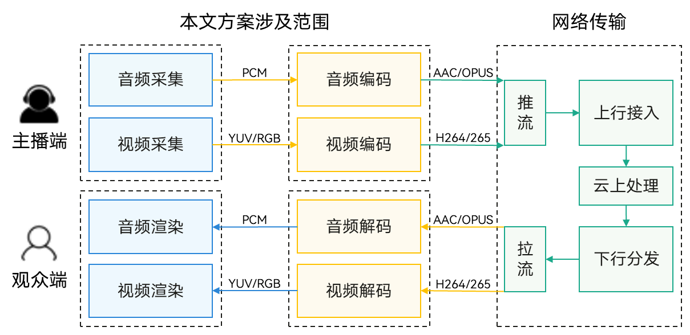
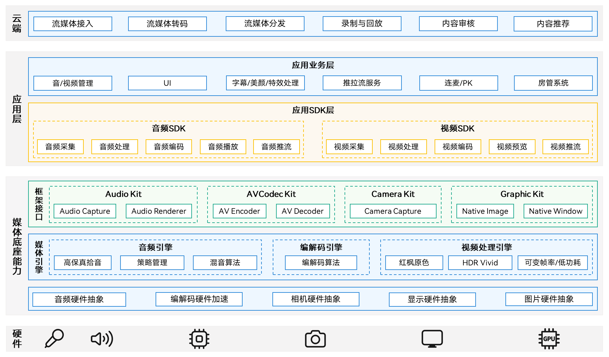
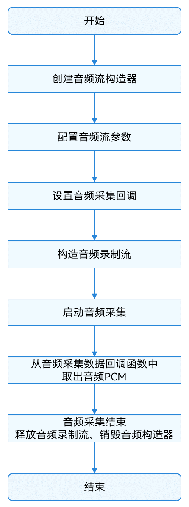
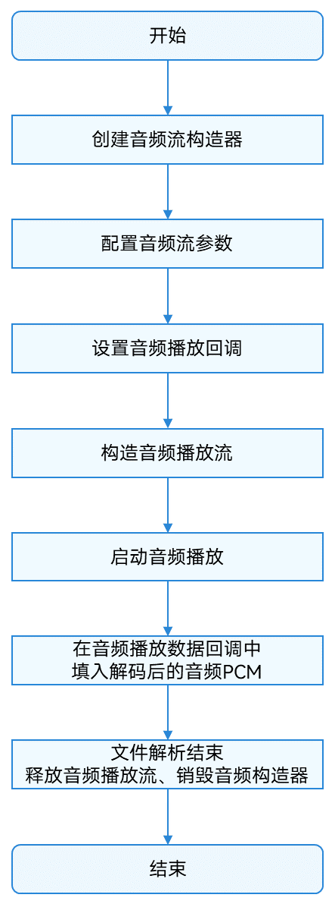
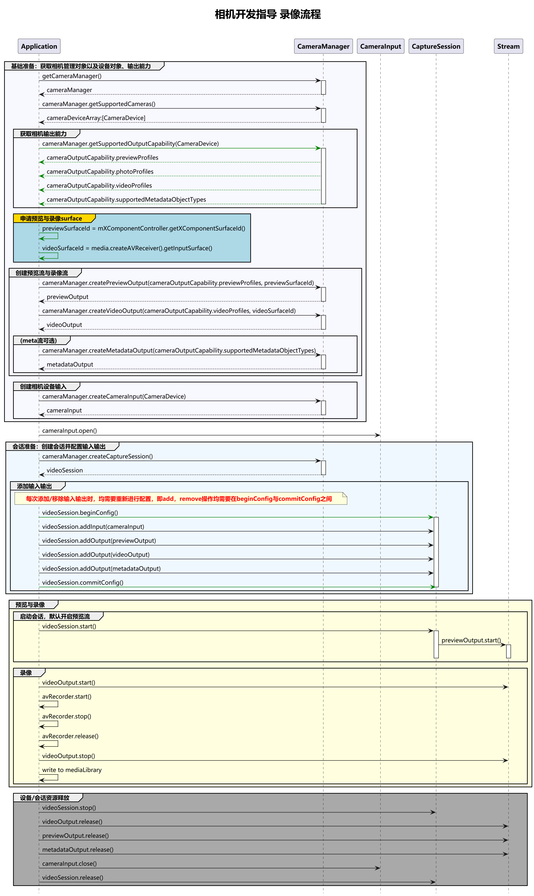
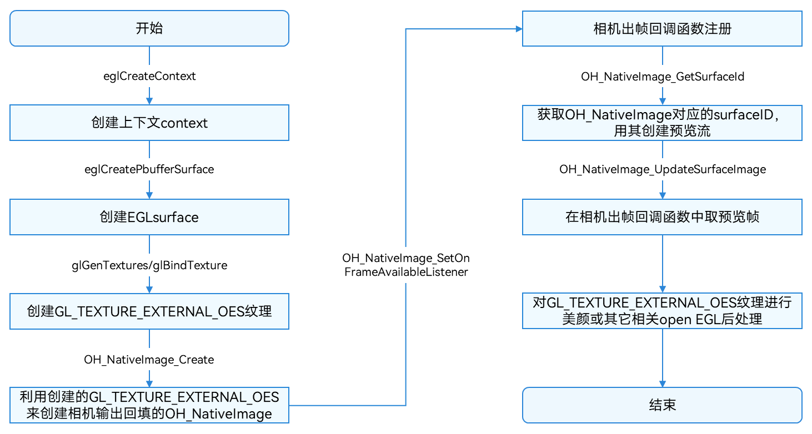
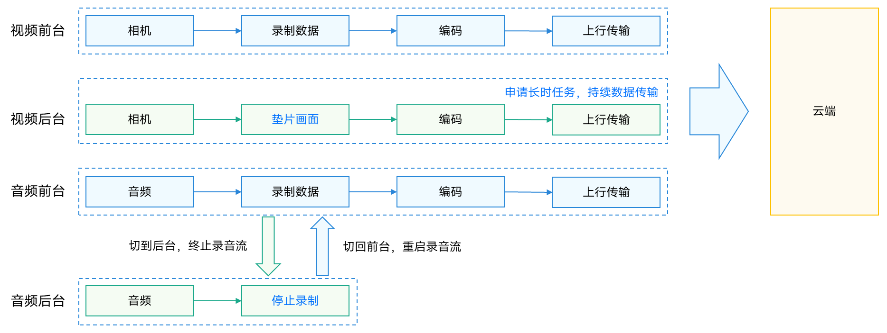

# 基于媒体能力实现直播单播功能

更新时间：2026-03-12 08:45:02

来源：https://developer.huawei.com/consumer/cn/doc/best-practices/bpta-hmos-live-stream-solution

#### 概述

视频直播是当前非常热门的媒体技术应用领域，其中单播是直播领域的一种常见场景，指主播（开播端）录制视频后，由云端服务器点对点分发给每个终端用户（看播端）进行观看，包括电商直播、娱乐直播、教育直播以及户外直播等典型场景。
 
本文基于系统的媒体底座能力，为开发者提供媒体直播系统的解决方案。系统在音视频采集、编解码、播放等方面能够高效处理多种格式的音视频数据，有效提升了音视频的质量和流畅度，助力开发者构建高清采集、高效编码及流畅播放等能力。本文主要涉及开播端的音视频采集与编码、看播端的流媒体播放与音画同步等技术方案。关于直播推拉流协议、云上服务器转码与分发等内容，本文暂不涉及。直播系统的完整链路可参考下图：
 



 
 

#### 开播端解决方案

直播开播端方案主要是基于系统提供的[Audio Kit](https://developer.huawei.com/consumer/cn/doc/harmonyos-guides/audio-kit)、[Camera Kit](https://developer.huawei.com/consumer/cn/doc/harmonyos-guides/camera-kit)、[AVCodec Kit](https://developer.huawei.com/consumer/cn/doc/harmonyos-guides/avcodec-kit)以及[ArkGraphics 2D](https://developer.huawei.com/consumer/cn/doc/harmonyos-guides/arkgraphics-2d)等能力实现开播端高清录制、音频播放、音视频编码和纹理渲染等功能。
 
 

#### 开播端架构设计




 
开播端架构设计如上图所示。图中将直播系统划分为云端、应用、系统与硬件四个逻辑层次。本文重点介绍应用SDK层如何通过调用底层媒体能力完成直播音视频基础能力的构建。应用SDK层主要为应用业务层提供平台技术的基础能力，通常可分为音频SDK和视频SDK两部分：
 1. 音频SDK主要包括音频采集、处理、编码、播放等模块。各模块的作用如下：
- 音频内容采集模块提供音频内容输入，如主播的语聊输入、背景音乐等。

2. 音频内容处理主要是对音频数据进行编码前的预处理，如回声消除（AEC）、背景音降噪（ANS）以及自动增益控制（AGC）等3A操作。

3. 音频内容发送则包括解码播放和编码推送（推流）两种场景，如背景音乐通过本机扬声器播放让主播回听，推流内容则先进行音频编码后推送，经云上分发后让远端观众收听。

4. 视频SDK需要管理整个视频处理的pipeline，串联采集、处理、编码、传输、显示等多个处理模块，各模块协同工作，为上层业务提供完整的视频处理能力。各模块的作用如下：
视频采集模块为视频输入源头，通过摄像头采集原始视频数据。

5. 视频处理模块负责画面优化，应用可进行美颜、滤镜、水印添加等后处理。

6. 视频编码模块负责视频压缩，通过H.264、H.265等编码标准减小数据量。

7. 视频推流模块实现编码后视频的传输，适配RTMP、WebRTC等协议，保障推流稳定性。

8. 视频预览模块将本地预览或连麦接收到的视频数据在终端屏幕呈现，需要支持多分辨率适配。

  媒体系统承上启下，对上为应用SDK提供音视频底座能力，对下可高效调用终端的硬件设备，如麦克风、扬声器、编解码芯片、相机、显示器以及GPU等。

  

  #### 直播音频采集

  为了提高直播音频处理的效率，建议在直播SDK中使用Native侧的OHAudio接口进行开发。使用[OHAudio API](https://developer.huawei.com/consumer/cn/doc/harmonyos-references/capi-ohaudio)进行音频采集时，开发者需要指定录音流类型（[OH_AudioStream_SourceType](https://developer.huawei.com/consumer/cn/doc/harmonyos-references/capi-native-audiostream-base-h#oh_audiostream_sourcetype)）。开发者应根据实际业务需求选择不同的录音流类型，以下是几种常用的录音流类型介绍如下：

1. 常规录音（AUDIOSTREAM_SOURCE_TYPE_MIC）：支持录制48kHz双声道高清音频，但不具备回声消除等音频3A能力。

2. 语音通话（AUDIOSTREAM_SOURCE_TYPE_VOICE_COMMUNICATION）：提供音频3A能力，但采样率只有16kHz。

3. 直播录音（AUDIOSTREAM_SOURCE_TYPE_LIVE）：API20提供了一种专为直播场景设计的高保真录音流类型。该流类型在保证48kHz采样率的同时，新增了高保真回声消除的能力，能够同时满足音频高清晰度和连麦通话无回声干扰的需求。建议开发者在直播场景中全程使用此录音流类型，以避免在单播和连麦场景需要切换录音流类型时的复杂操作。

  上述几种录音流类型的区别可参考下表。

| 录音流类型 | MIC常规录音 | VOIP语音通话 | LIVE直播录音 |

| --- | --- | --- | --- |

| 类型说明 | 媒体模式高清录音（48kHz）无降噪、回声消除等算法 | 通话模式低时延录音挂载音频3A算法（16kHz） | 直播模式高保真录音挂载高保真AEC（48kHz） |

| 类型优点 | 高清录音，无损录制人声、周边声音、本机声音等 | 提供回声消除、降噪等能力 | 提供高保真回声消除能力 |

| 使用限制 | 无回声消除或降噪能力 | 音频带宽较低 | 无法录制本机下行播放的声音 |

| 适用场景 | 直播单播场景，非通话的录音场景 | 直播连麦、通话、会议等场景 | 直播高清连麦、线上音乐教育场景 |

  应用接入AUDIOSTREAM_SOURCE_TYPE_LIVE录音流类型后，在未连接外设的情况下，将使用设备麦克风拾音，并具备48kHz回声抵消能力；而在连接有线或蓝牙耳机时，则会使用耳机麦克风拾音，具体拾音规格取决于耳机麦克风能力。关于录音流类型的详细使用方法，请参考[《使用合适的音频流类型》](https://developer.huawei.com/consumer/cn/doc/harmonyos-guides/using-right-streamusage-and-sourcetype)。

  

 

  高保真AEC的能力并非所有产品均支持，建议开发者在使用AUDIOSTREAM_SOURCE_TYPE_LIVE录音流类型前，先通过[OH_AudioStreamManager_IsAcousticEchoCancelerSupported](https://developer.huawei.com/consumer/cn/doc/harmonyos-references/capi-native-audio-stream-manager-h#oh_audiostreammanager_isacousticechocancelersupported)接口查询当前设备是否支持回声消除能力。

  音频采集开发流程如下图所示：

  



  音频采集开发详细步骤，可参考[《使用OHAudio开发音频录制功能》](https://developer.huawei.com/consumer/cn/doc/harmonyos-guides/using-ohaudio-for-recording)。其中，开发者使用直播录音（AUDIOSTREAM_SOURCE_TYPE_LIVE）类型的回声消除能力的关键代码如下：

  
```cpp
if (sampleInfo.audioInfo.isOpenEchoCancel) {
    // Echo cancellation (audio pickup path): Setting the audio stream type to
    // AUDIOSTREAM_SOURCE_TYPE_VOICE_COMMUNICATION or AUDIOSTREAM_SOURCE_TYPE_LIVE (live streaming scenario) enables
    // built-in echo cancellation.
    OH_AudioStream_SourceType sourceType = AUDIOSTREAM_SOURCE_TYPE_VOICE_COMMUNICATION;
    OH_AudioStreamManager *streamManager = nullptr;
    if (ApiCompat_OH_AudioManager_GetAudioStreamManager.IsAvailable() &&
        ApiCompat_OH_AudioStreamManager_IsAcousticEchoCancelerSupported.IsAvailable()) {
        // Logic for handling higher API versions: Pass input parameters directly, fully consistent with native
        // calling method
        int result = ApiCompat_OH_AudioManager_GetAudioStreamManager(&streamManager);
        (void)result;
        bool isSupportAec = false;
        (void)ApiCompat_OH_AudioStreamManager_IsAcousticEchoCancelerSupported(
            streamManager, AUDIOSTREAM_SOURCE_TYPE_LIVE, &isSupportAec);
        if (isSupportAec) {
            sourceType = AUDIOSTREAM_SOURCE_TYPE_LIVE;
            SAMPLE_LOGI("high api:%{public}d version, audio stream source set to live type",
                        ohos::compatibility::GetSystemApiVersion());
        } else {
            sourceType = AUDIOSTREAM_SOURCE_TYPE_VOICE_COMMUNICATION;
            SAMPLE_LOGI("high api:%{public}d version, audio stream source set to voip type",
                        ohos::compatibility::GetSystemApiVersion());
        }
    } else {
        // Logic for handling lower API versions
        sourceType = AUDIOSTREAM_SOURCE_TYPE_VOICE_COMMUNICATION;
        SAMPLE_LOGI("low api:%{public}d version, audio stream source set to voip type",
                    ohos::compatibility::GetSystemApiVersion());
    }
    OH_AudioStreamBuilder_SetCapturerInfo(builder_, sourceType);
}
```


  

  #### 直播音频编码

  系统提供高效的音频编码能力，开发者可通过调用AVCodec Kit的Native侧[API接口](https://developer.huawei.com/consumer/cn/doc/harmonyos-references/capi-native-avcodec-audiocodec-h)完成音频编码任务。该接口不限制PCM数据的来源，开发者可以调用麦克风录制获取，也可以导入编辑后的PCM数据。通过音频编码，输出对应格式的码流，最后封装为目标格式文件。当前支持的编码能力请参考[AVCodec支持的格式](https://developer.huawei.com/consumer/cn/doc/harmonyos-guides/avcodec-support-formats#音频编码)。

  音频编码的全流程主要包括：创建编码器、设置编码参数（采样率、码率、声道数等）、开始、刷新、重置、销毁资源。在应用开发过程中，开发者应按一定顺序调用方法，执行对应操作，否则系统可能会抛出异常或生成其他未定义的行为。关于音频编码的具体开发步骤，开发者可以参考[《音频编码》](https://developer.huawei.com/consumer/cn/doc/harmonyos-guides/audio-encoding)。

  
> [!NOTE]
> 根据直播业务类型，一般建议开发者在单播场景下选择AAC编码格式，而对于低时延实时通信的连麦场景，建议选择OPUS编码格式。


  

  #### 直播音频文件播放

  当开播端需要播放背景音乐或氛围音效时，需要用到系统的音频解封装、解码及音频播放能力。其基本流程为：音频文件 -> 解封装 -> 音频解码 -> 播放。应用可通过先后调用AVCodec Kit中的[OH_AVDemuxer](https://developer.huawei.com/consumer/cn/doc/harmonyos-guides/audio-video-demuxer)和[AudioCodec](https://developer.huawei.com/consumer/cn/doc/harmonyos-guides/audio-decoding)接口分别进行解封装和解码，再调用Audio Kit中的[OH_AudioRenderer](https://developer.huawei.com/consumer/cn/doc/harmonyos-guides/using-ohaudio-for-playback)进行渲染播放。OH_AudioRenderer需设置音频播放流类型（[StreamUsage](https://developer.huawei.com/consumer/cn/doc/harmonyos-references/arkts-apis-audio-e#streamusage)），根据直播场景实际播放的音频类型，建议使用STREAM_USAGE_MUSIC音频流类型，以获得更通用的系统音效播放体验。具体开发流程如下：

  **（1）音频文件 -> 解封装 -> 音频解码**

  



  **（2）音频解码 -> 播放**

  



  开播端主播可能会使用本机扬声器或耳机进行音频文件收听。若主播播放的音频文件由应用提供，则应用需同时将该音频文件编码后推流发送，以方便看播端的观众同步收听。

  当主播使用本机扬声器收听时，按照前述直播音频采集中的建议，当采集录音流类型选择为AUDIOSTREAM_SOURCE_TYPE_LIVE流时，下行播放的音频会被回声抵消算法抑制，仅采集主播语音，看播端观众听到的是主播的语聊及编码推流发送的音频。当主播使用耳机收听时，无播放回声拾取问题。

  

  #### 直播音频焦点管理

  在直播场景下，应用通常比较关心直播采集音频被其他音频打断的处理方式。系统中，音频中断有终止（Stop）、暂停（Pause）、降音（Duck）、并发（Mix）四种策略。应用一般需要关注和处理的是终止式打断和暂停式打断。

  在处理音频中断事件时，应用需主动监听音频焦点事件[OH_AudioCapturer_OnInterruptEvent](https://developer.huawei.com/consumer/cn/doc/harmonyos-references/capi-ohaudio-oh-audiocapturer-callbacks-struct#oh_audiocapturer_oninterruptevent)/ [OH_AudioRenderer_OnInterruptEvent](https://developer.huawei.com/consumer/cn/doc/harmonyos-references/capi-ohaudio-oh-audiorenderer-callbacks-struct#oh_audiorenderer_oninterruptevent)中的打断提示（InterruptHint）。建议处理方式如下：

  
当收到终止（INTERRUPT_HINT_STOP）式打断时：此时直播音频将永久失焦，待后起音频流结束后，先起音频流不恢复播放。建议应用通过UI提示用户手动恢复音频采集/播放；
- 当收到暂停（INTERRUPT_HINT_PAUSE）式打断时：此时直播音频会暂时失焦，建议应用通过UI提示用户此时音频采集/播放已暂停；待后续收到继续（INTERRUPT_HINT_RESUME）标志时，应用可选择通过start方法重启录音流/播放流。

 
关于音频焦点冲突处理的详细原理和解决方案，开发者可以参考[《音频焦点管理》](https://developer.huawei.com/consumer/cn/doc/best-practices/bpta-audio-focus-management)，关键代码如下所示：
 
```cpp
// Customize the audio interrupt event function
static int32_t AudioCapturerOnInterruptEvent(OH_AudioCapturer *capturer, [[maybe_unused]]void* userData,
    OH_AudioInterrupt_ForceType type, OH_AudioInterrupt_Hint hint)
{
    if ((type == AUDIOSTREAM_INTERRUPT_SHARE) && (hint == AUDIOSTREAM_INTERRUPT_HINT_RESUME)) {
        OH_AudioCapturer_Start(capturer);
    }
    return 0;
}
```
 
```cpp
// Customize the audio interrupt event function
static int32_t OnRenderInterruptEvent(OH_AudioRenderer *renderer, [[maybe_unused]]void *userData, 
    OH_AudioInterrupt_ForceType type, OH_AudioInterrupt_Hint hint)
{
    if ((type == AUDIOSTREAM_INTERRUPT_SHARE) && (hint == AUDIOSTREAM_INTERRUPT_HINT_RESUME)) {
        OH_AudioRenderer_Start(renderer);
    }
    return 0;
}
```
 
 

#### 直播SDR视频采集

**（一）SDR视频采集**
 
在直播的视频采集场景中，建议应用仅采集一路预览流，以降低直播功耗和时延。同时，在SDR直播场景下，颜色空间可配置为BT709_LIMIT，以获得更广泛的设备支持。相机视频采集流程如下：
 



 
关于相机视频采集的具体开发步骤，开发者可参考[《相机录像实践》](https://developer.huawei.com/consumer/cn/doc/harmonyos-guides/camera-recording-case)。其中，配置颜色空间的关键代码如下所示：
 
```ArkTS
// Set the color space
setColorSpaceBeforeCommitConfig(session: camera.VideoSession, isHdr: number): void {
  let colorSpace: colorSpaceManager.ColorSpace =
    isHdr ? colorSpaceManager.ColorSpace.BT2020_HLG_LIMIT : colorSpaceManager.ColorSpace.BT709_LIMIT;
  let colorSpaces: Array<colorSpaceManager.ColorSpace> = this.getSupportedColorSpaces(session);
  let isSupportedColorSpaces = colorSpaces.indexOf(colorSpace) >= 0;
  if (isSupportedColorSpaces) {
    Logger.info(TAG, `setColorSpace: ${colorSpace}`);
    try {
      session.setColorSpace(colorSpace);
    } catch (error) {
      Logger.error(TAG, `setColorSpace fail ${error}`)
    }
    let activeColorSpace: colorSpaceManager.ColorSpace;
    try {
      activeColorSpace = session.getActiveColorSpace();
      if (activeColorSpace != colorSpace) {
        Logger.error(TAG, `activeColorSpace: ${activeColorSpace}, but wait: ${colorSpace}`);
      }
      Logger.info(TAG, `activeColorSpace: ${activeColorSpace}`);
    } catch (error) {
      Logger.error(TAG, `getActiveColorSpace fail ${error}`);
    }
  } else {
    Logger.info(TAG, `colorSpace: ${colorSpace} is not support`);
  }
}
```
 
**（二）SDR视频处理**
 
在视频处理过程中，开发者需要完成NativeImage的创建、SurfaceId的获取及帧可用性监听设置，为后续相机数据的处理（如美颜、滤镜等）提供基础图像载体，确保相机生产的数据能被正确接收与处理。本文建议开发者通过NativeImage绑定外部OpenGL纹理并关联相机采集数据，由系统完成视频数据的流转，开发者可重点关注shader算法的实现。具体流程如下图所示：
 



 
该环节的关键代码如下所示：
 
```cpp
bool RenderThread::CreateNativeImage()
{
    nativeImage_ = OH_NativeImage_Create(-1, GL_TEXTURE_EXTERNAL_OES);
    if (nativeImage_ == nullptr) {
        OH_LOG_Print(LOG_APP, LOG_ERROR, LOG_PRINT_DOMAIN, "RenderThread", "OH_NativeImage_Create failed.");
        return false;
    }
    int ret = 0;
    {
        std::lock_guard<std::mutex> lock(nativeImageSurfaceIdMutex_);
        nativeImageWindow_ = OH_NativeImage_AcquireNativeWindow(nativeImage_);
        ret = OH_NativeImage_GetSurfaceId(nativeImage_, &nativeImageSurfaceId_);
    }
    if (ret != 0) {
        OH_LOG_Print(LOG_APP, LOG_ERROR, LOG_PRINT_DOMAIN, "RenderThread",
            "OH_NativeImage_GetSurfaceId failed, ret is %{public}d.", ret);
        return false;
    }

    nativeImageFrameAvailableListener_.context = this;
    nativeImageFrameAvailableListener_.onFrameAvailable = &RenderThread::OnNativeImageFrameAvailable;
    ret = OH_NativeImage_SetOnFrameAvailableListener(nativeImage_, nativeImageFrameAvailableListener_);
    if (ret != 0) {
        OH_LOG_Print(LOG_APP, LOG_ERROR, LOG_PRINT_DOMAIN, "RenderThread",
                     "OH_NativeImage_SetOnFrameAvailableListener failed, ret is %{public}d.", ret);
        return false;
    }

    return true;
}
```
 
**（三）色彩空间配置**
 
在SDR直播场景下，视频编码及显示环节需注意渲染和显示的色彩空间也应配置为BT709_LIMIT，与相机采集时保持一致。关键代码如下所示：
 
```cpp
// SDR set BT709
int32_t ret = OH_NativeWindow_SetColorSpace(nativeWindow_, OH_COLORSPACE_BT709_LIMIT);
```
 
**（四）使用系统红枫摄像能力**
 
系统级的红枫色彩算法已全面开放给生态应用，三方应用基于上述标准统一的录像会话及预览流接口，即可获取标准原色高清图像，实现与系统相机一致的红枫色彩效果。同时，建议应用接入系统相机的自动对焦、长焦、微距等能力，充分发挥相机硬件的综合能力，全面获得系统级拍摄的优秀体验。此能力仅限支持红枫摄像的华为产品使用，不同产品的能力适配情况，根据设备自身规格而定。关于实现系统相机级别的效果和能力，开发者可以参考[自定义相机预览](https://developer.huawei.com/consumer/cn/doc/best-practices/bpta-custom-camera-preview)。
 
 

#### 直播HDR Vivid视频采集

HDR Vivid是UWA认证的动态HDR视频标准，使用HDR Vivid标准进行视频直播可以为用户带来更宽广的色彩范围、更细腻的层次表现、更显著的明暗对比。系统支持HDR Vivid视频采集、编码和解码显示功能，应用调用系统提供的API，配合云上链路的适配，可实现端到端的HDR Vivid视频直播。关于HDR Vivid视频采集的开发实践，开发者可参考[《HDR Vivid视频录制、播放与转码》](https://developer.huawei.com/consumer/cn/doc/best-practices/bpta-hdrvivid)，但直播场景需注意选用预览流，而非录制流。
 
**（一）HDR Vivid视频采集**
 
- 采集数据格式需配置为CAMERA_FORMAT_YCRCB_P010：调用[OH_CameraManager_GetSupportedCameraOutputCapabilityWithSceneMode](https://developer.huawei.com/consumer/cn/doc/harmonyos-references/capi-camera-manager-h#oh_cameramanager_getsupportedcameraoutputcapabilitywithscenemode)接口获取目标相机设备在录像模式（NORMAL_VIDEO）下支持的所有输出规格。该接口调用成功后，参数[cameraOutputCapability](https://developer.huawei.com/consumer/cn/doc/harmonyos-references/capi-oh-camera-camera-outputcapability)会包含一个profile数组，每个profile均携带宽高属性（对应分辨率）和format属性（对应数据格式）。从profile数组中筛选同时满足以下两个条件的profile：1. 分辨率条件：profile的宽、高属性符合业务场景需求（例如根据屏幕尺寸、录像清晰度要求设定的宽高范围）。

2. 数据格式条件：profile的format属性必须等于CAMERA_FORMAT_YCRCB_P010（确保数据格式适配后续处理流程）。

 
- 采集颜色空间需配置为OH_COLORSPACE_BT2020_HLG_LIMIT：调用[OH_CaptureSession_GetSupportedColorSpaces](https://developer.huawei.com/consumer/cn/doc/harmonyos-references/capi-capture-session-h#oh_capturesession_getsupportedcolorspaces)接口查询当前采集会话（Camera_CaptureSession）支持的所有颜色空间配置，遍历supportedColorSpaces列表，筛选出颜色空间项OH_COLORSPACE_BT2020_HLG_LIMIT。调用[OH_CaptureSession_SetActiveColorSpace](https://developer.huawei.com/consumer/cn/doc/harmonyos-references/capi-capture-session-h#oh_capturesession_setactivecolorspace)接口将筛选出的OH_COLORSPACE_BT2020_HLG_LIMIT设置为采集会话的活跃颜色空间。

 
**（二）HDR Vivid视频处理**
 
- OpenGL环境需配置为10bit YUV格式：首先需构建符合10bit YUV格式要求的EGL配置属性数组，明确YUV相关参数。然后调用eglChooseConfig函数，从EGL显示设备中筛选符合上述10bit YUV属性的配置。
- 通过NativeImage获取NativeBuffer：通过[OH_NativeImage_AcquireNativeWindowBuffer](https://developer.huawei.com/consumer/cn/doc/harmonyos-references/capi-native-image-h#oh_nativeimage_acquirenativewindowbuffer)接口从NativeImage对象中获取NativeBuffer，该缓冲区将作为后续OpenGL纹理数据的来源。
- 通过FrameBuffer绑定纹理进行10bit YUV数据处理：通过EGLImage将NativeBuffer关联为OpenGL纹理，再绑定到FrameBuffer完成10bit YUV数据的渲染/处理。

 
**（三）动态元数据复用方案**
 
如果对相机输出内容没有后处理要求，保持原汁原味输出，可以从相机中获取动态元数据，传递到编码器。主要步骤如下：
 
- 获取HDR Vivid动态元数据和颜色空间：首先通过[OH_NativeBuffer_GetColorSpace](https://developer.huawei.com/consumer/cn/doc/harmonyos-references/capi-native-buffer-h#oh_nativebuffer_getcolorspace)接口从输入NativeBuffer中读取当前帧的颜色空间信息。然后通过调用[OH_NativeBuffer_GetMetadataValue](https://developer.huawei.com/consumer/cn/doc/harmonyos-references/capi-native-buffer-h#oh_nativebuffer_getmetadatavalue)接口读取输入缓冲区中HDR Vivid所需的三类核心元数据（元数据类型、静态元数据、动态元数据）。
- 设置HDR Vivid动态元数据和颜色空间：将上一步读取到的颜色空间和HDR Vivid元数据，通过对应的设置函数写入输出NativeBuffer中，确保输出帧能正确承载HDR Vivid效果，操作需按“颜色空间→元数据”的顺序执行，避免依赖项缺失导致配置无效。如果在调整相机输出内容后需要重新生成动态元数据，具体开发指导，开发者可以参考[《视频动态元数据生成》](https://developer.huawei.com/consumer/cn/doc/harmonyos-guides/generate-video-dynamic-metadata)。

 
 

#### 直播视频编码

**（一）常规视频编码**
 
由于Surface模式的数据流转性能优于Buffer模式，因此，在直播场景中建议开发者使用[Surface模式下的视频编码](https://developer.huawei.com/consumer/cn/doc/harmonyos-guides/video-encoding#surface模式)。系统支持常见的H.264、H.265视频编码格式，如果需要对HDR Vivid视频进行编码，需要配置MimeType为H.265 (OH_AVCODEC_MIMETYPE_VIDEO_HEVC)。关于视频编码参数配置，开发者可以参考[《典型场景的视频编码配置》](https://developer.huawei.com/consumer/cn/doc/harmonyos-guides/video-encoding-configuration-typical-scenarios)。
 
**（二）ROI编码**
 
ROI（Region of Interesting）编码是指对感兴趣区域和非感兴趣区域进行质量的人为干预调整，例如在码率或带宽受限情况下，对重点区域提高质量，对非重点区域降低质量（平衡码率）。
 
ROI区域的坐标范围可由开发者自主指定。例如，开发者可以借助“美颜模块”的人脸识别功能，将检测输出的人脸区域范围作为ROI区域，并随视频的每一帧同步输出。开发者也可以利用相机的人脸区域检测能力来获取ROI区域（实际应用需先确认该能力是否受支持）。关于ROI编码具体开发指导，开发者可以参考[《ROI编码》](https://developer.huawei.com/consumer/cn/doc/harmonyos-guides/video-encoding-roi)。
 
```cpp
// Static callback function: Used to handle encoder requests for input parameters
static void OnNeedInputParameter(OH_AVCodec *codec, uint32_t index, OH_AVFormat *parameter, void *userData)
{
    // Retrieve CodecUserRoi instance from user data
    VideoEncoder::CodecUserRoi* roiUserData = static_cast<VideoEncoder::CodecUserRoi*>(userData);
    if (!roiUserData || !roiUserData->vencoder) {
        SAMPLE_LOGE("Invalid user data in OnNeedInputParameter");
        OH_VideoEncoder_PushInputParameter(codec, index);
        return;
    }

    VideoEncoder* encoder = roiUserData->vencoder;
    FaceIntInfo faceInfo = encoder->GetLatestFaceInfo();
    std::string roiInfo;

    // If valid face information is available, use the face region as the ROI
    if (faceInfo.valid) {
        int32_t left = faceInfo.topLeftX;
        int32_t top = faceInfo.topLeftY;
        int32_t right = faceInfo.topLeftX + faceInfo.width;
        int32_t bottom = faceInfo.topLeftY + faceInfo.height;

        // Construct ROI information string, lowering the QP value in facial regions to enhance image quality
        char roiBuffer[100];
        int len = snprintf(roiBuffer, sizeof(roiBuffer), "%d,%d-%d,%d=-4", left, top, right, bottom);
        if (len > 0 && len < static_cast<int>(sizeof(roiBuffer))) {
            roiInfo = std::string(roiBuffer, len);
        } else {
            SAMPLE_LOGE("Failed to format ROI string, buffer size: %zu", sizeof(roiBuffer));
        }
#if ONLY_TEST_ROI_INFO
        SAMPLE_LOGI("HMOS_LiveStream: ROI face  timestamp: %{public}d, ROI: %{public}s",
            faceInfo.timestamp, roiBuffer);
#endif
    } else {
        // If no face information is available, do not set any ROI, allowing the encoder to use global default
        // parameters
        SAMPLE_LOGI("No valid face info, no ROI set.");
    }

    // Set ROI parameters
    const char* roiKey = ApiCompat_OH_MD_KEY_VIDEO_ENCODER_ROI_PARAMS;
    OH_AVFormat_SetStringValue(parameter, roiKey, roiInfo.c_str());
    OH_VideoEncoder_PushInputParameter(codec, index);
}
```
 
 

#### 直播系统压力反馈

直播作为典型的应用重负载场景，其系统性能设计直接影响设备续航、发热等关键指标，从而进一步影响用户体验。系统提供压力反馈监测方案，以帮助应用优化直播场景的性能及功耗。开发者可使用系统提供的压力反馈接口[on('systemPressureLevelChange')](https://developer.huawei.com/consumer/cn/doc/harmonyos-references/arkts-apis-camera-videosession#onsystempressurelevelchange20)，根据系统压力动态调整直播场景负载，例如在系统压力过大时主动进行动态应用负载降级。
 
```ArkTS
systemPressureLevelChangeCallback(err: BusinessError, systemPressureLevel: camera.SystemPressureLevel): void {
  if (err !== undefined && err.code !== 0) {
    Logger.error(TAG, `Callback Error, errorCode: ${err.code}`);
    return;
  }
  Logger.info(TAG, `systemPressureLevel: ${systemPressureLevel}`);
}


registerSystemPressureLevelChangeCallback(videoSession: camera.VideoSession): void {
  if (deviceInfo.sdkApiVersion >= 20) {
    videoSession.on('systemPressureLevelChange', this.systemPressureLevelChangeCallback);
  }
}
```
 
 

#### 开播端开发常见问题FAQ

**（1）高保真音频采集的焦点策略是怎么样的？**
 
在系统中，高保真音频录音流类型（AUDIOSTREAM_SOURCE_TYPE_LIVE）的焦点优先级和普通录音流（AUDIOSTREAM_SOURCE_TYPE_MIC）一致，低于VOIP通话（AUDIOSTREAM_SOURCE_TYPE_VOICE_COMMUNICATION）的焦点优先级。例如，当开始语音通话时，将会停止正在直播采集的语音，同时应用会收到被打断的系统通知（[OH_AudioCapturer_OnInterruptEvent](https://developer.huawei.com/consumer/cn/doc/harmonyos-references/capi-ohaudio-oh-audiocapturer-callbacks-struct#oh_audiocapturer_oninterruptevent)）。出于安全性的考虑，语音通话的录制流与普通录音录制流不能并发，当应用接收到被打断通知后，建议通过UI提示窗的形式通知用户在语音通话后手动恢复直播语音采集录制。
 
**（2）高保真采集录音流能录制到本机扬声器播放的声音吗？**
 
不能，正常情况下本机扬声器播放的声音会被回声消除算法抑制掉。如果需要在启用高保真音频采集的同时录制本机扬声器播放的声音，建议可同时启动一个[系统内录](https://developer.huawei.com/consumer/cn/doc/harmonyos-guides/using-avscreencapture-arkts)的录音工作流。
 
**（3）相机在多设备（手机、大折叠、阔折叠、三折叠、平板）上如何实现正常状态和折叠状态切换时的预览旋转、切换镜头等功能？**
 
设备形态较多，直播相机页面的多设备适配是开发者需面临的一大挑战。由于不同设备的屏幕尺寸、相机镜头、折叠形态以及系统特性等方面存在较大差异，相机界面的开发往往会遇到一系列兼容性问题，影响用户体验。
 
对于该问题，系统提供[多设备相机适配的实践建议](https://developer.huawei.com/consumer/cn/doc/best-practices/bpta-multi-device-camera)，包括如何选择相机设备、设置多设备上相机预览画面比例、设置录像旋转角度、实现悬停态相机页面等。
 
**（4）直播页面前后台切换如何实现业务保活？**
 
直播业务经常面临前后台切换的场景，当主播把开播页面切换至后台时，直播业务应停止音视频采集以保障主播的个人隐私，但同时业务有存活需求，以便于切换至前台时直播可以继续直播。
 
该场景下，建议应用可在直播推后台时发送一张如“主播暂时离开”的画面垫片以告知看播端观众此时主播离开，音视频采集暂停。同时为满足后台存活需求，业务需向系统申请一个数据传输的[长时任务](https://developer.huawei.com/consumer/cn/doc/harmonyos-guides/continuous-task)，且持续发送直播画面垫片以满足数据传输长时任务的流量监控需求，如下图所示：
 


 
**（5）同一页面内的相机切换生命周期如何管理？**
 
直播类应用经常会涉及在同一页面内切换不同的相机调用业务，例如，中间Tab页的业务需要用相机拍摄内容后发布到内容社区，右侧Tab页的业务则是直播页面需启动相机预览。在不同Tab页面切换时，需要特别注意相机使用的生命周期管理。
 
在系统中，相机是单例的，每个页面只能运行一个，运行另一个自定义相机时需要将之前创建的自定义相机资源全部销毁。因此每个Tab页的业务需在感知窗口切换后即时释放相机资源，避免与另一Tab页的相机资源申请产生冲突。此外，在相机前后台切换时也需注意，如果切换后台再切回来，必须要重新初始化相机才可以。因为切后台，相机资源被全部回收，导致再回到相机页面也无法预览画面。关于相机前后台切换和资源释放的开发指导，开发者可参考[《相机前后台切换》](https://developer.huawei.com/consumer/cn/doc/architecture-guides/photo-v1_2-ts_12-0000002298869489)和[《正确关闭释放相机流》](https://developer.huawei.com/consumer/cn/doc/architecture-guides/architecture-v1-3_2-ts_10-0000002363076293)。
 
**（6）美颜线程需要在新建的子线程中进行吗？**
 
需要，因为美颜处理的耗时较长，容易阻塞主线程，建议不要与相机出帧回调（[UpdateSurfaceImage](https://developer.huawei.com/consumer/cn/doc/harmonyos-references/capi-native-image-h#oh_nativeimage_updatesurfaceimage)）处于同一线程。
 
 

#### 看播端解决方案

 

#### 流媒体播放

系统提供音视频播放器AVPlayer接口，可用于开发流媒体直播和点播功能，实现端到端的流媒体资源播放。其开发步骤包括创建AVPlayer、设置播放资源和窗口、设置播放参数（如音量、倍速、缩放模式）、进行播放控制（如播放、暂停、跳转、停止）、重置资源、销毁资源等。具体开发指导，开发者可参考[《使用AVPlayer播放流媒体》](https://developer.huawei.com/consumer/cn/doc/harmonyos-guides/streaming-media-playback-development-guide)。
 
 

#### 音画同步

在看播端，通常音频渲染的时延大于视频硬件送显的时延，因此建议应用获取音频实际渲染的时间戳，调整视频送帧时延以匹配音频实际播放时延，从而实现音画同步。
 
获取音频流时间戳的接口推荐使用最新的[OH_AudioRenderer_GetAudioTimestampInfo()](https://developer.huawei.com/consumer/cn/doc/harmonyos-references/capi-native-audiorenderer-h#oh_audiorenderer_getaudiotimestampinfo)，该接口适配了倍速播放能力，相比[OH_AudioRenderer_GetTimestamp()](https://developer.huawei.com/consumer/cn/doc/harmonyos-references/capi-native-audiorenderer-h#oh_audiorenderer_gettimestamp)功能更为完备。关于音画同步的具体开发指导，开发者可参考[《音画同步最佳实践》](https://developer.huawei.com/consumer/cn/doc/best-practices/bpta-audio-video-synchronization)。
 


 

- 在音频启动前，timestamp和framePosition返回结果为0。为避免卡顿等问题，建议开发者此时暂不同步，视频帧可直接送显。当获取到实际音频渲染时间戳时，再根据视频帧PTS和音频渲染位置计算延迟。
- 当framePosition和timestamp以稳定的速度前进后，建议调用OH_AudioRenderer_GetAudioTimestampInfo接口的频率不要过于频繁。推荐每200ms调用一次，也可以每分钟调用一次，最好不要低于200ms一次，频繁调用可能会带来功耗问题。因此在能保证音画同步效果的情况下，不需要频繁地查询时间戳。

 

 
 

#### 看播端开发场景问题

**如何防止播放器的内存泄漏？**
 
该问题通常由Native层资源未正确释放导致的，尤其是操作NativeWindow的接口（如引用/解引用、创建/销毁）未成对使用。
 
开发者应严格确保Native代码中申请与释放资源的API成对调用，主要包括OH_NativeWindow_NativeObjectReference()与OH_NativeWindow_NativeObjectUnreference()、OH_NativeWindow_NativeWindowFromSurfaceId()与OH_NativeWindow_DestroyNativeWindow()。此外，建议开发者将资源管理逻辑纳入代码审查重点，确保生命周期一致，并在关键节点添加日志，通过反复测试验证资源释放是否彻底。同时，为XComponent设置具有业务意义的清晰组件ID，可在出现泄漏问题时快速定位问题源。
 
 

#### 典型直播场景

 

#### 电商直播场景

**（一）场景描述**
 
近年来，直播电商已成为商家推广产品、吸引消费者的重要途径。在直播电商中，主播通过视频直播的形式，为商品提供全方位、多角度的展示。试穿服装、示范化妆、详细介绍产品特性和使用方法，都能直观地呈现给观众，从而凸显商品的优势和特性，快速增加消费者对商品的了解和信任。这种“边看边买”的沉浸式购物体验模式既满足了消费者的购物需求，还能够实时给主播提供反馈和建议，极大地提升了购物过程的参与感和社交属性，能够将粉丝的热情转化为强大的购买力，是当前应用直播的重点场景之一。
 
**（二）痛点分析**
 1. 由于直播间灯光、开播设备等环境因素，电商直播经常会因为色差、瑕疵隐藏等质量问题而面临高退货率，从而影响整体收益。
2. 直播间主播在试穿服装、示范化妆等展示环节中，往往需要针对服饰与妆容细节内容进行精细化讲解，调焦时间长、主播频繁移动导致失焦，会影响消费者对展示商品的了解与观察，影响看播的沉浸感。
 
**（三）解决方案**
 1. 使用系统的红枫摄像能力进行直播，获得更好的商品色彩准确度相机的红枫原色能力，通过150万光谱分辨率、9通道，捕捉更多光谱信息，从而大幅提升色彩还原准确性。借助色准的视觉效果，搭配主播专业的外观讲解，助力消费者更直观、更高效地感受商品色准。
2. HDR Vivid视频直播通过HDR Vivid直播模式能够达到高光不过曝、暗部有细节，画面层次更加丰富，色彩更加精准鲜活，能有效地还原真实场景，搭配高清的分辨率，可以让主播人物、背景等更清晰可见，给看播端观众更好更沉浸的体验。
3. ROI编码，让直播核心区域画质更清晰通过系统的ROI编码能力，可以提升指定核心区域的细节展示，结合主播知识介绍实现内容种草与价值传达，帮助消费者更好地理解直播商品介绍。
 
 

#### 娱乐直播场景

**（一）场景描述**
 
娱乐直播已经替代早期流行的聊天室，逐步演变成一个庞大复杂且功能多样的生态系统，为普通消费者提供了很好的娱乐方式。娱乐直播所附带的弹幕、礼物互动、PK连麦等方式也带来了附加的经济价值。娱乐直播间的音频效果与主播装扮尤为重要，高保真的音频采集、高清的连麦PK、以及针对主播的人脸美颜效果等都是留住观众的重要因素。
 
**（二）痛点分析**
 1. 娱乐直播常见的场景包括歌唱、舞蹈等，需要将设备或其他外界干扰因素对收音的影响降到最低，尽量还原主播原声。
2. 娱乐主播的颜值是观众关注的重点之一，需要保障核心区域的画面清晰度。
 
**（三）解决方案**
 1. 高保真拾音使用系统提供的高保真音频采集能力，可以让采集到的音频信号尽可能接近原声。同时，AUDIOSTREAM_SOURCE_TYPE_LIVE录音流所提供的高保真回声消除能力，可以让娱乐主播在连麦PK时也有高清的演唱、舞蹈伴奏效果。
2. ROI编码将颜值主播的人脸核心区域分配更多码率，对其进行高质量编码，对主播周边背景等非重要场景分配较少码率，在确保主播本身画质高效果好的情况下还可以节省网络带宽，确保直播画面整体的高质量。
 
 

#### 户外直播场景

**（一）场景描述**
 
户外实景真人秀打破了传统直播室内布景的模式，可以给观众更直观、更真实的观看体验。户外直播的背景场景多样化，需要应对各种场景的诉求，如逆光和强光下如何优化直播间内的可见度清晰度，又或者是夜晚户外直播时如何提供夜景模式下的高画质直播。同时，如何保障直播设备的稳定也是户外直播需要考虑的关键问题。
 
**（二）痛点分析**
 
户外直播可能存在逆光、强光、暗光等场景，需要保障直播间的画质观众可接受且尽量贴合环境的肉眼原色。
 
长时间户外直播可能带来设备发热、屏幕亮度降低、画面掉帧等问题，需要控制好户外直播设备的功耗。
 
**（三）解决方案**
 1. 红枫原色使用相机的红枫原色能力，让观众在观看直播时尽可能地看到户外的真实场景，带来更切身实际的感受。
2. 接入系统压力反馈监控主动调整户外直播功耗推荐应用接入系统的压力反馈接口，根据户外直播系统压力情况主动在直播流畅度和功耗之间做平衡，避免长时间户外直播时硬件过载发热，影响户外直播的效果和时长。
 
 

#### 示例代码

- [基于HarmonyOS媒体子系统实现媒体直播功能](https://gitcode.com/harmonyos_samples/HMOS_LiveStream)
