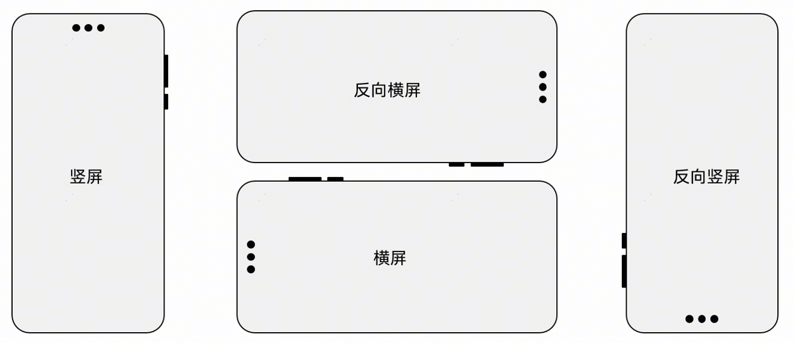
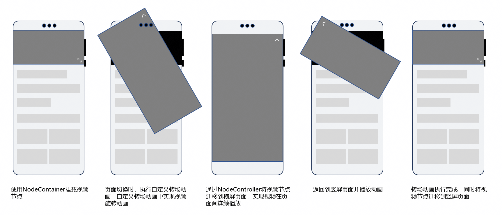
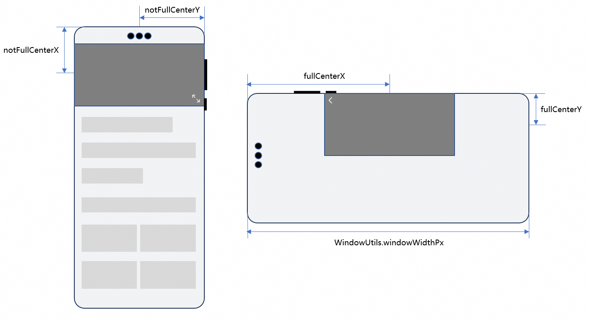
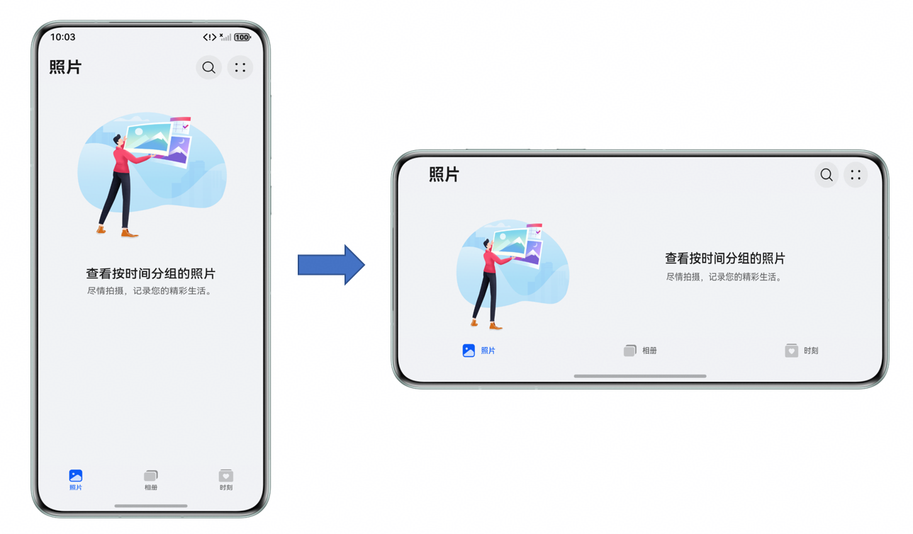
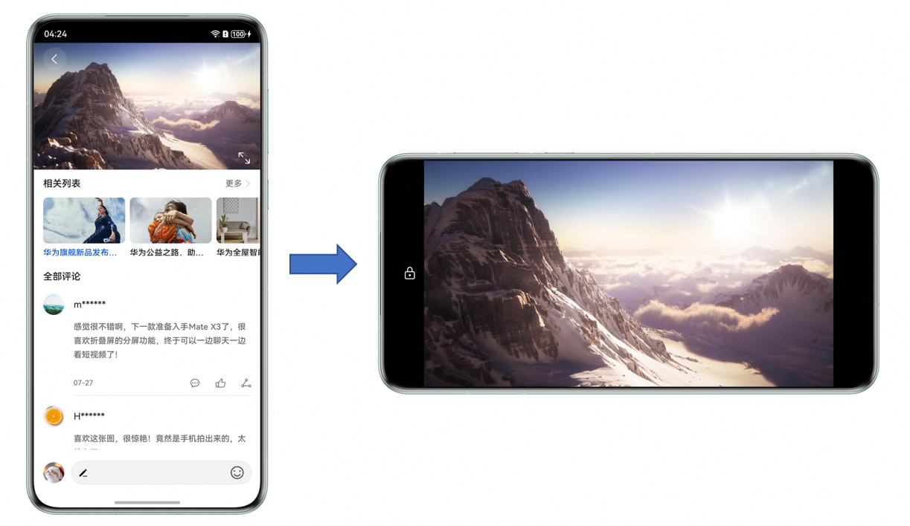
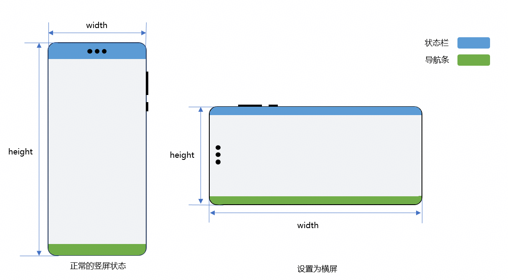
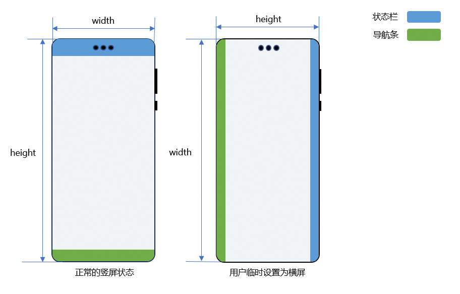
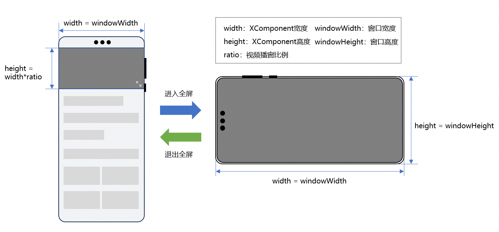

# 视频类应用横竖屏切换

更新时间：2026-05-18 00:55:31

来源：https://developer.huawei.com/consumer/cn/doc/best-practices/bpta-landscape-and-portrait-development

##### 概述

视频类应用横竖屏切换是指在视频类应用中，播放界面的详情页采用竖屏方式显示，用户可通过全屏按钮将页面切换至横屏方式显示，从而提供更佳的观看体验。
 
当前HarmonyOS应用开发主要通过以下两种方式实现视频横竖屏切换：
 
- 设置窗口的旋转策略，旋转整个窗口。
- 跳转到不同显示方向的页面，仅旋转子页面。

 
本文提供了上述两种方式的具体实现方案，开发者可根据应用自身体验的诉求进行选择，以实现视频横竖屏切换的效果。
 
- [通过窗口旋转实现横竖屏切换](#section208869314175)
- [通过页面跳转实现横竖屏切换](#section161651074615)

 
 

##### 窗口旋转说明

目前HarmonyOS系统中的窗口旋转形态有四种，对应真机实际状态如下：
 



 
开发者可通过以下两种方式设置窗口旋转策略：
 
- 通过module.json5文件中的“orientation”字段进行设置。
- 调用窗口管理的[setPreferredOrientation()](https://developer.huawei.com/consumer/cn/doc/harmonyos-references/arkts-apis-window-window#setpreferredorientation9)接口进行设置。

 
> [!NOTE]
> 上述两种方式设置窗口旋转策略的时机不同。 module.json5文件中的“orientation”字段在窗口启动时就会生效，通常用于应用启动时就需要设置横屏或者竖屏的场景。 setPreferredOrientation() 接口在调用时进行窗口方向的设置，通常用于在应用启动之后，还需要改变显示方向的场景。

 
 

##### 配置module.json5文件中的orientation字段

orientation字段用于配置应用启动时的窗口显示状态。如果应用启动时需要以默认的横屏或竖屏方式显示，建议在此字段进行相应配置。其支持的参数可参考module.json5配置项中[abilities标签](https://developer.huawei.com/consumer/cn/doc/harmonyos-guides/module-configuration-file#abilities标签)下的orientation字段说明。
 
```json
{
  "module": {
    // ...
    "abilities": [
      {
        "name": "EntryAbility",
        // ...
        // Set default window orientation
        "orientation": "portrait",
        // ...
      }
    ],
    // ...
    "requestPermissions": [
      {
        "name": "ohos.permission.ACCELEROMETER"
      }
    ]
  }
}
```
 
开发者可根据应用的默认旋转行为配置orientation字段：
 
- 如果应用是竖屏应用，建议配置portrait为默认旋转策略。
- 如果应用是横屏应用，如游戏类应用，启动时默认为横屏，存在以下两种情况：
仅支持横屏，建议配置landscape为默认旋转策略。
- 支持在横屏和反向横屏中切换，建议配置为auto_rotation_landscape。

 - 如果应用是可旋转应用，建议配置auto_rotation_restricted为默认旋转策略。
- 如果一个应用在直板机和折叠屏折叠态为竖屏应用，在平板和折叠屏展开态默认为可旋转应用，建议配置follow_desktop为默认旋转策略。

 


 

对于需要通过控制中心进行旋转锁定控制的场景，可选择带有“restricted”后缀的旋转策略。带有此后缀的字段表示旋转行为受控制中心的旋转锁定开关控制：当旋转锁定开关开启时，窗口不会随传感器旋转；关闭时，窗口将随传感器旋转。
 

 
以如下应用为例，关闭控制中心的旋转锁定开关后，应用页面会随手机旋转而切换；开启旋转锁定开关后，则不会发生切换。需将orientation字段配置为auto_rotation_restricted以实现此效果。
 



 
 

##### 调用窗口管理的setPreferredOrientation()接口

对于需要实现横竖屏切换的应用，可调用[setPreferredOrientation()](https://developer.huawei.com/consumer/cn/doc/harmonyos-references/arkts-apis-window-window#setpreferredorientation9)接口进行设置。典型场景包括视频类和图片类应用，视频类应用实现横竖屏切换的效果图如下：
 


 
此类应用启动时默认为竖屏，而在视频播放页面可横屏显示，开发者需确保应用支持用户临时更改窗口显示方向。使用[setPreferredOrientation()](https://developer.huawei.com/consumer/cn/doc/harmonyos-references/arkts-apis-window-window#setpreferredorientation9)接口修改窗口显示方向时，窗口将保持最后一次设置的方向。即使页面跳转，窗口显示方向也不会改变。
 
 

##### 通过窗口旋转实现横竖屏切换

为了实现应用的横竖屏功能，需从以下技术方面考虑：
 1. 设置窗口的旋转策略。
2. 监听屏幕的窗口变化。
3. 进行布局适配。
 
 

##### 设置窗口的旋转策略

首先需要设置应用启动时的旋转策略，具体可以参考[配置module.json5文件中的orientation字段](#section1188593118171)。以多设备开发为例，为满足直板机和平板设备的不同策略，可将orientation字段设置为follow_desktop。
 
在需要实现横竖屏切换的页面上，可调用窗口管理提供的[setPreferredOrientation()](https://developer.huawei.com/consumer/cn/doc/harmonyos-references/arkts-apis-window-window#setpreferredorientation9)接口，将窗口显示的方向修改为横屏或竖屏的状态。例如，视频播放页面既支持竖屏，也支持横屏，可调用此接口实现横竖屏切换。
 
在使用setPreferredOrientation()接口时，应根据应用自身的旋转策略选择相应的参数，可封装如下方法以设置旋转策略。具体步骤如下：
 1. 通过this.getUIContext().[getHostContext()](https://developer.huawei.com/consumer/cn/doc/harmonyos-references/arkts-apis-uicontext-uicontext#gethostcontext12)接口获取对应的UIAbilityContext，并通过context获取对应的windowStage实例。
2. 通过windowStage.[getMainWindowSync()](https://developer.huawei.com/consumer/cn/doc/harmonyos-references/arkts-apis-window-windowstage#getmainwindowsync9)同步接口获取对应的窗口实例windowClass，再调用[setPreferredOrientation()](https://developer.huawei.com/consumer/cn/doc/harmonyos-references/arkts-apis-window-window#setpreferredorientation9)接口设置窗口方向。
 
```ArkTS
@Component
export struct VideoPlayView {
  // ...
  private windowClass: window.Window | undefined;
  private context = this.getUIContext().getHostContext() as common.UIAbilityContext;
  // ...
  aboutToAppear(): void {
    // ...
      this.windowClass = this.context.windowStage.getMainWindowSync();  // Obtains the window instance
    // ...
  }
  // ...

  // Set window orientation.
  setOrientation(orientation: window.Orientation) {
    // Encapsulates the setPreferredOrientation interface
    this.windowClass?.setPreferredOrientation(orientation).then(() => {
      Logger.info(`setWindowOrientation ${orientation} Succeeded`);
    }).catch((err: BusinessError) => {
      let error = err as BusinessError;
      Logger.error(TAG, `setWindowOrientation ${orientation} err, code: ${error.code}, message: ${error.message}`);
    })
  }
  // ...
}
```
 
以视频播放为例，不仅需要通过设备旋转方向控制横竖屏，还需在旋转锁定开关开启时，支持用户手动设置横屏状态。若开发者需实现以上效果，应满足以下条件：
 1. 应用跟随传感器旋转。
2. 应用受到控制中心的旋转锁定开关控制。
3. 应用支持用户临时设置窗口方向，例如：点击全屏按钮进行切换。
 
如果应用满足上述条件，可使用窗口管理的[setPreferredOrientation()](https://developer.huawei.com/consumer/cn/doc/harmonyos-references/arkts-apis-window-window#setpreferredorientation9)接口设置orientation的枚举类型，以实现相应的旋转。当用户手动点击全屏按钮时，需触发横竖屏切换。如果此时关闭旋转锁定开关，窗口将随传感器旋转。因此，可使用以下枚举中的能力，临时旋转窗口，并使其后续跟随传感器自动旋转。
  
| orientation枚举值 | 枚举数值 | 效果描述 |
| --- | --- | --- |
| USER_ROTATION_PORTRAIT | 13 | 调用时临时旋转到竖屏，之后跟随传感器自动旋转，受控制中心的旋转开关控制，且可旋转方向受系统判定。 |
| USER_ROTATION_LANDSCAPE | 14 | 调用时临时旋转到横屏，之后跟随传感器自动旋转，受控制中心的旋转开关控制，且可旋转方向受系统判定。 |
 
 
一般情况下，视频播放应用的窗口不会旋转至反向竖屏（由UX需求决定），仅支持旋转至竖屏、横屏和反向横屏。点击全屏按钮时，窗口默认旋转至横屏状态，并支持跟随传感器旋转至反向横屏。竖屏状态和横屏状态的窗口示意图如下：
 


 
当用户点击进入或退出全屏时，应分别触发对应的逻辑处理，所需使用的方向状态如下：
 
设置为横屏时，对应窗口显示方向设置为USER_ROTATION_LANDSCAPE模式，将窗口临时旋转到横屏。例如进入播放页时，进行竖屏 -> 横屏切换。
 
```ArkTS
SymbolGlyph($r('sys.symbol.arrow_up_left_and_arrow_down_right'))
// ...
  .onClick(() => {
    if (WindowUtils.isExpandedOrHalfFolded()) {
      // When the device is folded or half-folded,
      // the playback mode is set to landscape mode, and the window rotation is set to auto-rotate.
      this.isLandscape = true;
      this.setOrientation(window.Orientation.AUTO_ROTATION);
    } else {
      // In a non-expanded state, such as when folded, set the window orientation to landscape.
      this.setOrientation(window.Orientation.USER_ROTATION_LANDSCAPE);
    }
  })
```
 
设置为竖屏时，对应窗口显示方向设置为USER_ROTATION_PORTRAIT模式，将窗口临时旋转到竖屏。例如在返回竖屏状态时，进行横屏 -> 竖屏切换。
 
```ArkTS
Button({ type: ButtonType.Circle }) {
  SymbolGlyph($r('sys.symbol.chevron_backward'))
    .fontColor([$r('sys.color.icon_on_primary')])
    .fontSize($r('sys.float.Title_M'))
}
// ...
.onClick(() => {
  // Exit the current page if not in landscape mode
  if (!this.isLandscape) {
    this.navStack?.pop();
    return;
  }
  // ...
    // Set the window orientation to portrait
    this.setOrientation(window.Orientation.USER_ROTATION_PORTRAIT);
    // ...
})
```
 


 

调用[setPreferredOrientation()](https://developer.huawei.com/consumer/cn/doc/harmonyos-references/arkts-apis-window-window#setpreferredorientation9)接口会改变窗口的显示方向。因此，如果在进入视频播放页时手动调用此接口，将窗口旋转至横屏，那么在退出页面时也应调用此接口，将窗口恢复为竖屏。
 

 
 

##### 监听窗口变化

当传感器变化或用户手动设置窗口方向时，窗口显示和尺寸将发生变化。此时，应使用窗口尺寸对布局进行适配。
 
在需要进行横竖屏切换的页面，通过window.[on('windowSizeChange')](https://developer.huawei.com/consumer/cn/doc/harmonyos-references/arkts-apis-window-window#onwindowsizechange7)接口监听窗口尺寸的变化。建议在aboutToAppear()函数中执行，具体措施如下：
 
```ArkTS
// Listen for window size changes.
this.windowClass.on('windowSizeChange', (size) => {
  // ...
})
```
 
 
并在aboutToDisappear()函数中取消监听：
 
```ArkTS
aboutToAppear(): void {
  // Remove window size listener
  WindowUtils.windowClass.off('windowSizeChange');
}
```
 
需要注意的是，当应用不随传感器旋转时，如果用户手动触发setOrientation()方法将窗口设置为横屏状态，即使当前手机处于垂直方向，窗口仍会保持横屏状态。此时，窗口的宽度为竖屏状态下的高度，高度则为竖屏状态下的宽度。如下图所示：
 



 
进入视频详情页面时，需监听窗口尺寸的变化，并依据状态变化调整XComponent的宽高。
 
```ArkTS
// Listen for window size changes.
this.windowClass.on('windowSizeChange', (size) => {
  // Detect screen orientation in the window resize listener
  this.windowHeight = this.getUIContext().px2vp(size.height);
  this.windowWidth = this.getUIContext().px2vp(size.width);
  this.setXComponentSize();
  // ...
})
```
 

##### 进行布局适配

对于视频播放类应用，仅播放窗口需支持横竖屏切换。因此，只需对视频播放组件进行横屏及全屏处理。开发者可利用UI状态更新的特点，使播放窗口切换为全屏。
 
将播放窗口的尺寸定义为@State状态，并设置到[XComponent](https://developer.huawei.com/consumer/cn/doc/harmonyos-references/ts-basic-components-xcomponent)组件上。
 
```ArkTS
@State xComponentWidth: number = 0;
@State xComponentHeight: number = 0;
```
 
将状态变量与视频播放组件绑定。
 
```ArkTS
XComponent({ id: 'video_player_id', type: XComponentType.SURFACE, controller: this.xComponentController })
  .onLoad(() => {
    // ...
  })
  // Bind the width and height state variables to the XComponent.
  .width(this.xComponentWidth)
  .height(this.xComponentHeight)
```
 
在监听窗口变化的回调中，动态调整XComponentWidth和XComponentHeight，以适配横屏和竖屏视频播放组件的布局。横屏时，视频播放组件的宽高应与窗口的宽高一致，并进入全屏状态。竖屏时，视频播放组件的宽度与窗口宽度相等，高度则按视频播窗比例乘以窗口宽度，并退出全屏状态。旋转过程宽高属性如下图所示：
 



 
在监听窗口变化时，可调用[display.getDefaultDisplaySync()](https://developer.huawei.com/consumer/cn/doc/harmonyos-references/js-apis-display#displaygetdefaultdisplaysync9)接口获取屏幕的display对象，依据display对象的Orientation属性决定实际的横竖屏状态。然后根据横竖屏状态和折叠屏的折叠状态设置旋转策略，具体实现如下：
 


 

需要注意的是，对于视频全屏效果，建议采用沉浸式开发。沉浸式效果的实现，可参考[开发应用沉浸式效果](https://developer.huawei.com/consumer/cn/doc/harmonyos-guides/arkts-develop-apply-immersive-effects)。
 

 
```ArkTS
// Listen for window size changes.
this.windowClass.on('windowSizeChange', (size) => {
  // Detect screen orientation in the window resize listener
  this.windowHeight = this.getUIContext().px2vp(size.height);
  this.windowWidth = this.getUIContext().px2vp(size.width);
  this.setXComponentSize();
  let displayClass: display.Display = display.getDefaultDisplaySync();
  let orientation: display.Orientation = displayClass.orientation;

  if (orientation === display.Orientation.LANDSCAPE || orientation === display.Orientation.LANDSCAPE_INVERTED) {
    // Set full-screen playback to true in landscape mode
    this.isLandscape = true;
  } else {
    if (!WindowUtils.isExpandedOrHalfFolded() && !this.isVideoLock) {
      // When not expanded and unlocked, set the fullscreen playback flag to false
      this.isLandscape = false;
      this.setOrientation(window.Orientation.USER_ROTATION_PORTRAIT);
    }
  }
  // Folded mode landscape playback, set to auto-rotate with the sensor
  if (this.isLandscape && WindowUtils.isFolded() && this.isVideoLock) {
    this.setOrientation(window.Orientation.AUTO_ROTATION_LANDSCAPE);
  }
  // Play in full-screen mode and set to rotate automatically according to the sensor
  if (this.isLandscape && WindowUtils.isExpandedOrHalfFolded()) {
    this.setOrientation(window.Orientation.AUTO_ROTATION);
  }
})
```
 
 

##### 锁定屏幕功能

某些视频应用支持锁定屏幕功能，在全屏状态下，可隐藏功能按钮并临时锁定屏幕旋转，以防止用户误触其他操作按钮。屏幕锁定后，应用可在横屏和反向横屏间切换，但不能从横屏切换至竖屏；解锁后，如果当前屏幕为竖屏，则应恢复为竖屏显示。全屏状态下锁定屏幕功能如下图所示：
 



 
开发者应考虑以下三种情况以实现上述功能：
 1. 判断当前旋转锁定开关的状态，若已开启，则无需进行额外处理。
2. 点击锁定屏幕按钮时，设置旋转策略为AUTO_ROTATION_LANDSCAPE，即支持在横屏和反向横屏间切换，不受旋转锁定开关控制。
3. 点击解锁按钮时，需支持在横屏、竖屏和反向横屏间切换，并受旋转锁定开关控制。
 
可依据上述推断功能实现如下代码：
 
```ArkTS
Image(this.isVideoLock ? $r('app.media.icon_lock') : $r('app.media.icon_lock_open'))
// ...
  .onClick(() => {
    // Set video lock status
    this.isVideoLock = !this.isVideoLock;
    // ...
    if (this.isVideoLock) {
      // If landscape mode is locked, then set to AUTO_ROTATION_LANDSCAPE.
      this.setOrientation(window.Orientation.AUTO_ROTATION_LANDSCAPE);
    } else {
      // Otherwise, set the window orientation to auto-rotate.
      this.setOrientation(window.Orientation.AUTO_ROTATION);
    }
  })
```
 
若开发者需对折叠屏的旋转逻辑进行单独处理，可封装如下方法isExpandedOrHalfFolded()，以判断当前设备是否为折叠屏展开态。当设备处于折叠屏展开态时，不触发旋转逻辑。
 
```ArkTS
static isExpandedOrHalfFolded(): boolean {
  let isExpandedOrHalfFolded: boolean = false;
  try {
    isExpandedOrHalfFolded = display.getFoldStatus() === display.FoldStatus.FOLD_STATUS_EXPANDED ||
      display.getFoldStatus() === display.FoldStatus.FOLD_STATUS_HALF_FOLDED
  } catch (err) {
    let error = err as BusinessError;
    Logger.error(TAG, `isExpandedOrHalfFolded err, error code: ${error.code}, error message: ${error.message}`);
  }
  return isExpandedOrHalfFolded;
}
```
 
 
当开发者需监听设备控制中心的状态时，可使用[setting.registerKeyObserver()](https://developer.huawei.com/consumer/cn/doc/harmonyos-references/js-apis-settings#settingsregisterkeyobserver11)接口。其中，[general](https://developer.huawei.com/consumer/cn/doc/harmonyos-references/js-apis-settings#general).ACCELEROMETER_ROTATION_STATUS表示是否启用自动旋转。当返回值为“0”时，即代表旋转锁定开关开启，此时在处理锁定功能的代码中无需执行旋转逻辑。可参考以下代码实现对设备控制中心状态的监听：
 
```ArkTS
// Monitor the status of the rotation lock switch in the status bar
settings.registerKeyObserver(this.context, settings.general.ACCELEROMETER_ROTATION_STATUS,
  settings.domainName.DEVICE_SHARED, () => {
    this.orientationLockState =
      settings.getValueSync(this.context, settings.general.ACCELEROMETER_ROTATION_STATUS,
        settings.domainName.DEVICE_SHARED);
  })
```
 
当控制中心的旋转锁定开关关闭时，可通过应用内的锁定按钮进行逻辑判断。在锁定状态下，调用setOrientation()方法将显示方向设置为AUTO_ROTATION_LANDSCAPE模式，此时可旋转至横屏和反向横屏；解锁后，将显示方向设置为AUTO_ROTATION_UNSPECIFIED模式，此时可旋转至横屏、竖屏、反向横屏三个方向。
 
```ArkTS
if (this.isVideoLock) {
  // If landscape mode is locked, then set to AUTO_ROTATION_LANDSCAPE.
  this.setOrientation(window.Orientation.AUTO_ROTATION_LANDSCAPE);
} else {
  // Otherwise, set the window orientation to auto-rotate.
  this.setOrientation(window.Orientation.AUTO_ROTATION);
}
```
 

##### 通过页面跳转实现横竖屏切换

开发者可分别创建竖屏页面和横屏页面，并通过页面级分层旋转的方式实现横竖屏切换。
 
 

##### 分层旋转的实现原理

在视频类应用中，屏幕最终显示的画面可分为视频图层（视频播放组件）、UI图层（UI组件）和系统图层（状态栏、导航栏）。页面级分层旋转是指通过页面跳转实现横竖屏切换，页面切换时仅旋转视频图层。实现原理如下图所示：
 



 1. 通过NavDestination的[preferredOrientation](https://developer.huawei.com/consumer/cn/doc/harmonyos-references/ts-basic-components-navdestination#preferredorientation19)属性设置页面的显示方向，并使用[NavPathStack](https://developer.huawei.com/consumer/cn/doc/harmonyos-references/ts-basic-components-navigation#navpathstack10)实现页面切换。
2. 使用[自定义声明式节点 (BuilderNode)](https://developer.huawei.com/consumer/cn/doc/harmonyos-guides/arkts-user-defined-arktsnode-buildernode)挂载视频播放组件，并通过[NodeController](https://developer.huawei.com/consumer/cn/doc/harmonyos-references/js-apis-arkui-nodecontroller)实现视频节点在页面之间迁移，可参考[实现视频播放节点的迁移](#section015175011467)。
3. 通过Navigation的自定义转场动画回调（[customNavContentTransition](https://developer.huawei.com/consumer/cn/doc/harmonyos-references/ts-basic-components-navigation#customnavcontenttransition11)）配置自定义导航动画，可参考[自定义页面转场动画](#section029702318474)。
4. 封装一镜到底转场动画实现视频旋转效果。页面切换时，在页面的转场动画回调中执行视频旋转动画，可参考[实现视频旋转动画](#section111189303292)。
 
本示例通过[共享元素转场（一镜到底）](https://developer.huawei.com/consumer/cn/doc/harmonyos-guides/arkts-shared-element-transition)实现页面转场动画。开发者也可以根据实际场景选择适合的[转场动画](https://developer.huawei.com/consumer/cn/doc/harmonyos-guides/arkts-animation-transition)。
 
 

##### 实现视频播放节点的迁移

> [!NOTE]
> BuildNode 提供了组件预构建的能力，对于初始化耗时较长的声明式组件（如XComponent），可以有效减少初始化时间，提高组件加载效率。因此，推荐使用BuildNode挂载视频播放组件。

 
为了实现视频在不同页面连续播放，可使用NodeContainer挂载视频播放节点，并通过NodeController移除原页面的视频节点，迁移到新页面。具体实现可分为以下四步：
 1. 使用[XComponent](https://developer.huawei.com/consumer/cn/doc/harmonyos-references/ts-basic-components-xcomponent)组件创建视频播放组件。步骤如下：
- 创建[XComponent](https://developer.huawei.com/consumer/cn/doc/harmonyos-references/ts-basic-components-xcomponent)组件和[XComponentController](https://developer.huawei.com/consumer/cn/doc/harmonyos-references/ts-basic-components-xcomponent#xcomponentcontroller)控制器对象，并将控制器对象绑定至XComponent组件。

2. 在XComponent的[onLoad()](https://developer.huawei.com/consumer/cn/doc/harmonyos-references/ts-basic-components-xcomponent#onload)事件中初始化[AVPlayer](https://developer.huawei.com/consumer/cn/doc/harmonyos-references/arkts-apis-media-avplayer)，并传入XComponent对应Surface的ID，实现视频的播放，可参考[在ArkTS侧使用SurfaceId进行渲染绘制](https://developer.huawei.com/consumer/cn/doc/harmonyos-guides/napi-xcomponent-guidelines#在arkts侧使用surfaceid进行渲染绘制)。

3. 通过[全局自定义构建函数](https://developer.huawei.com/consumer/cn/doc/harmonyos-guides/arkts-builder#全局自定义构建函数)封装Video自定义组件，创建videoBuilder构建函数。

  
```ArkTS
@Component
struct VideoNode {
  @State videoRatio: number = 16 / 9;
  // Create XComponentController object.
  private xComponentController: XComponentController = new XComponentController();
  private player?: AVPlayerUtil;
  private context = this.getUIContext().getHostContext() as common.UIAbilityContext;
  // ...
  build() {
    XComponent({ id: 'video_player_id1', type: XComponentType.SURFACE, controller: this.xComponentController })
      .aspectRatio(this.videoRatio)
      .onLoad(() => {
        try {
          this.player = new AVPlayerUtil(this.context);
          // Bind XComponent to AVPlayer using ID.
          this.player.setSurfaceId(this.xComponentController.getXComponentSurfaceId());
          // Creating an AVPlayer to play video.
          this.player.initPlayer('videoTest.mp4', (ratio: number) => {
            // Set the video width/height ratio to the global state
            AppStorage.setOrCreate('videoRatio', ratio);
          })
        } catch (err) {
          let error = err as BusinessError;
          Logger.error(TAG, `initPlayer err, error code: ${error.code}, error message: ${error.message}`);
        }
      })
  }
}
// Build a global video playback component.
@Builder
export function videoBuilder() {
  VideoNode()
    .id('myVideoComponent')
}
```

- 将视频播放组件挂载至BuildNode，并通过[NodeController](https://developer.huawei.com/consumer/cn/doc/harmonyos-references/js-apis-arkui-nodecontroller)管理自定义节点。步骤如下：1. 使用[wrapBuilder](https://developer.huawei.com/consumer/cn/doc/harmonyos-references/ts-universal-wrapbuilder)封装videoBuilder构建函数。

2. 通过调用[BuildNode](https://developer.huawei.com/consumer/cn/doc/harmonyos-references/js-apis-arkui-buildernode)节点的[build()](https://developer.huawei.com/consumer/cn/doc/harmonyos-references/js-apis-arkui-buildernode#build12)接口创建组件树。

3. 在[NodeController](https://developer.huawei.com/consumer/cn/doc/harmonyos-references/js-apis-arkui-nodecontroller)的[makeNode()](https://developer.huawei.com/consumer/cn/doc/harmonyos-references/js-apis-arkui-nodecontroller#makenode)回调方法中返回组件树的实体节点（[FrameNode](https://developer.huawei.com/consumer/cn/doc/harmonyos-references/js-apis-arkui-framenode)）。当NodeController绑定的[NodeContainer](https://developer.huawei.com/consumer/cn/doc/harmonyos-references/ts-basic-components-nodecontainer)组件创建时，自动将返回的节点挂载至NodeContainer组件。

  
```ArkTS
export class VideoNodeController extends NodeController {
  private static instance: VideoNodeController;
  private rootNode: BuilderNode<[]> | null = null;
  // Use wrapBuilder to encapsulate the global @Builder
  private wrapBuilder: WrappedBuilder<[]> = wrapBuilder(videoBuilder);
  private isRemove: boolean = false;
  // ...
  // Callback when the NodeContainer bound to the instance is created.
  makeNode(uiContext: UIContext): FrameNode | null {
    Logger.info(TAG, `makeNode`)
    // Wether to remove the node.
    if (this.isRemove) {
      return null;
    }
    if (this.rootNode === null) {
      this.rootNode = new BuilderNode(uiContext);
      // Create a component tree based on the passed wrapBuilder.
      this.rootNode.build(this.wrapBuilder);
    }
    // Returning the entity node of the component tree.
    return this.rootNode.getFrameNode();
  }
  // ...
}
```

- 在竖屏页面中，将NodeController与NodeContainer绑定。
```ArkTS
@Component
export struct DetailPlay {
  // ...
  @State nodeController: VideoNodeController = VideoNodeController.getInstance();
  // ...
  build() {
    NavDestination() {
      Column() {
        RelativeContainer() {
          // Bind the NodeController to the NodeContainer
          NodeContainer(this.nodeController)
          // ...
        }
        // ...
    }
    // Set the page display orientation portrait.
    .preferredOrientation(window.Orientation.PORTRAIT)
    // ...
  }
}
```
 在横屏页面中，将NodeController与NodeContainer绑定。

  
```ArkTS
@Component
export struct MyPageLandscape {
  // ...
  // Obtaining the VideoNodeController instance
  @State nodeController: VideoNodeController = VideoNodeController.getInstance();
  // Page display orientation, default is landscape.
  @State displayOrientation: window.Orientation = window.Orientation.LANDSCAPE;
  // ...
  build() {
    NavDestination() {
      Stack() {
        // Bind the NodeController to the NodeContainer
        NodeContainer(this.nodeController)
        // ...
      }
      // ...
    }
    // Set the page display orientation.
    .preferredOrientation(this.displayOrientation)
    // ...
    })
  }
}
```

- 页面切换完成时，调用NodeController的自定义方法onRemove()移除原页面的视频节点。
```ArkTS
// This method is called when the page transition animation is completed.
private doFinishTransition(): void {
  // ...
  // Remove the video node from the original page.
  this.nodeController.onRemove();
}
```
 在自定义方法onRemove()中，将isRemove标志位设置为true，表示移除节点，然后调用[rebuild()](https://developer.huawei.com/consumer/cn/doc/harmonyos-references/js-apis-arkui-nodecontroller#rebuild)接口通知NodeContainer组件，将null挂载至[NodeContainer](https://developer.huawei.com/consumer/cn/doc/harmonyos-references/ts-basic-components-nodecontainer)，实现节点移除。操作完成后，重置isRemove标志位，保证新页面的节点正常生成。

  
```ArkTS
onRemove(): void {
  Logger.info(TAG, 'onRemove')
  this.isRemove = true;
  // Trigger rebuild when the component is moved out of the node
  this.rebuild();
  this.isRemove = false;
}
```


 
 

##### 自定义页面转场动画
1. 创建Navigation自定义转场动画配置类CustomTransition，用于注册、获取和删除页面的动画回调，包含以下方法：
- getInstance()：获取转场动画配置类的实例，使用静态方法在页面间共享。
```ArkTS
static delegate = new CustomTransition();
// Return the CustomTransition instance.
static getInstance() {
  return CustomTransition.delegate;
}
```


2. registerNavParam()：当页面加载完成时，注册当前页面的动画回调。
```ArkTS
// Register the transition animation callback of the current page.
registerNavParam(name: string,
  animationCallback: (operation: boolean, isExit: boolean, transitionProxy: NavigationTransitionProxy) => void,
  timeout: number): void {
  // Overwrite if already exists.
  if (customTransitionMap.has(name)) {
    let param = customTransitionMap.get(name);
    if (param !== undefined) {
      param.animation = animationCallback;
      param.timeout = timeout;
      return;
    }
  }
  // Creating a Transition Animation callback when it dose not exist.
  let params: AnimateCallback = { timeout: timeout, animation: animationCallback };
  customTransitionMap.set(name, params);
}
```


3. unRegisterNavParam()：当页面卸载完成时，删除当前页面的动画回调。
```ArkTS
// Unregister the transition animation callback of the current page.
unRegisterNavParam(name: string): void {
  customTransitionMap.delete(name);
}
```


4. getAnimateParam()：在自定义转场动画回调方法中，通过此方法获取原页面和新页面的动画回调。
```ArkTS
// Obtain the transition animation callback.
getAnimateParam(name: string): AnimateCallback {
  let result: AnimateCallback = {
    animation: customTransitionMap.get(name)?.animation,
    timeout: customTransitionMap.get(name)?.timeout,
  };
  return result;
}
```


5. 在Navigation（导航页面）的[customNavContentTransition()](https://developer.huawei.com/consumer/cn/doc/harmonyos-references/ts-basic-components-navigation#customnavcontenttransition11)事件中实现自定义转场动画回调方法，自定义竖屏页面与横屏页面的导航转场动画。具体步骤如下：
检查原页面与新页面是否存在，其中一个不存在则返回undefined。返回值为undefined表示执行默认动画。
```ArkTS
// If the parameters related to jumping are not defined, no custom animation will be performed.
if (!from || !to || !from.name || !to.name || !from.navDestinationId || !to.navDestinationId) {
  return undefined;
}

// If it is the homepage, no custom animation will be performed.
if (from.index === -1 || to.index === -1) {
  return undefined;
}

// Control custom transition routes using the names of from and to.
if (!isCustomTransitionEnable(from.name, to.name)) {
  return undefined;
}
```


6. 通过[创建Navigation自定义转场动画配置类](#li49791041461)实现的getAnimateParam()方法获取原页面与新页面的动画回调方法。
```ArkTS
// It is necessary to check whether the transition page has registered an animation
// in order to decide whether to perform a custom transition.
let fromParam: AnimateCallback = CustomTransition.getInstance().getAnimateParam(from.navDestinationId);
let toParam: AnimateCallback = CustomTransition.getInstance().getAnimateParam(to.navDestinationId);
if (!fromParam.animation || !toParam.animation) {
  return undefined;
}
```


7. 创建自定义转场动画协议对象（[NavigationAnimatedTransition](https://developer.huawei.com/consumer/cn/doc/harmonyos-references/ts-basic-components-navigation#navigationanimatedtransition11)），定义Navigation路由跳转时的转场动画。
```ArkTS
// After all judgments are made, construct customAnimation for the system to call
  // and execute the custom transition animation.
  let customAnimation: NavigationAnimatedTransition = {
    // Transition Completed Callback
    onTransitionEnd: (isSuccess: boolean) => {
      Logger.info(`onTransitionEnd success: ${isSuccess}`)
    },
    // Animation timeout end time
    timeout: 1000,
    // Custom transition animation execution callback.
    // transitionProxy: Custom transition animation delegate object
    transition: (transitionProxy: NavigationTransitionProxy) => {
      Logger.info('customAnimation transition');
      // Run the current page animation
      if (fromParam.animation) {
        fromParam.animation(operation === NavigationOperation.PUSH, true, transitionProxy)
      }

      // Execute jump-to-target page animation
      if (toParam.animation) {
        toParam.animation(operation === NavigationOperation.PUSH, false, transitionProxy)
      }
    }
  }
  return customAnimation;
}
```


8. 在Navigation（导航页面）的[customNavContentTransition()](https://developer.huawei.com/consumer/cn/doc/harmonyos-references/ts-basic-components-navigation#customnavcontenttransition11)事件中，传入自定义转场动画回调方法。
```ArkTS
build() {
  Navigation(this.pageStack) {
    // ...
  }
  // ...
  // Bind custom transition animation.
  .customNavContentTransition(this.customTransition)
}
```
 
> [!NOTE]
> 当竖屏页面切换至横屏页面时，执行新页面的toParam.animation()动画；当横屏页面切换回竖屏页面时，执行原页面的fromParam.animation()动画。因此，只需实现横屏页面的自定义转场动画。

- 在NavDestination的[onReady()](https://developer.huawei.com/consumer/cn/doc/harmonyos-references/ts-basic-components-navdestination#onready11)事件中获取[NavPathStack](https://developer.huawei.com/consumer/cn/doc/harmonyos-references/ts-basic-components-navigation#navpathstack10)对象，并在横屏页面的onReady()事件中注册当前页面的动画回调。
```ArkTS
build() {
  // ...
  .onReady((ctx: NavDestinationContext) => {
    if (ctx.navDestinationId) {
      this.pageId = ctx.navDestinationId;
      this.stack = ctx.pathStack;
      let param = ctx.pathInfo.param as Record<string, object>
      this.nodeRectInfo = param.nodeRectInfo as RectInfoInPx;
      this.prePageDoFinishTransition = param.DoDefaultTransition as () => void;
      // Register the animation callback of the current page.
      CustomTransition.getInstance().registerNavParam(this.pageId,
        (isPush: boolean, isExit: boolean, transitionProxy: NavigationTransitionProxy) => {
          if (WindowUtils.isExpandedOrHalfFolded()) {
            // Play animation, foldable screen in unfolded state
            this.animationProperties.doAnimationFoldable(this.nodeRectInfo, isPush, isExit, transitionProxy,
              this.prePageDoFinishTransition);
          } else {
            // Perform animation, non-foldable screen expanded state
            this.animationProperties.doAnimation(this.nodeRectInfo, isPush, isExit, transitionProxy,
              this.prePageDoFinishTransition);
          }
        }, 2000);
    }
  })
}
```


 
 

##### 实现视频旋转动画
1. 使用[animateTo()](https://developer.huawei.com/consumer/cn/doc/harmonyos-references/arkts-apis-uicontext-uicontext#animateto)接口实现旋转动画，通过设置横屏页面的[width](https://developer.huawei.com/consumer/cn/doc/harmonyos-references/ts-universal-attributes-size#width)、[height](https://developer.huawei.com/consumer/cn/doc/harmonyos-references/ts-universal-attributes-size#height)、[translate](https://developer.huawei.com/consumer/cn/doc/harmonyos-references/ts-universal-attributes-transformation#translate18)和[rotate](https://developer.huawei.com/consumer/cn/doc/harmonyos-references/ts-universal-attributes-transformation#rotate18)属性来完成，可参考[使用animateTo产生属性动画](https://developer.huawei.com/consumer/cn/doc/harmonyos-guides/arkts-attribute-animation-apis#使用animateto产生属性动画)。关键信息介绍如下：
- nodeInfoPx为竖屏页面传入的视频节点尺寸信息，包括距离屏幕四周的距离和视频节点的宽高。

2. WindowUtils根据当前页面显示方向获取窗口大小。横屏页面切换至竖屏页面时，获取的是横屏页面的窗口大小，此时，WindowUtils.windowWidthPx获取的值与竖屏页面的窗口高度相等。

3. X值为直板机竖屏时视频节点中心点距离屏幕顶部的距离，Y值为直板机竖屏时视频节点中心点距离屏幕右侧的距离。根据竖屏页面视频中心点与横屏页面视频中心点坐标的差值，得出视频节点在X轴与Y轴的偏移值。如下图所示：


4. 在页面的转场动画回调方法中执行视频旋转动画。当设备状态为完全展开或半折叠时，执行doAnimationFoldable()动画，否则，执行doAnimation()动画。
```ArkTS
// Register the animation callback of the current page.
CustomTransition.getInstance().registerNavParam(this.pageId,
  (isPush: boolean, isExit: boolean, transitionProxy: NavigationTransitionProxy) => {
    if (WindowUtils.isExpandedOrHalfFolded()) {
      // Play animation, foldable screen in unfolded state
      this.animationProperties.doAnimationFoldable(this.nodeRectInfo, isPush, isExit, transitionProxy,
        this.prePageDoFinishTransition);
    } else {
      // Perform animation, non-foldable screen expanded state
      this.animationProperties.doAnimation(this.nodeRectInfo, isPush, isExit, transitionProxy,
        this.prePageDoFinishTransition);
    }
  }, 2000);
```
 直板机实现效果：

  


5. 使用[window.getLastWindow()](https://developer.huawei.com/consumer/cn/doc/harmonyos-references/arkts-apis-window-f#windowgetlastwindow9)接口获取应用内层级最高的窗口对象，通过[on('windowSizeChange')](https://developer.huawei.com/consumer/cn/doc/harmonyos-references/arkts-apis-window-window#onwindowsizechange7)接口开启窗口尺寸变化的监听。当折叠屏的折叠状态切换时，视频节点宽高同步调整。
```ArkTS
window.getLastWindow(this.getUIContext().getHostContext()).then((windowClass) => {
  WindowUtils.windowWidthPx = windowClass.getWindowProperties().windowRect.width;
  WindowUtils.windowHeightPx = windowClass.getWindowProperties().windowRect.height;
  this.defaultVideoWidth = this.getUIContext().px2vp(WindowUtils.windowWidthPx);
  this.defaultVideoHeight = this.getUIContext().px2vp(WindowUtils.windowWidthPx / this.videoRatio);
  windowClass.on('windowSizeChange', (data) => {
    // ...
    // Updating the window size during the orientation switching between landscape and portrait modes.
    WindowUtils.windowWidthPx = data.width;
    WindowUtils.windowHeightPx = data.height;
    // Only dynamically change the size of the video component container
    // when the page is displayed, such as when collapsing or expanding.
    if (this.isDetailShow) {
      this.defaultVideoWidth = this.getUIContext().px2vp(data.width);
      this.defaultVideoHeight = this.getUIContext().px2vp(data.width / this.videoRatio);
    }
    // Foldable screen expanded state settings page video width and height
    if (WindowUtils.isExpandedOrHalfFolded() && !this.isDetailShow) {
      this.defaultVideoWidth = this.getUIContext().px2vp(data.width);
      this.defaultVideoHeight = this.getUIContext().px2vp(data.width / this.videoRatio);
      AppStorage.setOrCreate('defaultVideoHeight', this.defaultVideoHeight);
    }
  });
```


6. 在横屏页面折叠屏的折叠状态切换时，使用[display.on('foldStatusChange')](https://developer.huawei.com/consumer/cn/doc/harmonyos-references/js-apis-display#displayonfoldstatuschange10)接口监听并适配UI界面。
当折叠屏由展开态切换为折叠态时，调用[pop()](https://developer.huawei.com/consumer/cn/doc/harmonyos-references/ts-basic-components-navigation#pop11)接口返回到竖屏页面，并调用竖屏页面传入的prePageDoFinishTransition()方法移除横屏页面的视频节点。开发者可根据实际业务场景返回到竖屏页面或者将显示方向设置为横屏显示。

7. 当折叠屏由折叠态切换为展开态时，仍使用竖屏的方式播放视频，因此将显示方向设置为PORTRAIT。

  

  ##### 性能优化

  在窗口旋转时，屏幕尺寸变化会导致界面重新布局。为提高横竖屏切换的流畅度，建议开发者进行性能优化。

  **使用自定义组件冻结****功能**

  横竖屏切换时，整个窗口一同旋转会导致页面重新布局。然而，实际上需要展示的可能只有播放内容，对于其他组件，可使用自定义组件冻结功能，避免因旋转引发的UI更新操作。例如，视频播放下方的详情内容，可能是单独的组件，无需与视频组件一同旋转。

  
```ArkTS
@Component({ freezeWhenInactive: true })
  // Added custom component freezing function
struct VideoDetailView {
  build() {
    Scroll() {
      // ...
    }
  }
}
```
 **对图片使用autoResize**

  如果当前旋转页面包含图片，未经适当裁剪，图片过大，可以对图片设置[autoResize](https://developer.huawei.com/consumer/cn/doc/harmonyos-references/ts-basic-components-image#autoresize)属性，使图片裁剪到合适的大小进行绘制。该属性的作用是将组件显示区域作为绘制的图源尺寸，以减少内存占用。例如，原图尺寸为1920*1080px，而显示区域为200*100px，在解码时则会将采样编码降至200*100px。

  
```ArkTS
@Builder
function ImageItem(imageSrc: ResourceStr) {
  Stack({}) {
    Image(imageSrc)
      .width('100%')
      .height('100%')
      .autoResize(true)// Use auto_resize attributes on images
      .borderRadius(8)
      .objectFit(ImageFit.Fill)
      .backgroundColor('#1AFFFFFF')
  }
}
```
 **排查耗时操作**

  排查当前页面是否存在冗余的OnAreaChange事件、blur模糊或linearGradient属性，这些属性较为耗时，应根据其必要性决定是否进行优化。

  

  ##### 常见问题

  

  ##### Tabs栏中的视频横屏播放，无法隐藏Tabs栏

  **问题现象**

  首页中部分视频可直接播放，无需跳转至详情页。需支持在首页直接旋转视频，当前可通过设置XComponent的宽高实现。然而，视频全屏播放后，Tabs栏不会消失，而是会随页面一同旋转并存在于页面中。

  **解决方案**

  进入全屏时，隐藏Tabs栏，退出全屏时，展示Tabs栏。

  
```ArkTS
@Component
struct TabsView {
  @State isLayoutFullScreen: boolean = false

  build() {
    Tabs() {
      // ...
    }
    // Hide the height of the Tabs tab bar by whether the user needs to click to enter the full screen and hide it
    .barHeight(this.isLayoutFullScreen ? 0 : 50)
  }
}
```


  

  ##### 示例代码

  
[实现视频横竖屏切换功能](https://gitcode.com/HarmonyOS_Samples/LandscapePortraitToggle)
