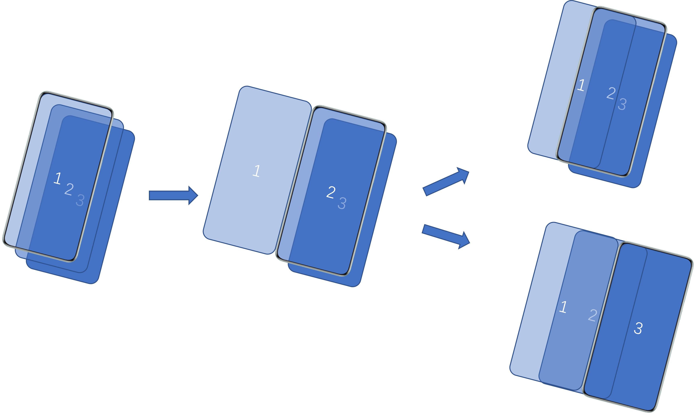
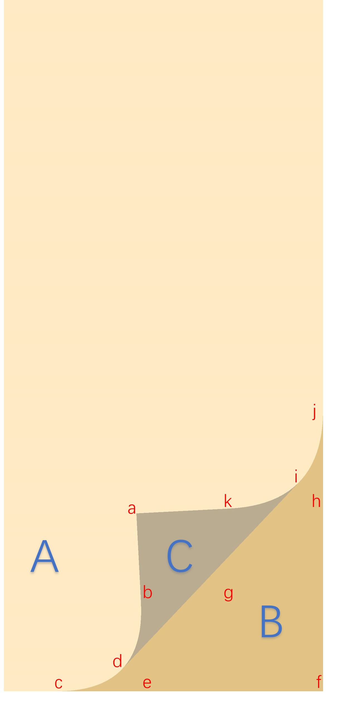

# 阅读器翻页

更新时间：2026-03-12 08:45:02

来源：https://developer.huawei.com/consumer/cn/doc/best-practices/bpta-reader-page-flip

## 概述


在文本阅读器应用上，翻页时可以使用不同的效果展示页面变更，通常有以下翻页效果：

- [上下翻页](#section1232510531285)：向上或向下的滑动效果，适合垂直滚动的文本阅读（如电子书、长篇文章）。
- [覆盖翻页](#section213018591812)：通过水平滑动使当前页面向左侧滑出显示下一页，上一页从左侧滑入覆盖当前页，形成连贯的过渡效果。
- [仿真翻页](#section3853128914)：模拟真实纸张的弯曲、翻折动作，例如页面边缘的弧形变形与阴影投影，实现沉浸式的体验效果。


本文主要对上述翻页效果的实现进行讲解，旨在帮助开发者了解常见翻页动效开发的流程及实现细节。


## 上下翻页


### 场景描述


上下翻页时，页面内容沿着垂直方向移动。当用户向上滑动时，当前页面内容向上滑出屏幕顶部，同时下一页内容从屏幕底部滑入；向下滑动则相反（当前页向下滑出，上一页从顶部滑入）。实现效果如下：


### 实现原理


使用List组件作为容器组件，提供上下滑动的能力。使用ListItem组件存放每一页的内容。页面内容可以自行定义，本文使用Text组件展示文本内容。


### 开发步骤


1. 构建模拟数据。
```ts
// entry/src/main/ets/view/UpDownFlipPage.ets
@Link currentPageNum: number;
private data: BasicDataSource = new BasicDataSource([]);
// ...
aboutToAppear(): void {
  for (let i = Constants.PAGE_FLIP_PAGE_START; i <= Constants.PAGE_FLIP_PAGE_END; i++) {
    this.data.pushItem(Constants.PAGE_FLIP_RESOURCE + i.toString());
  }
  // ...
}
```
2. 使用[List](https://developer.huawei.com/consumer/cn/doc/harmonyos-references/ts-container-list)组件实现上下翻页效果。
```ts
// entry/src/main/ets/view/UpDownFlipPage.ets
List({ initialIndex: this.currentPageNum - 1, scroller: this.scroller }) {
  LazyForEach(this.data, (item: string) => {
    ListItem() {
      Text($r(item))
      // ...
    }
  }, (item: string, index: number) => index + JSON.stringify(item))
}
// ...
.onScrollIndex((firstIndex: number) => {
  this.currentPageNum = firstIndex + 1;
})
```


## 覆盖翻页


### 场景描述


覆盖翻页效果模拟卡片切换，新页面（上一页）从屏幕的左侧水平滑入，完全覆盖当前页面。当前页支持从屏幕另一侧滑出，滑出时显示下层新页面。在整个过程中页面没有弯曲或折叠效果，页面作为一个整体平面进行移动。效果如下：


### 实现原理


使用Stack堆叠容器，存放1、2、3三个页面，借助图形变换的translate平移属性，将上层页面向左平移屏幕宽度移至窗口左侧。使用PanGesture滑动手势事件判断手势滑动方向及平移距离，依据滑动方向及平移距离，执行1页面向右平移滑入屏幕，或2页面向左平移滑出屏幕。滑动手势结束后通过显式动画 (animateTo)完成页面平移至窗口边缘，并重新渲染1、2、3页面。





### 开发步骤


1. 使用Stack堆叠容器存放3个页面，并将上层页面向左平移至屏幕外。
```ts
// entry/src/main/ets/view/CoverFlipPage.ets
@Component
export struct CoverFlipPage {
  // ...
  @State offsetX: number = 0;
  @State screenW: number = 0;
  // ...

  build() {
    Stack() {
      // Next page.
      ReaderPage({ content: this.rightPageContent })

      // Current page.
      ReaderPage({ content: this.midPageContent })
      .translate({ x: this.offsetX >= Constants.PAGE_FLIP_ZERO ? Constants.PAGE_FLIP_ZERO : this.offsetX })
      // ...

      // Previous page, shift the window width to the left.
      ReaderPage({ content: this.leftPageContent })
      .translate({ x: -this.screenW + this.offsetX })
      // ...
    }
    // ...
  }
  // ...
}
```
2. 根据滑动手势事件获取平移的距离，修改状态变量offsetX刷新页面，控制页面移动。手势结束后调用自定义方法pageAnimateTo()方法执行显示动画，完成页面剩余滑动。
```ts
// entry/src/main/ets/view/CoverFlipPage.ets
.gesture(
PanGesture(this.panOption)
.onActionUpdate((event?: GestureEvent) => {
  // ...
  this.offsetX = event.offsetX;
  // ...
})
.onActionEnd(() => {
  // ...
  this.pageAnimateTo(false);
  // ...
})
)
```
3. pageAnimateTo()方法中设置offsetX的结束值，手势向右时offsetX的值为屏幕宽度screenW，手势向左时offsetX的值为负的屏幕宽度-screenW。设置完成后animateTo方法自动插入过渡动画。动画播放结束后，onFinish()完成回调方法中重置offsetX为0，执行自定义方法simulatePageContent()方法更新各内容页ReaderPage组件展示的数据。
```ts
// entry/src/main/ets/view/CoverFlipPage.ets
private pageAnimateTo(isClick: boolean, isLeft?: boolean) {
  this.getUIContext().animateTo({
    duration: Constants.PAGE_FLIP_TO_AST_DURATION,
    curve: Curve.EaseOut,
    onFinish: () => {
      // ...
      this.offsetX = Constants.PAGE_FLIP_ZERO;
      this.simulatePageContent();
      // ...
    }
  }, () => {
    // ...
    this.offsetX = this.screenW;
    // ...
    this.offsetX = -this.screenW;
    // ...
  });
}
```


## 仿真翻页


### 场景描述


仿真翻页效果模拟真实纸质书的翻页体验。用户拖动页面的角落（右上角或右下角），被拖动的页面会随着手指的移动而卷曲、折叠。在翻动过程中，可以看到当前页的背面（为当前页的翻转显示效果）以及被翻页覆盖的下一页内容逐渐显露出来。翻页轨迹遵循贝塞尔曲线，并伴有阴影效果增强立体感。翻页效果如下：


### 实现原理


仿真翻页基于覆盖翻页的页面布局，使用系统接口对当前页或上一页进行截图保存为pixelMap，传递至ArkGraphics 2D的@ohos.graphics.drawing (绘制模块)的相关绘制接口实现了当前页、背页、阴影等区域的绘制。页面绘制通过滑动手势事件PanGesture触发，获取手指在屏幕上的位置，通过该位置信息计算仿真翻页曲线所依赖的相关点位。手势结束时使用定时器模拟滑动触摸的点位并触发页面绘制，判断结束条件终止绘制。

仿真翻页绘制实现关键点

1. 仿真翻页控制点。仿真翻页可以看作下图三个区域组合而成。要绘制出其中曲线及直线，需要计算出一组特定的坐标点（参考下图），计算公式详见开发步骤。

2. 曲线绘制。为使用上述坐标点绘制出曲线，需要使用[@ohos.graphics.drawing (绘制模块)](https://developer.huawei.com/consumer/cn/doc/harmonyos-references/js-apis-graphics-drawing)的相关接口实现，如[Path.lineTo()](https://developer.huawei.com/consumer/cn/doc/harmonyos-references/arkts-apis-graphics-drawing-path#lineto)连接线段；[Path.quadTo()](https://developer.huawei.com/consumer/cn/doc/harmonyos-references/arkts-apis-graphics-drawing-path#quadto)实现二阶贝塞尔曲线；[Canvas.clipPath()](https://developer.huawei.com/consumer/cn/doc/harmonyos-references/arkts-apis-graphics-drawing-canvas#clippath12)实现对画布裁剪等。
3. 内容绘制。仿真翻页绘制的内容来源于使用[@ohos.arkui.componentSnapshot (组件截图)](https://developer.huawei.com/consumer/cn/doc/harmonyos-references/js-apis-arkui-componentsnapshot#componentsnapshotgetsync12)的[componentSnapshot.getSync()](https://developer.huawei.com/consumer/cn/doc/harmonyos-references/js-apis-arkui-componentsnapshot#componentsnapshotgetsync12)接口获取的组件截图pixelMap，然后使用[@ohos.graphics.drawing (绘制模块)](https://developer.huawei.com/consumer/cn/doc/harmonyos-references/js-apis-graphics-drawing)的[Canvas.drawPixelMapMesh()](https://developer.huawei.com/consumer/cn/doc/harmonyos-references/arkts-apis-graphics-drawing-canvas#drawpixelmapmesh12)实现绘制。
4. 阴影效果渲染。主要使用了[@ohos.graphics.drawing (绘制模块)](https://developer.huawei.com/consumer/cn/doc/harmonyos-references/js-apis-graphics-drawing)的[ShaderEffect](https://developer.huawei.com/consumer/cn/doc/harmonyos-references/arkts-apis-graphics-drawing-shadereffect)着色器实现。通过为画刷设置着色器效果，并设置相关参数，完成了渐变阴影的绘制。


### 开发步骤


1. 仿真翻页页面布局仿真翻页页面布局同覆盖翻页大体相同，屏幕区域保留当前页和下一页层叠，上一页向左移出屏幕。不同的是增加NodeContainer组件，在滑动手势事件触发时显示，用于绘制仿真翻页效果，翻页效果结束时隐藏。
```ts
// entry/src/main/ets/view/EmulationFlipPage.ets
Stack() {
  // Page area is the same as overlay page cover.
  ReaderPage({ content: this.rightPageContent })

  ReaderPage({ content: this.midPageContent })
  .translate({ x: this.offsetX >= Constants.PAGE_FLIP_ZERO ? Constants.PAGE_FLIP_ZERO : this.offsetX })
  .id('middlePage')// Mark the component ID and use it as a screenshot.
  // ...

  ReaderPage({ content: this.leftPageContent })
  .translate({ x: -this.screenW + this.offsetX })
  .id('leftPage') // Mark the component ID and use it as a screenshot.

  // Display when flipping pages, drawing the current or previous page.
  NodeContainer(this.myNodeController)
  .width(this.getUIContext().px2vp(this.windowWidth))
  .height(this.getUIContext().px2vp(this.windowHeight))
  .visibility(this.isNodeShow ? Visibility.Visible : Visibility.None)
}
```
2. 滑动手势事件滑动手势事件触发时，记录首个点的横纵坐标，作为手势的起始位置，横坐标用于判断手势结束时页面的滑动方向，纵坐标用于判断手势的起始位置，上部、中部或下部，绘制仿真翻页时区分仿真翻页的类型。
```ts
// entry/src/main/ets/view/EmulationFlipPage.ets
build() {
  // ...
  Stack() {
    // ...
  }
  .gesture(
  PanGesture({ fingers: 1 })
  .onActionUpdate((event: GestureEvent) => {
    // ...
    if (this.panPositionX === 0) {
      this.initPanPositionX(tmpFingerInfo);
      return;
    }
    // ...
  })
  // ...
  )
  // ...
}
// ...
private initPanPositionX(tmpFingerInfo: FingerInfo): void {
  this.panPositionX = tmpFingerInfo.localX;
  let panPositionY = this.getUIContext().vp2px(tmpFingerInfo.localY);

  // Obtain the position of the first touch point and determine the starting area for sliding.
  if (panPositionY < (this.windowHeight / 3)) {
    this.drawPosition = DrawPosition.DP_TOP;
  } else if (panPositionY >
  (this.windowHeight * 2 / 3)) {
    this.drawPosition = DrawPosition.DP_BOTTOM;
  } else {
    this.drawPosition = DrawPosition.DP_MIDDLE;
  }
}
```
3. 在onActionUpdate回调中，当检测到第二个触摸点坐标时，与首个点横坐标进行比较。横坐标大于首个点，手势向右，截图上一页，用于绘制上一页的仿真翻页显示在屏幕中覆盖当前页；横坐标小于首个点，手势向左，截图当前页，用于绘制当前页仿真翻页效果露出下一页， 并隐藏当前页。设置NodeContainer组件为显示状态。
```ts
// entry/src/main/ets/view/EmulationFlipPage.ets
build() {
  // ...
  Stack() {
    // ...
  }
  .gesture(
  PanGesture({ fingers: 1 })
  .onActionUpdate((event: GestureEvent) => {
    // ...
    // Perform a check before starting to draw.
    if (!this.isDrawing) {
      // ...
      this.firstDrawingInit(tmpFingerInfo);
    }
    // ...
  })
  // ...
  )
  // ...
}
// ...
private firstDrawingInit(tmpFingerInfo: FingerInfo): void {
  // The initial sliding direction of the page is used to determine whether to continue or cancel flipping forward or backward.
  if (this.panPositionX < tmpFingerInfo.localX) {
    // When flipping forward, take a screenshot of the previous page, and the flipping type is middle flipping.
    this.pageMoveForward = MoveForward.MF_FORWARD;
    this.snapPageId = 'leftPage';
    this.drawPosition = DrawPosition.DP_MIDDLE
  } else {
    // When flipping back, take a screenshot of the current page and hide it.
    this.pageMoveForward = MoveForward.MF_BACKWARD;
    this.snapPageId = 'middlePage';
    this.isMiddlePageHide = true;
  }

  // Take a screenshot after confirming the sliding direction of the page.
  if (this.pagePixelMap) {
    this.pagePixelMap.release();
  }
  try {
    this.pagePixelMap = this.getUIContext().getComponentSnapshot().getSync(this.snapPageId);
  } catch (error) {
    hilog.error(0x0000, 'EmulationFlip',
    `getComponentSnapshot().getSync failed. Cause: ${JSON.stringify(error)}`)
  }
  this.isDrawing = true;
  this.isNodeShow = true;
}
```
4. 准备绘制需要的坐标数据，横纵坐标转换为px单位，用于仿真翻页绘制，使用AppStorage保存。比较当前横坐标与上一次的横坐标，判断当前手势的方向，用于手势释放判断页面自动翻页的方向。记录当前横坐标。调用newRectNode()方法更新NodeContainer组件。
```ts
// entry/src/main/ets/view/EmulationFlipPage.ets
build() {
  // ...
  Stack() {
    // ...
  }
  .gesture(
  PanGesture({ fingers: 1 })
  .onActionUpdate((event: GestureEvent) => {
    // ...
    // Execute drawing.
    this.drawing(tmpFingerInfo);
  })
  // ...
  )
  // ...
}
// ...
private drawing(tmpFingerInfo: FingerInfo): void {
  // Determine the latest sliding direction of the gesture, and after releasing the gesture,
  // combine it with the sliding direction of the page to determine whether to flip or cancel.
  if (this.panPositionX < tmpFingerInfo.localX) {
    this.gestureMoveForward = MoveForward.MF_FORWARD;
    this.panPositionX = tmpFingerInfo.localX;
  } else {
    this.gestureMoveForward = MoveForward.MF_BACKWARD;
    this.panPositionX = tmpFingerInfo.localX;
  }
  AppStorage.setOrCreate('drawState', DrawState.DS_MOVING);

  // Convert to px units.
  this.positionX = this.getUIContext().vp2px(tmpFingerInfo.localX);
  this.positionY = this.getUIContext().vp2px(tmpFingerInfo.localY);
  AppStorage.setOrCreate('positionX', this.positionX);
  AppStorage.setOrCreate('positionY', this.positionY);

  // Execute drawing.
  this.newRectNode();
}
```

 仿真页面绘制
1. NodeContainer组件控制器清空所有节点，新增渲染节点，渲染节点用于仿真翻页的绘制。
```ts
// entry/src/main/ets/view/EmulationFlipPage.ets
newRectNode() {
  // Creates a RectRenderNode object.
  const rectNode = new RectRenderNode();
  // ...
  this.myNodeController.clearNodes();
  this.myNodeController.addNode(rectNode);
}
```
2. 在RenderNode进行绘制时，draw()方法会被调用。首先执行初始化init()方法。通过AppStorage获取触摸点的横纵坐标，并判断手势起始位置，计算仿真翻页需要的坐标点以及绘制阴影时需要的相关数值。通过手势触摸点计算页角点A，限制A点纵坐标的范围，从而限制书页的翻起程度。保存点A的纵坐标。各点的计算方法见代码。计算结束后判断当前区域是否还在屏幕区域内，保存判断结果。
```ts
// entry/src/main/ets/viewmodel/PageNodeController.ets
export class RectRenderNode extends RenderNode {
  // ...
  draw(context: DrawContext): void {
    const canvas = context.canvas;

    // Initialize data.
    init();
    // ...
  }
}
// ...
/**
 * Initialize data.
 */
function init(): void {
  // ...
  // Obtain touch points.
  let x: number = AppStorage.get('positionX') as number;
  let y: number = AppStorage.get('positionY') as number;
  let viewWidth: number = AppStorage.get('windowWidth') as number;
  let viewHeight: number = AppStorage.get('windowHeight') as number;
  pointA = new MyPoint(x, y);
  // ...
  let touchPoint = new MyPoint(x, y);
  let drawState: number = AppStorage.get('drawState') as number;
  let drawStartPosition: number = AppStorage.get('drawPosition') as number;

  // Determine the area where sliding begins.
  if (DrawPosition.DP_TOP === drawStartPosition) {
    // The touch point is at the top.
    pointF = new MyPoint(viewWidth, 0);
    if (drawState !== DrawState.DS_RELEASE) {
      calcPointAByTouchPoint(touchPoint);
    }
  } else if (DrawPosition.DP_BOTTOM === drawStartPosition) {
    // The touch point is below.
    pointF = new MyPoint(viewWidth, viewHeight);
    if (drawState !== DrawState.DS_RELEASE) {
      calcPointAByTouchPoint(touchPoint);
    }
  } else {
    // The touch point is in the middle.
    pointA.y = viewHeight - 1;
    pointF.x = viewWidth;
    pointF.y = viewHeight;
  }
  // Saves the y-coordinate of point A.
  AppStorage.setOrCreate<number>('flipPositionY', pointA.y);

  // Calculate all path points.
  calcPointsXY();
}

/**
 * Calculate the y-coordinate of point A based on the touch point.
 * @param touchPoint Touch point.
 */
function calcPointAByTouchPoint(touchPoint: MyPoint): void {
  let viewWidth: number = AppStorage.get('windowWidth') as number;
  let viewHeight: number = AppStorage.get('windowHeight') as number;
  let r = Constants.SIXTY_PERCENT * viewWidth;
  pointA.x = touchPoint.x;

  // Reset the y value and restrict the region where the y value is located.
  if (pointF.y === viewHeight) {
    let tmpY =
      viewHeight -
      Math.abs(
        Math.sqrt(Math.pow(r, 2) - Math.pow(touchPoint.x - (viewWidth - r), 2)),
      );
    pointA.y = touchPoint.y >= tmpY ? touchPoint.y : tmpY;
  } else {
    let tmpY = Math.abs(
      Math.sqrt(Math.pow(r, 2) - Math.pow(touchPoint.x - (viewWidth - r), 2)),
    );
    pointA.y = touchPoint.y >= tmpY ? tmpY : touchPoint.y;
  }
}

/**
 * Calculate the coordinates of each path point.
 */
function calcPointsXY(): void {
  pointG.x = (pointA.x + pointF.x) / 2;
  pointG.y = (pointA.y + pointF.y) / 2;

  pointE.x =
    pointG.x -
    ((pointF.y - pointG.y) * (pointF.y - pointG.y)) / (pointF.x - pointG.x);
  pointE.y = pointF.y;

  pointH.x = pointF.x;
  pointH.y =
    pointG.y -
    ((pointF.x - pointG.x) * (pointF.x - pointG.x)) / (pointF.y - pointG.y);

  pointC.x = pointE.x - (pointF.x - pointE.x) / 2;
  pointC.y = pointF.y;

  pointJ.x = pointF.x;
  pointJ.y = pointH.y - (pointF.y - pointH.y) / 2;

  pointB = getIntersectionPoint(pointA, pointE, pointC, pointJ);
  pointK = getIntersectionPoint(pointA, pointH, pointC, pointJ);

  pointD.x = (pointC.x + 2 * pointE.x + pointB.x) / 4;
  pointD.y = (2 * pointE.y + pointC.y + pointB.y) / 4;

  pointI.x = (pointJ.x + 2 * pointH.x + pointK.x) / 4;
  pointI.y = (2 * pointH.y + pointJ.y + pointK.y) / 4;

  //Calculate the distance from point d to line ae and use it to draw shadows.
  let lA: number = pointA.y - pointE.y;
  let lB: number = pointE.x - pointA.x;
  let lC: number = pointA.x * pointE.y - pointE.x * pointA.y;
  lPathAShadowDis = Math.abs(
    (lA * pointD.x + lB * pointD.y + lC) / Math.hypot(lA, lB),
  );

  // Calculate the distance from point i to ah and use it to draw shadows.
  let rA: number = pointA.y - pointH.y;
  let rB: number = pointH.x - pointA.x;
  let rC: number = pointA.x * pointH.y - pointH.x * pointA.y;
  rPathAShadowDis = Math.abs(
    (rA * pointI.x + rB * pointI.y + rC) / Math.hypot(rA, rB),
  );

  // Check if the drawing area is still in the window. If it is not in the window, the drawing ends.
  if (!checkDrawingAreaInWindow()) {
    AppStorage.setOrCreate('isFinished', true);
  }
}
```
3. 绘制下一页上的阴影。使用上一步计算的相关数值，配置绘制阴影所需的着色器shaderEffect，使用canvas及画刷绘制阴影。
```ts
// entry/src/main/ets/viewmodel/PageNodeController.ets
export class RectRenderNode extends RenderNode {
  // ...
  draw(context: DrawContext): void {
    const canvas = context.canvas;

    // ...
    // Draw the shadow shown on the next page.
    drawPathBShadow(canvas);
    // ...
  }
}
// ...
/**
 * Draw the shadow shown on the next page.
 *
 * @param canvas canvas
 */
function drawPathBShadow(canvas: drawing.Canvas) {
  canvas.save();
  // Gradient color array.
  let deepColor: number = 0xff111111;
  let lightColor: number = 0x00111111;
  let gradientColors: number[] = [deepColor, lightColor];
  let viewWidth: number = AppStorage.get('windowWidth') as number;
  let viewHeight: number = AppStorage.get('windowHeight') as number;

  // The distance from A to F.
  let aToF = Math.hypot(pointA.x - pointF.x, pointA.y - pointF.y);
  // The distance from A to F.
  let viewDiagonalLength = Math.hypot(viewWidth, viewHeight);

  let left: number = 0;
  let right: number = 0;
  let top: number = pointC.y;
  let bottom: number = viewDiagonalLength + pointC.y;

  if (pointF.x === viewWidth && pointF.y === 0) {
    // The F point is located in the upper right corner.
    left = pointC.x;
    right = pointC.x + aToF / 4;
  } else {
    left = pointC.x - aToF / 4;
    right = pointC.x;
  }

  // Calculate the rotation angle between two points (calculated in radians and converted into angles).
  let deltaX: number = pointH.y - pointF.y;
  let deltaY: number = pointE.x - pointF.x;
  let radians: number = Math.atan2(deltaY, deltaX);
  // Convert radians to angles.
  let rotateDegrees: number = (radians * 180) / Math.PI;

  let startPt: common2D.Point = { x: pointF.y === 0 ? right : left, y: top };
  let endPt: common2D.Point = { x: pointF.y === 0 ? left : right, y: top };
  let shaderEffect = drawing.ShaderEffect.createLinearGradient(
    endPt,
    startPt,
    gradientColors,
    drawing.TileMode.MIRROR,
  );

  // Perform rotation.
  canvas.rotate(rotateDegrees, pointC.x, pointC.y);

  // Draw shadows.
  let rect: common2D.Rect = {
    left: left,
    top: top,
    right: right,
    bottom: bottom,
  };
  drawShadow(canvas, shaderEffect, rect);
}
// ...
/**
 * Draw shaded areas.
 *
 * @param canvas canvas
 * @param shaderEffect shader effect
 * @param rect rect
 */
function drawShadow(
  canvas: drawing.Canvas,
  shaderEffect: drawing.ShaderEffect,
  rect: common2D.Rect,
) {
  let tmpBrush = new drawing.Brush();
  tmpBrush.setShaderEffect(shaderEffect);
  canvas.attachBrush(tmpBrush);
  canvas.drawRect(rect.left, rect.top, rect.right, rect.bottom);
  canvas.detachBrush();
  canvas.restore();
}
```
4. 绘制仿真翻页背面内容及阴影。首先根据计算出的绘制曲线依赖的点，规划出背面区域pathC ，使用clipPath()方法裁剪出该区域。为绘制区域设置旋转矩阵，实现将截图获取的页面pixelMap，旋转并翻转成需要的背页效果。最后绘制背页区域的阴影，此处阴影计算的算法同上一步。
```ts
// entry/src/main/ets/viewmodel/PageNodeController.ets
export class RectRenderNode extends RenderNode {
  // ...
  draw(context: DrawContext): void {
    const canvas = context.canvas;

    // ...
    // Draw the back area for flipping pages.
    drawPathC(canvas);
    // ...
  }
}
// ...
/**
 * Draw the back area for flipping pages.
 *
 * @param canvas canvas
 */
function drawPathC(canvas: drawing.Canvas): void {
  if (canIUse('SystemCapability.Graphics.Drawing')) {
    canvas.attachBrush(pathABrush);
    pathC.reset();
    pathC.moveTo(pointI.x, pointI.y);
    pathC.lineTo(pointD.x, pointD.y);
    pathC.lineTo(pointB.x, pointB.y);
    pathC.lineTo(pointA.x, pointA.y);
    pathC.lineTo(pointK.x, pointK.y);
    pathC.close();
    canvas.drawPath(pathC);

    // Draw the content on the back.
    canvas.save();
    canvas.clipPath(pathC);

    // Set the inversion and rotation matrices.
    let eh = Math.hypot(pointF.x - pointE.x, pointH.y - pointF.y);
    let sin0 = (pointF.x - pointE.x) / eh;
    let cos0 = (pointH.y - pointF.y) / eh;
    let value: Array<number> = [0, 0, 0, 0, 0, 0, 0, 0, 1.0];
    value[0] = -(1 - 2 * sin0 * sin0);
    value[1] = 2 * sin0 * cos0;
    value[3] = 2 * sin0 * cos0;
    value[4] = 1 - 2 * sin0 * sin0;

    let matrix = new drawing.Matrix();
    matrix.reset();
    matrix.setMatrix(value);
    matrix.preTranslate(-pointE.x, -pointE.y);
    matrix.postTranslate(pointE.x, pointE.y);
    canvas.concatMatrix(matrix);

    // Draw the current page on the back.
    let pagePixelMap: image.PixelMap = AppStorage.get(
      'pagePixelMap',
    ) as image.PixelMap;
    let viewWidth: number = AppStorage.get('windowWidth') as number;
    let viewHeight: number = AppStorage.get('windowHeight') as number;
    let verts: Array<number> = [
      0,
      0,
      viewWidth,
      0,
      0,
      viewHeight,
      viewWidth,
      viewHeight,
    ];
    canvas.drawPixelMapMesh(pagePixelMap, 1, 1, verts, 0, null, 0);
    canvas.restore();

    // Change the color on the back.
    canvas.detachBrush();
    canvas.attachBrush(pathCBrush);
    canvas.drawPath(pathC);
    canvas.detachBrush();

    // Draw shadows in the back area.
    canvas.save();
    canvas.clipPath(pathC);
    drawPathCShadow(canvas);
    canvas.restore();
  }
}
```
5. 绘制页面左侧文字区域及阴影。根据计算出的绘制曲线依赖的点，规划出背面区域pathA，裁剪出该区域。将截图保存的页面pixelMap绘制在该区域，并绘制该区域的阴影。完成仿真翻页的绘制。
```ts
// entry/src/main/ets/viewmodel/PageNodeController.ets
export class RectRenderNode extends RenderNode {
  // ...
  draw(context: DrawContext): void {
    const canvas = context.canvas;

    // ...
    // Retrieve the cropped area of the current page.
    getPathA();

    // Draw the current page area.
    drawPathAContent(canvas);
  }
}

/**
 * Retrieve the cropped area of the current page.
 */
function getPathA(): void {
  if (canIUse('SystemCapability.Graphics.Drawing')) {
    let viewWidth: number = AppStorage.get('windowWidth') as number;
    let viewHeight: number = AppStorage.get('windowHeight') as number;
    // Point F is located in the upper right corner, calculate pathA.
    if (pointF.x === viewWidth && pointF.y === 0) {
      pathA.reset();
      pathA.lineTo(pointC.x, pointC.y);
      pathA.quadTo(pointE.x, pointE.y, pointB.x, pointB.y);
      pathA.lineTo(pointA.x, pointA.y);
      pathA.lineTo(pointK.x, pointK.y);
      pathA.quadTo(pointH.x, pointH.y, pointJ.x, pointJ.y);
      pathA.lineTo(viewWidth, viewHeight);
      pathA.lineTo(0, viewHeight);
      pathA.close();
    }
    // Point F is located in the bottom right corner, calculate pathA.
    if (pointF.x === viewWidth && pointF.y === viewHeight) {
      pathA.reset();
      pathA.lineTo(0, viewHeight);
      pathA.lineTo(pointC.x, pointC.y);
      pathA.quadTo(pointE.x, pointE.y, pointB.x, pointB.y);
      pathA.lineTo(pointA.x, pointA.y);
      pathA.lineTo(pointK.x, pointK.y);
      pathA.quadTo(pointH.x, pointH.y, pointJ.x, pointJ.y);
      pathA.lineTo(viewWidth, 0);
      pathA.close();
    }
  }
}
// ...

/**
 * Draw the current page area.
 *
 * @param canvas canvas
 */
function drawPathAContent(canvas: drawing.Canvas): void {
  if (canIUse('SystemCapability.Graphics.Drawing')) {
    canvas.attachBrush(pathABrush);

    canvas.save();
    canvas.clipPath(pathA);

    // Obtain a screenshot pixelMap for displaying the current page.
    let pagePixelMap: image.PixelMap = AppStorage.get(
      'pagePixelMap',
    ) as image.PixelMap;
    let viewWidth: number = AppStorage.get('windowWidth') as number;
    let viewHeight: number = AppStorage.get('windowHeight') as number;
    let verts: Array<number> = [
      0,
      0,
      viewWidth,
      0,
      0,
      viewHeight,
      viewWidth,
      viewHeight,
    ];
    // Execute drawing.
    canvas.drawPixelMapMesh(pagePixelMap, 1, 1, verts, 0, null, 0);
    canvas.restore();

    // Draw the shadow of the current page.
    if (AppStorage.get('drawPosition') === DrawPosition.DP_MIDDLE) {
      drawPathAHorizontalShadow(canvas);
    } else {
      drawPathALeftShadow(canvas);
      drawPathARightShadow(canvas);
    }
  }
}
```

 滑动手势结束。滑动手势结束后获取最后一次绘制的页角A点的纵坐标。判断当前手势的移动方向，设置自动绘制的步进值。使用定时器执行自动绘制。
```ts
// entry/src/main/ets/view/EmulationFlipPage.ets
build() {
  // ...
  Stack() {
    // ...
  }
  .gesture(
  PanGesture({ fingers: 1 })
  // ...
  .onActionEnd(() => {
    // ...

    // Perform automatic sliding.
    this.autoFlipPage();
    this.isDrawing = false;
  })
  )
  // ...
}
// ...

/**
* Perform automatic drawing.
*/
private autoFlipPage(): void {
  AppStorage.set('drawState', DrawState.DS_RELEASE);
  // Get the vertical axis of the drawn footer.
  AppStorage.setOrCreate('positionY', (AppStorage.get('flipPositionY') as number));
  let num: number = Constants.DISTANCE_FRACTION;
  if (this.gestureMoveForward === MoveForward.MF_FORWARD) {
    // Page forward to calculate diff.
    let xDiff = (this.windowWidth - this.positionX) / num;
    let yDiff = 0;
    if (this.drawPosition === DrawPosition.DP_BOTTOM) {
      yDiff = (this.windowHeight - this.positionY) / num;
    } else {
      yDiff = (0 - this.positionY) / num;
    }

    this.setTimer(xDiff, yDiff, () => {
      this.newRectNode();
    });
  } else {
    // Next Page.
    this.setTimer(Constants.FLIP_X_DIFF, 0, () => {
      this.newRectNode();
    });
  }
}
```
 自动绘制翻页动效
1. 根据最后手势的移动方向，页面需要自动向右侧还原，或向左侧翻页。根据上一步获取的步进值，计算新的触摸点，执行新的绘制。并使用定时器更新触摸点。
```ts
// entry/src/main/ets/view/EmulationFlipPage.ets
private setTimer(xDiff: number, yDiff: number, drawNode: () => void) {
  // Automatically flip forward.
  if (this.gestureMoveForward === MoveForward.MF_FORWARD) {
    this.timeID = setInterval((xDiff: number, yDiff: number, drawNode: () => void) => {
      let x = AppStorage.get('positionX') as number + xDiff;
      let y = AppStorage.get('positionY') as number + yDiff;
      // Page forward termination condition.
      if (x >= (AppStorage.get('windowWidth') as number) - 1 || y >= (AppStorage.get('windowHeight') as number) ||
      y <= 0) {
        this.finishLastGesture();
      } else {
        AppStorage.setOrCreate('positionX', x);
        AppStorage.setOrCreate('positionY', y);
        drawNode();
      }
    }, Constants.TIMER_DURATION, xDiff, yDiff, drawNode);
  } else {
    // Automatically flip backwards.
    AppStorage.setOrCreate('isFinished', false);
    this.timeID = setInterval((xDiff: number, _: number, drawNode: () => void) => {
      let x = AppStorage.get('positionX') as number + xDiff;
      let y = AppStorage.get('positionY') as number;
      // Obtain the termination condition for determining when flipping back to draw.
      let isFinished: boolean = AppStorage.get('isFinished') as boolean;
      if (isFinished) {
        // End automatic drawing.
        this.finishLastGesture();
      } else {
        AppStorage.setOrCreate('positionX', x);
        AppStorage.setOrCreate('positionY', y);
        drawNode();
      }
    }, Constants.TIMER_DURATION, xDiff, yDiff, drawNode);
  }
}
```
2. 定时器中增加绘制结束条件判断，页面向右侧还原时使用触摸的横纵坐标判断，页面向左翻页使用计算曲线关键点时判断绘制区域是否还在屏幕内存储的结果。执行finishLastGesture()结束绘制。
```ts
// entry/src/main/ets/view/EmulationFlipPage.ets
private setTimer(xDiff: number, yDiff: number, drawNode: () => void) {
  // Automatically flip forward.
  if (this.gestureMoveForward === MoveForward.MF_FORWARD) {
    this.timeID = setInterval((xDiff: number, yDiff: number, drawNode: () => void) => {
      // ...
      // Page forward termination condition.
      if (x >= (AppStorage.get('windowWidth') as number) - 1 || y >= (AppStorage.get('windowHeight') as number) ||
      y <= 0) {
        this.finishLastGesture();
      } else {
        // ...
      }
    }, Constants.TIMER_DURATION, xDiff, yDiff, drawNode);
  } else {
    // Automatically flip backwards.
    AppStorage.setOrCreate('isFinished', false);
    this.timeID = setInterval((xDiff: number, _: number, drawNode: () => void) => {
      // ...
      // Obtain the termination condition for determining when flipping back to draw.
      let isFinished: boolean = AppStorage.get('isFinished') as boolean;
      if (isFinished) {
        // End automatic drawing.
        this.finishLastGesture();
      } else {
        // ...
      }
    }, Constants.TIMER_DURATION, xDiff, yDiff, drawNode);
  }
}
```

 动效结束更新内容页。判断动效结束后，清空定时器，根据页面初始移动方向及最后的手势移动方向更新页面内容，重新绘制页面。重置相关手势、绘制过程的状态变量。此时结束一次仿真翻页的绘制。
```text
// entry/src/main/ets/view/EmulationFlipPage.ets
private finishLastGesture() {
clearInterval(this.timeID);
this.timeID = -1;

// Previous page.
if (this.pageMoveForward === MoveForward.MF_FORWARD && this.gestureMoveForward === MoveForward.MF_FORWARD) {
this.currentPageNum--;
this.simulatePageContent();
}

// Next page.
if (this.pageMoveForward === MoveForward.MF_BACKWARD && this.gestureMoveForward === MoveForward.MF_BACKWARD) {
this.currentPageNum++;
this.simulatePageContent();
}

AppStorage.setOrCreate('positionX', -1);
AppStorage.setOrCreate('positionY', -1);
AppStorage.setOrCreate('drawPosition', DrawPosition.DP_NONE);
AppStorage.setOrCreate('drawState', DrawState.DS_NONE);
this.isMiddlePageHide = false;
this.isNodeShow = false;
this.gestureMoveForward = MoveForward.MF_NONE;
this.panPositionX = 0;
this.drawPosition = DrawPosition.DP_NONE;
this.isDrawing = false;
this.pagePixelMap?.release();
}
```


### 示例代码


实现阅读器翻页效果
