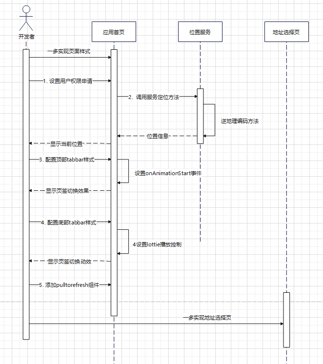
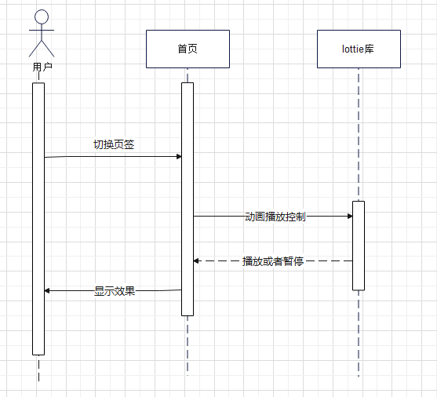
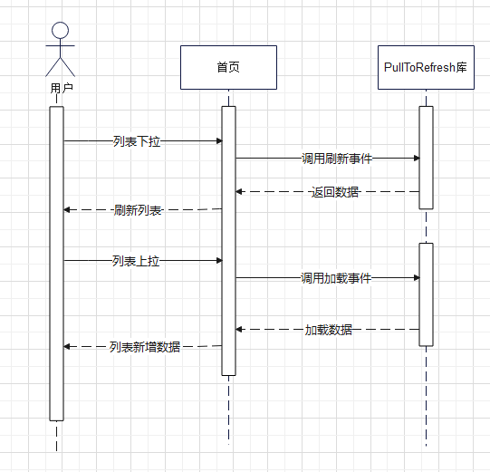
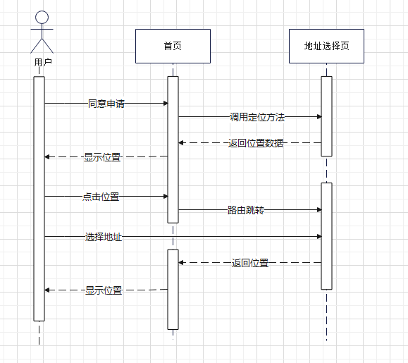

# 首页信息流体验优化

更新时间：2026-03-12 08:45:02

来源：https://developer.huawei.com/consumer/cn/doc/best-practices/bpta-news_homepage

#### 概述

本场景解决方案面向新闻类页面开发人员，指导开发者从零开始构建新闻类首页面。包含地址选择、tabs和tabContent切换的动态图标和流畅动效、下拉刷新、上拉加载、首页feed流等常见功能的实现及流畅体验。
 
 

#### 整体场景介绍

介绍了用户操作应用的主要流程，包括进入首页后通过页签切换页面内容、上拉加载和下拉刷新页面，以及从首页地址进入地址选择页更换地址等功能。
 
 
- 应用的主要流程图：



 
- 应用的运行效果图：


 
- 操作流程如下：1. 获取地理位置的权限；

2. 点击位置信息，跳转地址选择页，可修改当前位置信息；

3. 点击顶部页签或者滑动切换页面，页签同步切换；

4. 点击底部页签切换页面，同步切换页签，触发页签切换的动画效果；

5. 下拉刷新页面信息；

6. 上拉加载页面信息；

7. 点击右下角按钮回弹至顶部。

 

#### 场景说明

 

#### 适用范围

本场景适用于新闻类应用的首页，采用原生组件和三方库组件来实现新闻首页及其功能。
 
 

#### 场景优势

本场景可提升用户的首页体验，使其更加流畅和便捷。具体优势包括：
 1. 导航栏点击切换动效流畅，响应时延51ms。
2. 左右滑动切换动效流畅，响应时延67ms。
3. 地址选择页定位精确，选择目标城市便捷。
4. 底部页签跳转流畅，时延349ms。
5. 页面支持上拉加载和下拉刷新功能，动效回弹流畅，无丢帧现象。下拉刷新响应时延为153ms，上拉加载响应时延为150ms。
 
 

#### 场景分析

 

#### 典型场景与实现方案

- 实现方案如下表：

| 场景名称 | 描述 | 实现方案 |

| --- | --- | --- |

| 导航栏切换动效流畅 | 点击页签或滑动切换页面时，页签同步切换 | tab组件添加动画开始时触发事件 |

| 底部页签跳转精致流畅 | 底部页签切换时具有动画效果 | 添加lottie动画 |

| 上拉加载下拉刷新 | 上拉加载更多新闻内容，下拉刷新整个页面，均具有加载动效 | pullToRefresh组件 |

| 首页feed流 | 首页展示流畅的图文列表 | 使用LazyForEach对子组件进行渲染，实现懒加载功能 |

| 地址选择页 | 提供地址选择、定位、地址首字母定位及模糊查询功能 | 位置服务与AlphabetIndexer组件 |

 
 

#### 场景实现

 

#### 导航栏切换动效流畅

通过添加Tab组件的动效触发事件，实现页面内容切换与页签样式切换的同步效果。具体效果如图所示：
 


 
- 动效触发事件节点推荐使用onAnimationStart事件设置切换标签动效。使用onChange事件会导致页面切换后再触发动效，造成效果延迟。使用onClick事件会与页面切换冲突。

  
```ArkTS
// TabBar.ets
@Builder
TabBuilder(id: number, index: number) {
  Column() {
    Text(this.tabBarArray[id].name)
    // ...
  }
  .alignItems(HorizontalAlign.Start)
}

build() {
  Tabs({ barPosition: BarPosition.Start }) {
    ForEach(this.tabBarArray, (tabsItem: NewsTypeModel, index: number) => {
      TabContent() {
        // ...
      }
      // ...
    }, (item: NewsTypeModel) => JSON.stringify(item));
  }
  // ...
  .onAnimationStart((_index: number, targetIndex: number, _event: TabsAnimationEvent) => {
    this.currentIndex = targetIndex;
  })
}
```


 
 

#### 底部页签跳转精致流畅

底部页签样式添加Lottie动画，使跳转更加精致流畅。效果如图所示：
 
 


 
- 底部页签跳转功能时序图



 
- TabBar集成lottie动画lottie是适用于OpenHarmony的动画库，可解析AdobeAfterEffects通过Bodymovin插件导出的JSON格式动画，并在移动设备上本地渲染。支持动画交互，通过添加触摸事件与TabBar结合，实现动态图标效果。

  引入lottie三方库。

  
```text
ohpm install @ohos/lottie
```
 准备lottie动画资源，建议放置在Entry目录的common文件夹中。如果放置在本模块中，使用相对路径将无法读取。

  导入lottie模块。

  
```ArkTS
// Home.ets
import lottie, { AnimationItem } from '@ohos/lottie';
```
 使用RenderingContext在Canvas组件上进行绘制，声明CanvasRenderingContext2D变量。使用RenderingContextSettings配置CanvasRenderingContext2D对象的参数，设置canvas是否开启抗锯齿。

  
```ArkTS
// Home.ets
private renderingSettings1: RenderingContextSettings = new RenderingContextSettings(true);
private canvasRenderingContext1: CanvasRenderingContext2D = new CanvasRenderingContext2D(this.renderingSettings1);
```
 定义所需数据类型的接口，初始化变量。接口中包含资源路径信息和CanvasRenderingContext2D。

  
```ArkTS
// Home.ets
interface TabBarOption {
  index: number;
  text: ResourceStr;
  name: string;
  path: string;
  canvasRenderingContext: CanvasRenderingContext2D;
  lottieItem?: AnimationItem;
  currentBottomIndex?: number;
  currentBreakpoint?: string;
}
```
 实现动画播放的方法。

  
```ArkTS
// Home.ets
lottieController(): void {
  if (this.currentBottomIndex === 0) {
    lottie.stop();
    lottie.play(this.tabOption1.name);
  }
  if (this.currentBottomIndex === 1) {
    lottie.stop();
    lottie.play(this.tabOption2.name);
  }
  if (this.currentBottomIndex === 2) {
    lottie.stop();
    lottie.play(this.tabOption3.name);
  }
}
```
 在TabBar样式中实现Canvas子组件。

  
```ArkTS
// Home.ets
Canvas(tabBarOption.canvasRenderingContext)
  .width($r('app.float.canvas_size'))
  .height($r('app.float.canvas_size'))
  .onReady(() => {
    tabBarOption.canvasRenderingContext.imageSmoothingEnabled = true;
    tabBarOption.canvasRenderingContext.imageSmoothingQuality = 'medium';
    lottie.destroy(tabBarOption.name);
    const item = lottie.loadAnimation({
      container: tabBarOption.canvasRenderingContext,
      renderer: 'canvas',
      loop: false,
      autoplay: false,
      autoSkip: false,
      name: tabBarOption.name,
      path: tabBarOption.path,
    });
    tabBarOption.lottieItem = item;
    item.addEventListener('DOMLoaded', (args: Object): void => {
      if (tabBarOption.index === tabBarOption.currentBottomIndex) {
        item.play();
      }
    })
  })
```
 在tab组件的onAnimationStart事件中调用播放方法。

  
```ArkTS
// Home.ets
.onAnimationStart((index: number, targetIndex: number, event: TabsAnimationEvent) => {
  this.currentBottomIndex = targetIndex;
  this.lottieController();
  this.updateTabText(targetIndex);
})
```


 

#### 上拉加载下拉刷新

通过三方库组件pullToRefresh实现下拉刷新页面和上拉加载更多数据的效果。具体效果如图所示：
 
 


 
- 上拉加载和下拉刷新时序图：



 
- pullToRefresh组件使用第三方库的pullToRefresh组件，将列表组件、绑定的数据对象和scroller对象包含在内，并添加上滑和下拉方法。支持lazyForEach数据作为数据源。设置List组件的edgeEffect属性为EdgeEffect.None。

  引入三方库pullToRefresh。

  
```text
ohpm install @ohos/pulltorefresh
```
 
```ArkTS
// PullToRefreshNews.ets
import { PullToRefresh } from '@ohos/pulltorefresh/index';
```
 准备数据源，本场景使用本地资源模拟效果，资源文件在resources/rawfile目录下，实际情况可替换为从网络获取。

  
```ArkTS
// PullToRefreshNews.ets
const MOCK_DATA_FILE_ONE_DIR: string =
  uiContext!.getHostContext()!.resourceManager.getStringSync($r('app.string.mock1').id);
const MOCK_DATA_FILE_TWO_DIR: string =
  uiContext!.getHostContext()!.resourceManager.getStringSync($r('app.string.mock2').id);
```
 包含列表组件、数据对象和scroller对象，并添加上滑和下拉方法。

  
```ArkTS
// PullToRefreshNews.ets
PullToRefresh({
  data: $newsData,
  scroller: this.scroller,
  customList: () => {
    this.getListView();
  },
  onRefresh: () => {
    return new Promise<string>((resolve, reject) => {
      // ...
      }, NEWS_REFRESH_TIME);
    });
  },
  onLoadMore: () => {
    return new Promise<string>((resolve, reject) => {
      // ...
    });
  },
  customLoad: null,
  customRefresh: null,
})
```


 

#### 首页feed流

使用懒加载实现首页 feed 流的快速渲染和流畅滑动。效果如图所示：
 
 


 
- 懒加载新闻应用列表数据可能达到数万条。针对这类数据加载的长列表应用，使用懒加载可以解决一次性加载数据耗时长、占用资源多的问题，从而提升页面响应速度。

  准备需要加载的数据源：

  
```ArkTS
// PullToRefreshNews.ets
@State newsData: NewsDataSource = new NewsDataSource();
```
 创建子组件：

  
```ArkTS
// PullToRefreshNews.ets
@Component
struct newsItem {
  // ...
}
```
 使用LazyForEach对子组件进行渲染：

  
```ArkTS
// PullToRefreshNews.ets
List({ space: CommonConstants.LIST_SPACE, scroller: this.scroller }) {
  LazyForEach(this.newsData, (item: NewsData) => {
    ListItem() {
      newsItem({
        // ...
      })
    }
    // ...
  }, (item: NewsData, index?: number) => JSON.stringify(item) + index);
}
```


 

#### 地址选择页

使用位置服务实现定位功能，AlphabetIndexer组件实现地址首字母定位导航条。效果如图所示：
 
 


 
- 地址选择页效果功能时序图



 
- 位置服务与索引条导航开启手机位置服务功能，使用位置服务获取当前地理位置信息，通过AlphabetIndexer组件实现首字母快速定位城市的索引条导航。

  申请权限时，API9及之后的版本，需要申请ohos.permission.APPROXIMATELY_LOCATION，或同时申请ohos.permission.APPROXIMATELY_LOCATION和ohos.permission.LOCATION；无法单独申请ohos.permission.LOCATION。

  
```json
"requestPermissions": [
  {
    "name": "ohos.permission.APPROXIMATELY_LOCATION",
    "reason": "$string:approximately_location_desc",
    "usedScene": {
      "abilities": [
        "EntryAbility"
      ],
      "when": "always"
    }
  },
  {
    "name": "ohos.permission.LOCATION",
    "reason": "$string:location_desc",
    "usedScene": {
      "abilities": [
        "EntryAbility"
      ],
      "when": "always"
    }
  }
],
```
 申请用户安全权限：

  
```ArkTS
// Index.ets
onPageShow(): void {
  abilityAccessCtrl.createAtManager().requestPermissionsFromUser(this.getUIContext().getHostContext(), [
    'ohos.permission.LOCATION', 'ohos.permission.APPROXIMATELY_LOCATION']).then(() => {
    if (this.status) {
      geoLocationManager.getCurrentLocation(locationChange);
      this.status = false;
    }
  }).catch((err: BusinessError) => {
    hilog.error(0x0000, 'Index', `requestPermissionsFromUser fail, code: ${err.code}, message: ${err.message}`);
  });
}
```
 导入位置服务：

  
```ArkTS
// Index.ets
import { geoLocationManager } from '@kit.LocationKit';
```
 获取地理位置信息，进行逆地理编码以确定当前位置：

  
```ArkTS
// Index.ets
let locationChange: (err: BusinessError, location: geoLocationManager.Location) => void = (err, location) => {
  if (err) {
    hilog.error(0x00000, 'locationChanger: err=', JSON.stringify(err));
  }
  if (location) {
    let reverseGeocodeRequest: geoLocationManager.ReverseGeoCodeRequest = {
      'latitude': location.latitude,
      'longitude': location.longitude,
      'maxItems': CommonConstants.MAX_ITEMS
    };
    geoLocationManager.getAddressesFromLocation(reverseGeocodeRequest, (err, data) => {
      if (data) {
        hilog.info(0x00000, 'getAddressesFromLocation: data=', JSON.stringify(data));
        if (data[0].locality !== undefined) {
          if (i18n.System.getSystemLanguage() === 'zh-Hans') {
            AppStorage.setOrCreate('local', data[0].locality.replace(/"/g, '').slice(0, -1));
            AppStorage.setOrCreate('currentLocal', data[0].locality.replace(/"/g, '').slice(0, -1));
          } else {
            AppStorage.setOrCreate('local', data[0].locality.replace(/"/g, ''));
            AppStorage.setOrCreate('currentLocal', data[0].locality.replace(/"/g, ''));
          }
        }
      }
    });
  }
};
```
 使用AlphabetIndexer组件实现导航条。通过onSelect事件获取选中索引值，并使用Scroller的scrollToIndex()方法滑动到指定索引位置：

  
```ArkTS
// CityView.ets
AlphabetIndexer({ arrayValue: TAB_VALUE, selected: this.stabIndex })
  .height(CommonConstants.FULL_PERCENT)
  .selectedColor($r('app.color.alphabet_select_color'))
  .popupColor($r('app.color.alphabet_pop_color'))
  .selectedBackgroundColor($r('app.color.alphabet_selected_bgc'))
  .popupBackground($r('app.color.alphabet_pop_bgc'))
  .popupPosition({ x: $r('app.integer.pop_position_x'), y: $r('app.integer.pop_position_y') })
  .usingPopup(true)
  .selectedFont({ size: $r('app.integer.select_font'), weight: FontWeight.Bolder })
  .popupFont({ size: $r('app.integer.pop_font'), weight: FontWeight.Bolder })
  .alignStyle(IndexerAlign.Right)
  .itemSize(CommonConstants.ITEM_SIZE)
  .onSelect((tabIndex: number) => {
    this.scroller.scrollToIndex(tabIndex);
  })
```


 

#### 示例代码

 
- [基于原生组件实现新闻类首页流畅体验](https://gitcode.com/harmonyos_samples/fluent-news-homepage)
