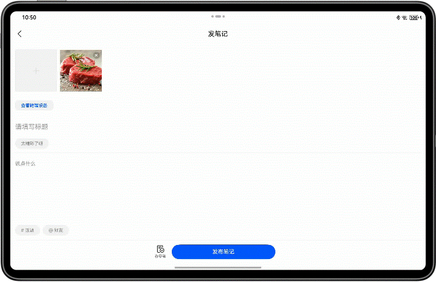
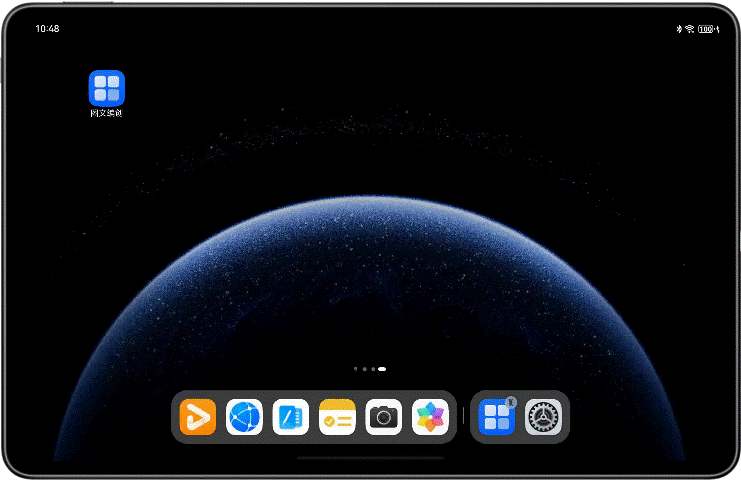

# AI辅助图文内容编创

更新时间：2026-03-12 08:45:02

来源：https://developer.huawei.com/consumer/cn/doc/best-practices/bpta-content-creation

## 概述


本场景实现社交通讯类应用的图文内容编创流程，接入自由流转、服务互动等HarmonyOS特性能力。


## 整体场景介绍


图文编创流程主要通过Photo Picker选取本地图片，然后对图片进行智能处理，同时也可使用自定义相机拍摄动图，最后进行文字编创时可进行自由流转接续编辑和跨端获取相册或相机拍摄内容。


### 演示效果


图文编创操作流程


## 场景适用说明


### 适用范围


本场景适用于社交通讯类应用，图文内容编辑过程中接入HarmonyOS特性能力，提供详细技术实现方案，降低开发者学习成本，提高接入速度。


## 场景优势


本场景结合HarmonyOS的跨设备互通、智能处理、自由流转等能力，提升用户内容发布体验。具体优势如下：

（1）跨设备互通能力使多设备用户可以灵活选择存储在不同设备上的媒体资源，并使用不同设备的拍摄能力获取新图像，简化了不同设备间的数据传输流程，提升了用户体验。

（2）HarmonyOS智能的使用，为用户提供了强大的编创能力支持。用户可以从图中提取有效信息进行文字编辑，可以从候选图中提取目标去除背景，进行二次创作。这些技术的应用，为用户提供了更丰富的编创选择。

（3）自由流转能力的接入，可无缝切换至其他设备，并同步最新编辑状态至新设备，用户可以灵活选择合适设备，实现接续编辑。


## 场景分析


### 典型场景分析


| 子场景名称 | 描述 | 实现方案 |
| --- | --- | --- |
| 图片视图选择 | 发布首页资源文件类型选择 | 使用Photo Picker能力实现图片选择 |
| 相机拍摄 | 自定义相机页面，可拍摄和预览Moving Photo图片 | 使用Camera相机组件能力自定义相机 |
| 图片文字识别、抠取与HDR Vivid图片的展示 | 图片浏览页支持选定图片的目标抠取、复制图上文字信息获取，参与创作编辑，自动识别HDR模式并展示高亮 | 使用Image组件的智能识别能力，实现OCR文字识别与抠图 |
| 跨端相册选取 | 从其他设备的相册中选取图片，回传到本端设备 | 基于CollaborationService跨设备互通组件 |
| 编辑页流转接续 | 编创内容支持在多设备之间接续编辑。开发者可以在不同设备上继续编辑内容 | 基于Ability的自由流转能力，使用ArkData数据管理和分布式文件管理实现本地创作内容的多设备之间接续编辑 |


## 场景实现


## Photo Picker的使用


### 子场景描述


用户在首页点击进入发布流程时，将直接跳转到半模态窗口的Picker页面。该页面支持自定义，为开发者提供更多选择。


### 关键点说明


使用系统Picker能力，可以免申请权限读写权限'READ_IMAGEVIDEO'和'WRITE_IMAGEVIDEO'，给开发者提供了极大的便利。


### 关键代码


首先在使用前，需要先创建PhotoViewPicker实例。

```ts
const photoViewPicker = new photoAccessHelper.PhotoViewPicker();
```

根据业务逻辑需要进行图片选择环节的属性设置，如设置可选择的媒体资源类型、资源数量上限。

```ts
const photoSelectOptions = new photoAccessHelper.PhotoSelectOptions();
photoSelectOptions.MIMEType = photoAccessHelper.PhotoViewMIMETypes.IMAGE_TYPE;
photoSelectOptions.maxSelectNumber =
  CommonConstants.LIMIT_PICKER_NUM - selectedNum;
```

发起调用，获取图片。
```ts
photoViewPicker
  .select(photoSelectOptions)
  .then((photoSelectResult: photoAccessHelper.PhotoSelectResult) => {
    let uriArr = photoSelectResult.photoUris;
    callback(uriArr);
  })
  .catch((err: BusinessError) => {
    Logger.error(
      UIUtils.tag,
      `Invoke photoViewPicker.select failed, code is ${err.code}, message is ${err.message}`,
    );
  });
```


## OCR文字识别、智能抠图与HDR vivid的使用


### 子场景描述


选取图片后，可以浏览图片并长按物体实现目标抠取，同时可以识别图片中的文字以供后续文本编辑使用。如果图片采用HDR Vivid模式拍摄，将展示其效果。


### 演示效果


长按图片可识别文字并实现物体抠图


### 关键点说明


（1）在Image组件中，设置enableAnalyzer属性可实现OCR文字识别和抠图；设置dynamicRangeMode属性可展示HDR高亮，需配合image.DecodingOptions配置动态范围模式。

（2）图片可OCR文字识别时，点击图片内出现的识别按钮或长按文字，会出现复制文本菜单和文字框选区域。

（3）抠图：长按图片中的物体，出现抠图效果，菜单中可复制与分享。


### 关键代码


开启图片智能分析属性并设置图像的动态模式。

```ts
Image(item)
  .objectFit(ImageFit.Contain)
  .enableAnalyzer(true)
  .dynamicRangeMode(DynamicRangeMode.HIGH);
```

设置图片解码选项，配合动态模式。

```ts
public static options: image.DecodingOptions = {
  index: 0,
  editable: false,
  desiredPixelFormat: image.PixelMapFormat.RGBA_8888,
};

static createPixelMap(uri: string): ImageInfo | undefined {
  let imageInfo: ImageInfo | undefined;
  try {
    let file = fs.openSync(uri, fs.OpenMode.READ_ONLY);
    let displayName = file.name;
    let imageResource = image.createImageSource(file.fd);
    let pixelMap = imageResource.createPixelMapSync(FileUtils.options);
    imageInfo = { imagePixelMap: pixelMap, imageName: displayName };
    fs.closeSync(file);
  } catch (error) {
    Logger.error(FileUtils.tag, `createPixelMap error: ${JSON.stringify(error)}`);
  }
  return imageInfo;
}
```


## Moving Photo的拍摄与展示


## 子场景描述


在编辑图片页，增加一个自定义相机tab项，开发者可以根据自身需求，设置并拍摄多种模式的照片，用于内容展示。


### 关键点说明


（1）相机初始化后，可设置Moving Photo属性，默认关闭。当前场景中，若设置为开启，可点击Moving Photo按钮切换状态。

（2）获取拍摄的最新图片，需要在拍摄完成后等待30秒，然后才能获取到最新图片。

（3）使用MovingPhotoView视图预览Moving Photo图片，长按可播放。

（4）申请对应权限，同意后初始化相机。


### 关键代码


申请对应权限。

```ts
private permissions: Array<Permissions> = [
'ohos.permission.CAMERA',
'ohos.permission.MICROPHONE',
'ohos.permission.MEDIA_LOCATION',
'ohos.permission.READ_IMAGEVIDEO',
'ohos.permission.WRITE_IMAGEVIDEO',
];
abilityAccessCtrl.createAtManager().requestPermissionsFromUser(DataUtils.context, this.permissions).then(() => {
  this.surfaceId = this.mXComponentController.getXComponentSurfaceId();
  this.initCamera();
  this.getThumbnail();
})
```

相机设置Moving Photo属性。

```ts
setEnableLivePhoto(isMovingPhoto: boolean) {
  try {
    if (this.photoOutput?.isMovingPhotoSupported()) {
      this.photoOutput?.enableMovingPhoto(isMovingPhoto);
    }
  } catch (error) {
    Logger.error(this.tag, `The setEnableLivePhoto call failed. error: ${JSON.stringify(error)}`);
  }
}
```

获取媒体库中最新图片地址与缩略图。
```ts
async getThumbnail(): Promise<void> {
  try {
    let photoAsset: photoAccessHelper.PhotoAsset =
    AppStorage.get(CommonConstants.KEY_PHOTO_ASSET) as photoAccessHelper.PhotoAsset;
    if (photoAsset === undefined) {
      return;
    }
    this.currentImg = await photoAsset.getThumbnail();
  } catch (error) {
    Logger.error(this.tag, `getThumbnail error: ${JSON.stringify(error)}`);
  }
}
```


引入Moving Photo相关库。

```ts
import {
  MovingPhotoView,
  MovingPhotoViewController,
  MovingPhotoViewAttribute,
} from '@ohos.multimedia.movingphotoview';
```

通过拍摄后获取的photoAccessHelper.PhotoAsset请求Moving Photo。

```ts
@StorageLink(CommonConstants.KEY_MOVING_DATA) src: photoAccessHelper.MovingPhoto | undefined = undefined;
@StorageLink(CommonConstants.KEY_IMAGE_INFO) imageInfoArr: Array<ImageInfo> = [];
@State isMuted: boolean = false;
async aboutToAppear(): Promise<void> {
  // ...
  this.requestMovingPhoto();
}

private requestMovingPhoto() {
  let photoAsset: photoAccessHelper.PhotoAsset =
  AppStorage.get(CommonConstants.KEY_PHOTO_ASSET) as photoAccessHelper.PhotoAsset;
  if (photoAsset === undefined) {
    return;
  }
  let requestOptions: photoAccessHelper.RequestOptions = {
    deliveryMode: photoAccessHelper.DeliveryMode.FAST_MODE,
  }
  photoAccessHelper.MediaAssetManager.requestMovingPhoto(DataUtils.context, photoAsset, requestOptions,
  new MediaDataHandlerMovingPhoto()).catch(() => {
    Logger.error(this.tag, `requestMovingPhoto fail!`);
  });
}

class MediaDataHandlerMovingPhoto implements photoAccessHelper.MediaAssetDataHandler<photoAccessHelper.MovingPhoto> {
  async onDataPrepared(movingPhoto: photoAccessHelper.MovingPhoto): Promise<void> {
    AppStorage.setOrCreate(CommonConstants.KEY_MOVING_DATA, movingPhoto);
  }
}
```

添加Moving Photo展示图。

```ts
build() {
  Flex({
    direction: new BreakpointType(
    {
      sm: FlexDirection.Column,
      md: FlexDirection.Column,
      lg: FlexDirection.Row,
    }
    ).getValue(this.currentBreakpoint),
    wrap: FlexWrap.NoWrap,
    justifyContent: FlexAlign.Start,
    alignItems: ItemAlign.Start,
    alignContent: FlexAlign.Start
  }) {
    this.setActions();
    MovingPhotoView({
      movingPhoto: this.src,
      controller: this.controller
    })
    .width($r('app.string.full_screen'))
    .objectFit(ImageFit.Contain)
    .muted(this.isMuted)
    .margin(new BreakpointType(
    {
      sm: { bottom: $r('app.float.margin_190') } as Padding,
      md: { bottom: $r('app.float.margin_190') } as Padding,
      lg: { right: $r('app.float.margin_24') } as Padding,
    }
    ).getValue(this.currentBreakpoint))
  }
  .backgroundColor(Color.Black)
  .width($r('app.string.full_screen'))
  .height($r('app.string.full_screen'))
}
```


> [!NOTE]
> 本章节只介绍主干流程的关键代码，要实现自定义相机还需要其他配置，可详细关注封装模块CameraService文件，Moving Photo的使用可查看相关Api使用：[动图照片](https://developer.huawei.com/consumer/cn/doc/harmonyos-references/ohos-multimedia-movingphotoview)。


## 跨设备互通组件的使用


### 演示效果


跨端相册获取新的图片





### 子场景描述


通过跨设备互通组件，实现跨端相册访问和跨端相机拍照，从其他设备获取新的图像内容，提高设备间图像传输的快捷性和便利性。


### 关键点说明


（1）使用跨设备互通组件需要连接网络并登录相同账号。


当前跨设备互通能力仅支持“重”设备调用“轻”设备，其中“重”设备指重量较大、便携性较差的设备，“轻”设备指重量较轻、便携性较好的设备。设备间可跨端调用关系如下说明：

（1）平板可调用手机，但无法调用其他平板。

（2）手机无法调用平板，也无法调用其他手机。


### 关键代码


跨端拍照与跨端相册访问

使用createCollaborationServiceMenuItems定义设备列表选择器，显示组网内具有相机能力的设备列表。

```ts
import {
  CollaborationServiceFilter,
  CollaborationServiceStateDialog,
  createCollaborationServiceMenuItems
} from '@kit.ServiceCollaborationKit';
@Builder
CollaborationMenu() {
  Menu() {
    createCollaborationServiceMenuItems([CollaborationServiceFilter.ALL]);
  }
}
```

使用CollaborationCameraStateDialog弹窗组件提示对端相机拍摄状态。

该组件在build()函数内直接调用，实现onState方法。拍摄完成后，通过onState方法回传内容。

onState方法的回调函数包含两个参数：stateCode表示业务完成状态，buffer表示成功返回的数据。

```ts
@Builder
setCollaborationDialog() {
  CollaborationServiceStateDialog({
    onState: (stateCode: number, bufferType: string, buffer: ArrayBuffer): void => this.doInsertPicture(stateCode,
    bufferType, buffer)
  });
}

private doInsertPicture(stateCode: number, bufferType: string, buffer: ArrayBuffer): void {
  if (stateCode !== 0) {
    Logger.error(this.tag, `doInsertPicture stateCode: ${stateCode}}`);
    return;
  }
  Logger.info(this.tag, `doInsertPicture bufferType: ${bufferType}}`);
  if (bufferType === CommonConstants.BUFFER_TYPE) {
    if (this.imageInfoArr.length === CommonConstants.LIMIT_PICKER_NUM) {
      try {
        this.getUIContext().getPromptAction().showToast({
          message: $r('app.string.toast_picker_limit'),
          duration: DataUtils.fromResToNumber($r('app.float.show_DELAY_TIME')),
        });
      } catch (error) {
        Logger.error(this.tag, `showToast error: ${JSON.stringify(error)}}`);
      }
      return;
    }
    let saveUri: string = FileUtils.saveFile(DataUtils.context, buffer);
    let imageInfo: ImageInfo | undefined = FileUtils.createPixelMap(saveUri);
    if (imageInfo) {
      this.imageInfoArr.unshift(imageInfo);
      this.selectedData.unshiftData(imageInfo.imagePixelMap);
      // copy file to distributedFilesDir
      FileUtils.copyFileToDestination(saveUri, DataUtils.context.distributedFilesDir);
    }
  }
}
```


## 应用接续的实现


### 子场景描述


使用Ability的自由流转能力，编辑内容可以流转到其他设备上进行接续编辑，方便用户在不同设备上编辑。


### 演示效果


自由流转，接续编辑图文内容的功能已启用。





### 关键点说明


接续使用条件

（1）两端设备登录同一华为账号。

（2）两端设备打开Wi-Fi和蓝牙开关，连接同一局域网，可提升数据传输速度。

（3）应用接续只能在同应用（UIAbility）之间触发，双端设备都需要该应用。

（4）在onContinue回调中使用wantParam传输的数据应控制在100KB以内。对于大于100KB的数据，建议使用分布式数据对象或分布式文件系统，例如图片文件。

申请权限需要在module.json5文件中的module对象的requestPermissions属性中进行。

```ts
"requestPermissions": [
{
  "name": "ohos.permission.DISTRIBUTED_DATASYNC",
  "reason": "$string:distributed_desc",
  "usedScene": {
    "abilities": [
    "EntryAbility"
    ],
    "when": "always"
  }
}
// ...
]
```

打开应用接续开关，在module.json5文件里的module对象的abilities字段内设置"continuable"的值为true。
```ts
"abilities": [
{
  // ...
  "continuable": true,
  // ...
}
]
```


### 关键代码


应用接续可以按需迁移路由栈，也可选择动态配置，仅对特定页面开启接续，此处仅设置最后的图文编辑页面GraphicCreationPage开启接续能力。按需迁移路由栈的方法具体可参考应用接续开发指导：按需迁移页面栈。

```ts
onPageShow(): void {
  DataUtils.context.setMissionContinueState(AbilityConstant.ContinueState.ACTIVE, (result) => {
    Logger.info('setMissionContinueState ACTIVE result: ', `${result.code}`);
  });
}

aboutToDisappear(): void {
  this.title = '';
  this.description = '';
  DataUtils.context.setMissionContinueState(AbilityConstant.ContinueState.INACTIVE, (result) => {
    Logger.info('setMissionContinueState INACTIVE result: ', `${result.code}`);
  });
}
```

设置迁移加载指定页面。

```ts
onWindowStageRestore(windowStage: window.WindowStage) {
  windowStage.loadContent('pages/GraphicCreationPage', (err, data) => {
    // ...
  });
}
```

迁移端实现onContinue接口，多图片自由流转，使用资产卡片数组的方式传递，与其他文本数据分装成一个数据对象。
```ts
async onContinue(wantParam: Record<string, Object | undefined>): Promise<AbilityConstant.OnContinueResult> {
  try {
    // get distribute id
    let sessionId: string = distributedDataObject.genSessionId();
    wantParam.distributedSessionId = sessionId;
    // set images assets info
    let imageInfoArray = AppStorage.get<Array<ImageInfo>>(CommonConstants.KEY_IMAGE_INFO);
    let assets: commonType.Assets = [];
    if (imageInfoArray) {
      for (let i = 0; i < imageInfoArray.length; i++) {
        let append = imageInfoArray[i];
        let attachment: commonType.Asset | undefined = this.getAssetInfo(append);
        if (attachment === undefined) {
          continue;
        }
        assets.push(attachment);
      }
    }
    // set distribute data object
    let contentInfo: ContentInfo = new ContentInfo(
    AppStorage.get(CommonConstants.KEY_TITLE),
    AppStorage.get(CommonConstants.KEY_DESCRIPTION),
    AppStorage.get(CommonConstants.KEY_IMAGE_INFO),
    assets
    );
    let source = contentInfo.flatAssets();
    // save data to distribute
    this.distributedObject = distributedDataObject.create(this.context, source);
    Logger.info(this.tag, `onContinue source: ${JSON.stringify(source)}`);
    this.distributedObject.setSessionId(sessionId);
    await this.distributedObject.save(wantParam.targetDevice as string).catch((err: BusinessError) => {
      Logger.error(this.tag, `Failed to save. Code: ${err.code}, message: ${err.message}`);
    });
  } catch (error) {
    Logger.error(this.tag, 'distributedDataObject failed', `code ${(error as BusinessError).code}`);
  }
  return AbilityConstant.OnContinueResult.AGREE;
}

private getAssetInfo(append: ImageInfo): commonType.Asset | undefined {
  let filePath = this.context.distributedFilesDir + '/' + append.imageName;
  try {
    fs.statSync(filePath);
    let uri: string = fileUri.getUriFromPath(filePath);
    let stat = fs.statSync(filePath);
    let attachment: commonType.Asset = {
      name: append.imageName,
      uri: uri,
      path: filePath,
      createTime: stat.ctime.toString(),
      modifyTime: stat.ctime.toString(),
      size: stat.size.toString()
    };
    Logger.info(this.tag, `getAssetInfo attachment = ${JSON.stringify(attachment)}`);
    return attachment;
  } catch (error) {
    Logger.error(this.tag, `getAssetInfo error: ${JSON.stringify(error)}`);
    return undefined;
  }
}
```


> [!NOTE]
> 这部分代码写在EntryAbility中，而不是Page页中。使用AppStorage进行数据的持续保存和双向绑定，当数据变化时更新视图。


接收端实现onCreate接口和onNewWant接口，onCreate接口用于冷启动或多实例热启动，onNewWant接口用于单实例热启动。仅在应用接续状态下，注册数据监听，恢复页面流转的数据。

```ts
onCreate(want: Want, launchParam: AbilityConstant.LaunchParam): void {
  DataUtils.context = this.context;
  // set circulation status INACTIVE
  this.context.setMissionContinueState(AbilityConstant.ContinueState.INACTIVE, (result) => {
    Logger.info(`restoreDistributedObject setMissionContinueState code: ${result.code}`);
  });
  this.restoreDistributedObject(want, launchParam);
  Logger.info(this.tag, '%{public}s', 'Ability onCreate');
}

onNewWant(want: Want, launchParam: AbilityConstant.LaunchParam): void {
  this.restoreDistributedObject(want, launchParam);
}

private restoreDistributedObject(want: Want, launchParam: AbilityConstant.LaunchParam): void {
  if (launchParam.launchReason !== AbilityConstant.LaunchReason.CONTINUATION) {
    return;
  }
  try {
    // File copying takes a long time, resulting in the page lifecycle aboutToAppear being executed first.
    let imageInfoArr: ImageInfo[] = [];
    AppStorage.setOrCreate(CommonConstants.KEY_IMAGE_INFO, imageInfoArr);
    let contentInfo: ContentInfo = new ContentInfo(undefined, undefined, undefined, undefined);
    // 创建分布式数据对象
    this.distributedObject = distributedDataObject.create(this.context, contentInfo);
    // Add a data restored listener.
    this.distributedObject.on('status',
    (_sessionId: string, _networkId: string, status: 'online' | 'offline' | 'restored') => {
      if (status === 'restored') {
        if (!this.distributedObject) {
          return;
        }
        AppStorage.setOrCreate(CommonConstants.KEY_TITLE, this.distributedObject['title']);
        AppStorage.setOrCreate(CommonConstants.KEY_DESCRIPTION, this.distributedObject['description']);
        let attachments = this.distributedObject['attachments'] as commonType.Assets;
        if (attachments) {
          for (const attachment of attachments) {
            let sourceUri: string =
            fileUri.getUriFromPath(`${this.context.distributedFilesDir}/${attachment.name}`);
            let destination: string = this.context.filesDir;
            FileUtils.copyFileToDestination(sourceUri, destination);
            let uri: string = `${this.context.filesDir}/${attachment.name}`;
            let imageInfo = FileUtils.createPixelMap(uri);
            if (imageInfo) {
              imageInfoArr.push(imageInfo);
            }
          }
        }
        AppStorage.set(CommonConstants.KEY_IMAGE_INFO, imageInfoArr);
        AppStorage.setOrCreate(CommonConstants.KEY_RESTORE_IMAGE_INFO, imageInfoArr);
      }
    });
    let sessionId: string = want.parameters?.distributedSessionId as string;
    this.distributedObject.setSessionId(sessionId);
    this.context.restoreWindowStage(new LocalStorage());
  } catch (error) {
    Logger.info(`restoreDistributedObject error: ${JSON.stringify(error)}`);
  }
}
```

图片的流转需要借助分布式文件系统，发送侧需将文件拷贝到分布式目录下，接受侧再从分布式目录拷贝到本地沙箱使用。

```ts
static copyFileToDestination(sourceUri: string, destination: string) {
  try {
    let buf = new ArrayBuffer(CommonConstants.FILE_BUFFER_SIZE);
    let readSize = 0;
    let file = fs.openSync(sourceUri, fs.OpenMode.READ_ONLY);
    let readLen = fs.readSync(file.fd, buf, { offset: readSize });
    let destinationDistribute =
    fs.openSync(`${destination}/${file.name}`, fs.OpenMode.READ_WRITE | fs.OpenMode.CREATE);
    while (readLen > 0) {
      readSize += readLen;
      fs.writeSync(destinationDistribute.fd, buf);
      readLen = fs.readSync(file.fd, buf, { offset: readSize });
    }
    Logger.info(FileUtils.tag, 'copyFileToDestination success');
    fs.closeSync(file);
    fs.closeSync(destinationDistribute);
  } catch (err) {
    Logger.error(FileUtils.tag, `copyFileToDestination failed. Code: ${err.code}, message: ${err.message}`);
  }
}
```


## 示例代码


- [基于AI能力实现图文内容高效编创](https://gitcode.com/HarmonyOS_Samples/graphic-creation)
