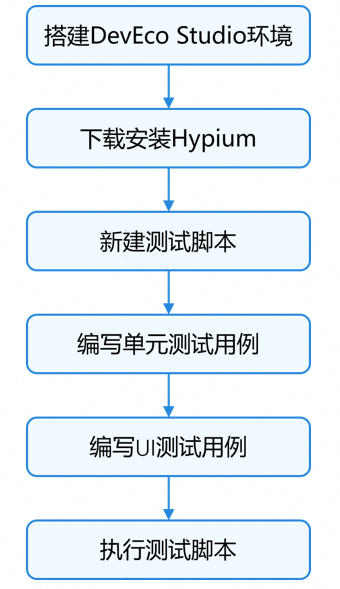
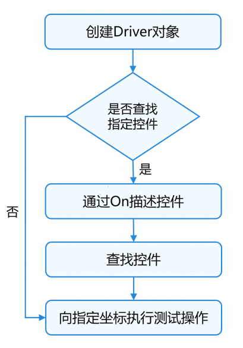
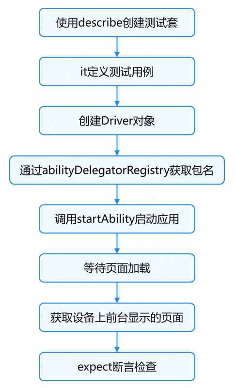
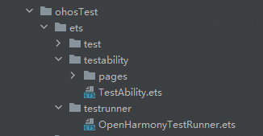

# 自动化测试框架开发实践

更新时间：2026-03-12 08:45:02

来源：https://developer.huawei.com/consumer/cn/doc/best-practices/bpta-automated-testing-frameworks

##### 概述

[自动化测试框架](https://developer.huawei.com/consumer/cn/doc/harmonyos-guides/arkxtest-guidelines)是一套面向多设备、全场景的端侧测试体系，基于DevEco Studio开发环境和hvigor构建系统，整合了UI测试（[@ohos.UiTest](https://developer.huawei.com/consumer/cn/doc/harmonyos-references/js-apis-uitest)）、单元测试（[@ohos/hypium](https://ohpm.openharmony.cn/#/cn/detail/@ohos%2Fhypium)）等能力，通过标准化的工程结构、编码规范与执行流程，支撑开发者实现高效高质量验证。
 
该框架涵盖[单元测试框架](https://developer.huawei.com/consumer/cn/doc/harmonyos-guides/unittest-guidelines)、[UI测试框架](https://developer.huawei.com/consumer/cn/doc/harmonyos-guides/uitest-guidelines)和[白盒性能测试框架](https://developer.huawei.com/consumer/cn/doc/harmonyos-guides/perftest-guideline)。
 
- 单元测试框架：是自动化测试框架基础底座，UI测试脚本和性能测试脚本需基于单元测试框架进行开发，用于定义测试用例及验证执行结果。
- UI测试框架：调用[UiTest](https://developer.huawei.com/consumer/cn/doc/harmonyos-references/js-apis-uitest)接口进行UI界面查找和模拟操作。
- 白盒性能测试框架：调用[PerfTest](https://developer.huawei.com/consumer/cn/doc/harmonyos-references/js-apis-perftest)接口采集和度量测试应用内指定逻辑执行时的基础性能数据。

 
本文介绍了单元测试框架和UI测试框架的实现，旨在帮助开发者了解和掌握自动化测试框架的开发流程与实现细节。关键步骤如下：
 



 
 

##### 场景案例

 

##### 场景描述

本节基于官网codelab[《从简单页面开始》](https://developer.huawei.com/consumer/cn/codelabsPortal/carddetails/tutorials_PageAndData01)介绍自动化测试框架的开发流程与实现细节，主要涵盖单元测试和UI测试两部分，开发者可根据具体业务场景对应用实施自动化测试。
 
 

##### 实现原理

- **单元测试**使用单元测试框架通过Mock隔离被测代码与外部依赖，在无需启动完整应用的前提下，对应用逻辑（如工具函数、业务服务等）进行快速、隔离、可重复的验证。本文采用该框架的以下特性来实现单元测试：

| 特性 | 使用说明 | 使用场景 |

| --- | --- | --- |

| 基础流程能力 | 通过基础流程能力如describe、it等接口定义测试套和测试用例。并对测试套和测试用例设置预置条件和清理条件。 | 定义测试套和测试用例，以及测试用例执行前需要预置条件和执行后需要清理条件的场景，如：设置定时器和清理定时器。 |

| 断言能力 | 使用如assertEqual等断言接口判断检验实际值是否等于预期值。 | 检验函数功能是否正常。 |

| Mock能力 | 使用Mock能力，Mock自定义对象的函数。 | 函数依赖外部资源或复杂逻辑，如：依赖网络请求返回值。 |

| 数据驱动 | 使用数据驱动能力，对测试套或者测试用例执行若干次。 | 多个测试用例或测试套有相同类型参数，如：进行压力测试。 |

 
- **UI测试**通过[DevEco Testing](https://developer.huawei.com/consumer/cn/doc/harmonyos-guides/deveco-testing)的UIViewer获取屏幕坐标点信息，并使用UI测试框架接口对指定坐标点或指定控件注入模拟的输入事件（如点击、滑动等），实现界面交互和验证的自动化。本文针对不同UI测试场景提供如下实现方案：

| 场景 | 实现方案 |

| --- | --- |

| 查找组件 | 创建On对象，通过id或type描述目标控件，然后使用findComponent()根据目标控件的属性要求查找该控件。 |

| 模拟输入 | 通过inputText()模拟文本输入。 |

| 模拟点击 | 通过Component或Driver中的click属性模拟点击。 |

| 模拟触摸屏手指滑动 | 通过swipe()方法模拟对轮播图的滑动。 |

| 等待页面加载 | 使用waitForIdle()等待当前界面的所有控件空闲后，再进行下一步操作。 |

  UI测试流程图如下：

  



 
 

##### 开发步骤
1. 搭建DevEco Studio环境测试脚本基于DevEco Studio编写，开发者需先下载[DevEco Studio](https://developer.huawei.com/consumer/cn/download/)并完成[环境准备](https://developer.huawei.com/consumer/cn/doc/harmonyos-guides/hdc#环境准备)。
2. 下载安装HypiumHypium是OpenHarmony上的测试框架，提供测试用例的编写、执行及结果显示功能，用于OpenHarmony系统应用接口和应用界面的测试。使用DevEco Studio打开测试项目，并按以下方案进行配置。

  
> [!NOTE]
> 本示例使用的Hypium版本为@ohos/hypium(V1.0.24)，若开发者需使用最新版本，请查看 @ohos/hypium 。


  
- 方案一：通过ohpm命令下载@ohos/hypium。
```text
ohpm install @ohos/hypium@1.0.24 --save-dev
```


3. 方案二：在应用工程的[oh-package.json5](https://developer.huawei.com/consumer/cn/doc/harmonyos-guides/ide-oh-package-json5)文件的devDependencies中配置版本号，然后点击编辑器窗口上方的“Sync Now”同步工程，即可使用对应版本的框架功能。



4. 新建测试脚本参考[创建ArkTS测试用例](https://developer.huawei.com/consumer/cn/doc/harmonyos-guides/ide-instrument-test#section36049271219)，导入所需的[单元测试框架能力](https://developer.huawei.com/consumer/cn/doc/harmonyos-guides/unittest-guidelines#单元测试框架能力使用说明)及其他测试脚本中依赖的接口，[编写单元测试脚本](https://developer.huawei.com/consumer/cn/doc/harmonyos-guides/unittest-guidelines#编写单元测试脚本)。

  启动被测试页面，检查设备显示的页面是否为预期页面。流程图如下：

  



  在自动化测试中，常用[基础流程能力](https://developer.huawei.com/consumer/cn/doc/harmonyos-guides/unittest-guidelines#基础流程能力)的it定义测试用例，其参数如下：

| 参数名 | 类型 | 必填 | 说明 |

| --- | --- | --- | --- |

| testCaseName | string | 是 | 测试用例的名称，用于标识该测试用例。 |

| attribute | TestType \| Size \| Level | 是 | 测试类型，用于标记测试用例的类型。 |

| func | Function | 是 | 异步函数（async），包含测试用例的具体逻辑。 |

  使用it创建测试用例后，通过[AbilityDelegatorRegistry](https://developer.huawei.com/consumer/cn/doc/harmonyos-references/js-apis-app-ability-abilitydelegatorregistry)获取应用包名，构造want启动对象、调用[startAbility()](https://developer.huawei.com/consumer/cn/doc/harmonyos-references/js-apis-inner-application-abilitydelegator#startability9)启动应用。在应用加载完成后，调用[getCurrentTopAbility()](https://developer.huawei.com/consumer/cn/doc/harmonyos-references/js-apis-inner-application-abilitydelegator#getcurrenttopability9)获取设备上前台显示页面，并使用[expect()](https://developer.huawei.com/consumer/cn/doc/harmonyos-guides/unittest-guidelines#基础流程能力)和[assertEqual()](https://developer.huawei.com/consumer/cn/doc/harmonyos-guides/unittest-guidelines#断言能力)断言当前页面是否为预期启动页面。

  
```ArkTS
const delegator: abilityDelegatorRegistry.AbilityDelegator = abilityDelegatorRegistry.getAbilityDelegator();

export default function UITest() {
  describe('UITest', () => {

    /**
     * Start the application to be tested.
     */
    it('startApp', Level.LEVEL3, async (done: Function) => {
      hilog.info(0x0000, 'testTag', '%{public}s', "UITest: TestUiExample begin");
      // Initialize the Driver object.
      const driver = Driver.create();
      const bundleName = abilityDelegatorRegistry.getArguments().bundleName;
      // Specify the bundle name and ability name of the application to be tested.
      const want: Want = {
        bundleName: bundleName,
        abilityName: 'EntryAbility'
      }
      // Start the application to be tested.
      await delegator.startAbility(want);
      // Wait until the application starts.
      await driver.waitForIdle(4000, 5000);
      const ability: UIAbility = await delegator.getCurrentTopAbility();
      hilog.info(0x0000, 'testTag', '%{public}s', "get top ability");
      // Ensure that the top ability of the application is the specified ability.
      expect(ability.context.abilityInfo.name).assertEqual('EntryAbility');
      done();
    })
    // ...
  })
}
```


5. 编写单元测试用例
[基础流程能力](https://developer.huawei.com/consumer/cn/doc/harmonyos-guides/unittest-guidelines#基础流程能力)使用基础流程能力[beforeAll()](https://developer.huawei.com/consumer/cn/doc/harmonyos-guides/unittest-guidelines#基础流程能力)定义预置条件，[afterAll()](https://developer.huawei.com/consumer/cn/doc/harmonyos-guides/unittest-guidelines#基础流程能力)定义清理条件。预置条件在所有测试用例开始前执行一次，清理条件在所有测试用例结束后执行一次。

  
```ArkTS
let success = -1;
let timeout = 0;

beforeAll(() => {
  // Preset increment action before all test cases of the test suite start.
  success++;
  // Set a timer before all test cases of the test suite start.
  timeout = setTimeout(() => {
    hilog.info(0x0000, 'testTag', '%{public}s', 'setTimeout');
  }, 1000);
})

beforeEach(() => {
  // Preset increment action before each test case of the test suite starts.
  success++;
})

afterEach(() => {
  hilog.info(0x0000, 'testTag', '%{public}s', `success: ${success}`);
})

afterAll(() => {
  hilog.info(0x0000, 'testTag', '%{public}s', 'AfterAll executed');
  hilog.info(0x0000, 'testTag', '%{public}s', `success: ${success}`);
  // Clear the timer After all test cases of the test suite end.
  clearTimeout(timeout);
})
```


6. [断言能力](https://developer.huawei.com/consumer/cn/doc/harmonyos-guides/unittest-guidelines#断言能力)通过[assertUndefined()](https://developer.huawei.com/consumer/cn/doc/harmonyos-guides/unittest-guidelines#断言能力)判断被检验的值是否为undefined，并使用[assertEqual()](https://developer.huawei.com/consumer/cn/doc/harmonyos-guides/unittest-guidelines#断言能力)检验实际值是否符合预期值。

  
```ArkTS
it('inputAccountLength', 0, () => {
  let inputAccountLength = CommonConstants.INPUT_ACCOUNT_LENGTH;
  // Check if INPUT_ACCOUNT_LENGTH is not undefined.
  expect(inputAccountLength).not().assertUndefined();
  expect(inputAccountLength).assertEqual(11);
})
```
 检验mainViewModel类中自定义函数返回值的长度及数据类型是否符合预期。

  
```ArkTS
it('getFirstGridData', 0, () => {
  const firstGridData = mainViewModel.getFirstGridData();
  // Verify if the return value of getFirstGridData is eight.
  expect(firstGridData.length).assertEqual(8);
  // Verify if the type of firstGridData[0] is 'ItemData'.
  expect(firstGridData[0] instanceof ItemData).assertTrue();
})
```


7. [Mock能力](https://developer.huawei.com/consumer/cn/doc/harmonyos-guides/unittest-guidelines#mock能力)对mainViewModel类中的getSwiperImages()函数进行Mock，并设置函数被Mock后的返回值。用例执行完毕后，恢复被Mock对象的实例。

  
```ArkTS
it('getSwiperImages', 0, () => {
  const swiperImages = mainViewModel.getSwiperImages();
  expect(swiperImages).assertInstanceOf('Array');
  expect(swiperImages.length).assertEqual(4);
  // Mock the getSwiperImages function of the mainViewModel class.
  let mocker = new MockKit();
  let getSwiperImages = mocker.mockFunc(mainViewModel, mainViewModel.getSwiperImages);
  // The result '[]' is returned when the function is called with any arguments passed in.
  when(getSwiperImages)(ArgumentMatchers.any).afterReturn([]);
  expect(mainViewModel.getSwiperImages()).assertInstanceOf('Array');
  expect(mainViewModel.getSwiperImages().length).assertEqual(0);
  // Restore the mocked object instances.
  mocker.clear(mainViewModel);
  // Verify if the mocked object instances is restored.
  expect(mainViewModel.getSwiperImages().length).assertEqual(4);
})
```


8. [数据驱动](https://developer.huawei.com/consumer/cn/doc/harmonyos-guides/unittest-guidelines#数据驱动)数据驱动需要使用Ability能力，可参考[自定义Ability和Resources](https://developer.huawei.com/consumer/cn/doc/harmonyos-guides/ide-instrument-test#section760061533)。文件内容示例可在[运行测试用例](https://developer.huawei.com/consumer/cn/doc/harmonyos-guides/ide-instrument-test#section14415226122419)后，在对应模块的build/{productName}/intermediates/src/ohosTest下查看。

  


  定义Ability后需要在module.json5文件中补充配置字段mainElement、pages和abilities。关于字段的具体说明，请参考[module.json5配置文件](https://developer.huawei.com/consumer/cn/doc/harmonyos-guides/module-configuration-file)。

  
```ArkTS
{
  "module": {
    "name": "entry_test",
    "type": "feature",
    "description": "$string:module_test_desc",
    "mainElement": "TestAbility",            // Corresponds to the ability name in the abilities section below.
    "deviceTypes": [
      "phone"
    ],
    "deliveryWithInstall": true,
    "installationFree": false,
    "pages": "$profile:test_pages",          // Corresponds to the test_pages.json file under resources > base > profile.
    "abilities": [                           // Configuration of the ability to add.
      {
        "name": "TestAbility",
        "srcEntry": "./ets/testability/TestAbility.ets",
        "description": "$string:TestAbility_desc",
        "icon": "$media:icon",
        "label": "$string:TestAbility_label",
        "exported": true,
        "startWindowIcon": "$media:icon",
        "startWindowBackground": "$color:start_window_background"
      }
    ]
  }
}
```
 
> [!NOTE]
> build/{productName}/intermediates/src/ohosTest目录下的resources不包含icon图标，需开发者自行添加。


  数据驱动能力依据测试数据配置，驱动测试用例的执行次数及每次执行时的参数传递，使用时依赖data.json配置文件。

  
```json
{
  "suites": [
    {
      "describe": [
        "MainViewModelTest"
      ],
      "stress": 1,
      "items": [
        {
          "it": "testDataDriverAsync",
          "stress": 2,
          "params": [
            {
              "name": "tom",
              "value": 5
            },
            {
              "name": "jerry",
              "value": 4
            }
          ]
        },
        {
          "it": "testDataDriver",
          "stress": 3
        }
      ]
    }
  ]
}
```
 Stage模型在测试工程中的TestAbility目录下TestAbility.ets文件中导入data.json，并在文件中的Hypium.hypiumTest()函数执行前设置参数数据。

  
```ArkTS
export default class TestAbility extends UIAbility {
  abilityDelegator: abilityDelegatorRegistry.AbilityDelegator;

  constructor() {
    super();
    this.abilityDelegator = abilityDelegatorRegistry.getAbilityDelegator();
  }

  onCreate(want: Want, launchParam: AbilityConstant.LaunchParam) {
    hilog.info(0x0000, 'testTag', '%{public}s', 'TestAbility onCreate');
    hilog.info(0x0000, 'testTag', '%{public}s', 'want param:' + JSON.stringify(want) ?? '');
    hilog.info(0x0000, 'testTag', '%{public}s', 'launchParam:' + JSON.stringify(launchParam) ?? '');
    let abilityDelegatorArguments: abilityDelegatorRegistry.AbilityDelegatorArgs;
    abilityDelegatorArguments = abilityDelegatorRegistry.getArguments();
    hilog.info(0x0000, 'testTag', '%{public}s', 'start run testcase!!!');
    // Set the data before Hypium.hypiumTest() is executed.
    Hypium.setData(data);
    Hypium.hypiumTest(this.abilityDelegator, abilityDelegatorArguments, testsuite);
  }

  // ...
}
```
 在data.json文件配置的测试套（MainViewModelTest）中定义测试用例，测试用例名称应与配置文件中items下的it名称一致。

  
```ArkTS
interface ParmObj {
  name: string,
  value: number
}

export default function MainViewModelTest() {
  describe('MainViewModelTest', () => {
    // ...
    it('testDataDriverAsync', 0, async (done: Function, data: ParmObj) => {
      // Use data object to receive parameters passed from data.json.
      hilog.info(0x0000, 'testTag', '%{public}s', `name: ${data.name}`);
      hilog.info(0x0000, 'testTag', '%{public}s', `value: ${data.value}`);
      // The name passed in data.json is either 'tom' or 'jerry'.
      expect(data.name === 'tom' || data.name === 'jerry').assertTrue();
      // Check if the actual value and the expected value '4' are within the allowable error range '1'.
      expect(data.value).assertClose(4, 1);
      done();
    });
    // ...
  })
}
```


9. 编写UI测试用例在UI测试中，开发者可以利用[UiTest](https://developer.huawei.com/consumer/cn/doc/harmonyos-references/js-apis-uitest)接口模拟点击、双击、长按、滑动等操作，以验证应用程序中的UI行为。

  
模拟文本输入通过[On](https://developer.huawei.com/consumer/cn/doc/harmonyos-references/js-apis-uitest#on9)对象匹配目标控件，然后使用[inputText()](https://developer.huawei.com/consumer/cn/doc/harmonyos-references/js-apis-uitest#inputtext9)模拟文本输入。

  
```ArkTS
it('accountInputText', TestType.FUNCTION, async () => {
  let driver = Driver.create();
  // Match TextInput component by id.
  let on = ON.id('account');
  let accountInput = await driver.findComponent(on);
  await accountInput.inputText('123456');
  let account = await accountInput.getText();
  expect(account).assertEqual('123456');
})
```


10. 模拟触摸屏手指操作使用[click()](https://developer.huawei.com/consumer/cn/doc/harmonyos-references/js-apis-uitest#click9-1)模拟触摸屏手指操作以收起键盘，然后通过[findComponent()](https://developer.huawei.com/consumer/cn/doc/harmonyos-references/js-apis-uitest#findcomponent9)查找Button控件，点击该按钮进行登录操作。

  
```ArkTS
it('loginButton', TestType.FUNCTION, async () => {
  let driver = Driver.create();
  // Click the location of the confirm button in the input method to collapse the input method.
  await driver.click(1196, 2511);
  await driver.waitForIdle(2000, 3000);
  // Check if the button is displayed.
  let loginButton = await driver.findComponent(ON.type('Button'));
  await loginButton.click();
  // Wait the application for loading to the main page.
  await driver.waitForIdle(4000, 5000);
})
```
 等待Swiper控件加载完成后，使用[swipe()](https://developer.huawei.com/consumer/cn/doc/harmonyos-references/js-apis-uitest#swipe9)模拟触摸屏手指滑动。

  
```ArkTS
it('swiper', TestType.FUNCTION, async () => {
  let driver = Driver.create();
  // Wait the Swiper component for displaying in the current page.
  await driver.waitForComponent(ON.type('Swiper'), 2000);
  // Check if the Swiper component exists.
  await driver.assertComponentExist(ON.type('Swiper'));
  await driver.waitForIdle(1000, 2000);
  // Swipe the carousel from right to left.
  await driver.swipe(1100, 700, 100, 700, 3000);
  // Wait for the swipe operation to complete.
  await driver.waitForIdle(1000, 2000);
  await driver.swipe(1100, 700, 100, 700, 3000);
  await driver.waitForIdle(1000, 2000);
})
```


11. 页面加载等待使用[swipe()](https://developer.huawei.com/consumer/cn/doc/harmonyos-references/js-apis-uitest#swipe9)切换页面后，通过[waitForIdle()](https://developer.huawei.com/consumer/cn/doc/harmonyos-references/js-apis-uitest#waitforidle9)和[waitForComponent()](https://developer.huawei.com/consumer/cn/doc/harmonyos-references/js-apis-uitest#waitforcomponent9)等待Toggle控件出现来判断页面跳转是否完成。

  
```ArkTS
it('setting', TestType.FUNCTION, async () => {
  let driver = Driver.create();
  await driver.swipe(1100, 1500, 100, 1500, 3000);
  await driver.waitForIdle(1000, 2000);
  // Match the Toggle component in the ListItem component.
  let on = ON.type('Toggle').within(ON.type('ListItem'));
  await driver.waitForComponent(on, 2000);
  await driver.assertComponentExist(on);
  // ...
})
```


12. 执行测试脚本连接目标测试设备（如手机）或模拟器后，在DevEco Studio页面点击对应按钮，或通过命令行执行测试脚本。详细可参考[DevEco Studio执行测试脚本](https://developer.huawei.com/consumer/cn/doc/harmonyos-guides/unittest-guidelines#deveco-studio执行测试脚本)和[命令行执行测试脚本](https://developer.huawei.com/consumer/cn/doc/harmonyos-guides/unittest-guidelines#命令行执行测试脚本)。

  

  ##### 实现效果

  自动化测试实现效果如下图所示：

  


  

  ##### 常见问题

  

  ##### 断言能力assertInstanceOf接口无法检验自定义类型

  **问题现象**

  使用[assertInstanceOf()](https://developer.huawei.com/consumer/cn/doc/harmonyos-guides/unittest-guidelines#断言能力)检验自定义数据类型，脚本运行时报错“Error in getFirstGridData, [object Object] is [object Object]not  ItemData”。

  


  **可能原因**

  [assertInstanceOf()](https://developer.huawei.com/consumer/cn/doc/harmonyos-guides/unittest-guidelines#断言能力)在进行类型判断时，会将对象转换为字符串进行比较。自定义数据类型转换后变为[Object Object]，导致与预期类型不符。

  **解决方案**

  在[expect()](https://developer.huawei.com/consumer/cn/doc/harmonyos-guides/unittest-guidelines#基础流程能力)中进行instanceof类型判断，并使用[assertTrue()](https://developer.huawei.com/consumer/cn/doc/harmonyos-guides/unittest-guidelines#断言能力)进行检验。修改后示例代码如下：

  
```ArkTS
expect(firstGridData[0] instanceof ItemData).assertTrue();
```


  

  ##### UI测试时inputText接口无法输入字母和特殊字符

  **问题现象**

  使用[inputText()](https://developer.huawei.com/consumer/cn/doc/harmonyos-references/js-apis-uitest#inputtext9)对TextInput控件输入文本时，只能输入数字，无法输入字母和特殊字符。

  **可能原因**

  输入框类型为InputType.Number。纯数字输入模式的输入框，只能输入数字[0-9]。

  **解决方案**

  将输入框类型修改为InputType.USER_NAME，开发者可根据业务场景[设置输入框类型](https://developer.huawei.com/consumer/cn/doc/harmonyos-guides/arkts-common-components-text-input#设置输入框类型)后再进行测试。

  

  ##### UI测试时对控件首次操作无效

  **问题现象**

  使用[swipe()](https://developer.huawei.com/consumer/cn/doc/harmonyos-references/js-apis-uitest#swipe9)对Swiper控件滑动时，首次滑动无效，但后续多次滑动均能正常执行。

  **可能原因**

  调用UI操作接口时相关控件还未加载完成。

  **解决方案**

  使用[waitForComponent()](https://developer.huawei.com/consumer/cn/doc/harmonyos-references/js-apis-uitest#waitforcomponent9)等待控件加载完成后再进行UI操作。

  

  ##### 总结

  自动化测试框架是构建高效、稳定、可维护和可扩展测试体系的核心要素。使用该框架进行应用测试，测试用例可自动执行，无需开发者手动操作，有助于减少测试工作量。当测试用例执行失败时，通过DevEco Studio开发者能够快速发现并定位自动化测试中出现的问题，减少应用上架后的缺陷。

  本文主要使用单元测试框架的基础流程、断言等能力，以及UI测试框架的UiTest接口来实现自动化测试，详细指导可参考[单元测试和UI测试](https://developer.huawei.com/consumer/cn/doc/harmonyos-guides/ut)。

  若开发者需对应用逻辑进行性能测试，可参考[白盒性能测试框架使用指导](https://developer.huawei.com/consumer/cn/doc/harmonyos-guides/perftest-guideline)。

  

  ##### 示例代码

  
[基于自动化测试框架实现单元测试和UI测试](https://gitcode.com/HarmonyOS_Samples/ArkTSComponentsTest)
