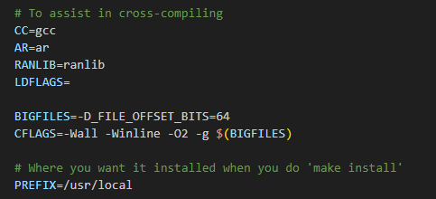

# Make构建工程配置HarmonyOS编译工具链

更新时间：2026-03-12 08:45:02

来源：https://developer.huawei.com/consumer/cn/doc/best-practices/bpta-make-adapts-to-harmonyos

## 概述


Make是一个标准的Unix构建工具，用于自动化编译过程。它可以读取Makefile中的规则和依赖项，并根据这些规则来构建源代码，Make会检查源代码文件的时间戳，以确定哪些文件需要重新编译。Make会自动解决依赖关系并按正确的顺序编译源文件，通过在终端中运行Make命令，Make将根据Makefile中的指令逐步构建代码，生成最终的可执行程序或库文件。

Makefile文件是一个文本文件，它定义了一系列的规则来指定哪些文件需要先编译，哪些文件需要后编译，以及哪些文件需要重新编译。这些规则包括文件的编译方式、库文件的创建方法，以及最终生成的可执行文件的制作过程。Makefile文件描述了整个工程的编译、连接等规则，包括源文件的依赖关系和编译顺序。通过编写Makefile文件，开发者可以自动化地构建和管理工程项目，极大地提高了开发效率。

二者关系：

Makefile是Make工具的配置文件，用于描述项目的构建规则和依赖关系。Make工具则根据这些规则和依赖关系，来决定哪些文件需要重新构建，从而实现自动化构建过程。二者共同作用，提高了软件开发的效率和便利性。


## Make构建三方库适配流程


本小节介绍如何在Linux环境下，使用Make构建工具通过ohos sdk编译bzip2三方库源码，生成ohos平台三方库的so及二进制文件。


## 环境准备


1. Linux编译环境及HarmonyOS SDK下载请参考：[环境准备](https://developer.huawei.com/consumer/cn/doc/best-practices/bpta-cmake-adapts-to-harmonyos#section197241001402)。
2. 获取三方库源码（“/mnt/e/make-makefile”中make-makefile表示创建的文件夹名称，用于存放三方库源码文件，开发者可自行选择创建与否）。
```text
owner@ubuntu:/mnt/e/make-makefile$ wget https://sourceforge.net/projects/bzip2/files/bzip2-1.0.6.tar.gz # 下载源码包
```
3. 解压源码包。
```text
owner@ubuntu:/mnt/e/make-makefile$ tar -zxf bzip2-1.0.6.tar.gz # 解压源码包
owner@ubuntu:/mnt/e/make-makefile$
owner@ubuntu:/mnt/e/make-makefile$ cd bzip2-1.0.6/ # 进入到bzip2源码目录
owner@ubuntu:/mnt/e/make-makefile/bzip2-1.0.6$
```


## 编译三方库


1. 分析Makefile文件。因为需要适配ohos，所以需要将非ohos的工具链配置为ohos的工具链。 通过分析源库的Makefile文件可知，以下几个内容需要进行重新配置：

 编译命令配置。
```text
# To assist in cross-compiling
CC=gcc
AR=ar
RANLIB=ranlib
```
 环境变量作用：
- CC：用于指定C语言编译器。
- AR：用于指定归档工具。
- RANLIB：用于指定归档文件的索引命令。

 默认配置Linux下gcc的编译命令，编译时需要配置成HarmonyOS交叉编译命令。
2. 安装路径配置。
```text
# Where you want it installed when you do 'make install'
PREFIX=/usr/local
```
 PREFIX：用于指定安装路径的前缀。 默认配置的安装目录为系统的/usr/local/下，如果需要执行安装的话，需配置成用户目录下。

 配置交叉编译命令，执行交叉编译。
分析完Makefile后，即可配置交叉编译命令进行编译（xxx需要改为自己的文件路径）。

```text
owner@ubuntu:/mnt/e/make-makefile/bzip2-1.0.6$ make CC="xxx/ohos-sdk/linux/native/llvm/bin/clang --target=aarch64-linux-ohos" AR=xxx/ohos-sdk/linux/native/llvm/bin/llvm-ar RANLIB=xxx/ohos-sdk/linux/native/llvm/bin/llvm-ranlib -j4 libbz2.a bzip2 bzip2recover
xxx/ohos-sdk/linux/native/llvm/bin/clang --target=aarch64-linux-ohos -Wall -Winline -O2 -g -D_FILE_OFFSET_BITS=64 -c huffman.c
xxx/ohos-sdk/linux/native/llvm/bin/clang --target=aarch64-linux-ohos -Wall -Winline -O2 -g -D_FILE_OFFSET_BITS=64 -c crctable.c
...
# 省略部分make信息
...
xxx/ohos-sdk/linux/native/llvm/bin/llvm-ar cq libbz2.a blocksort.o huffman.o crctable.o randtable.o compress.o decompress.o bzlib.o
ranlib libbz2.a
1 warning generated.
xxx/ohos-sdk/linux/native/llvm/bin/clang --target=aarch64-linux-ohos -Wall -Winline -O2 -g -D_FILE_OFFSET_BITS=64  -o bzip2 bzip2.o -L. -lbz2
owner@ubuntu:~/workspace/bzip2-1.0.6$
```

参数说明：

- -j4：指定并行编译的作业数。
- libbz2.a：bzip2压缩库的静态链接库文件，包含了bzip2压缩和解压缩所需的函数和数据结构，供其它程序在链接时使用。
- bzip2：bzip2压缩算法的可执行文件，用于压缩文件或目录。
- bzip2recover：bzip2压缩算法的恢复工具，可以用于恢复由bzip2压缩产生的损坏的压缩文件。


注：CC配置时，除了配置为交叉编译的clang外，还需要配置target的架构，即配置成aarch64位，按此配置编译出来的文件才能在64位设备上运行，如若需要编译32位的文件，则target配置成arm-linux-ohos即可。
 通过file bzip2查看编译成功后的文件。
```text
owner@ubuntu:/mnt/e/make-makefile/bzip2-1.0.6$ file bzip2 # 使用file查看生成的文件属性
bzip2: ELF 64-bit LSB shared object, ARM aarch64, version 1 (SYSV), dynamically linked, interpreter /lib/ld-musl-aarch64.so.1, with debug_info, not stripped
owner@ubuntu:/mnt/e/make-makefile/bzip2-1.0.6$
```

编译时配置了aarch64-linux-ohos，因此生成的文件属性为ARM aarch64，交叉编译成功。
 执行安装。
通过之前分析Makefile可以知道，在安装时需要配置PREFIX这个安装路径的变量：

```text
owner@ubuntu:/mnt/e/make-makefile/bzip2-1.0.6$ make install PREFIX=xxx/bzip/ # 执行make install安装
if ( test ! -d /mnt/e/make-makefile/bzip2-1.0.6/bzip/bin ) ; then mkdir -p /mnt/e/make-makefile/bzip2-1.0.6/bzip/bin ; fi
if ( test ! -d /mnt/e/make-makefile/bzip2-1.0.6/bzip/lib ) ; then mkdir -p /mnt/e/make-makefile/bzip2-1.0.6/bzip/lib ; fi
if ( test ! -d /mnt/e/make-makefile/bzip2-1.0.6/bzip/man ) ; then mkdir -p /mnt/e/make-makefile/bzip2-1.0.6/bzip/man ; fi
if ( test ! -d /mnt/e/make-makefile/bzip2-1.0.6/bzip/man/man1 ) ; then mkdir -p /mnt/e/make-makefile/bzip2-1.0.6/bzip/man/man1 ; fi
if ( test ! -d /mnt/e/make-makefile/bzip2-1.0.6/bzip/include ) ; then mkdir -p /mnt/e/make-makefile/bzip2-1.0.6/bzip/include ; fi
...
# 省略部分make install信息
...
cp -f bzgrep.1 bzmore.1 bzdiff.1 /mnt/e/make-makefile/bzip2-1.0.6/bzip/man/man1
chmod a+r /mnt/e/make-makefile/bzip2-1.0.6/bzip/man/man1/bzgrep.1
chmod a+r /mnt/e/make-makefile/bzip2-1.0.6/bzip/man/man1/bzmore.1
chmod a+r /mnt/e/make-makefile/bzip2-1.0.6/bzip/man/man1/bzdiff.1
echo ".so man1/bzgrep.1" > /mnt/e/make-makefile/bzip2-1.0.6/bzip/man/man1/bzegrep.1
echo ".so man1/bzgrep.1" > /mnt/e/make-makefile/bzip2-1.0.6/bzip/man/man1/bzfgrep.1
echo ".so man1/bzmore.1" > /mnt/e/make-makefile/bzip2-1.0.6/bzip/man/man1/bzless.1
echo ".so man1/bzdiff.1" > /mnt/e/make-makefile/bzip2-1.0.6/bzip/man/man1/bzcmp.1
```

```text
owner@ubuntu:/mnt/e/make-makefile/bzip2-1.0.6$ ls xxx/bzip/ # 查看安装文件
bin  include  lib  man
```
 安装成功后，即使用Make工具通过ohos sdk编译bzip2三方库源码完成。


## 应用中集成使用三方库


请参考：三方动态链接库（.so）集成开发实践。
