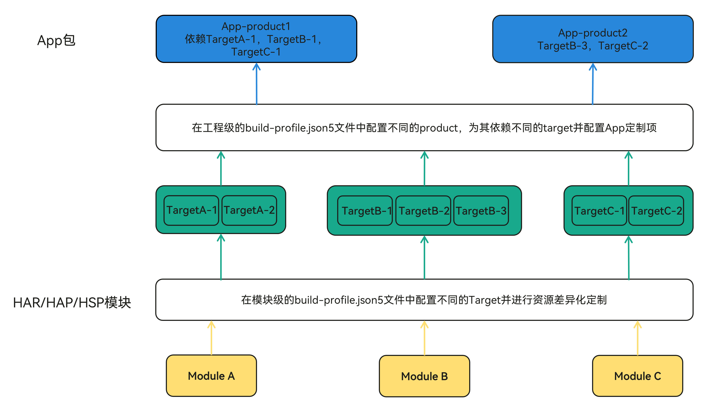
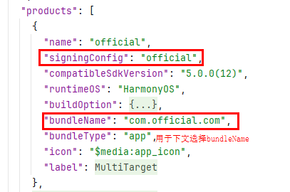
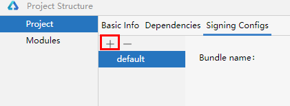
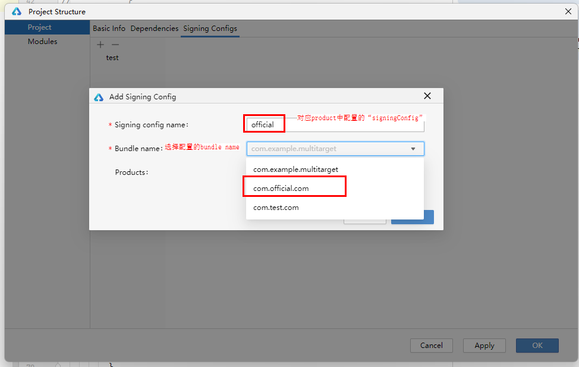
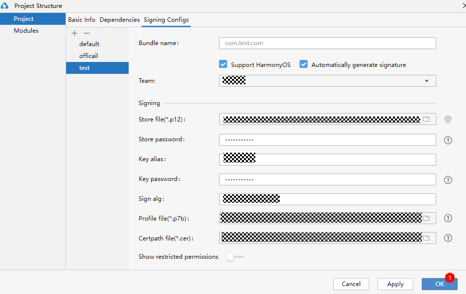
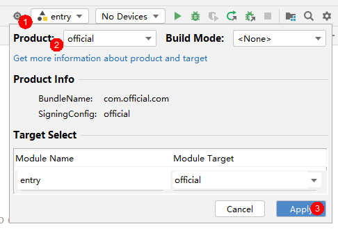

# 多目标产物构建

更新时间：2026-05-22 09:46:30

来源：https://developer.huawei.com/consumer/cn/doc/best-practices/bpta-multi-target

**   


#### 概述

多目标产物在HarmonyOS系统中的应用主要体现在软件开发与分发方面，特别是针对不同用户群体、不同业务场景的需求进行定制化开发。多目标产物为开发者提供了更加灵活和高效的开发方式，使得应用能够更好地适应市场需求和变化。通过定制化开发，还可以更好地满足用户的个性化需求，提升用户体验。
 
 

#### 基本概念

- target：对应HAR、HSP、HAP的多目标产物。工程内的每一个模块可以定义多个target，每个Target对应一个定制的HAP、HAR包，通过配置可以实现一个模块构建出不同的HAP、HAR包。
- product：对应App的多目标产物。一个HarmonyOS工程的构建产物为App包，一个工程可以定义多个product，每个product对应一个定制化应用包，通过配置可以实现一个工程构建出多个不同的应用包。

 
在构建过程中，鸿蒙构建系统会根据配置文件中定义的product和target信息，生成相应的构建产物。对于每个target，构建系统会生成一个对应的HAP/HSP/HAR。这个HAP/HSP/HAR包含了该target所需的所有代码和资源。对于每个product，构建系统会生成一个包含了其所有依赖的target的App包。这个App包可以用于发布和上架到应用市场。
 
 

#### 应用场景

主要应用场景:
 
- 不同用户群体：针对不同的用户群体（如国内用户与国际用户等），系统支持构建不同的应用版本。这些版本在功能、界面、语言等方面可能有所不同，以满足不同用户群体的需求。
- 不同业务场景：在不同的业务场景中，同一个应用可能需要提供不同的功能或资源。例如，一个在线教育应用可能需要为学生提供学习资料，而为教师提供教学资料。HarmonyOS系统支持通过配置不同的Target来实现这种差异化定制。

 
针对以上场景，开发者需要通过修改build-profile.json5、module.json5等配置文件，定义出不同的product和target。在这些配置文件中，开发者不仅可以为每个target指定不同的设备类型、源码集、资源等，并且还可以根据业务需要为不同的product分配不同的target。然后在构建过程中，构建工具会根据这些配置生成不同的target，然后通过不同的target搭配构建出不同的product产物。
 
本文将通过一个具体的案例来介绍如何配置不同资源以及如何构建出多目标产物。
 
 

#### 实现原理

HarmonyOS多目标产物支持[HAP](https://developer.huawei.com/consumer/cn/doc/harmonyos-guides/hap-package)（应用安装的基本单位，每个HAP都对应一个应用模块）、[HAR](https://developer.huawei.com/consumer/cn/doc/harmonyos-guides/har-package)（静态共享包）、[HSP](https://developer.huawei.com/consumer/cn/doc/harmonyos-guides/in-app-hsp)（动态共享包）以及App（由多个HAP打包一起上架的完整应用程序）包多种类型的包，以满足不同业务场景下的应用开发和定制需求。
 
 

#### 多目标产物定制项

目前多目标产物支持的定制项信息如下表所示，表中已给出每一项的作用。详细的每一个定制项的配置方法可以参考：[配置多目标产物](https://developer.huawei.com/consumer/cn/doc/harmonyos-guides/ide-customized-multi-targets-and-products)。
  
| 多目标模块 | 定制项 | 作用 |
| --- | --- | --- |
| HAP | HAP包名（artifactName） | 产品生成的应用包名称，可由数字、英文字母、中划线、下划线和英文句号（.）组成，支持输入版本号。 |
| HAP | 设备类型（deviceType） | 用于配置支持的设备类型，如Phone、Tablet等。 |
| HAP | 源码集（source） | target的源码范围： pages：定制pages源码目录的page页面，数组长度至少为1。sourceRoots：定制差异化代码空间，数组长度至少为1。 |
| HAP | 资源（resource） | 配置需要的资源文件路径，支持配置多个资源文件路径。 |
| HAP | 分发规则（distributionFilter） | 针对多target存在相同设备类型deviceType的场景，相同设备类型的target需要指定分发规则distributionFilter。 |
| HAP | 产物分包（preloads） | 对于元服务，每一个target均可以指定preloads的分包。 |
| HAP | abilities能力项（icon、label和launchType） | 定制产物图标、名称、启动模式。 |
| HAP | so库依赖（nativeLib-filter） | 定制打包so库的过滤规则。 |
| HAR/HSP | 设备类型（deviceType） | 用于配置支持的设备类型，如Phone、Tablet等。 |
| HAR/HSP | so库依赖（nativeLib-filter） | 定制打包so库的过滤规则。 |
| HAR/HSP | 源码集（source） | target的源码范围： pages：定制pages源码目录的page页面，数组长度至少为1。sourceRoots：定制差异化代码空间，数组长度至少为1。 |
| HAR/HSP | 资源（resource） | 配置需要的资源文件路径，支持配置多个资源文件路径。 |
| App | App包名和供应商名称(artifactName、vendor) | 指定产物命名和供应商名称。 |
| App | bundleName | 定义工程的bundleName信息，在签名的时候可以选择对应的bundleName进行签名。如果product未定义bundleName，则采用工程默认的bundleName。 |
| App | bundleType | 定义产物类型： bundleType值为app，表示产物为应用；bundleType值为atomicService，表示产物为元服务。 |
| App | 签名配置信息(signingConfig) | 为不同产物定制不同的签名文件。 |
| App | 应用图标、名称（icon、label） | 为不同产物定制不同的图标和名称。 |
| App | 依赖的模块（modules） | 定义product中包含的target，每个product可以指定一个或多个target。 |
 
 
综上所述，App、HAP、HAR、HSP包目前并不支持配置所有配置项的差异化定制，开发者在开发过程中需要根据已支持的配置项合理的进行多目标定制。
 
 

#### 构建原理图




 
如图所示，在HarmonyOS应用开发过程中，一个应用通常包含多个HAR/HAP/HSP模块。每个HAR/HAP/HSP模块可以通过配置模块级的build-profile.json文件定义多个target，每个target可以定制不同的资源（具体可参考上文定制项介绍）。因此形成了具有差异性的target，如：Module A通过定制生成了TargetA-1、TargetA-2；Module B通过定制生成了TargetB-1、TargetB-2、TargetB-3；Module C通过定制生成了TargetC-1、TargetC-2。然后通过配置工程级的build-profile.json定义多个product，每个product可以依赖不同的Target并且配置不同的App产物定制项。因此形成了具有差异的product，如：依赖TargetA-1、TargetB-1、TargetC-1构建出App-product1；依赖TargetB-3、TargetC-2构建出App-product2。最终在构建工程时选择相应的product就可以显示出对应的定制效果。
 
 

#### 开发流程
1. 首先需要拆解需求，根据具体的业务场景判断出product、target信息。即确认我们要构建哪些product，每个product依赖哪些target以及每个target的定制项有哪些。
2. 分别定制每个target定制项的内容。
3. 分别定制product定制项并为其依赖需要的target。
4. 实现不同目标产物需要定制的业务逻辑。
5. 选择不同的product构建出不同目标产物。
 
 

#### 场景案例

 
本节主要根据一个案例介绍构建多目标产物的流程和方法，该案例可以由同一套源代码构建出Official版本（官方版）和Test版本（测试版）两个product工程。两个工程的实现效果如下：
 
Official版本：工程会在首页中显示Official版的资源以及一个页面跳转按钮，该页面是一个HAP模块页面。通过点击按钮可以跳转到Official版定制页面，该页面是一个HAR模块页面，其中包含了一个运算器。该运算器支持加法和减法。
 
Test版本：工程会在首页中显示Test版的资源以及一个页面跳转按钮，该页面是一个HAP模块页面。通过点击按钮可以跳转到Test版定制页面，该页面是一个HAR模块页面，其中包含了一个普通版的运算器。该运算器仅支持减法。
 

 
该案例包含了HAP、HAR、APP相关定制项，具体差异项信息如下：
  
| 定制模块 | Official版本定制项 | Test版本定制项 |
| --- | --- | --- |
| HAP模块(target) | target名称officialsource源码集-pages资源文件目录source源码集-sourceRoots | target名称testsource源码集-pages资源文件目录source源码集-sourceRoots |
| HAR模块(target) | target名称officialbuildProfileFields自定义参数产物名称source源码集-sourceRoots资源文件目录剔除的.so文件 | target名称testbuildProfileFields自定义参数产物名称source源码集-sourceRoots资源文件目录 |
| App工程（product） | product名称official产物bundleName签名配置信息应用图标依赖的target | product名称test产物bundleName签名配置信息应用图标依赖的target |
 
1. 拆解需求，根据具体的业务场景判断出product、target信息。首先，根据上面案例设计和定制项表格可以确认我们需要定制两个product版本，即Official版本和Test版本。每个product需要依赖两个模块，即一个HAP模块和一个HAR模块。
2. 定制target内容。HAP模块：在模块级build-profile.json5文件中配置。

  
```json
"targets": [
  {
    "name": "official",
    "source": {
      "pages": [
        "pages/Index"
      ],
      "sourceRoots": [
        "./src/official_pages"
      ]
    },
    "resource": {
      "directories": [
        "./src/main/official/resources",
        "./src/main/resources"
      ]
    }
  },
  {
    "name": "test",
    "source": {
      "pages": [
        "pages/Index"
      ],
      "sourceRoots": [
        "./src/test_pages"
      ]
    },
    "resource": {
      "directories": [
        "./src/main/test/resources",
        "./src/main/resources"
      ]
    }
  },
]
```
 上述配置文件代码中，配置了official版本与test版本的target名称、source源码集-pages、source源码集-sourceRoots以及资源文件路径，因此我们需要在对应的目录结构下创建我们配置的文件以及目录。针对以上配置信息，我们需要创建pages目录下的Index.ets文件、src目录下的test_pages和official_pages目录以及src/main目录下的test/resource和official/resource目录。

  在配置不同target的资源文件目录时，可以配置多个资源文件目录，建议将共有的资源文件放置到默认的资源文件目录中，将有差异的资源部分放置到定制的资源文件目录中，然后在配置资源目录时将默认的资源目录和定制的资源目录都加上。例如：案例中即给不同版本配置了两个资源目录，一个用于存放共有资源，一个存放不同target的差异性资源。

  如果target引用的多个资源文件目录下，存在同名的资源，则在构建打包过程中，将按照配置的资源文件目录顺序进行选择。例如，上述official版target引用的资源中，official/resource和resource中存在同名的资源文件，则official/resource中的资源会被打包到HAP中。

  * 配置文件中，default为创建工程时默认生成的target，一般无需特殊处理。

  HAR模块：在模块级build-profile.json5文件中配置。

  
```json
"targets": [
  {
    "name": "official",
    "config": {
      "buildOption": {
        "arkOptions": {
          "buildProfileFields": {
            "productName": "official"
          }
        },
        "nativeLib": {
          "filter": {
            "excludes": [
              "../libs/arm64-v8a/libentry.so"
            ]
          }
        }
      }
    },
    "runtimeOS": "HarmonyOS",
    "output": {
      "artifactName": "official"
    },
    "source": {
      "sourceRoots": [
        "./src/official_pages"
      ]
    },
    "resource": {
      "directories": [
        "./src/main/official/resources",
        "./src/main/resources"
      ]
    }
  },
  {
    "name": "test",
    "config": {
      "buildOption": {
        "arkOptions": {
          "buildProfileFields": {
            "productName": "test"
          }
        }
      }
    },
    "runtimeOS": "HarmonyOS",
    "output": {
      "artifactName": "test"
    },
    "source": {
      "sourceRoots": [
        "./src/test_pages"
      ]
    },
    "resource": {
      "directories": [
        "./src/main/test/resources",
        "./src/main/resources"
      ]
    }
  }
]
```
 上述配置文件代码中，配置了official版本与test版本的target名称、buildProFields自定义参数、产物名称、source源码集-sourceRoots以及资源文件目录，并且在official版本中剔除了无需打包的.so文件。同样的，我们也需要创建我们需要的文件目录，因此我们需要在该HAR模块的src/main/目录下创建test/resource和official/resource文件夹，在src/目录下创建official_pages和test_pages文件夹。
3. 定制product内容。App工程：在工程级build-profile.json5文件中配置。

  
```json
{
  "app": {
    "signingConfigs": [],
    "products": [
      {
        "name": "official",
        "compatibleSdkVersion": "5.0.5(17)",
        "targetSdkVersion": "5.0.5(17)",
        "runtimeOS": "HarmonyOS",
        "buildOption": {
          "strictMode": {
            "caseSensitiveCheck": true,
            "useNormalizedOHMUrl": true
          }
        },
        "bundleName": "com.official.com",
        "bundleType": "app",
        "icon": "$media:startIcon",
        "label": "$string:official_app_name"
      },
      {
        "name": "test",
        "compatibleSdkVersion": "5.0.5(17)",
        "targetSdkVersion": "5.0.5(17)",
        "runtimeOS": "HarmonyOS",
        "buildOption": {
          "strictMode": {
            "caseSensitiveCheck": true,
            "useNormalizedOHMUrl": true
          }
        },
        "bundleName": "com.test.com",
        "bundleType": "app",
        "icon": "$media:app_icon",
        "label": "$string:test_app_name"
      },
      {
        "name": "default",
        "compatibleSdkVersion": "5.0.5(17)",
        "targetSdkVersion": "5.0.5(17)",
        "runtimeOS": "HarmonyOS",
      }
    ],
    "buildModeSet": [
      {
        "name": "debug",
      },
      {
        "name": "release"
      }
    ]
  },
  "modules": [
    {
      "name": "entry",
      "srcPath": "./entry",
      "targets": [
        {
          "name": "official",
          "applyToProducts": [
            "official"
          ]
        },
        {
          "name": "test",
          "applyToProducts": [
            "test"
          ]
        }
      ]
    },
    {
      "name": "myhar",
      "srcPath": "./myhar"
    }
  ]
}
```
 在该配置文件中，配置了product名称、产物bundleName、签名配置信息、应用图标、依赖的target信息。这里需要注意的是，依赖的HAR模块需要在引用他的模块内配置依赖关系。我们的案例是在entry模块里调用的HAR包，所以需要在其对应的oh-package.json5文件中配置dependencies依赖。
4. 实现不同目标产物需要定制的业务逻辑。
- 通过[source源码集-sourceRoots配置](https://developer.huawei.com/consumer/cn/doc/harmonyos-guides/ide-customized-multi-targets-and-products-guides#section18668905913)的差异性代码空间，实现标题（代码文件）多目标效果。

  



  在上述配置文件中，配置了HAP模块的source源码集-sourceRoots目录，official版本与test版本分别对应src/official_pages和src/test_pages。

  分别在对应的sourceRoots目录下创建同名ets文件并创建同名同类型的方法，例如：示例中创建的是VersionInfo.ets文件。添加如下代码：

  src/official_pages/VersionInfo.ets

  
```ArkTS
export const getName = () => "This is official version."
export const getTitleName = () => $r('app.string.title')
```
 src/test_pages/VersionInfo.ets

  
```ArkTS
export const getName = () => "This is test version."
export const getTitleName = () => $r('app.string.title')
```
 在Index.ets文件中，通过import packageName的方式，省略sourceRoot，可以实现不同target下的差异化构建（ import xxx from '&lt;packageName&gt;/sourceFileName'）。该能力具体可参考：[source源码集-sourceRoots配置](https://developer.huawei.com/consumer/cn/doc/harmonyos-guides/ide-customized-multi-targets-and-products-guides#section18668905913)。

  
```ArkTS
import { MainPage } from 'myhar'
import { getName, getTitleName } from 'entry/VersionInfo'

@Entry
@Component
struct Index {
  @State message: string = getName();
  @State titleMessage: Resource = getTitleName();

  build() {
    Column() {
      Column() {
        Text(this.titleMessage)
          .height(40)
          .fontSize(30)
          .fontWeight(FontWeight.Medium)
        Text(this.message)
          .fontSize(14)
          .fontWeight(FontWeight.Normal)
          .fontColor(Color.Black)
          .opacity(0.6)
          .height(19)
          .margin({ top: 2 })
      }
      .height(78)
      .width('100%')
      .alignItems(HorizontalAlign.Start)
      .padding({
        left: 12,
        right: 12,
        top: 8,
        bottom: 12
      })

      Row() {
        MainPage()
          .backgroundColor('#F1F3F5')
      }
      .layoutWeight(1)
    }
    .width('100%')
    .height('100%')
    .backgroundColor('#F1F3F5')
    .expandSafeArea([SafeAreaType.SYSTEM], [SafeAreaEdge.TOP, SafeAreaEdge.BOTTOM])
  }
}
```


5. 在HAR模块引用差异性资源，实现页面中资源多目标效果。

   



  在上述配置文件中，我们配置了HAR模块的资源文件路径，official版本和test版本分别对应src/main/official/resources和src/main/test/resources文件。

  分别在对应的资源文件目录下添加同名图片资源和json字符串。例如：示例中分别在资源文件目录下的media文件中放入同名的HarImage.jpg图片（图片内容不同），并在element文件下的string.json中添加同名参数"title_description"（其对应的"value"值不相同）。

  在页面中直接引用对应同名资源即可，代码如下：

  
```ArkTS
TextArea({ text: $r('app.string.title_description') })
  .fontSize(16)
  .width('100%')
  .fontColor('#e6000000')
  .fontWeight(FontWeight.Normal)
  .borderRadius(16)
  .focusable(false)
Image($r('app.media.HarImage'))
  .width('100%')
  .borderRadius(12)
  .padding({ top: 16 })
```


6. 在HAR模块中通过不同自定义参数信息跳转到不同页面，实现路由跳转多目标效果。

  效果对比如下：

  图1 **official版本**



  图2 **test版本**


  在先前的案例中，已经介绍了如何在sourceRoots目录配置的差异性代码空间中实现对同名文件中的同名方法的调用。这里主要介绍在不同的target中如何调用不同名的文件中的不同方法。

  首先，需要通过配置文件中配置的自定义参数[生成相应的BuildProfile.ets文件](https://developer.huawei.com/consumer/cn/doc/harmonyos-guides/ide-hvigor-get-build-profile-para-guide#section8279154125918)。上述HAR模块的配置文件中，我们配置了buildProfileFields自定义参数"productName"，在official和test版本中分别配置了不同的值"official"和"test"。这样我们构建不同的产物版本就会生成不同的"productName"值，用于在代码工程中区分不同的产物版本。

  然后，分别在official和test的对应的sourceRoots目录下创建不同的ets文件，并导出相应的组件。如示例中在HAR模块的src/official_pages目录下创建了OfficialSecondPages.ets并export了一个OfficialSecond组件，然后在src/test_pages目录下创建了TestSecondPages.ets并export了一个TestSecond组件。这两个组件中分别包含了不同的页面信息。

  最后在首页中import相应的方法实现跳转逻辑。具体代码如下：

  导入方法及组件：

  
```ArkTS
import BuildProfile from '../../../../BuildProfile';
import { OfficialSecond } from '../../../official_pages/OfficialSecondPage';
import { TestSecond } from '../../../test_pages/TestSecondPage';
```
 定义页面跳转逻辑：接收到不同的参数值跳转不同页面。

  
```ArkTS
@Builder
PagesMap(name: string) {
  if (name == 'official') {
    OfficialSecond();
  } else {
    TestSecond();
  }
}
```
 为按钮添加点击属性，并传递自定义参数，用于实现Navigation路由跳转：

  
```ArkTS
Button($r('app.string.button_describe'))
  .fontSize(16)
  .height(40)
  .width('100%')
  .onClick(() => {
    this.pageInfos.pushPath({ name: BuildProfile.productName });
  })
```


7. 选择不同的product构建出不同的目标产物。

  图3 **构建图示**


  首先点击DevEco Studio工具右上角的Product按钮，即图中的1号标识处，然后在2号标识处选择对应的product工程，选择完工程之后会自动映射出我们文件中已经依赖的target，最后点击Apply应用。上述操作完成之后就可以点击运行按钮查看多目标产物效果了。本案例运行效果图如下：

  图4 **Official版本


  **图5 **Test版本


  

  #### 常见问题

  

  #### 如何为不同的product产物配置签名信息？

  配置工程级的build-profile.json5文件.

  首先需要在每个product下添加配置项"signingConfig"。

  


  然后进入到签名配置页面，点击加号，添加签名信息：

  



  然后选择对应的bundle name，并填写上面配置的"signingConfig"信息（每个product产物都需要配置）：

  


  点击ok之后，进行签名即可。

  


  

  #### 示例代码

  
[构建多目标产物工程](https://gitcode.com/harmonyos_samples/MultiTarget)
