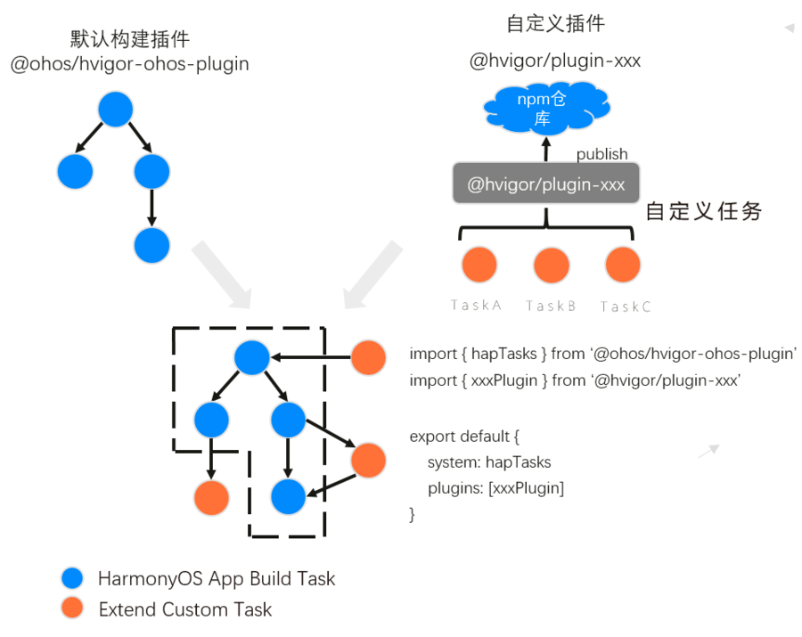
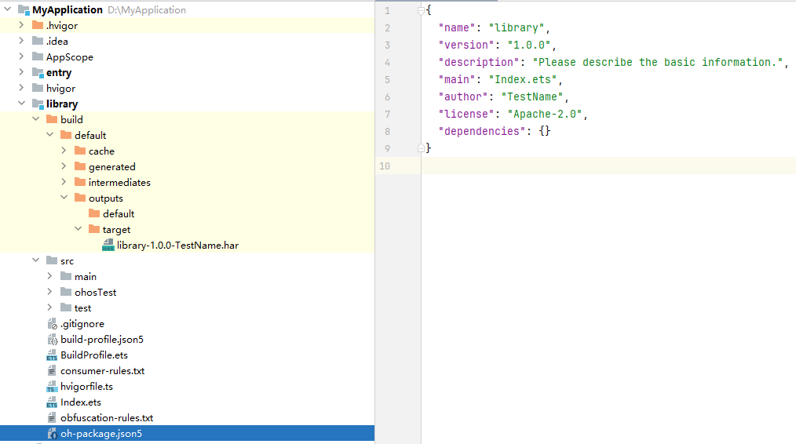

# 定制hvigor插件

更新时间：2026-03-12 08:45:02

来源：https://developer.huawei.com/consumer/cn/doc/best-practices/bpta-custom-hvigor-plugin

#### 概述

在进行编译构建的过程中，开发者可以通过定制hvigor插件，扩展构建逻辑，实现个性化的打包流程。
 
 
定制hvigor插件，通常有以下目的：
 
- 满足自定义任务需求。每个项目可能有独特的构建需求和流程，定制插件可以根据项目的具体要求来扩展hvigor构建的功能。
- 加强构建任务可维护性。定制插件可以将某些复杂的构建逻辑封装在同一个地方，使得项目的构建配置更加清晰和易于维护。可以自动化执行某些特定任务，减少手动干预，确保构建过程的一致可靠。
- 提升团队协作效率。在团队开发中，定制插件可以确保所有团队成员使用相同的构建流程和标准，减少因个人配置差异导致的问题，从而提升团队协作的效率。

 
具体到应用场景上，定制插件可以根据不同的构建需求调整编译产物属性，从而实现灵活的构建管理。
 
本文以[自定义编译产物的文件名及路径](#section1748957151410)为案例来介绍如何定制hvigor插件。
 

#### 基本概念

 
定制hvigor插件开发时，涉及以下概念：
 
- **[hvigor](https://developer.huawei.com/consumer/cn/doc/harmonyos-guides/ide-hvigor)**：基于TS实现的构建任务编排工具，主要提供任务管理机制，包括任务注册编排、工程模型管理、配置管理等关键能力。
- **[hvigor-ohos-plugin](https://developer.huawei.com/consumer/cn/doc/harmonyos-guides/ide-hvigor-life-cycle#section199818016213)**：hvigor默认提供的构建插件，利用hvigor的任务编排机制实现应用/元服务构建任务流的执行，完成HAP/App的构建打包，应用于应用/元服务的构建。
- **[Task](https://developer.huawei.com/consumer/cn/doc/harmonyos-guides/ide-hvigor-life-cycle#section194191858161220)**：即构建任务，作为hvigor构建过程中的基本工作单元，构建项目的具体工作由Task描述表达，比如源码编译任务，打包任务或签名任务等。每一种任务的执行逻辑由plugin插件提供。
- 编译产物：即工程/模块编译后的目标，是项目打包生成的用于依赖或运行的包文件，包括[HAP](https://developer.huawei.com/consumer/cn/doc/harmonyos-guides/hap-package)（应用安装运行的基本单位）、[HAR](https://developer.huawei.com/consumer/cn/doc/harmonyos-guides/har-package)（静态共享包）、[HSP](https://developer.huawei.com/consumer/cn/doc/harmonyos-guides/in-app-hsp)（动态共享包）以及App（可上架的完整应用程序）等多种类型。

 

#### 实现原理

定制hvigor插件，就是在编译构建的过程中插入开发者需要的自定义任务，将这些自定义任务抽象后封装成可复用的部分，通过输出plugin插件的目标形式，实现编译构建个性化逻辑的复用和共享分发。
 
 



 
如上图所示，hvigor插件的工作原理：
 1. 开发者编写自定义插件plugin，在插件中自定义任务Task，在项目构建脚本中应用插件。
2. hvigor-ohos-plugin将默认构建任务和自定义插件任务，都装进hvigor任务流。
3. hvigor任务流按序执行的过程中，hvigor在节点处检查，如果有自定义任务注册，执行相应的自定义任务逻辑。
 

#### 开发流程

hvigor主要提供了两种方式以实现插件的开发：
 
- [基于hvigorfile脚本开发](https://developer.huawei.com/consumer/cn/doc/harmonyos-guides/ide-hvigor-plugin#section552855418188)
- [基于typescript项目开发](https://developer.huawei.com/consumer/cn/doc/harmonyos-guides/ide-hvigor-plugin#section1825121193616)

 
两种方式的核心逻辑实现类似，都是以TS文件编写Task任务方法，区别主要在共享和应用方式上。
 
二者对比如下：
  
|    | 插件项目 | 代码开发 | 共享方式 | 插件使用 | 特点总结 |
| --- | --- | --- | --- | --- | --- |
| 基于hvigorfile脚本 | 不创建项目 | 直接编辑工程/模块中hvigorfile.ts文件 | 不发布，复制代码实现共享 | 代码逻辑直接应用于编辑工程/模块 | 开发使用快速；共享复用不方便 |
| 基于typescript项目 | 新建npm项目 | 新建custom-plugin.ts文件 | npm打包发布共享，或离线包共享 | hvigor-config.json5中配置插件依赖，或安装离线包 | 易于分发、共享和维护；发布使用流程相对多 |
 
 
下文的场景实例采用[基于typescript项目开发](https://developer.huawei.com/consumer/cn/doc/harmonyos-guides/ide-hvigor-plugin#section1825121193616)的方法描述，开发者也可以将插件逻辑代码直接写于hvigorfile.ts中，切换为[基于hvigorfile脚本开发](https://developer.huawei.com/consumer/cn/doc/harmonyos-guides/ide-hvigor-plugin#section552855418188)的实现方式。
 
定制hvigor插件涉及的相关能力，可查阅[扩展构建API](https://developer.huawei.com/consumer/cn/doc/harmonyos-guides/ide-hvigor-apis)。
 
 

#### 自定义编译产物的文件名及路径

**场景描述**
 
以名为library的module生成HAR包为例，默认情况下，HAR包编译产物的生成路径在library/build/default/outputs/default目录下，文件名为library.har。
 
而开发者在用于生产的环境中，可能需要根据项目情况，使编译产物输出到指定路径，并更改其文件名，例如：带有版本号的文件名，或带有开发者名称等信息的文件名。
 
下面示例中用oh-package.json5中配置的属性修改HAR包文件名，同时将生成路径改为library/build/default/outputs/target。
 
**开发步骤**
 1. [初始化typescript项目](https://developer.huawei.com/consumer/cn/doc/harmonyos-guides/ide-hvigor-plugin#section1243715533156)：配置npm环境，安装typescript依赖，新建一个npm项目做为插件的工程。
2. [开发插件](https://developer.huawei.com/consumer/cn/doc/harmonyos-guides/ide-hvigor-plugin#section627771916612)：对插件项目配置HarmonyOS镜像仓库，安装hvigor开发依赖，然后进行插件开发，以下是该场景的插件逻辑实现。

  
- 在新建的custom-plugin.ts文件中，编写任务函数renameHarTask()。

3. 在函数中注册自定义任务，使用pluginContext.registerTask()方法。

4. 通过taskContext得到modulePath（模块路径）、moduleName（模块文件名），拼装得到编译产物的原始文件路径。

5. 根据需要，读取oh-package.json5中配置属性，拼接生成目标文件名。

6. 使用fs.mkdir()创建指定目录，再调用fs.rename()，将编译产物移动到目标路径，并修改为新文件名。

  插件代码示例如下：

  
```ts
import fs from 'fs';
import path from 'path';

interface OhPackage {
  name: string;
  version: number;
  description: string;
  author: string;
}

export function renameHarTask(str?: string) {
  return {
    pluginId: 'RenameHarTaskID',
    apply(pluginContext) {
      pluginContext.registerTask({
        // Write custom tasks
        name: 'renameHarTask',
        run: (taskContext) => {
          // Read oh-package.json5 and parse the version
          const packageFile = path.join(taskContext.modulePath, 'oh-package.json5');
          let fileContent = fs.readFileSync(packageFile, 'utf8');
          const content: OhPackage = JSON.parse(fileContent);
          const version = content.version;
          const author = content.author;
          const sourceFile = path.join(taskContext.modulePath, 'build/default/outputs/default', `${taskContext.moduleName}.har`);
          const targetPath = path.join(taskContext.modulePath, 'build/default/outputs/target');
          const targetFile = path.join(targetPath, `${taskContext.moduleName}-${version}-${author}.har`);

          // Create Directory
          fs.mkdir(targetPath, { recursive: true }, (err) => {
            if (err) {
              throw err;
            }
            // Move and modify product file names
            fs.rename(sourceFile, targetFile, (err) => {
            });
          });
        },
        // Confirm custom task insertion position
        dependencies: ['default@PackageHar'],
        postDependencies: ['assembleHar']
      })
    }
  }
}
```

- 共享插件：有两种方式可选。

  
[发布插件](https://developer.huawei.com/consumer/cn/doc/harmonyos-guides/ide-hvigor-plugin#section855411147)：插件遵循npm发布规范，将其打包后发布到公共或自建的镜像仓库中。
- 共享离线包：将插件工程压缩打包后分享出去。

 

- [使用插件](https://developer.huawei.com/consumer/cn/doc/harmonyos-guides/ide-hvigor-plugin#section60171414358)：在工程中的hvigor/hvigor-config.json5文件"dependencies"节点下添加插件依赖，例如"@bpta/custom_plugin": "1.0.0"，然后执行DevEco Studio菜单File -> Sync and Refresh Project进行工程同步后，在模块中的hvigorfile.ts导入并使用插件方法。参考如下：

  
```ts
import { harTasks } from '@ohos/hvigor-ohos-plugin';
import { renameHarTask } from '@bpta/custom_plugin';

export default {
  system: harTasks, /* Built-in plugin of Hvigor. It cannot be modified. */
  plugins: [renameHarTask()]         /* Custom plugin to extend the functionality of Hvigor. */
}
```

- 执行Build -> Make Module编译，编译产物的文件名被修改为“name-version-author.har”的组成形式，同时生成路径从default目录改到了target目录下。结果如下图：

  

