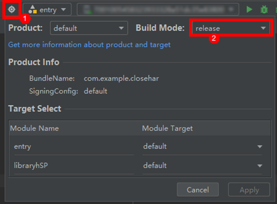
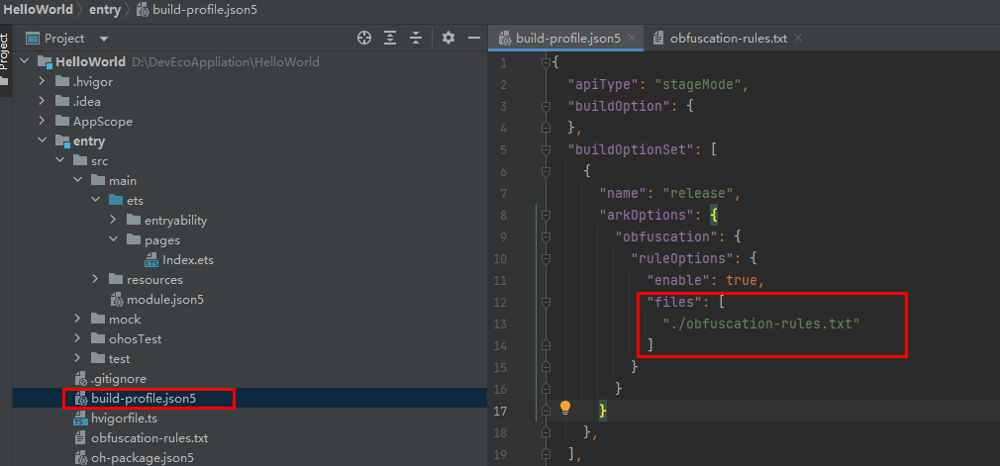
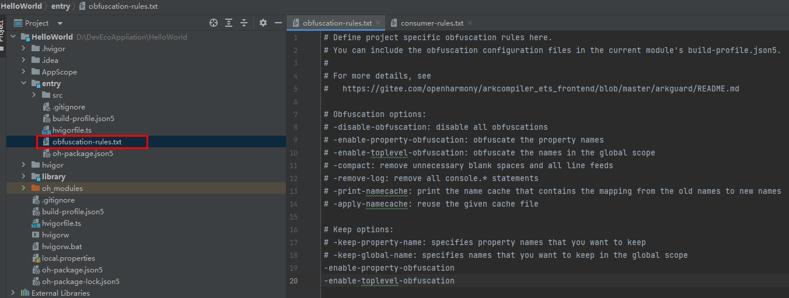
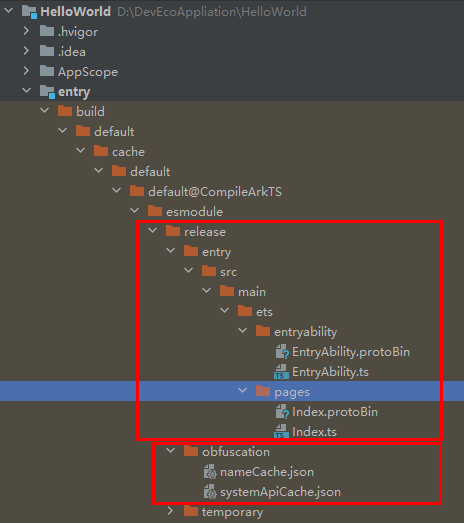

# 应用代码混淆

更新时间：2026-03-12 08:45:02

来源：https://developer.huawei.com/consumer/cn/doc/best-practices/bpta-app-code-ob

## 概述


代码混淆技术可以增加代码的复杂性和模糊性，从而提高攻击者分析代码的难度。代码混淆有以下几个方面的作用：

1. 保护知识产权：代码混淆防止他人轻易复制和窃取软件代码，增加逆向工程难度。
2. 防止逆向工程：逆向工程是分析软件以了解其工作原理和实现细节的过程。代码混淆可增加逆向工程的难度，保护应用程序免受恶意修改或破坏。
3. 提高安全性：代码混淆减少漏洞和安全风险，增加攻击者利用漏洞的难度。
4. 降低反盗版和欺诈风险：混淆代码可增加攻击者破解软件许可验证系统或修改代码绕过付费机制的难度，从而减少盗版和欺诈。


针对工程源码的混淆提高破解难度，缩短类和成员名称，减小应用大小。


## 混淆开启


从DevEco Studio版本4.0 Beta1开始，hvigor插件提供代码混淆功能。开启混淆的条件如下：

- 工程为Stage模型
- 在Release编译模式下
- 模块build-profile.json5文件中开启混淆配置
```json
"arkOptions": {
  "obfuscation": {
    "ruleOptions": {
      "enable": true,
      // ...
    }
  }
},
```


enable默认为false，默认不开启代码混淆功能。


满足开启混淆的条件后，选择目标模块，点击Build -> Make Module开始编译。

如果工程或模块是Static Library，则该工程或模块是一个HAR。

构建字节码HAR时有以下三种方式：

1. 以Debug模式构建HAR，会直接打包源码，不进行代码混淆。
2. 以Release模式构建HAR，会编译、混淆并压缩代码。
3. 构建字节码格式的HAR。开启混淆时，编译器会先对源码中间文件进行混淆，再生成abc字节码。


图1 DevEco Studio选择release编译模式





图2 DevEco Studio指定模块编译


## 混淆配置能力


### 编译选项


若按照上述编译流程开启代码混淆，在DevEco Studio 5.0.3.600之前的版本，默认仅混淆参数名和局部变量名。从DevEco Studio 5.0.3.600版本起，默认启用四项推荐的混淆选项：-enable-property-obfuscation、-enable-toplevel-obfuscation、-enable-filename-obfuscation和-enable-export-obfuscation。开发者可以根据需要进一步修改混淆配置。

如果在流水线开启混淆并使用release构建模式，在编译参数加上 -p buildMode=release  -p debuggable=false。


### 混淆配置


在每个模块下都能找到build-profile.json5文件，如下图所示。可以在此文件中配置是否开启混淆及混淆配置文件。

图3 编译配置文件




新建工程时，每个模块下都有obfuscation-rules.txt文件，用于配置混淆。

图4 混淆配置文件




在上图中，obfuscation-rules.txt文件中添加了-enable-property-obfuscation和-enable-toplevel-obfuscation开关，表示已启用属性混淆和顶层作用域名称混淆。

DevEco Studio混淆现有选项及功能描述如下：


|  | 混淆自定义选项名称 | 功能简述 |
| --- | --- | --- |
| 混淆选项 | -disable-obfuscation | 关闭混淆 |
| -enable-property-obfuscation | 属性混淆 |  |
| -enable-toplevel-obfuscation | 顶层作用域名称混淆 |  |
| -enable-filename-obfuscation | 文件名混淆 |  |
| -enable-export-obfuscation | export导出名称与属性混淆 |  |
| -compact | 代码压缩 |  |
| -remove-log | 删除console.*方法 |  |
| -print-namecache filepath | 指定路径输出namecache.json文件及内容 |  |
| -apply-namecache filepath | 复用指定的名称缓存文件 |  |
| -remove-comments | 删除注释 |  |
| 保留选项 | -keep-property-name | 保留属性名 |
| -keep-global-name | 保留顶层作用域和导出元素的名称 |  |
| -keep-file-name | 保留指定的文件/文件夹的名称 |  |
| -keep-dts | 读取指定.d.ts文件中的名称作为白名单 |  |
| -keep-comments | 保留编译生成的声明文件中class, function, namespace, enum, struct, interface, module, type及属性上方的JsDoc注释 |  |
| -keep | 保留指定相对路径中的所有名称（例如变量名、类名、属性名等） |  |
| 通配符 | 名称类和路径类的保留选项支持通配符 |  |


混淆选项具体的使用方法和样例代码可以参考代码混淆。

混淆优化建议

开发人员混淆工程时，发现缓存文件或SDK中的文件中存在大量未混淆的源码名称。原因包括以下两类：

- - 混淆选项开启较少；开启-enable-property-obfuscation、-enable-toplevel-obfuscation、-enable-export-obfuscation、-enable-filename-obfuscation选项。
- - 源码名称与系统白名单、语言白名单重名；添加后缀避开白名单。


### 混淆规则合并策略


在编译一个模块时，生效的混淆规则是当前编译模块混淆规则和依赖模块混淆规则的合并结果。具体规则请参考：混淆规则合并策略。


## 查看混淆结果


开发人员在编译模块的build目录中可找到编译和混淆生成的缓存文件、名称映射表及系统API白名单文件。

- 源码编译及混淆缓存文件目录：build/[…]/release/模块名
- 混淆名称映射表及系统API白名单目录：build/[…]/release/obfuscation- 名称映射表文件：nameCache.json，记录源码名称映射。
- - 系统API白名单文件：systemApiCache.json，记录SDK接口与属性名称。


图5 DevEco Studio编译产物与缓存文件




## 调试


代码经过混淆工具处理后，名称会发生更改，这可能导致运行时崩溃堆栈日志难以理解，因为堆栈与源代码不完全一致。如果未保留调试信息，行号及名称更改将导致无法准确定位问题。此外，启用-enable-property-obfuscation、-enable-toplevel-obfuscation等选项后，代码混淆可能会引发运行时崩溃或功能性错误。开发人员需要还原报错堆栈，排查并配置白名单以确保功能正常。


### 函数调用栈还原


经过混淆的应用程序中代码名称会发生更改，因此报错栈与源码不完全一致，crash时打印的报错栈会难以理解，如何处理请参考报错栈还原。


### 反混淆工具hstack


hstack需要将Node.js配置到环境变量中，详细使用说明请参考堆栈解析工具（hstack）。


### 常见报错案例


请参考ArkGuard混淆常见问题。


## 使用第三方加固


在HarmonyOS提供的代码混淆能力之外，开发者还可以使用第三方安全厂商提供的高级混淆和加固能力。多家安全加固厂商已经启动了HarmonyOS开发，开发者可以根据需求选择这些安全厂商的服务。开发者需要与第三方安全厂商自行沟通合作方式和范围，本文档不做详细说明。具体的官方与第三方代码混淆能力的关系如下：


| 特性 | 特性描述 | HarmonyOS | 三方 |
| --- | --- | --- | --- |
| 名称混淆 | 混淆类、字段、属性、方法和文件名。 | √ | √ |
| 控制混淆 | 混淆方法内的控制流以防御自动或手动代码分析，包括虚假控制流和控制流扁平化。 | × | √ |
| 指令替换 | 通过将简单的算术和逻辑表达式转换为难以分析的代码来保护专有公式。 | × | √ |
| 数据混淆 | 加密敏感字符串，以防止通过尝试搜索的黑客攻击，也用来加密类、asset文件、资源文件和Native库。 | × | √ |
| 代码虚拟化 | 转换方法实现为随机生成虚拟机的指令序列。 | × | √ |
| 调用隐藏 | 为访问敏感的APIs添加反射，比如用于签名校验和密码操作的标准APIs。 | × | √ |
| 移除日志代码 | 移除logging、调试和测试代码，以阻止任何利用此信息的企图。 | × | √ |


由于HarmonyOS代码签名、应用加密等安全机制的限制，以及应用市场上架审核的纯净安全要求，三方加固厂商提供的安全加固内容必须满足以下六点要求：

1、不允许隐藏敏感系统API的调用，审核人员必须能够清晰地看到应用的特性。

2、不允许混淆非自研的SDK。SDK应由SDK厂商自行进行混淆保护。如果非自研SDK被混淆，将会影响应用市场审核相关SDK的指纹信息。

3、通过第三方安全加固的应用程序，必须确保不包含恶意行为，以免对生态系统造成影响。此要求为约束性条款，不遵守可能导致应用被下架。

4、不允许使用第三方虚拟机，HarmonyOS系统通过代码签名等机制限制动态加载代码，这可能导致应用无法正常运行。

5、不允许对方舟字节码文件进行篡改，此方法可能让应用无法正常运行，以及影响应用市场对应用的纯净安全进行审核。

6、不允许对系统库使用hook技术，此方法影响应用市场对应用的纯净安全进行审核。


## 示例代码


- [应用安全示例代码](https://gitcode.com/harmonyos_samples/BestPracticeSnippets/tree/master/Privacy)
