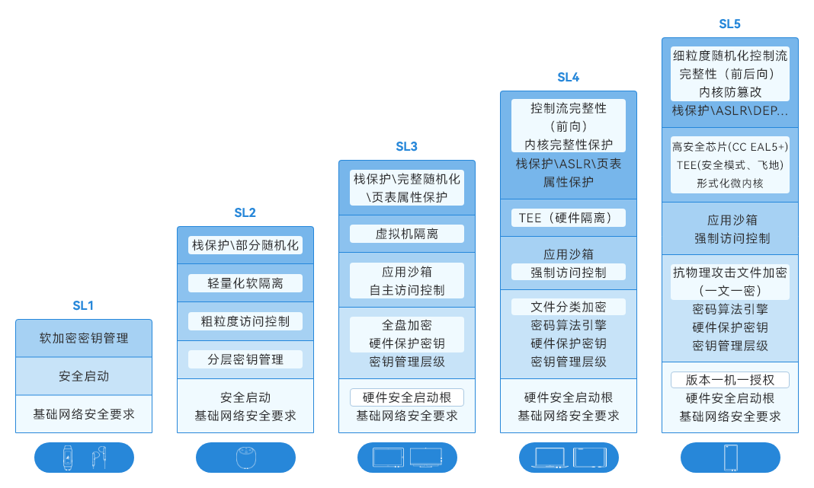
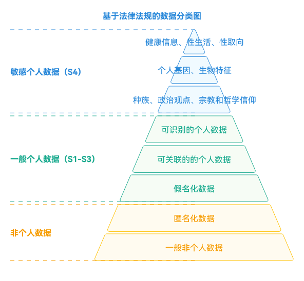
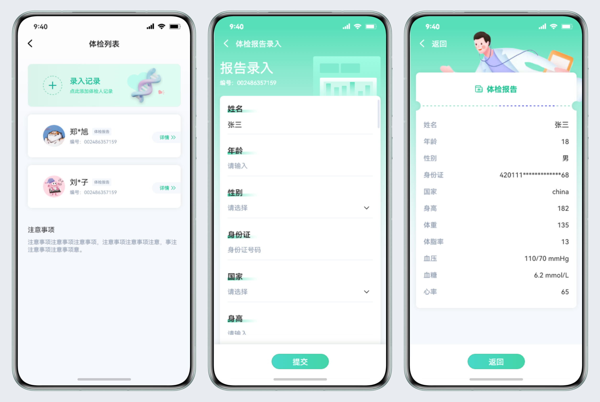

# 应用数据安全

更新时间：2026-05-18 00:55:31

来源：https://developer.huawei.com/consumer/cn/doc/best-practices/bpta-app-data-security

**   


#### 概述

应用的安全性是成功的关键。
 
HarmonyOS提供系统安全、DevEco Studio工具安全和应用安全生态三个层面的安全能力。
 
- 在系统安全层面，HarmonyOS通过完整性保护、漏洞防利用和安全可信环境等技术，支持应用的安全运行，保证业务的安全可靠。
- 在DevEco Studio和工具层面，生态开发者提供的应用来自不同的开发者，用途各异。除了优质的生态应用外，还存在恶意牟利、黑产、诈骗、恶意营销广告推广（如恶意弹框）等各种风险应用。为确保生态应用的安全、纯净和可控，HarmonyOS将构建端到端的安全可控生态模式。
- 在应用安全生态方面，HarmonyOS通过多种软硬件基础设施保障应用的安全性。具体措施包括实现敏感数据存储和用户隐私保护：
敏感数据等级划分：通过设备和数据等级划分，保护用户数据安全，确保分布式设备间数据正确流动。
- 文件分级保护：应用根据数据安全等级，保存到系统加密目录，确保数据安全。
- 关键资产数据加密保护：提供基于TEE的安全保护和管理API，开发者无需关注底层实现。

 
 
讨论应用安全生态层面的敏感数据存储和用户隐私保护。
 
 

#### 风险等级划分

HarmonyOS安全能力以分级安全为架构基础，构建安全应用生态，包括设备和数据的安全等级划分。
 
 
- 在分布式场景中，不同设备的安全等级不同，需要进行设备分级，确保数据跨设备流动的安全性。
- 对流动的数据进行分级，例如数据能否流动到普通设备上，不同敏感程度的数据有不同的流动限制。这些分级应在系统层面决定，而非应用层面。如果在应用层面划分数据等级，且应用开发者缺乏等级概念，会导致系统数据严重泄露。

 

#### 设备等级划分

根据设备安全能力，如是否有TEE和安全存储芯片等，将设备安全等级分为SL1、SL2、SL3、SL4和SL5五个等级。例如，智能穿戴设备通常为低安全的SL1设备，手机和平板通常为高安全的设备。
 
 



 
设备从SL1到SL5分级，在完整性保护、加密及数据保护、权限及访问控制、可信执行环境和漏洞防利用这几个维度对应的安全能力要求逐渐提高。
 

#### 数据等级划分

 
敏感数据分类可帮助应用开发者根据数据的敏感性、价值以及数据泄露时的潜在影响来识别和分类数据。开发者需要了解不同类型的数据及其使用方式，并对数据进行分类，针对分类制定适当的安全措施和控制措施来保护数据并确保遵守相关法规和标准。下表举例说明了个人数据的分类：
  
| 个人数据分类 | 数据分级 | 举例 |
| --- | --- | --- |
| 个人/敏感数据 | 关键资产数据 | 严重 | 口令、认证Token、密保问题答案 |
| 个人/敏感数据 | 个人种族数据 | 种族血统 | 严重 |
| 个人/敏感数据 | 权威社会识别标识 | 高 | 身份证号码、军官证、社会/保险保障号码（社会号码）、驾照、护照号码、签证授权编号 |
| 个人/敏感数据 | 负向名誉数据 | 高 | 犯罪记录（刑事、民事犯罪和诉讼记录）、服刑记录、纪律处分 |
| 个人/敏感数据 | 健康数据 | 高 | 健康数据（身高、体重、体脂、血压、血糖、心率等）、医疗记录 |
| 个人/敏感数据 | 家居控制数据 | 高 | 家居控制、汽车反向控制、手机投屏后反向控制等 |
| 个人/敏感数据 | 年龄生辰数据 | 中 | 年龄，出生日期 |
| 个人/敏感数据 | 虚拟网络身份标识 | 中 | 华为帐号、宽带帐号、其他网络帐号（电话号码、邮箱） |
| 个人/敏感数据 | 一般社会识别标识 | 中 | 姓名 |
| 个人/敏感数据 | 个人多媒体数据 | 中 | 照片、视频、录音、文字、日历日程、备忘录文本等 |
| 个人/敏感数据 | 一般注册信息 | 低 | 昵称、头像、性别、国籍、出生地、教育背景、专业背景等 |
| 个人/敏感数据 | 正向名誉数据 | 低 | 专业成就 |
| 非个人数据 | 非个人数据 | 公开 | 匿名化处理后的个人数据 |
| 非个人数据 | 非个人数据 | 系统、设备信息中公开发布的数据，如：TCB模块的版本信息、完整性度量值、访问控制策略数据的完整性度量值、策略数据本身等 | 公开 |
 
 
除了对数据进行内容分类，开发者还需遵守相关法律法规，例如通用数据保护条例（GDPR）和个人信息保护法，以保护用户隐私和数据安全。具体的数据分类图如图1所示。
 



 
按照个人数据分类分级规范要求，可将数据分为S1、S2、S3、S4四个安全等级。
  
| 风险等级 | 风险标准 | 定义 | 样例 |
| --- | --- | --- | --- |
| 严重 | S4 | 业界法律法规定义的特殊数据类型，涉及个人的最私密领域的信息或一旦泄露、篡改、破坏、销毁可能会给个人或组织造成重大的不利影响的数据。 | 政治观点、宗教和哲学信仰、工会成员资格、基因数据、生物信息、健康和性生活状况，性取向等或设备认证鉴权、个人信用卡等财务信息等。 |
| 高 | S3 | 数据泄露、篡改、破坏、销毁可能给个人或组织带来严峻不利影响。 | 个人实时精确定位信息、运动轨迹等。 |
| 中 | S2 | 数据泄露、篡改、破坏、销毁可能给个人或组织带来严重不利影响。 | 个人的详细通信地址、姓名昵称等。 |
| 低 | S1 | 数据泄露、篡改、破坏、销毁可能给个人或组织带来有限不利影响。 | 性别、国籍、用户申请记录等。 |
 
 
数据安全标签和设备安全等级越高，加密措施和访问控制措施越严格，从而确保数据安全性更高。
 
数据跨设备同步时，根据数据安全标签和设备安全等级进行访问控制。规则如下：数据从本设备同步到对端设备的前提是，本设备的数据安全标签不高于对端设备的设备安全等级，否则无法同步。具体访问控制矩阵如下：
  
| 设备安全级别 | 可同步的数据安全标签 |
| --- | --- |
| SL1 | S1 |
| SL2 | S1~S2 |
| SL3 | S1~S3 |
| SL4 | S1~S4 |
| SL5 | S1~S4 |
 
 
手表为低安全级别的SL1设备。若创建数据安全标签为S1的数据库，则此数据库数据可以在这些设备间同步；若创建的数据库标签为S2至S4，则不能在这些设备间同步。
 

#### 分级数据加密

 

#### 分级数据保护

不同的文件路径具有独特的属性和特征。应用沙箱保护分级数据，防止恶意路径穿越访问。在应用文件目录中，根据文件加密类型区分不同的目录。
 
- el1，设备级加密区：设备开机后即可访问的数据区。
- el2，用户级加密区：设备开机后，需要至少一次解锁对应用户的锁屏界面（密码、指纹、人脸等方式或无密码状态）后，才能够访问的加密数据区。应用如无特殊需要，应将数据存放在el2加密目录下，以尽可能保证数据安全。但是对于某些场景，一些应用文件需要在用户解锁前就可被访问，例如时钟、闹铃、壁纸等，此时应用需要将这些文件存放到设备级加密区（el1）。切换应用文件加密类型目录的方法请参见[获取和修改加密分区](https://developer.huawei.com/consumer/cn/doc/harmonyos-guides/application-context-stage#获取和修改加密分区)。

 
应用文件目录的详细介绍请参考[应用文件目录与应用文件路径](https://developer.huawei.com/consumer/cn/doc/harmonyos-guides/app-sandbox-directory#应用文件目录与应用文件路径)。
 
分级数据文件路径使用应用通用文件路径，获取路径代码如下：
 
```ArkTS
getEl2Path(): void {
  let context = this.getUIContext().getHostContext() as common.UIAbilityContext;
  context.area = contextConstant.AreaMode.EL2;
  let filePath = context.filesDir + '/health_data.txt';
  this.message = filePath;
}
```
 
需要获取el1的路径时，修改AreaMode。代码如下：
 
```ArkTS
getEl1Path(): void {
  let context = this.getUIContext().getHostContext() as common.UIAbilityContext;
  context.area = contextConstant.AreaMode.EL1;
  let filePath = context.filesDir + '/health_data.txt';
  this.message = filePath;
}
```
 
如果应用没有特殊需求，应将数据存储在el2加密目录中。
 
系统提供4种文件级加密类型以实现文件保护。应用可根据需求将文件保存到对应的数据目录。下表列出了各加密区所对应的策略：
  
| 分级加密 | 策略 |
| --- | --- |
| el4 | 用户锁定设备后 10 秒钟，解密的数据保护类密钥会被从内存丢弃，此类的所有数据都无法访问，除非用户再次输入密码或使用指纹或面容解锁设备。 |
| el3 | 用户锁定设备后，如果文件已经被打开，则文件始终可以被继续访问，一旦文件关闭（锁屏），文件将不能被再次访问，除非用户再次输入密码或使用指纹或面容解锁设备。 |
| el2 | 用户开机后首次解锁设备后，即可对文件进行访问。这是未分配给数据保护类的所有第三方应用数据的默认数据保护类。 |
| el1 | 设备在直接启动模式下和用户解锁设备后均可对文件进行访问。 |
 
 
 

#### 数据加密算法

通用密钥库系统（OpenHarmony Universal KeyStore，简称HUKS）为业务提供平台级的密钥管理功能，包括密钥的生成、导入、销毁、证明、协商、派生、加密、解密、签名、验签及访问控制。HUKS作为系统的底层安全能力，业务无需实现复杂的密码学算法和密钥访问控制模型，即可安全、便捷地使用HUKS提供的密钥全生命周期管理功能，从而确保业务敏感数据的安全。
 
使用数据加密算法实现数据加密请参考[Universal Keystore Kit简介](https://developer.huawei.com/consumer/cn/doc/harmonyos-guides/huks-overview)。
 
 

#### 数据安全案例

健康数据是日常生活中常见的敏感数据，在HarmonyOS设备中广泛存在，如手机和手表。下面介绍体检报表的存储和保护案例。
 
 

#### 场景设计

根据数据分类规则，体检数据被归类为高风险级别的数据。因此，在程序设计过程中，除了采用分级数据加密的保护措施外，还需进行二次加密以增强数据的安全性。具体而言，可以先对数据进行一次加密，再使用分级数据加密的方法处理加密后的数据。这样可以提高数据的保密性和完整性，有效防止潜在的数据泄露和非法访问。通过多层次的加密措施，确保体检数据安全可靠地存储和传输。
 
程序的场景包含三个页面：体检列表页、数据录入页和数据详情页。页面如下：
 
图1 **场景设计图



 
 

#### 场景开发

 
在实际开发中，数据的加密与解密经常同时存在。本场景中也一样，由两个子场景组成：数据录入和数据详情。下面分别介绍这两个子场景的具体实现方式。
 
- 数据录入的实现方式

1. 在列表页点击录入按钮，进入数据录入页。
2. 在数据录入页中录入信息，以标签提示字符为键，将数据组装成JSON对象。
3. 对录入的信息进行加密。组装好的JSON对象序列化为字符串，再将字符串转换为字节数组，使用HUKS接口对字节数组进行加密，得到加密后的字节数组。
4. 对加密后的数据进行分级加密，然后将加密后的字节数组使用fileio接口写入分级加密文件。
 
- 数据详情的实现方式

1. 在列表页点击数据项，进入数据详情页，使用pushUrl接口的params参数传递分级加密文件的文件名。
2. 对加密数据进行解密。根据params传入的分级加密文件名，调用fileio接口读取加密数据，然后调用huks接口解密读取的字节数组，获得解密后的字节数组。
3. 展示数据详情。将解密后的字节数组转换为字符串，再将字符串转换为JSON对象，并将其展示到页面。
 

#### 代码实现

- 分级加密数据读写

 
 
参考[分级数据保护](#section1433616432387)中代码获取到数据路径后按正常的文件读写即可，以下是文件读写的代码：
 
```ArkTS
function writeFile(filePath: string, data: string): void {
  try {
    let file = fileIo.openSync(filePath, fileIo.OpenMode.READ_WRITE | fileIo.OpenMode.CREATE);
    let writeLen = fileIo.writeSync(file.fd, data);
    hilog.info(0x0000, 'AppDataSecurity', 'The length of str is: ' + writeLen);
    fileIo.closeSync(file);
  } catch (error) {
    hilog.error(0x0000, 'AppDataSecurity', `writeFile error ${JSON.stringify(error)}`);
  }
}

function readFile(filePath: string): string {
  try {
    let file = fileIo.openSync(filePath, fileIo.OpenMode.READ_WRITE | fileIo.OpenMode.CREATE);
    let arrayBuffer = new ArrayBuffer(1024);

    class Option {
      public offset: number = 0;
      public length: number = 0;
    }

    let option = new Option();
    option.length = arrayBuffer.byteLength;
    let readLen = fileIo.readSync(file.fd, arrayBuffer, option);
    let buf = buffer.from(arrayBuffer, 0, readLen);
    hilog.info(0x0000, 'AppDataSecurity', `The length of of file: ${readLen}`);
    fileIo.closeSync(file);
    return buf.toString();
  } catch (error) {
    hilog.error(0x0000, 'AppDataSecurity', `readFile error ${JSON.stringify(error)}`);
  }
  return '';
}
```
 
- 数据加解密

 
在使用huks之前，先配置加密算法的规格。本案例中选择密钥长度为128的AES算法。在使用加解密算法前，先生成算法key。以下是算法配置和生成算法key的代码。
 
在生成算法key的配置函数中，需要指定算法类型HUKS_ALG_AES、算法key的大小以及密钥用途。
 
```ArkTS
function GetAesGenerateProperties(): Array<huks.HuksParam> {
  let properties: Array<huks.HuksParam> = [{
    tag: huks.HuksTag.HUKS_TAG_ALGORITHM,
    value: huks.HuksKeyAlg.HUKS_ALG_AES
  }, {
    tag: huks.HuksTag.HUKS_TAG_KEY_SIZE,
    value: huks.HuksKeySize.HUKS_AES_KEY_SIZE_128
  }, {
    tag: huks.HuksTag.HUKS_TAG_PURPOSE,
    value: huks.HuksKeyPurpose.HUKS_KEY_PURPOSE_ENCRYPT |
    huks.HuksKeyPurpose.HUKS_KEY_PURPOSE_DECRYPT
  }];
  return properties;
}
```
 
加密函数的算法规格必须与生成算法密钥的配置一致。
 
HUKS_TAG_PADDING填充模式有三种。
 
- NoPadding：不带填充；
- PKCS5：填充字符由一个字节序列组成，每个字节填充该填充字节序列的长度，规定8字节填充；
- PKCS7：填充字符和PKCS5填充方法一样，但是可以在1-255字节之间任意填充。

 
HUKS_TAG_BLOCK_MODE有7种分组模式。对于CBC、CTR、OFB、CFB模式，仅使用HUKS_TAG_IV加解密参数。对于GCM、CCM模式，需要设置HUKS_TAG_NONCE、HUKS_TAG_ASSOCIATED_DATA，并配置HUKS_TAG_IV。
 
```ArkTS
function GetAesEncryptProperties(): Array<huks.HuksParam> {
  let properties: Array<huks.HuksParam> = [{
    tag: huks.HuksTag.HUKS_TAG_ALGORITHM,
    value: huks.HuksKeyAlg.HUKS_ALG_AES
  }, {
    tag: huks.HuksTag.HUKS_TAG_KEY_SIZE,
    value: huks.HuksKeySize.HUKS_AES_KEY_SIZE_128
  }, {
    tag: huks.HuksTag.HUKS_TAG_PURPOSE,
    value: huks.HuksKeyPurpose.HUKS_KEY_PURPOSE_ENCRYPT
  }, {
    tag: huks.HuksTag.HUKS_TAG_PADDING,
    value: huks.HuksKeyPadding.HUKS_PADDING_PKCS7
  }, {
    tag: huks.HuksTag.HUKS_TAG_BLOCK_MODE,
    value: huks.HuksCipherMode.HUKS_MODE_CBC
  }, {
    tag: huks.HuksTag.HUKS_TAG_IV,
    value: StringToUint8Array(IV)
  }];
  return properties;
}
```
 
解密函数的算法规格应与加密算法的配置一致，但需将密钥用途设置为解密。
 
```ArkTS
function GetAesDecryptProperties(): Array<huks.HuksParam> {
  let properties: Array<huks.HuksParam> = [{
    tag: huks.HuksTag.HUKS_TAG_ALGORITHM,
    value: huks.HuksKeyAlg.HUKS_ALG_AES
  }, {
    tag: huks.HuksTag.HUKS_TAG_KEY_SIZE,
    value: huks.HuksKeySize.HUKS_AES_KEY_SIZE_128
  }, {
    tag: huks.HuksTag.HUKS_TAG_PURPOSE,
    value: huks.HuksKeyPurpose.HUKS_KEY_PURPOSE_DECRYPT
  }, {
    tag: huks.HuksTag.HUKS_TAG_PADDING,
    value: huks.HuksKeyPadding.HUKS_PADDING_PKCS7
  }, {
    tag: huks.HuksTag.HUKS_TAG_BLOCK_MODE,
    value: huks.HuksCipherMode.HUKS_MODE_CBC
  }, {
    tag: huks.HuksTag.HUKS_TAG_IV,
    value: StringToUint8Array(IV)
  }];
  return properties;
}
```
 
完成上述配置后，调用生成算法的key函数。
 
```ArkTS
async function GenerateAesKey(): Promise<void> {
  let genProperties = GetAesGenerateProperties();
  let options: huks.HuksOptions = {
    properties: genProperties
  };

  await huks.generateKeyItem(aesKeyAlias, options)
    .then((data) => {
      hilog.info(0x0000, 'AppDataSecurity', `promise: generate AES Key success, data = ${JSON.stringify(data)}`);
    }).catch((error: Error) => {
      hilog.error(0x0000, 'AppDataSecurity', `promise: generate AES Key failed, ${JSON.stringify(error)}`);
    })
}
```
 
生成算法密钥后即可进行加解密。加解密过程中，先获取相应配置，然后调用initSession和finishSession完成操作。
 
```ArkTS
async function EncryptData(): Promise<void> {
  let encryptProperties = GetAesEncryptProperties();
  let options: huks.HuksOptions = {
    properties: encryptProperties,
    inData: StringToUint8Array(plainText)
  };

  await huks.initSession(aesKeyAlias, options)
    .then((data) => {
      handle = data.handle;
    }).catch((error: Error) => {
      hilog.error(0x0000, 'AppDataSecurity', `promise: init EncryptData failed, ${JSON.stringify(error)}`);
    })

  await huks.finishSession(handle, options)
    .then((data) => {
      hilog.info(0x0000, 'AppDataSecurity',
        `promise: encrypt data success, data is ` + Uint8ArrayToString(data.outData as Uint8Array));
      cipherData = data.outData as Uint8Array;
    }).catch((error: Error) => {
      hilog.error(0x0000, 'AppDataSecurity', `promise: encrypt data failed, ${JSON.stringify(error)}`);
    })
}

async function DecryptData(): Promise<void> {
  let decryptOptions = GetAesDecryptProperties()
  let options: huks.HuksOptions = {
    properties: decryptOptions,
    inData: cipherData
  };

  await huks.initSession(aesKeyAlias, options)
    .then((data) => {
      handle = data.handle;
    }).catch((error: Error) => {
      hilog.error(0x0000, 'AppDataSecurity', `promise: init DecryptData failed, ${JSON.stringify(error)}`);
    })

  await huks.finishSession(handle, options)
    .then((data) => {
      hilog.info(0x0000, 'AppDataSecurity',
        `promise: decrypt data success, data is ` + Uint8ArrayToString(data.outData as Uint8Array));
    }).catch((error: Error) => {
      hilog.error(0x0000, 'AppDataSecurity', `promise: decrypt data failed, ${JSON.stringify(error)}`);
    })
}
```
 
> [!NOTE]
> 在体检报表中存在敏感数据，因此需要对数据进行二次加密和分级加密。解密过程与加密顺序相反，先读取分级加密的数据，再进行解密。当涉及不同密级的敏感数据时，可以按密级分别封装序列化，避免高密级数据在数据流动过程中泄露到低密级设备中。 为了方便日志打印输出，对加密后的数据进行Base64转码。在应用开发中，此步骤可以省略。

 

#### 总结与回顾

数据安全在应用开发中至关重要，必须在分析评估和设计开发两个阶段综合考虑。
 
- 对应用中涉及的各类数据进行全面的风险评估和分类分析，根据数据的敏感程度和重要性确定相应的安全保护策略。
- 采用分级数据保护和合适的加密算法规格 ，避免敏感数据泄露。

 
本文中，针对体检报表中的数据进行了安全等级划分，并根据定义的等级采取了相应的加密措施。
 
- 数据安全分级是根据数据的重要性和敏感程度进行分类保护的方法。通过分类，采取相应的安全措施，确保数据安全。开发人员应根据业务场景选择合适的数据分级保护策略，降低数据管理复杂度，提高数据安全性。例如，对敏感的个人隐私数据，应实施严格的访问控制，防止未经授权的访问和泄露。
- 数据加密技术保护数据机密性。合理选择加密算法和规格，平衡安全性和计算复杂度，确保用户正常使用。还需考虑数据的传输加密和存储加密。

 
在实际应用开发中，开发者应重视数据安全，持续完善数据安全保护措施，确保用户数据安全和隐私得到有效保护。
 
 

#### 示例代码

- [应用数据安全](https://gitcode.com/harmonyos_samples/BestPracticeSnippets/tree/master/AppDataSecurity)
