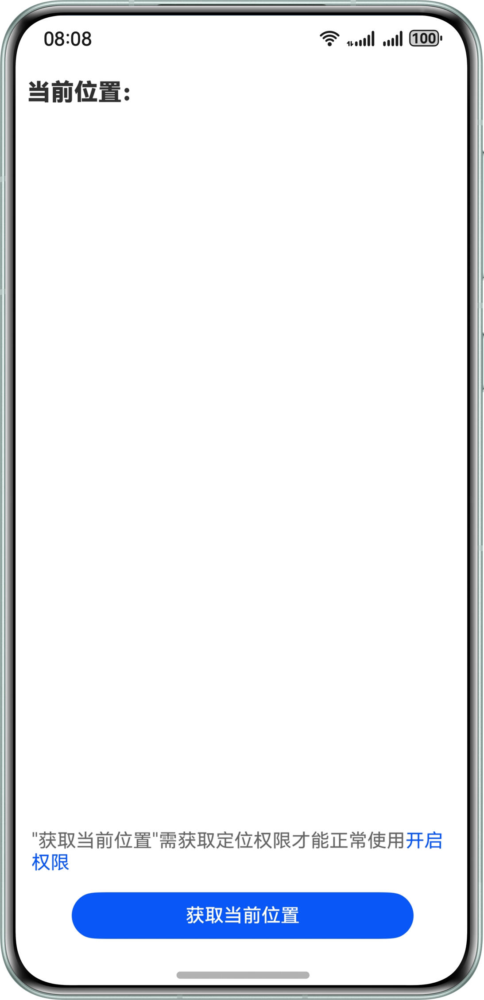
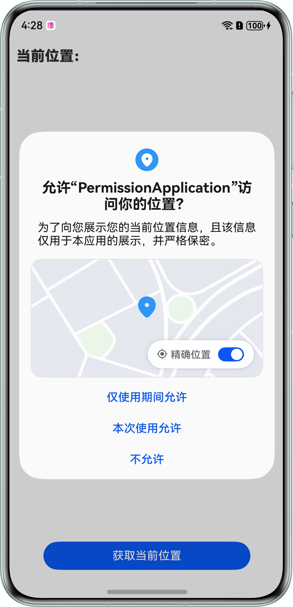
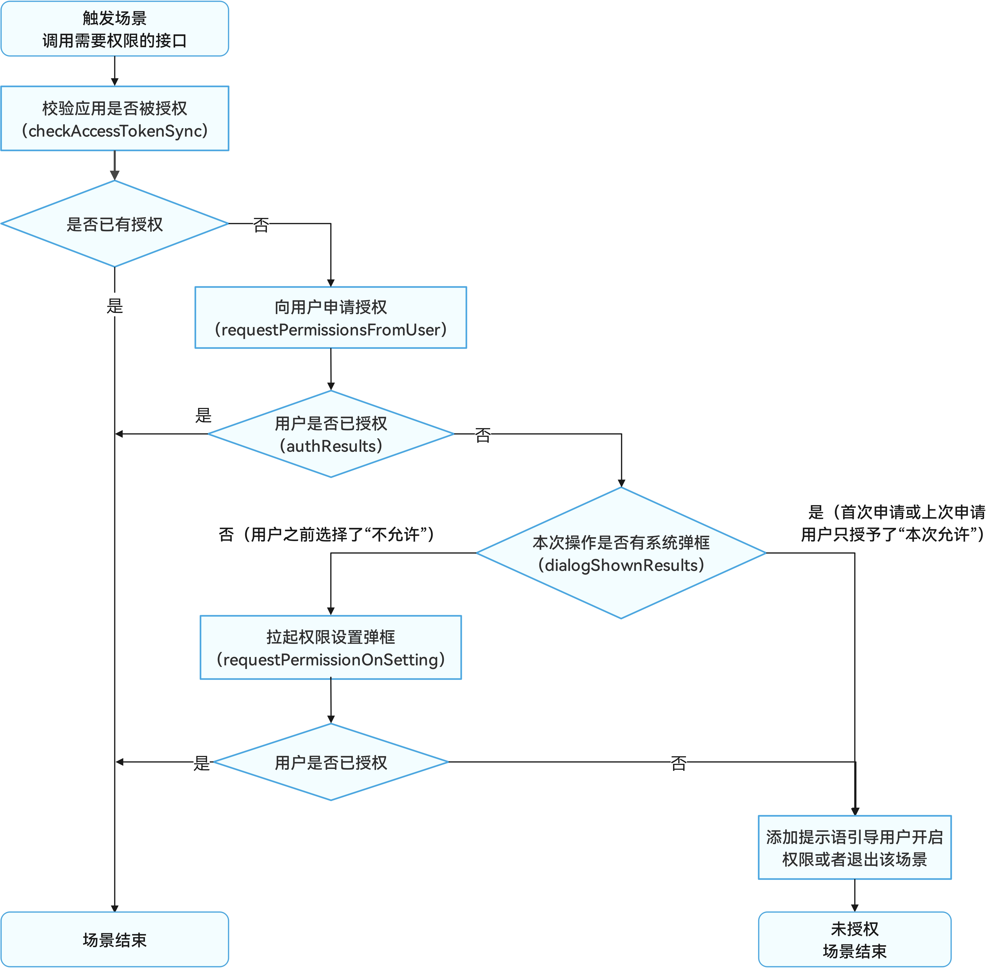
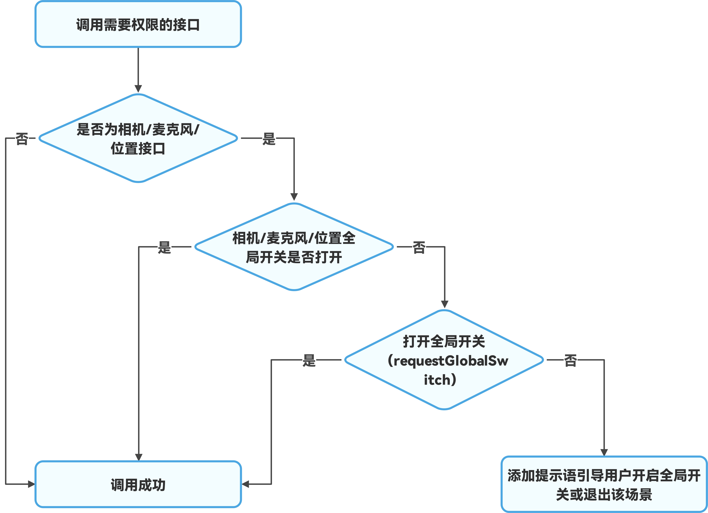

# 应用权限申请

更新时间：2026-03-12 08:45:02

来源：https://developer.huawei.com/consumer/cn/doc/best-practices/bpta-permission-application

##### 概述

在HarmonyOS开发中，应用访问如相机、麦克风、位置、图库等系统资源或系统能力时，需通过[系统Picker](https://developer.huawei.com/consumer/cn/doc/harmonyos-guides/use-picker)、[安全控件](https://developer.huawei.com/consumer/cn/doc/harmonyos-guides/security-component-overview)、[授权使用](https://developer.huawei.com/consumer/cn/doc/harmonyos-guides/app-permission-mgmt-overview)等方式来访问，以确保用户隐私安全。在申请权限授权过程中需严格遵循HarmonyOS[应用安全隐私体验建议](https://developer.huawei.com/consumer/cn/doc/harmonyos-guides/security-privacy-experience-standards)，同时符合UX体验设计，以提供合理且用户友好的交互体验。本文将从以下五个方面，介绍应用申请权限时的注意事项：
 
- 优先使用系统Picker或者安全控件
- 权限申请时机
- 明确申请原因
- 向用户申请授权
- 功能被禁用处理方式

 
 

##### 优先使用系统Picker或者安全控件

系统通过提供系统Picker和安全控件两种方式，使得应用能够便捷地访问系统资源。这两种方法均依赖于系统的独立进程来实现，当应用拉起系统Picker或展示安全控件时，必须依赖用户的主动操作来获取资源或结果。这一流程避免了应用额外申请权限，同时，由于用户的积极参与，进一步增强了用户隐私和安全的保护。
 
**系统Picker**
 
系统Picker是拉起系统资源的一种方式，由于系统Picker已经获取了对应权限的预授权，开发者使用系统Picker时，无需再次申请权限也可临时受限访问对应的资源。
 
使用系统Picker组件拉起系统应用的场景主要有：联系人Picker（Contacts Picker），地图Picker，相机Picker（Camera Picker），扫码Picker，卡证识别Picker，文档扫描Picker，文件Picker，音频Picker和照片Picker（PhotoViewPicker）等，详细可参考[拉起系统应用](https://developer.huawei.com/consumer/cn/doc/harmonyos-guides/system-app-startup)。
 
**安全控件**
 
安全控件是系统提供的一组系统实现的ArkUI组件，应用集成这类组件就可以实现在用户点击后自动授权，而无需弹窗授权。它们可以作为一种“特殊的按钮”融入应用页面，实现用户点击即许可的设计思路。
 
目前系统提供两类安全控件：[粘贴控件（PasteButton）](https://developer.huawei.com/consumer/cn/doc/harmonyos-guides/pastebutton)、[保存控件（SaveButton）](https://developer.huawei.com/consumer/cn/doc/harmonyos-guides/savebutton)。
 
**使用场景示例**
 
以下场景优先使用系统Picker或安全控件：
 1. 读写媒体库中的图片或视频：
- 推荐方案（无需申请权限）：使用[PhotoViewPicker](https://developer.huawei.com/consumer/cn/doc/harmonyos-guides/photoaccesshelper-photoviewpicker)读取媒体库的图片与视频；使用安全控件中的保存控件[保存媒体库资源](https://developer.huawei.com/consumer/cn/doc/harmonyos-guides/photoaccesshelper-savebutton)。

2. 申请权限方案：申请受限权限[ohos.permission.READ_IMAGEVIDEO](https://developer.huawei.com/consumer/cn/doc/harmonyos-guides/restricted-permissions#ohospermissionread_imagevideo)或[ohos.permission.WRITE_IMAGEVIDEO](https://developer.huawei.com/consumer/cn/doc/harmonyos-guides/restricted-permissions#ohospermissionwrite_imagevideo)读取媒体库的图片与视频。

3. 拉起系统相机进行拍照和录制：
推荐方案（无需申请权限）：仅是需要拉起系统相机拍摄一张照片、录制一段视频，可直接使用[CameraPicker](https://developer.huawei.com/consumer/cn/doc/harmonyos-references/js-apis-camerapicker)，无需申请相机权限。

4. 申请权限方案：开发一个相机应用（或是在应用内开发相机模块）时，需按[相机开发指导](https://developer.huawei.com/consumer/cn/doc/harmonyos-guides/camera-preparation)在开发前做好申请权限的准备。

  

  ##### 权限申请时机

  为了应用发挥完整功能，需要访问系统特定资源，这些资源的访问需要获得相应权限许可。在应用进行权限申请时，选择合适的申请时机是提升用户体验和保护用户隐私安全的关键。具体包括两点：

  **按需请求权限**

  
核心原则：应用应遵循最小权限原则，仅申请实际需要的权限。
- 实施策略：将权限请求与应用内的具体功能场景紧密结合。避免在应用首次启动时请求大量权限。应在用户实际使用某项功能，且该功能依赖于特定权限时，再请求相应权限。例如，当用户点击“获取当前位置”按钮时，触发查看位置信息的场景，此时弹出请求位置权限的弹框。

 
**尊重用户选择，避免强制请求**
 
- 核心原则：尊重用户选择权，不应强制授予权限。
- 实施策略：如果用户拒绝了某项权限申请，应用不应再次弹窗请求该权限。应在页面的适当位置添加明确的提示，指导用户开启权限或退出当前需要该权限的场景，直到用户重新触发时再引导其完成授权。例如，权限申请被拒绝后，按钮上方显示提示文字，具体效果见下图：



 
 

##### 明确声明原因

请求应用权限时，增强用户信任并减少拒绝风险的关键在于清晰说明。通过对话框或提示信息，向用户解释为何需要权限，或说明数据如何被使用，即明确声明原因。
 
在应用开发过程中，首先需要在[module.json5配置文件](https://developer.huawei.com/consumer/cn/doc/harmonyos-guides/module-configuration-file)的requestPermissions标签中[声明权限](https://developer.huawei.com/consumer/cn/doc/harmonyos-guides/declare-permissions)。其中权限使用理由必须按照规范来填写，具体规范可参考官方声明权限中[权限使用理由的文案内容规范](https://developer.huawei.com/consumer/cn/doc/harmonyos-guides/declare-permissions#权限使用理由的文案内容规范)章节。
 
 
填写权限声明原因时，应遵循以下原则与规范，以增强用户的理解度、提升信任感、降低权限拒绝率并优化整体用户体验：
 
- 明确性与具体性：清晰具体地阐述每个权限请求的实际用途及场景，避免模糊语言。多个场景需申请同一权限时，首次申请时展示所有相关场景。
- 透明性：确保声明信息真实可信，不夸大或隐瞒权限用途。
- 简洁性：语言简洁明了，避免冗长复杂描述。
- 尊重用户：强调信息保密性和安全性，体现应用诚信和责任感。

 
以下是一些正反例来说明如何按照规范填写权限声明原因了，详细内容可参考指南[reason字段的内容写作规范及建议](https://developer.huawei.com/consumer/cn/doc/harmonyos-guides/declare-permissions#reason字段的内容写作规范及建议)。
 
**正例**
 
- 正例1（以示例代码为例，效果图如下）权限：位置信息

  权限声明原因：“为了向您展示您的当前位置信息，且该信息仅用于本应用的展示，并严格保密。”

  解释：此示例清晰地说明了应用为何需要位置信息（展示您的当前位置信息），并承诺了信息的使用范围及用途（仅用于本应用的展示），确保了信息的保密性，符合规范且易于用户理解。

  


 
- 正例2权限：相机

  规范填写示例：“我们需要访问您的相机权限，用于拍摄照片、录制视频以及进行人脸识别等功能。”

  解释：此示例明确指出了相机权限的用途（拍摄照片、录制视频、人脸识别），并强调了这些功能对提升应用体验的重要性，符合规范。

 
**反例**
 
- 反例1权限：位置信息

  不规范填写示例：“我们需要您的位置信息。”

  解释：此示例虽然简短，但并未明确说明位置信息的具体用途，用户可能不清楚为何需要此权限，缺乏明确性与透明度，不符合规范。
- 反例2权限：相机

  不规范填写示例：“为了应用功能，请允许访问相机。”

  解释：此示例同样过于笼统，没有具体说明相机权限将用于哪些功能，用户难以判断权限请求的合理性，也不符合规范。

 

##### 向用户申请授权

在配置文件中声明user_grant类型权限后，还需向用户请求授权。只有经过用户允许，才能获得该权限。在此过程中，应确保符合UX体验设计，为用户提供良好的体验，避免出现二次弹框或要求用户手动到设置中开启权限。
 
 
当用户触发需要使用权限的场景时，首先需要判断当前是否已经授权，如果已经授权，则可以直接访问目标操作，否则需要向用户申请授权。调用[requestPermissionsFromUser()](https://developer.huawei.com/consumer/cn/doc/harmonyos-references/js-apis-abilityaccessctrl#requestpermissionsfromuser9)方法可以向用户申请授权，通过判断返回结果authResults字段为0则表示用户已经授权，则可以继续访问目标操作，authResults字段为-1则表示用户没有授权，这时需要判断返回结果的dialogShownResults，当结果为true表示有弹框表明已经向用户展示请求授权的弹窗但是用户拒绝了授权，那应用需要在页面内合适的位置添加提示语引导用户开启权限或者退出该场景，dialogShownResults结果为false表示当前应用没有被授权且没有向用户展示请求授权的弹框，那应用可以调用[requestPermissionOnSetting()](https://developer.huawei.com/consumer/cn/doc/harmonyos-references/js-apis-abilityaccessctrl#requestpermissiononsetting12)方法直接拉起权限设置弹框，引导用户授予权限。
 


 

在调用requestPermissionOnSetting()方法前，需先调用requestPermissionsFromUser()方法。
 
若用户点击了“本次使用允许”，下次申请权限应调用requestPermissionsFromUser()方法，而不是直接调用requestPermissionOnSetting()方法。
 

 
系统弹框一般有三种操作，如下图所示。
 1. 仅使用期间允许：点击后应用直接获取该权限，且再次调用requestPermissionsFromUser()方法无法拉起该权限设置弹框；
2. 本次使用允许：点击后将会对应用授予临时的权限，详情请参考[向用户申请单次授权](https://developer.huawei.com/consumer/cn/doc/harmonyos-guides/one-time-authorization)，若临时权限被取消，再次调用requestPermissionsFromUser()方法将会拉起该权限设置弹框；
3. 不允许：点击后应用无法获取该权限，且再次调用requestPermissionsFromUser()方法无法拉起该权限设置弹框。


 
具体流程图如下：
 



 
**示例代码**
 
判断当前应用是否已经被授权。
 
```ArkTS
// Verify if the application has been granted permission.
checkPermissionGrant(): void {
  let hasPermission = false;
  let tokenId: number = 0;
  try {
    let bundleInfo: bundleManager.BundleInfo =
      bundleManager.getBundleInfoForSelfSync(bundleManager.BundleFlag.GET_BUNDLE_INFO_WITH_APPLICATION);
    let appInfo: bundleManager.ApplicationInfo = bundleInfo.appInfo;
    tokenId = appInfo.accessTokenId;
  } catch (error) {
    const err: BusinessError = error as BusinessError;
    hilog.error(0x0000, 'Index',
      `Failed to get bundle info for self. Code is ${err.code}, message is ${err.message}`);
  }

  try {
    let atManager = abilityAccessCtrl.createAtManager();
    let approximatelyLocation = atManager.checkAccessTokenSync(tokenId, 'ohos.permission.APPROXIMATELY_LOCATION');
    let location = atManager.checkAccessTokenSync(tokenId, 'ohos.permission.LOCATION');
    hasPermission = approximatelyLocation === abilityAccessCtrl.GrantStatus.PERMISSION_GRANTED &&
      location === abilityAccessCtrl.GrantStatus.PERMISSION_GRANTED;
  } catch (error) {
    const err: BusinessError = error as BusinessError;
    hilog.error(0x0000, 'Index', `Failed to check access token. Code is ${err.code}, message is ${err.message}`);
  }
  if (hasPermission) {
    this.isLocationToggle();
  } else {
    this.requestPermissions();
  }
}
```
 
向用户申请授权。
 
```ArkTS
// Requests location permissions from the user.
requestPermissions(): void {
  let atManager = abilityAccessCtrl.createAtManager();
  try {
    atManager.requestPermissionsFromUser(this.context, ['ohos.permission.APPROXIMATELY_LOCATION',
      'ohos.permission.LOCATION']).then((data) => {
      if (data.authResults[0] === -1 || data.authResults[1] === -1) {
        if (data.dialogShownResults && (data.dialogShownResults[0] || data.dialogShownResults[1])) {
          this.isShowPermissions = true;
          if(data.authResults[0] === -1){
            this.permissionsMessage = $r('app.string.obtain_location_permission');
          } else {
            this.permissionsMessage = $r('app.string.obtain_precise_positioning')
          }
        } else {
          this.openPermissionsSetting();
          return;
        }
      } else {
        this.isShowPermissions = false;
      }
      if (data.authResults[0] !== 0) {
        return;
      }
      this.isLocationToggle();
    }).catch((err: Error) => {
      hilog.error(0x0000, 'Index', 'requestPermissionsFromUser err:' + JSON.stringify(err));
    });
  } catch (err) {
    hilog.error(0x0000, 'Index', 'requestPermissionsFromUser err:' + JSON.stringify(err));
  }
}
```
 
引导用户授权。
 
```ArkTS
// The permission setting dialog box is displayed.
private openPermissionsSetting(): void {
  let atManager = abilityAccessCtrl.createAtManager();
  atManager.requestPermissionOnSetting(this.context, ['ohos.permission.APPROXIMATELY_LOCATION',
    'ohos.permission.LOCATION']).then((data: Array<abilityAccessCtrl.GrantStatus>) => {
    if (data[0] === -1 && data[1] === -1) {
      this.isShowPermissions = true;
      this.permissionsMessage = $r('app.string.obtain_location_permission');
      return;
    } else if (data[0] === 0 && data[1] === -1) {
      this.isShowPermissions = true;
      this.permissionsMessage = $r('app.string.obtain_precise_positioning');
    } else {
      this.isShowPermissions = false;
    }
    this.isLocationToggle();
  }).catch((err: BusinessError) => {
    hilog.error(0x0000, 'Index', 'data:' + JSON.stringify(err));
  });
}
```
 

##### 功能被禁用处理方式

用户可以在系统设置中，打开超级隐私模式或者关闭相机、麦克风、位置的全局开关，此时，即使应用已经被授权相关权限，也不能完成访问目标的操作。应用需要检测到这种状态，并通过适当的方式（如拉起全局开关的弹窗或一段描述性文字引导用户开启全局开关等）来提醒用户并辅助开启对应的全局开关。所以需要在调用接口前判断全局开关是否被关闭，如果全局开关被关闭，则需要调用[requestGlobalSwitch()](https://developer.huawei.com/consumer/cn/doc/harmonyos-references/js-apis-abilityaccessctrl#requestglobalswitch12)方法来打开它，之后才能继续调用所需的接口，具体流程图如下：
 
 



 
以下为判断各全局开关是否打开的方法：
 
位置：[geoLocationManager.isLocationEnabled()](https://developer.huawei.com/consumer/cn/doc/harmonyos-references/js-apis-geolocationmanager#geolocationmanagerislocationenabled)判断位置服务是否已经使能，返回true表示位置信息开关已开启，false表示位置信息开关已关闭；
 
相机：[isCameraMuted()](https://developer.huawei.com/consumer/cn/doc/harmonyos-references/arkts-apis-camera-cameramanager#iscameramuted)查询相机当前的禁用状态（禁用/未禁用），返回true表示相机被禁用，false表示相机未被禁用；
 
麦克风：[isMicrophoneMute()](https://developer.huawei.com/consumer/cn/doc/harmonyos-references/arkts-apis-audio-audiovolumegroupmanager#ismicrophonemute9)查询麦克风当前静音状态，返回true表示麦克风被静音，false表示麦克风未被静音。
 
**示例代码**
 
以位置权限为例，功能被禁用的处理方式代码如下：
 
```ArkTS
// Obtain current location switch status and pull up the global switch to set the pop-up box.
isLocationToggle(): void {
  let atManager = abilityAccessCtrl.createAtManager();
  let isLocationEnabled = true;
  try {
    isLocationEnabled = geoLocationManager.isLocationEnabled();
  } catch (error) {
    let err = error as BusinessError;
    hilog.error(0x0000, 'Index', `isLocationEnabled failed, error code=${err.code}, message=${err.message}`);
  }
  if (!isLocationEnabled) {
    atManager.requestGlobalSwitch(this.context, abilityAccessCtrl.SwitchType.LOCATION).then((data: boolean) => {
      if (data) {
        this.isShowLocation = false;
        this.getLocation();
      } else {
        this.isShowLocation = true;
        this.locationServiceMessage = $r('app.string.open_location_services');
      }
    }).catch((err: BusinessError) => {
      hilog.error(0x0000, 'Index', 'data:' + JSON.stringify(err));
    });
  } else {
    this.isShowLocation = false;
    this.getLocation();
  }
}

getLocation(): void {
  let request: geoLocationManager.SingleLocationRequest = {
    'locatingTimeoutMs': 10000,
    'locatingPriority': geoLocationManager.LocatingPriority.PRIORITY_LOCATING_SPEED
  };
  // Get current location.
  geoLocationManager.getCurrentLocation(request).then((location) => {
    this.latitude = location.latitude;
    this.longitude = location.longitude;
    let reverseGeocodeRequest: geoLocationManager.ReverseGeoCodeRequest = {
      'locale': this.systemLanguages.toString().includes('zh') ? 'zh' : 'en',
      'latitude': this.latitude,
      'longitude': this.longitude,
      'maxItems': 1
    };
    // Call the inverse geocoding service to convert coordinates into geographic descriptions.
    geoLocationManager.getAddressesFromLocation(reverseGeocodeRequest).then((data) => {
      if (data[0].placeName) {
        this.currentLocation = data[0].placeName;
      }
    }).catch((err: BusinessError) => {
      hilog.error(0x0000, 'Index', 'GetAddressesFromLocation err:' + JSON.stringify(err));
    });
  }).catch((err: BusinessError) => {
    hilog.error(0x0000, 'Index', 'Promise getCurrentLocation err:' + JSON.stringify(err));
  })
}
```
 

##### 示例代码

- [实现权限申请功能](https://gitcode.com/harmonyos_samples/PermissionApplication)
