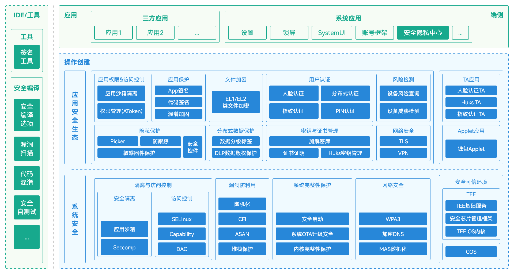
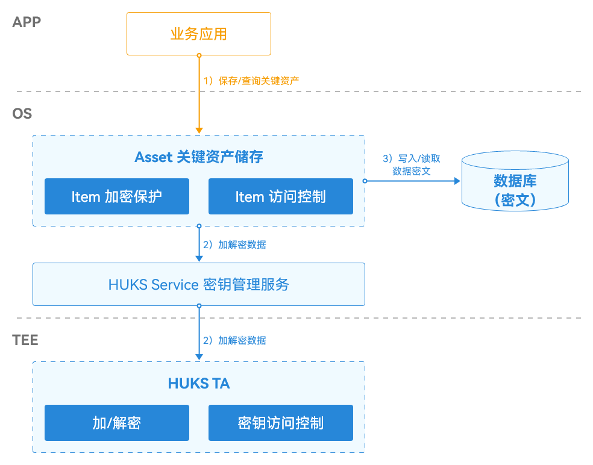
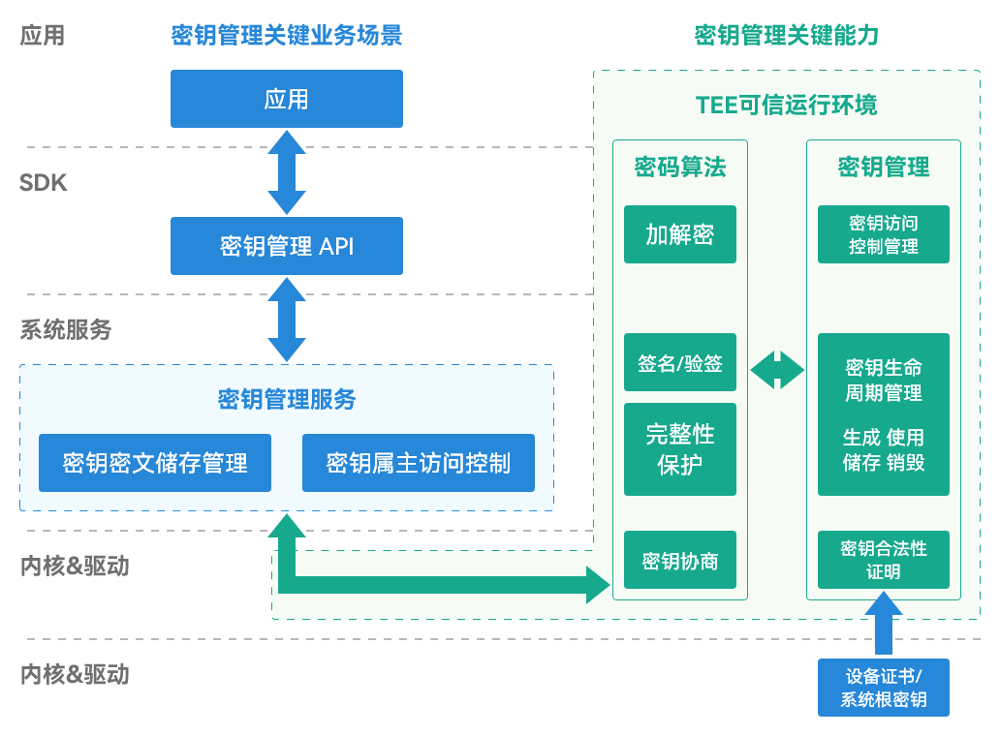
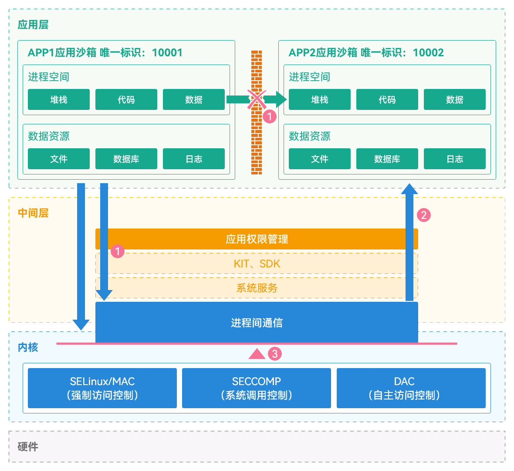

# 应用资产保护设计

更新时间：2026-03-12 08:45:02

来源：https://developer.huawei.com/consumer/cn/doc/best-practices/bpta-app-asset-protection-design

## 概述


本文档面向HarmonyOS应用的设计人员，介绍应用在资产保护方案设计中可能遇到的典型场景及推荐设计方案，并提供方案的关键点和参考案例。


## 典型业务场景


HarmonyOS应用资产包括代码、用户数据、安全密钥。数据库资产在服务器侧，由应用自行保护。HarmonyOS系统提供保护机制。

在当前APP开发过程中遇到的实际资产保护业务场景中，总结出以下典型场景，可供更多APP参考，设计资产保护业务方案：


| 场景编号 | 资产保护场景 | 简述 |
| --- | --- | --- |
| 1 | 保护应用代码 | 保护应用代码是为了防止恶意攻击者进行反向工程和盗用。未受保护的代码可能被攻击者获取、修改、复制或分发，导致知识产权被侵犯或应用程序被用于恶意目的，如盗取用户个人信息或进行其他违法活动。 |
| 2 | 保护用户数据 | 用户数据包括个人信息、账户信息、交易记录、位置信息等。若未妥善保护，攻击者可能获取并恶意使用这些数据，如盗取身份信息、银行账户信息等。此外，用户数据保护是监管要求的重点，不当保护会损害应用及HarmonyOS系统的用户口碑。 |
| 3 | 保护应用密钥 | 密钥用于加密和解密数据。密钥泄露导致数据泄露和安全问题。 |


## HarmonyOS安全能力整体架构


### HarmonyOS安全能力概述


HarmonyOS安全能力全景图如下：





系统安全：

系统安全基于硬件构建安全可信根。多种技术从底层构建HarmonyOS系统安全底座。这些技术包括访问控制、漏洞防利用、系统完整性保护和网络安全保护。

应用安全生态：

HarmonyOS系统在系统安全底座之上，提供多种安全保护能力。这些能力覆盖应用资产保护的各种场景。HarmonyOS应用可以使用这些能力，保护应用全生命周期内的资产。

HarmonyOS应用：

HarmonyOS应用是自身应用资产的责任方。应用需要按需使用HarmonyOS系统提供的安全能力，并按照推荐的资产保护设计进行保护。


### HarmonyOS资产保护关键技术介绍


代码混淆

移动应用的代码安全非常重要。DevEco Studio默认提供代码混淆能力。混淆后的JS、TS、ArkTS代码难以逆向分析。混淆功能支持对类、方法等名称进行混淆。


代码混淆方案基于源码混淆。源码转换为抽象语法树（AST），在AST上进行作用域和符号分析。混淆名称和属性，移除日志打印代码，合并语句，压缩代码体积。这些操作在保证运行时性能不变的前提下，有效保护开发者核心知识产权。

混淆前：

```ts
function getAgeInfo() {
  let age = 20;
  let name = 'jack';
  if (name) {
    return age;
  } else {
    return -1;
  }
}

console.log('' + getAgeInfo());
```

混淆后：

```ts
function getAgeInfo() {
  let c = 0x14;
  let b = 'jack';
  if (b) {
    return c;
  } else {
    return -0x1;
  }
}

console['log']('' + getAgeInfo());
```

应用加密

HarmonyOS系统提供端到端的应用代码保护机制。该机制以系统安全为基础，构建内核级应用生命周期内的代码安全保护能力。


开发者向应用市场提交上架申请。应用市场审核后，对上架应用进行代码加密。应用在设备上安装时，安装文件仍处于加密状态，有效保护应用程序。应用程序启动时，内核加载的文件按页解密执行。应用加密采用标准AES加密算法，提高应用程序的安全性。

应用包签名

开发者对应用安装包签名后，上架应用市场。应用市场进行上架检测和质量审核。满足上架要求的应用，由应用市场重签名。只有重签名的应用才允许在设备上安装。

HarmonyOS系统对所有安装应用进行签名校验，确保来源可信和完整性。签名校验在应用安装时进行，签名校验失败则禁止安装。HarmonyOS系统使用根CA对应用安装包进行签名校验。签名证书采用证书链方式签署，从根CA开始。

HarmonyOS系统使用根CA对应用程序安装包进行签名校验，应用安装包的签名证书都需要从根CA开始采用证书链的方式签署。

对于调试应用的安装，HarmonyOS系统在校验安装包签名基础上，匹配应用调试Profile中的设备ID与当前设备ID。不匹配则禁止安装。

对于发布应用的安装，HarmonyOS系统仅允许经过应用市场审核并通过重签名的安装包进行安装。

关键资产存储

关键资产存储（Asset Store）提供关键敏感隐私数据的本地加密存储。应用可以将高安全敏感的关键资产短数据（如APP账号密码、银行卡号等）在本地加密存储。加密密钥存储在安全的隔离区，只有合法应用才能访问并解密这些数据。具体的架构如下：





除此之外，关键资产存储还支持以下安全措施：

- 基于属主的访问控制： 所有的关键资产都受属主访问控制保护，业务无需设置。
- 基于锁屏状态的访问控制：分为三种保护等级（安全性依次递增），开机后可访问、首次解锁后可访问、解锁时可访问，业务可根据实际情况设置任意一种，若不设置，则默认保护等级为“首次解锁后可访问”。
- 基于锁屏密码设置状态的访问控制：在用户设置了锁屏密码后，关键资产才被允许访问。
- 基于用户认证的访问控制：任意一种认证方式（指纹、人脸、PIN码）通过，均可授权本次关键资产的访问。


密钥管理

HarmonyOS通用密钥库系统（HarmonyOS Universal KeyStore，HUKS）是HarmonyOS提供的系统级密钥管理服务，支持密钥的全生命周期管理，包括密钥生成、存储、使用和销毁，同时提供密钥的合法性证明。HUKS基于系统安全能力，确保业务密钥的安全，业务无需自行实现相关功能。

HUKS的核心安全设计如下。

密钥不出安全环境：HUKS的核心特点是密钥全生命周期明文不出HUKS Core。在有硬件条件的设备上，如具备TEE（Trusted Execution Environment）或安全芯片的设备，HUKS Core运行在硬件安全环境中，确保即使REE（Rich Execution Environment）环境被攻破，密钥明文也不会泄露。

系统级安全加密存储：基于设备根密钥加密业务密钥。有条件设备叠加用户口令加密。

严格的访问控制：只有合法业务有权访问密钥，支持用户身份认证以满足高安全敏感场景下的密钥访问需求。

密钥的合法性证明：为业务提供硬件厂商级别的证明，确保密钥未被篡改，确保存储在有硬件保护的HUKS Core中，并具备正确的密钥属性。

密钥会话是HUKS中承载密钥使用的基础，主要用于初始化密钥信息和缓存业务数据。数据的密码学运算和密钥密文的加解密都在HUKS Core中进行，以确保密钥明文和运算过程的安全。





## 应用资产保护设计


### 概述


不同的资产保护场景需要的HarmonyOS系统安全能力各不相同，本章将按照常见场景设计相应的HarmonyOS安全保护方案。


### 保护应用代码场景


场景描述

在HarmonyOS应用业务实现过程中，应用代码是最重要的资产和核心。保护不当可能导致严重的知识产权损失和安全攻击。

在HarmonyOS开发中，应用代码分为C/C++实现的代码和JS、TS、ArkTS实现的代码，最终编译产物主要包括.so文件和.abc文件。.so文件反编译难度大，代码逆向困难，应用可按需决定是否进一步保护。.abc文件为ArkTS编译后的字节码，反编译难度小，容易逆向分析出核心代码，建议根据业务情况做一定保护。

HarmonyOS开发实现方案介绍

HarmonyOS系统整体代码资产保护策略：

（1）开发阶段默认启用基础混淆，并支持与第三方商用混淆工具对接。

（2）上架阶段对应用进行加密。

（3）设备运行时对应用进行解密处理。

其中代码混淆和应用加密方案的介绍在混淆加固和应用加密章节。

业务实现中的关键点

DevEco Studio默认开启基础代码混淆

为保护代码资产，编译器默认开启代码混淆功能，混淆参数名和局部变量名。建议保持混淆开启，除非有特殊情况。若需关闭代码混淆，可在模块级的build-profile.json5配置文件中进行设置。

官方提供的自定义混淆选项

DevEco Studio提供高阶混淆能力，开发者可通过以下步骤配置：

1. 打开Stage模型的ArkTS工程。

2. 打开模块级build-profile.json5文件，在obfuscation字段下配置混淆规则。

3. 在混淆规则文件中，files字段配置混淆规则文件路径，高级混淆能力通过将混淆规则写入混淆规则文件实现。

在混淆规则文件中，开发者可以写混淆选项和保留选项，具体的混淆选项参考混淆配置，使用第三方安全加固厂商加固请参考使用第三方加固。

HarmonyOS提供应用加密机制

开发者向应用市场提交上架申请、选择加密并通过审核后，应用市场会对所有上架的应用做代码加密，具体加密的对象为应用包中的.abc文件，并在应用运行加载进内存时，在系统内核进行解密。目标是保护应用程序二进制代码安全，保护开发者知识产权，并避免应用脱离设备后仍能运行。

应用加密主要通过以下三个关键能力实现：

代码加密能力：基于abc文件的加密，兼容快速补丁修复，并采用代码签名机制。

基于动态加载按页解密能力：在内核中按应用加载文件的内存页进行解密，提升解密效率。

密钥分发：通过平台账号的访问控制和设备TEE的设备认证进行密钥分发。

整套方案作为HarmonyOS系统应用安全的基础能力，由应用市场、HarmonyOS内核和终端设备实现，开发者无需进行任何配置和开发。

第三方提供的应用安全加固保护

HarmonyOS在系统提供的应用代码保护机制之外，同时也兼容三方提供的安全加固保护机制，在应用代码资产保护述求较高的场景下，建议在开启系统保护机制情况下，同时使能三方的加固保护，增强代码资产保护的纵深防御能力。部分三方安全厂商已支持HarmonyOS系统，具体方法请参考使用第三方加固。

案例参考

应用代码保护是系统应用安全的基本能力。不同垂类的应用对应用安全加固的要求和实现方式存在差异。以安全性要求最高的金融类应用为例，可以参考以下HarmonyOS应用的实际保护案例：


| 混淆 | 基础混淆 | 使用HarmonyOS官方Arkguard默认配置 |
| --- | --- | --- |
| 增强混淆 | 第三方提供，建议在安全要求较高的场景中选择开启，提高应用代码资产保护的纵深防御能力 |  |
| 加密（应用市场） | 代码加密 | 默认支持，需要上架时选择开启 |
| 加壳 | 加壳 | 禁止 |
| 其他加固 | 防调试 | 在HarmonyOS系统的基础上，第三方提供增强 |
| 防篡改 | 在HarmonyOS系统基础上，三方提供增强 |  |


与业界方案特殊差异说明

平台的应用安全机制和生态情况不同，因此应用加固方案也有所不同。具体区别如下：


| 操作系统 | 应用自保护策略 |
| --- | --- |
| HarmonyOS | 应用加密（建议） + 基础混淆 + 高级混淆（三方提供商业源码级别的混淆工具，安全要求高的场景建议，但需要满足上架审核要求） |
| 其他 | 加壳（主要）/应用加密（主要）+ 普通混淆/高级混淆（商业源码级别的混淆工具，但需要满足上架审核要求） |


### 保护用户数据


场景描述

应用在用户使用过程中会产生用户数据，包括个人信息如姓名、地址、电话号码、电子邮件地址，以及使用过程中的行为数据，如使用时长、功能使用次数。这些数据需根据类型进行保护，以符合监管和隐私要求。本设计文档将用户数据分为普通用户数据和敏感个人数据两类，提供HarmonyOS开发中的保护能力和方案。应用可依据《个人信息保护法》或其他分类方法对数据进行分类。

HarmonyOS开发实现方案介绍

在HarmonyOS系统中，普通用户数据通过每个应用独立的应用沙箱进行隔离。应用沙箱保护机制确保应用无法访问除自身文件目录之外的其他应用或用户的数据。此外，所有应用的目录可见范围均经过权限隔离，仅自身和部分系统进程有权限访问，未授权的第三方应用无法访问。





除此之外，对于一些更加敏感的用户数据，如用户口令、身份证号、银行卡号等，HarmonyOS系统还提供关键资产存储服务，关键资产的安全存储，依赖底层的TEE可信执行环境。具体来说，关键资产的加/解密操作以及访问控制校验，都在安全环境中完成，即使系统被攻破，也能保证用户敏感数据不发生泄露。详细方案可以参考Asset Store Kit简介。

业务实现中的关键点

应用沙箱隔离及应用文件路径

应用沙箱限定了应用可访问的数据范围。在“应用沙箱目录”中，应用仅能访问自己的文件和必需的系统文件。因此，本应用的文件不会被其他应用访问，从而确保了应用文件的安全。

开发指导可以参考应用沙箱目录。

关键资产存储服务使用

HarmonyOS系统通过Asset Store Kit为应用开发者提供关键资产的安全存储与管理服务。

开发指导及相关案例可参考Asset Store Kit（关键资产存储服务）。

与业界方案特殊差异说明

应用开发者可以参考业界的类似方案来设计和使用本能力。


### 保护应用密钥


场景描述

在HarmonyOS中用于加密和解密数据的密钥是其非常重要且需要保护的资产之一。密钥的主要使用场景包括：

- 数据加密: 应用密钥可以用于加解密重要数据；
- 应用安全: 应用密钥可以用于保护应用免受恶意攻击；
- 数据完整性验证: 应用密钥可以用于验证数据的完整性，确保数据在传输或存储过程中没有被篡改；
- 应用身份验证: 应用密钥可以用于验证应用或服务器身份。


开发指导及相关案例可参考Universal Keystore Kit简介。

与业界方案特殊差异说明

本方案的核心层运行在硬件安全环境中，除此之外，与行业标准方案没有显著差异。


## 参考


鸿蒙生态应用安全技术白皮书
