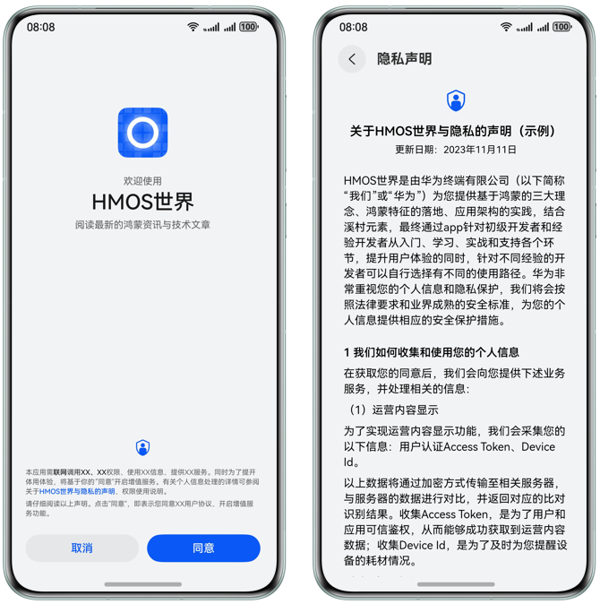
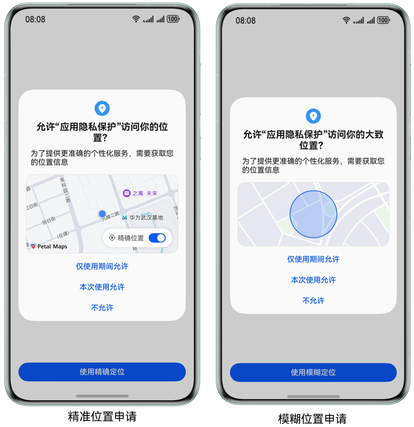
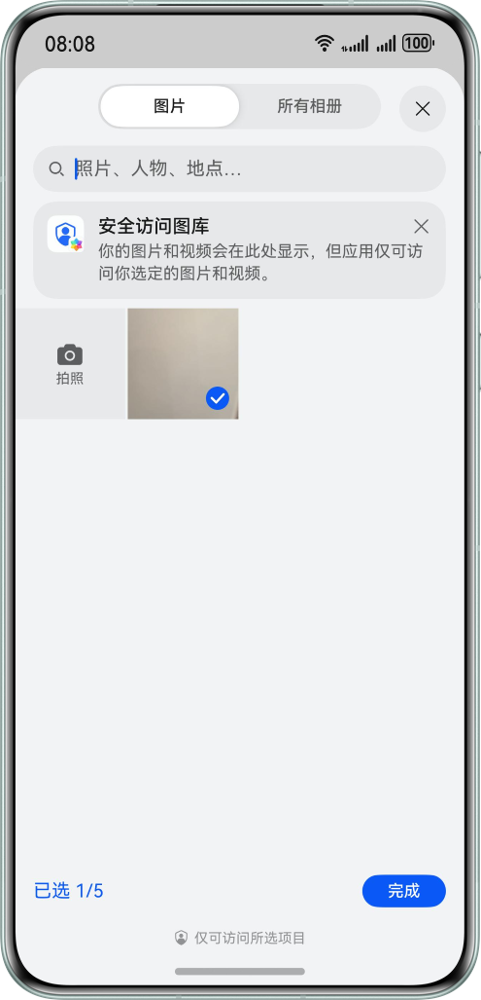

# 应用隐私保护

更新时间：2026-05-18 00:55:31

来源：https://developer.huawei.com/consumer/cn/doc/best-practices/bpta-app-privacy-protection

#### 概述
移动终端及其相关业务（如移动支付、终端云）的普及，使用户隐私保护的重要性更加突出。隐私保护尊重个人权利、增加用户信任、确保个人信息安全，也是法律法规的要求。个人信息泄露和滥用可能导致个人诈骗、身份盗用、恶意广告等不良后果。
隐私是用户的基本权利，HarmonyOS重视用户隐私。隐私保护措施能降低个人信息滥用风险，保护用户财产和利益。良好隐私保护有助于建立用户信任，保护用户和企业利益。
为了应用隐私保护，开发者需要了解以下基本信息：
1. 什么是隐私数据：根据个人数据的敏感程度，个人数据分为敏感个人数据和一般个人数据。健康、性生活、个人基因、宗教信仰、生物体征等属于敏感数据。
2. [隐私保护的原则](#section137983974814)。
3. 隐私保护的措施：隐私保护的一些建议和方法，以及隐私保护的一些[最佳实践](#section182128512489)。

#### 隐私保护的原则
应用开发者在产品设计阶段应考虑用户隐私保护，提高应用安全性。HarmonyOS应用开发需遵从隐私保护规则，应用上架时，应用市场将根据规则校验，不满足条件则无法上架。应遵循以控制力、透明度和数据最小化为核心的隐私保护原则：
1. 数据收集及使用公开透明应用采集个人数据时，应告知用户个人信息的使用方式。
2. 数据收集和使用最小化应用收集个人数据应与目的相关，适当、必要。开发者应匿名化或化名个人数据，降低风险。仅收集和处理必需的个人数据，不进行无关处理。
3. 数据处理选择和控制处理个人数据需征得用户同意，用户有充分的控制权。
4. 数据安全技术上保证数据处理的安全性，包括加密存储和安全传输，系统默认开启或采取安全保护措施。
5. 本地化处理应用开发时，数据优先在本地处理。本地无法处理的数据上传至云服务时，应遵循最小化原则，不得默认选择上传。
6. 未成年人数据保护要求如果应用面向未成年人，或通过用户年龄数据识别出未成年人，开发者应根据目标市场的相关法律，专门分析未成年人个人数据保护问题，并在收集未成年人数据前征得监护人同意。

#### 隐私保护常用方法
下面我们列举了应用隐私保护的一些常用方法。
1. 使用隐私声明获取用户同意。应用采集个人数据时，应告知用户个人信息的使用方式。例如，应用启动时使用隐私声明弹窗说明敏感数据的使用和收集，获得用户同意后才能获取数据。
2. 减少应用的位置信息访问权限。应用不是强位置关联应用（如导航、运动健康等），推荐使用模糊定位。
3. 减少使用存储权限。过多的存储访问权限可能会导致用户隐私数据的泄露，应该减少使用存储权限，仅请求访问应用程序所需的数据，可以用Picker来减少对用户存储数据的访问权限。
4. 动态申请敏感权限。申请敏感权限需满足最小化要求，只申请必需的信息或资源权限，减少权限滥用和敏感数据泄露。
5. 数据加密处理。技术上保证数据处理的安全性，包括加密存储和安全传输，应默认开启或采取安全保护措施。 存储敏感数据应该进行加密处理，具体可以参考《应用数据安全》。

#### 隐私保护最佳实践
下面介绍一些隐私保护的最佳实践，开发者可以参考这些实践解决应用的隐私保护问题。

#### 使用隐私声明获取用户同意
安装或使用应用程序时，应用程序可能请求访问敏感权限，如相机、麦克风、通讯录、位置等。应用程序需通过隐私声明弹窗，事先说明授权目的和使用方式，确保用户全面了解个人数据的使用情况。
隐私声明弹窗的作用包括以下几个方面：
1. 增强用户控制权：隐私声明弹窗允许用户授权或拒绝应用程序访问敏感权限，从而增强对个人数据的控制。
2. 保护用户隐私：隐私声明弹窗确保用户在同意授权前了解应用程序如何使用个人数据，防止滥用，保护隐私权益。
3. 增强透明度：隐私声明弹窗为用户提供应用程序的数据使用透明度。弹窗中提供详细说明，用户了解所需权限及其使用目的，从而放心做出授权决策。
隐私声明弹窗在HarmonyOS中用于保护用户隐私权益，增强用户对个人数据的控制。它提供透明度和选择权，使用户了解应用程序的权限要求，并自主决定是否授权。
例如在[“HMOS世界”](https://gitcode.com/harmonyos_samples/hmosworld)中使用了隐私声明的弹窗，具体实现可以参考代码[SafePage.ets](https://gitcode.com/harmonyos_samples/hmosworld/blob/master/HMOSWorld/Application/products/phone/src/main/ets/pages/SafePage.ets)。应用首次启动后，会弹出该弹窗，当应用获得用户授权同意后，应用才能开始正常使用。



#### 减少应用的位置信息访问权限
限制应用的位置信息访问权限，保护个人隐私。
仅在应用程序需要位置信息才能正常运行时，才申请位置权限，否则应避免请求该权限，以保护用户隐私和数据安全。需要申请位置权限时，提供详细说明和合理解释，确保用户了解应用访问位置信息的必要性。
根据场景需要，使用模糊定位减少应用的位置信息访问权限。
**使用模糊定位获取位置信息**
对于大多数与位置相关的场景，请求粗略位置信息的访问权限即可满足要求。例如，天气应用可以基于用户所在城市或地区提供准确的天气预报，而无需获取具体经纬度。HarmonyOS在API9以后，提供模糊位置信息的能力，可为应用提供精确到5公里内的用户位置估算值，这种精度对应用的许多功能而言已足够。
表1 位置权限申请方式介绍

| target API level | 申请位置权限 | 申请结果 | 位置的精确度 |
| --- | --- | --- | --- |
| 小于9 | ohos.permission.LOCATION | 成功 | 获取到精准位置，精准度在米级别。 |
| 大于等于9 | ohos.permission.LOCATION | 失败 | 无法获取位置。 |
| 大于等于9 | ohos.permission.APPROXIMATELY_LOCATION | 成功 | 获取到模糊位置，精确度为5公里。 |
| 大于等于9 | 同时申请ohos.permission.APPROXIMATELY_LOCATION和ohos.permission.LOCATION | 成功 | 获取到精准位置，精准度在米级别。 |

在API9以后，当应用同时申请 `ohos.permission.APPROXIMATELY_LOCATION` 和 `ohos.permission.LOCATION` 权限时，可以获取用户精准位置，精准度达到米级。如果应用仅申请 `ohos.permission.APPROXIMATELY_LOCATION` 权限，权限弹框仅显示模糊位置权限。用户授权后，应用将获得模糊位置权限，只能获取模糊位置。这两种情况下的权限申请弹框如下：
**图1 **权限申请弹窗


接下来介绍模糊位置申请的实现方法：
1. 在module.json5配置文件中声明ohos.permission.APPROXIMATELY_LOCATION权限。 {
  "module": {
 // ...
 "requestPermissions": [
 {
 "name": "ohos.permission.APPROXIMATELY_LOCATION",
 "reason": "$string:location_reason",
 "usedScene": {
 "abilities": [
 "EntryAbility"
 ],
 "when": "always"
 }
 },
 // ...
 ]
  }
}
2. 在需要使用位置信息的代码块中，动态申请 ohos.permission.APPROXIMATELY_LOCATION权限。 const accessManager = abilityAccessCtrl.createAtManager();
 accessManager.requestPermissionsFromUser(this.getUIContext().getHostContext(),
 ['ohos.permission.APPROXIMATELY_LOCATION'])
 .then((data) => {
 let grantStatus: Array&lt;number&gt; = data.authResults;
 if (grantStatus.length > 0 && grantStatus[0] === 0) {
 // The user is authorized to continue to access the target operation
 Logger.info('request permissions granted');
 // ...
 } else {
 // The user rejects the authorization
 Logger.info('request permissions denied');
 // ...
 }
 Logger.info(`request permissions result: ${JSON.stringify(data)}`);
 })
3. 获取位置信息的接口相同，但模糊定位和精确定位的返回结果精确度不同。 let requestInfo: geoLocationManager.LocationRequest = {
  'priority': geoLocationManager.LocationRequestPriority.FIRST_FIX,
  'scenario': geoLocationManager.LocationRequestScenario.UNSET,
  'timeInterval': 1,
  'distanceInterval': 0,
  'maxAccuracy': 0
};
geoLocationManager.getCurrentLocation(requestInfo).then(result => {
  Logger.info(`geoLocation current location:error: ${JSON.stringify(result)}`)
  // ...
}).catch((error: BusinessError) => {
  Logger.error(`geoLocation getCurrentLocation: error: ${JSON.stringify(error)}`)
});

> [!NOTE] 说明
> 权限的申请具体可以参考：向用户申请授权。

#### 减少使用存储权限
应用获取“存储”权限后，能够读取手机内部存储上的所有文件，包括所有照片，这会带来隐私风险：它可能在用户不知情的情况下，分析文件和图片，泄露用户隐私。
用户往往不愿意授予应用对其所有照片和视频的访问权限。因此，HarmonyOS在API9版本之后引入了Picker选择器，以满足用户正常的数据访问需求，同时最小化应用的数据泄露风险。通过减少授权范围，降低授权的颗粒度，例如用户在发送图片时，仅允许应用访问用户选择的图片。


示例代码如下：

```ArkTS
import { photoAccessHelper } from '@kit.MediaLibraryKit';
import { BusinessError } from '@kit.BasicServicesKit';
import Logger from '../utils/Logger';

@Entry
@Component
struct PickerDemo {
  @State imageUri: string = '';

  build() {
    RelativeContainer() {
      Image(this.imageUri)
      // ...
      Button($r('app.string.select_picture'))
      // ...
        .onClick(() => {
          const photoSelectOptions = new photoAccessHelper.PhotoSelectOptions();
          photoSelectOptions.MIMEType = photoAccessHelper.PhotoViewMIMETypes.IMAGE_TYPE;
          photoSelectOptions.maxSelectNumber = 5;
          const photoViewPicker = new photoAccessHelper.PhotoViewPicker();
          photoViewPicker.select(photoSelectOptions).then(photoSelectResult => {
            this.imageUri = photoSelectResult.photoUris[0];
            Logger.info(`PhotoViewPicker.select successfully, imageUri: ${this.imageUri}`)
          }).catch((err: BusinessError) => {
            Logger.error(`PhotoViewPicker.select failed with err: ${JSON.stringify(err)}`)
          })
        })
    }
    // ...
  }
}
```

#### 动态申请敏感权限
敏感权限涉及访问个人数据（如：照片、通讯录、日历、本机号码、短信等）和操作敏感能力（如：相机、麦克风等）的权限，所以对于敏感权限的申请需要特别注意。
1. 合理的权限范围：应用程序应仅请求所需敏感权限，并将权限范围限制在最小必要。这可减少权限滥用和数据泄露风险。
2. 明确解释权限用途：应用程序应清楚、明确地说明每个敏感权限的用途，并在隐私政策和其他位置提供此信息。
在module.json5配置文件中声明相机权限，并在reason字段中说明使用目的。

```json
{
  "module": {
    // ...
    "requestPermissions": [
      // ...
      {
        "name": "ohos.permission.CAMERA",
        "reason": "$string:camera_reason",
        "usedScene": {
          "abilities": [
            "EntryAbility"
          ],
          "when": "always"
        }
      }
    ]
  }
}
```


```ts
// string.json
{
  "string": [
    {
      "name": "camera_reason",
      "value": "扫描二维码功能需要使用相机权限扫描图片"
    }
  ]
}
```

在扫码组件的点击事件中动态申请相机权限。

```ArkTS
accessManager.requestPermissionsFromUser(this.getUIContext().getHostContext(), ['ohos.permission.CAMERA'])
  .then((data) => {
    let grantStatus: Array<number> = data.authResults;
    if (grantStatus.length > 0 && grantStatus[0] === 0) {
      Logger.info('request permissions granted');
    } else {
      Logger.info('request permissions denied');
      // ...
    }
  })
```

#### 总结与回顾
本文主要介绍了隐私保护的重要性，列举了隐私保护的一些常见做法，并详细介绍了隐私保护的几个最佳实践：
- 使用隐私声明获取用户同意
- 减少应用的位置信息访问权限
- 减少使用存储权限
- 动态申请敏感权限
请注意，这些HarmonyOS隐私最佳实践适用于常见场景，具体实施策略应根据应用的特定需求和法律法规要求调整。你应该根据应用类型和用户定位，结合适用的隐私法规采取全面且具体的隐私保护措施。

#### 示例代码
- [应用隐私保护实现](https://gitcode.com/harmonyos_samples/BestPracticeSnippets/tree/master/AppPrivacyProtection)