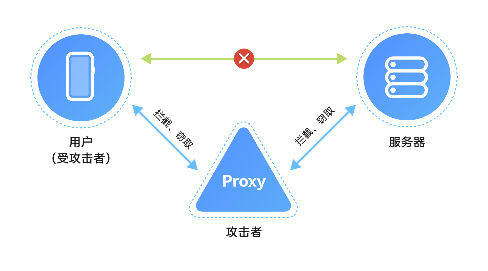

# 网络连接安全配置

更新时间：2026-05-18 00:55:31

来源：https://developer.huawei.com/consumer/cn/doc/best-practices/bpta-network-ca-security

##### 概述

应用与服务器之间的数据传输需确保安全，保护数据的机密性和完整性，防止敏感数据被窃取和篡改。推荐使用传输层安全协议（TLS）保护数据安全。
 
当应用通过HTTPS访问云侧服务器时，如果信任了用户安装的CA证书，用户可以通过网络代理工具（如Fiddler、Charles）对HTTPS消息进行中间人攻击，如查看、篡改请求和响应消息，这可能导致应用或云侧服务器产生安全风险。因此，通过HTTPS访问云侧服务器时，应配置CA证书进行合法性校验。
 
本文介绍如何配置CA证书以进行合法性校验，避免应用或云侧服务器的安全风险。
 



 
 

##### 配置CA证书对服务器进行合法性校验

当应用通过TLS协议连接服务器时，服务器会提供证书链来证明其身份，应用需要使用可信的CA（证书颁发机构）证书对服务器证书链进行合法性校验。
 
服务器根据场景使用不同类型的CA颁发的证书链：
 1. 权威CA证书，如CFCA、GlobalSign CA机构的根CA证书，满足业界管理规范并通过审计认证，可信度高。
2. 企业自建的CA证书，用于企业内部服务器的证书链。企业内部应用直接信任此类CA证书。
 
系统提供3种CA证书管理方式：
 1. 系统预置CA证书：系统预置了业界主流的权威CA证书。
2. 应用管理的CA证书：应用可在Hap内预置可信的CA证书，如企业内部自建的CA证书。
3. 用户安装的CA证书：通过系统设置界面安装的私有CA证书。这类证书可信度较低，可能被用于中间人攻击。
 
开发者应结合应用的业务场景，在不影响业务功能的前提下，合理设置可信CA证书的范围：
 
- 面向互联网用户的应用，建议只[配置信任系统预置的CA证书](#section121091116142117)。
- 只访问企业内部服务器的应用，建议只[配置信任应用管理的CA证书](#section05271716102218)。
- 同时访问企业内部服务器和互联网服务的应用，建议根据访问的服务器域名分别配置[信任系统预置的CA证书](#section121091116142117)或[应用管理的CA证书](#section05271716102218)。
- 应用开发和调测过程中需要进行网络抓包以定位问题和测试，建议仅在调测版本[配置信任用户安装的CA证书](#section12518142215236)。
- 应用需支持通过企业代理服务器访问应用服务器，可信任企业MDM系统或设备管理员用户手动安装[CA证书](#section12518142215236)。然而，设备管理员用户可能通过代理工具抓取应用网络数据，建议在应用层实施安全防护，如对敏感数据进行二次加密或签名。
- 对于需要较高网络安全的应用（如金融支付、银行类应用），配置CA证书后，通过[SSL Pinning方式](#section4337175511234)绑定服务器证书的公钥，以增强安全性。

 
 

##### 网络连接安全配置

 

##### 配置信任系统预置的CA证书

面向互联网用户提供服务的应用，通常只需信任系统预置的CA证书。[Network Kit（网络服务）](https://developer.huawei.com/consumer/cn/doc/harmonyos-guides/network-kit)和[Remote Communication Kit（远场通信服务）](https://developer.huawei.com/consumer/cn/doc/harmonyos-guides/remote-communication-kit-guide)的HTTPS连接已默认信任系统预置的CA证书。
> [!NOTE]
> 系统Network Kit和Remote Communication Kit的HTTPS连接默认信任系统预置的CA证书和用户安装的CA证书，可 配置不信任用户安装的CA证书 提升安全性。

 
 
如果应用使用第三方库进行网络连接，需要手动设置系统预置的CA证书路径：/etc/security/certificates。
 
**示例**
 
使用三方库[curl](https://gitee.com/openharmony-sig/tpc_c_cplusplus/tree/master/thirdparty/curl)进行HTTPS连接，通过下面代码设置信任的CA证书路径：
 
```text
curl_easy_setopt(curl, CURLOPT_CATH, "/etc/security/certificates");
```
 
 

##### 配置不信任用户安装的CA证书

**Network Kit和Remote Communication Kit配置不信任用户安装的CA证书**：在src/main/resources/base/profile/network_config.json[配置文件](https://developer.huawei.com/consumer/cn/doc/harmonyos-guides/http-request#配置证书校验)中进行配置。
 
```json
{
  "network-security-config": {
    ... ...
  },
  "trust-global-user-ca": false,  //Configure whether to trust the CA certificate manually installed by the enterprise MDM system or device administrator. The default value is true
  "trust-current-user-ca": false  // Configure whether to trust the CA certificate installed by the current user. The default value is true
}
```
 
 

##### 配置信任应用管理的CA证书

如果应用服务器使用企业内部自建的CA证书，可以在Hap包中预置这些CA证书，并配置信任。
 
- Network Kit和Remote Communication Kit可以通过src/main/resources/base/profile/network_config.json文件进行配置。例如，可以将应用级信任的 CA 证书预置到/data/storage/el1/bundle/entry/resources/resfile/appCaCert目录，将特定域名信任的CA 证书预置到/data/storage/el1/bundle/entry/resources/resfile/domainCaCert目录。
```json
{
  "network-security-config": {
    "base-config": {
      "trust-anchors": [
        {
          "certificates": "/data/storage/el1/bundle/entry/resources/resfile/appCaCert"
        }
      ]
    },
    "domain-config": [
      {
        "domains": [
          {
            "include-subdomains": true,
            "name": "example.com"
          }
        ],
        "trust-anchors": [
          {
            "certificates": "/data/storage/el1/bundle/entry/resources/resfile/domainCaCert"
          }
        ]
      }
    ]
  }
}
```
 Network Kit也支持在发起HTTPS请求的代码中[指定信任的CA证书路径](https://developer.huawei.com/consumer/cn/doc/harmonyos-references/js-apis-http#httprequestoptions)：

  
```ArkTS
httpRequest.request( 'EXAMPLE_URL',  {
  method: http.RequestMethod.POST,
  header: {
    'Content-Type': 'application/json'
  },
  extraData: 'data to send',
  expectDataType: http.HttpDataType.STRING,
  connectTimeout: 60000,
  caPath:'/data/storage/el1/bundle/entry/resources/resfile/domainCaCert', // Specifies the trusted CA certificate path
}, (err: BusinessError, data: http.HttpResponse) => {
  // ...
})
```
 Remote Communication Kit也支持在代码中[指定信任的CA证书路径](https://developer.huawei.com/consumer/cn/doc/harmonyos-references/remote-communication-rcp#certificateauthority)：

  
```ArkTS
const caPath: rcp.CertificateAuthority = {
  folderPath: '/data/storage/el1/bundle/entry/resources/resfile/appCaCert', // Specify trusted CA certificate path
}
const securityConfig: rcp.SecurityConfiguration = {
  remoteValidation: caPath
};
// Use the security configuration in the session creation
const sessionWithSecurityConfig = rcp.createSession({ requestConfiguration: { security: securityConfig } });
```


 

> [!NOTE]
> 系统Network Kit和Remote Communication Kit在完成上述配置后，HTTPS连接仍信任系统预置的CA证书和用户安装的CA证书。如需提升安全性，可 配置不信任用户安装的CA证书 。

 
 
- 如果应用使用三方库进行网络连接，需要在代码中设置应用管理的CA证书路径。例如，使用三方库[curl](https://gitee.com/openharmony-sig/tpc_c_cplusplus/tree/master/thirdparty/curl)进行HTTPS连接时，可以通过以下代码设置信任的CA证书路径：
```text
curl_easy_setopt(curl, CURLOPT_CATH, "/data/storage/el1/bundle/entry/resources/resfile/domainCaCert");
```


 
 

##### 配置信任用户安装的CA证书

用户安装的CA证书可信度较低，除以下场景外，建议应用不信任用户安装的CA证书：
 1. 应用开发和调测过程中需要进行网络抓包以定位问题和测试。用户通过系统的设置界面安装的CA证书，保存在目录：**/data/certificates/user_cacerts/{userid}** ，其中 userid 从100开始。**注意：**在商用发布的应用版本中应该不信任用户安装的CA证书。
2. 面向2B企业应用的场景，应用需支持通过企业代理服务器访问应用服务器。设备需通过企业的MDM系统或设备管理员用户手工安装CA证书，并保存在目录：**/data/certificates/user_cacerts/0**。
 
 

##### 配置SSL Pinning证书锁定

应用默认信任系统预置的CA证书。如果预置的CA颁发了不可信证书，应用将面临攻击风险。对于需要高网络安全的应用，如金融支付和银行类应用，可以通过配置SSL Pinning证书锁定方式，仅信任指定服务器证书的公钥。
 
配置SSL Pinning支持两种方式。如果服务器域名固定，建议采用静态SSL Pinning。否则，采用动态SSL Pinning。
 
> [!NOTE]
> SSL Pinning要求应用云侧服务器证书的公钥不能变化。如果公钥发生变化，需要修改应用内配置的证书公钥，否则应用的网络连接将失败。因此，建议SSL Pinning配置始终包含至少一个备用公钥。 应用还可以设置SSL Pinning的到期时间。到期后，证书将不再被锁定，这有助于在服务器证书公钥变化时防止尚未更新的应用出现连接问题。然而，设置SSL Pinning的到期时间可能会使攻击者绕过证书锁定。 请开发者评估并决定是否配置SSL Pinning证书锁定。如果应用在应用层对敏感信息进行了加密或签名，则安全风险较低。

1. 通过network_config.json文件进行静态SSL Pinning配置：
```json
{
  "network-security-config": {
    "domain-config": [
      {
        "domains": [
          {
            "include-subdomains": true,
            "name": "server.com"
          }
        ],
        "pin-set": {
          "expiration": "2024-11-08",
          "pin": [
            {
              "digest-algorithm": "sha256",
              "digest": "g8CsdcpyAKxmLoWFvMd2hC7ZDUy7L4E2NYOi1i8qEtE=" // Hash of the server certificate public key
            }
          ]
        }
      }
    ]
  }
}
```
 具体可参考配置指导的[“证书锁定”](https://developer.huawei.com/consumer/cn/doc/harmonyos-guides/http-request#证书锁定)章节。
2. 通过在代码中动态设置进行动态SSL Pinning配置：
Network Kit配置动态SSL Pinning：
```xml
certificatePinning: [ //Optional, supports dynamic setting of certificate lock configuration information. This property is supported since API 12
   {
     publicKeyHash: 'g8CsdcpyAKxmLoWFvMd2hC7ZDUy7L4E2NYOi1i8qEtE=', // Hash of the server certificate public key
     hashAlgorithm: 'SHA-256' 
   }, {
     publicKeyHash: 'MGFiY2UyMDk5ZjEyMzI3MWQ4MDMyY2E4ODEzMmY3EtE=', // Hash of the secondary public key of the server certificate
     hashAlgorithm: 'SHA-256' 
   }
 ]
```
 具体可参考配置指导的[“certificatePinning”参数说明](https://developer.huawei.com/consumer/cn/doc/harmonyos-references/js-apis-http#httprequestoptions)。
3. Remote Communication Kit配置动态SSL Pinning：
```ArkTS
const keyHash: string = 'g8CsdcpyAKxmLoWFvMd2hC7ZDUy7L4E2NYOi1i8qEtE='; // Public key of the server certificate
const session = rcp.createSession();
const request = new rcp.Request(HTTP_SERVER);
const pin: rcp.CertificatePinning = {
  kind: 'public-key',
  publicKeyHash: keyHash,
  hashAlgorithm: 'SHA-256'
};
request.configuration = {
  security: {
    certificatePinning: pin,
  }
};
const resp = await session.fetch(request);
```
 具体可参考配置指导的[“certificatePinning”参数说明](https://developer.huawei.com/consumer/cn/doc/harmonyos-references/remote-communication-rcp#securityconfiguration)。
