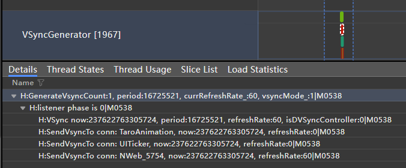
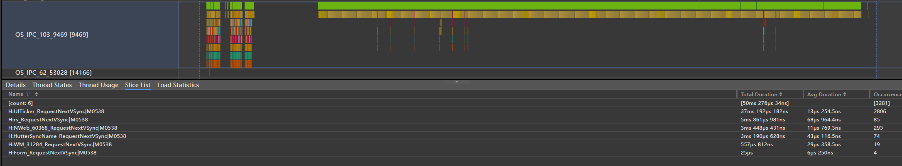
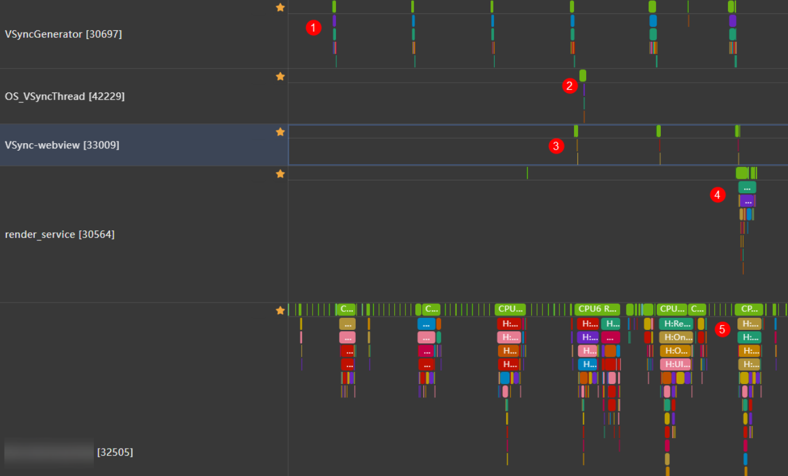
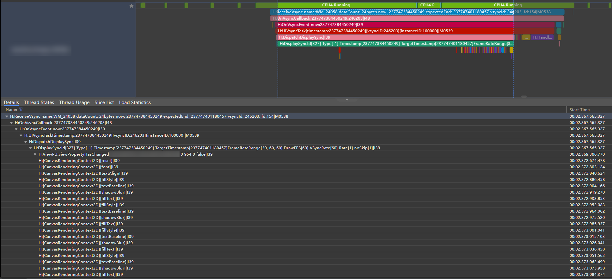
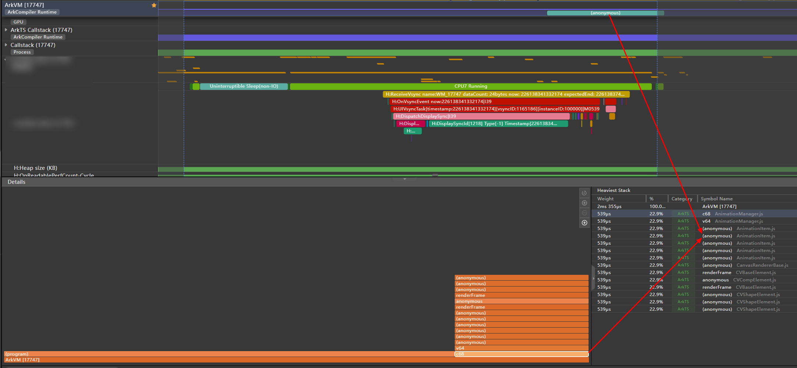
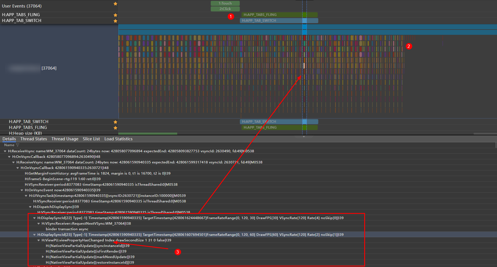
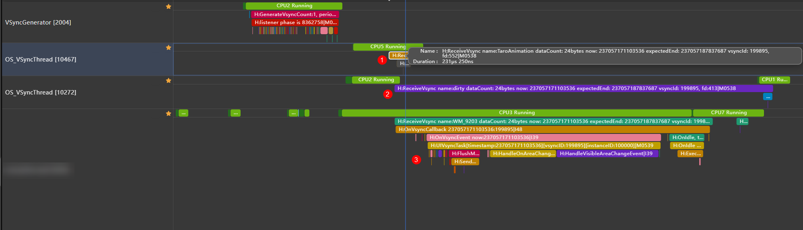
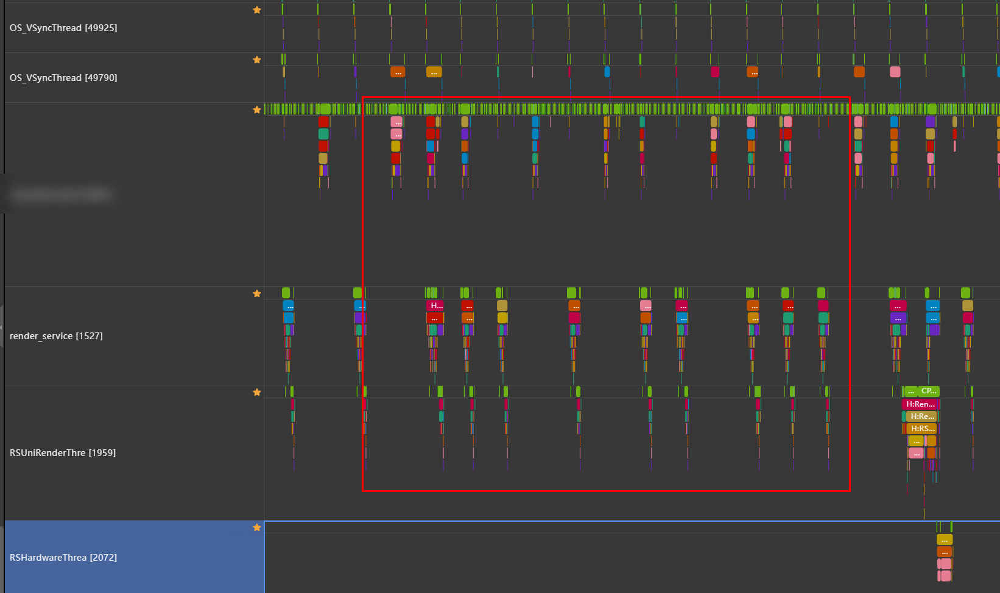
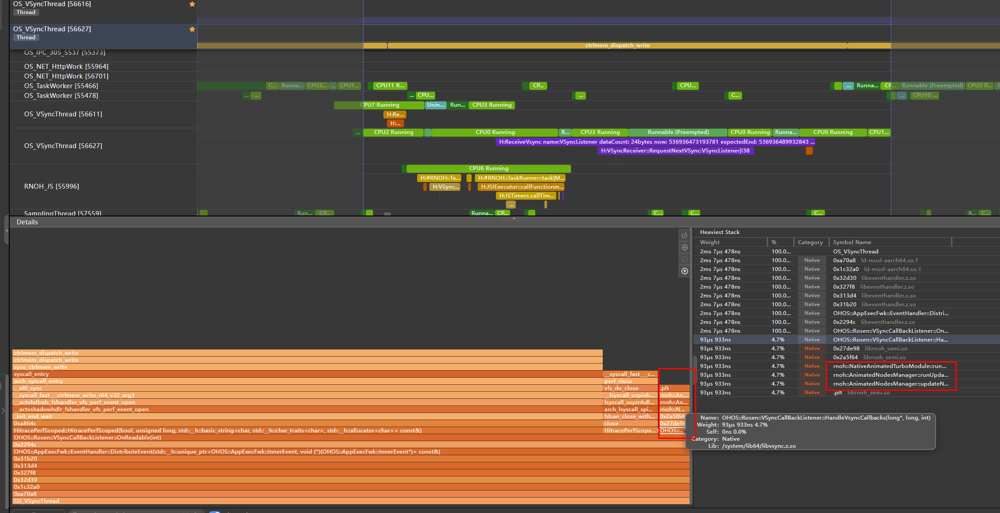

# Vsync低功耗优化

更新时间：2026-03-12 08:45:02

来源：https://developer.huawei.com/consumer/cn/doc/best-practices/bpta-vsync-power-optimization

## 概述


对于HarmonyOS而言，不同来源和架构的绘制请求均通过Render Service（渲染服务）进行统一管理。为了确保不同来源的复杂绘制效果能在同一时间节点完成绘制、合成与显示，Render Service依赖Vsync实现全局统一的信号收发机制。如果将Render Service比作一个运行有序的公交系统，那么VsyncGenerator子进程便是始发站，而RSHardware子进程则代表终点站，即屏幕显示。每个需要使用Vsync的“乘客”都可以申请一张“车票”，VsyncGenerator线程会统计每个申请者的信息，确定合理的发车频率，如30、60、120Hz，经过后续的绘制和合成步骤后，最终反映在屏幕的刷新帧率上。


## 分析思路


开发者可以在Profiler中抓取trace后，搜索以下关键的Trace点来分析一段时间内的Vsync申请和使用情况：

- 关键字“H:SendVsyncTo conn: xxx”：通常可以在VsyncGenerator进程中找到，显示该次发车的乘客数量。开发者可以在Profiler中搜索该trace点，以获取一定时间段内所有绘制请求者的信息。如下图所示，表明该次Vsync信号将发送给TaroAnimation、UITicker和Nweb_5754三个接收者。



- 关键字“H:xxx_RequestNextVsync”：表明申请者xxx请求了下一帧的Vsync车票，这一信息通常由其他绘制业务进程生成，并传递至RS的OS_IPC线程中。在实际应用中，除了ArkUI组件和第三方框架会申请Vsync外，一些帧回调函数也可能发起Vsync请求。例如，在一个应用静置场景中，请求者UITicker以60Hz的频率持续请求Vsync，而WM_31284（负责启动应用主进程）和RS（负责启动RS）的实际请求次数较少。实际上，这一请求行为源于React Native框架代码中默认存在的onUITick帧回调函数，该问题在[react-native-harmony 0.72.70](https://gitcode.com/openharmony-sig/ohos_react_native/blob/5.1.0.404SP1-0.72.70/docs/zh-cn/release-notes/react-native-harmony-v5.1.0.404SP1.md)后续版本中得到了修复。此外，一些开发者还会使用[displaySync](https://developer.huawei.com/consumer/cn/doc/harmonyos-references/js-apis-graphics-displaysync#displaysynccreate)、[postFrameCallback](https://developer.huawei.com/consumer/cn/doc/harmonyos-references/arkts-apis-uicontext-uicontext#postframecallback12)等方法实现帧回调效果。建议开发者尽可能避免在所有场景下使用此类帧回调函数，而应选择性地动态开启或关闭，在页面内容长时间无变化时停止回调，当有滑动或动画效果时再重新开启。



- 关键字“H:ReceiveVsync name:xxx”：表明一个名为xxx的申请者消费了一帧Vsync的检票证明，这一进程通常会在之后拉起更多绘制逻辑，如下图中Vsync_webview、OS_VsyncThread、前台应用主线程以及Render Service均有被拉起的行为。其中前台应用进程的ArkUI组件刷新往往对应着ReceiveVsync name：WM_[进程号]，而对于一些非ArkUI的绘制组件，例如React Native、Flutter等组件往往依赖进程下的OS_VsyncThread来接受Vsync。开发者在进行Vsync分析时，可以按照下图所示的结构将VsyncGenerator与所有被拉起的进程置顶排列在一起，根据ReceiveVsync name来匹配到绘制对象，不同来源的绘制对象可能接收到的Vsync周期不同，表现为各自按需取用互不干涉。



在理解了Vsync的基础作用后，开发者需认识到Vsync的主要用途是保证绘制信号的垂直统一，对于开发者而言，需尽量避免在静置或单一组件刷新的页面中使用冗余的Vsync信号。从实际开发的角度上来看，displaySync和NativeVsync两种接口可能会对场景下的Vsync对象产生实质性的影响。对于使用了React Native、Webview、Flutter的应用，开发者可以通过Vsync的分析方法挖掘潜在功耗问题，不仅可以避免发生Vsync“发空车”导致带来冗余功耗，还可以规避实际没有显示的冗余绘制内容。下面给出了一些Vsync合理使用的低功耗建议。

- 应用使用displaySync方法实现绘制对象时，需做好生命周期管理。当对应的绘制对象被遮挡、划出屏幕或跳转至其他页面时，需要及时停止或销毁该对象，否则可能会产生冗余绘制。
- 应用在调用NativeVsync方法，或使用了对NativeVsync有一定封装的三方框架如React Native、Taro时，应当具备NativeVsync对象的管理意识，及时销毁无需显示的Vsync动效。


## displaySync优化案例


### 问题现象


displaySync方法支持让开发者以指定帧率来运行UI业务，一般用于开发者自绘制UI，并且对于帧率有特定诉求的场景。通过这种方式创建的对象需由开发者对其做好生命周期管理，确保绘制内容处于屏幕外或不再需要时，应注销displaySync对象，避免应用进程空刷帧。下图中展示了一个错误使用displaySync实现Canvas弹幕功能的场景，当弹幕组件正常显示时以60hz的频次刷新，但当用户关闭弹幕功能时，依然可以发现有displaySync对象持续执行业务。该有问题的UI帧表现的现象有：

- Trace点H:DispatchDisplaySync下方，含有DisplaySyncId[327]对象，持续时间为4ms，同时右侧打印信息还包含了帧率信息“DrawFPS[60] VsyncRate[60]”。
- 该UI帧整体表现为左大右小，其中与ArkUI脏区组件刷新相关的FlushRenderTask下并无Trace点，表明并无任何一处ArkUI脏区在该帧中进行了脏区任务。
- FlushMessage下并没有H:MarshRSTransactionData送出，表明该段绘制内容在UI侧被拦截并没有成功SendCommand，不会将该指令下发给RS，仅造成UI空跑。



进一步展开DisplaySync下方的Trace信息可以发现，其中包含了大量的CanvasRenderingContext2D业务，其中，H:ViewPU.viewPropertyHasChanged位置，会打印出对应的ArkUI组件名称，帮助开发者定位到正在执行业务的组件。锁定可能造成问题的组件后，开发者可找到displayVsync对象的create、start以及stop三个关键状态控制的对应代码。


> [!NOTE]
> 在分析DisplaySync业务时，开发者在抓取trace前可开启debug开关，hdc shell param set persist.ace.debug.enabled 1，并重启手机。当DisplaySync实际造成了组件的属性变化时，才会打印H:ViewPU.viewPropertyHasChanged信息。当DisplaySync注册仅用于[帧率监听、回调](https://developer.huawei.com/consumer/cn/doc/harmonyos-faqs/faqs-arkgraphics-2d-2)，且不产生组件属性变化时，开发者可以通过分析该帧的调用栈找出DisplaySync耗时过程中执行的代码逻辑。


如下图所示，DisplaySync对象在回调函数中有动画相关的业务执行，但实际上并未对组件变量产生变化，也没有形成需要脏区绘制指令，仅带来冗余负载。开发者可以通过调用栈锁定冗余的函数以及对应的执行代码段。





### 优化思路


- displaySync对象与组件的生命周期相互绑定，组件销毁时displaySync对象停止并置空，且尽量避免在离线组件中或懒加载预加载场景下提前创建displaySync。
- displaySync对象的运行状态与组件的可见性绑定，可使用onVisibleAreaChange回调监听组件的可见性，当组件不可见时，调用displaySync.stop，重新可见后，调用displaySync.start。


如下两段代码，分别在组件的aboutToDisappear()和onVisibleAreaApproximateChange()函数中对displaySync对象进行了优化处理。其中aboutToDisappear()函数是基于自定义组件生命周期的兜底，确保该组件在被销毁时，displaySync对象不出现泄漏。而onVisibleAreaChange()函数则是针对组件可见性的判断来控制displaySync的播放状态，防止组件进入不可见区域时，displaySync对象依然活跃。

```ts
// 组件卸载时，停止DisplaySync并置空，防止空跑与内存泄露
aboutToDisappear() {
  if (this.backDisplaySyncSlow) {
    this.backDisplaySyncSlow.stop();
    this.backDisplaySyncSlow = undefined;
  }
  if (this.backDisplaySyncFast) {
    this.backDisplaySyncFast.stop();
    this.backDisplaySyncFast = undefined;
  }
}
```


```ts
// 当组件不可见时，暂停DisplaySync对象
.onVisibleAreaChange([0.0, 1.0], (isExpanding: boolean, currentRatio: number) => {
  if (!isExpanding && currentRatio <= 0.0) {
    console.info('Component is completely invisible.');
    if (this.backDisplaySyncSlow) {
      this.backDisplaySyncSlow.stop();
    }
    if (this.backDisplaySyncFast) {
      this.backDisplaySyncFast.stop();
    }
  }
})
```


### 修改效果





如上图所示的Trace中，原始页面中，存在一个对Index组件添加的displaySync对象。用户在“1”处所示的位置点击tab进行了页面的切换，并在“2”处所示的位置，解注册了页面中存在的displaySync对象，UI帧率降至0hz，达成了功耗优化的效果。


## NativeVsync优化案例


### 问题现象


NativeVsync可供开发者获取系统vsync回调，可用于实现应用的绘制帧率与系统帧率同步。NativeVsync被广泛用于React Native以及C-API开发的应用中，这些开发框架中有多种回调函数接口，会通过持续请求Vsync来拉起应用自定义的业务内容。如下图是一个静置页面下的Trace，“1”、“2”均是来自应用进程下的OS_VsyncThread线程，H:ReceiveVsync name分别是TaroAnimation和dirty。从“3”中的trace信息可以发现，FlushRenderTask并未打印需要刷新的ArkUI组件，但FlushMessage下有H:MarshRSTransactionData送出，这表明该帧依然有绘制效果通过UI帧将绘制指令递交给RS。





随后Render Service和RSUniRender会继续处理持续性的绘制指令，但由于DisplayNode并无实际需要显示的内容，最终在RSUniRender上打印DisplayNode skip跳过。该场景下，应用存在UI、Render Service冗余负载类型的空跑现象。





### 分析思路


在定位这类问题时，由开发者自定义的NativeVsync对象通常都会由VsyncGenerator下发给应用进程下的OS_VsyncThread子线程，开发者可以根据Vsync申请者的名称，找到对应的Vsync申请对象。开发者可利用Profiler工具抓取的Callstack来查看对应的Vsync回调内执行的业务内容，如下图所示，开发者在VsyncListener的监听回调中有一小块rnoh的Animate的调用栈，可能正在执行一块动画业务。对于NativeVsync对象而言，系统仅提供回调，并不会约束开发者在回调函数内的业务实现，故而如果开发者在NativeVsync中有较多绘制相关的业务时，需额外留意该绘制业务的启停时机，并且减少不必要Vsync监听器的使用。



