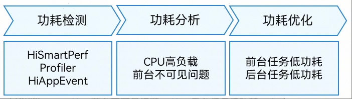

# 功耗概览

更新时间：2026-04-13 06:22:00

来源：https://developer.huawei.com/consumer/cn/doc/best-practices/bpta-power_overview

应用功耗体验是用户在使用应用程序时的重要考量因素之一。在开发过程中，功耗工具开发套件覆盖了应用开发的各个阶段。应用开发完成后上架，有专业的功耗测试工具用于检查和测试应用的功耗指标。功耗最佳实践板块重点介绍了在应用开发过程中使用功耗工具和功耗优化方案来检测、分析和优化功耗问题的流程。
 

#### 功耗工具集定位分析功耗问题流程

 
- HiSmartPerf工具能够快速采集应用帧率、整机功耗及温度等关键信息，并在测试结束后生成测试报告。该工具主要适用于开发人员和测试人员所开展的场景功耗测试。
- Profiler工具是DevEco Studio内置的场景化分析工具。它提供了实时监控（Realtime Monitor）和录制后分析的功能，主要适用于开发人员对应用功耗进行度量与优化的场景。

 
两种工具帮助开发者在开发态评估应用在实际使用中的耗电情况，为持续优化应用功耗提供依据，从而提升用户的续航体验。运行态功耗检测主要基于[HiAppEvent事件订阅](https://developer.huawei.com/consumer/cn/doc/harmonyos-guides/hiappevent)，这是一种系统层面为应用开发者提供的事件打点机制，用于帮助应用记录运行过程中发生的故障信息、统计信息、安全信息及用户行为信息，支持开发者分析应用的运行状况。
 
[功耗分析](https://developer.huawei.com/consumer/cn/doc/best-practices/bpta-application-power-analysis)是综合利用上述工具和能力，旨在精准定位应用的耗电热点，理解功耗在不同场景下的分布，并评估功耗与性能指标（卡顿、帧率）、资源使用（CPU、内存、网络） 之间的关联关系，为后续优化提供数据支撑。
 
[功耗优化](https://developer.huawei.com/consumer/cn/doc/best-practices/bpta-application-power-optimization)的核心目标是：在保障核心功能体验流畅的前提下，最大程度地降低应用在用户各种使用场景的无效能量消耗。最佳实践主要聚焦前台任务和后台任务的优化。
 
功耗优化是一个持续迭代的过程。通过检测->分析-> 优化的闭环，利用提供的工具链，开发者可以系统地提升应用的功耗表现，最终为用户带来更持久的续航体验。
